cola Report for Consensus Partitioning
==================

**Date**: 2019-12-03 22:33:48 CET, **cola version**: 1.3.2

----------------------------------------------------------------

<style type='text/css'>

body, td, th {
   font-family: Arial,Helvetica,sans-serif;
   background-color: white;
   font-size: 13px;
  max-width: 800px;
  margin: auto;
  margin-left:210px;
  padding: 0px 10px 0px 10px;
  border-left: 1px solid #EEEEEE;
  line-height: 150%;
}

tt, code, pre {
   font-family: 'DejaVu Sans Mono', 'Droid Sans Mono', 'Lucida Console', Consolas, Monaco, 

monospace;
}

h1 {
   font-size:2.2em;
}

h2 {
   font-size:1.8em;
}

h3 {
   font-size:1.4em;
}

h4 {
   font-size:1.0em;
}

h5 {
   font-size:0.9em;
}

h6 {
   font-size:0.8em;
}

a {
  text-decoration: none;
  color: #0366d6;
}

a:hover {
  text-decoration: underline;
}

a:visited {
   color: #0366d6;
}

pre, img {
  max-width: 100%;
}
pre {
  overflow-x: auto;
}
pre code {
   display: block; padding: 0.5em;
}

code {
  font-size: 92%;
  border: 1px solid #ccc;
}

code[class] {
  background-color: #F8F8F8;
}

table, td, th {
  border: 1px solid #ccc;
}

blockquote {
   color:#666666;
   margin:0;
   padding-left: 1em;
   border-left: 0.5em #EEE solid;
}

hr {
   height: 0px;
   border-bottom: none;
   border-top-width: thin;
   border-top-style: dotted;
   border-top-color: #999999;
}

@media print {
   * {
      background: transparent !important;
      color: black !important;
      filter:none !important;
      -ms-filter: none !important;
   }

   body {
      font-size:12pt;
      max-width:100%;
   }

   a, a:visited {
      text-decoration: underline;
   }

   hr {
      visibility: hidden;
      page-break-before: always;
   }

   pre, blockquote {
      padding-right: 1em;
      page-break-inside: avoid;
   }

   tr, img {
      page-break-inside: avoid;
   }

   img {
      max-width: 100% !important;
   }

   @page :left {
      margin: 15mm 20mm 15mm 10mm;
   }

   @page :right {
      margin: 15mm 10mm 15mm 20mm;
   }

   p, h2, h3 {
      orphans: 3; widows: 3;
   }

   h2, h3 {
      page-break-after: avoid;
   }
}
</style>


## Summary


All available functions which can be applied to this `res_list` object:


```r
res_list
```

```
#> A 'ConsensusPartitionList' object with 24 methods.
#>   On a matrix with 51941 rows and 70 columns.
#>   Top rows are extracted by 'SD, CV, MAD, ATC' methods.
#>   Subgroups are detected by 'hclust, kmeans, skmeans, pam, mclust, NMF' method.
#>   Number of partitions are tried for k = 2, 3, 4, 5, 6.
#>   Performed in total 30000 partitions by row resampling.
#> 
#> Following methods can be applied to this 'ConsensusPartitionList' object:
#>  [1] "cola_report"           "collect_classes"       "collect_plots"         "collect_stats"        
#>  [5] "colnames"              "functional_enrichment" "get_anno_col"          "get_anno"             
#>  [9] "get_classes"           "get_matrix"            "get_membership"        "get_stats"            
#> [13] "is_best_k"             "is_stable_k"           "ncol"                  "nrow"                 
#> [17] "rownames"              "show"                  "suggest_best_k"        "test_to_known_factors"
#> [21] "top_rows_heatmap"      "top_rows_overlap"     
#> 
#> You can get result for a single method by, e.g. object["SD", "hclust"] or object["SD:hclust"]
#> or a subset of methods by object[c("SD", "CV")], c("hclust", "kmeans")]
```

The call of `run_all_consensus_partition_methods()` was:


```
#> run_all_consensus_partition_methods(data = mat, mc.cores = 4, anno = anno)
```

Dimension of the input matrix:


```r
mat = get_matrix(res_list)
dim(mat)
```

```
#> [1] 51941    70
```

### Density distribution

The density distribution for each sample is visualized as in one column in the
following heatmap. The clustering is based on the distance which is the
Kolmogorov-Smirnov statistic between two distributions.


```r
library(ComplexHeatmap)
densityHeatmap(mat, top_annotation = HeatmapAnnotation(df = get_anno(res_list), 
    col = get_anno_col(res_list)), ylab = "value", cluster_columns = TRUE, show_column_names = FALSE,
    mc.cores = 4)
```


### Suggest the best k


Folowing table shows the best `k` (number of partitions) for each combination
of top-value methods and partition methods. Clicking on the method name in
the table goes to the section for a single combination of methods.

[The cola vignette](http://bioconductor.org/packages/devel/bioc/vignettes/cola/inst/doc/cola.html#toc_13)
explains the definition of the metrics used for determining the best
number of partitions.


```r
suggest_best_k(res_list)
```


|                            | The best k| 1-PAC| Mean silhouette| Concordance|   |Optional k |
|:---------------------------|----------:|-----:|---------------:|-----------:|:--|:----------|
|[SD:kmeans](#SD-kmeans)     |          2| 1.000|           0.975|       0.991|** |           |
|[SD:skmeans](#SD-skmeans)   |          2| 1.000|           0.978|       0.991|** |           |
|[SD:NMF](#SD-NMF)           |          2| 1.000|           0.960|       0.985|** |           |
|[CV:skmeans](#CV-skmeans)   |          2| 1.000|           0.966|       0.986|** |           |
|[ATC:skmeans](#ATC-skmeans) |          4| 1.000|           0.988|       0.994|** |2,3        |
|[MAD:skmeans](#MAD-skmeans) |          3| 0.977|           0.939|       0.974|** |2          |
|[ATC:NMF](#ATC-NMF)         |          4| 0.961|           0.939|       0.972|** |2,3        |
|[CV:NMF](#CV-NMF)           |          2| 0.940|           0.929|       0.973|*  |           |
|[ATC:kmeans](#ATC-kmeans)   |          3| 0.929|           0.885|       0.933|*  |           |
|[SD:pam](#SD-pam)           |          5| 0.919|           0.852|       0.925|*  |2          |
|[ATC:pam](#ATC-pam)         |          6| 0.900|           0.791|       0.920|*  |5          |
|[ATC:mclust](#ATC-mclust)   |          4| 0.886|           0.930|       0.951|   |           |
|[MAD:NMF](#MAD-NMF)         |          2| 0.879|           0.904|       0.961|   |           |
|[CV:kmeans](#CV-kmeans)     |          2| 0.828|           0.890|       0.932|   |           |
|[MAD:kmeans](#MAD-kmeans)   |          2| 0.771|           0.942|       0.951|   |           |
|[CV:pam](#CV-pam)           |          5| 0.770|           0.773|       0.895|   |           |
|[MAD:pam](#MAD-pam)         |          2| 0.766|           0.916|       0.961|   |           |
|[MAD:mclust](#MAD-mclust)   |          4| 0.751|           0.883|       0.916|   |           |
|[SD:hclust](#SD-hclust)     |          2| 0.736|           0.871|       0.942|   |           |
|[ATC:hclust](#ATC-hclust)   |          2| 0.649|           0.867|       0.923|   |           |
|[CV:mclust](#CV-mclust)     |          2| 0.452|           0.775|       0.881|   |           |
|[SD:mclust](#SD-mclust)     |          2| 0.446|           0.870|       0.912|   |           |
|[MAD:hclust](#MAD-hclust)   |          3| 0.415|           0.691|       0.820|   |           |
|[CV:hclust](#CV-hclust)     |          2| 0.289|           0.696|       0.826|   |           |

\*\*: 1-PAC > 0.95, \*: 1-PAC > 0.9


### CDF of consensus matrices

Cumulative distribution function curves of consensus matrix for all methods.


```r
collect_plots(res_list, fun = plot_ecdf)
```


### Consensus heatmap

Consensus heatmaps for all methods. ([What is a consensus heatmap?](http://bioconductor.org/packages/devel/bioc/vignettes/cola/inst/doc/cola.html#toc_9))


<style type='text/css'>


.ui-helper-hidden {
	display: none;
}
.ui-helper-hidden-accessible {
	border: 0;
	clip: rect(0 0 0 0);
	height: 1px;
	margin: -1px;
	overflow: hidden;
	padding: 0;
	position: absolute;
	width: 1px;
}
.ui-helper-reset {
	margin: 0;
	padding: 0;
	border: 0;
	outline: 0;
	line-height: 1.3;
	text-decoration: none;
	font-size: 100%;
	list-style: none;
}
.ui-helper-clearfix:before,
.ui-helper-clearfix:after {
	content: "";
	display: table;
	border-collapse: collapse;
}
.ui-helper-clearfix:after {
	clear: both;
}
.ui-helper-zfix {
	width: 100%;
	height: 100%;
	top: 0;
	left: 0;
	position: absolute;
	opacity: 0;
	filter:Alpha(Opacity=0); 
}

.ui-front {
	z-index: 100;
}


.ui-state-disabled {
	cursor: default !important;
	pointer-events: none;
}


.ui-icon {
	display: inline-block;
	vertical-align: middle;
	margin-top: -.25em;
	position: relative;
	text-indent: -99999px;
	overflow: hidden;
	background-repeat: no-repeat;
}

.ui-widget-icon-block {
	left: 50%;
	margin-left: -8px;
	display: block;
}


.ui-widget-overlay {
	position: fixed;
	top: 0;
	left: 0;
	width: 100%;
	height: 100%;
}
.ui-accordion .ui-accordion-header {
	display: block;
	cursor: pointer;
	position: relative;
	margin: 2px 0 0 0;
	padding: .5em .5em .5em .7em;
	font-size: 100%;
}
.ui-accordion .ui-accordion-content {
	padding: 1em 2.2em;
	border-top: 0;
	overflow: auto;
}
.ui-autocomplete {
	position: absolute;
	top: 0;
	left: 0;
	cursor: default;
}
.ui-menu {
	list-style: none;
	padding: 0;
	margin: 0;
	display: block;
	outline: 0;
}
.ui-menu .ui-menu {
	position: absolute;
}
.ui-menu .ui-menu-item {
	margin: 0;
	cursor: pointer;
	
	list-style-image: url("data:image/gif;base64,R0lGODlhAQABAIAAAAAAAP///yH5BAEAAAAALAAAAAABAAEAAAIBRAA7");
}
.ui-menu .ui-menu-item-wrapper {
	position: relative;
	padding: 3px 1em 3px .4em;
}
.ui-menu .ui-menu-divider {
	margin: 5px 0;
	height: 0;
	font-size: 0;
	line-height: 0;
	border-width: 1px 0 0 0;
}
.ui-menu .ui-state-focus,
.ui-menu .ui-state-active {
	margin: -1px;
}


.ui-menu-icons {
	position: relative;
}
.ui-menu-icons .ui-menu-item-wrapper {
	padding-left: 2em;
}


.ui-menu .ui-icon {
	position: absolute;
	top: 0;
	bottom: 0;
	left: .2em;
	margin: auto 0;
}


.ui-menu .ui-menu-icon {
	left: auto;
	right: 0;
}
.ui-button {
	padding: .4em 1em;
	display: inline-block;
	position: relative;
	line-height: normal;
	margin-right: .1em;
	cursor: pointer;
	vertical-align: middle;
	text-align: center;
	-webkit-user-select: none;
	-moz-user-select: none;
	-ms-user-select: none;
	user-select: none;

	
	overflow: visible;
}

.ui-button,
.ui-button:link,
.ui-button:visited,
.ui-button:hover,
.ui-button:active {
	text-decoration: none;
}


.ui-button-icon-only {
	width: 2em;
	box-sizing: border-box;
	text-indent: -9999px;
	white-space: nowrap;
}


input.ui-button.ui-button-icon-only {
	text-indent: 0;
}


.ui-button-icon-only .ui-icon {
	position: absolute;
	top: 50%;
	left: 50%;
	margin-top: -8px;
	margin-left: -8px;
}

.ui-button.ui-icon-notext .ui-icon {
	padding: 0;
	width: 2.1em;
	height: 2.1em;
	text-indent: -9999px;
	white-space: nowrap;

}

input.ui-button.ui-icon-notext .ui-icon {
	width: auto;
	height: auto;
	text-indent: 0;
	white-space: normal;
	padding: .4em 1em;
}


input.ui-button::-moz-focus-inner,
button.ui-button::-moz-focus-inner {
	border: 0;
	padding: 0;
}
.ui-controlgroup {
	vertical-align: middle;
	display: inline-block;
}
.ui-controlgroup > .ui-controlgroup-item {
	float: left;
	margin-left: 0;
	margin-right: 0;
}
.ui-controlgroup > .ui-controlgroup-item:focus,
.ui-controlgroup > .ui-controlgroup-item.ui-visual-focus {
	z-index: 9999;
}
.ui-controlgroup-vertical > .ui-controlgroup-item {
	display: block;
	float: none;
	width: 100%;
	margin-top: 0;
	margin-bottom: 0;
	text-align: left;
}
.ui-controlgroup-vertical .ui-controlgroup-item {
	box-sizing: border-box;
}
.ui-controlgroup .ui-controlgroup-label {
	padding: .4em 1em;
}
.ui-controlgroup .ui-controlgroup-label span {
	font-size: 80%;
}
.ui-controlgroup-horizontal .ui-controlgroup-label + .ui-controlgroup-item {
	border-left: none;
}
.ui-controlgroup-vertical .ui-controlgroup-label + .ui-controlgroup-item {
	border-top: none;
}
.ui-controlgroup-horizontal .ui-controlgroup-label.ui-widget-content {
	border-right: none;
}
.ui-controlgroup-vertical .ui-controlgroup-label.ui-widget-content {
	border-bottom: none;
}


.ui-controlgroup-vertical .ui-spinner-input {

	
	width: 75%;
	width: calc( 100% - 2.4em );
}
.ui-controlgroup-vertical .ui-spinner .ui-spinner-up {
	border-top-style: solid;
}

.ui-checkboxradio-label .ui-icon-background {
	box-shadow: inset 1px 1px 1px #ccc;
	border-radius: .12em;
	border: none;
}
.ui-checkboxradio-radio-label .ui-icon-background {
	width: 16px;
	height: 16px;
	border-radius: 1em;
	overflow: visible;
	border: none;
}
.ui-checkboxradio-radio-label.ui-checkboxradio-checked .ui-icon,
.ui-checkboxradio-radio-label.ui-checkboxradio-checked:hover .ui-icon {
	background-image: none;
	width: 8px;
	height: 8px;
	border-width: 4px;
	border-style: solid;
}
.ui-checkboxradio-disabled {
	pointer-events: none;
}
.ui-datepicker {
	width: 17em;
	padding: .2em .2em 0;
	display: none;
}
.ui-datepicker .ui-datepicker-header {
	position: relative;
	padding: .2em 0;
}
.ui-datepicker .ui-datepicker-prev,
.ui-datepicker .ui-datepicker-next {
	position: absolute;
	top: 2px;
	width: 1.8em;
	height: 1.8em;
}
.ui-datepicker .ui-datepicker-prev-hover,
.ui-datepicker .ui-datepicker-next-hover {
	top: 1px;
}
.ui-datepicker .ui-datepicker-prev {
	left: 2px;
}
.ui-datepicker .ui-datepicker-next {
	right: 2px;
}
.ui-datepicker .ui-datepicker-prev-hover {
	left: 1px;
}
.ui-datepicker .ui-datepicker-next-hover {
	right: 1px;
}
.ui-datepicker .ui-datepicker-prev span,
.ui-datepicker .ui-datepicker-next span {
	display: block;
	position: absolute;
	left: 50%;
	margin-left: -8px;
	top: 50%;
	margin-top: -8px;
}
.ui-datepicker .ui-datepicker-title {
	margin: 0 2.3em;
	line-height: 1.8em;
	text-align: center;
}
.ui-datepicker .ui-datepicker-title select {
	font-size: 1em;
	margin: 1px 0;
}
.ui-datepicker select.ui-datepicker-month,
.ui-datepicker select.ui-datepicker-year {
	width: 45%;
}
.ui-datepicker table {
	width: 100%;
	font-size: .9em;
	border-collapse: collapse;
	margin: 0 0 .4em;
}
.ui-datepicker th {
	padding: .7em .3em;
	text-align: center;
	font-weight: bold;
	border: 0;
}
.ui-datepicker td {
	border: 0;
	padding: 1px;
}
.ui-datepicker td span,
.ui-datepicker td a {
	display: block;
	padding: .2em;
	text-align: right;
	text-decoration: none;
}
.ui-datepicker .ui-datepicker-buttonpane {
	background-image: none;
	margin: .7em 0 0 0;
	padding: 0 .2em;
	border-left: 0;
	border-right: 0;
	border-bottom: 0;
}
.ui-datepicker .ui-datepicker-buttonpane button {
	float: right;
	margin: .5em .2em .4em;
	cursor: pointer;
	padding: .2em .6em .3em .6em;
	width: auto;
	overflow: visible;
}
.ui-datepicker .ui-datepicker-buttonpane button.ui-datepicker-current {
	float: left;
}


.ui-datepicker.ui-datepicker-multi {
	width: auto;
}
.ui-datepicker-multi .ui-datepicker-group {
	float: left;
}
.ui-datepicker-multi .ui-datepicker-group table {
	width: 95%;
	margin: 0 auto .4em;
}
.ui-datepicker-multi-2 .ui-datepicker-group {
	width: 50%;
}
.ui-datepicker-multi-3 .ui-datepicker-group {
	width: 33.3%;
}
.ui-datepicker-multi-4 .ui-datepicker-group {
	width: 25%;
}
.ui-datepicker-multi .ui-datepicker-group-last .ui-datepicker-header,
.ui-datepicker-multi .ui-datepicker-group-middle .ui-datepicker-header {
	border-left-width: 0;
}
.ui-datepicker-multi .ui-datepicker-buttonpane {
	clear: left;
}
.ui-datepicker-row-break {
	clear: both;
	width: 100%;
	font-size: 0;
}


.ui-datepicker-rtl {
	direction: rtl;
}
.ui-datepicker-rtl .ui-datepicker-prev {
	right: 2px;
	left: auto;
}
.ui-datepicker-rtl .ui-datepicker-next {
	left: 2px;
	right: auto;
}
.ui-datepicker-rtl .ui-datepicker-prev:hover {
	right: 1px;
	left: auto;
}
.ui-datepicker-rtl .ui-datepicker-next:hover {
	left: 1px;
	right: auto;
}
.ui-datepicker-rtl .ui-datepicker-buttonpane {
	clear: right;
}
.ui-datepicker-rtl .ui-datepicker-buttonpane button {
	float: left;
}
.ui-datepicker-rtl .ui-datepicker-buttonpane button.ui-datepicker-current,
.ui-datepicker-rtl .ui-datepicker-group {
	float: right;
}
.ui-datepicker-rtl .ui-datepicker-group-last .ui-datepicker-header,
.ui-datepicker-rtl .ui-datepicker-group-middle .ui-datepicker-header {
	border-right-width: 0;
	border-left-width: 1px;
}


.ui-datepicker .ui-icon {
	display: block;
	text-indent: -99999px;
	overflow: hidden;
	background-repeat: no-repeat;
	left: .5em;
	top: .3em;
}
.ui-dialog {
	position: absolute;
	top: 0;
	left: 0;
	padding: .2em;
	outline: 0;
}
.ui-dialog .ui-dialog-titlebar {
	padding: .4em 1em;
	position: relative;
}
.ui-dialog .ui-dialog-title {
	float: left;
	margin: .1em 0;
	white-space: nowrap;
	width: 90%;
	overflow: hidden;
	text-overflow: ellipsis;
}
.ui-dialog .ui-dialog-titlebar-close {
	position: absolute;
	right: .3em;
	top: 50%;
	width: 20px;
	margin: -10px 0 0 0;
	padding: 1px;
	height: 20px;
}
.ui-dialog .ui-dialog-content {
	position: relative;
	border: 0;
	padding: .5em 1em;
	background: none;
	overflow: auto;
}
.ui-dialog .ui-dialog-buttonpane {
	text-align: left;
	border-width: 1px 0 0 0;
	background-image: none;
	margin-top: .5em;
	padding: .3em 1em .5em .4em;
}
.ui-dialog .ui-dialog-buttonpane .ui-dialog-buttonset {
	float: right;
}
.ui-dialog .ui-dialog-buttonpane button {
	margin: .5em .4em .5em 0;
	cursor: pointer;
}
.ui-dialog .ui-resizable-n {
	height: 2px;
	top: 0;
}
.ui-dialog .ui-resizable-e {
	width: 2px;
	right: 0;
}
.ui-dialog .ui-resizable-s {
	height: 2px;
	bottom: 0;
}
.ui-dialog .ui-resizable-w {
	width: 2px;
	left: 0;
}
.ui-dialog .ui-resizable-se,
.ui-dialog .ui-resizable-sw,
.ui-dialog .ui-resizable-ne,
.ui-dialog .ui-resizable-nw {
	width: 7px;
	height: 7px;
}
.ui-dialog .ui-resizable-se {
	right: 0;
	bottom: 0;
}
.ui-dialog .ui-resizable-sw {
	left: 0;
	bottom: 0;
}
.ui-dialog .ui-resizable-ne {
	right: 0;
	top: 0;
}
.ui-dialog .ui-resizable-nw {
	left: 0;
	top: 0;
}
.ui-draggable .ui-dialog-titlebar {
	cursor: move;
}
.ui-draggable-handle {
	-ms-touch-action: none;
	touch-action: none;
}
.ui-resizable {
	position: relative;
}
.ui-resizable-handle {
	position: absolute;
	font-size: 0.1px;
	display: block;
	-ms-touch-action: none;
	touch-action: none;
}
.ui-resizable-disabled .ui-resizable-handle,
.ui-resizable-autohide .ui-resizable-handle {
	display: none;
}
.ui-resizable-n {
	cursor: n-resize;
	height: 7px;
	width: 100%;
	top: -5px;
	left: 0;
}
.ui-resizable-s {
	cursor: s-resize;
	height: 7px;
	width: 100%;
	bottom: -5px;
	left: 0;
}
.ui-resizable-e {
	cursor: e-resize;
	width: 7px;
	right: -5px;
	top: 0;
	height: 100%;
}
.ui-resizable-w {
	cursor: w-resize;
	width: 7px;
	left: -5px;
	top: 0;
	height: 100%;
}
.ui-resizable-se {
	cursor: se-resize;
	width: 12px;
	height: 12px;
	right: 1px;
	bottom: 1px;
}
.ui-resizable-sw {
	cursor: sw-resize;
	width: 9px;
	height: 9px;
	left: -5px;
	bottom: -5px;
}
.ui-resizable-nw {
	cursor: nw-resize;
	width: 9px;
	height: 9px;
	left: -5px;
	top: -5px;
}
.ui-resizable-ne {
	cursor: ne-resize;
	width: 9px;
	height: 9px;
	right: -5px;
	top: -5px;
}
.ui-progressbar {
	height: 2em;
	text-align: left;
	overflow: hidden;
}
.ui-progressbar .ui-progressbar-value {
	margin: -1px;
	height: 100%;
}
.ui-progressbar .ui-progressbar-overlay {
	background: url("data:image/gif;base64,R0lGODlhKAAoAIABAAAAAP///yH/C05FVFNDQVBFMi4wAwEAAAAh+QQJAQABACwAAAAAKAAoAAACkYwNqXrdC52DS06a7MFZI+4FHBCKoDeWKXqymPqGqxvJrXZbMx7Ttc+w9XgU2FB3lOyQRWET2IFGiU9m1frDVpxZZc6bfHwv4c1YXP6k1Vdy292Fb6UkuvFtXpvWSzA+HycXJHUXiGYIiMg2R6W459gnWGfHNdjIqDWVqemH2ekpObkpOlppWUqZiqr6edqqWQAAIfkECQEAAQAsAAAAACgAKAAAApSMgZnGfaqcg1E2uuzDmmHUBR8Qil95hiPKqWn3aqtLsS18y7G1SzNeowWBENtQd+T1JktP05nzPTdJZlR6vUxNWWjV+vUWhWNkWFwxl9VpZRedYcflIOLafaa28XdsH/ynlcc1uPVDZxQIR0K25+cICCmoqCe5mGhZOfeYSUh5yJcJyrkZWWpaR8doJ2o4NYq62lAAACH5BAkBAAEALAAAAAAoACgAAAKVDI4Yy22ZnINRNqosw0Bv7i1gyHUkFj7oSaWlu3ovC8GxNso5fluz3qLVhBVeT/Lz7ZTHyxL5dDalQWPVOsQWtRnuwXaFTj9jVVh8pma9JjZ4zYSj5ZOyma7uuolffh+IR5aW97cHuBUXKGKXlKjn+DiHWMcYJah4N0lYCMlJOXipGRr5qdgoSTrqWSq6WFl2ypoaUAAAIfkECQEAAQAsAAAAACgAKAAAApaEb6HLgd/iO7FNWtcFWe+ufODGjRfoiJ2akShbueb0wtI50zm02pbvwfWEMWBQ1zKGlLIhskiEPm9R6vRXxV4ZzWT2yHOGpWMyorblKlNp8HmHEb/lCXjcW7bmtXP8Xt229OVWR1fod2eWqNfHuMjXCPkIGNileOiImVmCOEmoSfn3yXlJWmoHGhqp6ilYuWYpmTqKUgAAIfkECQEAAQAsAAAAACgAKAAAApiEH6kb58biQ3FNWtMFWW3eNVcojuFGfqnZqSebuS06w5V80/X02pKe8zFwP6EFWOT1lDFk8rGERh1TTNOocQ61Hm4Xm2VexUHpzjymViHrFbiELsefVrn6XKfnt2Q9G/+Xdie499XHd2g4h7ioOGhXGJboGAnXSBnoBwKYyfioubZJ2Hn0RuRZaflZOil56Zp6iioKSXpUAAAh+QQJAQABACwAAAAAKAAoAAACkoQRqRvnxuI7kU1a1UU5bd5tnSeOZXhmn5lWK3qNTWvRdQxP8qvaC+/yaYQzXO7BMvaUEmJRd3TsiMAgswmNYrSgZdYrTX6tSHGZO73ezuAw2uxuQ+BbeZfMxsexY35+/Qe4J1inV0g4x3WHuMhIl2jXOKT2Q+VU5fgoSUI52VfZyfkJGkha6jmY+aaYdirq+lQAACH5BAkBAAEALAAAAAAoACgAAAKWBIKpYe0L3YNKToqswUlvznigd4wiR4KhZrKt9Upqip61i9E3vMvxRdHlbEFiEXfk9YARYxOZZD6VQ2pUunBmtRXo1Lf8hMVVcNl8JafV38aM2/Fu5V16Bn63r6xt97j09+MXSFi4BniGFae3hzbH9+hYBzkpuUh5aZmHuanZOZgIuvbGiNeomCnaxxap2upaCZsq+1kAACH5BAkBAAEALAAAAAAoACgAAAKXjI8By5zf4kOxTVrXNVlv1X0d8IGZGKLnNpYtm8Lr9cqVeuOSvfOW79D9aDHizNhDJidFZhNydEahOaDH6nomtJjp1tutKoNWkvA6JqfRVLHU/QUfau9l2x7G54d1fl995xcIGAdXqMfBNadoYrhH+Mg2KBlpVpbluCiXmMnZ2Sh4GBqJ+ckIOqqJ6LmKSllZmsoq6wpQAAAh+QQJAQABACwAAAAAKAAoAAAClYx/oLvoxuJDkU1a1YUZbJ59nSd2ZXhWqbRa2/gF8Gu2DY3iqs7yrq+xBYEkYvFSM8aSSObE+ZgRl1BHFZNr7pRCavZ5BW2142hY3AN/zWtsmf12p9XxxFl2lpLn1rseztfXZjdIWIf2s5dItwjYKBgo9yg5pHgzJXTEeGlZuenpyPmpGQoKOWkYmSpaSnqKileI2FAAACH5BAkBAAEALAAAAAAoACgAAAKVjB+gu+jG4kORTVrVhRlsnn2dJ3ZleFaptFrb+CXmO9OozeL5VfP99HvAWhpiUdcwkpBH3825AwYdU8xTqlLGhtCosArKMpvfa1mMRae9VvWZfeB2XfPkeLmm18lUcBj+p5dnN8jXZ3YIGEhYuOUn45aoCDkp16hl5IjYJvjWKcnoGQpqyPlpOhr3aElaqrq56Bq7VAAAOw==");
	height: 100%;
	filter: alpha(opacity=25); 
	opacity: 0.25;
}
.ui-progressbar-indeterminate .ui-progressbar-value {
	background-image: none;
}
.ui-selectable {
	-ms-touch-action: none;
	touch-action: none;
}
.ui-selectable-helper {
	position: absolute;
	z-index: 100;
	border: 1px dotted black;
}
.ui-selectmenu-menu {
	padding: 0;
	margin: 0;
	position: absolute;
	top: 0;
	left: 0;
	display: none;
}
.ui-selectmenu-menu .ui-menu {
	overflow: auto;
	overflow-x: hidden;
	padding-bottom: 1px;
}
.ui-selectmenu-menu .ui-menu .ui-selectmenu-optgroup {
	font-size: 1em;
	font-weight: bold;
	line-height: 1.5;
	padding: 2px 0.4em;
	margin: 0.5em 0 0 0;
	height: auto;
	border: 0;
}
.ui-selectmenu-open {
	display: block;
}
.ui-selectmenu-text {
	display: block;
	margin-right: 20px;
	overflow: hidden;
	text-overflow: ellipsis;
}
.ui-selectmenu-button.ui-button {
	text-align: left;
	white-space: nowrap;
	width: 14em;
}
.ui-selectmenu-icon.ui-icon {
	float: right;
	margin-top: 0;
}
.ui-slider {
	position: relative;
	text-align: left;
}
.ui-slider .ui-slider-handle {
	position: absolute;
	z-index: 2;
	width: 1.2em;
	height: 1.2em;
	cursor: default;
	-ms-touch-action: none;
	touch-action: none;
}
.ui-slider .ui-slider-range {
	position: absolute;
	z-index: 1;
	font-size: .7em;
	display: block;
	border: 0;
	background-position: 0 0;
}


.ui-slider.ui-state-disabled .ui-slider-handle,
.ui-slider.ui-state-disabled .ui-slider-range {
	filter: inherit;
}

.ui-slider-horizontal {
	height: .8em;
}
.ui-slider-horizontal .ui-slider-handle {
	top: -.3em;
	margin-left: -.6em;
}
.ui-slider-horizontal .ui-slider-range {
	top: 0;
	height: 100%;
}
.ui-slider-horizontal .ui-slider-range-min {
	left: 0;
}
.ui-slider-horizontal .ui-slider-range-max {
	right: 0;
}

.ui-slider-vertical {
	width: .8em;
	height: 100px;
}
.ui-slider-vertical .ui-slider-handle {
	left: -.3em;
	margin-left: 0;
	margin-bottom: -.6em;
}
.ui-slider-vertical .ui-slider-range {
	left: 0;
	width: 100%;
}
.ui-slider-vertical .ui-slider-range-min {
	bottom: 0;
}
.ui-slider-vertical .ui-slider-range-max {
	top: 0;
}
.ui-sortable-handle {
	-ms-touch-action: none;
	touch-action: none;
}
.ui-spinner {
	position: relative;
	display: inline-block;
	overflow: hidden;
	padding: 0;
	vertical-align: middle;
}
.ui-spinner-input {
	border: none;
	background: none;
	color: inherit;
	padding: .222em 0;
	margin: .2em 0;
	vertical-align: middle;
	margin-left: .4em;
	margin-right: 2em;
}
.ui-spinner-button {
	width: 1.6em;
	height: 50%;
	font-size: .5em;
	padding: 0;
	margin: 0;
	text-align: center;
	position: absolute;
	cursor: default;
	display: block;
	overflow: hidden;
	right: 0;
}

.ui-spinner a.ui-spinner-button {
	border-top-style: none;
	border-bottom-style: none;
	border-right-style: none;
}
.ui-spinner-up {
	top: 0;
}
.ui-spinner-down {
	bottom: 0;
}
.ui-tabs {
	position: relative;
	padding: .2em;
}
.ui-tabs .ui-tabs-nav {
	margin: 0;
	padding: .2em .2em 0;
}
.ui-tabs .ui-tabs-nav li {
	list-style: none;
	float: left;
	position: relative;
	top: 0;
	margin: 1px .2em 0 0;
	border-bottom-width: 0;
	padding: 0;
	white-space: nowrap;
}
.ui-tabs .ui-tabs-nav .ui-tabs-anchor {
	float: left;
	padding: .5em 1em;
	text-decoration: none;
}
.ui-tabs .ui-tabs-nav li.ui-tabs-active {
	margin-bottom: -1px;
	padding-bottom: 1px;
}
.ui-tabs .ui-tabs-nav li.ui-tabs-active .ui-tabs-anchor,
.ui-tabs .ui-tabs-nav li.ui-state-disabled .ui-tabs-anchor,
.ui-tabs .ui-tabs-nav li.ui-tabs-loading .ui-tabs-anchor {
	cursor: text;
}
.ui-tabs-collapsible .ui-tabs-nav li.ui-tabs-active .ui-tabs-anchor {
	cursor: pointer;
}
.ui-tabs .ui-tabs-panel {
	display: block;
	border-width: 0;
	padding: 1em 1.4em;
	background: none;
}
.ui-tooltip {
	padding: 8px;
	position: absolute;
	z-index: 9999;
	max-width: 300px;
}
body .ui-tooltip {
	border-width: 2px;
}

.ui-widget {
	font-family: Arial,Helvetica,sans-serif;
	font-size: 1em;
}
.ui-widget .ui-widget {
	font-size: 1em;
}
.ui-widget input,
.ui-widget select,
.ui-widget textarea,
.ui-widget button {
	font-family: Arial,Helvetica,sans-serif;
	font-size: 1em;
}
.ui-widget.ui-widget-content {
	border: 1px solid #c5c5c5;
}
.ui-widget-content {
	border: 1px solid #dddddd;
	background: #ffffff;
	color: #333333;
}
.ui-widget-content a {
	color: #333333;
}
.ui-widget-header {
	border: 1px solid #dddddd;
	background: #e9e9e9;
	color: #333333;
	font-weight: bold;
}
.ui-widget-header a {
	color: #333333;
}


.ui-state-default,
.ui-widget-content .ui-state-default,
.ui-widget-header .ui-state-default,
.ui-button,


html .ui-button.ui-state-disabled:hover,
html .ui-button.ui-state-disabled:active {
	border: 1px solid #c5c5c5;
	background: #f6f6f6;
	font-weight: normal;
	color: #454545;
}
.ui-state-default a,
.ui-state-default a:link,
.ui-state-default a:visited,
a.ui-button,
a:link.ui-button,
a:visited.ui-button,
.ui-button {
	color: #454545;
	text-decoration: none;
}
.ui-state-hover,
.ui-widget-content .ui-state-hover,
.ui-widget-header .ui-state-hover,
.ui-state-focus,
.ui-widget-content .ui-state-focus,
.ui-widget-header .ui-state-focus,
.ui-button:hover,
.ui-button:focus {
	border: 1px solid #cccccc;
	background: #ededed;
	font-weight: normal;
	color: #2b2b2b;
}
.ui-state-hover a,
.ui-state-hover a:hover,
.ui-state-hover a:link,
.ui-state-hover a:visited,
.ui-state-focus a,
.ui-state-focus a:hover,
.ui-state-focus a:link,
.ui-state-focus a:visited,
a.ui-button:hover,
a.ui-button:focus {
	color: #2b2b2b;
	text-decoration: none;
}

.ui-visual-focus {
	box-shadow: 0 0 3px 1px rgb(94, 158, 214);
}
.ui-state-active,
.ui-widget-content .ui-state-active,
.ui-widget-header .ui-state-active,
a.ui-button:active,
.ui-button:active,
.ui-button.ui-state-active:hover {
	border: 1px solid #003eff;
	background: #007fff;
	font-weight: normal;
	color: #ffffff;
}
.ui-icon-background,
.ui-state-active .ui-icon-background {
	border: #003eff;
	background-color: #ffffff;
}
.ui-state-active a,
.ui-state-active a:link,
.ui-state-active a:visited {
	color: #ffffff;
	text-decoration: none;
}


.ui-state-highlight,
.ui-widget-content .ui-state-highlight,
.ui-widget-header .ui-state-highlight {
	border: 1px solid #dad55e;
	background: #fffa90;
	color: #777620;
}
.ui-state-checked {
	border: 1px solid #dad55e;
	background: #fffa90;
}
.ui-state-highlight a,
.ui-widget-content .ui-state-highlight a,
.ui-widget-header .ui-state-highlight a {
	color: #777620;
}
.ui-state-error,
.ui-widget-content .ui-state-error,
.ui-widget-header .ui-state-error {
	border: 1px solid #f1a899;
	background: #fddfdf;
	color: #5f3f3f;
}
.ui-state-error a,
.ui-widget-content .ui-state-error a,
.ui-widget-header .ui-state-error a {
	color: #5f3f3f;
}
.ui-state-error-text,
.ui-widget-content .ui-state-error-text,
.ui-widget-header .ui-state-error-text {
	color: #5f3f3f;
}
.ui-priority-primary,
.ui-widget-content .ui-priority-primary,
.ui-widget-header .ui-priority-primary {
	font-weight: bold;
}
.ui-priority-secondary,
.ui-widget-content .ui-priority-secondary,
.ui-widget-header .ui-priority-secondary {
	opacity: .7;
	filter:Alpha(Opacity=70); 
	font-weight: normal;
}
.ui-state-disabled,
.ui-widget-content .ui-state-disabled,
.ui-widget-header .ui-state-disabled {
	opacity: .35;
	filter:Alpha(Opacity=35); 
	background-image: none;
}
.ui-state-disabled .ui-icon {
	filter:Alpha(Opacity=35); 
}


.ui-icon {
	width: 16px;
	height: 16px;
}
.ui-icon,
.ui-widget-content .ui-icon {
	background-image: url("images/ui-icons_444444_256x240.png");
}
.ui-widget-header .ui-icon {
	background-image: url("images/ui-icons_444444_256x240.png");
}
.ui-state-hover .ui-icon,
.ui-state-focus .ui-icon,
.ui-button:hover .ui-icon,
.ui-button:focus .ui-icon {
	background-image: url("images/ui-icons_555555_256x240.png");
}
.ui-state-active .ui-icon,
.ui-button:active .ui-icon {
	background-image: url("images/ui-icons_ffffff_256x240.png");
}
.ui-state-highlight .ui-icon,
.ui-button .ui-state-highlight.ui-icon {
	background-image: url("images/ui-icons_777620_256x240.png");
}
.ui-state-error .ui-icon,
.ui-state-error-text .ui-icon {
	background-image: url("images/ui-icons_cc0000_256x240.png");
}
.ui-button .ui-icon {
	background-image: url("images/ui-icons_777777_256x240.png");
}


.ui-icon-blank { background-position: 16px 16px; }
.ui-icon-caret-1-n { background-position: 0 0; }
.ui-icon-caret-1-ne { background-position: -16px 0; }
.ui-icon-caret-1-e { background-position: -32px 0; }
.ui-icon-caret-1-se { background-position: -48px 0; }
.ui-icon-caret-1-s { background-position: -65px 0; }
.ui-icon-caret-1-sw { background-position: -80px 0; }
.ui-icon-caret-1-w { background-position: -96px 0; }
.ui-icon-caret-1-nw { background-position: -112px 0; }
.ui-icon-caret-2-n-s { background-position: -128px 0; }
.ui-icon-caret-2-e-w { background-position: -144px 0; }
.ui-icon-triangle-1-n { background-position: 0 -16px; }
.ui-icon-triangle-1-ne { background-position: -16px -16px; }
.ui-icon-triangle-1-e { background-position: -32px -16px; }
.ui-icon-triangle-1-se { background-position: -48px -16px; }
.ui-icon-triangle-1-s { background-position: -65px -16px; }
.ui-icon-triangle-1-sw { background-position: -80px -16px; }
.ui-icon-triangle-1-w { background-position: -96px -16px; }
.ui-icon-triangle-1-nw { background-position: -112px -16px; }
.ui-icon-triangle-2-n-s { background-position: -128px -16px; }
.ui-icon-triangle-2-e-w { background-position: -144px -16px; }
.ui-icon-arrow-1-n { background-position: 0 -32px; }
.ui-icon-arrow-1-ne { background-position: -16px -32px; }
.ui-icon-arrow-1-e { background-position: -32px -32px; }
.ui-icon-arrow-1-se { background-position: -48px -32px; }
.ui-icon-arrow-1-s { background-position: -65px -32px; }
.ui-icon-arrow-1-sw { background-position: -80px -32px; }
.ui-icon-arrow-1-w { background-position: -96px -32px; }
.ui-icon-arrow-1-nw { background-position: -112px -32px; }
.ui-icon-arrow-2-n-s { background-position: -128px -32px; }
.ui-icon-arrow-2-ne-sw { background-position: -144px -32px; }
.ui-icon-arrow-2-e-w { background-position: -160px -32px; }
.ui-icon-arrow-2-se-nw { background-position: -176px -32px; }
.ui-icon-arrowstop-1-n { background-position: -192px -32px; }
.ui-icon-arrowstop-1-e { background-position: -208px -32px; }
.ui-icon-arrowstop-1-s { background-position: -224px -32px; }
.ui-icon-arrowstop-1-w { background-position: -240px -32px; }
.ui-icon-arrowthick-1-n { background-position: 1px -48px; }
.ui-icon-arrowthick-1-ne { background-position: -16px -48px; }
.ui-icon-arrowthick-1-e { background-position: -32px -48px; }
.ui-icon-arrowthick-1-se { background-position: -48px -48px; }
.ui-icon-arrowthick-1-s { background-position: -64px -48px; }
.ui-icon-arrowthick-1-sw { background-position: -80px -48px; }
.ui-icon-arrowthick-1-w { background-position: -96px -48px; }
.ui-icon-arrowthick-1-nw { background-position: -112px -48px; }
.ui-icon-arrowthick-2-n-s { background-position: -128px -48px; }
.ui-icon-arrowthick-2-ne-sw { background-position: -144px -48px; }
.ui-icon-arrowthick-2-e-w { background-position: -160px -48px; }
.ui-icon-arrowthick-2-se-nw { background-position: -176px -48px; }
.ui-icon-arrowthickstop-1-n { background-position: -192px -48px; }
.ui-icon-arrowthickstop-1-e { background-position: -208px -48px; }
.ui-icon-arrowthickstop-1-s { background-position: -224px -48px; }
.ui-icon-arrowthickstop-1-w { background-position: -240px -48px; }
.ui-icon-arrowreturnthick-1-w { background-position: 0 -64px; }
.ui-icon-arrowreturnthick-1-n { background-position: -16px -64px; }
.ui-icon-arrowreturnthick-1-e { background-position: -32px -64px; }
.ui-icon-arrowreturnthick-1-s { background-position: -48px -64px; }
.ui-icon-arrowreturn-1-w { background-position: -64px -64px; }
.ui-icon-arrowreturn-1-n { background-position: -80px -64px; }
.ui-icon-arrowreturn-1-e { background-position: -96px -64px; }
.ui-icon-arrowreturn-1-s { background-position: -112px -64px; }
.ui-icon-arrowrefresh-1-w { background-position: -128px -64px; }
.ui-icon-arrowrefresh-1-n { background-position: -144px -64px; }
.ui-icon-arrowrefresh-1-e { background-position: -160px -64px; }
.ui-icon-arrowrefresh-1-s { background-position: -176px -64px; }
.ui-icon-arrow-4 { background-position: 0 -80px; }
.ui-icon-arrow-4-diag { background-position: -16px -80px; }
.ui-icon-extlink { background-position: -32px -80px; }
.ui-icon-newwin { background-position: -48px -80px; }
.ui-icon-refresh { background-position: -64px -80px; }
.ui-icon-shuffle { background-position: -80px -80px; }
.ui-icon-transfer-e-w { background-position: -96px -80px; }
.ui-icon-transferthick-e-w { background-position: -112px -80px; }
.ui-icon-folder-collapsed { background-position: 0 -96px; }
.ui-icon-folder-open { background-position: -16px -96px; }
.ui-icon-document { background-position: -32px -96px; }
.ui-icon-document-b { background-position: -48px -96px; }
.ui-icon-note { background-position: -64px -96px; }
.ui-icon-mail-closed { background-position: -80px -96px; }
.ui-icon-mail-open { background-position: -96px -96px; }
.ui-icon-suitcase { background-position: -112px -96px; }
.ui-icon-comment { background-position: -128px -96px; }
.ui-icon-person { background-position: -144px -96px; }
.ui-icon-print { background-position: -160px -96px; }
.ui-icon-trash { background-position: -176px -96px; }
.ui-icon-locked { background-position: -192px -96px; }
.ui-icon-unlocked { background-position: -208px -96px; }
.ui-icon-bookmark { background-position: -224px -96px; }
.ui-icon-tag { background-position: -240px -96px; }
.ui-icon-home { background-position: 0 -112px; }
.ui-icon-flag { background-position: -16px -112px; }
.ui-icon-calendar { background-position: -32px -112px; }
.ui-icon-cart { background-position: -48px -112px; }
.ui-icon-pencil { background-position: -64px -112px; }
.ui-icon-clock { background-position: -80px -112px; }
.ui-icon-disk { background-position: -96px -112px; }
.ui-icon-calculator { background-position: -112px -112px; }
.ui-icon-zoomin { background-position: -128px -112px; }
.ui-icon-zoomout { background-position: -144px -112px; }
.ui-icon-search { background-position: -160px -112px; }
.ui-icon-wrench { background-position: -176px -112px; }
.ui-icon-gear { background-position: -192px -112px; }
.ui-icon-heart { background-position: -208px -112px; }
.ui-icon-star { background-position: -224px -112px; }
.ui-icon-link { background-position: -240px -112px; }
.ui-icon-cancel { background-position: 0 -128px; }
.ui-icon-plus { background-position: -16px -128px; }
.ui-icon-plusthick { background-position: -32px -128px; }
.ui-icon-minus { background-position: -48px -128px; }
.ui-icon-minusthick { background-position: -64px -128px; }
.ui-icon-close { background-position: -80px -128px; }
.ui-icon-closethick { background-position: -96px -128px; }
.ui-icon-key { background-position: -112px -128px; }
.ui-icon-lightbulb { background-position: -128px -128px; }
.ui-icon-scissors { background-position: -144px -128px; }
.ui-icon-clipboard { background-position: -160px -128px; }
.ui-icon-copy { background-position: -176px -128px; }
.ui-icon-contact { background-position: -192px -128px; }
.ui-icon-image { background-position: -208px -128px; }
.ui-icon-video { background-position: -224px -128px; }
.ui-icon-script { background-position: -240px -128px; }
.ui-icon-alert { background-position: 0 -144px; }
.ui-icon-info { background-position: -16px -144px; }
.ui-icon-notice { background-position: -32px -144px; }
.ui-icon-help { background-position: -48px -144px; }
.ui-icon-check { background-position: -64px -144px; }
.ui-icon-bullet { background-position: -80px -144px; }
.ui-icon-radio-on { background-position: -96px -144px; }
.ui-icon-radio-off { background-position: -112px -144px; }
.ui-icon-pin-w { background-position: -128px -144px; }
.ui-icon-pin-s { background-position: -144px -144px; }
.ui-icon-play { background-position: 0 -160px; }
.ui-icon-pause { background-position: -16px -160px; }
.ui-icon-seek-next { background-position: -32px -160px; }
.ui-icon-seek-prev { background-position: -48px -160px; }
.ui-icon-seek-end { background-position: -64px -160px; }
.ui-icon-seek-start { background-position: -80px -160px; }

.ui-icon-seek-first { background-position: -80px -160px; }
.ui-icon-stop { background-position: -96px -160px; }
.ui-icon-eject { background-position: -112px -160px; }
.ui-icon-volume-off { background-position: -128px -160px; }
.ui-icon-volume-on { background-position: -144px -160px; }
.ui-icon-power { background-position: 0 -176px; }
.ui-icon-signal-diag { background-position: -16px -176px; }
.ui-icon-signal { background-position: -32px -176px; }
.ui-icon-battery-0 { background-position: -48px -176px; }
.ui-icon-battery-1 { background-position: -64px -176px; }
.ui-icon-battery-2 { background-position: -80px -176px; }
.ui-icon-battery-3 { background-position: -96px -176px; }
.ui-icon-circle-plus { background-position: 0 -192px; }
.ui-icon-circle-minus { background-position: -16px -192px; }
.ui-icon-circle-close { background-position: -32px -192px; }
.ui-icon-circle-triangle-e { background-position: -48px -192px; }
.ui-icon-circle-triangle-s { background-position: -64px -192px; }
.ui-icon-circle-triangle-w { background-position: -80px -192px; }
.ui-icon-circle-triangle-n { background-position: -96px -192px; }
.ui-icon-circle-arrow-e { background-position: -112px -192px; }
.ui-icon-circle-arrow-s { background-position: -128px -192px; }
.ui-icon-circle-arrow-w { background-position: -144px -192px; }
.ui-icon-circle-arrow-n { background-position: -160px -192px; }
.ui-icon-circle-zoomin { background-position: -176px -192px; }
.ui-icon-circle-zoomout { background-position: -192px -192px; }
.ui-icon-circle-check { background-position: -208px -192px; }
.ui-icon-circlesmall-plus { background-position: 0 -208px; }
.ui-icon-circlesmall-minus { background-position: -16px -208px; }
.ui-icon-circlesmall-close { background-position: -32px -208px; }
.ui-icon-squaresmall-plus { background-position: -48px -208px; }
.ui-icon-squaresmall-minus { background-position: -64px -208px; }
.ui-icon-squaresmall-close { background-position: -80px -208px; }
.ui-icon-grip-dotted-vertical { background-position: 0 -224px; }
.ui-icon-grip-dotted-horizontal { background-position: -16px -224px; }
.ui-icon-grip-solid-vertical { background-position: -32px -224px; }
.ui-icon-grip-solid-horizontal { background-position: -48px -224px; }
.ui-icon-gripsmall-diagonal-se { background-position: -64px -224px; }
.ui-icon-grip-diagonal-se { background-position: -80px -224px; }


.ui-corner-all,
.ui-corner-top,
.ui-corner-left,
.ui-corner-tl {
	border-top-left-radius: 3px;
}
.ui-corner-all,
.ui-corner-top,
.ui-corner-right,
.ui-corner-tr {
	border-top-right-radius: 3px;
}
.ui-corner-all,
.ui-corner-bottom,
.ui-corner-left,
.ui-corner-bl {
	border-bottom-left-radius: 3px;
}
.ui-corner-all,
.ui-corner-bottom,
.ui-corner-right,
.ui-corner-br {
	border-bottom-right-radius: 3px;
}


.ui-widget-overlay {
	background: #aaaaaa;
	opacity: .3;
	filter: Alpha(Opacity=30); 
}
.ui-widget-shadow {
	-webkit-box-shadow: 0px 0px 5px #666666;
	box-shadow: 0px 0px 5px #666666;
} 
</style>
<script src='js/jquery-1.12.4.js'></script>
<script src='js/jquery-ui.js'></script>

<script>
$( function() {
	$( '#tabs-collect-consensus-heatmap' ).tabs();
} );
</script>
<div id='tabs-collect-consensus-heatmap'>
<ul>
<li><a href='#tab-collect-consensus-heatmap-1'>k = 2</a></li>
<li><a href='#tab-collect-consensus-heatmap-2'>k = 3</a></li>
<li><a href='#tab-collect-consensus-heatmap-3'>k = 4</a></li>
<li><a href='#tab-collect-consensus-heatmap-4'>k = 5</a></li>
<li><a href='#tab-collect-consensus-heatmap-5'>k = 6</a></li>
</ul>
<div id='tab-collect-consensus-heatmap-1'>
<pre><code class="r">collect_plots(res_list, k = 2, fun = consensus_heatmap, mc.cores = 4)
</code></pre>

<p></p>

</div>
<div id='tab-collect-consensus-heatmap-2'>
<pre><code class="r">collect_plots(res_list, k = 3, fun = consensus_heatmap, mc.cores = 4)
</code></pre>

<p></p>

</div>
<div id='tab-collect-consensus-heatmap-3'>
<pre><code class="r">collect_plots(res_list, k = 4, fun = consensus_heatmap, mc.cores = 4)
</code></pre>

<p></p>

</div>
<div id='tab-collect-consensus-heatmap-4'>
<pre><code class="r">collect_plots(res_list, k = 5, fun = consensus_heatmap, mc.cores = 4)
</code></pre>

<p></p>

</div>
<div id='tab-collect-consensus-heatmap-5'>
<pre><code class="r">collect_plots(res_list, k = 6, fun = consensus_heatmap, mc.cores = 4)
</code></pre>

<p></p>

</div>
</div>


### Membership heatmap

Membership heatmaps for all methods. ([What is a membership heatmap?](http://bioconductor.org/packages/devel/bioc/vignettes/cola/inst/doc/cola.html#toc_12))


<script>
$( function() {
	$( '#tabs-collect-membership-heatmap' ).tabs();
} );
</script>
<div id='tabs-collect-membership-heatmap'>
<ul>
<li><a href='#tab-collect-membership-heatmap-1'>k = 2</a></li>
<li><a href='#tab-collect-membership-heatmap-2'>k = 3</a></li>
<li><a href='#tab-collect-membership-heatmap-3'>k = 4</a></li>
<li><a href='#tab-collect-membership-heatmap-4'>k = 5</a></li>
<li><a href='#tab-collect-membership-heatmap-5'>k = 6</a></li>
</ul>
<div id='tab-collect-membership-heatmap-1'>
<pre><code class="r">collect_plots(res_list, k = 2, fun = membership_heatmap, mc.cores = 4)
</code></pre>

<p></p>

</div>
<div id='tab-collect-membership-heatmap-2'>
<pre><code class="r">collect_plots(res_list, k = 3, fun = membership_heatmap, mc.cores = 4)
</code></pre>

<p></p>

</div>
<div id='tab-collect-membership-heatmap-3'>
<pre><code class="r">collect_plots(res_list, k = 4, fun = membership_heatmap, mc.cores = 4)
</code></pre>

<p></p>

</div>
<div id='tab-collect-membership-heatmap-4'>
<pre><code class="r">collect_plots(res_list, k = 5, fun = membership_heatmap, mc.cores = 4)
</code></pre>

<p></p>

</div>
<div id='tab-collect-membership-heatmap-5'>
<pre><code class="r">collect_plots(res_list, k = 6, fun = membership_heatmap, mc.cores = 4)
</code></pre>

<p></p>

</div>
</div>


### Signature heatmap

Signature heatmaps for all methods. ([What is a signature heatmap?](http://bioconductor.org/packages/devel/bioc/vignettes/cola/inst/doc/cola.html#toc_22))


Note in following heatmaps, rows are scaled.


<script>
$( function() {
	$( '#tabs-collect-get-signatures' ).tabs();
} );
</script>
<div id='tabs-collect-get-signatures'>
<ul>
<li><a href='#tab-collect-get-signatures-1'>k = 2</a></li>
<li><a href='#tab-collect-get-signatures-2'>k = 3</a></li>
<li><a href='#tab-collect-get-signatures-3'>k = 4</a></li>
<li><a href='#tab-collect-get-signatures-4'>k = 5</a></li>
<li><a href='#tab-collect-get-signatures-5'>k = 6</a></li>
</ul>
<div id='tab-collect-get-signatures-1'>
<pre><code class="r">collect_plots(res_list, k = 2, fun = get_signatures, mc.cores = 4)
</code></pre>

<p></p>

</div>
<div id='tab-collect-get-signatures-2'>
<pre><code class="r">collect_plots(res_list, k = 3, fun = get_signatures, mc.cores = 4)
</code></pre>

<p></p>

</div>
<div id='tab-collect-get-signatures-3'>
<pre><code class="r">collect_plots(res_list, k = 4, fun = get_signatures, mc.cores = 4)
</code></pre>

<p></p>

</div>
<div id='tab-collect-get-signatures-4'>
<pre><code class="r">collect_plots(res_list, k = 5, fun = get_signatures, mc.cores = 4)
</code></pre>

<p></p>

</div>
<div id='tab-collect-get-signatures-5'>
<pre><code class="r">collect_plots(res_list, k = 6, fun = get_signatures, mc.cores = 4)
</code></pre>

<p></p>

</div>
</div>


### Statistics table

The statistics used for measuring the stability of consensus partitioning.
([How are they
defined?](http://bioconductor.org/packages/devel/bioc/vignettes/cola/inst/doc/cola.html#toc_13))


<script>
$( function() {
	$( '#tabs-get-stats-from-consensus-partition-list' ).tabs();
} );
</script>
<div id='tabs-get-stats-from-consensus-partition-list'>
<ul>
<li><a href='#tab-get-stats-from-consensus-partition-list-1'>k = 2</a></li>
<li><a href='#tab-get-stats-from-consensus-partition-list-2'>k = 3</a></li>
<li><a href='#tab-get-stats-from-consensus-partition-list-3'>k = 4</a></li>
<li><a href='#tab-get-stats-from-consensus-partition-list-4'>k = 5</a></li>
<li><a href='#tab-get-stats-from-consensus-partition-list-5'>k = 6</a></li>
</ul>
<div id='tab-get-stats-from-consensus-partition-list-1'>
<pre><code class="r">get_stats(res_list, k = 2)
</code></pre>

<pre><code>#&gt;             k 1-PAC mean_silhouette concordance area_increased  Rand Jaccard
#&gt; SD:NMF      2 1.000           0.960       0.985          0.499 0.499   0.499
#&gt; CV:NMF      2 0.940           0.929       0.973          0.494 0.508   0.508
#&gt; MAD:NMF     2 0.879           0.904       0.961          0.500 0.499   0.499
#&gt; ATC:NMF     2 1.000           0.972       0.989          0.494 0.503   0.503
#&gt; SD:skmeans  2 1.000           0.978       0.991          0.500 0.503   0.503
#&gt; CV:skmeans  2 1.000           0.966       0.986          0.500 0.499   0.499
#&gt; MAD:skmeans 2 0.971           0.968       0.986          0.499 0.499   0.499
#&gt; ATC:skmeans 2 1.000           0.984       0.992          0.504 0.496   0.496
#&gt; SD:mclust   2 0.446           0.870       0.912          0.464 0.499   0.499
#&gt; CV:mclust   2 0.452           0.775       0.881          0.470 0.513   0.513
#&gt; MAD:mclust  2 0.412           0.725       0.843          0.397 0.612   0.612
#&gt; ATC:mclust  2 0.681           0.871       0.913          0.498 0.494   0.494
#&gt; SD:kmeans   2 1.000           0.975       0.991          0.495 0.503   0.503
#&gt; CV:kmeans   2 0.828           0.890       0.932          0.444 0.543   0.543
#&gt; MAD:kmeans  2 0.771           0.942       0.951          0.490 0.513   0.513
#&gt; ATC:kmeans  2 0.503           0.884       0.919          0.490 0.503   0.503
#&gt; SD:pam      2 0.940           0.938       0.974          0.479 0.526   0.526
#&gt; CV:pam      2 0.826           0.907       0.958          0.364 0.612   0.612
#&gt; MAD:pam     2 0.766           0.916       0.961          0.505 0.494   0.494
#&gt; ATC:pam     2 0.462           0.854       0.862          0.457 0.503   0.503
#&gt; SD:hclust   2 0.736           0.871       0.942          0.486 0.508   0.508
#&gt; CV:hclust   2 0.289           0.696       0.826          0.403 0.552   0.552
#&gt; MAD:hclust  2 0.125           0.665       0.778          0.452 0.526   0.526
#&gt; ATC:hclust  2 0.649           0.867       0.923          0.463 0.543   0.543
</code></pre>

</div>
<div id='tab-get-stats-from-consensus-partition-list-2'>
<pre><code class="r">get_stats(res_list, k = 3)
</code></pre>

<pre><code>#&gt;             k 1-PAC mean_silhouette concordance area_increased  Rand Jaccard
#&gt; SD:NMF      3 0.579           0.726       0.817          0.316 0.769   0.565
#&gt; CV:NMF      3 0.465           0.484       0.710          0.322 0.832   0.680
#&gt; MAD:NMF     3 0.537           0.685       0.851          0.341 0.721   0.494
#&gt; ATC:NMF     3 1.000           0.943       0.978          0.360 0.740   0.522
#&gt; SD:skmeans  3 0.837           0.862       0.914          0.322 0.814   0.636
#&gt; CV:skmeans  3 0.615           0.735       0.868          0.328 0.756   0.547
#&gt; MAD:skmeans 3 0.977           0.939       0.974          0.343 0.764   0.556
#&gt; ATC:skmeans 3 1.000           0.994       0.997          0.325 0.786   0.589
#&gt; SD:mclust   3 0.481           0.693       0.813          0.332 0.746   0.552
#&gt; CV:mclust   3 0.359           0.466       0.662          0.298 0.742   0.534
#&gt; MAD:mclust  3 0.538           0.661       0.845          0.430 0.622   0.450
#&gt; ATC:mclust  3 0.661           0.778       0.884          0.303 0.678   0.441
#&gt; SD:kmeans   3 0.569           0.618       0.710          0.282 0.822   0.652
#&gt; CV:kmeans   3 0.462           0.456       0.754          0.351 0.801   0.674
#&gt; MAD:kmeans  3 0.854           0.913       0.933          0.361 0.800   0.616
#&gt; ATC:kmeans  3 0.929           0.885       0.933          0.338 0.771   0.574
#&gt; SD:pam      3 0.650           0.833       0.897          0.372 0.783   0.595
#&gt; CV:pam      3 0.503           0.692       0.832          0.518 0.789   0.665
#&gt; MAD:pam     3 0.677           0.764       0.839          0.295 0.824   0.655
#&gt; ATC:pam     3 0.855           0.825       0.932          0.429 0.728   0.510
#&gt; SD:hclust   3 0.502           0.619       0.801          0.264 0.955   0.912
#&gt; CV:hclust   3 0.302           0.575       0.728          0.391 0.675   0.482
#&gt; MAD:hclust  3 0.415           0.691       0.820          0.407 0.810   0.639
#&gt; ATC:hclust  3 0.617           0.781       0.873          0.335 0.851   0.725
</code></pre>

</div>
<div id='tab-get-stats-from-consensus-partition-list-3'>
<pre><code class="r">get_stats(res_list, k = 4)
</code></pre>

<pre><code>#&gt;             k 1-PAC mean_silhouette concordance area_increased  Rand Jaccard
#&gt; SD:NMF      4 0.642           0.558       0.784          0.140 0.824   0.531
#&gt; CV:NMF      4 0.518           0.410       0.630          0.130 0.722   0.386
#&gt; MAD:NMF     4 0.767           0.842       0.908          0.127 0.856   0.597
#&gt; ATC:NMF     4 0.961           0.939       0.972          0.128 0.833   0.545
#&gt; SD:skmeans  4 0.743           0.796       0.873          0.126 0.914   0.747
#&gt; CV:skmeans  4 0.659           0.666       0.809          0.123 0.825   0.542
#&gt; MAD:skmeans 4 0.850           0.837       0.921          0.122 0.847   0.579
#&gt; ATC:skmeans 4 1.000           0.988       0.994          0.124 0.906   0.721
#&gt; SD:mclust   4 0.642           0.719       0.851          0.164 0.844   0.618
#&gt; CV:mclust   4 0.415           0.599       0.772          0.146 0.815   0.535
#&gt; MAD:mclust  4 0.751           0.883       0.916          0.218 0.812   0.573
#&gt; ATC:mclust  4 0.886           0.930       0.951          0.154 0.784   0.457
#&gt; SD:kmeans   4 0.576           0.622       0.771          0.146 0.798   0.491
#&gt; CV:kmeans   4 0.433           0.393       0.628          0.132 0.725   0.478
#&gt; MAD:kmeans  4 0.728           0.720       0.842          0.119 0.868   0.628
#&gt; ATC:kmeans  4 0.841           0.735       0.887          0.128 0.859   0.621
#&gt; SD:pam      4 0.867           0.855       0.940          0.139 0.839   0.562
#&gt; CV:pam      4 0.662           0.732       0.838          0.221 0.800   0.566
#&gt; MAD:pam     4 0.630           0.752       0.864          0.136 0.847   0.595
#&gt; ATC:pam     4 0.726           0.773       0.880          0.144 0.828   0.542
#&gt; SD:hclust   4 0.498           0.523       0.664          0.146 0.792   0.566
#&gt; CV:hclust   4 0.473           0.576       0.683          0.173 0.882   0.705
#&gt; MAD:hclust  4 0.516           0.474       0.720          0.135 0.902   0.733
#&gt; ATC:hclust  4 0.733           0.832       0.872          0.177 0.876   0.686
</code></pre>

</div>
<div id='tab-get-stats-from-consensus-partition-list-4'>
<pre><code class="r">get_stats(res_list, k = 5)
</code></pre>

<pre><code>#&gt;             k 1-PAC mean_silhouette concordance area_increased  Rand Jaccard
#&gt; SD:NMF      5 0.699           0.671       0.769         0.0681 0.884   0.588
#&gt; CV:NMF      5 0.620           0.597       0.743         0.0778 0.857   0.524
#&gt; MAD:NMF     5 0.763           0.732       0.862         0.0589 0.867   0.543
#&gt; ATC:NMF     5 0.793           0.797       0.876         0.0521 0.913   0.673
#&gt; SD:skmeans  5 0.732           0.780       0.807         0.0658 0.940   0.774
#&gt; CV:skmeans  5 0.696           0.698       0.821         0.0687 0.940   0.769
#&gt; MAD:skmeans 5 0.748           0.690       0.814         0.0570 0.943   0.777
#&gt; ATC:skmeans 5 0.889           0.869       0.917         0.0621 0.945   0.783
#&gt; SD:mclust   5 0.658           0.560       0.780         0.0860 0.878   0.600
#&gt; CV:mclust   5 0.601           0.624       0.702         0.0910 0.921   0.726
#&gt; MAD:mclust  5 0.697           0.662       0.787         0.1245 0.789   0.422
#&gt; ATC:mclust  5 0.819           0.875       0.904         0.0551 0.944   0.778
#&gt; SD:kmeans   5 0.666           0.721       0.811         0.0802 0.925   0.723
#&gt; CV:kmeans   5 0.593           0.716       0.801         0.1058 0.864   0.598
#&gt; MAD:kmeans  5 0.712           0.570       0.765         0.0649 0.952   0.813
#&gt; ATC:kmeans  5 0.798           0.718       0.834         0.0755 0.892   0.626
#&gt; SD:pam      5 0.919           0.852       0.925         0.0545 0.937   0.754
#&gt; CV:pam      5 0.770           0.773       0.895         0.0844 0.924   0.751
#&gt; MAD:pam     5 0.817           0.773       0.889         0.0661 0.909   0.673
#&gt; ATC:pam     5 0.905           0.851       0.936         0.0809 0.886   0.582
#&gt; SD:hclust   5 0.539           0.579       0.713         0.0913 0.936   0.784
#&gt; CV:hclust   5 0.548           0.505       0.698         0.1036 0.740   0.389
#&gt; MAD:hclust  5 0.570           0.425       0.676         0.0739 0.854   0.567
#&gt; ATC:hclust  5 0.759           0.781       0.849         0.0582 0.952   0.824
</code></pre>

</div>
<div id='tab-get-stats-from-consensus-partition-list-5'>
<pre><code class="r">get_stats(res_list, k = 6)
</code></pre>

<pre><code>#&gt;             k 1-PAC mean_silhouette concordance area_increased  Rand Jaccard
#&gt; SD:NMF      6 0.767           0.623       0.786         0.0420 0.910   0.616
#&gt; CV:NMF      6 0.781           0.691       0.801         0.0506 0.928   0.673
#&gt; MAD:NMF     6 0.721           0.627       0.786         0.0418 0.947   0.751
#&gt; ATC:NMF     6 0.762           0.569       0.786         0.0421 0.947   0.765
#&gt; SD:skmeans  6 0.750           0.678       0.798         0.0460 0.965   0.835
#&gt; CV:skmeans  6 0.741           0.628       0.791         0.0465 0.916   0.624
#&gt; MAD:skmeans 6 0.742           0.617       0.783         0.0390 0.954   0.790
#&gt; ATC:skmeans 6 0.874           0.762       0.885         0.0387 0.949   0.753
#&gt; SD:mclust   6 0.735           0.669       0.825         0.0591 0.899   0.579
#&gt; CV:mclust   6 0.710           0.658       0.799         0.0575 0.953   0.796
#&gt; MAD:mclust  6 0.719           0.637       0.767         0.0547 0.948   0.761
#&gt; ATC:mclust  6 0.864           0.890       0.918         0.0531 0.900   0.574
#&gt; SD:kmeans   6 0.778           0.611       0.761         0.0483 0.912   0.632
#&gt; CV:kmeans   6 0.788           0.757       0.818         0.0582 0.946   0.784
#&gt; MAD:kmeans  6 0.708           0.501       0.705         0.0442 0.900   0.592
#&gt; ATC:kmeans  6 0.847           0.767       0.847         0.0434 0.915   0.619
#&gt; SD:pam      6 0.857           0.725       0.879         0.0489 0.943   0.735
#&gt; CV:pam      6 0.715           0.696       0.850         0.0541 0.973   0.889
#&gt; MAD:pam     6 0.889           0.803       0.906         0.0445 0.933   0.705
#&gt; ATC:pam     6 0.900           0.791       0.920         0.0420 0.937   0.695
#&gt; SD:hclust   6 0.634           0.476       0.698         0.0512 0.959   0.837
#&gt; CV:hclust   6 0.662           0.685       0.784         0.0648 0.884   0.618
#&gt; MAD:hclust  6 0.642           0.386       0.664         0.0446 0.860   0.507
#&gt; ATC:hclust  6 0.778           0.685       0.835         0.0393 0.968   0.865
</code></pre>

</div>
</div>

Following heatmap plots the partition for each combination of methods and the
lightness correspond to the silhouette scores for samples in each method. On
top the consensus subgroup is inferred from all methods by taking the mean
silhouette scores as weight.


<script>
$( function() {
	$( '#tabs-collect-stats-from-consensus-partition-list' ).tabs();
} );
</script>
<div id='tabs-collect-stats-from-consensus-partition-list'>
<ul>
<li><a href='#tab-collect-stats-from-consensus-partition-list-1'>k = 2</a></li>
<li><a href='#tab-collect-stats-from-consensus-partition-list-2'>k = 3</a></li>
<li><a href='#tab-collect-stats-from-consensus-partition-list-3'>k = 4</a></li>
<li><a href='#tab-collect-stats-from-consensus-partition-list-4'>k = 5</a></li>
<li><a href='#tab-collect-stats-from-consensus-partition-list-5'>k = 6</a></li>
</ul>
<div id='tab-collect-stats-from-consensus-partition-list-1'>
<pre><code class="r">collect_stats(res_list, k = 2)
</code></pre>

<p></p>

</div>
<div id='tab-collect-stats-from-consensus-partition-list-2'>
<pre><code class="r">collect_stats(res_list, k = 3)
</code></pre>

<p></p>

</div>
<div id='tab-collect-stats-from-consensus-partition-list-3'>
<pre><code class="r">collect_stats(res_list, k = 4)
</code></pre>

<p></p>

</div>
<div id='tab-collect-stats-from-consensus-partition-list-4'>
<pre><code class="r">collect_stats(res_list, k = 5)
</code></pre>

<p></p>

</div>
<div id='tab-collect-stats-from-consensus-partition-list-5'>
<pre><code class="r">collect_stats(res_list, k = 6)
</code></pre>

<p></p>

</div>
</div>

### Partition from all methods


Collect partitions from all methods:


<script>
$( function() {
	$( '#tabs-collect-classes-from-consensus-partition-list' ).tabs();
} );
</script>
<div id='tabs-collect-classes-from-consensus-partition-list'>
<ul>
<li><a href='#tab-collect-classes-from-consensus-partition-list-1'>k = 2</a></li>
<li><a href='#tab-collect-classes-from-consensus-partition-list-2'>k = 3</a></li>
<li><a href='#tab-collect-classes-from-consensus-partition-list-3'>k = 4</a></li>
<li><a href='#tab-collect-classes-from-consensus-partition-list-4'>k = 5</a></li>
<li><a href='#tab-collect-classes-from-consensus-partition-list-5'>k = 6</a></li>
</ul>
<div id='tab-collect-classes-from-consensus-partition-list-1'>
<pre><code class="r">collect_classes(res_list, k = 2)
</code></pre>

<p></p>

</div>
<div id='tab-collect-classes-from-consensus-partition-list-2'>
<pre><code class="r">collect_classes(res_list, k = 3)
</code></pre>

<p></p>

</div>
<div id='tab-collect-classes-from-consensus-partition-list-3'>
<pre><code class="r">collect_classes(res_list, k = 4)
</code></pre>

<p></p>

</div>
<div id='tab-collect-classes-from-consensus-partition-list-4'>
<pre><code class="r">collect_classes(res_list, k = 5)
</code></pre>

<p></p>

</div>
<div id='tab-collect-classes-from-consensus-partition-list-5'>
<pre><code class="r">collect_classes(res_list, k = 6)
</code></pre>

<p></p>

</div>
</div>


### Top rows overlap


Overlap of top rows from different top-row methods:


<script>
$( function() {
	$( '#tabs-top-rows-overlap-by-euler' ).tabs();
} );
</script>
<div id='tabs-top-rows-overlap-by-euler'>
<ul>
<li><a href='#tab-top-rows-overlap-by-euler-1'>top_n = 1000</a></li>
<li><a href='#tab-top-rows-overlap-by-euler-2'>top_n = 2000</a></li>
<li><a href='#tab-top-rows-overlap-by-euler-3'>top_n = 3000</a></li>
<li><a href='#tab-top-rows-overlap-by-euler-4'>top_n = 4000</a></li>
<li><a href='#tab-top-rows-overlap-by-euler-5'>top_n = 5000</a></li>
</ul>
<div id='tab-top-rows-overlap-by-euler-1'>
<pre><code class="r">top_rows_overlap(res_list, top_n = 1000, method = &quot;euler&quot;)
</code></pre>

<p></p>

</div>
<div id='tab-top-rows-overlap-by-euler-2'>
<pre><code class="r">top_rows_overlap(res_list, top_n = 2000, method = &quot;euler&quot;)
</code></pre>

<p></p>

</div>
<div id='tab-top-rows-overlap-by-euler-3'>
<pre><code class="r">top_rows_overlap(res_list, top_n = 3000, method = &quot;euler&quot;)
</code></pre>

<p></p>

</div>
<div id='tab-top-rows-overlap-by-euler-4'>
<pre><code class="r">top_rows_overlap(res_list, top_n = 4000, method = &quot;euler&quot;)
</code></pre>

<p></p>

</div>
<div id='tab-top-rows-overlap-by-euler-5'>
<pre><code class="r">top_rows_overlap(res_list, top_n = 5000, method = &quot;euler&quot;)
</code></pre>

<p></p>

</div>
</div>

Also visualize the correspondance of rankings between different top-row methods:


<script>
$( function() {
	$( '#tabs-top-rows-overlap-by-correspondance' ).tabs();
} );
</script>
<div id='tabs-top-rows-overlap-by-correspondance'>
<ul>
<li><a href='#tab-top-rows-overlap-by-correspondance-1'>top_n = 1000</a></li>
<li><a href='#tab-top-rows-overlap-by-correspondance-2'>top_n = 2000</a></li>
<li><a href='#tab-top-rows-overlap-by-correspondance-3'>top_n = 3000</a></li>
<li><a href='#tab-top-rows-overlap-by-correspondance-4'>top_n = 4000</a></li>
<li><a href='#tab-top-rows-overlap-by-correspondance-5'>top_n = 5000</a></li>
</ul>
<div id='tab-top-rows-overlap-by-correspondance-1'>
<pre><code class="r">top_rows_overlap(res_list, top_n = 1000, method = &quot;correspondance&quot;)
</code></pre>

<p></p>

</div>
<div id='tab-top-rows-overlap-by-correspondance-2'>
<pre><code class="r">top_rows_overlap(res_list, top_n = 2000, method = &quot;correspondance&quot;)
</code></pre>

<p></p>

</div>
<div id='tab-top-rows-overlap-by-correspondance-3'>
<pre><code class="r">top_rows_overlap(res_list, top_n = 3000, method = &quot;correspondance&quot;)
</code></pre>

<p></p>

</div>
<div id='tab-top-rows-overlap-by-correspondance-4'>
<pre><code class="r">top_rows_overlap(res_list, top_n = 4000, method = &quot;correspondance&quot;)
</code></pre>

<p></p>

</div>
<div id='tab-top-rows-overlap-by-correspondance-5'>
<pre><code class="r">top_rows_overlap(res_list, top_n = 5000, method = &quot;correspondance&quot;)
</code></pre>

<p>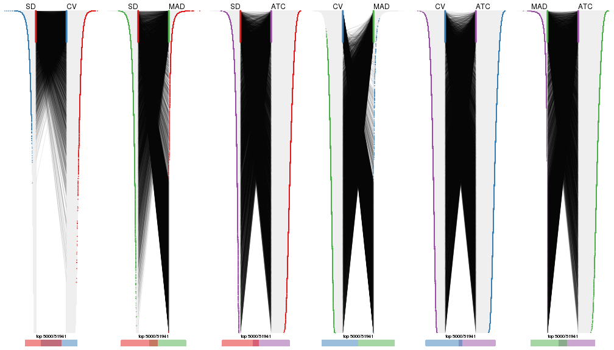</p>

</div>
</div>


Heatmaps of the top rows:


<script>
$( function() {
	$( '#tabs-top-rows-heatmap' ).tabs();
} );
</script>
<div id='tabs-top-rows-heatmap'>
<ul>
<li><a href='#tab-top-rows-heatmap-1'>top_n = 1000</a></li>
<li><a href='#tab-top-rows-heatmap-2'>top_n = 2000</a></li>
<li><a href='#tab-top-rows-heatmap-3'>top_n = 3000</a></li>
<li><a href='#tab-top-rows-heatmap-4'>top_n = 4000</a></li>
<li><a href='#tab-top-rows-heatmap-5'>top_n = 5000</a></li>
</ul>
<div id='tab-top-rows-heatmap-1'>
<pre><code class="r">top_rows_heatmap(res_list, top_n = 1000)
</code></pre>

<p></p>

</div>
<div id='tab-top-rows-heatmap-2'>
<pre><code class="r">top_rows_heatmap(res_list, top_n = 2000)
</code></pre>

<p>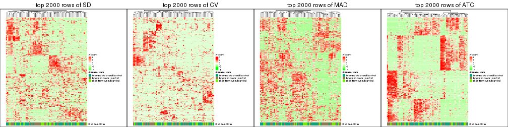</p>

</div>
<div id='tab-top-rows-heatmap-3'>
<pre><code class="r">top_rows_heatmap(res_list, top_n = 3000)
</code></pre>

<p></p>

</div>
<div id='tab-top-rows-heatmap-4'>
<pre><code class="r">top_rows_heatmap(res_list, top_n = 4000)
</code></pre>

<p></p>

</div>
<div id='tab-top-rows-heatmap-5'>
<pre><code class="r">top_rows_heatmap(res_list, top_n = 5000)
</code></pre>

<p></p>

</div>
</div>


### Test to known annotations


Test correlation between subgroups and known annotations. If the known
annotation is numeric, one-way ANOVA test is applied, and if the known
annotation is discrete, chi-squared contingency table test is applied.


<script>
$( function() {
	$( '#tabs-test-to-known-factors-from-consensus-partition-list' ).tabs();
} );
</script>
<div id='tabs-test-to-known-factors-from-consensus-partition-list'>
<ul>
<li><a href='#tab-test-to-known-factors-from-consensus-partition-list-1'>k = 2</a></li>
<li><a href='#tab-test-to-known-factors-from-consensus-partition-list-2'>k = 3</a></li>
<li><a href='#tab-test-to-known-factors-from-consensus-partition-list-3'>k = 4</a></li>
<li><a href='#tab-test-to-known-factors-from-consensus-partition-list-4'>k = 5</a></li>
<li><a href='#tab-test-to-known-factors-from-consensus-partition-list-5'>k = 6</a></li>
</ul>
<div id='tab-test-to-known-factors-from-consensus-partition-list-1'>
<pre><code class="r">test_to_known_factors(res_list, k = 2)
</code></pre>

<pre><code>#&gt;              n disease.state(p) k
#&gt; SD:NMF      69          0.11244 2
#&gt; CV:NMF      68          0.06188 2
#&gt; MAD:NMF     66          0.29384 2
#&gt; ATC:NMF     68          0.75291 2
#&gt; SD:skmeans  69          0.11244 2
#&gt; CV:skmeans  69          0.11244 2
#&gt; MAD:skmeans 69          0.11853 2
#&gt; ATC:skmeans 70          0.30169 2
#&gt; SD:mclust   65          0.12095 2
#&gt; CV:mclust   62          0.13830 2
#&gt; MAD:mclust  66          0.63911 2
#&gt; ATC:mclust  69          0.22992 2
#&gt; SD:kmeans   69          0.08026 2
#&gt; CV:kmeans   68          0.14917 2
#&gt; MAD:kmeans  70          0.14223 2
#&gt; ATC:kmeans  68          0.75291 2
#&gt; SD:pam      69          0.14812 2
#&gt; CV:pam      66          0.00703 2
#&gt; MAD:pam     69          0.23235 2
#&gt; ATC:pam     69          0.19978 2
#&gt; SD:hclust   66          0.05422 2
#&gt; CV:hclust   61          0.15003 2
#&gt; MAD:hclust  59          0.04933 2
#&gt; ATC:hclust  66          0.91840 2
</code></pre>

</div>
<div id='tab-test-to-known-factors-from-consensus-partition-list-2'>
<pre><code class="r">test_to_known_factors(res_list, k = 3)
</code></pre>

<pre><code>#&gt;              n disease.state(p) k
#&gt; SD:NMF      59           0.0864 3
#&gt; CV:NMF      45           0.1935 3
#&gt; MAD:NMF     59           0.3370 3
#&gt; ATC:NMF     67           0.4343 3
#&gt; SD:skmeans  68           0.1332 3
#&gt; CV:skmeans  60           0.0554 3
#&gt; MAD:skmeans 68           0.3437 3
#&gt; ATC:skmeans 70           0.4530 3
#&gt; SD:mclust   61           0.0945 3
#&gt; CV:mclust   40           0.0435 3
#&gt; MAD:mclust  60           0.2615 3
#&gt; ATC:mclust  63           0.1034 3
#&gt; SD:kmeans   57           0.0353 3
#&gt; CV:kmeans   44           0.0987 3
#&gt; MAD:kmeans  68           0.3437 3
#&gt; ATC:kmeans  66           0.0803 3
#&gt; SD:pam      66           0.1497 3
#&gt; CV:pam      60           0.0424 3
#&gt; MAD:pam     68           0.2869 3
#&gt; ATC:pam     61           0.1215 3
#&gt; SD:hclust   60           0.0942 3
#&gt; CV:hclust   46           0.1528 3
#&gt; MAD:hclust  60           0.0243 3
#&gt; ATC:hclust  65           0.0171 3
</code></pre>

</div>
<div id='tab-test-to-known-factors-from-consensus-partition-list-3'>
<pre><code class="r">test_to_known_factors(res_list, k = 4)
</code></pre>

<pre><code>#&gt;              n disease.state(p) k
#&gt; SD:NMF      47          0.53315 4
#&gt; CV:NMF      27          0.25883 4
#&gt; MAD:NMF     66          0.84857 4
#&gt; ATC:NMF     68          0.47402 4
#&gt; SD:skmeans  67          0.07535 4
#&gt; CV:skmeans  60          0.00842 4
#&gt; MAD:skmeans 67          0.52621 4
#&gt; ATC:skmeans 70          0.48733 4
#&gt; SD:mclust   61          0.17046 4
#&gt; CV:mclust   57          0.06704 4
#&gt; MAD:mclust  69          0.09468 4
#&gt; ATC:mclust  69          0.14151 4
#&gt; SD:kmeans   57          0.09027 4
#&gt; CV:kmeans   33          0.58829 4
#&gt; MAD:kmeans  56          0.04331 4
#&gt; ATC:kmeans  58          0.06341 4
#&gt; SD:pam      63          0.20035 4
#&gt; CV:pam      61          0.03282 4
#&gt; MAD:pam     62          0.38166 4
#&gt; ATC:pam     59          0.28422 4
#&gt; SD:hclust   50          0.08701 4
#&gt; CV:hclust   46          0.14654 4
#&gt; MAD:hclust  42          0.01574 4
#&gt; ATC:hclust  69          0.08867 4
</code></pre>

</div>
<div id='tab-test-to-known-factors-from-consensus-partition-list-4'>
<pre><code class="r">test_to_known_factors(res_list, k = 5)
</code></pre>

<pre><code>#&gt;              n disease.state(p) k
#&gt; SD:NMF      59           0.2447 5
#&gt; CV:NMF      45           0.0401 5
#&gt; MAD:NMF     61           0.3269 5
#&gt; ATC:NMF     66           0.1802 5
#&gt; SD:skmeans  65           0.0998 5
#&gt; CV:skmeans  59           0.0225 5
#&gt; MAD:skmeans 57           0.2684 5
#&gt; ATC:skmeans 67           0.5694 5
#&gt; SD:mclust   46           0.2096 5
#&gt; CV:mclust   58           0.3163 5
#&gt; MAD:mclust  59           0.0103 5
#&gt; ATC:mclust  69           0.0949 5
#&gt; SD:kmeans   62           0.0192 5
#&gt; CV:kmeans   61           0.0379 5
#&gt; MAD:kmeans  47           0.0581 5
#&gt; ATC:kmeans  61           0.0141 5
#&gt; SD:pam      64           0.0972 5
#&gt; CV:pam      62           0.0203 5
#&gt; MAD:pam     61           0.1792 5
#&gt; ATC:pam     65           0.1502 5
#&gt; SD:hclust   53           0.1027 5
#&gt; CV:hclust   39           0.0424 5
#&gt; MAD:hclust  35           0.1432 5
#&gt; ATC:hclust  66           0.1642 5
</code></pre>

</div>
<div id='tab-test-to-known-factors-from-consensus-partition-list-5'>
<pre><code class="r">test_to_known_factors(res_list, k = 6)
</code></pre>

<pre><code>#&gt;              n disease.state(p) k
#&gt; SD:NMF      45           0.6343 6
#&gt; CV:NMF      54           0.0236 6
#&gt; MAD:NMF     53           0.0371 6
#&gt; ATC:NMF     45           0.0861 6
#&gt; SD:skmeans  53           0.0529 6
#&gt; CV:skmeans  50           0.0599 6
#&gt; MAD:skmeans 55           0.4640 6
#&gt; ATC:skmeans 57           0.0818 6
#&gt; SD:mclust   57           0.2847 6
#&gt; CV:mclust   58           0.0862 6
#&gt; MAD:mclust  52           0.0204 6
#&gt; ATC:mclust  69           0.0350 6
#&gt; SD:kmeans   43           0.0327 6
#&gt; CV:kmeans   64           0.0666 6
#&gt; MAD:kmeans  34           0.1445 6
#&gt; ATC:kmeans  61           0.0580 6
#&gt; SD:pam      56           0.0769 6
#&gt; CV:pam      59           0.0526 6
#&gt; MAD:pam     62           0.1845 6
#&gt; ATC:pam     59           0.0639 6
#&gt; SD:hclust   45           0.1044 6
#&gt; CV:hclust   56           0.0517 6
#&gt; MAD:hclust  32           0.0302 6
#&gt; ATC:hclust  58           0.0867 6
</code></pre>

</div>
</div>


 
## Results for each method


---------------------------------------------------


### SD:hclust


The object with results only for a single top-value method and a single partition method 
can be extracted as:

```r
res = res_list["SD", "hclust"]
# you can also extract it by
# res = res_list["SD:hclust"]
```

A summary of `res` and all the functions that can be applied to it:

```r
res
```

```
#> A 'ConsensusPartition' object with k = 2, 3, 4, 5, 6.
#>   On a matrix with 51941 rows and 70 columns.
#>   Top rows (1000, 2000, 3000, 4000, 5000) are extracted by 'SD' method.
#>   Subgroups are detected by 'hclust' method.
#>   Performed in total 1250 partitions by row resampling.
#>   Best k for subgroups seems to be 2.
#> 
#> Following methods can be applied to this 'ConsensusPartition' object:
#>  [1] "cola_report"             "collect_classes"         "collect_plots"          
#>  [4] "collect_stats"           "colnames"                "compare_signatures"     
#>  [7] "consensus_heatmap"       "dimension_reduction"     "functional_enrichment"  
#> [10] "get_anno_col"            "get_anno"                "get_classes"            
#> [13] "get_consensus"           "get_matrix"              "get_membership"         
#> [16] "get_param"               "get_signatures"          "get_stats"              
#> [19] "is_best_k"               "is_stable_k"             "membership_heatmap"     
#> [22] "ncol"                    "nrow"                    "plot_ecdf"              
#> [25] "rownames"                "select_partition_number" "show"                   
#> [28] "suggest_best_k"          "test_to_known_factors"
```

`collect_plots()` function collects all the plots made from `res` for all `k` (number of partitions)
into one single page to provide an easy and fast comparison between different `k`.

```r
collect_plots(res)
```


The plots are:

- The first row: a plot of the ECDF (Empirical cumulative distribution
  function) curves of the consensus matrix for each `k` and the heatmap of
  predicted classes for each `k`.
- The second row: heatmaps of the consensus matrix for each `k`.
- The third row: heatmaps of the membership matrix for each `k`.
- The fouth row: heatmaps of the signatures for each `k`.

All the plots in panels can be made by individual functions and they are
plotted later in this section.

`select_partition_number()` produces several plots showing different
statistics for choosing "optimized" `k`. There are following statistics:

- ECDF curves of the consensus matrix for each `k`;
- 1-PAC. [The PAC
  score](https://en.wikipedia.org/wiki/Consensus_clustering#Over-interpretation_potential_of_consensus_clustering)
  measures the proportion of the ambiguous subgrouping.
- Mean silhouette score.
- Concordance. The mean probability of fiting the consensus class ids in all
  partitions.
- Area increased. Denote $A_k$ as the area under the ECDF curve for current
  `k`, the area increased is defined as $A_k - A_{k-1}$.
- Rand index. The percent of pairs of samples that are both in a same cluster
  or both are not in a same cluster in the partition of k and k-1.
- Jaccard index. The ratio of pairs of samples are both in a same cluster in
  the partition of k and k-1 and the pairs of samples are both in a same
  cluster in the partition k or k-1.

The detailed explanations of these statistics can be found in [the cola
vignette](http://bioconductor.org/packages/devel/bioc/vignettes/cola/inst/doc/cola.html#toc_13).

Generally speaking, lower PAC score, higher mean silhouette score or higher
concordance corresponds to better partition. Rand index and Jaccard index
measure how similar the current partition is compared to partition with `k-1`.
If they are too similar, we won't accept `k` is better than `k-1`.

```r
select_partition_number(res)
```


The numeric values for all these statistics can be obtained by `get_stats()`.

```r
get_stats(res)
```

```
#>   k 1-PAC mean_silhouette concordance area_increased  Rand Jaccard
#> 2 2 0.736           0.871       0.942         0.4860 0.508   0.508
#> 3 3 0.502           0.619       0.801         0.2640 0.955   0.912
#> 4 4 0.498           0.523       0.664         0.1460 0.792   0.566
#> 5 5 0.539           0.579       0.713         0.0913 0.936   0.784
#> 6 6 0.634           0.476       0.698         0.0512 0.959   0.837
```

`suggest_best_k()` suggests the best $k$ based on these statistics. The rules are as follows:

- All $k$ with Jaccard index larger than 0.95 are removed because the increase of
  the partition number does not provides enough extra information. If all $k$ are removed,
  the best $k$ is assigned by `NA`.
- For $k$ with 1-PAC larger than 0.9, the maximal $k$ is taken as the "best k". Other $k$ is called "optional k".
- If it does not fit the second rule. The $k$ with the highest vote of highest
  1-PAC, mean silhouette and concordance is taken as the "best k".

```r
suggest_best_k(res)
```

```
#> [1] 2
```


Following shows the table of the partitions (You need to click the **show/hide
code output** link to see it). The membership matrix (columns with name `p*`)
is inferred by
[`clue::cl_consensus()`](https://www.rdocumentation.org/link/cl_consensus?package=clue)
function with the `SE` method. Basically the value in the membership matrix
represents the probability to belong to a certain group. The finall class
label for an item is determined with the group with highest probability it
belongs to.

In `get_classes()` function, the entropy is calculated from the membership
matrix and the silhouette score is calculated from the consensus matrix.


<script>
$( function() {
	$( '#tabs-SD-hclust-get-classes' ).tabs();
} );
</script>
<div id='tabs-SD-hclust-get-classes'>
<ul>
<li><a href='#tab-SD-hclust-get-classes-1'>k = 2</a></li>
<li><a href='#tab-SD-hclust-get-classes-2'>k = 3</a></li>
<li><a href='#tab-SD-hclust-get-classes-3'>k = 4</a></li>
<li><a href='#tab-SD-hclust-get-classes-4'>k = 5</a></li>
<li><a href='#tab-SD-hclust-get-classes-5'>k = 6</a></li>
</ul>

<div id='tab-SD-hclust-get-classes-1'>
<p><a id='tab-SD-hclust-get-classes-1-a' style='color:#0366d6' href='#'>show/hide code output</a></p>
<pre><code class="r">cbind(get_classes(res, k = 2), get_membership(res, k = 2))
</code></pre>

<pre><code>#&gt;            class entropy silhouette    p1    p2
#&gt; GSM1299517     2  0.0000     0.9467 0.000 1.000
#&gt; GSM1299518     2  0.1843     0.9363 0.028 0.972
#&gt; GSM1299519     2  0.0000     0.9467 0.000 1.000
#&gt; GSM1299520     1  0.0938     0.9211 0.988 0.012
#&gt; GSM1299521     1  0.0000     0.9209 1.000 0.000
#&gt; GSM1299522     2  0.0000     0.9467 0.000 1.000
#&gt; GSM1299523     1  0.4022     0.8890 0.920 0.080
#&gt; GSM1299524     2  0.7139     0.7433 0.196 0.804
#&gt; GSM1299525     2  0.5294     0.8544 0.120 0.880
#&gt; GSM1299526     2  0.0000     0.9467 0.000 1.000
#&gt; GSM1299527     2  0.0376     0.9466 0.004 0.996
#&gt; GSM1299528     2  0.0672     0.9455 0.008 0.992
#&gt; GSM1299529     2  0.5946     0.8266 0.144 0.856
#&gt; GSM1299530     1  0.0938     0.9211 0.988 0.012
#&gt; GSM1299531     2  0.0376     0.9465 0.004 0.996
#&gt; GSM1299575     1  0.1414     0.9193 0.980 0.020
#&gt; GSM1299532     2  0.0000     0.9467 0.000 1.000
#&gt; GSM1299533     2  0.9993    -0.0208 0.484 0.516
#&gt; GSM1299534     2  0.0000     0.9467 0.000 1.000
#&gt; GSM1299535     2  0.2603     0.9267 0.044 0.956
#&gt; GSM1299536     1  0.6531     0.8014 0.832 0.168
#&gt; GSM1299537     2  0.0376     0.9465 0.004 0.996
#&gt; GSM1299538     1  0.6973     0.7836 0.812 0.188
#&gt; GSM1299539     2  0.9933     0.1274 0.452 0.548
#&gt; GSM1299540     2  0.4690     0.8795 0.100 0.900
#&gt; GSM1299541     2  0.0376     0.9463 0.004 0.996
#&gt; GSM1299542     2  0.0000     0.9467 0.000 1.000
#&gt; GSM1299543     2  0.0000     0.9467 0.000 1.000
#&gt; GSM1299544     2  0.0376     0.9464 0.004 0.996
#&gt; GSM1299545     1  0.4161     0.8852 0.916 0.084
#&gt; GSM1299546     2  0.0000     0.9467 0.000 1.000
#&gt; GSM1299547     1  0.1184     0.9199 0.984 0.016
#&gt; GSM1299548     2  0.0672     0.9454 0.008 0.992
#&gt; GSM1299549     1  0.0000     0.9209 1.000 0.000
#&gt; GSM1299550     1  0.9661     0.4043 0.608 0.392
#&gt; GSM1299551     2  0.0000     0.9467 0.000 1.000
#&gt; GSM1299552     1  0.0000     0.9209 1.000 0.000
#&gt; GSM1299553     1  0.9866     0.2715 0.568 0.432
#&gt; GSM1299554     2  0.0672     0.9454 0.008 0.992
#&gt; GSM1299555     2  0.4022     0.8979 0.080 0.920
#&gt; GSM1299556     2  0.1633     0.9386 0.024 0.976
#&gt; GSM1299557     2  0.5519     0.8453 0.128 0.872
#&gt; GSM1299558     2  0.0000     0.9467 0.000 1.000
#&gt; GSM1299559     2  0.1633     0.9386 0.024 0.976
#&gt; GSM1299560     2  0.0000     0.9467 0.000 1.000
#&gt; GSM1299576     1  0.0000     0.9209 1.000 0.000
#&gt; GSM1299577     1  0.0376     0.9212 0.996 0.004
#&gt; GSM1299561     2  0.1843     0.9363 0.028 0.972
#&gt; GSM1299562     2  0.1414     0.9411 0.020 0.980
#&gt; GSM1299563     1  0.3114     0.9036 0.944 0.056
#&gt; GSM1299564     1  0.6623     0.8033 0.828 0.172
#&gt; GSM1299565     2  0.0000     0.9467 0.000 1.000
#&gt; GSM1299566     2  0.2236     0.9300 0.036 0.964
#&gt; GSM1299567     1  0.4022     0.8891 0.920 0.080
#&gt; GSM1299568     2  0.0000     0.9467 0.000 1.000
#&gt; GSM1299569     2  0.0376     0.9464 0.004 0.996
#&gt; GSM1299570     1  0.0938     0.9211 0.988 0.012
#&gt; GSM1299571     2  0.0000     0.9467 0.000 1.000
#&gt; GSM1299572     1  0.9129     0.5482 0.672 0.328
#&gt; GSM1299573     2  0.0000     0.9467 0.000 1.000
#&gt; GSM1299574     2  0.0376     0.9464 0.004 0.996
#&gt; GSM1299578     1  0.1414     0.9193 0.980 0.020
#&gt; GSM1299579     1  0.0000     0.9209 1.000 0.000
#&gt; GSM1299580     1  0.1414     0.9193 0.980 0.020
#&gt; GSM1299581     1  0.0000     0.9209 1.000 0.000
#&gt; GSM1299582     1  0.0000     0.9209 1.000 0.000
#&gt; GSM1299583     1  0.0000     0.9209 1.000 0.000
#&gt; GSM1299584     1  0.0000     0.9209 1.000 0.000
#&gt; GSM1299585     1  0.0000     0.9209 1.000 0.000
#&gt; GSM1299586     1  0.0000     0.9209 1.000 0.000
</code></pre>

<script>
$('#tab-SD-hclust-get-classes-1-a').parent().next().next().hide();
$('#tab-SD-hclust-get-classes-1-a').click(function(){
  $('#tab-SD-hclust-get-classes-1-a').parent().next().next().toggle();
  return(false);
});
</script>
</div>

<div id='tab-SD-hclust-get-classes-2'>
<p><a id='tab-SD-hclust-get-classes-2-a' style='color:#0366d6' href='#'>show/hide code output</a></p>
<pre><code class="r">cbind(get_classes(res, k = 3), get_membership(res, k = 3))
</code></pre>

<pre><code>#&gt;            class entropy silhouette    p1    p2    p3
#&gt; GSM1299517     3  0.3038     0.7310 0.000 0.104 0.896
#&gt; GSM1299518     3  0.3607     0.7438 0.008 0.112 0.880
#&gt; GSM1299519     3  0.4605     0.7115 0.000 0.204 0.796
#&gt; GSM1299520     1  0.2866     0.7816 0.916 0.076 0.008
#&gt; GSM1299521     1  0.4931     0.6557 0.768 0.232 0.000
#&gt; GSM1299522     3  0.4504     0.7148 0.000 0.196 0.804
#&gt; GSM1299523     1  0.5173     0.7183 0.816 0.148 0.036
#&gt; GSM1299524     3  0.7106     0.4703 0.076 0.224 0.700
#&gt; GSM1299525     3  0.7337     0.1021 0.032 0.428 0.540
#&gt; GSM1299526     3  0.4504     0.7148 0.000 0.196 0.804
#&gt; GSM1299527     3  0.4409     0.6829 0.004 0.172 0.824
#&gt; GSM1299528     3  0.5291     0.6106 0.000 0.268 0.732
#&gt; GSM1299529     2  0.7491    -0.1845 0.036 0.492 0.472
#&gt; GSM1299530     1  0.2866     0.7816 0.916 0.076 0.008
#&gt; GSM1299531     3  0.4452     0.7275 0.000 0.192 0.808
#&gt; GSM1299575     1  0.2496     0.7856 0.928 0.068 0.004
#&gt; GSM1299532     3  0.1964     0.7457 0.000 0.056 0.944
#&gt; GSM1299533     3  0.9730    -0.3183 0.228 0.352 0.420
#&gt; GSM1299534     3  0.3879     0.6918 0.000 0.152 0.848
#&gt; GSM1299535     3  0.4782     0.7203 0.016 0.164 0.820
#&gt; GSM1299536     1  0.8475     0.3139 0.568 0.320 0.112
#&gt; GSM1299537     3  0.2796     0.7352 0.000 0.092 0.908
#&gt; GSM1299538     1  0.7213     0.5613 0.700 0.212 0.088
#&gt; GSM1299539     2  0.9657     0.3299 0.300 0.460 0.240
#&gt; GSM1299540     3  0.6283     0.6351 0.064 0.176 0.760
#&gt; GSM1299541     3  0.2878     0.7507 0.000 0.096 0.904
#&gt; GSM1299542     3  0.1964     0.7418 0.000 0.056 0.944
#&gt; GSM1299543     3  0.4702     0.7227 0.000 0.212 0.788
#&gt; GSM1299544     3  0.5216     0.6199 0.000 0.260 0.740
#&gt; GSM1299545     1  0.4636     0.7470 0.848 0.116 0.036
#&gt; GSM1299546     3  0.4605     0.7115 0.000 0.204 0.796
#&gt; GSM1299547     1  0.5884     0.6031 0.716 0.272 0.012
#&gt; GSM1299548     3  0.2860     0.7387 0.004 0.084 0.912
#&gt; GSM1299549     1  0.4887     0.6592 0.772 0.228 0.000
#&gt; GSM1299550     2  0.9842     0.0458 0.368 0.384 0.248
#&gt; GSM1299551     3  0.4605     0.7115 0.000 0.204 0.796
#&gt; GSM1299552     1  0.4887     0.6592 0.772 0.228 0.000
#&gt; GSM1299553     1  0.9357    -0.2352 0.440 0.392 0.168
#&gt; GSM1299554     3  0.3619     0.7213 0.000 0.136 0.864
#&gt; GSM1299555     3  0.5847     0.6668 0.048 0.172 0.780
#&gt; GSM1299556     3  0.3769     0.7312 0.016 0.104 0.880
#&gt; GSM1299557     3  0.7489    -0.0832 0.036 0.468 0.496
#&gt; GSM1299558     3  0.4399     0.7248 0.000 0.188 0.812
#&gt; GSM1299559     3  0.3769     0.7312 0.016 0.104 0.880
#&gt; GSM1299560     3  0.1964     0.7457 0.000 0.056 0.944
#&gt; GSM1299576     1  0.0747     0.7918 0.984 0.016 0.000
#&gt; GSM1299577     1  0.1129     0.7918 0.976 0.020 0.004
#&gt; GSM1299561     3  0.2774     0.7469 0.008 0.072 0.920
#&gt; GSM1299562     3  0.3851     0.7482 0.004 0.136 0.860
#&gt; GSM1299563     1  0.4137     0.7619 0.872 0.096 0.032
#&gt; GSM1299564     1  0.6902     0.6053 0.732 0.168 0.100
#&gt; GSM1299565     3  0.4504     0.7148 0.000 0.196 0.804
#&gt; GSM1299566     3  0.5785     0.5626 0.004 0.300 0.696
#&gt; GSM1299567     1  0.4862     0.7285 0.820 0.160 0.020
#&gt; GSM1299568     3  0.3879     0.6919 0.000 0.152 0.848
#&gt; GSM1299569     3  0.4654     0.6569 0.000 0.208 0.792
#&gt; GSM1299570     1  0.2866     0.7816 0.916 0.076 0.008
#&gt; GSM1299571     3  0.4504     0.7148 0.000 0.196 0.804
#&gt; GSM1299572     1  0.9812    -0.2162 0.412 0.340 0.248
#&gt; GSM1299573     3  0.2711     0.7370 0.000 0.088 0.912
#&gt; GSM1299574     3  0.4702     0.7079 0.000 0.212 0.788
#&gt; GSM1299578     1  0.2496     0.7856 0.928 0.068 0.004
#&gt; GSM1299579     1  0.1753     0.7771 0.952 0.048 0.000
#&gt; GSM1299580     1  0.2496     0.7856 0.928 0.068 0.004
#&gt; GSM1299581     1  0.0000     0.7904 1.000 0.000 0.000
#&gt; GSM1299582     1  0.0000     0.7904 1.000 0.000 0.000
#&gt; GSM1299583     1  0.1753     0.7771 0.952 0.048 0.000
#&gt; GSM1299584     1  0.0000     0.7904 1.000 0.000 0.000
#&gt; GSM1299585     1  0.4931     0.6557 0.768 0.232 0.000
#&gt; GSM1299586     1  0.0747     0.7918 0.984 0.016 0.000
</code></pre>

<script>
$('#tab-SD-hclust-get-classes-2-a').parent().next().next().hide();
$('#tab-SD-hclust-get-classes-2-a').click(function(){
  $('#tab-SD-hclust-get-classes-2-a').parent().next().next().toggle();
  return(false);
});
</script>
</div>

<div id='tab-SD-hclust-get-classes-3'>
<p><a id='tab-SD-hclust-get-classes-3-a' style='color:#0366d6' href='#'>show/hide code output</a></p>
<pre><code class="r">cbind(get_classes(res, k = 4), get_membership(res, k = 4))
</code></pre>

<pre><code>#&gt;            class entropy silhouette    p1    p2    p3    p4
#&gt; GSM1299517     3   0.194     0.6109 0.000 0.032 0.940 0.028
#&gt; GSM1299518     3   0.601     0.4251 0.016 0.204 0.704 0.076
#&gt; GSM1299519     2   0.494     0.5281 0.000 0.564 0.436 0.000
#&gt; GSM1299520     1   0.244     0.7689 0.916 0.024 0.000 0.060
#&gt; GSM1299521     4   0.493     0.5538 0.432 0.000 0.000 0.568
#&gt; GSM1299522     2   0.512     0.5202 0.000 0.556 0.440 0.004
#&gt; GSM1299523     1   0.442     0.7119 0.836 0.056 0.028 0.080
#&gt; GSM1299524     3   0.670     0.3294 0.004 0.124 0.616 0.256
#&gt; GSM1299525     2   0.783     0.2269 0.020 0.524 0.264 0.192
#&gt; GSM1299526     2   0.513     0.5118 0.000 0.548 0.448 0.004
#&gt; GSM1299527     3   0.333     0.5696 0.000 0.088 0.872 0.040
#&gt; GSM1299528     3   0.702     0.4147 0.004 0.248 0.588 0.160
#&gt; GSM1299529     2   0.783     0.2182 0.028 0.548 0.192 0.232
#&gt; GSM1299530     1   0.244     0.7689 0.916 0.024 0.000 0.060
#&gt; GSM1299531     3   0.630     0.3003 0.000 0.348 0.580 0.072
#&gt; GSM1299575     1   0.205     0.7774 0.928 0.008 0.000 0.064
#&gt; GSM1299532     3   0.202     0.6000 0.000 0.056 0.932 0.012
#&gt; GSM1299533     4   0.707     0.1874 0.012 0.096 0.356 0.536
#&gt; GSM1299534     3   0.566     0.5226 0.000 0.212 0.704 0.084
#&gt; GSM1299535     3   0.710     0.2736 0.020 0.288 0.588 0.104
#&gt; GSM1299536     4   0.700     0.6009 0.264 0.012 0.124 0.600
#&gt; GSM1299537     3   0.180     0.6109 0.000 0.040 0.944 0.016
#&gt; GSM1299538     1   0.626     0.5775 0.716 0.104 0.032 0.148
#&gt; GSM1299539     2   0.938    -0.0786 0.284 0.344 0.092 0.280
#&gt; GSM1299540     3   0.820     0.1038 0.068 0.328 0.496 0.108
#&gt; GSM1299541     3   0.390     0.5035 0.000 0.164 0.816 0.020
#&gt; GSM1299542     3   0.139     0.6086 0.000 0.028 0.960 0.012
#&gt; GSM1299543     3   0.636     0.1004 0.000 0.420 0.516 0.064
#&gt; GSM1299544     3   0.676     0.4305 0.000 0.252 0.600 0.148
#&gt; GSM1299545     1   0.371     0.7341 0.864 0.076 0.008 0.052
#&gt; GSM1299546     2   0.494     0.5281 0.000 0.564 0.436 0.000
#&gt; GSM1299547     4   0.541     0.5823 0.380 0.008 0.008 0.604
#&gt; GSM1299548     3   0.232     0.6210 0.004 0.032 0.928 0.036
#&gt; GSM1299549     4   0.511     0.5457 0.436 0.004 0.000 0.560
#&gt; GSM1299550     4   0.790     0.4931 0.132 0.044 0.284 0.540
#&gt; GSM1299551     2   0.494     0.5281 0.000 0.564 0.436 0.000
#&gt; GSM1299552     4   0.511     0.5457 0.436 0.004 0.000 0.560
#&gt; GSM1299553     1   0.873     0.1279 0.440 0.308 0.060 0.192
#&gt; GSM1299554     3   0.303     0.6069 0.004 0.052 0.896 0.048
#&gt; GSM1299555     3   0.793     0.1415 0.052 0.320 0.520 0.108
#&gt; GSM1299556     3   0.320     0.5979 0.012 0.076 0.888 0.024
#&gt; GSM1299557     2   0.791     0.2082 0.024 0.528 0.228 0.220
#&gt; GSM1299558     3   0.626     0.3248 0.000 0.324 0.600 0.076
#&gt; GSM1299559     3   0.320     0.5979 0.012 0.076 0.888 0.024
#&gt; GSM1299560     3   0.202     0.6000 0.000 0.056 0.932 0.012
#&gt; GSM1299576     1   0.277     0.7426 0.880 0.004 0.000 0.116
#&gt; GSM1299577     1   0.278     0.7614 0.896 0.020 0.000 0.084
#&gt; GSM1299561     3   0.485     0.5465 0.016 0.104 0.804 0.076
#&gt; GSM1299562     3   0.596     0.1551 0.008 0.344 0.612 0.036
#&gt; GSM1299563     1   0.346     0.7524 0.880 0.028 0.020 0.072
#&gt; GSM1299564     1   0.591     0.6118 0.756 0.064 0.080 0.100
#&gt; GSM1299565     2   0.512     0.5202 0.000 0.556 0.440 0.004
#&gt; GSM1299566     3   0.749     0.3754 0.012 0.268 0.548 0.172
#&gt; GSM1299567     1   0.415     0.7148 0.836 0.080 0.004 0.080
#&gt; GSM1299568     3   0.587     0.5134 0.000 0.216 0.688 0.096
#&gt; GSM1299569     3   0.610     0.4900 0.000 0.200 0.676 0.124
#&gt; GSM1299570     1   0.244     0.7689 0.916 0.024 0.000 0.060
#&gt; GSM1299571     2   0.513     0.5188 0.000 0.552 0.444 0.004
#&gt; GSM1299572     4   0.795     0.5640 0.152 0.048 0.244 0.556
#&gt; GSM1299573     3   0.162     0.6189 0.000 0.028 0.952 0.020
#&gt; GSM1299574     2   0.492     0.5245 0.000 0.572 0.428 0.000
#&gt; GSM1299578     1   0.205     0.7774 0.928 0.008 0.000 0.064
#&gt; GSM1299579     1   0.371     0.6597 0.804 0.004 0.000 0.192
#&gt; GSM1299580     1   0.205     0.7774 0.928 0.008 0.000 0.064
#&gt; GSM1299581     1   0.300     0.7345 0.864 0.004 0.000 0.132
#&gt; GSM1299582     1   0.300     0.7345 0.864 0.004 0.000 0.132
#&gt; GSM1299583     1   0.371     0.6597 0.804 0.004 0.000 0.192
#&gt; GSM1299584     1   0.300     0.7345 0.864 0.004 0.000 0.132
#&gt; GSM1299585     4   0.493     0.5538 0.432 0.000 0.000 0.568
#&gt; GSM1299586     1   0.265     0.7483 0.888 0.004 0.000 0.108
</code></pre>

<script>
$('#tab-SD-hclust-get-classes-3-a').parent().next().next().hide();
$('#tab-SD-hclust-get-classes-3-a').click(function(){
  $('#tab-SD-hclust-get-classes-3-a').parent().next().next().toggle();
  return(false);
});
</script>
</div>

<div id='tab-SD-hclust-get-classes-4'>
<p><a id='tab-SD-hclust-get-classes-4-a' style='color:#0366d6' href='#'>show/hide code output</a></p>
<pre><code class="r">cbind(get_classes(res, k = 5), get_membership(res, k = 5))
</code></pre>

<pre><code>#&gt;            class entropy silhouette    p1    p2    p3    p4    p5
#&gt; GSM1299517     3   0.282     0.6627 0.000 0.076 0.884 0.032 0.008
#&gt; GSM1299518     3   0.705     0.4069 0.016 0.236 0.572 0.128 0.048
#&gt; GSM1299519     2   0.157     0.7751 0.000 0.936 0.060 0.004 0.000
#&gt; GSM1299520     1   0.313     0.7367 0.864 0.004 0.000 0.080 0.052
#&gt; GSM1299521     5   0.300     0.6775 0.188 0.000 0.000 0.000 0.812
#&gt; GSM1299522     2   0.183     0.7810 0.000 0.920 0.076 0.004 0.000
#&gt; GSM1299523     1   0.383     0.6521 0.820 0.008 0.020 0.136 0.016
#&gt; GSM1299524     3   0.708     0.3902 0.004 0.092 0.556 0.096 0.252
#&gt; GSM1299525     4   0.662     0.4333 0.032 0.368 0.092 0.504 0.004
#&gt; GSM1299526     2   0.173     0.7804 0.000 0.920 0.080 0.000 0.000
#&gt; GSM1299527     3   0.418     0.6340 0.000 0.100 0.792 0.104 0.004
#&gt; GSM1299528     3   0.589     0.4180 0.000 0.044 0.564 0.356 0.036
#&gt; GSM1299529     4   0.605     0.5760 0.040 0.292 0.056 0.608 0.004
#&gt; GSM1299530     1   0.313     0.7367 0.864 0.004 0.000 0.080 0.052
#&gt; GSM1299531     2   0.706    -0.0717 0.000 0.388 0.372 0.224 0.016
#&gt; GSM1299575     1   0.233     0.7544 0.876 0.000 0.000 0.000 0.124
#&gt; GSM1299532     3   0.316     0.6441 0.000 0.128 0.848 0.012 0.012
#&gt; GSM1299533     5   0.687     0.3236 0.000 0.088 0.288 0.080 0.544
#&gt; GSM1299534     3   0.547     0.5688 0.000 0.072 0.676 0.228 0.024
#&gt; GSM1299535     3   0.800     0.2269 0.016 0.288 0.444 0.176 0.076
#&gt; GSM1299536     5   0.478     0.6648 0.084 0.004 0.116 0.024 0.772
#&gt; GSM1299537     3   0.273     0.6604 0.000 0.088 0.884 0.020 0.008
#&gt; GSM1299538     1   0.523     0.4908 0.688 0.008 0.024 0.248 0.032
#&gt; GSM1299539     4   0.573     0.5113 0.268 0.012 0.048 0.648 0.024
#&gt; GSM1299540     3   0.886     0.0890 0.060 0.320 0.344 0.192 0.084
#&gt; GSM1299541     3   0.517     0.5140 0.000 0.248 0.676 0.068 0.008
#&gt; GSM1299542     3   0.286     0.6548 0.000 0.104 0.872 0.012 0.012
#&gt; GSM1299543     2   0.649     0.3272 0.000 0.544 0.264 0.180 0.012
#&gt; GSM1299544     3   0.581     0.4381 0.000 0.044 0.588 0.332 0.036
#&gt; GSM1299545     1   0.430     0.6992 0.804 0.020 0.004 0.108 0.064
#&gt; GSM1299546     2   0.157     0.7751 0.000 0.936 0.060 0.004 0.000
#&gt; GSM1299547     5   0.337     0.6937 0.144 0.004 0.004 0.016 0.832
#&gt; GSM1299548     3   0.271     0.6690 0.004 0.044 0.900 0.040 0.012
#&gt; GSM1299549     5   0.339     0.6747 0.188 0.000 0.000 0.012 0.800
#&gt; GSM1299550     5   0.703     0.4609 0.064 0.008 0.272 0.104 0.552
#&gt; GSM1299551     2   0.157     0.7751 0.000 0.936 0.060 0.004 0.000
#&gt; GSM1299552     5   0.339     0.6747 0.188 0.000 0.000 0.012 0.800
#&gt; GSM1299553     4   0.571     0.2206 0.416 0.008 0.024 0.528 0.024
#&gt; GSM1299554     3   0.331     0.6566 0.004 0.040 0.864 0.080 0.012
#&gt; GSM1299555     3   0.862     0.1198 0.044 0.320 0.372 0.180 0.084
#&gt; GSM1299556     3   0.423     0.6434 0.008 0.108 0.812 0.052 0.020
#&gt; GSM1299557     4   0.646     0.5467 0.036 0.304 0.088 0.568 0.004
#&gt; GSM1299558     3   0.687     0.0326 0.000 0.376 0.416 0.196 0.012
#&gt; GSM1299559     3   0.423     0.6434 0.008 0.108 0.812 0.052 0.020
#&gt; GSM1299560     3   0.316     0.6441 0.000 0.128 0.848 0.012 0.012
#&gt; GSM1299576     1   0.380     0.7158 0.756 0.008 0.000 0.004 0.232
#&gt; GSM1299577     1   0.368     0.7444 0.804 0.008 0.000 0.020 0.168
#&gt; GSM1299561     3   0.553     0.5975 0.016 0.072 0.736 0.128 0.048
#&gt; GSM1299562     2   0.657     0.1856 0.004 0.508 0.368 0.088 0.032
#&gt; GSM1299563     1   0.447     0.7160 0.800 0.008 0.024 0.100 0.068
#&gt; GSM1299564     1   0.565     0.5849 0.720 0.008 0.088 0.132 0.052
#&gt; GSM1299565     2   0.189     0.7799 0.000 0.916 0.080 0.004 0.000
#&gt; GSM1299566     3   0.616     0.3686 0.008 0.036 0.528 0.388 0.040
#&gt; GSM1299567     1   0.363     0.6473 0.820 0.012 0.000 0.144 0.024
#&gt; GSM1299568     3   0.549     0.5583 0.000 0.064 0.664 0.248 0.024
#&gt; GSM1299569     3   0.518     0.5247 0.000 0.028 0.668 0.272 0.032
#&gt; GSM1299570     1   0.313     0.7367 0.864 0.004 0.000 0.080 0.052
#&gt; GSM1299571     2   0.173     0.7808 0.000 0.920 0.080 0.000 0.000
#&gt; GSM1299572     5   0.561     0.5727 0.028 0.012 0.208 0.060 0.692
#&gt; GSM1299573     3   0.239     0.6659 0.000 0.048 0.908 0.040 0.004
#&gt; GSM1299574     2   0.174     0.7663 0.000 0.932 0.056 0.012 0.000
#&gt; GSM1299578     1   0.233     0.7544 0.876 0.000 0.000 0.000 0.124
#&gt; GSM1299579     1   0.445     0.5857 0.636 0.008 0.000 0.004 0.352
#&gt; GSM1299580     1   0.233     0.7544 0.876 0.000 0.000 0.000 0.124
#&gt; GSM1299581     1   0.396     0.7068 0.732 0.008 0.000 0.004 0.256
#&gt; GSM1299582     1   0.396     0.7068 0.732 0.008 0.000 0.004 0.256
#&gt; GSM1299583     1   0.443     0.5918 0.640 0.008 0.000 0.004 0.348
#&gt; GSM1299584     1   0.396     0.7068 0.732 0.008 0.000 0.004 0.256
#&gt; GSM1299585     5   0.300     0.6775 0.188 0.000 0.000 0.000 0.812
#&gt; GSM1299586     1   0.371     0.7235 0.768 0.008 0.000 0.004 0.220
</code></pre>

<script>
$('#tab-SD-hclust-get-classes-4-a').parent().next().next().hide();
$('#tab-SD-hclust-get-classes-4-a').click(function(){
  $('#tab-SD-hclust-get-classes-4-a').parent().next().next().toggle();
  return(false);
});
</script>
</div>

<div id='tab-SD-hclust-get-classes-5'>
<p><a id='tab-SD-hclust-get-classes-5-a' style='color:#0366d6' href='#'>show/hide code output</a></p>
<pre><code class="r">cbind(get_classes(res, k = 6), get_membership(res, k = 6))
</code></pre>

<pre><code>#&gt;            class entropy silhouette    p1    p2    p3    p4    p5    p6
#&gt; GSM1299517     3  0.2467    0.56212 0.000 0.048 0.896 0.020 0.000 0.036
#&gt; GSM1299518     3  0.6996   -0.04136 0.004 0.184 0.484 0.068 0.008 0.252
#&gt; GSM1299519     2  0.0291    0.71611 0.000 0.992 0.000 0.004 0.000 0.004
#&gt; GSM1299520     1  0.5136    0.60410 0.704 0.000 0.000 0.120 0.060 0.116
#&gt; GSM1299521     5  0.1765    0.70569 0.096 0.000 0.000 0.000 0.904 0.000
#&gt; GSM1299522     2  0.0622    0.72066 0.000 0.980 0.008 0.000 0.000 0.012
#&gt; GSM1299523     1  0.5258    0.50218 0.672 0.000 0.012 0.176 0.012 0.128
#&gt; GSM1299524     3  0.7338    0.03570 0.000 0.048 0.472 0.068 0.144 0.268
#&gt; GSM1299525     4  0.5293    0.49994 0.016 0.356 0.040 0.572 0.000 0.016
#&gt; GSM1299526     2  0.0622    0.71979 0.000 0.980 0.012 0.000 0.000 0.008
#&gt; GSM1299527     3  0.4211    0.50403 0.000 0.076 0.772 0.124 0.000 0.028
#&gt; GSM1299528     3  0.5365    0.05439 0.000 0.016 0.492 0.056 0.004 0.432
#&gt; GSM1299529     4  0.4434    0.62158 0.016 0.252 0.020 0.700 0.000 0.012
#&gt; GSM1299530     1  0.5136    0.60410 0.704 0.000 0.000 0.120 0.060 0.116
#&gt; GSM1299531     2  0.6755   -0.00422 0.000 0.360 0.312 0.036 0.000 0.292
#&gt; GSM1299575     1  0.2178    0.67391 0.868 0.000 0.000 0.000 0.132 0.000
#&gt; GSM1299532     3  0.3098    0.53960 0.000 0.120 0.836 0.000 0.004 0.040
#&gt; GSM1299533     5  0.7800    0.32869 0.000 0.088 0.200 0.060 0.436 0.216
#&gt; GSM1299534     3  0.5157    0.33887 0.000 0.068 0.624 0.024 0.000 0.284
#&gt; GSM1299535     3  0.7826   -0.49906 0.004 0.248 0.336 0.100 0.020 0.292
#&gt; GSM1299536     5  0.4493    0.65596 0.020 0.000 0.104 0.024 0.772 0.080
#&gt; GSM1299537     3  0.2918    0.56013 0.000 0.056 0.872 0.016 0.004 0.052
#&gt; GSM1299538     1  0.6324    0.34282 0.532 0.000 0.016 0.260 0.020 0.172
#&gt; GSM1299539     4  0.4654    0.49036 0.188 0.000 0.020 0.720 0.004 0.068
#&gt; GSM1299540     6  0.8349    0.41026 0.032 0.272 0.252 0.100 0.024 0.320
#&gt; GSM1299541     3  0.5277    0.34673 0.000 0.200 0.656 0.016 0.004 0.124
#&gt; GSM1299542     3  0.2452    0.55497 0.000 0.084 0.884 0.000 0.004 0.028
#&gt; GSM1299543     2  0.5930    0.31498 0.000 0.564 0.192 0.024 0.000 0.220
#&gt; GSM1299544     3  0.5207    0.09351 0.000 0.016 0.508 0.044 0.004 0.428
#&gt; GSM1299545     1  0.4654    0.58517 0.748 0.000 0.000 0.096 0.056 0.100
#&gt; GSM1299546     2  0.0291    0.71611 0.000 0.992 0.000 0.004 0.000 0.004
#&gt; GSM1299547     5  0.2614    0.71752 0.056 0.000 0.004 0.004 0.884 0.052
#&gt; GSM1299548     3  0.2375    0.54463 0.000 0.004 0.896 0.028 0.004 0.068
#&gt; GSM1299549     5  0.2121    0.70359 0.096 0.000 0.000 0.012 0.892 0.000
#&gt; GSM1299550     5  0.7066    0.45904 0.024 0.000 0.232 0.076 0.504 0.164
#&gt; GSM1299551     2  0.0291    0.71611 0.000 0.992 0.000 0.004 0.000 0.004
#&gt; GSM1299552     5  0.2121    0.70359 0.096 0.000 0.000 0.012 0.892 0.000
#&gt; GSM1299553     4  0.4437    0.25179 0.392 0.000 0.004 0.584 0.012 0.008
#&gt; GSM1299554     3  0.3089    0.52858 0.000 0.028 0.848 0.020 0.000 0.104
#&gt; GSM1299555     6  0.8056    0.40310 0.016 0.272 0.272 0.088 0.024 0.328
#&gt; GSM1299556     3  0.4307    0.50461 0.008 0.076 0.792 0.028 0.008 0.088
#&gt; GSM1299557     4  0.4957    0.59805 0.016 0.280 0.048 0.648 0.000 0.008
#&gt; GSM1299558     2  0.6584   -0.01970 0.000 0.376 0.352 0.028 0.000 0.244
#&gt; GSM1299559     3  0.4307    0.50461 0.008 0.076 0.792 0.028 0.008 0.088
#&gt; GSM1299560     3  0.3098    0.53960 0.000 0.120 0.836 0.000 0.004 0.040
#&gt; GSM1299576     1  0.3488    0.63564 0.744 0.000 0.000 0.004 0.244 0.008
#&gt; GSM1299577     1  0.3699    0.66481 0.780 0.000 0.000 0.032 0.176 0.012
#&gt; GSM1299561     3  0.5059    0.26524 0.004 0.016 0.676 0.064 0.008 0.232
#&gt; GSM1299562     2  0.6388    0.11306 0.000 0.520 0.280 0.036 0.008 0.156
#&gt; GSM1299563     1  0.6045    0.56983 0.636 0.000 0.012 0.132 0.076 0.144
#&gt; GSM1299564     1  0.6866    0.42294 0.556 0.000 0.068 0.156 0.036 0.184
#&gt; GSM1299565     2  0.0717    0.72007 0.000 0.976 0.008 0.000 0.000 0.016
#&gt; GSM1299566     6  0.5775   -0.32989 0.004 0.008 0.440 0.100 0.004 0.444
#&gt; GSM1299567     1  0.4811    0.51902 0.700 0.000 0.000 0.176 0.016 0.108
#&gt; GSM1299568     3  0.5155    0.31170 0.000 0.060 0.608 0.024 0.000 0.308
#&gt; GSM1299569     3  0.5065    0.25071 0.000 0.028 0.596 0.032 0.004 0.340
#&gt; GSM1299570     1  0.5136    0.60410 0.704 0.000 0.000 0.120 0.060 0.116
#&gt; GSM1299571     2  0.0622    0.72025 0.000 0.980 0.008 0.000 0.000 0.012
#&gt; GSM1299572     5  0.5973    0.59421 0.004 0.004 0.152 0.048 0.624 0.168
#&gt; GSM1299573     3  0.2202    0.55560 0.000 0.028 0.908 0.012 0.000 0.052
#&gt; GSM1299574     2  0.0508    0.70991 0.000 0.984 0.000 0.012 0.000 0.004
#&gt; GSM1299578     1  0.2178    0.67391 0.868 0.000 0.000 0.000 0.132 0.000
#&gt; GSM1299579     1  0.4090    0.49836 0.604 0.000 0.000 0.004 0.384 0.008
#&gt; GSM1299580     1  0.2178    0.67391 0.868 0.000 0.000 0.000 0.132 0.000
#&gt; GSM1299581     1  0.3672    0.62631 0.712 0.000 0.000 0.004 0.276 0.008
#&gt; GSM1299582     1  0.3672    0.62631 0.712 0.000 0.000 0.004 0.276 0.008
#&gt; GSM1299583     1  0.4058    0.51798 0.616 0.000 0.000 0.004 0.372 0.008
#&gt; GSM1299584     1  0.3672    0.62631 0.712 0.000 0.000 0.004 0.276 0.008
#&gt; GSM1299585     5  0.1765    0.70569 0.096 0.000 0.000 0.000 0.904 0.000
#&gt; GSM1299586     1  0.3384    0.64545 0.760 0.000 0.000 0.004 0.228 0.008
</code></pre>

<script>
$('#tab-SD-hclust-get-classes-5-a').parent().next().next().hide();
$('#tab-SD-hclust-get-classes-5-a').click(function(){
  $('#tab-SD-hclust-get-classes-5-a').parent().next().next().toggle();
  return(false);
});
</script>
</div>
</div>

Heatmaps for the consensus matrix. It visualizes the probability of two
samples to be in a same group.


<script>
$( function() {
	$( '#tabs-SD-hclust-consensus-heatmap' ).tabs();
} );
</script>
<div id='tabs-SD-hclust-consensus-heatmap'>
<ul>
<li><a href='#tab-SD-hclust-consensus-heatmap-1'>k = 2</a></li>
<li><a href='#tab-SD-hclust-consensus-heatmap-2'>k = 3</a></li>
<li><a href='#tab-SD-hclust-consensus-heatmap-3'>k = 4</a></li>
<li><a href='#tab-SD-hclust-consensus-heatmap-4'>k = 5</a></li>
<li><a href='#tab-SD-hclust-consensus-heatmap-5'>k = 6</a></li>
</ul>
<div id='tab-SD-hclust-consensus-heatmap-1'>
<pre><code class="r">consensus_heatmap(res, k = 2)
</code></pre>

<p></p>

</div>
<div id='tab-SD-hclust-consensus-heatmap-2'>
<pre><code class="r">consensus_heatmap(res, k = 3)
</code></pre>

<p></p>

</div>
<div id='tab-SD-hclust-consensus-heatmap-3'>
<pre><code class="r">consensus_heatmap(res, k = 4)
</code></pre>

<p></p>

</div>
<div id='tab-SD-hclust-consensus-heatmap-4'>
<pre><code class="r">consensus_heatmap(res, k = 5)
</code></pre>

<p></p>

</div>
<div id='tab-SD-hclust-consensus-heatmap-5'>
<pre><code class="r">consensus_heatmap(res, k = 6)
</code></pre>

<p></p>

</div>
</div>

Heatmaps for the membership of samples in all partitions to see how consistent they are:


<script>
$( function() {
	$( '#tabs-SD-hclust-membership-heatmap' ).tabs();
} );
</script>
<div id='tabs-SD-hclust-membership-heatmap'>
<ul>
<li><a href='#tab-SD-hclust-membership-heatmap-1'>k = 2</a></li>
<li><a href='#tab-SD-hclust-membership-heatmap-2'>k = 3</a></li>
<li><a href='#tab-SD-hclust-membership-heatmap-3'>k = 4</a></li>
<li><a href='#tab-SD-hclust-membership-heatmap-4'>k = 5</a></li>
<li><a href='#tab-SD-hclust-membership-heatmap-5'>k = 6</a></li>
</ul>
<div id='tab-SD-hclust-membership-heatmap-1'>
<pre><code class="r">membership_heatmap(res, k = 2)
</code></pre>

<p></p>

</div>
<div id='tab-SD-hclust-membership-heatmap-2'>
<pre><code class="r">membership_heatmap(res, k = 3)
</code></pre>

<p></p>

</div>
<div id='tab-SD-hclust-membership-heatmap-3'>
<pre><code class="r">membership_heatmap(res, k = 4)
</code></pre>

<p></p>

</div>
<div id='tab-SD-hclust-membership-heatmap-4'>
<pre><code class="r">membership_heatmap(res, k = 5)
</code></pre>

<p></p>

</div>
<div id='tab-SD-hclust-membership-heatmap-5'>
<pre><code class="r">membership_heatmap(res, k = 6)
</code></pre>

<p></p>

</div>
</div>

As soon as we have had the classes for columns, we can look for signatures
which are significantly different between classes which can be candidate marks
for certain classes. Following are the heatmaps for signatures.


Signature heatmaps where rows are scaled:


<script>
$( function() {
	$( '#tabs-SD-hclust-get-signatures' ).tabs();
} );
</script>
<div id='tabs-SD-hclust-get-signatures'>
<ul>
<li><a href='#tab-SD-hclust-get-signatures-1'>k = 2</a></li>
<li><a href='#tab-SD-hclust-get-signatures-2'>k = 3</a></li>
<li><a href='#tab-SD-hclust-get-signatures-3'>k = 4</a></li>
<li><a href='#tab-SD-hclust-get-signatures-4'>k = 5</a></li>
<li><a href='#tab-SD-hclust-get-signatures-5'>k = 6</a></li>
</ul>
<div id='tab-SD-hclust-get-signatures-1'>
<pre><code class="r">get_signatures(res, k = 2)
</code></pre>

<p></p>

</div>
<div id='tab-SD-hclust-get-signatures-2'>
<pre><code class="r">get_signatures(res, k = 3)
</code></pre>

<p></p>

</div>
<div id='tab-SD-hclust-get-signatures-3'>
<pre><code class="r">get_signatures(res, k = 4)
</code></pre>

<p></p>

</div>
<div id='tab-SD-hclust-get-signatures-4'>
<pre><code class="r">get_signatures(res, k = 5)
</code></pre>

<p></p>

</div>
<div id='tab-SD-hclust-get-signatures-5'>
<pre><code class="r">get_signatures(res, k = 6)
</code></pre>

<p></p>

</div>
</div>


Signature heatmaps where rows are not scaled:


<script>
$( function() {
	$( '#tabs-SD-hclust-get-signatures-no-scale' ).tabs();
} );
</script>
<div id='tabs-SD-hclust-get-signatures-no-scale'>
<ul>
<li><a href='#tab-SD-hclust-get-signatures-no-scale-1'>k = 2</a></li>
<li><a href='#tab-SD-hclust-get-signatures-no-scale-2'>k = 3</a></li>
<li><a href='#tab-SD-hclust-get-signatures-no-scale-3'>k = 4</a></li>
<li><a href='#tab-SD-hclust-get-signatures-no-scale-4'>k = 5</a></li>
<li><a href='#tab-SD-hclust-get-signatures-no-scale-5'>k = 6</a></li>
</ul>
<div id='tab-SD-hclust-get-signatures-no-scale-1'>
<pre><code class="r">get_signatures(res, k = 2, scale_rows = FALSE)
</code></pre>

<p></p>

</div>
<div id='tab-SD-hclust-get-signatures-no-scale-2'>
<pre><code class="r">get_signatures(res, k = 3, scale_rows = FALSE)
</code></pre>

<p></p>

</div>
<div id='tab-SD-hclust-get-signatures-no-scale-3'>
<pre><code class="r">get_signatures(res, k = 4, scale_rows = FALSE)
</code></pre>

<p></p>

</div>
<div id='tab-SD-hclust-get-signatures-no-scale-4'>
<pre><code class="r">get_signatures(res, k = 5, scale_rows = FALSE)
</code></pre>

<p></p>

</div>
<div id='tab-SD-hclust-get-signatures-no-scale-5'>
<pre><code class="r">get_signatures(res, k = 6, scale_rows = FALSE)
</code></pre>

<p></p>

</div>
</div>


Compare the overlap of signatures from different k:

```r
compare_signatures(res)
```


`get_signature()` returns a data frame invisibly. TO get the list of signatures, the function
call should be assigned to a variable explicitly. In following code, if `plot` argument is set
to `FALSE`, no heatmap is plotted while only the differential analysis is performed.

```r
# code only for demonstration
tb = get_signature(res, k = ..., plot = FALSE)
```

An example of the output of `tb` is:

```
#>   which_row         fdr    mean_1    mean_2 scaled_mean_1 scaled_mean_2 km
#> 1        38 0.042760348  8.373488  9.131774    -0.5533452     0.5164555  1
#> 2        40 0.018707592  7.106213  8.469186    -0.6173731     0.5762149  1
#> 3        55 0.019134737 10.221463 11.207825    -0.6159697     0.5749050  1
#> 4        59 0.006059896  5.921854  7.869574    -0.6899429     0.6439467  1
#> 5        60 0.018055526  8.928898 10.211722    -0.6204761     0.5791110  1
#> 6        98 0.009384629 15.714769 14.887706     0.6635654    -0.6193277  2
...
```

The columns in `tb` are:

1. `which_row`: row indices corresponding to the input matrix.
2. `fdr`: FDR for the differential test. 
3. `mean_x`: The mean value in group x.
4. `scaled_mean_x`: The mean value in group x after rows are scaled.
5. `km`: Row groups if k-means clustering is applied to rows.


UMAP plot which shows how samples are separated.


<script>
$( function() {
	$( '#tabs-SD-hclust-dimension-reduction' ).tabs();
} );
</script>
<div id='tabs-SD-hclust-dimension-reduction'>
<ul>
<li><a href='#tab-SD-hclust-dimension-reduction-1'>k = 2</a></li>
<li><a href='#tab-SD-hclust-dimension-reduction-2'>k = 3</a></li>
<li><a href='#tab-SD-hclust-dimension-reduction-3'>k = 4</a></li>
<li><a href='#tab-SD-hclust-dimension-reduction-4'>k = 5</a></li>
<li><a href='#tab-SD-hclust-dimension-reduction-5'>k = 6</a></li>
</ul>
<div id='tab-SD-hclust-dimension-reduction-1'>
<pre><code class="r">dimension_reduction(res, k = 2, method = &quot;UMAP&quot;)
</code></pre>

<p></p>

</div>
<div id='tab-SD-hclust-dimension-reduction-2'>
<pre><code class="r">dimension_reduction(res, k = 3, method = &quot;UMAP&quot;)
</code></pre>

<p></p>

</div>
<div id='tab-SD-hclust-dimension-reduction-3'>
<pre><code class="r">dimension_reduction(res, k = 4, method = &quot;UMAP&quot;)
</code></pre>

<p></p>

</div>
<div id='tab-SD-hclust-dimension-reduction-4'>
<pre><code class="r">dimension_reduction(res, k = 5, method = &quot;UMAP&quot;)
</code></pre>

<p></p>

</div>
<div id='tab-SD-hclust-dimension-reduction-5'>
<pre><code class="r">dimension_reduction(res, k = 6, method = &quot;UMAP&quot;)
</code></pre>

<p>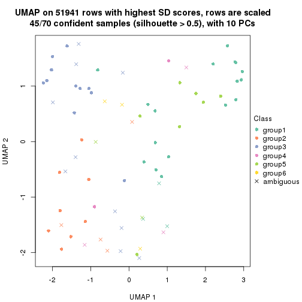</p>

</div>
</div>


Following heatmap shows how subgroups are split when increasing `k`:

```r
collect_classes(res)
```


Test correlation between subgroups and known annotations. If the known
annotation is numeric, one-way ANOVA test is applied, and if the known
annotation is discrete, chi-squared contingency table test is applied.

```r
test_to_known_factors(res)
```

```
#>            n disease.state(p) k
#> SD:hclust 66           0.0542 2
#> SD:hclust 60           0.0942 3
#> SD:hclust 50           0.0870 4
#> SD:hclust 53           0.1027 5
#> SD:hclust 45           0.1044 6
```


If matrix rows can be associated to genes, consider to use `GO_Enrichment(res,
...)` to perform function enrichment for the signature genes.


 

---------------------------------------------------


### SD:kmeans**


The object with results only for a single top-value method and a single partition method 
can be extracted as:

```r
res = res_list["SD", "kmeans"]
# you can also extract it by
# res = res_list["SD:kmeans"]
```

A summary of `res` and all the functions that can be applied to it:

```r
res
```

```
#> A 'ConsensusPartition' object with k = 2, 3, 4, 5, 6.
#>   On a matrix with 51941 rows and 70 columns.
#>   Top rows (1000, 2000, 3000, 4000, 5000) are extracted by 'SD' method.
#>   Subgroups are detected by 'kmeans' method.
#>   Performed in total 1250 partitions by row resampling.
#>   Best k for subgroups seems to be 2.
#> 
#> Following methods can be applied to this 'ConsensusPartition' object:
#>  [1] "cola_report"             "collect_classes"         "collect_plots"          
#>  [4] "collect_stats"           "colnames"                "compare_signatures"     
#>  [7] "consensus_heatmap"       "dimension_reduction"     "functional_enrichment"  
#> [10] "get_anno_col"            "get_anno"                "get_classes"            
#> [13] "get_consensus"           "get_matrix"              "get_membership"         
#> [16] "get_param"               "get_signatures"          "get_stats"              
#> [19] "is_best_k"               "is_stable_k"             "membership_heatmap"     
#> [22] "ncol"                    "nrow"                    "plot_ecdf"              
#> [25] "rownames"                "select_partition_number" "show"                   
#> [28] "suggest_best_k"          "test_to_known_factors"
```

`collect_plots()` function collects all the plots made from `res` for all `k` (number of partitions)
into one single page to provide an easy and fast comparison between different `k`.

```r
collect_plots(res)
```


The plots are:

- The first row: a plot of the ECDF (Empirical cumulative distribution
  function) curves of the consensus matrix for each `k` and the heatmap of
  predicted classes for each `k`.
- The second row: heatmaps of the consensus matrix for each `k`.
- The third row: heatmaps of the membership matrix for each `k`.
- The fouth row: heatmaps of the signatures for each `k`.

All the plots in panels can be made by individual functions and they are
plotted later in this section.

`select_partition_number()` produces several plots showing different
statistics for choosing "optimized" `k`. There are following statistics:

- ECDF curves of the consensus matrix for each `k`;
- 1-PAC. [The PAC
  score](https://en.wikipedia.org/wiki/Consensus_clustering#Over-interpretation_potential_of_consensus_clustering)
  measures the proportion of the ambiguous subgrouping.
- Mean silhouette score.
- Concordance. The mean probability of fiting the consensus class ids in all
  partitions.
- Area increased. Denote $A_k$ as the area under the ECDF curve for current
  `k`, the area increased is defined as $A_k - A_{k-1}$.
- Rand index. The percent of pairs of samples that are both in a same cluster
  or both are not in a same cluster in the partition of k and k-1.
- Jaccard index. The ratio of pairs of samples are both in a same cluster in
  the partition of k and k-1 and the pairs of samples are both in a same
  cluster in the partition k or k-1.

The detailed explanations of these statistics can be found in [the cola
vignette](http://bioconductor.org/packages/devel/bioc/vignettes/cola/inst/doc/cola.html#toc_13).

Generally speaking, lower PAC score, higher mean silhouette score or higher
concordance corresponds to better partition. Rand index and Jaccard index
measure how similar the current partition is compared to partition with `k-1`.
If they are too similar, we won't accept `k` is better than `k-1`.

```r
select_partition_number(res)
```


The numeric values for all these statistics can be obtained by `get_stats()`.

```r
get_stats(res)
```

```
#>   k 1-PAC mean_silhouette concordance area_increased  Rand Jaccard
#> 2 2 1.000           0.975       0.991         0.4947 0.503   0.503
#> 3 3 0.569           0.618       0.710         0.2817 0.822   0.652
#> 4 4 0.576           0.622       0.771         0.1463 0.798   0.491
#> 5 5 0.666           0.721       0.811         0.0802 0.925   0.723
#> 6 6 0.778           0.611       0.761         0.0483 0.912   0.632
```

`suggest_best_k()` suggests the best $k$ based on these statistics. The rules are as follows:

- All $k$ with Jaccard index larger than 0.95 are removed because the increase of
  the partition number does not provides enough extra information. If all $k$ are removed,
  the best $k$ is assigned by `NA`.
- For $k$ with 1-PAC larger than 0.9, the maximal $k$ is taken as the "best k". Other $k$ is called "optional k".
- If it does not fit the second rule. The $k$ with the highest vote of highest
  1-PAC, mean silhouette and concordance is taken as the "best k".

```r
suggest_best_k(res)
```

```
#> [1] 2
```


Following shows the table of the partitions (You need to click the **show/hide
code output** link to see it). The membership matrix (columns with name `p*`)
is inferred by
[`clue::cl_consensus()`](https://www.rdocumentation.org/link/cl_consensus?package=clue)
function with the `SE` method. Basically the value in the membership matrix
represents the probability to belong to a certain group. The finall class
label for an item is determined with the group with highest probability it
belongs to.

In `get_classes()` function, the entropy is calculated from the membership
matrix and the silhouette score is calculated from the consensus matrix.


<script>
$( function() {
	$( '#tabs-SD-kmeans-get-classes' ).tabs();
} );
</script>
<div id='tabs-SD-kmeans-get-classes'>
<ul>
<li><a href='#tab-SD-kmeans-get-classes-1'>k = 2</a></li>
<li><a href='#tab-SD-kmeans-get-classes-2'>k = 3</a></li>
<li><a href='#tab-SD-kmeans-get-classes-3'>k = 4</a></li>
<li><a href='#tab-SD-kmeans-get-classes-4'>k = 5</a></li>
<li><a href='#tab-SD-kmeans-get-classes-5'>k = 6</a></li>
</ul>

<div id='tab-SD-kmeans-get-classes-1'>
<p><a id='tab-SD-kmeans-get-classes-1-a' style='color:#0366d6' href='#'>show/hide code output</a></p>
<pre><code class="r">cbind(get_classes(res, k = 2), get_membership(res, k = 2))
</code></pre>

<pre><code>#&gt;            class entropy silhouette    p1    p2
#&gt; GSM1299517     2   0.000     0.9985 0.000 1.000
#&gt; GSM1299518     2   0.000     0.9985 0.000 1.000
#&gt; GSM1299519     2   0.000     0.9985 0.000 1.000
#&gt; GSM1299520     1   0.000     0.9795 1.000 0.000
#&gt; GSM1299521     1   0.000     0.9795 1.000 0.000
#&gt; GSM1299522     2   0.000     0.9985 0.000 1.000
#&gt; GSM1299523     1   0.118     0.9677 0.984 0.016
#&gt; GSM1299524     2   0.000     0.9985 0.000 1.000
#&gt; GSM1299525     2   0.000     0.9985 0.000 1.000
#&gt; GSM1299526     2   0.000     0.9985 0.000 1.000
#&gt; GSM1299527     2   0.000     0.9985 0.000 1.000
#&gt; GSM1299528     2   0.000     0.9985 0.000 1.000
#&gt; GSM1299529     2   0.000     0.9985 0.000 1.000
#&gt; GSM1299530     1   0.000     0.9795 1.000 0.000
#&gt; GSM1299531     2   0.000     0.9985 0.000 1.000
#&gt; GSM1299575     1   0.000     0.9795 1.000 0.000
#&gt; GSM1299532     2   0.000     0.9985 0.000 1.000
#&gt; GSM1299533     2   0.242     0.9577 0.040 0.960
#&gt; GSM1299534     2   0.000     0.9985 0.000 1.000
#&gt; GSM1299535     2   0.000     0.9985 0.000 1.000
#&gt; GSM1299536     1   0.000     0.9795 1.000 0.000
#&gt; GSM1299537     2   0.000     0.9985 0.000 1.000
#&gt; GSM1299538     1   0.204     0.9540 0.968 0.032
#&gt; GSM1299539     1   0.204     0.9540 0.968 0.032
#&gt; GSM1299540     2   0.118     0.9832 0.016 0.984
#&gt; GSM1299541     2   0.000     0.9985 0.000 1.000
#&gt; GSM1299542     2   0.000     0.9985 0.000 1.000
#&gt; GSM1299543     2   0.000     0.9985 0.000 1.000
#&gt; GSM1299544     2   0.000     0.9985 0.000 1.000
#&gt; GSM1299545     1   0.000     0.9795 1.000 0.000
#&gt; GSM1299546     2   0.000     0.9985 0.000 1.000
#&gt; GSM1299547     1   0.000     0.9795 1.000 0.000
#&gt; GSM1299548     2   0.000     0.9985 0.000 1.000
#&gt; GSM1299549     1   0.000     0.9795 1.000 0.000
#&gt; GSM1299550     1   1.000     0.0381 0.508 0.492
#&gt; GSM1299551     2   0.000     0.9985 0.000 1.000
#&gt; GSM1299552     1   0.000     0.9795 1.000 0.000
#&gt; GSM1299553     1   0.000     0.9795 1.000 0.000
#&gt; GSM1299554     2   0.000     0.9985 0.000 1.000
#&gt; GSM1299555     2   0.000     0.9985 0.000 1.000
#&gt; GSM1299556     2   0.000     0.9985 0.000 1.000
#&gt; GSM1299557     2   0.000     0.9985 0.000 1.000
#&gt; GSM1299558     2   0.000     0.9985 0.000 1.000
#&gt; GSM1299559     2   0.000     0.9985 0.000 1.000
#&gt; GSM1299560     2   0.000     0.9985 0.000 1.000
#&gt; GSM1299576     1   0.000     0.9795 1.000 0.000
#&gt; GSM1299577     1   0.000     0.9795 1.000 0.000
#&gt; GSM1299561     2   0.000     0.9985 0.000 1.000
#&gt; GSM1299562     2   0.000     0.9985 0.000 1.000
#&gt; GSM1299563     1   0.000     0.9795 1.000 0.000
#&gt; GSM1299564     1   0.141     0.9647 0.980 0.020
#&gt; GSM1299565     2   0.000     0.9985 0.000 1.000
#&gt; GSM1299566     2   0.000     0.9985 0.000 1.000
#&gt; GSM1299567     1   0.000     0.9795 1.000 0.000
#&gt; GSM1299568     2   0.000     0.9985 0.000 1.000
#&gt; GSM1299569     2   0.000     0.9985 0.000 1.000
#&gt; GSM1299570     1   0.000     0.9795 1.000 0.000
#&gt; GSM1299571     2   0.000     0.9985 0.000 1.000
#&gt; GSM1299572     1   0.000     0.9795 1.000 0.000
#&gt; GSM1299573     2   0.000     0.9985 0.000 1.000
#&gt; GSM1299574     2   0.000     0.9985 0.000 1.000
#&gt; GSM1299578     1   0.000     0.9795 1.000 0.000
#&gt; GSM1299579     1   0.000     0.9795 1.000 0.000
#&gt; GSM1299580     1   0.000     0.9795 1.000 0.000
#&gt; GSM1299581     1   0.000     0.9795 1.000 0.000
#&gt; GSM1299582     1   0.000     0.9795 1.000 0.000
#&gt; GSM1299583     1   0.000     0.9795 1.000 0.000
#&gt; GSM1299584     1   0.000     0.9795 1.000 0.000
#&gt; GSM1299585     1   0.000     0.9795 1.000 0.000
#&gt; GSM1299586     1   0.000     0.9795 1.000 0.000
</code></pre>

<script>
$('#tab-SD-kmeans-get-classes-1-a').parent().next().next().hide();
$('#tab-SD-kmeans-get-classes-1-a').click(function(){
  $('#tab-SD-kmeans-get-classes-1-a').parent().next().next().toggle();
  return(false);
});
</script>
</div>

<div id='tab-SD-kmeans-get-classes-2'>
<p><a id='tab-SD-kmeans-get-classes-2-a' style='color:#0366d6' href='#'>show/hide code output</a></p>
<pre><code class="r">cbind(get_classes(res, k = 3), get_membership(res, k = 3))
</code></pre>

<pre><code>#&gt;            class entropy silhouette    p1    p2    p3
#&gt; GSM1299517     3  0.6225    0.77767 0.000 0.432 0.568
#&gt; GSM1299518     2  0.5529    0.13597 0.000 0.704 0.296
#&gt; GSM1299519     2  0.0000    0.64061 0.000 1.000 0.000
#&gt; GSM1299520     1  0.5058    0.84729 0.756 0.000 0.244
#&gt; GSM1299521     1  0.4605    0.81396 0.796 0.000 0.204
#&gt; GSM1299522     2  0.0000    0.64061 0.000 1.000 0.000
#&gt; GSM1299523     1  0.5397    0.82719 0.720 0.000 0.280
#&gt; GSM1299524     3  0.6204    0.78296 0.000 0.424 0.576
#&gt; GSM1299525     2  0.3340    0.57005 0.000 0.880 0.120
#&gt; GSM1299526     2  0.0000    0.64061 0.000 1.000 0.000
#&gt; GSM1299527     3  0.6225    0.77767 0.000 0.432 0.568
#&gt; GSM1299528     2  0.6026    0.00993 0.000 0.624 0.376
#&gt; GSM1299529     2  0.2711    0.57195 0.000 0.912 0.088
#&gt; GSM1299530     1  0.4605    0.86076 0.796 0.000 0.204
#&gt; GSM1299531     2  0.3340    0.56206 0.000 0.880 0.120
#&gt; GSM1299575     1  0.1529    0.87468 0.960 0.000 0.040
#&gt; GSM1299532     3  0.6235    0.77474 0.000 0.436 0.564
#&gt; GSM1299533     2  0.7583    0.18465 0.040 0.492 0.468
#&gt; GSM1299534     2  0.6192   -0.30180 0.000 0.580 0.420
#&gt; GSM1299535     2  0.6225   -0.32751 0.000 0.568 0.432
#&gt; GSM1299536     1  0.5560    0.81993 0.700 0.000 0.300
#&gt; GSM1299537     3  0.6180    0.78440 0.000 0.416 0.584
#&gt; GSM1299538     1  0.6096    0.81967 0.704 0.016 0.280
#&gt; GSM1299539     1  0.6475    0.81299 0.692 0.028 0.280
#&gt; GSM1299540     3  0.8570    0.09914 0.096 0.428 0.476
#&gt; GSM1299541     3  0.6192    0.78553 0.000 0.420 0.580
#&gt; GSM1299542     3  0.6235    0.77474 0.000 0.436 0.564
#&gt; GSM1299543     2  0.0000    0.64061 0.000 1.000 0.000
#&gt; GSM1299544     2  0.6168   -0.25496 0.000 0.588 0.412
#&gt; GSM1299545     1  0.3412    0.87376 0.876 0.000 0.124
#&gt; GSM1299546     2  0.0000    0.64061 0.000 1.000 0.000
#&gt; GSM1299547     1  0.5178    0.81948 0.744 0.000 0.256
#&gt; GSM1299548     3  0.6168    0.78446 0.000 0.412 0.588
#&gt; GSM1299549     1  0.5591    0.81842 0.696 0.000 0.304
#&gt; GSM1299550     3  0.5911    0.14500 0.156 0.060 0.784
#&gt; GSM1299551     2  0.0000    0.64061 0.000 1.000 0.000
#&gt; GSM1299552     1  0.5138    0.81946 0.748 0.000 0.252
#&gt; GSM1299553     1  0.4235    0.86341 0.824 0.000 0.176
#&gt; GSM1299554     3  0.6111    0.76499 0.000 0.396 0.604
#&gt; GSM1299555     2  0.6235   -0.25372 0.000 0.564 0.436
#&gt; GSM1299556     3  0.6062    0.74715 0.000 0.384 0.616
#&gt; GSM1299557     3  0.6260    0.50706 0.000 0.448 0.552
#&gt; GSM1299558     2  0.2959    0.58193 0.000 0.900 0.100
#&gt; GSM1299559     3  0.5560    0.60491 0.000 0.300 0.700
#&gt; GSM1299560     3  0.6244    0.76811 0.000 0.440 0.560
#&gt; GSM1299576     1  0.0592    0.87318 0.988 0.000 0.012
#&gt; GSM1299577     1  0.2625    0.87777 0.916 0.000 0.084
#&gt; GSM1299561     3  0.6180    0.78607 0.000 0.416 0.584
#&gt; GSM1299562     2  0.4842    0.38814 0.000 0.776 0.224
#&gt; GSM1299563     1  0.4974    0.85029 0.764 0.000 0.236
#&gt; GSM1299564     1  0.5678    0.80027 0.684 0.000 0.316
#&gt; GSM1299565     2  0.0000    0.64061 0.000 1.000 0.000
#&gt; GSM1299566     2  0.6140    0.07707 0.000 0.596 0.404
#&gt; GSM1299567     1  0.6062    0.71946 0.616 0.000 0.384
#&gt; GSM1299568     2  0.5948   -0.04466 0.000 0.640 0.360
#&gt; GSM1299569     2  0.6215   -0.31897 0.000 0.572 0.428
#&gt; GSM1299570     1  0.5058    0.84729 0.756 0.000 0.244
#&gt; GSM1299571     2  0.0000    0.64061 0.000 1.000 0.000
#&gt; GSM1299572     1  0.5291    0.82029 0.732 0.000 0.268
#&gt; GSM1299573     3  0.6225    0.77767 0.000 0.432 0.568
#&gt; GSM1299574     2  0.0424    0.63558 0.000 0.992 0.008
#&gt; GSM1299578     1  0.1163    0.87460 0.972 0.000 0.028
#&gt; GSM1299579     1  0.1163    0.87113 0.972 0.000 0.028
#&gt; GSM1299580     1  0.1529    0.87468 0.960 0.000 0.040
#&gt; GSM1299581     1  0.0592    0.87318 0.988 0.000 0.012
#&gt; GSM1299582     1  0.0000    0.87393 1.000 0.000 0.000
#&gt; GSM1299583     1  0.1753    0.86714 0.952 0.000 0.048
#&gt; GSM1299584     1  0.0592    0.87318 0.988 0.000 0.012
#&gt; GSM1299585     1  0.4605    0.81396 0.796 0.000 0.204
#&gt; GSM1299586     1  0.0592    0.87318 0.988 0.000 0.012
</code></pre>

<script>
$('#tab-SD-kmeans-get-classes-2-a').parent().next().next().hide();
$('#tab-SD-kmeans-get-classes-2-a').click(function(){
  $('#tab-SD-kmeans-get-classes-2-a').parent().next().next().toggle();
  return(false);
});
</script>
</div>

<div id='tab-SD-kmeans-get-classes-3'>
<p><a id='tab-SD-kmeans-get-classes-3-a' style='color:#0366d6' href='#'>show/hide code output</a></p>
<pre><code class="r">cbind(get_classes(res, k = 4), get_membership(res, k = 4))
</code></pre>

<pre><code>#&gt;            class entropy silhouette    p1    p2    p3    p4
#&gt; GSM1299517     3   0.316     0.7900 0.004 0.144 0.852 0.000
#&gt; GSM1299518     2   0.528     0.0752 0.004 0.560 0.432 0.004
#&gt; GSM1299519     2   0.130     0.8256 0.000 0.956 0.044 0.000
#&gt; GSM1299520     4   0.253     0.7644 0.112 0.000 0.000 0.888
#&gt; GSM1299521     1   0.524     0.5539 0.768 0.008 0.136 0.088
#&gt; GSM1299522     2   0.158     0.8260 0.000 0.948 0.048 0.004
#&gt; GSM1299523     4   0.271     0.7640 0.112 0.004 0.000 0.884
#&gt; GSM1299524     3   0.469     0.7813 0.024 0.140 0.804 0.032
#&gt; GSM1299525     2   0.278     0.7600 0.000 0.896 0.020 0.084
#&gt; GSM1299526     2   0.158     0.8260 0.000 0.948 0.048 0.004
#&gt; GSM1299527     3   0.316     0.7900 0.004 0.144 0.852 0.000
#&gt; GSM1299528     3   0.678     0.5503 0.004 0.328 0.568 0.100
#&gt; GSM1299529     2   0.140     0.7768 0.000 0.956 0.004 0.040
#&gt; GSM1299530     4   0.271     0.7617 0.112 0.000 0.004 0.884
#&gt; GSM1299531     2   0.552     0.5555 0.008 0.712 0.232 0.048
#&gt; GSM1299575     1   0.482     0.4531 0.652 0.004 0.000 0.344
#&gt; GSM1299532     3   0.297     0.7904 0.000 0.144 0.856 0.000
#&gt; GSM1299533     2   0.926     0.1144 0.332 0.344 0.240 0.084
#&gt; GSM1299534     3   0.617     0.6361 0.000 0.284 0.632 0.084
#&gt; GSM1299535     3   0.624     0.6466 0.024 0.260 0.664 0.052
#&gt; GSM1299536     1   0.712     0.3542 0.592 0.012 0.140 0.256
#&gt; GSM1299537     3   0.368     0.7872 0.004 0.140 0.840 0.016
#&gt; GSM1299538     4   0.180     0.7189 0.032 0.016 0.004 0.948
#&gt; GSM1299539     4   0.232     0.7114 0.032 0.036 0.004 0.928
#&gt; GSM1299540     4   0.837    -0.1273 0.020 0.252 0.352 0.376
#&gt; GSM1299541     3   0.343     0.7896 0.004 0.140 0.848 0.008
#&gt; GSM1299542     3   0.297     0.7904 0.000 0.144 0.856 0.000
#&gt; GSM1299543     2   0.158     0.8253 0.000 0.948 0.048 0.004
#&gt; GSM1299544     3   0.650     0.6186 0.004 0.292 0.612 0.092
#&gt; GSM1299545     4   0.431     0.5964 0.260 0.004 0.000 0.736
#&gt; GSM1299546     2   0.139     0.8261 0.000 0.952 0.048 0.000
#&gt; GSM1299547     1   0.646     0.5010 0.668 0.008 0.140 0.184
#&gt; GSM1299548     3   0.324     0.7898 0.004 0.136 0.856 0.004
#&gt; GSM1299549     1   0.683     0.4710 0.652 0.020 0.140 0.188
#&gt; GSM1299550     3   0.810    -0.0744 0.228 0.012 0.408 0.352
#&gt; GSM1299551     2   0.130     0.8256 0.000 0.956 0.044 0.000
#&gt; GSM1299552     1   0.646     0.5074 0.676 0.012 0.136 0.176
#&gt; GSM1299553     4   0.507     0.6605 0.224 0.036 0.004 0.736
#&gt; GSM1299554     3   0.472     0.7648 0.000 0.136 0.788 0.076
#&gt; GSM1299555     3   0.733     0.2760 0.020 0.380 0.504 0.096
#&gt; GSM1299556     3   0.507     0.7431 0.020 0.116 0.792 0.072
#&gt; GSM1299557     3   0.619     0.6266 0.004 0.288 0.636 0.072
#&gt; GSM1299558     2   0.546     0.5566 0.004 0.712 0.232 0.052
#&gt; GSM1299559     3   0.543     0.6266 0.020 0.044 0.744 0.192
#&gt; GSM1299560     3   0.297     0.7904 0.000 0.144 0.856 0.000
#&gt; GSM1299576     1   0.384     0.6191 0.776 0.000 0.000 0.224
#&gt; GSM1299577     4   0.492     0.1795 0.424 0.000 0.000 0.576
#&gt; GSM1299561     3   0.297     0.7904 0.000 0.144 0.856 0.000
#&gt; GSM1299562     2   0.568     0.5348 0.020 0.704 0.240 0.036
#&gt; GSM1299563     4   0.253     0.7644 0.112 0.000 0.000 0.888
#&gt; GSM1299564     4   0.244     0.7469 0.068 0.004 0.012 0.916
#&gt; GSM1299565     2   0.158     0.8260 0.000 0.948 0.048 0.004
#&gt; GSM1299566     3   0.804     0.4230 0.020 0.328 0.464 0.188
#&gt; GSM1299567     4   0.392     0.6651 0.056 0.000 0.104 0.840
#&gt; GSM1299568     3   0.648     0.5710 0.000 0.324 0.584 0.092
#&gt; GSM1299569     3   0.646     0.6287 0.004 0.284 0.620 0.092
#&gt; GSM1299570     4   0.253     0.7644 0.112 0.000 0.000 0.888
#&gt; GSM1299571     2   0.139     0.8261 0.000 0.952 0.048 0.000
#&gt; GSM1299572     1   0.642     0.4804 0.680 0.012 0.140 0.168
#&gt; GSM1299573     3   0.292     0.7905 0.000 0.140 0.860 0.000
#&gt; GSM1299574     2   0.149     0.8144 0.000 0.956 0.032 0.012
#&gt; GSM1299578     1   0.482     0.4531 0.652 0.004 0.000 0.344
#&gt; GSM1299579     1   0.387     0.6206 0.772 0.000 0.000 0.228
#&gt; GSM1299580     1   0.482     0.4531 0.652 0.004 0.000 0.344
#&gt; GSM1299581     1   0.384     0.6191 0.776 0.000 0.000 0.224
#&gt; GSM1299582     1   0.413     0.5811 0.740 0.000 0.000 0.260
#&gt; GSM1299583     1   0.353     0.6229 0.808 0.000 0.000 0.192
#&gt; GSM1299584     1   0.384     0.6191 0.776 0.000 0.000 0.224
#&gt; GSM1299585     1   0.524     0.5539 0.768 0.008 0.136 0.088
#&gt; GSM1299586     1   0.384     0.6191 0.776 0.000 0.000 0.224
</code></pre>

<script>
$('#tab-SD-kmeans-get-classes-3-a').parent().next().next().hide();
$('#tab-SD-kmeans-get-classes-3-a').click(function(){
  $('#tab-SD-kmeans-get-classes-3-a').parent().next().next().toggle();
  return(false);
});
</script>
</div>

<div id='tab-SD-kmeans-get-classes-4'>
<p><a id='tab-SD-kmeans-get-classes-4-a' style='color:#0366d6' href='#'>show/hide code output</a></p>
<pre><code class="r">cbind(get_classes(res, k = 5), get_membership(res, k = 5))
</code></pre>

<pre><code>#&gt;            class entropy silhouette    p1    p2    p3    p4    p5
#&gt; GSM1299517     3  0.0566     0.7806 0.000 0.000 0.984 0.004 0.012
#&gt; GSM1299518     3  0.4971    -0.0737 0.000 0.472 0.504 0.004 0.020
#&gt; GSM1299519     2  0.1270     0.8581 0.000 0.948 0.052 0.000 0.000
#&gt; GSM1299520     4  0.2969     0.8402 0.128 0.000 0.000 0.852 0.020
#&gt; GSM1299521     5  0.4401     0.7807 0.328 0.000 0.000 0.016 0.656
#&gt; GSM1299522     2  0.1697     0.8586 0.000 0.932 0.060 0.000 0.008
#&gt; GSM1299523     4  0.2824     0.8414 0.116 0.000 0.000 0.864 0.020
#&gt; GSM1299524     3  0.3264     0.7509 0.000 0.004 0.836 0.020 0.140
#&gt; GSM1299525     2  0.4843     0.6995 0.000 0.756 0.020 0.104 0.120
#&gt; GSM1299526     2  0.1697     0.8586 0.000 0.932 0.060 0.000 0.008
#&gt; GSM1299527     3  0.0865     0.7792 0.000 0.000 0.972 0.004 0.024
#&gt; GSM1299528     3  0.7255     0.5073 0.000 0.176 0.544 0.088 0.192
#&gt; GSM1299529     2  0.4187     0.7190 0.000 0.804 0.016 0.080 0.100
#&gt; GSM1299530     4  0.3060     0.8394 0.128 0.000 0.000 0.848 0.024
#&gt; GSM1299531     2  0.6674     0.4154 0.000 0.556 0.268 0.036 0.140
#&gt; GSM1299575     1  0.2248     0.8405 0.900 0.012 0.000 0.088 0.000
#&gt; GSM1299532     3  0.0290     0.7806 0.000 0.000 0.992 0.000 0.008
#&gt; GSM1299533     5  0.4521     0.6702 0.040 0.116 0.040 0.008 0.796
#&gt; GSM1299534     3  0.6040     0.6277 0.000 0.116 0.672 0.060 0.152
#&gt; GSM1299535     3  0.4316     0.7204 0.000 0.068 0.808 0.044 0.080
#&gt; GSM1299536     5  0.5159     0.8246 0.180 0.004 0.000 0.116 0.700
#&gt; GSM1299537     3  0.1753     0.7656 0.000 0.000 0.936 0.032 0.032
#&gt; GSM1299538     4  0.2618     0.7915 0.052 0.012 0.000 0.900 0.036
#&gt; GSM1299539     4  0.4056     0.7520 0.052 0.044 0.000 0.824 0.080
#&gt; GSM1299540     4  0.7126     0.0240 0.004 0.080 0.392 0.448 0.076
#&gt; GSM1299541     3  0.0898     0.7781 0.000 0.000 0.972 0.008 0.020
#&gt; GSM1299542     3  0.0798     0.7808 0.000 0.000 0.976 0.008 0.016
#&gt; GSM1299543     2  0.1502     0.8578 0.000 0.940 0.056 0.000 0.004
#&gt; GSM1299544     3  0.6477     0.5963 0.000 0.124 0.628 0.068 0.180
#&gt; GSM1299545     4  0.4607     0.6746 0.276 0.012 0.000 0.692 0.020
#&gt; GSM1299546     2  0.1410     0.8593 0.000 0.940 0.060 0.000 0.000
#&gt; GSM1299547     5  0.5140     0.8349 0.252 0.000 0.000 0.084 0.664
#&gt; GSM1299548     3  0.0451     0.7807 0.000 0.000 0.988 0.004 0.008
#&gt; GSM1299549     5  0.4693     0.8318 0.196 0.000 0.000 0.080 0.724
#&gt; GSM1299550     5  0.4055     0.6438 0.000 0.012 0.048 0.140 0.800
#&gt; GSM1299551     2  0.1270     0.8581 0.000 0.948 0.052 0.000 0.000
#&gt; GSM1299552     5  0.4955     0.8366 0.248 0.000 0.000 0.072 0.680
#&gt; GSM1299553     4  0.5907     0.6815 0.196 0.052 0.000 0.668 0.084
#&gt; GSM1299554     3  0.4082     0.7287 0.000 0.008 0.796 0.056 0.140
#&gt; GSM1299555     3  0.6740     0.4815 0.000 0.172 0.608 0.136 0.084
#&gt; GSM1299556     3  0.3180     0.7314 0.000 0.000 0.856 0.076 0.068
#&gt; GSM1299557     3  0.6793     0.5116 0.000 0.164 0.608 0.104 0.124
#&gt; GSM1299558     2  0.6602     0.4415 0.000 0.568 0.260 0.036 0.136
#&gt; GSM1299559     3  0.4589     0.6029 0.000 0.000 0.724 0.212 0.064
#&gt; GSM1299560     3  0.0290     0.7796 0.000 0.000 0.992 0.000 0.008
#&gt; GSM1299576     1  0.0000     0.8800 1.000 0.000 0.000 0.000 0.000
#&gt; GSM1299577     1  0.4522    -0.0167 0.552 0.000 0.000 0.440 0.008
#&gt; GSM1299561     3  0.1012     0.7812 0.000 0.000 0.968 0.012 0.020
#&gt; GSM1299562     2  0.6463     0.4276 0.000 0.556 0.280 0.020 0.144
#&gt; GSM1299563     4  0.3099     0.8395 0.124 0.000 0.000 0.848 0.028
#&gt; GSM1299564     4  0.2864     0.8406 0.112 0.000 0.000 0.864 0.024
#&gt; GSM1299565     2  0.1697     0.8586 0.000 0.932 0.060 0.000 0.008
#&gt; GSM1299566     3  0.7747     0.4603 0.000 0.176 0.484 0.124 0.216
#&gt; GSM1299567     4  0.3980     0.7962 0.104 0.008 0.032 0.828 0.028
#&gt; GSM1299568     3  0.6533     0.5741 0.000 0.156 0.620 0.060 0.164
#&gt; GSM1299569     3  0.6182     0.6200 0.000 0.116 0.656 0.060 0.168
#&gt; GSM1299570     4  0.2969     0.8402 0.128 0.000 0.000 0.852 0.020
#&gt; GSM1299571     2  0.1410     0.8593 0.000 0.940 0.060 0.000 0.000
#&gt; GSM1299572     5  0.5157     0.8402 0.224 0.004 0.004 0.076 0.692
#&gt; GSM1299573     3  0.0898     0.7807 0.000 0.000 0.972 0.008 0.020
#&gt; GSM1299574     2  0.1430     0.8572 0.000 0.944 0.052 0.000 0.004
#&gt; GSM1299578     1  0.2248     0.8405 0.900 0.012 0.000 0.088 0.000
#&gt; GSM1299579     1  0.1205     0.8374 0.956 0.000 0.000 0.004 0.040
#&gt; GSM1299580     1  0.2248     0.8405 0.900 0.012 0.000 0.088 0.000
#&gt; GSM1299581     1  0.0000     0.8800 1.000 0.000 0.000 0.000 0.000
#&gt; GSM1299582     1  0.0290     0.8789 0.992 0.000 0.000 0.008 0.000
#&gt; GSM1299583     1  0.0880     0.8471 0.968 0.000 0.000 0.000 0.032
#&gt; GSM1299584     1  0.0000     0.8800 1.000 0.000 0.000 0.000 0.000
#&gt; GSM1299585     5  0.4401     0.7807 0.328 0.000 0.000 0.016 0.656
#&gt; GSM1299586     1  0.0000     0.8800 1.000 0.000 0.000 0.000 0.000
</code></pre>

<script>
$('#tab-SD-kmeans-get-classes-4-a').parent().next().next().hide();
$('#tab-SD-kmeans-get-classes-4-a').click(function(){
  $('#tab-SD-kmeans-get-classes-4-a').parent().next().next().toggle();
  return(false);
});
</script>
</div>

<div id='tab-SD-kmeans-get-classes-5'>
<p><a id='tab-SD-kmeans-get-classes-5-a' style='color:#0366d6' href='#'>show/hide code output</a></p>
<pre><code class="r">cbind(get_classes(res, k = 6), get_membership(res, k = 6))
</code></pre>

<pre><code>#&gt;            class entropy silhouette    p1    p2    p3    p4    p5    p6
#&gt; GSM1299517     3  0.3965    0.31350 0.000 0.000 0.616 0.004 0.004 0.376
#&gt; GSM1299518     2  0.5995   -0.05184 0.000 0.508 0.228 0.004 0.004 0.256
#&gt; GSM1299519     2  0.0363    0.83838 0.000 0.988 0.012 0.000 0.000 0.000
#&gt; GSM1299520     4  0.2106    0.86520 0.064 0.000 0.000 0.904 0.032 0.000
#&gt; GSM1299521     5  0.2482    0.89244 0.148 0.000 0.000 0.004 0.848 0.000
#&gt; GSM1299522     2  0.0653    0.83823 0.000 0.980 0.012 0.000 0.004 0.004
#&gt; GSM1299523     4  0.1921    0.86466 0.052 0.000 0.000 0.916 0.032 0.000
#&gt; GSM1299524     3  0.4087    0.31441 0.000 0.000 0.744 0.004 0.064 0.188
#&gt; GSM1299525     2  0.6379    0.50988 0.000 0.572 0.028 0.100 0.048 0.252
#&gt; GSM1299526     2  0.0653    0.83823 0.000 0.980 0.012 0.000 0.004 0.004
#&gt; GSM1299527     3  0.4118    0.26753 0.000 0.000 0.592 0.008 0.004 0.396
#&gt; GSM1299528     3  0.3243    0.39410 0.000 0.064 0.860 0.024 0.016 0.036
#&gt; GSM1299529     2  0.5625    0.55455 0.000 0.620 0.000 0.096 0.048 0.236
#&gt; GSM1299530     4  0.2106    0.86520 0.064 0.000 0.000 0.904 0.032 0.000
#&gt; GSM1299531     3  0.4885    0.02442 0.000 0.372 0.576 0.000 0.028 0.024
#&gt; GSM1299575     1  0.2854    0.84169 0.860 0.004 0.000 0.048 0.000 0.088
#&gt; GSM1299532     3  0.3907    0.25201 0.000 0.000 0.588 0.000 0.004 0.408
#&gt; GSM1299533     5  0.2471    0.85542 0.004 0.020 0.032 0.000 0.900 0.044
#&gt; GSM1299534     3  0.1625    0.44148 0.000 0.060 0.928 0.000 0.000 0.012
#&gt; GSM1299535     6  0.6033    0.30392 0.000 0.032 0.424 0.012 0.076 0.456
#&gt; GSM1299536     5  0.2711    0.90980 0.048 0.000 0.008 0.052 0.884 0.008
#&gt; GSM1299537     6  0.3838    0.05990 0.000 0.000 0.448 0.000 0.000 0.552
#&gt; GSM1299538     4  0.1413    0.81677 0.008 0.000 0.004 0.948 0.004 0.036
#&gt; GSM1299539     4  0.4369    0.67403 0.012 0.008 0.004 0.724 0.028 0.224
#&gt; GSM1299540     6  0.6553    0.47325 0.004 0.052 0.072 0.192 0.072 0.608
#&gt; GSM1299541     3  0.3747    0.28424 0.000 0.000 0.604 0.000 0.000 0.396
#&gt; GSM1299542     3  0.3563    0.35355 0.000 0.000 0.664 0.000 0.000 0.336
#&gt; GSM1299543     2  0.0622    0.83656 0.000 0.980 0.012 0.000 0.000 0.008
#&gt; GSM1299544     3  0.2734    0.42815 0.000 0.064 0.884 0.008 0.016 0.028
#&gt; GSM1299545     4  0.5264    0.65810 0.220 0.000 0.000 0.656 0.036 0.088
#&gt; GSM1299546     2  0.0363    0.83838 0.000 0.988 0.012 0.000 0.000 0.000
#&gt; GSM1299547     5  0.2658    0.91596 0.100 0.000 0.000 0.036 0.864 0.000
#&gt; GSM1299548     3  0.3923    0.31709 0.000 0.000 0.620 0.008 0.000 0.372
#&gt; GSM1299549     5  0.2544    0.91655 0.072 0.000 0.004 0.028 0.888 0.008
#&gt; GSM1299550     5  0.3597    0.83322 0.000 0.000 0.092 0.048 0.824 0.036
#&gt; GSM1299551     2  0.0363    0.83838 0.000 0.988 0.012 0.000 0.000 0.000
#&gt; GSM1299552     5  0.2476    0.91728 0.092 0.000 0.000 0.024 0.880 0.004
#&gt; GSM1299553     4  0.6081    0.56421 0.100 0.008 0.000 0.560 0.044 0.288
#&gt; GSM1299554     3  0.3213    0.39823 0.000 0.000 0.784 0.008 0.004 0.204
#&gt; GSM1299555     6  0.7012    0.53528 0.000 0.100 0.164 0.084 0.080 0.572
#&gt; GSM1299556     6  0.4347    0.47342 0.000 0.000 0.288 0.012 0.028 0.672
#&gt; GSM1299557     6  0.7244    0.23781 0.000 0.088 0.260 0.108 0.048 0.496
#&gt; GSM1299558     3  0.4502   -0.03086 0.000 0.404 0.568 0.000 0.016 0.012
#&gt; GSM1299559     6  0.5365    0.54676 0.000 0.000 0.184 0.128 0.032 0.656
#&gt; GSM1299560     3  0.3774    0.25449 0.000 0.000 0.592 0.000 0.000 0.408
#&gt; GSM1299576     1  0.0603    0.89820 0.980 0.000 0.000 0.000 0.004 0.016
#&gt; GSM1299577     1  0.4566    0.00707 0.540 0.000 0.000 0.428 0.028 0.004
#&gt; GSM1299561     3  0.3607    0.34812 0.000 0.000 0.652 0.000 0.000 0.348
#&gt; GSM1299562     2  0.6905    0.21402 0.000 0.488 0.224 0.004 0.084 0.200
#&gt; GSM1299563     4  0.2106    0.86520 0.064 0.000 0.000 0.904 0.032 0.000
#&gt; GSM1299564     4  0.1856    0.86374 0.048 0.000 0.000 0.920 0.032 0.000
#&gt; GSM1299565     2  0.0653    0.83823 0.000 0.980 0.012 0.000 0.004 0.004
#&gt; GSM1299566     3  0.5106    0.26158 0.000 0.072 0.728 0.044 0.024 0.132
#&gt; GSM1299567     4  0.3804    0.77946 0.044 0.000 0.000 0.772 0.008 0.176
#&gt; GSM1299568     3  0.1327    0.43962 0.000 0.064 0.936 0.000 0.000 0.000
#&gt; GSM1299569     3  0.1769    0.43561 0.000 0.060 0.924 0.004 0.012 0.000
#&gt; GSM1299570     4  0.2106    0.86520 0.064 0.000 0.000 0.904 0.032 0.000
#&gt; GSM1299571     2  0.0653    0.83823 0.000 0.980 0.012 0.000 0.004 0.004
#&gt; GSM1299572     5  0.2145    0.90539 0.044 0.000 0.004 0.016 0.916 0.020
#&gt; GSM1299573     3  0.3983    0.34157 0.000 0.000 0.640 0.008 0.004 0.348
#&gt; GSM1299574     2  0.0622    0.83358 0.000 0.980 0.008 0.000 0.000 0.012
#&gt; GSM1299578     1  0.2854    0.84169 0.860 0.004 0.000 0.048 0.000 0.088
#&gt; GSM1299579     1  0.0603    0.89276 0.980 0.000 0.000 0.000 0.016 0.004
#&gt; GSM1299580     1  0.2854    0.84169 0.860 0.004 0.000 0.048 0.000 0.088
#&gt; GSM1299581     1  0.0291    0.89766 0.992 0.000 0.000 0.000 0.004 0.004
#&gt; GSM1299582     1  0.0291    0.89796 0.992 0.000 0.000 0.004 0.004 0.000
#&gt; GSM1299583     1  0.0603    0.89276 0.980 0.000 0.000 0.000 0.016 0.004
#&gt; GSM1299584     1  0.0146    0.89806 0.996 0.000 0.000 0.000 0.004 0.000
#&gt; GSM1299585     5  0.2482    0.89244 0.148 0.000 0.000 0.004 0.848 0.000
#&gt; GSM1299586     1  0.0508    0.89789 0.984 0.000 0.000 0.000 0.004 0.012
</code></pre>

<script>
$('#tab-SD-kmeans-get-classes-5-a').parent().next().next().hide();
$('#tab-SD-kmeans-get-classes-5-a').click(function(){
  $('#tab-SD-kmeans-get-classes-5-a').parent().next().next().toggle();
  return(false);
});
</script>
</div>
</div>

Heatmaps for the consensus matrix. It visualizes the probability of two
samples to be in a same group.


<script>
$( function() {
	$( '#tabs-SD-kmeans-consensus-heatmap' ).tabs();
} );
</script>
<div id='tabs-SD-kmeans-consensus-heatmap'>
<ul>
<li><a href='#tab-SD-kmeans-consensus-heatmap-1'>k = 2</a></li>
<li><a href='#tab-SD-kmeans-consensus-heatmap-2'>k = 3</a></li>
<li><a href='#tab-SD-kmeans-consensus-heatmap-3'>k = 4</a></li>
<li><a href='#tab-SD-kmeans-consensus-heatmap-4'>k = 5</a></li>
<li><a href='#tab-SD-kmeans-consensus-heatmap-5'>k = 6</a></li>
</ul>
<div id='tab-SD-kmeans-consensus-heatmap-1'>
<pre><code class="r">consensus_heatmap(res, k = 2)
</code></pre>

<p></p>

</div>
<div id='tab-SD-kmeans-consensus-heatmap-2'>
<pre><code class="r">consensus_heatmap(res, k = 3)
</code></pre>

<p></p>

</div>
<div id='tab-SD-kmeans-consensus-heatmap-3'>
<pre><code class="r">consensus_heatmap(res, k = 4)
</code></pre>

<p></p>

</div>
<div id='tab-SD-kmeans-consensus-heatmap-4'>
<pre><code class="r">consensus_heatmap(res, k = 5)
</code></pre>

<p></p>

</div>
<div id='tab-SD-kmeans-consensus-heatmap-5'>
<pre><code class="r">consensus_heatmap(res, k = 6)
</code></pre>

<p></p>

</div>
</div>

Heatmaps for the membership of samples in all partitions to see how consistent they are:


<script>
$( function() {
	$( '#tabs-SD-kmeans-membership-heatmap' ).tabs();
} );
</script>
<div id='tabs-SD-kmeans-membership-heatmap'>
<ul>
<li><a href='#tab-SD-kmeans-membership-heatmap-1'>k = 2</a></li>
<li><a href='#tab-SD-kmeans-membership-heatmap-2'>k = 3</a></li>
<li><a href='#tab-SD-kmeans-membership-heatmap-3'>k = 4</a></li>
<li><a href='#tab-SD-kmeans-membership-heatmap-4'>k = 5</a></li>
<li><a href='#tab-SD-kmeans-membership-heatmap-5'>k = 6</a></li>
</ul>
<div id='tab-SD-kmeans-membership-heatmap-1'>
<pre><code class="r">membership_heatmap(res, k = 2)
</code></pre>

<p></p>

</div>
<div id='tab-SD-kmeans-membership-heatmap-2'>
<pre><code class="r">membership_heatmap(res, k = 3)
</code></pre>

<p></p>

</div>
<div id='tab-SD-kmeans-membership-heatmap-3'>
<pre><code class="r">membership_heatmap(res, k = 4)
</code></pre>

<p></p>

</div>
<div id='tab-SD-kmeans-membership-heatmap-4'>
<pre><code class="r">membership_heatmap(res, k = 5)
</code></pre>

<p>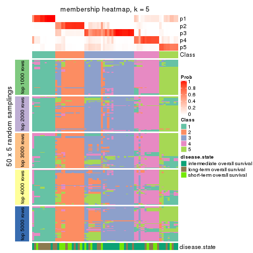</p>

</div>
<div id='tab-SD-kmeans-membership-heatmap-5'>
<pre><code class="r">membership_heatmap(res, k = 6)
</code></pre>

<p></p>

</div>
</div>

As soon as we have had the classes for columns, we can look for signatures
which are significantly different between classes which can be candidate marks
for certain classes. Following are the heatmaps for signatures.


Signature heatmaps where rows are scaled:


<script>
$( function() {
	$( '#tabs-SD-kmeans-get-signatures' ).tabs();
} );
</script>
<div id='tabs-SD-kmeans-get-signatures'>
<ul>
<li><a href='#tab-SD-kmeans-get-signatures-1'>k = 2</a></li>
<li><a href='#tab-SD-kmeans-get-signatures-2'>k = 3</a></li>
<li><a href='#tab-SD-kmeans-get-signatures-3'>k = 4</a></li>
<li><a href='#tab-SD-kmeans-get-signatures-4'>k = 5</a></li>
<li><a href='#tab-SD-kmeans-get-signatures-5'>k = 6</a></li>
</ul>
<div id='tab-SD-kmeans-get-signatures-1'>
<pre><code class="r">get_signatures(res, k = 2)
</code></pre>

<p></p>

</div>
<div id='tab-SD-kmeans-get-signatures-2'>
<pre><code class="r">get_signatures(res, k = 3)
</code></pre>

<p></p>

</div>
<div id='tab-SD-kmeans-get-signatures-3'>
<pre><code class="r">get_signatures(res, k = 4)
</code></pre>

<p></p>

</div>
<div id='tab-SD-kmeans-get-signatures-4'>
<pre><code class="r">get_signatures(res, k = 5)
</code></pre>

<p></p>

</div>
<div id='tab-SD-kmeans-get-signatures-5'>
<pre><code class="r">get_signatures(res, k = 6)
</code></pre>

<p></p>

</div>
</div>


Signature heatmaps where rows are not scaled:


<script>
$( function() {
	$( '#tabs-SD-kmeans-get-signatures-no-scale' ).tabs();
} );
</script>
<div id='tabs-SD-kmeans-get-signatures-no-scale'>
<ul>
<li><a href='#tab-SD-kmeans-get-signatures-no-scale-1'>k = 2</a></li>
<li><a href='#tab-SD-kmeans-get-signatures-no-scale-2'>k = 3</a></li>
<li><a href='#tab-SD-kmeans-get-signatures-no-scale-3'>k = 4</a></li>
<li><a href='#tab-SD-kmeans-get-signatures-no-scale-4'>k = 5</a></li>
<li><a href='#tab-SD-kmeans-get-signatures-no-scale-5'>k = 6</a></li>
</ul>
<div id='tab-SD-kmeans-get-signatures-no-scale-1'>
<pre><code class="r">get_signatures(res, k = 2, scale_rows = FALSE)
</code></pre>

<p></p>

</div>
<div id='tab-SD-kmeans-get-signatures-no-scale-2'>
<pre><code class="r">get_signatures(res, k = 3, scale_rows = FALSE)
</code></pre>

<p></p>

</div>
<div id='tab-SD-kmeans-get-signatures-no-scale-3'>
<pre><code class="r">get_signatures(res, k = 4, scale_rows = FALSE)
</code></pre>

<p></p>

</div>
<div id='tab-SD-kmeans-get-signatures-no-scale-4'>
<pre><code class="r">get_signatures(res, k = 5, scale_rows = FALSE)
</code></pre>

<p></p>

</div>
<div id='tab-SD-kmeans-get-signatures-no-scale-5'>
<pre><code class="r">get_signatures(res, k = 6, scale_rows = FALSE)
</code></pre>

<p></p>

</div>
</div>


Compare the overlap of signatures from different k:

```r
compare_signatures(res)
```


`get_signature()` returns a data frame invisibly. TO get the list of signatures, the function
call should be assigned to a variable explicitly. In following code, if `plot` argument is set
to `FALSE`, no heatmap is plotted while only the differential analysis is performed.

```r
# code only for demonstration
tb = get_signature(res, k = ..., plot = FALSE)
```

An example of the output of `tb` is:

```
#>   which_row         fdr    mean_1    mean_2 scaled_mean_1 scaled_mean_2 km
#> 1        38 0.042760348  8.373488  9.131774    -0.5533452     0.5164555  1
#> 2        40 0.018707592  7.106213  8.469186    -0.6173731     0.5762149  1
#> 3        55 0.019134737 10.221463 11.207825    -0.6159697     0.5749050  1
#> 4        59 0.006059896  5.921854  7.869574    -0.6899429     0.6439467  1
#> 5        60 0.018055526  8.928898 10.211722    -0.6204761     0.5791110  1
#> 6        98 0.009384629 15.714769 14.887706     0.6635654    -0.6193277  2
...
```

The columns in `tb` are:

1. `which_row`: row indices corresponding to the input matrix.
2. `fdr`: FDR for the differential test. 
3. `mean_x`: The mean value in group x.
4. `scaled_mean_x`: The mean value in group x after rows are scaled.
5. `km`: Row groups if k-means clustering is applied to rows.


UMAP plot which shows how samples are separated.


<script>
$( function() {
	$( '#tabs-SD-kmeans-dimension-reduction' ).tabs();
} );
</script>
<div id='tabs-SD-kmeans-dimension-reduction'>
<ul>
<li><a href='#tab-SD-kmeans-dimension-reduction-1'>k = 2</a></li>
<li><a href='#tab-SD-kmeans-dimension-reduction-2'>k = 3</a></li>
<li><a href='#tab-SD-kmeans-dimension-reduction-3'>k = 4</a></li>
<li><a href='#tab-SD-kmeans-dimension-reduction-4'>k = 5</a></li>
<li><a href='#tab-SD-kmeans-dimension-reduction-5'>k = 6</a></li>
</ul>
<div id='tab-SD-kmeans-dimension-reduction-1'>
<pre><code class="r">dimension_reduction(res, k = 2, method = &quot;UMAP&quot;)
</code></pre>

<p></p>

</div>
<div id='tab-SD-kmeans-dimension-reduction-2'>
<pre><code class="r">dimension_reduction(res, k = 3, method = &quot;UMAP&quot;)
</code></pre>

<p></p>

</div>
<div id='tab-SD-kmeans-dimension-reduction-3'>
<pre><code class="r">dimension_reduction(res, k = 4, method = &quot;UMAP&quot;)
</code></pre>

<p></p>

</div>
<div id='tab-SD-kmeans-dimension-reduction-4'>
<pre><code class="r">dimension_reduction(res, k = 5, method = &quot;UMAP&quot;)
</code></pre>

<p>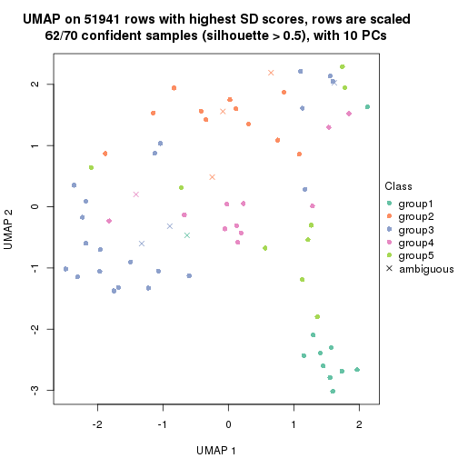</p>

</div>
<div id='tab-SD-kmeans-dimension-reduction-5'>
<pre><code class="r">dimension_reduction(res, k = 6, method = &quot;UMAP&quot;)
</code></pre>

<p>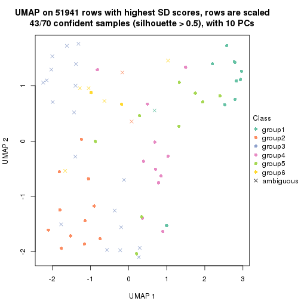</p>

</div>
</div>


Following heatmap shows how subgroups are split when increasing `k`:

```r
collect_classes(res)
```


Test correlation between subgroups and known annotations. If the known
annotation is numeric, one-way ANOVA test is applied, and if the known
annotation is discrete, chi-squared contingency table test is applied.

```r
test_to_known_factors(res)
```

```
#>            n disease.state(p) k
#> SD:kmeans 69           0.0803 2
#> SD:kmeans 57           0.0353 3
#> SD:kmeans 57           0.0903 4
#> SD:kmeans 62           0.0192 5
#> SD:kmeans 43           0.0327 6
```


If matrix rows can be associated to genes, consider to use `GO_Enrichment(res,
...)` to perform function enrichment for the signature genes.


 

---------------------------------------------------


### SD:skmeans**


The object with results only for a single top-value method and a single partition method 
can be extracted as:

```r
res = res_list["SD", "skmeans"]
# you can also extract it by
# res = res_list["SD:skmeans"]
```

A summary of `res` and all the functions that can be applied to it:

```r
res
```

```
#> A 'ConsensusPartition' object with k = 2, 3, 4, 5, 6.
#>   On a matrix with 51941 rows and 70 columns.
#>   Top rows (1000, 2000, 3000, 4000, 5000) are extracted by 'SD' method.
#>   Subgroups are detected by 'skmeans' method.
#>   Performed in total 1250 partitions by row resampling.
#>   Best k for subgroups seems to be 2.
#> 
#> Following methods can be applied to this 'ConsensusPartition' object:
#>  [1] "cola_report"             "collect_classes"         "collect_plots"          
#>  [4] "collect_stats"           "colnames"                "compare_signatures"     
#>  [7] "consensus_heatmap"       "dimension_reduction"     "functional_enrichment"  
#> [10] "get_anno_col"            "get_anno"                "get_classes"            
#> [13] "get_consensus"           "get_matrix"              "get_membership"         
#> [16] "get_param"               "get_signatures"          "get_stats"              
#> [19] "is_best_k"               "is_stable_k"             "membership_heatmap"     
#> [22] "ncol"                    "nrow"                    "plot_ecdf"              
#> [25] "rownames"                "select_partition_number" "show"                   
#> [28] "suggest_best_k"          "test_to_known_factors"
```

`collect_plots()` function collects all the plots made from `res` for all `k` (number of partitions)
into one single page to provide an easy and fast comparison between different `k`.

```r
collect_plots(res)
```


The plots are:

- The first row: a plot of the ECDF (Empirical cumulative distribution
  function) curves of the consensus matrix for each `k` and the heatmap of
  predicted classes for each `k`.
- The second row: heatmaps of the consensus matrix for each `k`.
- The third row: heatmaps of the membership matrix for each `k`.
- The fouth row: heatmaps of the signatures for each `k`.

All the plots in panels can be made by individual functions and they are
plotted later in this section.

`select_partition_number()` produces several plots showing different
statistics for choosing "optimized" `k`. There are following statistics:

- ECDF curves of the consensus matrix for each `k`;
- 1-PAC. [The PAC
  score](https://en.wikipedia.org/wiki/Consensus_clustering#Over-interpretation_potential_of_consensus_clustering)
  measures the proportion of the ambiguous subgrouping.
- Mean silhouette score.
- Concordance. The mean probability of fiting the consensus class ids in all
  partitions.
- Area increased. Denote $A_k$ as the area under the ECDF curve for current
  `k`, the area increased is defined as $A_k - A_{k-1}$.
- Rand index. The percent of pairs of samples that are both in a same cluster
  or both are not in a same cluster in the partition of k and k-1.
- Jaccard index. The ratio of pairs of samples are both in a same cluster in
  the partition of k and k-1 and the pairs of samples are both in a same
  cluster in the partition k or k-1.

The detailed explanations of these statistics can be found in [the cola
vignette](http://bioconductor.org/packages/devel/bioc/vignettes/cola/inst/doc/cola.html#toc_13).

Generally speaking, lower PAC score, higher mean silhouette score or higher
concordance corresponds to better partition. Rand index and Jaccard index
measure how similar the current partition is compared to partition with `k-1`.
If they are too similar, we won't accept `k` is better than `k-1`.

```r
select_partition_number(res)
```


The numeric values for all these statistics can be obtained by `get_stats()`.

```r
get_stats(res)
```

```
#>   k 1-PAC mean_silhouette concordance area_increased  Rand Jaccard
#> 2 2 1.000           0.978       0.991         0.4995 0.503   0.503
#> 3 3 0.837           0.862       0.914         0.3215 0.814   0.636
#> 4 4 0.743           0.796       0.873         0.1258 0.914   0.747
#> 5 5 0.732           0.780       0.807         0.0658 0.940   0.774
#> 6 6 0.750           0.678       0.798         0.0460 0.965   0.835
```

`suggest_best_k()` suggests the best $k$ based on these statistics. The rules are as follows:

- All $k$ with Jaccard index larger than 0.95 are removed because the increase of
  the partition number does not provides enough extra information. If all $k$ are removed,
  the best $k$ is assigned by `NA`.
- For $k$ with 1-PAC larger than 0.9, the maximal $k$ is taken as the "best k". Other $k$ is called "optional k".
- If it does not fit the second rule. The $k$ with the highest vote of highest
  1-PAC, mean silhouette and concordance is taken as the "best k".

```r
suggest_best_k(res)
```

```
#> [1] 2
```


Following shows the table of the partitions (You need to click the **show/hide
code output** link to see it). The membership matrix (columns with name `p*`)
is inferred by
[`clue::cl_consensus()`](https://www.rdocumentation.org/link/cl_consensus?package=clue)
function with the `SE` method. Basically the value in the membership matrix
represents the probability to belong to a certain group. The finall class
label for an item is determined with the group with highest probability it
belongs to.

In `get_classes()` function, the entropy is calculated from the membership
matrix and the silhouette score is calculated from the consensus matrix.


<script>
$( function() {
	$( '#tabs-SD-skmeans-get-classes' ).tabs();
} );
</script>
<div id='tabs-SD-skmeans-get-classes'>
<ul>
<li><a href='#tab-SD-skmeans-get-classes-1'>k = 2</a></li>
<li><a href='#tab-SD-skmeans-get-classes-2'>k = 3</a></li>
<li><a href='#tab-SD-skmeans-get-classes-3'>k = 4</a></li>
<li><a href='#tab-SD-skmeans-get-classes-4'>k = 5</a></li>
<li><a href='#tab-SD-skmeans-get-classes-5'>k = 6</a></li>
</ul>

<div id='tab-SD-skmeans-get-classes-1'>
<p><a id='tab-SD-skmeans-get-classes-1-a' style='color:#0366d6' href='#'>show/hide code output</a></p>
<pre><code class="r">cbind(get_classes(res, k = 2), get_membership(res, k = 2))
</code></pre>

<pre><code>#&gt;            class entropy silhouette    p1    p2
#&gt; GSM1299517     2  0.0000      0.984 0.000 1.000
#&gt; GSM1299518     2  0.0000      0.984 0.000 1.000
#&gt; GSM1299519     2  0.0000      0.984 0.000 1.000
#&gt; GSM1299520     1  0.0000      1.000 1.000 0.000
#&gt; GSM1299521     1  0.0000      1.000 1.000 0.000
#&gt; GSM1299522     2  0.0000      0.984 0.000 1.000
#&gt; GSM1299523     1  0.0000      1.000 1.000 0.000
#&gt; GSM1299524     2  0.0000      0.984 0.000 1.000
#&gt; GSM1299525     2  0.0000      0.984 0.000 1.000
#&gt; GSM1299526     2  0.0000      0.984 0.000 1.000
#&gt; GSM1299527     2  0.0000      0.984 0.000 1.000
#&gt; GSM1299528     2  0.0000      0.984 0.000 1.000
#&gt; GSM1299529     2  0.0000      0.984 0.000 1.000
#&gt; GSM1299530     1  0.0000      1.000 1.000 0.000
#&gt; GSM1299531     2  0.0000      0.984 0.000 1.000
#&gt; GSM1299575     1  0.0000      1.000 1.000 0.000
#&gt; GSM1299532     2  0.0000      0.984 0.000 1.000
#&gt; GSM1299533     2  0.9795      0.302 0.416 0.584
#&gt; GSM1299534     2  0.0000      0.984 0.000 1.000
#&gt; GSM1299535     2  0.0000      0.984 0.000 1.000
#&gt; GSM1299536     1  0.0000      1.000 1.000 0.000
#&gt; GSM1299537     2  0.0000      0.984 0.000 1.000
#&gt; GSM1299538     1  0.0000      1.000 1.000 0.000
#&gt; GSM1299539     1  0.0000      1.000 1.000 0.000
#&gt; GSM1299540     2  0.7219      0.749 0.200 0.800
#&gt; GSM1299541     2  0.0000      0.984 0.000 1.000
#&gt; GSM1299542     2  0.0000      0.984 0.000 1.000
#&gt; GSM1299543     2  0.0000      0.984 0.000 1.000
#&gt; GSM1299544     2  0.0000      0.984 0.000 1.000
#&gt; GSM1299545     1  0.0000      1.000 1.000 0.000
#&gt; GSM1299546     2  0.0000      0.984 0.000 1.000
#&gt; GSM1299547     1  0.0000      1.000 1.000 0.000
#&gt; GSM1299548     2  0.0000      0.984 0.000 1.000
#&gt; GSM1299549     1  0.0000      1.000 1.000 0.000
#&gt; GSM1299550     1  0.0000      1.000 1.000 0.000
#&gt; GSM1299551     2  0.0000      0.984 0.000 1.000
#&gt; GSM1299552     1  0.0000      1.000 1.000 0.000
#&gt; GSM1299553     1  0.0000      1.000 1.000 0.000
#&gt; GSM1299554     2  0.0000      0.984 0.000 1.000
#&gt; GSM1299555     2  0.0000      0.984 0.000 1.000
#&gt; GSM1299556     2  0.0000      0.984 0.000 1.000
#&gt; GSM1299557     2  0.0000      0.984 0.000 1.000
#&gt; GSM1299558     2  0.0000      0.984 0.000 1.000
#&gt; GSM1299559     2  0.0672      0.977 0.008 0.992
#&gt; GSM1299560     2  0.0000      0.984 0.000 1.000
#&gt; GSM1299576     1  0.0000      1.000 1.000 0.000
#&gt; GSM1299577     1  0.0000      1.000 1.000 0.000
#&gt; GSM1299561     2  0.0000      0.984 0.000 1.000
#&gt; GSM1299562     2  0.0000      0.984 0.000 1.000
#&gt; GSM1299563     1  0.0000      1.000 1.000 0.000
#&gt; GSM1299564     1  0.0000      1.000 1.000 0.000
#&gt; GSM1299565     2  0.0000      0.984 0.000 1.000
#&gt; GSM1299566     2  0.0000      0.984 0.000 1.000
#&gt; GSM1299567     1  0.0000      1.000 1.000 0.000
#&gt; GSM1299568     2  0.0000      0.984 0.000 1.000
#&gt; GSM1299569     2  0.0000      0.984 0.000 1.000
#&gt; GSM1299570     1  0.0000      1.000 1.000 0.000
#&gt; GSM1299571     2  0.0000      0.984 0.000 1.000
#&gt; GSM1299572     1  0.0000      1.000 1.000 0.000
#&gt; GSM1299573     2  0.0000      0.984 0.000 1.000
#&gt; GSM1299574     2  0.0000      0.984 0.000 1.000
#&gt; GSM1299578     1  0.0000      1.000 1.000 0.000
#&gt; GSM1299579     1  0.0000      1.000 1.000 0.000
#&gt; GSM1299580     1  0.0000      1.000 1.000 0.000
#&gt; GSM1299581     1  0.0000      1.000 1.000 0.000
#&gt; GSM1299582     1  0.0000      1.000 1.000 0.000
#&gt; GSM1299583     1  0.0000      1.000 1.000 0.000
#&gt; GSM1299584     1  0.0000      1.000 1.000 0.000
#&gt; GSM1299585     1  0.0000      1.000 1.000 0.000
#&gt; GSM1299586     1  0.0000      1.000 1.000 0.000
</code></pre>

<script>
$('#tab-SD-skmeans-get-classes-1-a').parent().next().next().hide();
$('#tab-SD-skmeans-get-classes-1-a').click(function(){
  $('#tab-SD-skmeans-get-classes-1-a').parent().next().next().toggle();
  return(false);
});
</script>
</div>

<div id='tab-SD-skmeans-get-classes-2'>
<p><a id='tab-SD-skmeans-get-classes-2-a' style='color:#0366d6' href='#'>show/hide code output</a></p>
<pre><code class="r">cbind(get_classes(res, k = 3), get_membership(res, k = 3))
</code></pre>

<pre><code>#&gt;            class entropy silhouette    p1    p2    p3
#&gt; GSM1299517     3  0.2711      0.857 0.000 0.088 0.912
#&gt; GSM1299518     2  0.5650      0.535 0.000 0.688 0.312
#&gt; GSM1299519     2  0.0000      0.912 0.000 1.000 0.000
#&gt; GSM1299520     1  0.0424      0.970 0.992 0.000 0.008
#&gt; GSM1299521     1  0.2537      0.937 0.920 0.000 0.080
#&gt; GSM1299522     2  0.0000      0.912 0.000 1.000 0.000
#&gt; GSM1299523     1  0.0424      0.970 0.992 0.000 0.008
#&gt; GSM1299524     3  0.0424      0.791 0.000 0.008 0.992
#&gt; GSM1299525     2  0.0000      0.912 0.000 1.000 0.000
#&gt; GSM1299526     2  0.0000      0.912 0.000 1.000 0.000
#&gt; GSM1299527     3  0.2711      0.857 0.000 0.088 0.912
#&gt; GSM1299528     3  0.6111      0.580 0.000 0.396 0.604
#&gt; GSM1299529     2  0.0000      0.912 0.000 1.000 0.000
#&gt; GSM1299530     1  0.0424      0.970 0.992 0.000 0.008
#&gt; GSM1299531     2  0.1163      0.893 0.000 0.972 0.028
#&gt; GSM1299575     1  0.0237      0.970 0.996 0.000 0.004
#&gt; GSM1299532     3  0.2711      0.857 0.000 0.088 0.912
#&gt; GSM1299533     2  0.4035      0.802 0.040 0.880 0.080
#&gt; GSM1299534     3  0.5560      0.701 0.000 0.300 0.700
#&gt; GSM1299535     2  0.2711      0.854 0.000 0.912 0.088
#&gt; GSM1299536     1  0.2537      0.937 0.920 0.000 0.080
#&gt; GSM1299537     3  0.2711      0.857 0.000 0.088 0.912
#&gt; GSM1299538     1  0.1315      0.958 0.972 0.020 0.008
#&gt; GSM1299539     1  0.2384      0.929 0.936 0.056 0.008
#&gt; GSM1299540     2  0.7844      0.529 0.084 0.624 0.292
#&gt; GSM1299541     3  0.2711      0.857 0.000 0.088 0.912
#&gt; GSM1299542     3  0.2711      0.857 0.000 0.088 0.912
#&gt; GSM1299543     2  0.0000      0.912 0.000 1.000 0.000
#&gt; GSM1299544     3  0.6008      0.617 0.000 0.372 0.628
#&gt; GSM1299545     1  0.0237      0.970 0.996 0.000 0.004
#&gt; GSM1299546     2  0.0000      0.912 0.000 1.000 0.000
#&gt; GSM1299547     1  0.2537      0.937 0.920 0.000 0.080
#&gt; GSM1299548     3  0.2711      0.857 0.000 0.088 0.912
#&gt; GSM1299549     1  0.2537      0.937 0.920 0.000 0.080
#&gt; GSM1299550     3  0.6033      0.391 0.336 0.004 0.660
#&gt; GSM1299551     2  0.0000      0.912 0.000 1.000 0.000
#&gt; GSM1299552     1  0.2537      0.937 0.920 0.000 0.080
#&gt; GSM1299553     1  0.0237      0.970 0.996 0.000 0.004
#&gt; GSM1299554     3  0.2711      0.857 0.000 0.088 0.912
#&gt; GSM1299555     2  0.5497      0.575 0.000 0.708 0.292
#&gt; GSM1299556     3  0.2537      0.852 0.000 0.080 0.920
#&gt; GSM1299557     2  0.3879      0.772 0.000 0.848 0.152
#&gt; GSM1299558     2  0.0892      0.899 0.000 0.980 0.020
#&gt; GSM1299559     3  0.2096      0.833 0.004 0.052 0.944
#&gt; GSM1299560     3  0.2959      0.849 0.000 0.100 0.900
#&gt; GSM1299576     1  0.0000      0.971 1.000 0.000 0.000
#&gt; GSM1299577     1  0.0000      0.971 1.000 0.000 0.000
#&gt; GSM1299561     3  0.2711      0.857 0.000 0.088 0.912
#&gt; GSM1299562     2  0.0237      0.910 0.000 0.996 0.004
#&gt; GSM1299563     1  0.0424      0.970 0.992 0.000 0.008
#&gt; GSM1299564     1  0.0424      0.970 0.992 0.000 0.008
#&gt; GSM1299565     2  0.0000      0.912 0.000 1.000 0.000
#&gt; GSM1299566     3  0.6280      0.449 0.000 0.460 0.540
#&gt; GSM1299567     1  0.4291      0.787 0.820 0.000 0.180
#&gt; GSM1299568     3  0.6079      0.594 0.000 0.388 0.612
#&gt; GSM1299569     3  0.5835      0.658 0.000 0.340 0.660
#&gt; GSM1299570     1  0.0424      0.970 0.992 0.000 0.008
#&gt; GSM1299571     2  0.0000      0.912 0.000 1.000 0.000
#&gt; GSM1299572     1  0.2537      0.937 0.920 0.000 0.080
#&gt; GSM1299573     3  0.2711      0.857 0.000 0.088 0.912
#&gt; GSM1299574     2  0.0000      0.912 0.000 1.000 0.000
#&gt; GSM1299578     1  0.0237      0.970 0.996 0.000 0.004
#&gt; GSM1299579     1  0.0000      0.971 1.000 0.000 0.000
#&gt; GSM1299580     1  0.0237      0.970 0.996 0.000 0.004
#&gt; GSM1299581     1  0.0000      0.971 1.000 0.000 0.000
#&gt; GSM1299582     1  0.0000      0.971 1.000 0.000 0.000
#&gt; GSM1299583     1  0.0000      0.971 1.000 0.000 0.000
#&gt; GSM1299584     1  0.0000      0.971 1.000 0.000 0.000
#&gt; GSM1299585     1  0.2537      0.937 0.920 0.000 0.080
#&gt; GSM1299586     1  0.0000      0.971 1.000 0.000 0.000
</code></pre>

<script>
$('#tab-SD-skmeans-get-classes-2-a').parent().next().next().hide();
$('#tab-SD-skmeans-get-classes-2-a').click(function(){
  $('#tab-SD-skmeans-get-classes-2-a').parent().next().next().toggle();
  return(false);
});
</script>
</div>

<div id='tab-SD-skmeans-get-classes-3'>
<p><a id='tab-SD-skmeans-get-classes-3-a' style='color:#0366d6' href='#'>show/hide code output</a></p>
<pre><code class="r">cbind(get_classes(res, k = 4), get_membership(res, k = 4))
</code></pre>

<pre><code>#&gt;            class entropy silhouette    p1    p2    p3    p4
#&gt; GSM1299517     3  0.0657      0.860 0.004 0.012 0.984 0.000
#&gt; GSM1299518     2  0.4781      0.510 0.004 0.660 0.336 0.000
#&gt; GSM1299519     2  0.0000      0.887 0.000 1.000 0.000 0.000
#&gt; GSM1299520     4  0.0927      0.800 0.016 0.000 0.008 0.976
#&gt; GSM1299521     1  0.1637      0.911 0.940 0.000 0.000 0.060
#&gt; GSM1299522     2  0.0000      0.887 0.000 1.000 0.000 0.000
#&gt; GSM1299523     4  0.1356      0.793 0.032 0.000 0.008 0.960
#&gt; GSM1299524     3  0.3024      0.746 0.148 0.000 0.852 0.000
#&gt; GSM1299525     2  0.0927      0.879 0.016 0.976 0.000 0.008
#&gt; GSM1299526     2  0.0000      0.887 0.000 1.000 0.000 0.000
#&gt; GSM1299527     3  0.0657      0.860 0.004 0.012 0.984 0.000
#&gt; GSM1299528     3  0.6357      0.510 0.044 0.348 0.592 0.016
#&gt; GSM1299529     2  0.0779      0.880 0.016 0.980 0.000 0.004
#&gt; GSM1299530     4  0.1545      0.800 0.040 0.000 0.008 0.952
#&gt; GSM1299531     2  0.1807      0.853 0.008 0.940 0.052 0.000
#&gt; GSM1299575     4  0.3688      0.834 0.208 0.000 0.000 0.792
#&gt; GSM1299532     3  0.0469      0.860 0.000 0.012 0.988 0.000
#&gt; GSM1299533     1  0.3266      0.758 0.832 0.168 0.000 0.000
#&gt; GSM1299534     3  0.4775      0.700 0.028 0.232 0.740 0.000
#&gt; GSM1299535     2  0.3610      0.741 0.000 0.800 0.200 0.000
#&gt; GSM1299536     1  0.2814      0.851 0.868 0.000 0.000 0.132
#&gt; GSM1299537     3  0.0937      0.858 0.012 0.012 0.976 0.000
#&gt; GSM1299538     4  0.1890      0.776 0.056 0.000 0.008 0.936
#&gt; GSM1299539     4  0.2353      0.769 0.056 0.012 0.008 0.924
#&gt; GSM1299540     2  0.8067      0.240 0.008 0.420 0.300 0.272
#&gt; GSM1299541     3  0.0927      0.859 0.008 0.016 0.976 0.000
#&gt; GSM1299542     3  0.0469      0.860 0.000 0.012 0.988 0.000
#&gt; GSM1299543     2  0.0000      0.887 0.000 1.000 0.000 0.000
#&gt; GSM1299544     3  0.5308      0.640 0.036 0.280 0.684 0.000
#&gt; GSM1299545     4  0.3528      0.837 0.192 0.000 0.000 0.808
#&gt; GSM1299546     2  0.0000      0.887 0.000 1.000 0.000 0.000
#&gt; GSM1299547     1  0.1557      0.913 0.944 0.000 0.000 0.056
#&gt; GSM1299548     3  0.0804      0.860 0.008 0.012 0.980 0.000
#&gt; GSM1299549     1  0.1557      0.913 0.944 0.000 0.000 0.056
#&gt; GSM1299550     1  0.4462      0.730 0.804 0.000 0.064 0.132
#&gt; GSM1299551     2  0.0000      0.887 0.000 1.000 0.000 0.000
#&gt; GSM1299552     1  0.1557      0.913 0.944 0.000 0.000 0.056
#&gt; GSM1299553     4  0.3219      0.833 0.164 0.000 0.000 0.836
#&gt; GSM1299554     3  0.1471      0.854 0.024 0.012 0.960 0.004
#&gt; GSM1299555     2  0.5266      0.498 0.008 0.640 0.344 0.008
#&gt; GSM1299556     3  0.0992      0.851 0.012 0.004 0.976 0.008
#&gt; GSM1299557     2  0.5153      0.717 0.048 0.768 0.168 0.016
#&gt; GSM1299558     2  0.1902      0.845 0.004 0.932 0.064 0.000
#&gt; GSM1299559     3  0.2563      0.801 0.020 0.000 0.908 0.072
#&gt; GSM1299560     3  0.1305      0.850 0.004 0.036 0.960 0.000
#&gt; GSM1299576     4  0.4008      0.821 0.244 0.000 0.000 0.756
#&gt; GSM1299577     4  0.3610      0.836 0.200 0.000 0.000 0.800
#&gt; GSM1299561     3  0.0657      0.860 0.004 0.012 0.984 0.000
#&gt; GSM1299562     2  0.0657      0.883 0.004 0.984 0.012 0.000
#&gt; GSM1299563     4  0.2611      0.767 0.096 0.000 0.008 0.896
#&gt; GSM1299564     4  0.1545      0.790 0.040 0.000 0.008 0.952
#&gt; GSM1299565     2  0.0000      0.887 0.000 1.000 0.000 0.000
#&gt; GSM1299566     3  0.7678      0.335 0.048 0.380 0.492 0.080
#&gt; GSM1299567     4  0.1488      0.792 0.012 0.000 0.032 0.956
#&gt; GSM1299568     3  0.5453      0.587 0.032 0.320 0.648 0.000
#&gt; GSM1299569     3  0.5055      0.672 0.032 0.256 0.712 0.000
#&gt; GSM1299570     4  0.0927      0.803 0.016 0.000 0.008 0.976
#&gt; GSM1299571     2  0.0000      0.887 0.000 1.000 0.000 0.000
#&gt; GSM1299572     1  0.1637      0.911 0.940 0.000 0.000 0.060
#&gt; GSM1299573     3  0.0657      0.860 0.004 0.012 0.984 0.000
#&gt; GSM1299574     2  0.0188      0.885 0.000 0.996 0.004 0.000
#&gt; GSM1299578     4  0.3801      0.831 0.220 0.000 0.000 0.780
#&gt; GSM1299579     4  0.4564      0.740 0.328 0.000 0.000 0.672
#&gt; GSM1299580     4  0.3688      0.834 0.208 0.000 0.000 0.792
#&gt; GSM1299581     4  0.4008      0.821 0.244 0.000 0.000 0.756
#&gt; GSM1299582     4  0.4008      0.821 0.244 0.000 0.000 0.756
#&gt; GSM1299583     4  0.4697      0.688 0.356 0.000 0.000 0.644
#&gt; GSM1299584     4  0.4008      0.821 0.244 0.000 0.000 0.756
#&gt; GSM1299585     1  0.1637      0.911 0.940 0.000 0.000 0.060
#&gt; GSM1299586     4  0.4008      0.821 0.244 0.000 0.000 0.756
</code></pre>

<script>
$('#tab-SD-skmeans-get-classes-3-a').parent().next().next().hide();
$('#tab-SD-skmeans-get-classes-3-a').click(function(){
  $('#tab-SD-skmeans-get-classes-3-a').parent().next().next().toggle();
  return(false);
});
</script>
</div>

<div id='tab-SD-skmeans-get-classes-4'>
<p><a id='tab-SD-skmeans-get-classes-4-a' style='color:#0366d6' href='#'>show/hide code output</a></p>
<pre><code class="r">cbind(get_classes(res, k = 5), get_membership(res, k = 5))
</code></pre>

<pre><code>#&gt;            class entropy silhouette    p1    p2    p3    p4    p5
#&gt; GSM1299517     3  0.0898      0.808 0.000 0.000 0.972 0.020 0.008
#&gt; GSM1299518     2  0.3779      0.657 0.000 0.752 0.236 0.012 0.000
#&gt; GSM1299519     2  0.0000      0.859 0.000 1.000 0.000 0.000 0.000
#&gt; GSM1299520     4  0.4817      0.754 0.404 0.000 0.000 0.572 0.024
#&gt; GSM1299521     5  0.1792      0.963 0.084 0.000 0.000 0.000 0.916
#&gt; GSM1299522     2  0.0162      0.859 0.000 0.996 0.000 0.000 0.004
#&gt; GSM1299523     4  0.4668      0.770 0.352 0.000 0.000 0.624 0.024
#&gt; GSM1299524     3  0.5244      0.686 0.000 0.008 0.700 0.116 0.176
#&gt; GSM1299525     2  0.2798      0.800 0.000 0.852 0.000 0.140 0.008
#&gt; GSM1299526     2  0.0000      0.859 0.000 1.000 0.000 0.000 0.000
#&gt; GSM1299527     3  0.1012      0.807 0.000 0.000 0.968 0.020 0.012
#&gt; GSM1299528     3  0.7164      0.513 0.000 0.200 0.532 0.208 0.060
#&gt; GSM1299529     2  0.2488      0.809 0.000 0.872 0.000 0.124 0.004
#&gt; GSM1299530     4  0.5272      0.748 0.396 0.000 0.000 0.552 0.052
#&gt; GSM1299531     2  0.4790      0.717 0.000 0.764 0.104 0.108 0.024
#&gt; GSM1299575     1  0.0404      0.922 0.988 0.000 0.000 0.012 0.000
#&gt; GSM1299532     3  0.1018      0.808 0.000 0.000 0.968 0.016 0.016
#&gt; GSM1299533     5  0.1990      0.916 0.028 0.040 0.000 0.004 0.928
#&gt; GSM1299534     3  0.5524      0.701 0.000 0.112 0.716 0.124 0.048
#&gt; GSM1299535     2  0.6497      0.498 0.000 0.572 0.216 0.192 0.020
#&gt; GSM1299536     5  0.1992      0.939 0.044 0.000 0.000 0.032 0.924
#&gt; GSM1299537     3  0.2305      0.780 0.000 0.000 0.896 0.092 0.012
#&gt; GSM1299538     4  0.3992      0.728 0.268 0.000 0.000 0.720 0.012
#&gt; GSM1299539     4  0.3890      0.709 0.252 0.000 0.000 0.736 0.012
#&gt; GSM1299540     4  0.8818      0.135 0.228 0.224 0.212 0.324 0.012
#&gt; GSM1299541     3  0.1408      0.802 0.000 0.000 0.948 0.044 0.008
#&gt; GSM1299542     3  0.0609      0.810 0.000 0.000 0.980 0.020 0.000
#&gt; GSM1299543     2  0.0865      0.856 0.000 0.972 0.000 0.024 0.004
#&gt; GSM1299544     3  0.6567      0.617 0.000 0.152 0.612 0.180 0.056
#&gt; GSM1299545     1  0.1282      0.897 0.952 0.000 0.000 0.044 0.004
#&gt; GSM1299546     2  0.0000      0.859 0.000 1.000 0.000 0.000 0.000
#&gt; GSM1299547     5  0.1792      0.963 0.084 0.000 0.000 0.000 0.916
#&gt; GSM1299548     3  0.0865      0.807 0.000 0.000 0.972 0.024 0.004
#&gt; GSM1299549     5  0.2068      0.960 0.092 0.000 0.000 0.004 0.904
#&gt; GSM1299550     5  0.1628      0.886 0.000 0.000 0.008 0.056 0.936
#&gt; GSM1299551     2  0.0290      0.858 0.000 0.992 0.000 0.008 0.000
#&gt; GSM1299552     5  0.1908      0.961 0.092 0.000 0.000 0.000 0.908
#&gt; GSM1299553     1  0.2890      0.729 0.836 0.000 0.000 0.160 0.004
#&gt; GSM1299554     3  0.2595      0.793 0.000 0.000 0.888 0.080 0.032
#&gt; GSM1299555     2  0.6849      0.255 0.000 0.476 0.312 0.196 0.016
#&gt; GSM1299556     3  0.3343      0.726 0.000 0.000 0.812 0.172 0.016
#&gt; GSM1299557     2  0.6338      0.586 0.000 0.624 0.188 0.148 0.040
#&gt; GSM1299558     2  0.5002      0.706 0.000 0.752 0.104 0.112 0.032
#&gt; GSM1299559     3  0.4835      0.424 0.000 0.000 0.592 0.380 0.028
#&gt; GSM1299560     3  0.2710      0.777 0.000 0.064 0.892 0.036 0.008
#&gt; GSM1299576     1  0.0404      0.930 0.988 0.000 0.000 0.000 0.012
#&gt; GSM1299577     1  0.1597      0.897 0.940 0.000 0.000 0.048 0.012
#&gt; GSM1299561     3  0.0955      0.810 0.000 0.000 0.968 0.028 0.004
#&gt; GSM1299562     2  0.2472      0.835 0.000 0.908 0.020 0.052 0.020
#&gt; GSM1299563     4  0.6113      0.683 0.332 0.000 0.000 0.524 0.144
#&gt; GSM1299564     4  0.5099      0.768 0.348 0.000 0.004 0.608 0.040
#&gt; GSM1299565     2  0.0290      0.858 0.000 0.992 0.000 0.000 0.008
#&gt; GSM1299566     3  0.7713      0.388 0.000 0.224 0.432 0.272 0.072
#&gt; GSM1299567     4  0.4630      0.713 0.416 0.000 0.008 0.572 0.004
#&gt; GSM1299568     3  0.6471      0.610 0.000 0.180 0.620 0.148 0.052
#&gt; GSM1299569     3  0.6039      0.667 0.000 0.124 0.668 0.156 0.052
#&gt; GSM1299570     4  0.4841      0.744 0.416 0.000 0.000 0.560 0.024
#&gt; GSM1299571     2  0.0000      0.859 0.000 1.000 0.000 0.000 0.000
#&gt; GSM1299572     5  0.1732      0.963 0.080 0.000 0.000 0.000 0.920
#&gt; GSM1299573     3  0.1216      0.809 0.000 0.000 0.960 0.020 0.020
#&gt; GSM1299574     2  0.0290      0.858 0.000 0.992 0.000 0.008 0.000
#&gt; GSM1299578     1  0.0290      0.924 0.992 0.000 0.000 0.008 0.000
#&gt; GSM1299579     1  0.2230      0.811 0.884 0.000 0.000 0.000 0.116
#&gt; GSM1299580     1  0.0404      0.922 0.988 0.000 0.000 0.012 0.000
#&gt; GSM1299581     1  0.0404      0.930 0.988 0.000 0.000 0.000 0.012
#&gt; GSM1299582     1  0.0290      0.929 0.992 0.000 0.000 0.000 0.008
#&gt; GSM1299583     1  0.1908      0.841 0.908 0.000 0.000 0.000 0.092
#&gt; GSM1299584     1  0.0404      0.930 0.988 0.000 0.000 0.000 0.012
#&gt; GSM1299585     5  0.1908      0.961 0.092 0.000 0.000 0.000 0.908
#&gt; GSM1299586     1  0.0404      0.930 0.988 0.000 0.000 0.000 0.012
</code></pre>

<script>
$('#tab-SD-skmeans-get-classes-4-a').parent().next().next().hide();
$('#tab-SD-skmeans-get-classes-4-a').click(function(){
  $('#tab-SD-skmeans-get-classes-4-a').parent().next().next().toggle();
  return(false);
});
</script>
</div>

<div id='tab-SD-skmeans-get-classes-5'>
<p><a id='tab-SD-skmeans-get-classes-5-a' style='color:#0366d6' href='#'>show/hide code output</a></p>
<pre><code class="r">cbind(get_classes(res, k = 6), get_membership(res, k = 6))
</code></pre>

<pre><code>#&gt;            class entropy silhouette    p1    p2    p3    p4    p5    p6
#&gt; GSM1299517     3  0.4135      0.419 0.000 0.004 0.584 0.000 0.008 0.404
#&gt; GSM1299518     2  0.4531      0.515 0.000 0.716 0.140 0.004 0.000 0.140
#&gt; GSM1299519     2  0.0146      0.797 0.000 0.996 0.000 0.000 0.000 0.004
#&gt; GSM1299520     4  0.2100      0.879 0.112 0.000 0.000 0.884 0.004 0.000
#&gt; GSM1299521     5  0.0865      0.971 0.036 0.000 0.000 0.000 0.964 0.000
#&gt; GSM1299522     2  0.0000      0.797 0.000 1.000 0.000 0.000 0.000 0.000
#&gt; GSM1299523     4  0.1897      0.874 0.084 0.000 0.000 0.908 0.004 0.004
#&gt; GSM1299524     3  0.4830      0.424 0.000 0.008 0.712 0.012 0.104 0.164
#&gt; GSM1299525     2  0.5665      0.572 0.000 0.636 0.012 0.112 0.028 0.212
#&gt; GSM1299526     2  0.0291      0.796 0.000 0.992 0.004 0.000 0.000 0.004
#&gt; GSM1299527     3  0.4002      0.419 0.000 0.000 0.588 0.000 0.008 0.404
#&gt; GSM1299528     3  0.4244      0.452 0.000 0.116 0.776 0.024 0.004 0.080
#&gt; GSM1299529     2  0.5101      0.590 0.000 0.664 0.000 0.092 0.024 0.220
#&gt; GSM1299530     4  0.3054      0.870 0.136 0.000 0.000 0.828 0.036 0.000
#&gt; GSM1299531     2  0.4667      0.506 0.000 0.632 0.308 0.004 0.000 0.056
#&gt; GSM1299575     1  0.0291      0.927 0.992 0.000 0.000 0.004 0.000 0.004
#&gt; GSM1299532     3  0.3769      0.473 0.000 0.004 0.640 0.000 0.000 0.356
#&gt; GSM1299533     5  0.1592      0.940 0.008 0.020 0.000 0.000 0.940 0.032
#&gt; GSM1299534     3  0.2308      0.554 0.000 0.076 0.896 0.012 0.000 0.016
#&gt; GSM1299535     2  0.6673      0.134 0.000 0.416 0.168 0.032 0.012 0.372
#&gt; GSM1299536     5  0.0951      0.965 0.020 0.000 0.000 0.008 0.968 0.004
#&gt; GSM1299537     6  0.3854     -0.249 0.000 0.000 0.464 0.000 0.000 0.536
#&gt; GSM1299538     4  0.2278      0.818 0.032 0.000 0.000 0.904 0.012 0.052
#&gt; GSM1299539     4  0.4126      0.691 0.024 0.004 0.012 0.768 0.016 0.176
#&gt; GSM1299540     6  0.7562      0.317 0.136 0.156 0.032 0.184 0.004 0.488
#&gt; GSM1299541     3  0.3915      0.357 0.000 0.000 0.584 0.004 0.000 0.412
#&gt; GSM1299542     3  0.3330      0.532 0.000 0.000 0.716 0.000 0.000 0.284
#&gt; GSM1299543     2  0.0870      0.792 0.000 0.972 0.012 0.004 0.000 0.012
#&gt; GSM1299544     3  0.3320      0.529 0.000 0.080 0.844 0.016 0.004 0.056
#&gt; GSM1299545     1  0.2510      0.831 0.872 0.000 0.000 0.100 0.000 0.028
#&gt; GSM1299546     2  0.0146      0.797 0.000 0.996 0.000 0.000 0.000 0.004
#&gt; GSM1299547     5  0.0865      0.971 0.036 0.000 0.000 0.000 0.964 0.000
#&gt; GSM1299548     3  0.3699      0.484 0.000 0.000 0.660 0.004 0.000 0.336
#&gt; GSM1299549     5  0.1838      0.950 0.040 0.000 0.000 0.012 0.928 0.020
#&gt; GSM1299550     5  0.2384      0.908 0.004 0.000 0.032 0.044 0.904 0.016
#&gt; GSM1299551     2  0.0260      0.796 0.000 0.992 0.000 0.000 0.000 0.008
#&gt; GSM1299552     5  0.1007      0.967 0.044 0.000 0.000 0.000 0.956 0.000
#&gt; GSM1299553     1  0.5713      0.465 0.600 0.000 0.000 0.200 0.024 0.176
#&gt; GSM1299554     3  0.2833      0.571 0.000 0.000 0.836 0.004 0.012 0.148
#&gt; GSM1299555     6  0.5889      0.333 0.004 0.320 0.064 0.048 0.004 0.560
#&gt; GSM1299556     6  0.3982      0.279 0.000 0.000 0.280 0.016 0.008 0.696
#&gt; GSM1299557     2  0.7500      0.198 0.000 0.396 0.116 0.108 0.036 0.344
#&gt; GSM1299558     2  0.4201      0.591 0.000 0.704 0.252 0.008 0.000 0.036
#&gt; GSM1299559     6  0.5042      0.438 0.004 0.000 0.140 0.172 0.008 0.676
#&gt; GSM1299560     3  0.5127      0.284 0.000 0.088 0.528 0.000 0.000 0.384
#&gt; GSM1299576     1  0.0146      0.930 0.996 0.000 0.000 0.000 0.004 0.000
#&gt; GSM1299577     1  0.2191      0.827 0.876 0.000 0.000 0.120 0.000 0.004
#&gt; GSM1299561     3  0.3337      0.544 0.000 0.000 0.736 0.004 0.000 0.260
#&gt; GSM1299562     2  0.3197      0.737 0.000 0.848 0.072 0.004 0.008 0.068
#&gt; GSM1299563     4  0.4040      0.835 0.140 0.000 0.000 0.772 0.076 0.012
#&gt; GSM1299564     4  0.2643      0.874 0.108 0.000 0.004 0.868 0.004 0.016
#&gt; GSM1299565     2  0.0146      0.796 0.000 0.996 0.000 0.000 0.000 0.004
#&gt; GSM1299566     3  0.6414      0.242 0.000 0.152 0.584 0.108 0.004 0.152
#&gt; GSM1299567     4  0.4488      0.770 0.164 0.000 0.000 0.708 0.000 0.128
#&gt; GSM1299568     3  0.2846      0.517 0.000 0.116 0.856 0.016 0.004 0.008
#&gt; GSM1299569     3  0.2518      0.540 0.000 0.068 0.892 0.016 0.004 0.020
#&gt; GSM1299570     4  0.2558      0.868 0.156 0.000 0.000 0.840 0.004 0.000
#&gt; GSM1299571     2  0.0260      0.795 0.000 0.992 0.000 0.000 0.000 0.008
#&gt; GSM1299572     5  0.0935      0.970 0.032 0.000 0.000 0.000 0.964 0.004
#&gt; GSM1299573     3  0.3265      0.555 0.000 0.000 0.748 0.004 0.000 0.248
#&gt; GSM1299574     2  0.0363      0.796 0.000 0.988 0.000 0.000 0.000 0.012
#&gt; GSM1299578     1  0.0291      0.929 0.992 0.000 0.000 0.004 0.004 0.000
#&gt; GSM1299579     1  0.1267      0.894 0.940 0.000 0.000 0.000 0.060 0.000
#&gt; GSM1299580     1  0.0291      0.927 0.992 0.000 0.000 0.004 0.000 0.004
#&gt; GSM1299581     1  0.0146      0.930 0.996 0.000 0.000 0.000 0.004 0.000
#&gt; GSM1299582     1  0.0146      0.930 0.996 0.000 0.000 0.000 0.004 0.000
#&gt; GSM1299583     1  0.0937      0.909 0.960 0.000 0.000 0.000 0.040 0.000
#&gt; GSM1299584     1  0.0146      0.930 0.996 0.000 0.000 0.000 0.004 0.000
#&gt; GSM1299585     5  0.0937      0.970 0.040 0.000 0.000 0.000 0.960 0.000
#&gt; GSM1299586     1  0.0146      0.930 0.996 0.000 0.000 0.000 0.004 0.000
</code></pre>

<script>
$('#tab-SD-skmeans-get-classes-5-a').parent().next().next().hide();
$('#tab-SD-skmeans-get-classes-5-a').click(function(){
  $('#tab-SD-skmeans-get-classes-5-a').parent().next().next().toggle();
  return(false);
});
</script>
</div>
</div>

Heatmaps for the consensus matrix. It visualizes the probability of two
samples to be in a same group.


<script>
$( function() {
	$( '#tabs-SD-skmeans-consensus-heatmap' ).tabs();
} );
</script>
<div id='tabs-SD-skmeans-consensus-heatmap'>
<ul>
<li><a href='#tab-SD-skmeans-consensus-heatmap-1'>k = 2</a></li>
<li><a href='#tab-SD-skmeans-consensus-heatmap-2'>k = 3</a></li>
<li><a href='#tab-SD-skmeans-consensus-heatmap-3'>k = 4</a></li>
<li><a href='#tab-SD-skmeans-consensus-heatmap-4'>k = 5</a></li>
<li><a href='#tab-SD-skmeans-consensus-heatmap-5'>k = 6</a></li>
</ul>
<div id='tab-SD-skmeans-consensus-heatmap-1'>
<pre><code class="r">consensus_heatmap(res, k = 2)
</code></pre>

<p></p>

</div>
<div id='tab-SD-skmeans-consensus-heatmap-2'>
<pre><code class="r">consensus_heatmap(res, k = 3)
</code></pre>

<p></p>

</div>
<div id='tab-SD-skmeans-consensus-heatmap-3'>
<pre><code class="r">consensus_heatmap(res, k = 4)
</code></pre>

<p></p>

</div>
<div id='tab-SD-skmeans-consensus-heatmap-4'>
<pre><code class="r">consensus_heatmap(res, k = 5)
</code></pre>

<p></p>

</div>
<div id='tab-SD-skmeans-consensus-heatmap-5'>
<pre><code class="r">consensus_heatmap(res, k = 6)
</code></pre>

<p></p>

</div>
</div>

Heatmaps for the membership of samples in all partitions to see how consistent they are:


<script>
$( function() {
	$( '#tabs-SD-skmeans-membership-heatmap' ).tabs();
} );
</script>
<div id='tabs-SD-skmeans-membership-heatmap'>
<ul>
<li><a href='#tab-SD-skmeans-membership-heatmap-1'>k = 2</a></li>
<li><a href='#tab-SD-skmeans-membership-heatmap-2'>k = 3</a></li>
<li><a href='#tab-SD-skmeans-membership-heatmap-3'>k = 4</a></li>
<li><a href='#tab-SD-skmeans-membership-heatmap-4'>k = 5</a></li>
<li><a href='#tab-SD-skmeans-membership-heatmap-5'>k = 6</a></li>
</ul>
<div id='tab-SD-skmeans-membership-heatmap-1'>
<pre><code class="r">membership_heatmap(res, k = 2)
</code></pre>

<p></p>

</div>
<div id='tab-SD-skmeans-membership-heatmap-2'>
<pre><code class="r">membership_heatmap(res, k = 3)
</code></pre>

<p></p>

</div>
<div id='tab-SD-skmeans-membership-heatmap-3'>
<pre><code class="r">membership_heatmap(res, k = 4)
</code></pre>

<p></p>

</div>
<div id='tab-SD-skmeans-membership-heatmap-4'>
<pre><code class="r">membership_heatmap(res, k = 5)
</code></pre>

<p></p>

</div>
<div id='tab-SD-skmeans-membership-heatmap-5'>
<pre><code class="r">membership_heatmap(res, k = 6)
</code></pre>

<p></p>

</div>
</div>

As soon as we have had the classes for columns, we can look for signatures
which are significantly different between classes which can be candidate marks
for certain classes. Following are the heatmaps for signatures.


Signature heatmaps where rows are scaled:


<script>
$( function() {
	$( '#tabs-SD-skmeans-get-signatures' ).tabs();
} );
</script>
<div id='tabs-SD-skmeans-get-signatures'>
<ul>
<li><a href='#tab-SD-skmeans-get-signatures-1'>k = 2</a></li>
<li><a href='#tab-SD-skmeans-get-signatures-2'>k = 3</a></li>
<li><a href='#tab-SD-skmeans-get-signatures-3'>k = 4</a></li>
<li><a href='#tab-SD-skmeans-get-signatures-4'>k = 5</a></li>
<li><a href='#tab-SD-skmeans-get-signatures-5'>k = 6</a></li>
</ul>
<div id='tab-SD-skmeans-get-signatures-1'>
<pre><code class="r">get_signatures(res, k = 2)
</code></pre>

<p></p>

</div>
<div id='tab-SD-skmeans-get-signatures-2'>
<pre><code class="r">get_signatures(res, k = 3)
</code></pre>

<p></p>

</div>
<div id='tab-SD-skmeans-get-signatures-3'>
<pre><code class="r">get_signatures(res, k = 4)
</code></pre>

<p></p>

</div>
<div id='tab-SD-skmeans-get-signatures-4'>
<pre><code class="r">get_signatures(res, k = 5)
</code></pre>

<p></p>

</div>
<div id='tab-SD-skmeans-get-signatures-5'>
<pre><code class="r">get_signatures(res, k = 6)
</code></pre>

<p></p>

</div>
</div>


Signature heatmaps where rows are not scaled:


<script>
$( function() {
	$( '#tabs-SD-skmeans-get-signatures-no-scale' ).tabs();
} );
</script>
<div id='tabs-SD-skmeans-get-signatures-no-scale'>
<ul>
<li><a href='#tab-SD-skmeans-get-signatures-no-scale-1'>k = 2</a></li>
<li><a href='#tab-SD-skmeans-get-signatures-no-scale-2'>k = 3</a></li>
<li><a href='#tab-SD-skmeans-get-signatures-no-scale-3'>k = 4</a></li>
<li><a href='#tab-SD-skmeans-get-signatures-no-scale-4'>k = 5</a></li>
<li><a href='#tab-SD-skmeans-get-signatures-no-scale-5'>k = 6</a></li>
</ul>
<div id='tab-SD-skmeans-get-signatures-no-scale-1'>
<pre><code class="r">get_signatures(res, k = 2, scale_rows = FALSE)
</code></pre>

<p></p>

</div>
<div id='tab-SD-skmeans-get-signatures-no-scale-2'>
<pre><code class="r">get_signatures(res, k = 3, scale_rows = FALSE)
</code></pre>

<p></p>

</div>
<div id='tab-SD-skmeans-get-signatures-no-scale-3'>
<pre><code class="r">get_signatures(res, k = 4, scale_rows = FALSE)
</code></pre>

<p></p>

</div>
<div id='tab-SD-skmeans-get-signatures-no-scale-4'>
<pre><code class="r">get_signatures(res, k = 5, scale_rows = FALSE)
</code></pre>

<p></p>

</div>
<div id='tab-SD-skmeans-get-signatures-no-scale-5'>
<pre><code class="r">get_signatures(res, k = 6, scale_rows = FALSE)
</code></pre>

<p></p>

</div>
</div>


Compare the overlap of signatures from different k:

```r
compare_signatures(res)
```


`get_signature()` returns a data frame invisibly. TO get the list of signatures, the function
call should be assigned to a variable explicitly. In following code, if `plot` argument is set
to `FALSE`, no heatmap is plotted while only the differential analysis is performed.

```r
# code only for demonstration
tb = get_signature(res, k = ..., plot = FALSE)
```

An example of the output of `tb` is:

```
#>   which_row         fdr    mean_1    mean_2 scaled_mean_1 scaled_mean_2 km
#> 1        38 0.042760348  8.373488  9.131774    -0.5533452     0.5164555  1
#> 2        40 0.018707592  7.106213  8.469186    -0.6173731     0.5762149  1
#> 3        55 0.019134737 10.221463 11.207825    -0.6159697     0.5749050  1
#> 4        59 0.006059896  5.921854  7.869574    -0.6899429     0.6439467  1
#> 5        60 0.018055526  8.928898 10.211722    -0.6204761     0.5791110  1
#> 6        98 0.009384629 15.714769 14.887706     0.6635654    -0.6193277  2
...
```

The columns in `tb` are:

1. `which_row`: row indices corresponding to the input matrix.
2. `fdr`: FDR for the differential test. 
3. `mean_x`: The mean value in group x.
4. `scaled_mean_x`: The mean value in group x after rows are scaled.
5. `km`: Row groups if k-means clustering is applied to rows.


UMAP plot which shows how samples are separated.


<script>
$( function() {
	$( '#tabs-SD-skmeans-dimension-reduction' ).tabs();
} );
</script>
<div id='tabs-SD-skmeans-dimension-reduction'>
<ul>
<li><a href='#tab-SD-skmeans-dimension-reduction-1'>k = 2</a></li>
<li><a href='#tab-SD-skmeans-dimension-reduction-2'>k = 3</a></li>
<li><a href='#tab-SD-skmeans-dimension-reduction-3'>k = 4</a></li>
<li><a href='#tab-SD-skmeans-dimension-reduction-4'>k = 5</a></li>
<li><a href='#tab-SD-skmeans-dimension-reduction-5'>k = 6</a></li>
</ul>
<div id='tab-SD-skmeans-dimension-reduction-1'>
<pre><code class="r">dimension_reduction(res, k = 2, method = &quot;UMAP&quot;)
</code></pre>

<p></p>

</div>
<div id='tab-SD-skmeans-dimension-reduction-2'>
<pre><code class="r">dimension_reduction(res, k = 3, method = &quot;UMAP&quot;)
</code></pre>

<p></p>

</div>
<div id='tab-SD-skmeans-dimension-reduction-3'>
<pre><code class="r">dimension_reduction(res, k = 4, method = &quot;UMAP&quot;)
</code></pre>

<p>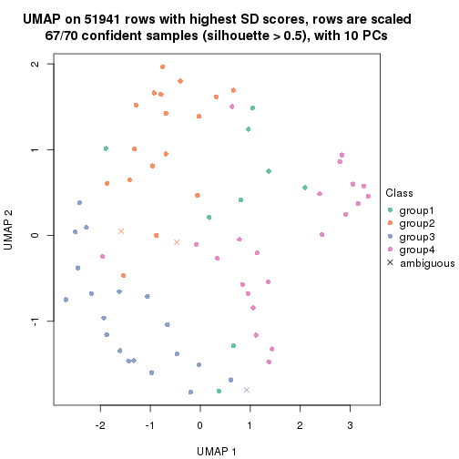</p>

</div>
<div id='tab-SD-skmeans-dimension-reduction-4'>
<pre><code class="r">dimension_reduction(res, k = 5, method = &quot;UMAP&quot;)
</code></pre>

<p></p>

</div>
<div id='tab-SD-skmeans-dimension-reduction-5'>
<pre><code class="r">dimension_reduction(res, k = 6, method = &quot;UMAP&quot;)
</code></pre>

<p></p>

</div>
</div>


Following heatmap shows how subgroups are split when increasing `k`:

```r
collect_classes(res)
```


Test correlation between subgroups and known annotations. If the known
annotation is numeric, one-way ANOVA test is applied, and if the known
annotation is discrete, chi-squared contingency table test is applied.

```r
test_to_known_factors(res)
```

```
#>             n disease.state(p) k
#> SD:skmeans 69           0.1124 2
#> SD:skmeans 68           0.1332 3
#> SD:skmeans 67           0.0753 4
#> SD:skmeans 65           0.0998 5
#> SD:skmeans 53           0.0529 6
```


If matrix rows can be associated to genes, consider to use `GO_Enrichment(res,
...)` to perform function enrichment for the signature genes.


 

---------------------------------------------------


### SD:pam*


The object with results only for a single top-value method and a single partition method 
can be extracted as:

```r
res = res_list["SD", "pam"]
# you can also extract it by
# res = res_list["SD:pam"]
```

A summary of `res` and all the functions that can be applied to it:

```r
res
```

```
#> A 'ConsensusPartition' object with k = 2, 3, 4, 5, 6.
#>   On a matrix with 51941 rows and 70 columns.
#>   Top rows (1000, 2000, 3000, 4000, 5000) are extracted by 'SD' method.
#>   Subgroups are detected by 'pam' method.
#>   Performed in total 1250 partitions by row resampling.
#>   Best k for subgroups seems to be 5.
#> 
#> Following methods can be applied to this 'ConsensusPartition' object:
#>  [1] "cola_report"             "collect_classes"         "collect_plots"          
#>  [4] "collect_stats"           "colnames"                "compare_signatures"     
#>  [7] "consensus_heatmap"       "dimension_reduction"     "functional_enrichment"  
#> [10] "get_anno_col"            "get_anno"                "get_classes"            
#> [13] "get_consensus"           "get_matrix"              "get_membership"         
#> [16] "get_param"               "get_signatures"          "get_stats"              
#> [19] "is_best_k"               "is_stable_k"             "membership_heatmap"     
#> [22] "ncol"                    "nrow"                    "plot_ecdf"              
#> [25] "rownames"                "select_partition_number" "show"                   
#> [28] "suggest_best_k"          "test_to_known_factors"
```

`collect_plots()` function collects all the plots made from `res` for all `k` (number of partitions)
into one single page to provide an easy and fast comparison between different `k`.

```r
collect_plots(res)
```


The plots are:

- The first row: a plot of the ECDF (Empirical cumulative distribution
  function) curves of the consensus matrix for each `k` and the heatmap of
  predicted classes for each `k`.
- The second row: heatmaps of the consensus matrix for each `k`.
- The third row: heatmaps of the membership matrix for each `k`.
- The fouth row: heatmaps of the signatures for each `k`.

All the plots in panels can be made by individual functions and they are
plotted later in this section.

`select_partition_number()` produces several plots showing different
statistics for choosing "optimized" `k`. There are following statistics:

- ECDF curves of the consensus matrix for each `k`;
- 1-PAC. [The PAC
  score](https://en.wikipedia.org/wiki/Consensus_clustering#Over-interpretation_potential_of_consensus_clustering)
  measures the proportion of the ambiguous subgrouping.
- Mean silhouette score.
- Concordance. The mean probability of fiting the consensus class ids in all
  partitions.
- Area increased. Denote $A_k$ as the area under the ECDF curve for current
  `k`, the area increased is defined as $A_k - A_{k-1}$.
- Rand index. The percent of pairs of samples that are both in a same cluster
  or both are not in a same cluster in the partition of k and k-1.
- Jaccard index. The ratio of pairs of samples are both in a same cluster in
  the partition of k and k-1 and the pairs of samples are both in a same
  cluster in the partition k or k-1.

The detailed explanations of these statistics can be found in [the cola
vignette](http://bioconductor.org/packages/devel/bioc/vignettes/cola/inst/doc/cola.html#toc_13).

Generally speaking, lower PAC score, higher mean silhouette score or higher
concordance corresponds to better partition. Rand index and Jaccard index
measure how similar the current partition is compared to partition with `k-1`.
If they are too similar, we won't accept `k` is better than `k-1`.

```r
select_partition_number(res)
```


The numeric values for all these statistics can be obtained by `get_stats()`.

```r
get_stats(res)
```

```
#>   k 1-PAC mean_silhouette concordance area_increased  Rand Jaccard
#> 2 2 0.940           0.938       0.974         0.4790 0.526   0.526
#> 3 3 0.650           0.833       0.897         0.3717 0.783   0.595
#> 4 4 0.867           0.855       0.940         0.1388 0.839   0.562
#> 5 5 0.919           0.852       0.925         0.0545 0.937   0.754
#> 6 6 0.857           0.725       0.879         0.0489 0.943   0.735
```

`suggest_best_k()` suggests the best $k$ based on these statistics. The rules are as follows:

- All $k$ with Jaccard index larger than 0.95 are removed because the increase of
  the partition number does not provides enough extra information. If all $k$ are removed,
  the best $k$ is assigned by `NA`.
- For $k$ with 1-PAC larger than 0.9, the maximal $k$ is taken as the "best k". Other $k$ is called "optional k".
- If it does not fit the second rule. The $k$ with the highest vote of highest
  1-PAC, mean silhouette and concordance is taken as the "best k".

```r
suggest_best_k(res)
```

```
#> [1] 5
#> attr(,"optional")
#> [1] 2
```

There is also optional best $k$ = 2 that is worth to check.

Following shows the table of the partitions (You need to click the **show/hide
code output** link to see it). The membership matrix (columns with name `p*`)
is inferred by
[`clue::cl_consensus()`](https://www.rdocumentation.org/link/cl_consensus?package=clue)
function with the `SE` method. Basically the value in the membership matrix
represents the probability to belong to a certain group. The finall class
label for an item is determined with the group with highest probability it
belongs to.

In `get_classes()` function, the entropy is calculated from the membership
matrix and the silhouette score is calculated from the consensus matrix.


<script>
$( function() {
	$( '#tabs-SD-pam-get-classes' ).tabs();
} );
</script>
<div id='tabs-SD-pam-get-classes'>
<ul>
<li><a href='#tab-SD-pam-get-classes-1'>k = 2</a></li>
<li><a href='#tab-SD-pam-get-classes-2'>k = 3</a></li>
<li><a href='#tab-SD-pam-get-classes-3'>k = 4</a></li>
<li><a href='#tab-SD-pam-get-classes-4'>k = 5</a></li>
<li><a href='#tab-SD-pam-get-classes-5'>k = 6</a></li>
</ul>

<div id='tab-SD-pam-get-classes-1'>
<p><a id='tab-SD-pam-get-classes-1-a' style='color:#0366d6' href='#'>show/hide code output</a></p>
<pre><code class="r">cbind(get_classes(res, k = 2), get_membership(res, k = 2))
</code></pre>

<pre><code>#&gt;            class entropy silhouette    p1    p2
#&gt; GSM1299517     2  0.0000      0.967 0.000 1.000
#&gt; GSM1299518     2  0.0000      0.967 0.000 1.000
#&gt; GSM1299519     2  0.0000      0.967 0.000 1.000
#&gt; GSM1299520     1  0.0672      0.974 0.992 0.008
#&gt; GSM1299521     1  0.0000      0.980 1.000 0.000
#&gt; GSM1299522     2  0.0000      0.967 0.000 1.000
#&gt; GSM1299523     1  0.9815      0.214 0.580 0.420
#&gt; GSM1299524     2  0.0000      0.967 0.000 1.000
#&gt; GSM1299525     2  0.0000      0.967 0.000 1.000
#&gt; GSM1299526     2  0.0000      0.967 0.000 1.000
#&gt; GSM1299527     2  0.0000      0.967 0.000 1.000
#&gt; GSM1299528     2  0.0000      0.967 0.000 1.000
#&gt; GSM1299529     2  0.0000      0.967 0.000 1.000
#&gt; GSM1299530     1  0.0000      0.980 1.000 0.000
#&gt; GSM1299531     2  0.0000      0.967 0.000 1.000
#&gt; GSM1299575     1  0.0000      0.980 1.000 0.000
#&gt; GSM1299532     2  0.0000      0.967 0.000 1.000
#&gt; GSM1299533     1  0.1843      0.954 0.972 0.028
#&gt; GSM1299534     2  0.0000      0.967 0.000 1.000
#&gt; GSM1299535     2  0.0000      0.967 0.000 1.000
#&gt; GSM1299536     1  0.0000      0.980 1.000 0.000
#&gt; GSM1299537     2  0.0000      0.967 0.000 1.000
#&gt; GSM1299538     2  0.7745      0.714 0.228 0.772
#&gt; GSM1299539     2  0.8267      0.663 0.260 0.740
#&gt; GSM1299540     2  0.0000      0.967 0.000 1.000
#&gt; GSM1299541     2  0.0000      0.967 0.000 1.000
#&gt; GSM1299542     2  0.0000      0.967 0.000 1.000
#&gt; GSM1299543     2  0.0000      0.967 0.000 1.000
#&gt; GSM1299544     2  0.0000      0.967 0.000 1.000
#&gt; GSM1299545     1  0.0000      0.980 1.000 0.000
#&gt; GSM1299546     2  0.0000      0.967 0.000 1.000
#&gt; GSM1299547     1  0.0000      0.980 1.000 0.000
#&gt; GSM1299548     2  0.0000      0.967 0.000 1.000
#&gt; GSM1299549     1  0.0000      0.980 1.000 0.000
#&gt; GSM1299550     2  0.8861      0.586 0.304 0.696
#&gt; GSM1299551     2  0.0000      0.967 0.000 1.000
#&gt; GSM1299552     1  0.0000      0.980 1.000 0.000
#&gt; GSM1299553     1  0.0376      0.977 0.996 0.004
#&gt; GSM1299554     2  0.0000      0.967 0.000 1.000
#&gt; GSM1299555     2  0.0000      0.967 0.000 1.000
#&gt; GSM1299556     2  0.0376      0.964 0.004 0.996
#&gt; GSM1299557     2  0.0000      0.967 0.000 1.000
#&gt; GSM1299558     2  0.0000      0.967 0.000 1.000
#&gt; GSM1299559     2  0.2043      0.941 0.032 0.968
#&gt; GSM1299560     2  0.0000      0.967 0.000 1.000
#&gt; GSM1299576     1  0.0000      0.980 1.000 0.000
#&gt; GSM1299577     1  0.0000      0.980 1.000 0.000
#&gt; GSM1299561     2  0.0000      0.967 0.000 1.000
#&gt; GSM1299562     2  0.0000      0.967 0.000 1.000
#&gt; GSM1299563     1  0.0000      0.980 1.000 0.000
#&gt; GSM1299564     2  0.6801      0.784 0.180 0.820
#&gt; GSM1299565     2  0.0000      0.967 0.000 1.000
#&gt; GSM1299566     2  0.0938      0.958 0.012 0.988
#&gt; GSM1299567     2  0.9170      0.510 0.332 0.668
#&gt; GSM1299568     2  0.0000      0.967 0.000 1.000
#&gt; GSM1299569     2  0.0000      0.967 0.000 1.000
#&gt; GSM1299570     1  0.0000      0.980 1.000 0.000
#&gt; GSM1299571     2  0.0000      0.967 0.000 1.000
#&gt; GSM1299572     1  0.0000      0.980 1.000 0.000
#&gt; GSM1299573     2  0.0000      0.967 0.000 1.000
#&gt; GSM1299574     2  0.0000      0.967 0.000 1.000
#&gt; GSM1299578     1  0.0000      0.980 1.000 0.000
#&gt; GSM1299579     1  0.0000      0.980 1.000 0.000
#&gt; GSM1299580     1  0.0000      0.980 1.000 0.000
#&gt; GSM1299581     1  0.0000      0.980 1.000 0.000
#&gt; GSM1299582     1  0.0000      0.980 1.000 0.000
#&gt; GSM1299583     1  0.0000      0.980 1.000 0.000
#&gt; GSM1299584     1  0.0000      0.980 1.000 0.000
#&gt; GSM1299585     1  0.0000      0.980 1.000 0.000
#&gt; GSM1299586     1  0.0000      0.980 1.000 0.000
</code></pre>

<script>
$('#tab-SD-pam-get-classes-1-a').parent().next().next().hide();
$('#tab-SD-pam-get-classes-1-a').click(function(){
  $('#tab-SD-pam-get-classes-1-a').parent().next().next().toggle();
  return(false);
});
</script>
</div>

<div id='tab-SD-pam-get-classes-2'>
<p><a id='tab-SD-pam-get-classes-2-a' style='color:#0366d6' href='#'>show/hide code output</a></p>
<pre><code class="r">cbind(get_classes(res, k = 3), get_membership(res, k = 3))
</code></pre>

<pre><code>#&gt;            class entropy silhouette    p1    p2    p3
#&gt; GSM1299517     3  0.3340      0.911 0.000 0.120 0.880
#&gt; GSM1299518     2  0.1860      0.830 0.000 0.948 0.052
#&gt; GSM1299519     2  0.0000      0.855 0.000 1.000 0.000
#&gt; GSM1299520     1  0.3752      0.865 0.856 0.000 0.144
#&gt; GSM1299521     1  0.0000      0.944 1.000 0.000 0.000
#&gt; GSM1299522     2  0.0000      0.855 0.000 1.000 0.000
#&gt; GSM1299523     1  0.6008      0.555 0.628 0.000 0.372
#&gt; GSM1299524     3  0.3340      0.911 0.000 0.120 0.880
#&gt; GSM1299525     2  0.1163      0.849 0.000 0.972 0.028
#&gt; GSM1299526     2  0.0000      0.855 0.000 1.000 0.000
#&gt; GSM1299527     3  0.3340      0.911 0.000 0.120 0.880
#&gt; GSM1299528     3  0.3686      0.899 0.000 0.140 0.860
#&gt; GSM1299529     2  0.1163      0.847 0.000 0.972 0.028
#&gt; GSM1299530     1  0.3340      0.884 0.880 0.000 0.120
#&gt; GSM1299531     2  0.5058      0.631 0.000 0.756 0.244
#&gt; GSM1299575     1  0.0000      0.944 1.000 0.000 0.000
#&gt; GSM1299532     3  0.3412      0.909 0.000 0.124 0.876
#&gt; GSM1299533     1  0.4755      0.734 0.808 0.184 0.008
#&gt; GSM1299534     3  0.3816      0.894 0.000 0.148 0.852
#&gt; GSM1299535     3  0.5882      0.581 0.000 0.348 0.652
#&gt; GSM1299536     1  0.0000      0.944 1.000 0.000 0.000
#&gt; GSM1299537     3  0.3340      0.911 0.000 0.120 0.880
#&gt; GSM1299538     2  0.9924      0.280 0.288 0.392 0.320
#&gt; GSM1299539     2  0.8120      0.600 0.136 0.640 0.224
#&gt; GSM1299540     3  0.2537      0.851 0.000 0.080 0.920
#&gt; GSM1299541     3  0.3340      0.911 0.000 0.120 0.880
#&gt; GSM1299542     3  0.3340      0.911 0.000 0.120 0.880
#&gt; GSM1299543     2  0.0592      0.853 0.000 0.988 0.012
#&gt; GSM1299544     3  0.3340      0.911 0.000 0.120 0.880
#&gt; GSM1299545     1  0.0237      0.942 0.996 0.000 0.004
#&gt; GSM1299546     2  0.0000      0.855 0.000 1.000 0.000
#&gt; GSM1299547     1  0.0000      0.944 1.000 0.000 0.000
#&gt; GSM1299548     3  0.3340      0.911 0.000 0.120 0.880
#&gt; GSM1299549     1  0.0000      0.944 1.000 0.000 0.000
#&gt; GSM1299550     1  0.7176      0.614 0.684 0.068 0.248
#&gt; GSM1299551     2  0.0000      0.855 0.000 1.000 0.000
#&gt; GSM1299552     1  0.0000      0.944 1.000 0.000 0.000
#&gt; GSM1299553     1  0.2537      0.907 0.920 0.000 0.080
#&gt; GSM1299554     3  0.3340      0.911 0.000 0.120 0.880
#&gt; GSM1299555     2  0.6154      0.237 0.000 0.592 0.408
#&gt; GSM1299556     3  0.1163      0.835 0.000 0.028 0.972
#&gt; GSM1299557     3  0.6286      0.308 0.000 0.464 0.536
#&gt; GSM1299558     2  0.3412      0.784 0.000 0.876 0.124
#&gt; GSM1299559     3  0.0000      0.811 0.000 0.000 1.000
#&gt; GSM1299560     3  0.4121      0.874 0.000 0.168 0.832
#&gt; GSM1299576     1  0.0000      0.944 1.000 0.000 0.000
#&gt; GSM1299577     1  0.1163      0.932 0.972 0.000 0.028
#&gt; GSM1299561     3  0.3340      0.911 0.000 0.120 0.880
#&gt; GSM1299562     2  0.3752      0.763 0.000 0.856 0.144
#&gt; GSM1299563     1  0.3340      0.884 0.880 0.000 0.120
#&gt; GSM1299564     3  0.4702      0.550 0.212 0.000 0.788
#&gt; GSM1299565     2  0.0000      0.855 0.000 1.000 0.000
#&gt; GSM1299566     2  0.5810      0.456 0.000 0.664 0.336
#&gt; GSM1299567     3  0.2066      0.759 0.060 0.000 0.940
#&gt; GSM1299568     3  0.4002      0.883 0.000 0.160 0.840
#&gt; GSM1299569     3  0.3482      0.907 0.000 0.128 0.872
#&gt; GSM1299570     1  0.3340      0.884 0.880 0.000 0.120
#&gt; GSM1299571     2  0.0000      0.855 0.000 1.000 0.000
#&gt; GSM1299572     1  0.0000      0.944 1.000 0.000 0.000
#&gt; GSM1299573     3  0.3340      0.911 0.000 0.120 0.880
#&gt; GSM1299574     2  0.0000      0.855 0.000 1.000 0.000
#&gt; GSM1299578     1  0.0000      0.944 1.000 0.000 0.000
#&gt; GSM1299579     1  0.0000      0.944 1.000 0.000 0.000
#&gt; GSM1299580     1  0.0000      0.944 1.000 0.000 0.000
#&gt; GSM1299581     1  0.0000      0.944 1.000 0.000 0.000
#&gt; GSM1299582     1  0.0000      0.944 1.000 0.000 0.000
#&gt; GSM1299583     1  0.0000      0.944 1.000 0.000 0.000
#&gt; GSM1299584     1  0.0000      0.944 1.000 0.000 0.000
#&gt; GSM1299585     1  0.0000      0.944 1.000 0.000 0.000
#&gt; GSM1299586     1  0.0000      0.944 1.000 0.000 0.000
</code></pre>

<script>
$('#tab-SD-pam-get-classes-2-a').parent().next().next().hide();
$('#tab-SD-pam-get-classes-2-a').click(function(){
  $('#tab-SD-pam-get-classes-2-a').parent().next().next().toggle();
  return(false);
});
</script>
</div>

<div id='tab-SD-pam-get-classes-3'>
<p><a id='tab-SD-pam-get-classes-3-a' style='color:#0366d6' href='#'>show/hide code output</a></p>
<pre><code class="r">cbind(get_classes(res, k = 4), get_membership(res, k = 4))
</code></pre>

<pre><code>#&gt;            class entropy silhouette    p1    p2    p3    p4
#&gt; GSM1299517     3  0.0000      0.949 0.000 0.000 1.000 0.000
#&gt; GSM1299518     2  0.0592      0.882 0.000 0.984 0.016 0.000
#&gt; GSM1299519     2  0.0000      0.891 0.000 1.000 0.000 0.000
#&gt; GSM1299520     4  0.0000      0.857 0.000 0.000 0.000 1.000
#&gt; GSM1299521     1  0.0000      0.983 1.000 0.000 0.000 0.000
#&gt; GSM1299522     2  0.0000      0.891 0.000 1.000 0.000 0.000
#&gt; GSM1299523     4  0.0188      0.855 0.000 0.000 0.004 0.996
#&gt; GSM1299524     3  0.0000      0.949 0.000 0.000 1.000 0.000
#&gt; GSM1299525     2  0.1792      0.841 0.000 0.932 0.000 0.068
#&gt; GSM1299526     2  0.0000      0.891 0.000 1.000 0.000 0.000
#&gt; GSM1299527     3  0.0000      0.949 0.000 0.000 1.000 0.000
#&gt; GSM1299528     3  0.0000      0.949 0.000 0.000 1.000 0.000
#&gt; GSM1299529     2  0.0000      0.891 0.000 1.000 0.000 0.000
#&gt; GSM1299530     4  0.0188      0.855 0.004 0.000 0.000 0.996
#&gt; GSM1299531     2  0.4877      0.371 0.000 0.592 0.408 0.000
#&gt; GSM1299575     1  0.0188      0.984 0.996 0.000 0.000 0.004
#&gt; GSM1299532     3  0.0188      0.947 0.000 0.004 0.996 0.000
#&gt; GSM1299533     1  0.3649      0.728 0.796 0.204 0.000 0.000
#&gt; GSM1299534     3  0.0000      0.949 0.000 0.000 1.000 0.000
#&gt; GSM1299535     3  0.4643      0.374 0.000 0.344 0.656 0.000
#&gt; GSM1299536     1  0.0000      0.983 1.000 0.000 0.000 0.000
#&gt; GSM1299537     3  0.0000      0.949 0.000 0.000 1.000 0.000
#&gt; GSM1299538     4  0.0000      0.857 0.000 0.000 0.000 1.000
#&gt; GSM1299539     4  0.0000      0.857 0.000 0.000 0.000 1.000
#&gt; GSM1299540     3  0.3208      0.777 0.000 0.004 0.848 0.148
#&gt; GSM1299541     3  0.0000      0.949 0.000 0.000 1.000 0.000
#&gt; GSM1299542     3  0.0000      0.949 0.000 0.000 1.000 0.000
#&gt; GSM1299543     2  0.0000      0.891 0.000 1.000 0.000 0.000
#&gt; GSM1299544     3  0.0000      0.949 0.000 0.000 1.000 0.000
#&gt; GSM1299545     1  0.0592      0.973 0.984 0.000 0.000 0.016
#&gt; GSM1299546     2  0.0000      0.891 0.000 1.000 0.000 0.000
#&gt; GSM1299547     1  0.0000      0.983 1.000 0.000 0.000 0.000
#&gt; GSM1299548     3  0.0000      0.949 0.000 0.000 1.000 0.000
#&gt; GSM1299549     1  0.0000      0.983 1.000 0.000 0.000 0.000
#&gt; GSM1299550     4  0.3266      0.794 0.108 0.000 0.024 0.868
#&gt; GSM1299551     2  0.0000      0.891 0.000 1.000 0.000 0.000
#&gt; GSM1299552     1  0.0000      0.983 1.000 0.000 0.000 0.000
#&gt; GSM1299553     4  0.4072      0.640 0.252 0.000 0.000 0.748
#&gt; GSM1299554     3  0.0000      0.949 0.000 0.000 1.000 0.000
#&gt; GSM1299555     3  0.4713      0.368 0.000 0.360 0.640 0.000
#&gt; GSM1299556     3  0.0376      0.944 0.000 0.004 0.992 0.004
#&gt; GSM1299557     2  0.4679      0.452 0.000 0.648 0.352 0.000
#&gt; GSM1299558     2  0.3649      0.729 0.000 0.796 0.204 0.000
#&gt; GSM1299559     4  0.4830      0.331 0.000 0.000 0.392 0.608
#&gt; GSM1299560     3  0.0336      0.944 0.000 0.008 0.992 0.000
#&gt; GSM1299576     1  0.0188      0.984 0.996 0.000 0.000 0.004
#&gt; GSM1299577     4  0.4830      0.364 0.392 0.000 0.000 0.608
#&gt; GSM1299561     3  0.0000      0.949 0.000 0.000 1.000 0.000
#&gt; GSM1299562     2  0.4454      0.576 0.000 0.692 0.308 0.000
#&gt; GSM1299563     4  0.0000      0.857 0.000 0.000 0.000 1.000
#&gt; GSM1299564     4  0.0469      0.852 0.000 0.000 0.012 0.988
#&gt; GSM1299565     2  0.0000      0.891 0.000 1.000 0.000 0.000
#&gt; GSM1299566     4  0.7432      0.247 0.000 0.180 0.348 0.472
#&gt; GSM1299567     4  0.0000      0.857 0.000 0.000 0.000 1.000
#&gt; GSM1299568     3  0.0000      0.949 0.000 0.000 1.000 0.000
#&gt; GSM1299569     3  0.0000      0.949 0.000 0.000 1.000 0.000
#&gt; GSM1299570     4  0.0000      0.857 0.000 0.000 0.000 1.000
#&gt; GSM1299571     2  0.0000      0.891 0.000 1.000 0.000 0.000
#&gt; GSM1299572     1  0.0000      0.983 1.000 0.000 0.000 0.000
#&gt; GSM1299573     3  0.0000      0.949 0.000 0.000 1.000 0.000
#&gt; GSM1299574     2  0.0000      0.891 0.000 1.000 0.000 0.000
#&gt; GSM1299578     1  0.0188      0.984 0.996 0.000 0.000 0.004
#&gt; GSM1299579     1  0.0188      0.984 0.996 0.000 0.000 0.004
#&gt; GSM1299580     1  0.0188      0.984 0.996 0.000 0.000 0.004
#&gt; GSM1299581     1  0.0188      0.984 0.996 0.000 0.000 0.004
#&gt; GSM1299582     1  0.0188      0.984 0.996 0.000 0.000 0.004
#&gt; GSM1299583     1  0.0188      0.984 0.996 0.000 0.000 0.004
#&gt; GSM1299584     1  0.0188      0.984 0.996 0.000 0.000 0.004
#&gt; GSM1299585     1  0.0000      0.983 1.000 0.000 0.000 0.000
#&gt; GSM1299586     1  0.0188      0.984 0.996 0.000 0.000 0.004
</code></pre>

<script>
$('#tab-SD-pam-get-classes-3-a').parent().next().next().hide();
$('#tab-SD-pam-get-classes-3-a').click(function(){
  $('#tab-SD-pam-get-classes-3-a').parent().next().next().toggle();
  return(false);
});
</script>
</div>

<div id='tab-SD-pam-get-classes-4'>
<p><a id='tab-SD-pam-get-classes-4-a' style='color:#0366d6' href='#'>show/hide code output</a></p>
<pre><code class="r">cbind(get_classes(res, k = 5), get_membership(res, k = 5))
</code></pre>

<pre><code>#&gt;            class entropy silhouette    p1    p2    p3    p4    p5
#&gt; GSM1299517     3  0.0880      0.914 0.000 0.000 0.968 0.000 0.032
#&gt; GSM1299518     2  0.1300      0.859 0.000 0.956 0.028 0.000 0.016
#&gt; GSM1299519     2  0.0000      0.883 0.000 1.000 0.000 0.000 0.000
#&gt; GSM1299520     4  0.0000      0.876 0.000 0.000 0.000 1.000 0.000
#&gt; GSM1299521     5  0.1908      0.956 0.092 0.000 0.000 0.000 0.908
#&gt; GSM1299522     2  0.0000      0.883 0.000 1.000 0.000 0.000 0.000
#&gt; GSM1299523     4  0.0000      0.876 0.000 0.000 0.000 1.000 0.000
#&gt; GSM1299524     3  0.1410      0.910 0.000 0.000 0.940 0.000 0.060
#&gt; GSM1299525     2  0.1768      0.831 0.000 0.924 0.000 0.072 0.004
#&gt; GSM1299526     2  0.0000      0.883 0.000 1.000 0.000 0.000 0.000
#&gt; GSM1299527     3  0.0880      0.914 0.000 0.000 0.968 0.000 0.032
#&gt; GSM1299528     3  0.1410      0.910 0.000 0.000 0.940 0.000 0.060
#&gt; GSM1299529     2  0.0000      0.883 0.000 1.000 0.000 0.000 0.000
#&gt; GSM1299530     4  0.0000      0.876 0.000 0.000 0.000 1.000 0.000
#&gt; GSM1299531     2  0.5036      0.292 0.000 0.560 0.404 0.000 0.036
#&gt; GSM1299575     1  0.0000      0.984 1.000 0.000 0.000 0.000 0.000
#&gt; GSM1299532     3  0.0566      0.917 0.000 0.004 0.984 0.000 0.012
#&gt; GSM1299533     5  0.2069      0.941 0.076 0.012 0.000 0.000 0.912
#&gt; GSM1299534     3  0.1341      0.911 0.000 0.000 0.944 0.000 0.056
#&gt; GSM1299535     3  0.4524      0.386 0.000 0.336 0.644 0.000 0.020
#&gt; GSM1299536     5  0.1908      0.956 0.092 0.000 0.000 0.000 0.908
#&gt; GSM1299537     3  0.0880      0.914 0.000 0.000 0.968 0.000 0.032
#&gt; GSM1299538     4  0.0000      0.876 0.000 0.000 0.000 1.000 0.000
#&gt; GSM1299539     4  0.0000      0.876 0.000 0.000 0.000 1.000 0.000
#&gt; GSM1299540     3  0.3609      0.753 0.000 0.004 0.816 0.148 0.032
#&gt; GSM1299541     3  0.0880      0.914 0.000 0.000 0.968 0.000 0.032
#&gt; GSM1299542     3  0.0404      0.917 0.000 0.000 0.988 0.000 0.012
#&gt; GSM1299543     2  0.0162      0.881 0.000 0.996 0.000 0.000 0.004
#&gt; GSM1299544     3  0.1410      0.910 0.000 0.000 0.940 0.000 0.060
#&gt; GSM1299545     1  0.0000      0.984 1.000 0.000 0.000 0.000 0.000
#&gt; GSM1299546     2  0.0000      0.883 0.000 1.000 0.000 0.000 0.000
#&gt; GSM1299547     5  0.1908      0.956 0.092 0.000 0.000 0.000 0.908
#&gt; GSM1299548     3  0.0880      0.914 0.000 0.000 0.968 0.000 0.032
#&gt; GSM1299549     5  0.1908      0.956 0.092 0.000 0.000 0.000 0.908
#&gt; GSM1299550     5  0.3885      0.541 0.000 0.000 0.008 0.268 0.724
#&gt; GSM1299551     2  0.0000      0.883 0.000 1.000 0.000 0.000 0.000
#&gt; GSM1299552     5  0.1908      0.956 0.092 0.000 0.000 0.000 0.908
#&gt; GSM1299553     1  0.1544      0.918 0.932 0.000 0.000 0.068 0.000
#&gt; GSM1299554     3  0.0880      0.916 0.000 0.000 0.968 0.000 0.032
#&gt; GSM1299555     3  0.4679      0.453 0.000 0.316 0.652 0.000 0.032
#&gt; GSM1299556     3  0.0880      0.914 0.000 0.000 0.968 0.000 0.032
#&gt; GSM1299557     2  0.4401      0.481 0.000 0.656 0.328 0.000 0.016
#&gt; GSM1299558     2  0.3656      0.711 0.000 0.784 0.196 0.000 0.020
#&gt; GSM1299559     4  0.4982      0.254 0.000 0.000 0.412 0.556 0.032
#&gt; GSM1299560     3  0.1041      0.913 0.000 0.004 0.964 0.000 0.032
#&gt; GSM1299576     1  0.0000      0.984 1.000 0.000 0.000 0.000 0.000
#&gt; GSM1299577     1  0.1792      0.900 0.916 0.000 0.000 0.084 0.000
#&gt; GSM1299561     3  0.0880      0.916 0.000 0.000 0.968 0.000 0.032
#&gt; GSM1299562     2  0.4748      0.527 0.000 0.660 0.300 0.000 0.040
#&gt; GSM1299563     4  0.0000      0.876 0.000 0.000 0.000 1.000 0.000
#&gt; GSM1299564     4  0.0290      0.870 0.000 0.000 0.008 0.992 0.000
#&gt; GSM1299565     2  0.0000      0.883 0.000 1.000 0.000 0.000 0.000
#&gt; GSM1299566     4  0.7374      0.112 0.000 0.152 0.364 0.424 0.060
#&gt; GSM1299567     4  0.0000      0.876 0.000 0.000 0.000 1.000 0.000
#&gt; GSM1299568     3  0.1410      0.910 0.000 0.000 0.940 0.000 0.060
#&gt; GSM1299569     3  0.1410      0.910 0.000 0.000 0.940 0.000 0.060
#&gt; GSM1299570     4  0.0000      0.876 0.000 0.000 0.000 1.000 0.000
#&gt; GSM1299571     2  0.0000      0.883 0.000 1.000 0.000 0.000 0.000
#&gt; GSM1299572     5  0.1908      0.956 0.092 0.000 0.000 0.000 0.908
#&gt; GSM1299573     3  0.1043      0.915 0.000 0.000 0.960 0.000 0.040
#&gt; GSM1299574     2  0.0000      0.883 0.000 1.000 0.000 0.000 0.000
#&gt; GSM1299578     1  0.0000      0.984 1.000 0.000 0.000 0.000 0.000
#&gt; GSM1299579     1  0.0000      0.984 1.000 0.000 0.000 0.000 0.000
#&gt; GSM1299580     1  0.0000      0.984 1.000 0.000 0.000 0.000 0.000
#&gt; GSM1299581     1  0.0000      0.984 1.000 0.000 0.000 0.000 0.000
#&gt; GSM1299582     1  0.0000      0.984 1.000 0.000 0.000 0.000 0.000
#&gt; GSM1299583     1  0.0000      0.984 1.000 0.000 0.000 0.000 0.000
#&gt; GSM1299584     1  0.0000      0.984 1.000 0.000 0.000 0.000 0.000
#&gt; GSM1299585     5  0.1908      0.956 0.092 0.000 0.000 0.000 0.908
#&gt; GSM1299586     1  0.0000      0.984 1.000 0.000 0.000 0.000 0.000
</code></pre>

<script>
$('#tab-SD-pam-get-classes-4-a').parent().next().next().hide();
$('#tab-SD-pam-get-classes-4-a').click(function(){
  $('#tab-SD-pam-get-classes-4-a').parent().next().next().toggle();
  return(false);
});
</script>
</div>

<div id='tab-SD-pam-get-classes-5'>
<p><a id='tab-SD-pam-get-classes-5-a' style='color:#0366d6' href='#'>show/hide code output</a></p>
<pre><code class="r">cbind(get_classes(res, k = 6), get_membership(res, k = 6))
</code></pre>

<pre><code>#&gt;            class entropy silhouette    p1    p2    p3    p4    p5    p6
#&gt; GSM1299517     3  0.3672     0.4767 0.000 0.000 0.632 0.000 0.000 0.368
#&gt; GSM1299518     2  0.1327     0.8309 0.000 0.936 0.064 0.000 0.000 0.000
#&gt; GSM1299519     2  0.0000     0.8623 0.000 1.000 0.000 0.000 0.000 0.000
#&gt; GSM1299520     4  0.0000     0.9893 0.000 0.000 0.000 1.000 0.000 0.000
#&gt; GSM1299521     5  0.0000     0.9447 0.000 0.000 0.000 0.000 1.000 0.000
#&gt; GSM1299522     2  0.0000     0.8623 0.000 1.000 0.000 0.000 0.000 0.000
#&gt; GSM1299523     4  0.0000     0.9893 0.000 0.000 0.000 1.000 0.000 0.000
#&gt; GSM1299524     3  0.2491     0.6468 0.000 0.000 0.836 0.000 0.000 0.164
#&gt; GSM1299525     2  0.2415     0.8224 0.000 0.888 0.012 0.016 0.000 0.084
#&gt; GSM1299526     2  0.0000     0.8623 0.000 1.000 0.000 0.000 0.000 0.000
#&gt; GSM1299527     6  0.3782    -0.0827 0.000 0.000 0.412 0.000 0.000 0.588
#&gt; GSM1299528     3  0.0146     0.5786 0.000 0.000 0.996 0.000 0.000 0.004
#&gt; GSM1299529     2  0.1219     0.8451 0.000 0.948 0.004 0.000 0.000 0.048
#&gt; GSM1299530     4  0.0000     0.9893 0.000 0.000 0.000 1.000 0.000 0.000
#&gt; GSM1299531     2  0.4264     0.2315 0.000 0.500 0.484 0.000 0.000 0.016
#&gt; GSM1299575     1  0.0260     0.9947 0.992 0.000 0.000 0.000 0.000 0.008
#&gt; GSM1299532     3  0.3765     0.4107 0.000 0.000 0.596 0.000 0.000 0.404
#&gt; GSM1299533     5  0.0000     0.9447 0.000 0.000 0.000 0.000 1.000 0.000
#&gt; GSM1299534     3  0.2491     0.6468 0.000 0.000 0.836 0.000 0.000 0.164
#&gt; GSM1299535     6  0.5875     0.0734 0.000 0.264 0.256 0.000 0.000 0.480
#&gt; GSM1299536     5  0.0000     0.9447 0.000 0.000 0.000 0.000 1.000 0.000
#&gt; GSM1299537     6  0.3847    -0.1618 0.000 0.000 0.456 0.000 0.000 0.544
#&gt; GSM1299538     4  0.0000     0.9893 0.000 0.000 0.000 1.000 0.000 0.000
#&gt; GSM1299539     4  0.0632     0.9740 0.000 0.000 0.024 0.976 0.000 0.000
#&gt; GSM1299540     6  0.2001     0.5364 0.000 0.000 0.040 0.048 0.000 0.912
#&gt; GSM1299541     3  0.3838     0.3059 0.000 0.000 0.552 0.000 0.000 0.448
#&gt; GSM1299542     3  0.3244     0.5992 0.000 0.000 0.732 0.000 0.000 0.268
#&gt; GSM1299543     2  0.2030     0.8272 0.000 0.908 0.028 0.000 0.000 0.064
#&gt; GSM1299544     3  0.0458     0.5676 0.000 0.000 0.984 0.000 0.000 0.016
#&gt; GSM1299545     1  0.0000     0.9972 1.000 0.000 0.000 0.000 0.000 0.000
#&gt; GSM1299546     2  0.0000     0.8623 0.000 1.000 0.000 0.000 0.000 0.000
#&gt; GSM1299547     5  0.0000     0.9447 0.000 0.000 0.000 0.000 1.000 0.000
#&gt; GSM1299548     6  0.3862    -0.2136 0.000 0.000 0.476 0.000 0.000 0.524
#&gt; GSM1299549     5  0.0713     0.9260 0.000 0.000 0.000 0.000 0.972 0.028
#&gt; GSM1299550     5  0.6660     0.4344 0.000 0.000 0.164 0.204 0.528 0.104
#&gt; GSM1299551     2  0.0000     0.8623 0.000 1.000 0.000 0.000 0.000 0.000
#&gt; GSM1299552     5  0.0000     0.9447 0.000 0.000 0.000 0.000 1.000 0.000
#&gt; GSM1299553     1  0.0146     0.9961 0.996 0.000 0.000 0.000 0.000 0.004
#&gt; GSM1299554     3  0.3851     0.2719 0.000 0.000 0.540 0.000 0.000 0.460
#&gt; GSM1299555     6  0.1408     0.5343 0.000 0.036 0.020 0.000 0.000 0.944
#&gt; GSM1299556     6  0.1387     0.5306 0.000 0.000 0.068 0.000 0.000 0.932
#&gt; GSM1299557     2  0.5219     0.4770 0.000 0.612 0.212 0.000 0.000 0.176
#&gt; GSM1299558     2  0.4462     0.5904 0.000 0.660 0.280 0.000 0.000 0.060
#&gt; GSM1299559     6  0.1644     0.5253 0.000 0.000 0.004 0.076 0.000 0.920
#&gt; GSM1299560     3  0.3843     0.3043 0.000 0.000 0.548 0.000 0.000 0.452
#&gt; GSM1299576     1  0.0000     0.9972 1.000 0.000 0.000 0.000 0.000 0.000
#&gt; GSM1299577     1  0.0363     0.9884 0.988 0.000 0.000 0.012 0.000 0.000
#&gt; GSM1299561     3  0.2883     0.6364 0.000 0.000 0.788 0.000 0.000 0.212
#&gt; GSM1299562     2  0.4131     0.4472 0.000 0.600 0.384 0.000 0.000 0.016
#&gt; GSM1299563     4  0.0000     0.9893 0.000 0.000 0.000 1.000 0.000 0.000
#&gt; GSM1299564     4  0.1480     0.9383 0.000 0.000 0.020 0.940 0.000 0.040
#&gt; GSM1299565     2  0.0000     0.8623 0.000 1.000 0.000 0.000 0.000 0.000
#&gt; GSM1299566     3  0.6549     0.0201 0.000 0.104 0.548 0.180 0.000 0.168
#&gt; GSM1299567     4  0.0146     0.9872 0.000 0.000 0.000 0.996 0.000 0.004
#&gt; GSM1299568     3  0.1075     0.6129 0.000 0.000 0.952 0.000 0.000 0.048
#&gt; GSM1299569     3  0.0713     0.6023 0.000 0.000 0.972 0.000 0.000 0.028
#&gt; GSM1299570     4  0.0000     0.9893 0.000 0.000 0.000 1.000 0.000 0.000
#&gt; GSM1299571     2  0.0000     0.8623 0.000 1.000 0.000 0.000 0.000 0.000
#&gt; GSM1299572     5  0.0000     0.9447 0.000 0.000 0.000 0.000 1.000 0.000
#&gt; GSM1299573     3  0.3175     0.6102 0.000 0.000 0.744 0.000 0.000 0.256
#&gt; GSM1299574     2  0.0000     0.8623 0.000 1.000 0.000 0.000 0.000 0.000
#&gt; GSM1299578     1  0.0260     0.9947 0.992 0.000 0.000 0.000 0.000 0.008
#&gt; GSM1299579     1  0.0000     0.9972 1.000 0.000 0.000 0.000 0.000 0.000
#&gt; GSM1299580     1  0.0260     0.9947 0.992 0.000 0.000 0.000 0.000 0.008
#&gt; GSM1299581     1  0.0000     0.9972 1.000 0.000 0.000 0.000 0.000 0.000
#&gt; GSM1299582     1  0.0000     0.9972 1.000 0.000 0.000 0.000 0.000 0.000
#&gt; GSM1299583     1  0.0000     0.9972 1.000 0.000 0.000 0.000 0.000 0.000
#&gt; GSM1299584     1  0.0000     0.9972 1.000 0.000 0.000 0.000 0.000 0.000
#&gt; GSM1299585     5  0.0000     0.9447 0.000 0.000 0.000 0.000 1.000 0.000
#&gt; GSM1299586     1  0.0000     0.9972 1.000 0.000 0.000 0.000 0.000 0.000
</code></pre>

<script>
$('#tab-SD-pam-get-classes-5-a').parent().next().next().hide();
$('#tab-SD-pam-get-classes-5-a').click(function(){
  $('#tab-SD-pam-get-classes-5-a').parent().next().next().toggle();
  return(false);
});
</script>
</div>
</div>

Heatmaps for the consensus matrix. It visualizes the probability of two
samples to be in a same group.


<script>
$( function() {
	$( '#tabs-SD-pam-consensus-heatmap' ).tabs();
} );
</script>
<div id='tabs-SD-pam-consensus-heatmap'>
<ul>
<li><a href='#tab-SD-pam-consensus-heatmap-1'>k = 2</a></li>
<li><a href='#tab-SD-pam-consensus-heatmap-2'>k = 3</a></li>
<li><a href='#tab-SD-pam-consensus-heatmap-3'>k = 4</a></li>
<li><a href='#tab-SD-pam-consensus-heatmap-4'>k = 5</a></li>
<li><a href='#tab-SD-pam-consensus-heatmap-5'>k = 6</a></li>
</ul>
<div id='tab-SD-pam-consensus-heatmap-1'>
<pre><code class="r">consensus_heatmap(res, k = 2)
</code></pre>

<p></p>

</div>
<div id='tab-SD-pam-consensus-heatmap-2'>
<pre><code class="r">consensus_heatmap(res, k = 3)
</code></pre>

<p></p>

</div>
<div id='tab-SD-pam-consensus-heatmap-3'>
<pre><code class="r">consensus_heatmap(res, k = 4)
</code></pre>

<p></p>

</div>
<div id='tab-SD-pam-consensus-heatmap-4'>
<pre><code class="r">consensus_heatmap(res, k = 5)
</code></pre>

<p></p>

</div>
<div id='tab-SD-pam-consensus-heatmap-5'>
<pre><code class="r">consensus_heatmap(res, k = 6)
</code></pre>

<p></p>

</div>
</div>

Heatmaps for the membership of samples in all partitions to see how consistent they are:


<script>
$( function() {
	$( '#tabs-SD-pam-membership-heatmap' ).tabs();
} );
</script>
<div id='tabs-SD-pam-membership-heatmap'>
<ul>
<li><a href='#tab-SD-pam-membership-heatmap-1'>k = 2</a></li>
<li><a href='#tab-SD-pam-membership-heatmap-2'>k = 3</a></li>
<li><a href='#tab-SD-pam-membership-heatmap-3'>k = 4</a></li>
<li><a href='#tab-SD-pam-membership-heatmap-4'>k = 5</a></li>
<li><a href='#tab-SD-pam-membership-heatmap-5'>k = 6</a></li>
</ul>
<div id='tab-SD-pam-membership-heatmap-1'>
<pre><code class="r">membership_heatmap(res, k = 2)
</code></pre>

<p></p>

</div>
<div id='tab-SD-pam-membership-heatmap-2'>
<pre><code class="r">membership_heatmap(res, k = 3)
</code></pre>

<p></p>

</div>
<div id='tab-SD-pam-membership-heatmap-3'>
<pre><code class="r">membership_heatmap(res, k = 4)
</code></pre>

<p>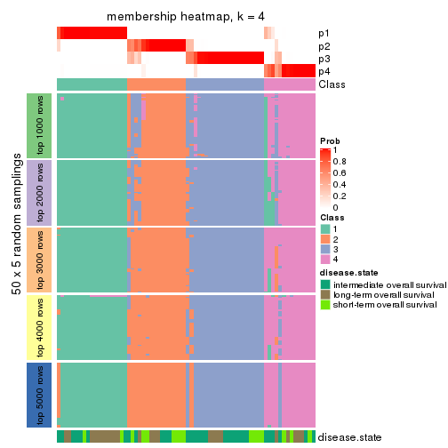</p>

</div>
<div id='tab-SD-pam-membership-heatmap-4'>
<pre><code class="r">membership_heatmap(res, k = 5)
</code></pre>

<p></p>

</div>
<div id='tab-SD-pam-membership-heatmap-5'>
<pre><code class="r">membership_heatmap(res, k = 6)
</code></pre>

<p></p>

</div>
</div>

As soon as we have had the classes for columns, we can look for signatures
which are significantly different between classes which can be candidate marks
for certain classes. Following are the heatmaps for signatures.


Signature heatmaps where rows are scaled:


<script>
$( function() {
	$( '#tabs-SD-pam-get-signatures' ).tabs();
} );
</script>
<div id='tabs-SD-pam-get-signatures'>
<ul>
<li><a href='#tab-SD-pam-get-signatures-1'>k = 2</a></li>
<li><a href='#tab-SD-pam-get-signatures-2'>k = 3</a></li>
<li><a href='#tab-SD-pam-get-signatures-3'>k = 4</a></li>
<li><a href='#tab-SD-pam-get-signatures-4'>k = 5</a></li>
<li><a href='#tab-SD-pam-get-signatures-5'>k = 6</a></li>
</ul>
<div id='tab-SD-pam-get-signatures-1'>
<pre><code class="r">get_signatures(res, k = 2)
</code></pre>

<p></p>

</div>
<div id='tab-SD-pam-get-signatures-2'>
<pre><code class="r">get_signatures(res, k = 3)
</code></pre>

<p></p>

</div>
<div id='tab-SD-pam-get-signatures-3'>
<pre><code class="r">get_signatures(res, k = 4)
</code></pre>

<p></p>

</div>
<div id='tab-SD-pam-get-signatures-4'>
<pre><code class="r">get_signatures(res, k = 5)
</code></pre>

<p></p>

</div>
<div id='tab-SD-pam-get-signatures-5'>
<pre><code class="r">get_signatures(res, k = 6)
</code></pre>

<p></p>

</div>
</div>


Signature heatmaps where rows are not scaled:


<script>
$( function() {
	$( '#tabs-SD-pam-get-signatures-no-scale' ).tabs();
} );
</script>
<div id='tabs-SD-pam-get-signatures-no-scale'>
<ul>
<li><a href='#tab-SD-pam-get-signatures-no-scale-1'>k = 2</a></li>
<li><a href='#tab-SD-pam-get-signatures-no-scale-2'>k = 3</a></li>
<li><a href='#tab-SD-pam-get-signatures-no-scale-3'>k = 4</a></li>
<li><a href='#tab-SD-pam-get-signatures-no-scale-4'>k = 5</a></li>
<li><a href='#tab-SD-pam-get-signatures-no-scale-5'>k = 6</a></li>
</ul>
<div id='tab-SD-pam-get-signatures-no-scale-1'>
<pre><code class="r">get_signatures(res, k = 2, scale_rows = FALSE)
</code></pre>

<p></p>

</div>
<div id='tab-SD-pam-get-signatures-no-scale-2'>
<pre><code class="r">get_signatures(res, k = 3, scale_rows = FALSE)
</code></pre>

<p></p>

</div>
<div id='tab-SD-pam-get-signatures-no-scale-3'>
<pre><code class="r">get_signatures(res, k = 4, scale_rows = FALSE)
</code></pre>

<p></p>

</div>
<div id='tab-SD-pam-get-signatures-no-scale-4'>
<pre><code class="r">get_signatures(res, k = 5, scale_rows = FALSE)
</code></pre>

<p></p>

</div>
<div id='tab-SD-pam-get-signatures-no-scale-5'>
<pre><code class="r">get_signatures(res, k = 6, scale_rows = FALSE)
</code></pre>

<p></p>

</div>
</div>


Compare the overlap of signatures from different k:

```r
compare_signatures(res)
```


`get_signature()` returns a data frame invisibly. TO get the list of signatures, the function
call should be assigned to a variable explicitly. In following code, if `plot` argument is set
to `FALSE`, no heatmap is plotted while only the differential analysis is performed.

```r
# code only for demonstration
tb = get_signature(res, k = ..., plot = FALSE)
```

An example of the output of `tb` is:

```
#>   which_row         fdr    mean_1    mean_2 scaled_mean_1 scaled_mean_2 km
#> 1        38 0.042760348  8.373488  9.131774    -0.5533452     0.5164555  1
#> 2        40 0.018707592  7.106213  8.469186    -0.6173731     0.5762149  1
#> 3        55 0.019134737 10.221463 11.207825    -0.6159697     0.5749050  1
#> 4        59 0.006059896  5.921854  7.869574    -0.6899429     0.6439467  1
#> 5        60 0.018055526  8.928898 10.211722    -0.6204761     0.5791110  1
#> 6        98 0.009384629 15.714769 14.887706     0.6635654    -0.6193277  2
...
```

The columns in `tb` are:

1. `which_row`: row indices corresponding to the input matrix.
2. `fdr`: FDR for the differential test. 
3. `mean_x`: The mean value in group x.
4. `scaled_mean_x`: The mean value in group x after rows are scaled.
5. `km`: Row groups if k-means clustering is applied to rows.


UMAP plot which shows how samples are separated.


<script>
$( function() {
	$( '#tabs-SD-pam-dimension-reduction' ).tabs();
} );
</script>
<div id='tabs-SD-pam-dimension-reduction'>
<ul>
<li><a href='#tab-SD-pam-dimension-reduction-1'>k = 2</a></li>
<li><a href='#tab-SD-pam-dimension-reduction-2'>k = 3</a></li>
<li><a href='#tab-SD-pam-dimension-reduction-3'>k = 4</a></li>
<li><a href='#tab-SD-pam-dimension-reduction-4'>k = 5</a></li>
<li><a href='#tab-SD-pam-dimension-reduction-5'>k = 6</a></li>
</ul>
<div id='tab-SD-pam-dimension-reduction-1'>
<pre><code class="r">dimension_reduction(res, k = 2, method = &quot;UMAP&quot;)
</code></pre>

<p></p>

</div>
<div id='tab-SD-pam-dimension-reduction-2'>
<pre><code class="r">dimension_reduction(res, k = 3, method = &quot;UMAP&quot;)
</code></pre>

<p></p>

</div>
<div id='tab-SD-pam-dimension-reduction-3'>
<pre><code class="r">dimension_reduction(res, k = 4, method = &quot;UMAP&quot;)
</code></pre>

<p></p>

</div>
<div id='tab-SD-pam-dimension-reduction-4'>
<pre><code class="r">dimension_reduction(res, k = 5, method = &quot;UMAP&quot;)
</code></pre>

<p></p>

</div>
<div id='tab-SD-pam-dimension-reduction-5'>
<pre><code class="r">dimension_reduction(res, k = 6, method = &quot;UMAP&quot;)
</code></pre>

<p></p>

</div>
</div>


Following heatmap shows how subgroups are split when increasing `k`:

```r
collect_classes(res)
```


Test correlation between subgroups and known annotations. If the known
annotation is numeric, one-way ANOVA test is applied, and if the known
annotation is discrete, chi-squared contingency table test is applied.

```r
test_to_known_factors(res)
```

```
#>         n disease.state(p) k
#> SD:pam 69           0.1481 2
#> SD:pam 66           0.1497 3
#> SD:pam 63           0.2003 4
#> SD:pam 64           0.0972 5
#> SD:pam 56           0.0769 6
```


If matrix rows can be associated to genes, consider to use `GO_Enrichment(res,
...)` to perform function enrichment for the signature genes.


 

---------------------------------------------------


### SD:mclust


The object with results only for a single top-value method and a single partition method 
can be extracted as:

```r
res = res_list["SD", "mclust"]
# you can also extract it by
# res = res_list["SD:mclust"]
```

A summary of `res` and all the functions that can be applied to it:

```r
res
```

```
#> A 'ConsensusPartition' object with k = 2, 3, 4, 5, 6.
#>   On a matrix with 51941 rows and 70 columns.
#>   Top rows (1000, 2000, 3000, 4000, 5000) are extracted by 'SD' method.
#>   Subgroups are detected by 'mclust' method.
#>   Performed in total 1250 partitions by row resampling.
#>   Best k for subgroups seems to be 2.
#> 
#> Following methods can be applied to this 'ConsensusPartition' object:
#>  [1] "cola_report"             "collect_classes"         "collect_plots"          
#>  [4] "collect_stats"           "colnames"                "compare_signatures"     
#>  [7] "consensus_heatmap"       "dimension_reduction"     "functional_enrichment"  
#> [10] "get_anno_col"            "get_anno"                "get_classes"            
#> [13] "get_consensus"           "get_matrix"              "get_membership"         
#> [16] "get_param"               "get_signatures"          "get_stats"              
#> [19] "is_best_k"               "is_stable_k"             "membership_heatmap"     
#> [22] "ncol"                    "nrow"                    "plot_ecdf"              
#> [25] "rownames"                "select_partition_number" "show"                   
#> [28] "suggest_best_k"          "test_to_known_factors"
```

`collect_plots()` function collects all the plots made from `res` for all `k` (number of partitions)
into one single page to provide an easy and fast comparison between different `k`.

```r
collect_plots(res)
```


The plots are:

- The first row: a plot of the ECDF (Empirical cumulative distribution
  function) curves of the consensus matrix for each `k` and the heatmap of
  predicted classes for each `k`.
- The second row: heatmaps of the consensus matrix for each `k`.
- The third row: heatmaps of the membership matrix for each `k`.
- The fouth row: heatmaps of the signatures for each `k`.

All the plots in panels can be made by individual functions and they are
plotted later in this section.

`select_partition_number()` produces several plots showing different
statistics for choosing "optimized" `k`. There are following statistics:

- ECDF curves of the consensus matrix for each `k`;
- 1-PAC. [The PAC
  score](https://en.wikipedia.org/wiki/Consensus_clustering#Over-interpretation_potential_of_consensus_clustering)
  measures the proportion of the ambiguous subgrouping.
- Mean silhouette score.
- Concordance. The mean probability of fiting the consensus class ids in all
  partitions.
- Area increased. Denote $A_k$ as the area under the ECDF curve for current
  `k`, the area increased is defined as $A_k - A_{k-1}$.
- Rand index. The percent of pairs of samples that are both in a same cluster
  or both are not in a same cluster in the partition of k and k-1.
- Jaccard index. The ratio of pairs of samples are both in a same cluster in
  the partition of k and k-1 and the pairs of samples are both in a same
  cluster in the partition k or k-1.

The detailed explanations of these statistics can be found in [the cola
vignette](http://bioconductor.org/packages/devel/bioc/vignettes/cola/inst/doc/cola.html#toc_13).

Generally speaking, lower PAC score, higher mean silhouette score or higher
concordance corresponds to better partition. Rand index and Jaccard index
measure how similar the current partition is compared to partition with `k-1`.
If they are too similar, we won't accept `k` is better than `k-1`.

```r
select_partition_number(res)
```


The numeric values for all these statistics can be obtained by `get_stats()`.

```r
get_stats(res)
```

```
#>   k 1-PAC mean_silhouette concordance area_increased  Rand Jaccard
#> 2 2 0.446           0.870       0.912         0.4644 0.499   0.499
#> 3 3 0.481           0.693       0.813         0.3315 0.746   0.552
#> 4 4 0.642           0.719       0.851         0.1637 0.844   0.618
#> 5 5 0.658           0.560       0.780         0.0860 0.878   0.600
#> 6 6 0.735           0.669       0.825         0.0591 0.899   0.579
```

`suggest_best_k()` suggests the best $k$ based on these statistics. The rules are as follows:

- All $k$ with Jaccard index larger than 0.95 are removed because the increase of
  the partition number does not provides enough extra information. If all $k$ are removed,
  the best $k$ is assigned by `NA`.
- For $k$ with 1-PAC larger than 0.9, the maximal $k$ is taken as the "best k". Other $k$ is called "optional k".
- If it does not fit the second rule. The $k$ with the highest vote of highest
  1-PAC, mean silhouette and concordance is taken as the "best k".

```r
suggest_best_k(res)
```

```
#> [1] 2
```


Following shows the table of the partitions (You need to click the **show/hide
code output** link to see it). The membership matrix (columns with name `p*`)
is inferred by
[`clue::cl_consensus()`](https://www.rdocumentation.org/link/cl_consensus?package=clue)
function with the `SE` method. Basically the value in the membership matrix
represents the probability to belong to a certain group. The finall class
label for an item is determined with the group with highest probability it
belongs to.

In `get_classes()` function, the entropy is calculated from the membership
matrix and the silhouette score is calculated from the consensus matrix.


<script>
$( function() {
	$( '#tabs-SD-mclust-get-classes' ).tabs();
} );
</script>
<div id='tabs-SD-mclust-get-classes'>
<ul>
<li><a href='#tab-SD-mclust-get-classes-1'>k = 2</a></li>
<li><a href='#tab-SD-mclust-get-classes-2'>k = 3</a></li>
<li><a href='#tab-SD-mclust-get-classes-3'>k = 4</a></li>
<li><a href='#tab-SD-mclust-get-classes-4'>k = 5</a></li>
<li><a href='#tab-SD-mclust-get-classes-5'>k = 6</a></li>
</ul>

<div id='tab-SD-mclust-get-classes-1'>
<p><a id='tab-SD-mclust-get-classes-1-a' style='color:#0366d6' href='#'>show/hide code output</a></p>
<pre><code class="r">cbind(get_classes(res, k = 2), get_membership(res, k = 2))
</code></pre>

<pre><code>#&gt;            class entropy silhouette    p1    p2
#&gt; GSM1299517     2  0.4815      0.935 0.104 0.896
#&gt; GSM1299518     2  0.5629      0.932 0.132 0.868
#&gt; GSM1299519     2  0.1843      0.888 0.028 0.972
#&gt; GSM1299520     1  0.0938      0.919 0.988 0.012
#&gt; GSM1299521     1  0.0000      0.928 1.000 0.000
#&gt; GSM1299522     2  0.1843      0.888 0.028 0.972
#&gt; GSM1299523     1  0.2043      0.903 0.968 0.032
#&gt; GSM1299524     1  0.9635      0.272 0.612 0.388
#&gt; GSM1299525     2  0.5629      0.932 0.132 0.868
#&gt; GSM1299526     2  0.2043      0.891 0.032 0.968
#&gt; GSM1299527     2  0.5059      0.935 0.112 0.888
#&gt; GSM1299528     2  0.5946      0.925 0.144 0.856
#&gt; GSM1299529     2  0.1843      0.888 0.028 0.972
#&gt; GSM1299530     1  0.0000      0.928 1.000 0.000
#&gt; GSM1299531     2  0.5629      0.932 0.132 0.868
#&gt; GSM1299575     1  0.0000      0.928 1.000 0.000
#&gt; GSM1299532     2  0.5059      0.935 0.112 0.888
#&gt; GSM1299533     1  0.9087      0.462 0.676 0.324
#&gt; GSM1299534     2  0.4815      0.935 0.104 0.896
#&gt; GSM1299535     2  0.5629      0.932 0.132 0.868
#&gt; GSM1299536     1  0.0000      0.928 1.000 0.000
#&gt; GSM1299537     2  0.5059      0.935 0.112 0.888
#&gt; GSM1299538     1  0.9044      0.461 0.680 0.320
#&gt; GSM1299539     2  0.9909      0.363 0.444 0.556
#&gt; GSM1299540     2  0.8081      0.802 0.248 0.752
#&gt; GSM1299541     2  0.5059      0.935 0.112 0.888
#&gt; GSM1299542     2  0.5059      0.935 0.112 0.888
#&gt; GSM1299543     2  0.1843      0.888 0.028 0.972
#&gt; GSM1299544     2  0.4815      0.935 0.104 0.896
#&gt; GSM1299545     1  0.0000      0.928 1.000 0.000
#&gt; GSM1299546     2  0.1843      0.888 0.028 0.972
#&gt; GSM1299547     1  0.0000      0.928 1.000 0.000
#&gt; GSM1299548     2  0.5059      0.935 0.112 0.888
#&gt; GSM1299549     1  0.0000      0.928 1.000 0.000
#&gt; GSM1299550     1  0.6712      0.732 0.824 0.176
#&gt; GSM1299551     2  0.1843      0.888 0.028 0.972
#&gt; GSM1299552     1  0.0000      0.928 1.000 0.000
#&gt; GSM1299553     1  0.4022      0.854 0.920 0.080
#&gt; GSM1299554     2  0.5519      0.927 0.128 0.872
#&gt; GSM1299555     2  0.5629      0.932 0.132 0.868
#&gt; GSM1299556     2  0.5408      0.932 0.124 0.876
#&gt; GSM1299557     2  0.5629      0.932 0.132 0.868
#&gt; GSM1299558     2  0.5629      0.932 0.132 0.868
#&gt; GSM1299559     2  0.5519      0.930 0.128 0.872
#&gt; GSM1299560     2  0.5059      0.935 0.112 0.888
#&gt; GSM1299576     1  0.0000      0.928 1.000 0.000
#&gt; GSM1299577     1  0.0000      0.928 1.000 0.000
#&gt; GSM1299561     2  0.5059      0.935 0.112 0.888
#&gt; GSM1299562     2  0.5629      0.932 0.132 0.868
#&gt; GSM1299563     1  0.0000      0.928 1.000 0.000
#&gt; GSM1299564     1  0.9996     -0.185 0.512 0.488
#&gt; GSM1299565     2  0.1843      0.888 0.028 0.972
#&gt; GSM1299566     2  0.7299      0.864 0.204 0.796
#&gt; GSM1299567     1  0.0000      0.928 1.000 0.000
#&gt; GSM1299568     2  0.5629      0.932 0.132 0.868
#&gt; GSM1299569     2  0.4815      0.935 0.104 0.896
#&gt; GSM1299570     1  0.0000      0.928 1.000 0.000
#&gt; GSM1299571     2  0.1843      0.888 0.028 0.972
#&gt; GSM1299572     1  0.0000      0.928 1.000 0.000
#&gt; GSM1299573     2  0.5059      0.935 0.112 0.888
#&gt; GSM1299574     2  0.1843      0.888 0.028 0.972
#&gt; GSM1299578     1  0.0000      0.928 1.000 0.000
#&gt; GSM1299579     1  0.0000      0.928 1.000 0.000
#&gt; GSM1299580     1  0.0000      0.928 1.000 0.000
#&gt; GSM1299581     1  0.0000      0.928 1.000 0.000
#&gt; GSM1299582     1  0.0000      0.928 1.000 0.000
#&gt; GSM1299583     1  0.0000      0.928 1.000 0.000
#&gt; GSM1299584     1  0.0000      0.928 1.000 0.000
#&gt; GSM1299585     1  0.0000      0.928 1.000 0.000
#&gt; GSM1299586     1  0.0000      0.928 1.000 0.000
</code></pre>

<script>
$('#tab-SD-mclust-get-classes-1-a').parent().next().next().hide();
$('#tab-SD-mclust-get-classes-1-a').click(function(){
  $('#tab-SD-mclust-get-classes-1-a').parent().next().next().toggle();
  return(false);
});
</script>
</div>

<div id='tab-SD-mclust-get-classes-2'>
<p><a id='tab-SD-mclust-get-classes-2-a' style='color:#0366d6' href='#'>show/hide code output</a></p>
<pre><code class="r">cbind(get_classes(res, k = 3), get_membership(res, k = 3))
</code></pre>

<pre><code>#&gt;            class entropy silhouette    p1    p2    p3
#&gt; GSM1299517     3  0.0000     0.7374 0.000 0.000 1.000
#&gt; GSM1299518     3  0.6800     0.5196 0.032 0.308 0.660
#&gt; GSM1299519     2  0.3896     0.8961 0.008 0.864 0.128
#&gt; GSM1299520     1  0.5408     0.7778 0.812 0.052 0.136
#&gt; GSM1299521     1  0.4094     0.8425 0.872 0.100 0.028
#&gt; GSM1299522     2  0.3482     0.8998 0.000 0.872 0.128
#&gt; GSM1299523     1  0.6904     0.5862 0.684 0.048 0.268
#&gt; GSM1299524     3  0.8625     0.4130 0.136 0.288 0.576
#&gt; GSM1299525     3  0.6556     0.5611 0.032 0.276 0.692
#&gt; GSM1299526     2  0.5363     0.6866 0.000 0.724 0.276
#&gt; GSM1299527     3  0.0000     0.7374 0.000 0.000 1.000
#&gt; GSM1299528     3  0.3551     0.6928 0.000 0.132 0.868
#&gt; GSM1299529     2  0.6793     0.6645 0.036 0.672 0.292
#&gt; GSM1299530     1  0.1585     0.8682 0.964 0.008 0.028
#&gt; GSM1299531     3  0.7453     0.2855 0.036 0.436 0.528
#&gt; GSM1299575     1  0.2448     0.8381 0.924 0.000 0.076
#&gt; GSM1299532     3  0.0000     0.7374 0.000 0.000 1.000
#&gt; GSM1299533     3  0.9760     0.2398 0.236 0.344 0.420
#&gt; GSM1299534     3  0.1129     0.7380 0.004 0.020 0.976
#&gt; GSM1299535     3  0.6099     0.6214 0.032 0.228 0.740
#&gt; GSM1299536     1  0.8286     0.5947 0.624 0.140 0.236
#&gt; GSM1299537     3  0.0000     0.7374 0.000 0.000 1.000
#&gt; GSM1299538     3  0.8755     0.2434 0.400 0.112 0.488
#&gt; GSM1299539     1  0.9527    -0.0708 0.436 0.192 0.372
#&gt; GSM1299540     3  0.8172     0.5307 0.176 0.180 0.644
#&gt; GSM1299541     3  0.0000     0.7374 0.000 0.000 1.000
#&gt; GSM1299542     3  0.0000     0.7374 0.000 0.000 1.000
#&gt; GSM1299543     2  0.4551     0.8791 0.024 0.844 0.132
#&gt; GSM1299544     3  0.1753     0.7270 0.000 0.048 0.952
#&gt; GSM1299545     1  0.3213     0.8380 0.912 0.028 0.060
#&gt; GSM1299546     2  0.3482     0.8998 0.000 0.872 0.128
#&gt; GSM1299547     1  0.4172     0.8423 0.868 0.104 0.028
#&gt; GSM1299548     3  0.0892     0.7395 0.020 0.000 0.980
#&gt; GSM1299549     1  0.3921     0.8513 0.884 0.080 0.036
#&gt; GSM1299550     3  0.9547    -0.0171 0.392 0.192 0.416
#&gt; GSM1299551     2  0.3482     0.8998 0.000 0.872 0.128
#&gt; GSM1299552     1  0.3765     0.8491 0.888 0.084 0.028
#&gt; GSM1299553     1  0.6463     0.7014 0.756 0.080 0.164
#&gt; GSM1299554     3  0.0747     0.7388 0.000 0.016 0.984
#&gt; GSM1299555     3  0.5521     0.6550 0.032 0.180 0.788
#&gt; GSM1299556     3  0.4861     0.6671 0.012 0.180 0.808
#&gt; GSM1299557     3  0.6183     0.6131 0.032 0.236 0.732
#&gt; GSM1299558     3  0.7263     0.3200 0.032 0.400 0.568
#&gt; GSM1299559     3  0.5581     0.6640 0.036 0.176 0.788
#&gt; GSM1299560     3  0.1482     0.7398 0.020 0.012 0.968
#&gt; GSM1299576     1  0.0000     0.8618 1.000 0.000 0.000
#&gt; GSM1299577     1  0.2793     0.8591 0.928 0.044 0.028
#&gt; GSM1299561     3  0.0237     0.7361 0.000 0.004 0.996
#&gt; GSM1299562     3  0.7295     0.3996 0.036 0.380 0.584
#&gt; GSM1299563     1  0.1585     0.8682 0.964 0.008 0.028
#&gt; GSM1299564     3  0.8419     0.2206 0.408 0.088 0.504
#&gt; GSM1299565     2  0.3482     0.8998 0.000 0.872 0.128
#&gt; GSM1299566     3  0.5318     0.6511 0.016 0.204 0.780
#&gt; GSM1299567     1  0.6129     0.5414 0.668 0.008 0.324
#&gt; GSM1299568     3  0.3499     0.7222 0.028 0.072 0.900
#&gt; GSM1299569     3  0.1031     0.7354 0.000 0.024 0.976
#&gt; GSM1299570     1  0.1585     0.8682 0.964 0.008 0.028
#&gt; GSM1299571     2  0.3482     0.8998 0.000 0.872 0.128
#&gt; GSM1299572     1  0.8527     0.6095 0.612 0.196 0.192
#&gt; GSM1299573     3  0.0000     0.7374 0.000 0.000 1.000
#&gt; GSM1299574     2  0.6019     0.7001 0.012 0.700 0.288
#&gt; GSM1299578     1  0.0000     0.8618 1.000 0.000 0.000
#&gt; GSM1299579     1  0.2050     0.8678 0.952 0.020 0.028
#&gt; GSM1299580     1  0.1289     0.8595 0.968 0.000 0.032
#&gt; GSM1299581     1  0.0000     0.8618 1.000 0.000 0.000
#&gt; GSM1299582     1  0.0000     0.8618 1.000 0.000 0.000
#&gt; GSM1299583     1  0.2056     0.8673 0.952 0.024 0.024
#&gt; GSM1299584     1  0.0000     0.8618 1.000 0.000 0.000
#&gt; GSM1299585     1  0.4094     0.8425 0.872 0.100 0.028
#&gt; GSM1299586     1  0.0000     0.8618 1.000 0.000 0.000
</code></pre>

<script>
$('#tab-SD-mclust-get-classes-2-a').parent().next().next().hide();
$('#tab-SD-mclust-get-classes-2-a').click(function(){
  $('#tab-SD-mclust-get-classes-2-a').parent().next().next().toggle();
  return(false);
});
</script>
</div>

<div id='tab-SD-mclust-get-classes-3'>
<p><a id='tab-SD-mclust-get-classes-3-a' style='color:#0366d6' href='#'>show/hide code output</a></p>
<pre><code class="r">cbind(get_classes(res, k = 4), get_membership(res, k = 4))
</code></pre>

<pre><code>#&gt;            class entropy silhouette    p1    p2    p3    p4
#&gt; GSM1299517     3  0.0000      0.796 0.000 0.000 1.000 0.000
#&gt; GSM1299518     3  0.5271      0.683 0.076 0.144 0.768 0.012
#&gt; GSM1299519     2  0.0000      0.838 0.000 1.000 0.000 0.000
#&gt; GSM1299520     1  0.1209      0.855 0.964 0.000 0.004 0.032
#&gt; GSM1299521     4  0.3764      0.781 0.216 0.000 0.000 0.784
#&gt; GSM1299522     2  0.0000      0.838 0.000 1.000 0.000 0.000
#&gt; GSM1299523     1  0.2271      0.812 0.928 0.008 0.052 0.012
#&gt; GSM1299524     3  0.4477      0.573 0.000 0.000 0.688 0.312
#&gt; GSM1299525     2  0.7388      0.398 0.096 0.584 0.280 0.040
#&gt; GSM1299526     2  0.0895      0.827 0.000 0.976 0.020 0.004
#&gt; GSM1299527     3  0.0000      0.796 0.000 0.000 1.000 0.000
#&gt; GSM1299528     3  0.4831      0.734 0.000 0.040 0.752 0.208
#&gt; GSM1299529     2  0.2530      0.768 0.100 0.896 0.004 0.000
#&gt; GSM1299530     1  0.1022      0.855 0.968 0.000 0.000 0.032
#&gt; GSM1299531     2  0.7590      0.121 0.004 0.472 0.344 0.180
#&gt; GSM1299575     1  0.0000      0.863 1.000 0.000 0.000 0.000
#&gt; GSM1299532     3  0.0000      0.796 0.000 0.000 1.000 0.000
#&gt; GSM1299533     4  0.1661      0.686 0.000 0.004 0.052 0.944
#&gt; GSM1299534     3  0.3311      0.766 0.000 0.000 0.828 0.172
#&gt; GSM1299535     3  0.7768      0.640 0.088 0.160 0.616 0.136
#&gt; GSM1299536     4  0.0336      0.716 0.000 0.000 0.008 0.992
#&gt; GSM1299537     3  0.0000      0.796 0.000 0.000 1.000 0.000
#&gt; GSM1299538     1  0.8319      0.302 0.536 0.064 0.188 0.212
#&gt; GSM1299539     1  0.7712      0.307 0.524 0.112 0.036 0.328
#&gt; GSM1299540     3  0.6695      0.155 0.416 0.076 0.504 0.004
#&gt; GSM1299541     3  0.0000      0.796 0.000 0.000 1.000 0.000
#&gt; GSM1299542     3  0.0000      0.796 0.000 0.000 1.000 0.000
#&gt; GSM1299543     2  0.2048      0.799 0.064 0.928 0.008 0.000
#&gt; GSM1299544     3  0.3688      0.750 0.000 0.000 0.792 0.208
#&gt; GSM1299545     1  0.0000      0.863 1.000 0.000 0.000 0.000
#&gt; GSM1299546     2  0.0000      0.838 0.000 1.000 0.000 0.000
#&gt; GSM1299547     4  0.3649      0.786 0.204 0.000 0.000 0.796
#&gt; GSM1299548     3  0.0188      0.796 0.000 0.000 0.996 0.004
#&gt; GSM1299549     4  0.6015      0.668 0.268 0.000 0.080 0.652
#&gt; GSM1299550     4  0.3764      0.420 0.000 0.000 0.216 0.784
#&gt; GSM1299551     2  0.0000      0.838 0.000 1.000 0.000 0.000
#&gt; GSM1299552     4  0.3801      0.778 0.220 0.000 0.000 0.780
#&gt; GSM1299553     1  0.0921      0.857 0.972 0.000 0.000 0.028
#&gt; GSM1299554     3  0.3688      0.750 0.000 0.000 0.792 0.208
#&gt; GSM1299555     3  0.5473      0.658 0.100 0.152 0.744 0.004
#&gt; GSM1299556     3  0.2125      0.778 0.000 0.076 0.920 0.004
#&gt; GSM1299557     3  0.8610      0.583 0.120 0.144 0.532 0.204
#&gt; GSM1299558     2  0.6730      0.362 0.072 0.588 0.324 0.016
#&gt; GSM1299559     3  0.2125      0.778 0.000 0.076 0.920 0.004
#&gt; GSM1299560     3  0.2830      0.775 0.032 0.060 0.904 0.004
#&gt; GSM1299576     1  0.0000      0.863 1.000 0.000 0.000 0.000
#&gt; GSM1299577     1  0.1022      0.855 0.968 0.000 0.000 0.032
#&gt; GSM1299561     3  0.0000      0.796 0.000 0.000 1.000 0.000
#&gt; GSM1299562     3  0.7834      0.643 0.064 0.124 0.584 0.228
#&gt; GSM1299563     1  0.3852      0.692 0.800 0.000 0.008 0.192
#&gt; GSM1299564     3  0.9024      0.389 0.308 0.076 0.408 0.208
#&gt; GSM1299565     2  0.0000      0.838 0.000 1.000 0.000 0.000
#&gt; GSM1299566     3  0.6386      0.674 0.000 0.124 0.640 0.236
#&gt; GSM1299567     1  0.4252      0.589 0.744 0.000 0.252 0.004
#&gt; GSM1299568     3  0.5100      0.741 0.004 0.052 0.752 0.192
#&gt; GSM1299569     3  0.3688      0.750 0.000 0.000 0.792 0.208
#&gt; GSM1299570     1  0.1109      0.857 0.968 0.000 0.004 0.028
#&gt; GSM1299571     2  0.0000      0.838 0.000 1.000 0.000 0.000
#&gt; GSM1299572     4  0.3142      0.789 0.132 0.000 0.008 0.860
#&gt; GSM1299573     3  0.0000      0.796 0.000 0.000 1.000 0.000
#&gt; GSM1299574     2  0.0000      0.838 0.000 1.000 0.000 0.000
#&gt; GSM1299578     1  0.0000      0.863 1.000 0.000 0.000 0.000
#&gt; GSM1299579     1  0.4522      0.466 0.680 0.000 0.000 0.320
#&gt; GSM1299580     1  0.0000      0.863 1.000 0.000 0.000 0.000
#&gt; GSM1299581     1  0.0000      0.863 1.000 0.000 0.000 0.000
#&gt; GSM1299582     1  0.0000      0.863 1.000 0.000 0.000 0.000
#&gt; GSM1299583     1  0.4040      0.579 0.752 0.000 0.000 0.248
#&gt; GSM1299584     1  0.0000      0.863 1.000 0.000 0.000 0.000
#&gt; GSM1299585     4  0.3764      0.781 0.216 0.000 0.000 0.784
#&gt; GSM1299586     1  0.0000      0.863 1.000 0.000 0.000 0.000
</code></pre>

<script>
$('#tab-SD-mclust-get-classes-3-a').parent().next().next().hide();
$('#tab-SD-mclust-get-classes-3-a').click(function(){
  $('#tab-SD-mclust-get-classes-3-a').parent().next().next().toggle();
  return(false);
});
</script>
</div>

<div id='tab-SD-mclust-get-classes-4'>
<p><a id='tab-SD-mclust-get-classes-4-a' style='color:#0366d6' href='#'>show/hide code output</a></p>
<pre><code class="r">cbind(get_classes(res, k = 5), get_membership(res, k = 5))
</code></pre>

<pre><code>#&gt;            class entropy silhouette    p1    p2    p3    p4    p5
#&gt; GSM1299517     3  0.0000     0.7347 0.000 0.000 1.000 0.000 0.000
#&gt; GSM1299518     3  0.4565     0.2542 0.000 0.012 0.580 0.408 0.000
#&gt; GSM1299519     2  0.0000     0.9409 0.000 1.000 0.000 0.000 0.000
#&gt; GSM1299520     1  0.6261     0.6337 0.536 0.000 0.000 0.264 0.200
#&gt; GSM1299521     5  0.1478     0.7643 0.064 0.000 0.000 0.000 0.936
#&gt; GSM1299522     2  0.0000     0.9409 0.000 1.000 0.000 0.000 0.000
#&gt; GSM1299523     1  0.6895     0.6016 0.488 0.000 0.020 0.292 0.200
#&gt; GSM1299524     3  0.6551     0.1116 0.000 0.000 0.468 0.228 0.304
#&gt; GSM1299525     4  0.6824     0.4104 0.068 0.232 0.124 0.576 0.000
#&gt; GSM1299526     2  0.0000     0.9409 0.000 1.000 0.000 0.000 0.000
#&gt; GSM1299527     3  0.0000     0.7347 0.000 0.000 1.000 0.000 0.000
#&gt; GSM1299528     3  0.4287     0.0913 0.000 0.000 0.540 0.460 0.000
#&gt; GSM1299529     2  0.3995     0.6850 0.180 0.776 0.000 0.044 0.000
#&gt; GSM1299530     1  0.4883     0.6760 0.708 0.000 0.000 0.092 0.200
#&gt; GSM1299531     4  0.4999     0.4496 0.000 0.108 0.148 0.732 0.012
#&gt; GSM1299575     1  0.3561     0.7150 0.740 0.000 0.000 0.260 0.000
#&gt; GSM1299532     3  0.0000     0.7347 0.000 0.000 1.000 0.000 0.000
#&gt; GSM1299533     5  0.4182     0.3069 0.000 0.000 0.000 0.400 0.600
#&gt; GSM1299534     3  0.4015     0.3606 0.000 0.000 0.652 0.348 0.000
#&gt; GSM1299535     4  0.3715     0.3880 0.004 0.000 0.260 0.736 0.000
#&gt; GSM1299536     5  0.0162     0.7759 0.000 0.000 0.000 0.004 0.996
#&gt; GSM1299537     3  0.0000     0.7347 0.000 0.000 1.000 0.000 0.000
#&gt; GSM1299538     4  0.5947    -0.2892 0.312 0.000 0.000 0.556 0.132
#&gt; GSM1299539     4  0.5917    -0.2697 0.304 0.000 0.000 0.564 0.132
#&gt; GSM1299540     4  0.6811    -0.2852 0.304 0.000 0.336 0.360 0.000
#&gt; GSM1299541     3  0.0162     0.7340 0.000 0.000 0.996 0.004 0.000
#&gt; GSM1299542     3  0.0000     0.7347 0.000 0.000 1.000 0.000 0.000
#&gt; GSM1299543     2  0.3421     0.7588 0.000 0.788 0.008 0.204 0.000
#&gt; GSM1299544     3  0.4192     0.2421 0.000 0.000 0.596 0.404 0.000
#&gt; GSM1299545     1  0.2516     0.7267 0.860 0.000 0.000 0.140 0.000
#&gt; GSM1299546     2  0.0000     0.9409 0.000 1.000 0.000 0.000 0.000
#&gt; GSM1299547     5  0.0162     0.7759 0.000 0.000 0.000 0.004 0.996
#&gt; GSM1299548     3  0.0880     0.7243 0.000 0.000 0.968 0.032 0.000
#&gt; GSM1299549     5  0.2234     0.7591 0.036 0.000 0.004 0.044 0.916
#&gt; GSM1299550     5  0.4994     0.4471 0.000 0.000 0.096 0.208 0.696
#&gt; GSM1299551     2  0.0000     0.9409 0.000 1.000 0.000 0.000 0.000
#&gt; GSM1299552     5  0.1571     0.7679 0.060 0.000 0.000 0.004 0.936
#&gt; GSM1299553     1  0.5357     0.6912 0.640 0.000 0.000 0.264 0.096
#&gt; GSM1299554     3  0.3895     0.4233 0.000 0.000 0.680 0.320 0.000
#&gt; GSM1299555     3  0.5640     0.2422 0.104 0.000 0.592 0.304 0.000
#&gt; GSM1299556     3  0.1121     0.7188 0.000 0.000 0.956 0.044 0.000
#&gt; GSM1299557     4  0.5908     0.3836 0.156 0.000 0.256 0.588 0.000
#&gt; GSM1299558     4  0.4764     0.4451 0.000 0.128 0.140 0.732 0.000
#&gt; GSM1299559     3  0.1121     0.7188 0.000 0.000 0.956 0.044 0.000
#&gt; GSM1299560     3  0.2813     0.6089 0.000 0.000 0.832 0.168 0.000
#&gt; GSM1299576     1  0.0000     0.7085 1.000 0.000 0.000 0.000 0.000
#&gt; GSM1299577     1  0.5810     0.6790 0.604 0.000 0.000 0.244 0.152
#&gt; GSM1299561     3  0.0162     0.7342 0.000 0.000 0.996 0.004 0.000
#&gt; GSM1299562     4  0.3534     0.3883 0.000 0.000 0.256 0.744 0.000
#&gt; GSM1299563     5  0.6875    -0.4448 0.344 0.000 0.004 0.260 0.392
#&gt; GSM1299564     1  0.8497     0.3796 0.300 0.000 0.196 0.296 0.208
#&gt; GSM1299565     2  0.0000     0.9409 0.000 1.000 0.000 0.000 0.000
#&gt; GSM1299566     4  0.4300    -0.0638 0.000 0.000 0.476 0.524 0.000
#&gt; GSM1299567     1  0.7485     0.5184 0.464 0.000 0.208 0.268 0.060
#&gt; GSM1299568     4  0.4030     0.2541 0.000 0.000 0.352 0.648 0.000
#&gt; GSM1299569     3  0.3999     0.3584 0.000 0.000 0.656 0.344 0.000
#&gt; GSM1299570     1  0.6185     0.6442 0.548 0.000 0.000 0.264 0.188
#&gt; GSM1299571     2  0.0000     0.9409 0.000 1.000 0.000 0.000 0.000
#&gt; GSM1299572     5  0.0162     0.7759 0.000 0.000 0.000 0.004 0.996
#&gt; GSM1299573     3  0.0000     0.7347 0.000 0.000 1.000 0.000 0.000
#&gt; GSM1299574     2  0.0963     0.9145 0.000 0.964 0.000 0.036 0.000
#&gt; GSM1299578     1  0.0000     0.7085 1.000 0.000 0.000 0.000 0.000
#&gt; GSM1299579     1  0.4161     0.2790 0.608 0.000 0.000 0.000 0.392
#&gt; GSM1299580     1  0.3561     0.7150 0.740 0.000 0.000 0.260 0.000
#&gt; GSM1299581     1  0.0000     0.7085 1.000 0.000 0.000 0.000 0.000
#&gt; GSM1299582     1  0.0000     0.7085 1.000 0.000 0.000 0.000 0.000
#&gt; GSM1299583     1  0.2732     0.5367 0.840 0.000 0.000 0.000 0.160
#&gt; GSM1299584     1  0.0000     0.7085 1.000 0.000 0.000 0.000 0.000
#&gt; GSM1299585     5  0.1965     0.7414 0.096 0.000 0.000 0.000 0.904
#&gt; GSM1299586     1  0.0000     0.7085 1.000 0.000 0.000 0.000 0.000
</code></pre>

<script>
$('#tab-SD-mclust-get-classes-4-a').parent().next().next().hide();
$('#tab-SD-mclust-get-classes-4-a').click(function(){
  $('#tab-SD-mclust-get-classes-4-a').parent().next().next().toggle();
  return(false);
});
</script>
</div>

<div id='tab-SD-mclust-get-classes-5'>
<p><a id='tab-SD-mclust-get-classes-5-a' style='color:#0366d6' href='#'>show/hide code output</a></p>
<pre><code class="r">cbind(get_classes(res, k = 6), get_membership(res, k = 6))
</code></pre>

<pre><code>#&gt;            class entropy silhouette    p1    p2    p3    p4    p5    p6
#&gt; GSM1299517     3  0.0260     0.7622 0.000 0.000 0.992 0.000 0.008 0.000
#&gt; GSM1299518     6  0.3769     0.3296 0.000 0.000 0.356 0.000 0.004 0.640
#&gt; GSM1299519     2  0.0146     0.8763 0.000 0.996 0.000 0.000 0.000 0.004
#&gt; GSM1299520     4  0.2968     0.7467 0.052 0.000 0.000 0.852 0.092 0.004
#&gt; GSM1299521     5  0.1418     0.8399 0.032 0.000 0.000 0.024 0.944 0.000
#&gt; GSM1299522     2  0.0000     0.8783 0.000 1.000 0.000 0.000 0.000 0.000
#&gt; GSM1299523     4  0.2214     0.7391 0.012 0.000 0.000 0.892 0.092 0.004
#&gt; GSM1299524     3  0.5571     0.2019 0.000 0.000 0.496 0.000 0.148 0.356
#&gt; GSM1299525     6  0.2635     0.7615 0.004 0.068 0.000 0.036 0.008 0.884
#&gt; GSM1299526     2  0.0000     0.8783 0.000 1.000 0.000 0.000 0.000 0.000
#&gt; GSM1299527     3  0.0000     0.7637 0.000 0.000 1.000 0.000 0.000 0.000
#&gt; GSM1299528     6  0.4184     0.1189 0.000 0.000 0.408 0.000 0.016 0.576
#&gt; GSM1299529     2  0.4467     0.5296 0.000 0.632 0.000 0.048 0.000 0.320
#&gt; GSM1299530     4  0.4729     0.6555 0.248 0.000 0.000 0.656 0.096 0.000
#&gt; GSM1299531     6  0.0146     0.7966 0.000 0.000 0.004 0.000 0.000 0.996
#&gt; GSM1299575     4  0.3756     0.5096 0.400 0.000 0.000 0.600 0.000 0.000
#&gt; GSM1299532     3  0.0146     0.7632 0.000 0.000 0.996 0.000 0.004 0.000
#&gt; GSM1299533     5  0.3852     0.3364 0.000 0.000 0.000 0.004 0.612 0.384
#&gt; GSM1299534     3  0.3912     0.4753 0.000 0.000 0.648 0.000 0.012 0.340
#&gt; GSM1299535     6  0.0964     0.7955 0.004 0.000 0.000 0.012 0.016 0.968
#&gt; GSM1299536     5  0.1814     0.8689 0.000 0.000 0.000 0.100 0.900 0.000
#&gt; GSM1299537     3  0.0000     0.7637 0.000 0.000 1.000 0.000 0.000 0.000
#&gt; GSM1299538     4  0.4148     0.6970 0.000 0.000 0.000 0.744 0.108 0.148
#&gt; GSM1299539     4  0.4928     0.6021 0.000 0.004 0.000 0.640 0.096 0.260
#&gt; GSM1299540     4  0.4141     0.5067 0.000 0.000 0.080 0.756 0.008 0.156
#&gt; GSM1299541     3  0.0146     0.7636 0.000 0.000 0.996 0.000 0.000 0.004
#&gt; GSM1299542     3  0.0000     0.7637 0.000 0.000 1.000 0.000 0.000 0.000
#&gt; GSM1299543     2  0.3371     0.6398 0.000 0.708 0.000 0.000 0.000 0.292
#&gt; GSM1299544     3  0.4209     0.3483 0.000 0.000 0.596 0.000 0.020 0.384
#&gt; GSM1299545     4  0.4310     0.4212 0.440 0.000 0.000 0.540 0.020 0.000
#&gt; GSM1299546     2  0.0000     0.8783 0.000 1.000 0.000 0.000 0.000 0.000
#&gt; GSM1299547     5  0.1910     0.8691 0.000 0.000 0.000 0.108 0.892 0.000
#&gt; GSM1299548     3  0.1075     0.7432 0.000 0.000 0.952 0.000 0.000 0.048
#&gt; GSM1299549     5  0.2163     0.8630 0.000 0.000 0.000 0.092 0.892 0.016
#&gt; GSM1299550     5  0.3795     0.7851 0.000 0.000 0.004 0.096 0.788 0.112
#&gt; GSM1299551     2  0.0000     0.8783 0.000 1.000 0.000 0.000 0.000 0.000
#&gt; GSM1299552     5  0.2277     0.8628 0.032 0.000 0.000 0.076 0.892 0.000
#&gt; GSM1299553     4  0.4711     0.6425 0.280 0.000 0.000 0.640 0.080 0.000
#&gt; GSM1299554     3  0.3245     0.6236 0.000 0.000 0.764 0.000 0.008 0.228
#&gt; GSM1299555     6  0.5617     0.4487 0.004 0.000 0.148 0.256 0.008 0.584
#&gt; GSM1299556     3  0.5721     0.3262 0.000 0.000 0.520 0.236 0.000 0.244
#&gt; GSM1299557     6  0.1672     0.7832 0.004 0.000 0.000 0.048 0.016 0.932
#&gt; GSM1299558     6  0.0146     0.7966 0.000 0.000 0.004 0.000 0.000 0.996
#&gt; GSM1299559     3  0.5919     0.2479 0.000 0.000 0.464 0.288 0.000 0.248
#&gt; GSM1299560     3  0.3512     0.5164 0.000 0.000 0.720 0.000 0.008 0.272
#&gt; GSM1299576     1  0.0146     0.8169 0.996 0.000 0.000 0.004 0.000 0.000
#&gt; GSM1299577     4  0.3502     0.7411 0.108 0.000 0.000 0.812 0.076 0.004
#&gt; GSM1299561     3  0.0260     0.7623 0.000 0.000 0.992 0.000 0.000 0.008
#&gt; GSM1299562     6  0.0405     0.7961 0.000 0.000 0.000 0.004 0.008 0.988
#&gt; GSM1299563     4  0.3508     0.5897 0.000 0.000 0.000 0.704 0.292 0.004
#&gt; GSM1299564     4  0.2658     0.7332 0.000 0.000 0.008 0.864 0.112 0.016
#&gt; GSM1299565     2  0.0000     0.8783 0.000 1.000 0.000 0.000 0.000 0.000
#&gt; GSM1299566     6  0.2665     0.7284 0.000 0.000 0.104 0.016 0.012 0.868
#&gt; GSM1299567     4  0.1700     0.6485 0.000 0.000 0.080 0.916 0.000 0.004
#&gt; GSM1299568     6  0.2070     0.7409 0.000 0.000 0.092 0.000 0.012 0.896
#&gt; GSM1299569     3  0.4052     0.4064 0.000 0.000 0.628 0.000 0.016 0.356
#&gt; GSM1299570     4  0.2968     0.7472 0.052 0.000 0.000 0.852 0.092 0.004
#&gt; GSM1299571     2  0.0000     0.8783 0.000 1.000 0.000 0.000 0.000 0.000
#&gt; GSM1299572     5  0.1910     0.8691 0.000 0.000 0.000 0.108 0.892 0.000
#&gt; GSM1299573     3  0.0000     0.7637 0.000 0.000 1.000 0.000 0.000 0.000
#&gt; GSM1299574     2  0.3309     0.6383 0.000 0.720 0.000 0.000 0.000 0.280
#&gt; GSM1299578     1  0.2219     0.6757 0.864 0.000 0.000 0.136 0.000 0.000
#&gt; GSM1299579     1  0.5115     0.0633 0.464 0.000 0.000 0.080 0.456 0.000
#&gt; GSM1299580     4  0.3756     0.5096 0.400 0.000 0.000 0.600 0.000 0.000
#&gt; GSM1299581     1  0.0146     0.8169 0.996 0.000 0.000 0.004 0.000 0.000
#&gt; GSM1299582     1  0.0146     0.8169 0.996 0.000 0.000 0.004 0.000 0.000
#&gt; GSM1299583     1  0.4076     0.3996 0.592 0.000 0.000 0.012 0.396 0.000
#&gt; GSM1299584     1  0.0790     0.7997 0.968 0.000 0.000 0.032 0.000 0.000
#&gt; GSM1299585     5  0.1682     0.8201 0.052 0.000 0.000 0.020 0.928 0.000
#&gt; GSM1299586     1  0.0146     0.8169 0.996 0.000 0.000 0.004 0.000 0.000
</code></pre>

<script>
$('#tab-SD-mclust-get-classes-5-a').parent().next().next().hide();
$('#tab-SD-mclust-get-classes-5-a').click(function(){
  $('#tab-SD-mclust-get-classes-5-a').parent().next().next().toggle();
  return(false);
});
</script>
</div>
</div>

Heatmaps for the consensus matrix. It visualizes the probability of two
samples to be in a same group.


<script>
$( function() {
	$( '#tabs-SD-mclust-consensus-heatmap' ).tabs();
} );
</script>
<div id='tabs-SD-mclust-consensus-heatmap'>
<ul>
<li><a href='#tab-SD-mclust-consensus-heatmap-1'>k = 2</a></li>
<li><a href='#tab-SD-mclust-consensus-heatmap-2'>k = 3</a></li>
<li><a href='#tab-SD-mclust-consensus-heatmap-3'>k = 4</a></li>
<li><a href='#tab-SD-mclust-consensus-heatmap-4'>k = 5</a></li>
<li><a href='#tab-SD-mclust-consensus-heatmap-5'>k = 6</a></li>
</ul>
<div id='tab-SD-mclust-consensus-heatmap-1'>
<pre><code class="r">consensus_heatmap(res, k = 2)
</code></pre>

<p></p>

</div>
<div id='tab-SD-mclust-consensus-heatmap-2'>
<pre><code class="r">consensus_heatmap(res, k = 3)
</code></pre>

<p>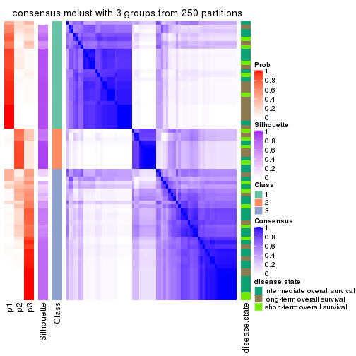</p>

</div>
<div id='tab-SD-mclust-consensus-heatmap-3'>
<pre><code class="r">consensus_heatmap(res, k = 4)
</code></pre>

<p></p>

</div>
<div id='tab-SD-mclust-consensus-heatmap-4'>
<pre><code class="r">consensus_heatmap(res, k = 5)
</code></pre>

<p></p>

</div>
<div id='tab-SD-mclust-consensus-heatmap-5'>
<pre><code class="r">consensus_heatmap(res, k = 6)
</code></pre>

<p></p>

</div>
</div>

Heatmaps for the membership of samples in all partitions to see how consistent they are:


<script>
$( function() {
	$( '#tabs-SD-mclust-membership-heatmap' ).tabs();
} );
</script>
<div id='tabs-SD-mclust-membership-heatmap'>
<ul>
<li><a href='#tab-SD-mclust-membership-heatmap-1'>k = 2</a></li>
<li><a href='#tab-SD-mclust-membership-heatmap-2'>k = 3</a></li>
<li><a href='#tab-SD-mclust-membership-heatmap-3'>k = 4</a></li>
<li><a href='#tab-SD-mclust-membership-heatmap-4'>k = 5</a></li>
<li><a href='#tab-SD-mclust-membership-heatmap-5'>k = 6</a></li>
</ul>
<div id='tab-SD-mclust-membership-heatmap-1'>
<pre><code class="r">membership_heatmap(res, k = 2)
</code></pre>

<p></p>

</div>
<div id='tab-SD-mclust-membership-heatmap-2'>
<pre><code class="r">membership_heatmap(res, k = 3)
</code></pre>

<p></p>

</div>
<div id='tab-SD-mclust-membership-heatmap-3'>
<pre><code class="r">membership_heatmap(res, k = 4)
</code></pre>

<p></p>

</div>
<div id='tab-SD-mclust-membership-heatmap-4'>
<pre><code class="r">membership_heatmap(res, k = 5)
</code></pre>

<p></p>

</div>
<div id='tab-SD-mclust-membership-heatmap-5'>
<pre><code class="r">membership_heatmap(res, k = 6)
</code></pre>

<p>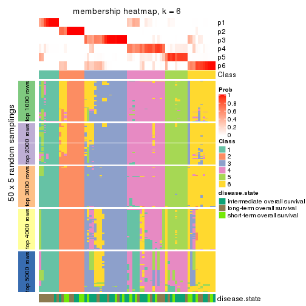</p>

</div>
</div>

As soon as we have had the classes for columns, we can look for signatures
which are significantly different between classes which can be candidate marks
for certain classes. Following are the heatmaps for signatures.


Signature heatmaps where rows are scaled:


<script>
$( function() {
	$( '#tabs-SD-mclust-get-signatures' ).tabs();
} );
</script>
<div id='tabs-SD-mclust-get-signatures'>
<ul>
<li><a href='#tab-SD-mclust-get-signatures-1'>k = 2</a></li>
<li><a href='#tab-SD-mclust-get-signatures-2'>k = 3</a></li>
<li><a href='#tab-SD-mclust-get-signatures-3'>k = 4</a></li>
<li><a href='#tab-SD-mclust-get-signatures-4'>k = 5</a></li>
<li><a href='#tab-SD-mclust-get-signatures-5'>k = 6</a></li>
</ul>
<div id='tab-SD-mclust-get-signatures-1'>
<pre><code class="r">get_signatures(res, k = 2)
</code></pre>

<p></p>

</div>
<div id='tab-SD-mclust-get-signatures-2'>
<pre><code class="r">get_signatures(res, k = 3)
</code></pre>

<p></p>

</div>
<div id='tab-SD-mclust-get-signatures-3'>
<pre><code class="r">get_signatures(res, k = 4)
</code></pre>

<p></p>

</div>
<div id='tab-SD-mclust-get-signatures-4'>
<pre><code class="r">get_signatures(res, k = 5)
</code></pre>

<p></p>

</div>
<div id='tab-SD-mclust-get-signatures-5'>
<pre><code class="r">get_signatures(res, k = 6)
</code></pre>

<p></p>

</div>
</div>


Signature heatmaps where rows are not scaled:


<script>
$( function() {
	$( '#tabs-SD-mclust-get-signatures-no-scale' ).tabs();
} );
</script>
<div id='tabs-SD-mclust-get-signatures-no-scale'>
<ul>
<li><a href='#tab-SD-mclust-get-signatures-no-scale-1'>k = 2</a></li>
<li><a href='#tab-SD-mclust-get-signatures-no-scale-2'>k = 3</a></li>
<li><a href='#tab-SD-mclust-get-signatures-no-scale-3'>k = 4</a></li>
<li><a href='#tab-SD-mclust-get-signatures-no-scale-4'>k = 5</a></li>
<li><a href='#tab-SD-mclust-get-signatures-no-scale-5'>k = 6</a></li>
</ul>
<div id='tab-SD-mclust-get-signatures-no-scale-1'>
<pre><code class="r">get_signatures(res, k = 2, scale_rows = FALSE)
</code></pre>

<p></p>

</div>
<div id='tab-SD-mclust-get-signatures-no-scale-2'>
<pre><code class="r">get_signatures(res, k = 3, scale_rows = FALSE)
</code></pre>

<p></p>

</div>
<div id='tab-SD-mclust-get-signatures-no-scale-3'>
<pre><code class="r">get_signatures(res, k = 4, scale_rows = FALSE)
</code></pre>

<p></p>

</div>
<div id='tab-SD-mclust-get-signatures-no-scale-4'>
<pre><code class="r">get_signatures(res, k = 5, scale_rows = FALSE)
</code></pre>

<p></p>

</div>
<div id='tab-SD-mclust-get-signatures-no-scale-5'>
<pre><code class="r">get_signatures(res, k = 6, scale_rows = FALSE)
</code></pre>

<p></p>

</div>
</div>


Compare the overlap of signatures from different k:

```r
compare_signatures(res)
```


`get_signature()` returns a data frame invisibly. TO get the list of signatures, the function
call should be assigned to a variable explicitly. In following code, if `plot` argument is set
to `FALSE`, no heatmap is plotted while only the differential analysis is performed.

```r
# code only for demonstration
tb = get_signature(res, k = ..., plot = FALSE)
```

An example of the output of `tb` is:

```
#>   which_row         fdr    mean_1    mean_2 scaled_mean_1 scaled_mean_2 km
#> 1        38 0.042760348  8.373488  9.131774    -0.5533452     0.5164555  1
#> 2        40 0.018707592  7.106213  8.469186    -0.6173731     0.5762149  1
#> 3        55 0.019134737 10.221463 11.207825    -0.6159697     0.5749050  1
#> 4        59 0.006059896  5.921854  7.869574    -0.6899429     0.6439467  1
#> 5        60 0.018055526  8.928898 10.211722    -0.6204761     0.5791110  1
#> 6        98 0.009384629 15.714769 14.887706     0.6635654    -0.6193277  2
...
```

The columns in `tb` are:

1. `which_row`: row indices corresponding to the input matrix.
2. `fdr`: FDR for the differential test. 
3. `mean_x`: The mean value in group x.
4. `scaled_mean_x`: The mean value in group x after rows are scaled.
5. `km`: Row groups if k-means clustering is applied to rows.


UMAP plot which shows how samples are separated.


<script>
$( function() {
	$( '#tabs-SD-mclust-dimension-reduction' ).tabs();
} );
</script>
<div id='tabs-SD-mclust-dimension-reduction'>
<ul>
<li><a href='#tab-SD-mclust-dimension-reduction-1'>k = 2</a></li>
<li><a href='#tab-SD-mclust-dimension-reduction-2'>k = 3</a></li>
<li><a href='#tab-SD-mclust-dimension-reduction-3'>k = 4</a></li>
<li><a href='#tab-SD-mclust-dimension-reduction-4'>k = 5</a></li>
<li><a href='#tab-SD-mclust-dimension-reduction-5'>k = 6</a></li>
</ul>
<div id='tab-SD-mclust-dimension-reduction-1'>
<pre><code class="r">dimension_reduction(res, k = 2, method = &quot;UMAP&quot;)
</code></pre>

<p></p>

</div>
<div id='tab-SD-mclust-dimension-reduction-2'>
<pre><code class="r">dimension_reduction(res, k = 3, method = &quot;UMAP&quot;)
</code></pre>

<p></p>

</div>
<div id='tab-SD-mclust-dimension-reduction-3'>
<pre><code class="r">dimension_reduction(res, k = 4, method = &quot;UMAP&quot;)
</code></pre>

<p></p>

</div>
<div id='tab-SD-mclust-dimension-reduction-4'>
<pre><code class="r">dimension_reduction(res, k = 5, method = &quot;UMAP&quot;)
</code></pre>

<p></p>

</div>
<div id='tab-SD-mclust-dimension-reduction-5'>
<pre><code class="r">dimension_reduction(res, k = 6, method = &quot;UMAP&quot;)
</code></pre>

<p></p>

</div>
</div>


Following heatmap shows how subgroups are split when increasing `k`:

```r
collect_classes(res)
```


Test correlation between subgroups and known annotations. If the known
annotation is numeric, one-way ANOVA test is applied, and if the known
annotation is discrete, chi-squared contingency table test is applied.

```r
test_to_known_factors(res)
```

```
#>            n disease.state(p) k
#> SD:mclust 65           0.1209 2
#> SD:mclust 61           0.0945 3
#> SD:mclust 61           0.1705 4
#> SD:mclust 46           0.2096 5
#> SD:mclust 57           0.2847 6
```


If matrix rows can be associated to genes, consider to use `GO_Enrichment(res,
...)` to perform function enrichment for the signature genes.


 

---------------------------------------------------


### SD:NMF**


The object with results only for a single top-value method and a single partition method 
can be extracted as:

```r
res = res_list["SD", "NMF"]
# you can also extract it by
# res = res_list["SD:NMF"]
```

A summary of `res` and all the functions that can be applied to it:

```r
res
```

```
#> A 'ConsensusPartition' object with k = 2, 3, 4, 5, 6.
#>   On a matrix with 51941 rows and 70 columns.
#>   Top rows (1000, 2000, 3000, 4000, 5000) are extracted by 'SD' method.
#>   Subgroups are detected by 'NMF' method.
#>   Performed in total 1250 partitions by row resampling.
#>   Best k for subgroups seems to be 2.
#> 
#> Following methods can be applied to this 'ConsensusPartition' object:
#>  [1] "cola_report"             "collect_classes"         "collect_plots"          
#>  [4] "collect_stats"           "colnames"                "compare_signatures"     
#>  [7] "consensus_heatmap"       "dimension_reduction"     "functional_enrichment"  
#> [10] "get_anno_col"            "get_anno"                "get_classes"            
#> [13] "get_consensus"           "get_matrix"              "get_membership"         
#> [16] "get_param"               "get_signatures"          "get_stats"              
#> [19] "is_best_k"               "is_stable_k"             "membership_heatmap"     
#> [22] "ncol"                    "nrow"                    "plot_ecdf"              
#> [25] "rownames"                "select_partition_number" "show"                   
#> [28] "suggest_best_k"          "test_to_known_factors"
```

`collect_plots()` function collects all the plots made from `res` for all `k` (number of partitions)
into one single page to provide an easy and fast comparison between different `k`.

```r
collect_plots(res)
```


The plots are:

- The first row: a plot of the ECDF (Empirical cumulative distribution
  function) curves of the consensus matrix for each `k` and the heatmap of
  predicted classes for each `k`.
- The second row: heatmaps of the consensus matrix for each `k`.
- The third row: heatmaps of the membership matrix for each `k`.
- The fouth row: heatmaps of the signatures for each `k`.

All the plots in panels can be made by individual functions and they are
plotted later in this section.

`select_partition_number()` produces several plots showing different
statistics for choosing "optimized" `k`. There are following statistics:

- ECDF curves of the consensus matrix for each `k`;
- 1-PAC. [The PAC
  score](https://en.wikipedia.org/wiki/Consensus_clustering#Over-interpretation_potential_of_consensus_clustering)
  measures the proportion of the ambiguous subgrouping.
- Mean silhouette score.
- Concordance. The mean probability of fiting the consensus class ids in all
  partitions.
- Area increased. Denote $A_k$ as the area under the ECDF curve for current
  `k`, the area increased is defined as $A_k - A_{k-1}$.
- Rand index. The percent of pairs of samples that are both in a same cluster
  or both are not in a same cluster in the partition of k and k-1.
- Jaccard index. The ratio of pairs of samples are both in a same cluster in
  the partition of k and k-1 and the pairs of samples are both in a same
  cluster in the partition k or k-1.

The detailed explanations of these statistics can be found in [the cola
vignette](http://bioconductor.org/packages/devel/bioc/vignettes/cola/inst/doc/cola.html#toc_13).

Generally speaking, lower PAC score, higher mean silhouette score or higher
concordance corresponds to better partition. Rand index and Jaccard index
measure how similar the current partition is compared to partition with `k-1`.
If they are too similar, we won't accept `k` is better than `k-1`.

```r
select_partition_number(res)
```

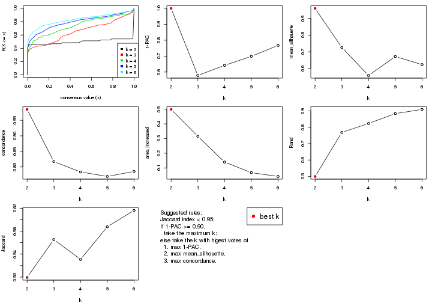

The numeric values for all these statistics can be obtained by `get_stats()`.

```r
get_stats(res)
```

```
#>   k 1-PAC mean_silhouette concordance area_increased  Rand Jaccard
#> 2 2 1.000           0.960       0.985         0.4985 0.499   0.499
#> 3 3 0.579           0.726       0.817         0.3156 0.769   0.565
#> 4 4 0.642           0.558       0.784         0.1398 0.824   0.531
#> 5 5 0.699           0.671       0.769         0.0681 0.884   0.588
#> 6 6 0.767           0.623       0.786         0.0420 0.910   0.616
```

`suggest_best_k()` suggests the best $k$ based on these statistics. The rules are as follows:

- All $k$ with Jaccard index larger than 0.95 are removed because the increase of
  the partition number does not provides enough extra information. If all $k$ are removed,
  the best $k$ is assigned by `NA`.
- For $k$ with 1-PAC larger than 0.9, the maximal $k$ is taken as the "best k". Other $k$ is called "optional k".
- If it does not fit the second rule. The $k$ with the highest vote of highest
  1-PAC, mean silhouette and concordance is taken as the "best k".

```r
suggest_best_k(res)
```

```
#> [1] 2
```


Following shows the table of the partitions (You need to click the **show/hide
code output** link to see it). The membership matrix (columns with name `p*`)
is inferred by
[`clue::cl_consensus()`](https://www.rdocumentation.org/link/cl_consensus?package=clue)
function with the `SE` method. Basically the value in the membership matrix
represents the probability to belong to a certain group. The finall class
label for an item is determined with the group with highest probability it
belongs to.

In `get_classes()` function, the entropy is calculated from the membership
matrix and the silhouette score is calculated from the consensus matrix.


<script>
$( function() {
	$( '#tabs-SD-NMF-get-classes' ).tabs();
} );
</script>
<div id='tabs-SD-NMF-get-classes'>
<ul>
<li><a href='#tab-SD-NMF-get-classes-1'>k = 2</a></li>
<li><a href='#tab-SD-NMF-get-classes-2'>k = 3</a></li>
<li><a href='#tab-SD-NMF-get-classes-3'>k = 4</a></li>
<li><a href='#tab-SD-NMF-get-classes-4'>k = 5</a></li>
<li><a href='#tab-SD-NMF-get-classes-5'>k = 6</a></li>
</ul>

<div id='tab-SD-NMF-get-classes-1'>
<p><a id='tab-SD-NMF-get-classes-1-a' style='color:#0366d6' href='#'>show/hide code output</a></p>
<pre><code class="r">cbind(get_classes(res, k = 2), get_membership(res, k = 2))
</code></pre>

<pre><code>#&gt;            class entropy silhouette    p1    p2
#&gt; GSM1299517     2  0.0000     0.9939 0.000 1.000
#&gt; GSM1299518     2  0.0000     0.9939 0.000 1.000
#&gt; GSM1299519     2  0.0000     0.9939 0.000 1.000
#&gt; GSM1299520     1  0.0000     0.9721 1.000 0.000
#&gt; GSM1299521     1  0.0000     0.9721 1.000 0.000
#&gt; GSM1299522     2  0.0000     0.9939 0.000 1.000
#&gt; GSM1299523     1  0.0000     0.9721 1.000 0.000
#&gt; GSM1299524     2  0.0000     0.9939 0.000 1.000
#&gt; GSM1299525     2  0.0000     0.9939 0.000 1.000
#&gt; GSM1299526     2  0.0000     0.9939 0.000 1.000
#&gt; GSM1299527     2  0.0000     0.9939 0.000 1.000
#&gt; GSM1299528     2  0.0000     0.9939 0.000 1.000
#&gt; GSM1299529     2  0.0000     0.9939 0.000 1.000
#&gt; GSM1299530     1  0.0000     0.9721 1.000 0.000
#&gt; GSM1299531     2  0.0000     0.9939 0.000 1.000
#&gt; GSM1299575     1  0.0000     0.9721 1.000 0.000
#&gt; GSM1299532     2  0.0000     0.9939 0.000 1.000
#&gt; GSM1299533     1  0.9996     0.0541 0.512 0.488
#&gt; GSM1299534     2  0.0000     0.9939 0.000 1.000
#&gt; GSM1299535     2  0.0000     0.9939 0.000 1.000
#&gt; GSM1299536     1  0.0000     0.9721 1.000 0.000
#&gt; GSM1299537     2  0.0000     0.9939 0.000 1.000
#&gt; GSM1299538     1  0.0938     0.9618 0.988 0.012
#&gt; GSM1299539     1  0.0376     0.9688 0.996 0.004
#&gt; GSM1299540     2  0.7602     0.7062 0.220 0.780
#&gt; GSM1299541     2  0.0000     0.9939 0.000 1.000
#&gt; GSM1299542     2  0.0000     0.9939 0.000 1.000
#&gt; GSM1299543     2  0.0000     0.9939 0.000 1.000
#&gt; GSM1299544     2  0.0000     0.9939 0.000 1.000
#&gt; GSM1299545     1  0.0000     0.9721 1.000 0.000
#&gt; GSM1299546     2  0.0000     0.9939 0.000 1.000
#&gt; GSM1299547     1  0.0000     0.9721 1.000 0.000
#&gt; GSM1299548     2  0.0000     0.9939 0.000 1.000
#&gt; GSM1299549     1  0.0000     0.9721 1.000 0.000
#&gt; GSM1299550     1  0.9044     0.5330 0.680 0.320
#&gt; GSM1299551     2  0.0000     0.9939 0.000 1.000
#&gt; GSM1299552     1  0.0000     0.9721 1.000 0.000
#&gt; GSM1299553     1  0.0000     0.9721 1.000 0.000
#&gt; GSM1299554     2  0.0000     0.9939 0.000 1.000
#&gt; GSM1299555     2  0.0000     0.9939 0.000 1.000
#&gt; GSM1299556     2  0.0000     0.9939 0.000 1.000
#&gt; GSM1299557     2  0.0000     0.9939 0.000 1.000
#&gt; GSM1299558     2  0.0000     0.9939 0.000 1.000
#&gt; GSM1299559     2  0.0376     0.9900 0.004 0.996
#&gt; GSM1299560     2  0.0000     0.9939 0.000 1.000
#&gt; GSM1299576     1  0.0000     0.9721 1.000 0.000
#&gt; GSM1299577     1  0.0000     0.9721 1.000 0.000
#&gt; GSM1299561     2  0.0000     0.9939 0.000 1.000
#&gt; GSM1299562     2  0.0000     0.9939 0.000 1.000
#&gt; GSM1299563     1  0.0000     0.9721 1.000 0.000
#&gt; GSM1299564     1  0.0000     0.9721 1.000 0.000
#&gt; GSM1299565     2  0.0000     0.9939 0.000 1.000
#&gt; GSM1299566     2  0.0000     0.9939 0.000 1.000
#&gt; GSM1299567     1  0.0000     0.9721 1.000 0.000
#&gt; GSM1299568     2  0.0000     0.9939 0.000 1.000
#&gt; GSM1299569     2  0.0000     0.9939 0.000 1.000
#&gt; GSM1299570     1  0.0000     0.9721 1.000 0.000
#&gt; GSM1299571     2  0.0000     0.9939 0.000 1.000
#&gt; GSM1299572     1  0.0000     0.9721 1.000 0.000
#&gt; GSM1299573     2  0.0000     0.9939 0.000 1.000
#&gt; GSM1299574     2  0.0000     0.9939 0.000 1.000
#&gt; GSM1299578     1  0.0000     0.9721 1.000 0.000
#&gt; GSM1299579     1  0.0000     0.9721 1.000 0.000
#&gt; GSM1299580     1  0.0000     0.9721 1.000 0.000
#&gt; GSM1299581     1  0.0000     0.9721 1.000 0.000
#&gt; GSM1299582     1  0.0000     0.9721 1.000 0.000
#&gt; GSM1299583     1  0.0000     0.9721 1.000 0.000
#&gt; GSM1299584     1  0.0000     0.9721 1.000 0.000
#&gt; GSM1299585     1  0.0000     0.9721 1.000 0.000
#&gt; GSM1299586     1  0.0000     0.9721 1.000 0.000
</code></pre>

<script>
$('#tab-SD-NMF-get-classes-1-a').parent().next().next().hide();
$('#tab-SD-NMF-get-classes-1-a').click(function(){
  $('#tab-SD-NMF-get-classes-1-a').parent().next().next().toggle();
  return(false);
});
</script>
</div>

<div id='tab-SD-NMF-get-classes-2'>
<p><a id='tab-SD-NMF-get-classes-2-a' style='color:#0366d6' href='#'>show/hide code output</a></p>
<pre><code class="r">cbind(get_classes(res, k = 3), get_membership(res, k = 3))
</code></pre>

<pre><code>#&gt;            class entropy silhouette    p1    p2    p3
#&gt; GSM1299517     3  0.5098     0.8456 0.000 0.248 0.752
#&gt; GSM1299518     2  0.6111     0.0653 0.000 0.604 0.396
#&gt; GSM1299519     2  0.1964     0.7658 0.000 0.944 0.056
#&gt; GSM1299520     1  0.3267     0.8834 0.884 0.000 0.116
#&gt; GSM1299521     1  0.4291     0.8625 0.820 0.000 0.180
#&gt; GSM1299522     2  0.2066     0.7651 0.000 0.940 0.060
#&gt; GSM1299523     1  0.3816     0.8717 0.852 0.000 0.148
#&gt; GSM1299524     3  0.3412     0.7356 0.000 0.124 0.876
#&gt; GSM1299525     2  0.1964     0.7265 0.000 0.944 0.056
#&gt; GSM1299526     2  0.2066     0.7651 0.000 0.940 0.060
#&gt; GSM1299527     3  0.5058     0.8488 0.000 0.244 0.756
#&gt; GSM1299528     2  0.4931     0.5291 0.000 0.768 0.232
#&gt; GSM1299529     2  0.1753     0.7319 0.000 0.952 0.048
#&gt; GSM1299530     1  0.4062     0.8743 0.836 0.000 0.164
#&gt; GSM1299531     2  0.1964     0.7641 0.000 0.944 0.056
#&gt; GSM1299575     1  0.0000     0.8993 1.000 0.000 0.000
#&gt; GSM1299532     3  0.5058     0.8488 0.000 0.244 0.756
#&gt; GSM1299533     2  0.9736     0.1307 0.324 0.436 0.240
#&gt; GSM1299534     3  0.5138     0.8422 0.000 0.252 0.748
#&gt; GSM1299535     2  0.2165     0.7652 0.000 0.936 0.064
#&gt; GSM1299536     1  0.4555     0.8558 0.800 0.000 0.200
#&gt; GSM1299537     3  0.5016     0.8496 0.000 0.240 0.760
#&gt; GSM1299538     1  0.8239     0.2397 0.532 0.388 0.080
#&gt; GSM1299539     2  0.7644     0.4208 0.296 0.632 0.072
#&gt; GSM1299540     2  0.9947     0.1770 0.328 0.380 0.292
#&gt; GSM1299541     3  0.5016     0.8496 0.000 0.240 0.760
#&gt; GSM1299542     3  0.5058     0.8488 0.000 0.244 0.756
#&gt; GSM1299543     2  0.0424     0.7493 0.000 0.992 0.008
#&gt; GSM1299544     2  0.6026     0.1061 0.000 0.624 0.376
#&gt; GSM1299545     1  0.0592     0.8964 0.988 0.000 0.012
#&gt; GSM1299546     2  0.1964     0.7658 0.000 0.944 0.056
#&gt; GSM1299547     1  0.4399     0.8609 0.812 0.000 0.188
#&gt; GSM1299548     3  0.4887     0.8428 0.000 0.228 0.772
#&gt; GSM1299549     1  0.4452     0.8601 0.808 0.000 0.192
#&gt; GSM1299550     3  0.6827     0.3947 0.192 0.080 0.728
#&gt; GSM1299551     2  0.1163     0.7628 0.000 0.972 0.028
#&gt; GSM1299552     1  0.4452     0.8610 0.808 0.000 0.192
#&gt; GSM1299553     1  0.2743     0.8753 0.928 0.020 0.052
#&gt; GSM1299554     3  0.5178     0.7734 0.000 0.256 0.744
#&gt; GSM1299555     2  0.5497     0.4115 0.000 0.708 0.292
#&gt; GSM1299556     3  0.5244     0.8487 0.004 0.240 0.756
#&gt; GSM1299557     2  0.3941     0.6869 0.000 0.844 0.156
#&gt; GSM1299558     2  0.0237     0.7548 0.000 0.996 0.004
#&gt; GSM1299559     3  0.4504     0.8163 0.000 0.196 0.804
#&gt; GSM1299560     3  0.5327     0.8186 0.000 0.272 0.728
#&gt; GSM1299576     1  0.0000     0.8993 1.000 0.000 0.000
#&gt; GSM1299577     1  0.0237     0.8992 0.996 0.000 0.004
#&gt; GSM1299561     3  0.5016     0.8496 0.000 0.240 0.760
#&gt; GSM1299562     2  0.4750     0.6405 0.000 0.784 0.216
#&gt; GSM1299563     1  0.4654     0.8635 0.792 0.000 0.208
#&gt; GSM1299564     3  0.6513    -0.0948 0.400 0.008 0.592
#&gt; GSM1299565     2  0.2066     0.7651 0.000 0.940 0.060
#&gt; GSM1299566     2  0.5465     0.5051 0.000 0.712 0.288
#&gt; GSM1299567     1  0.6095     0.4047 0.608 0.000 0.392
#&gt; GSM1299568     2  0.4702     0.5939 0.000 0.788 0.212
#&gt; GSM1299569     3  0.6295     0.4379 0.000 0.472 0.528
#&gt; GSM1299570     1  0.2448     0.8846 0.924 0.000 0.076
#&gt; GSM1299571     2  0.2066     0.7651 0.000 0.940 0.060
#&gt; GSM1299572     1  0.4399     0.8609 0.812 0.000 0.188
#&gt; GSM1299573     3  0.5058     0.8488 0.000 0.244 0.756
#&gt; GSM1299574     2  0.2066     0.7651 0.000 0.940 0.060
#&gt; GSM1299578     1  0.0000     0.8993 1.000 0.000 0.000
#&gt; GSM1299579     1  0.1411     0.8961 0.964 0.000 0.036
#&gt; GSM1299580     1  0.0000     0.8993 1.000 0.000 0.000
#&gt; GSM1299581     1  0.0000     0.8993 1.000 0.000 0.000
#&gt; GSM1299582     1  0.0000     0.8993 1.000 0.000 0.000
#&gt; GSM1299583     1  0.1529     0.8954 0.960 0.000 0.040
#&gt; GSM1299584     1  0.0000     0.8993 1.000 0.000 0.000
#&gt; GSM1299585     1  0.4178     0.8643 0.828 0.000 0.172
#&gt; GSM1299586     1  0.0000     0.8993 1.000 0.000 0.000
</code></pre>

<script>
$('#tab-SD-NMF-get-classes-2-a').parent().next().next().hide();
$('#tab-SD-NMF-get-classes-2-a').click(function(){
  $('#tab-SD-NMF-get-classes-2-a').parent().next().next().toggle();
  return(false);
});
</script>
</div>

<div id='tab-SD-NMF-get-classes-3'>
<p><a id='tab-SD-NMF-get-classes-3-a' style='color:#0366d6' href='#'>show/hide code output</a></p>
<pre><code class="r">cbind(get_classes(res, k = 4), get_membership(res, k = 4))
</code></pre>

<pre><code>#&gt;            class entropy silhouette    p1    p2    p3    p4
#&gt; GSM1299517     3  0.0376     0.8535 0.000 0.004 0.992 0.004
#&gt; GSM1299518     2  0.5070     0.3351 0.000 0.580 0.416 0.004
#&gt; GSM1299519     2  0.1211     0.8526 0.000 0.960 0.040 0.000
#&gt; GSM1299520     4  0.5110     0.5347 0.296 0.016 0.004 0.684
#&gt; GSM1299521     1  0.0000     0.6038 1.000 0.000 0.000 0.000
#&gt; GSM1299522     2  0.1211     0.8526 0.000 0.960 0.040 0.000
#&gt; GSM1299523     4  0.5217     0.5495 0.244 0.024 0.012 0.720
#&gt; GSM1299524     3  0.2452     0.8033 0.084 0.004 0.908 0.004
#&gt; GSM1299525     2  0.5183     0.4519 0.000 0.584 0.008 0.408
#&gt; GSM1299526     2  0.1211     0.8526 0.000 0.960 0.040 0.000
#&gt; GSM1299527     3  0.0779     0.8514 0.000 0.016 0.980 0.004
#&gt; GSM1299528     3  0.7476    -0.0621 0.000 0.408 0.416 0.176
#&gt; GSM1299529     2  0.3123     0.7453 0.000 0.844 0.000 0.156
#&gt; GSM1299530     4  0.5343     0.5132 0.340 0.016 0.004 0.640
#&gt; GSM1299531     2  0.1489     0.8503 0.000 0.952 0.044 0.004
#&gt; GSM1299575     4  0.5407    -0.2495 0.484 0.012 0.000 0.504
#&gt; GSM1299532     3  0.0188     0.8533 0.000 0.004 0.996 0.000
#&gt; GSM1299533     1  0.4188     0.3125 0.752 0.244 0.000 0.004
#&gt; GSM1299534     3  0.0927     0.8505 0.000 0.008 0.976 0.016
#&gt; GSM1299535     2  0.2500     0.8351 0.000 0.916 0.044 0.040
#&gt; GSM1299536     1  0.1022     0.5781 0.968 0.000 0.000 0.032
#&gt; GSM1299537     3  0.0000     0.8537 0.000 0.000 1.000 0.000
#&gt; GSM1299538     4  0.4695     0.5014 0.076 0.120 0.004 0.800
#&gt; GSM1299539     4  0.5069     0.4909 0.096 0.124 0.004 0.776
#&gt; GSM1299540     4  0.6484     0.3795 0.016 0.232 0.092 0.660
#&gt; GSM1299541     3  0.0000     0.8537 0.000 0.000 1.000 0.000
#&gt; GSM1299542     3  0.0376     0.8533 0.000 0.004 0.992 0.004
#&gt; GSM1299543     2  0.1118     0.8515 0.000 0.964 0.036 0.000
#&gt; GSM1299544     3  0.6764     0.4228 0.000 0.260 0.596 0.144
#&gt; GSM1299545     4  0.5360    -0.1132 0.436 0.012 0.000 0.552
#&gt; GSM1299546     2  0.1211     0.8526 0.000 0.960 0.040 0.000
#&gt; GSM1299547     1  0.0000     0.6038 1.000 0.000 0.000 0.000
#&gt; GSM1299548     3  0.0000     0.8537 0.000 0.000 1.000 0.000
#&gt; GSM1299549     1  0.1492     0.5749 0.956 0.004 0.004 0.036
#&gt; GSM1299550     3  0.7613     0.3959 0.268 0.004 0.504 0.224
#&gt; GSM1299551     2  0.1118     0.8515 0.000 0.964 0.036 0.000
#&gt; GSM1299552     1  0.0592     0.5943 0.984 0.000 0.000 0.016
#&gt; GSM1299553     4  0.2654     0.5034 0.108 0.004 0.000 0.888
#&gt; GSM1299554     3  0.0927     0.8502 0.000 0.008 0.976 0.016
#&gt; GSM1299555     2  0.5608     0.5972 0.000 0.684 0.256 0.060
#&gt; GSM1299556     3  0.0895     0.8467 0.000 0.004 0.976 0.020
#&gt; GSM1299557     2  0.7143     0.3643 0.000 0.484 0.136 0.380
#&gt; GSM1299558     2  0.1576     0.8467 0.000 0.948 0.048 0.004
#&gt; GSM1299559     3  0.3166     0.7570 0.000 0.016 0.868 0.116
#&gt; GSM1299560     3  0.0817     0.8448 0.000 0.024 0.976 0.000
#&gt; GSM1299576     1  0.5407     0.2111 0.504 0.012 0.000 0.484
#&gt; GSM1299577     4  0.5406    -0.2422 0.480 0.012 0.000 0.508
#&gt; GSM1299561     3  0.0188     0.8533 0.000 0.004 0.996 0.000
#&gt; GSM1299562     2  0.3774     0.7714 0.008 0.844 0.128 0.020
#&gt; GSM1299563     4  0.5764     0.4259 0.404 0.024 0.004 0.568
#&gt; GSM1299564     4  0.6074     0.5197 0.164 0.024 0.092 0.720
#&gt; GSM1299565     2  0.1211     0.8526 0.000 0.960 0.040 0.000
#&gt; GSM1299566     3  0.8952     0.0370 0.060 0.316 0.388 0.236
#&gt; GSM1299567     4  0.4719     0.4514 0.016 0.008 0.224 0.752
#&gt; GSM1299568     2  0.7078     0.0401 0.000 0.456 0.420 0.124
#&gt; GSM1299569     3  0.4982     0.6950 0.000 0.092 0.772 0.136
#&gt; GSM1299570     4  0.4809     0.5323 0.252 0.016 0.004 0.728
#&gt; GSM1299571     2  0.1211     0.8526 0.000 0.960 0.040 0.000
#&gt; GSM1299572     1  0.0000     0.6038 1.000 0.000 0.000 0.000
#&gt; GSM1299573     3  0.0524     0.8529 0.000 0.004 0.988 0.008
#&gt; GSM1299574     2  0.1211     0.8526 0.000 0.960 0.040 0.000
#&gt; GSM1299578     1  0.5408     0.2019 0.500 0.012 0.000 0.488
#&gt; GSM1299579     1  0.3625     0.5470 0.828 0.012 0.000 0.160
#&gt; GSM1299580     4  0.5406    -0.2377 0.480 0.012 0.000 0.508
#&gt; GSM1299581     1  0.5407     0.2139 0.504 0.012 0.000 0.484
#&gt; GSM1299582     1  0.5406     0.2221 0.508 0.012 0.000 0.480
#&gt; GSM1299583     1  0.4175     0.5225 0.776 0.012 0.000 0.212
#&gt; GSM1299584     1  0.5392     0.2551 0.528 0.012 0.000 0.460
#&gt; GSM1299585     1  0.0000     0.6038 1.000 0.000 0.000 0.000
#&gt; GSM1299586     1  0.5407     0.2139 0.504 0.012 0.000 0.484
</code></pre>

<script>
$('#tab-SD-NMF-get-classes-3-a').parent().next().next().hide();
$('#tab-SD-NMF-get-classes-3-a').click(function(){
  $('#tab-SD-NMF-get-classes-3-a').parent().next().next().toggle();
  return(false);
});
</script>
</div>

<div id='tab-SD-NMF-get-classes-4'>
<p><a id='tab-SD-NMF-get-classes-4-a' style='color:#0366d6' href='#'>show/hide code output</a></p>
<pre><code class="r">cbind(get_classes(res, k = 5), get_membership(res, k = 5))
</code></pre>

<pre><code>#&gt;            class entropy silhouette    p1    p2    p3    p4    p5
#&gt; GSM1299517     3  0.1661     0.8071 0.000 0.000 0.940 0.036 0.024
#&gt; GSM1299518     2  0.4318     0.5656 0.000 0.688 0.292 0.020 0.000
#&gt; GSM1299519     2  0.0000     0.8828 0.000 1.000 0.000 0.000 0.000
#&gt; GSM1299520     4  0.5056     0.6086 0.360 0.000 0.000 0.596 0.044
#&gt; GSM1299521     5  0.3424     0.8066 0.240 0.000 0.000 0.000 0.760
#&gt; GSM1299522     2  0.0000     0.8828 0.000 1.000 0.000 0.000 0.000
#&gt; GSM1299523     4  0.4914     0.6527 0.280 0.000 0.008 0.672 0.040
#&gt; GSM1299524     3  0.3928     0.6964 0.000 0.008 0.788 0.028 0.176
#&gt; GSM1299525     4  0.5386     0.4119 0.000 0.168 0.004 0.680 0.148
#&gt; GSM1299526     2  0.0000     0.8828 0.000 1.000 0.000 0.000 0.000
#&gt; GSM1299527     3  0.1741     0.7975 0.000 0.000 0.936 0.040 0.024
#&gt; GSM1299528     3  0.8049     0.3986 0.000 0.148 0.412 0.284 0.156
#&gt; GSM1299529     2  0.6407     0.1562 0.000 0.448 0.004 0.400 0.148
#&gt; GSM1299530     4  0.5188     0.6193 0.344 0.000 0.000 0.600 0.056
#&gt; GSM1299531     2  0.3171     0.8073 0.000 0.864 0.008 0.044 0.084
#&gt; GSM1299575     1  0.0162     0.7849 0.996 0.000 0.000 0.000 0.004
#&gt; GSM1299532     3  0.0162     0.8170 0.000 0.000 0.996 0.004 0.000
#&gt; GSM1299533     5  0.5027     0.6687 0.112 0.188 0.000 0.000 0.700
#&gt; GSM1299534     3  0.3572     0.7700 0.000 0.008 0.840 0.064 0.088
#&gt; GSM1299535     2  0.1969     0.8623 0.012 0.936 0.008 0.012 0.032
#&gt; GSM1299536     5  0.3427     0.8011 0.192 0.000 0.000 0.012 0.796
#&gt; GSM1299537     3  0.0451     0.8166 0.000 0.000 0.988 0.008 0.004
#&gt; GSM1299538     4  0.3160     0.6357 0.116 0.004 0.000 0.852 0.028
#&gt; GSM1299539     4  0.3195     0.5620 0.040 0.004 0.000 0.856 0.100
#&gt; GSM1299540     1  0.7241     0.0989 0.544 0.196 0.064 0.192 0.004
#&gt; GSM1299541     3  0.0613     0.8174 0.000 0.004 0.984 0.004 0.008
#&gt; GSM1299542     3  0.0854     0.8166 0.000 0.004 0.976 0.012 0.008
#&gt; GSM1299543     2  0.0693     0.8759 0.000 0.980 0.000 0.008 0.012
#&gt; GSM1299544     3  0.7168     0.5281 0.000 0.068 0.528 0.252 0.152
#&gt; GSM1299545     1  0.1965     0.6921 0.904 0.000 0.000 0.096 0.000
#&gt; GSM1299546     2  0.0000     0.8828 0.000 1.000 0.000 0.000 0.000
#&gt; GSM1299547     5  0.3395     0.8087 0.236 0.000 0.000 0.000 0.764
#&gt; GSM1299548     3  0.0324     0.8167 0.000 0.000 0.992 0.004 0.004
#&gt; GSM1299549     5  0.4970     0.7094 0.136 0.000 0.012 0.116 0.736
#&gt; GSM1299550     5  0.6076     0.2189 0.000 0.000 0.196 0.232 0.572
#&gt; GSM1299551     2  0.0000     0.8828 0.000 1.000 0.000 0.000 0.000
#&gt; GSM1299552     5  0.3409     0.7867 0.160 0.000 0.000 0.024 0.816
#&gt; GSM1299553     1  0.6213    -0.2773 0.452 0.000 0.000 0.408 0.140
#&gt; GSM1299554     3  0.2171     0.8020 0.000 0.000 0.912 0.024 0.064
#&gt; GSM1299555     2  0.4159     0.7468 0.024 0.800 0.144 0.028 0.004
#&gt; GSM1299556     3  0.0798     0.8152 0.000 0.000 0.976 0.016 0.008
#&gt; GSM1299557     4  0.6592     0.3337 0.000 0.188 0.056 0.608 0.148
#&gt; GSM1299558     2  0.4730     0.7153 0.000 0.752 0.008 0.112 0.128
#&gt; GSM1299559     3  0.3456     0.6352 0.004 0.000 0.788 0.204 0.004
#&gt; GSM1299560     3  0.1894     0.7860 0.000 0.072 0.920 0.000 0.008
#&gt; GSM1299576     1  0.0324     0.7866 0.992 0.000 0.000 0.004 0.004
#&gt; GSM1299577     1  0.1965     0.6990 0.904 0.000 0.000 0.096 0.000
#&gt; GSM1299561     3  0.0451     0.8174 0.000 0.004 0.988 0.000 0.008
#&gt; GSM1299562     2  0.2818     0.7855 0.000 0.860 0.004 0.128 0.008
#&gt; GSM1299563     4  0.5032     0.6034 0.128 0.000 0.000 0.704 0.168
#&gt; GSM1299564     4  0.5498     0.6469 0.292 0.000 0.028 0.636 0.044
#&gt; GSM1299565     2  0.0000     0.8828 0.000 1.000 0.000 0.000 0.000
#&gt; GSM1299566     3  0.8057     0.3614 0.000 0.132 0.392 0.308 0.168
#&gt; GSM1299567     4  0.5423     0.5137 0.388 0.000 0.064 0.548 0.000
#&gt; GSM1299568     3  0.7876     0.4695 0.000 0.160 0.464 0.232 0.144
#&gt; GSM1299569     3  0.6018     0.6380 0.000 0.028 0.644 0.200 0.128
#&gt; GSM1299570     4  0.5002     0.6038 0.364 0.000 0.000 0.596 0.040
#&gt; GSM1299571     2  0.0000     0.8828 0.000 1.000 0.000 0.000 0.000
#&gt; GSM1299572     5  0.3395     0.8087 0.236 0.000 0.000 0.000 0.764
#&gt; GSM1299573     3  0.0162     0.8179 0.000 0.000 0.996 0.004 0.000
#&gt; GSM1299574     2  0.0162     0.8817 0.000 0.996 0.000 0.000 0.004
#&gt; GSM1299578     1  0.0162     0.7876 0.996 0.000 0.000 0.000 0.004
#&gt; GSM1299579     1  0.4383    -0.1003 0.572 0.000 0.000 0.004 0.424
#&gt; GSM1299580     1  0.0290     0.7814 0.992 0.000 0.000 0.008 0.000
#&gt; GSM1299581     1  0.0324     0.7866 0.992 0.000 0.000 0.004 0.004
#&gt; GSM1299582     1  0.0162     0.7876 0.996 0.000 0.000 0.000 0.004
#&gt; GSM1299583     1  0.4101     0.1932 0.664 0.000 0.000 0.004 0.332
#&gt; GSM1299584     1  0.0162     0.7876 0.996 0.000 0.000 0.000 0.004
#&gt; GSM1299585     5  0.3424     0.8066 0.240 0.000 0.000 0.000 0.760
#&gt; GSM1299586     1  0.0162     0.7876 0.996 0.000 0.000 0.000 0.004
</code></pre>

<script>
$('#tab-SD-NMF-get-classes-4-a').parent().next().next().hide();
$('#tab-SD-NMF-get-classes-4-a').click(function(){
  $('#tab-SD-NMF-get-classes-4-a').parent().next().next().toggle();
  return(false);
});
</script>
</div>

<div id='tab-SD-NMF-get-classes-5'>
<p><a id='tab-SD-NMF-get-classes-5-a' style='color:#0366d6' href='#'>show/hide code output</a></p>
<pre><code class="r">cbind(get_classes(res, k = 6), get_membership(res, k = 6))
</code></pre>

<pre><code>#&gt;            class entropy silhouette    p1    p2    p3    p4    p5    p6
#&gt; GSM1299517     3  0.5331     0.3612 0.000 0.000 0.528 0.056 0.024 0.392
#&gt; GSM1299518     2  0.4207     0.5999 0.000 0.720 0.232 0.028 0.000 0.020
#&gt; GSM1299519     2  0.0000     0.8516 0.000 1.000 0.000 0.000 0.000 0.000
#&gt; GSM1299520     4  0.1663     0.9292 0.088 0.000 0.000 0.912 0.000 0.000
#&gt; GSM1299521     5  0.1863     0.8062 0.104 0.000 0.000 0.000 0.896 0.000
#&gt; GSM1299522     2  0.0000     0.8516 0.000 1.000 0.000 0.000 0.000 0.000
#&gt; GSM1299523     4  0.1556     0.9300 0.080 0.000 0.000 0.920 0.000 0.000
#&gt; GSM1299524     3  0.5425     0.3376 0.000 0.000 0.504 0.000 0.124 0.372
#&gt; GSM1299525     3  0.7886    -0.1029 0.000 0.048 0.388 0.252 0.092 0.220
#&gt; GSM1299526     2  0.0000     0.8516 0.000 1.000 0.000 0.000 0.000 0.000
#&gt; GSM1299527     3  0.2772     0.3101 0.000 0.000 0.816 0.000 0.004 0.180
#&gt; GSM1299528     6  0.1908     0.7747 0.000 0.028 0.056 0.000 0.000 0.916
#&gt; GSM1299529     3  0.8220    -0.1156 0.000 0.204 0.392 0.104 0.092 0.208
#&gt; GSM1299530     4  0.1866     0.9294 0.084 0.000 0.000 0.908 0.008 0.000
#&gt; GSM1299531     2  0.3151     0.6484 0.000 0.748 0.000 0.000 0.000 0.252
#&gt; GSM1299575     1  0.0260     0.8624 0.992 0.000 0.008 0.000 0.000 0.000
#&gt; GSM1299532     3  0.3833     0.4590 0.000 0.000 0.556 0.000 0.000 0.444
#&gt; GSM1299533     5  0.2633     0.7481 0.020 0.112 0.000 0.000 0.864 0.004
#&gt; GSM1299534     6  0.2762     0.4731 0.000 0.000 0.196 0.000 0.000 0.804
#&gt; GSM1299535     2  0.4900     0.7103 0.000 0.744 0.104 0.084 0.056 0.012
#&gt; GSM1299536     5  0.2070     0.8052 0.092 0.000 0.000 0.000 0.896 0.012
#&gt; GSM1299537     3  0.4045     0.4619 0.000 0.000 0.564 0.000 0.008 0.428
#&gt; GSM1299538     4  0.1789     0.9016 0.032 0.000 0.000 0.924 0.000 0.044
#&gt; GSM1299539     4  0.4628     0.6167 0.000 0.000 0.112 0.684 0.000 0.204
#&gt; GSM1299540     2  0.6768     0.1026 0.236 0.440 0.028 0.284 0.012 0.000
#&gt; GSM1299541     3  0.3966     0.4582 0.000 0.000 0.552 0.000 0.004 0.444
#&gt; GSM1299542     3  0.3862     0.4301 0.000 0.000 0.524 0.000 0.000 0.476
#&gt; GSM1299543     2  0.1327     0.8230 0.000 0.936 0.000 0.000 0.000 0.064
#&gt; GSM1299544     6  0.0508     0.8024 0.000 0.012 0.004 0.000 0.000 0.984
#&gt; GSM1299545     1  0.3714     0.5653 0.720 0.000 0.008 0.264 0.008 0.000
#&gt; GSM1299546     2  0.0000     0.8516 0.000 1.000 0.000 0.000 0.000 0.000
#&gt; GSM1299547     5  0.1863     0.8062 0.104 0.000 0.000 0.000 0.896 0.000
#&gt; GSM1299548     3  0.3828     0.4609 0.000 0.000 0.560 0.000 0.000 0.440
#&gt; GSM1299549     5  0.5797     0.4097 0.012 0.000 0.380 0.092 0.504 0.012
#&gt; GSM1299550     5  0.4524     0.2079 0.000 0.000 0.024 0.004 0.520 0.452
#&gt; GSM1299551     2  0.0146     0.8510 0.000 0.996 0.000 0.000 0.000 0.004
#&gt; GSM1299552     5  0.2537     0.7261 0.008 0.000 0.024 0.088 0.880 0.000
#&gt; GSM1299553     3  0.7372    -0.1877 0.280 0.000 0.388 0.232 0.092 0.008
#&gt; GSM1299554     3  0.3989     0.4220 0.000 0.000 0.528 0.000 0.004 0.468
#&gt; GSM1299555     2  0.2985     0.7973 0.000 0.868 0.068 0.044 0.012 0.008
#&gt; GSM1299556     3  0.4446     0.4474 0.000 0.000 0.588 0.020 0.008 0.384
#&gt; GSM1299557     3  0.7851    -0.1043 0.000 0.056 0.420 0.204 0.092 0.228
#&gt; GSM1299558     2  0.3869     0.1904 0.000 0.500 0.000 0.000 0.000 0.500
#&gt; GSM1299559     3  0.4964     0.1792 0.000 0.000 0.540 0.404 0.012 0.044
#&gt; GSM1299560     3  0.5479     0.3626 0.000 0.136 0.556 0.000 0.004 0.304
#&gt; GSM1299576     1  0.0000     0.8636 1.000 0.000 0.000 0.000 0.000 0.000
#&gt; GSM1299577     1  0.3164     0.7011 0.804 0.000 0.008 0.180 0.004 0.004
#&gt; GSM1299561     3  0.3847     0.4519 0.000 0.000 0.544 0.000 0.000 0.456
#&gt; GSM1299562     2  0.2266     0.7975 0.000 0.880 0.000 0.108 0.000 0.012
#&gt; GSM1299563     4  0.2077     0.9214 0.056 0.000 0.008 0.916 0.008 0.012
#&gt; GSM1299564     4  0.1788     0.9300 0.076 0.000 0.004 0.916 0.000 0.004
#&gt; GSM1299565     2  0.0146     0.8507 0.000 0.996 0.000 0.000 0.000 0.004
#&gt; GSM1299566     6  0.3441     0.7029 0.000 0.080 0.048 0.028 0.004 0.840
#&gt; GSM1299567     4  0.2695     0.8713 0.144 0.000 0.004 0.844 0.008 0.000
#&gt; GSM1299568     6  0.1265     0.8055 0.000 0.044 0.008 0.000 0.000 0.948
#&gt; GSM1299569     6  0.1444     0.7377 0.000 0.000 0.072 0.000 0.000 0.928
#&gt; GSM1299570     4  0.1858     0.9259 0.092 0.000 0.000 0.904 0.004 0.000
#&gt; GSM1299571     2  0.0000     0.8516 0.000 1.000 0.000 0.000 0.000 0.000
#&gt; GSM1299572     5  0.1863     0.8062 0.104 0.000 0.000 0.000 0.896 0.000
#&gt; GSM1299573     3  0.3843     0.4541 0.000 0.000 0.548 0.000 0.000 0.452
#&gt; GSM1299574     2  0.0291     0.8503 0.000 0.992 0.004 0.000 0.004 0.000
#&gt; GSM1299578     1  0.0260     0.8624 0.992 0.000 0.008 0.000 0.000 0.000
#&gt; GSM1299579     1  0.4392     0.0219 0.504 0.000 0.016 0.000 0.476 0.004
#&gt; GSM1299580     1  0.0260     0.8624 0.992 0.000 0.008 0.000 0.000 0.000
#&gt; GSM1299581     1  0.0291     0.8620 0.992 0.000 0.004 0.000 0.000 0.004
#&gt; GSM1299582     1  0.0000     0.8636 1.000 0.000 0.000 0.000 0.000 0.000
#&gt; GSM1299583     1  0.3738     0.4903 0.680 0.000 0.004 0.000 0.312 0.004
#&gt; GSM1299584     1  0.0291     0.8620 0.992 0.000 0.004 0.000 0.000 0.004
#&gt; GSM1299585     5  0.2006     0.8045 0.104 0.000 0.000 0.000 0.892 0.004
#&gt; GSM1299586     1  0.0000     0.8636 1.000 0.000 0.000 0.000 0.000 0.000
</code></pre>

<script>
$('#tab-SD-NMF-get-classes-5-a').parent().next().next().hide();
$('#tab-SD-NMF-get-classes-5-a').click(function(){
  $('#tab-SD-NMF-get-classes-5-a').parent().next().next().toggle();
  return(false);
});
</script>
</div>
</div>

Heatmaps for the consensus matrix. It visualizes the probability of two
samples to be in a same group.


<script>
$( function() {
	$( '#tabs-SD-NMF-consensus-heatmap' ).tabs();
} );
</script>
<div id='tabs-SD-NMF-consensus-heatmap'>
<ul>
<li><a href='#tab-SD-NMF-consensus-heatmap-1'>k = 2</a></li>
<li><a href='#tab-SD-NMF-consensus-heatmap-2'>k = 3</a></li>
<li><a href='#tab-SD-NMF-consensus-heatmap-3'>k = 4</a></li>
<li><a href='#tab-SD-NMF-consensus-heatmap-4'>k = 5</a></li>
<li><a href='#tab-SD-NMF-consensus-heatmap-5'>k = 6</a></li>
</ul>
<div id='tab-SD-NMF-consensus-heatmap-1'>
<pre><code class="r">consensus_heatmap(res, k = 2)
</code></pre>

<p></p>

</div>
<div id='tab-SD-NMF-consensus-heatmap-2'>
<pre><code class="r">consensus_heatmap(res, k = 3)
</code></pre>

<p></p>

</div>
<div id='tab-SD-NMF-consensus-heatmap-3'>
<pre><code class="r">consensus_heatmap(res, k = 4)
</code></pre>

<p></p>

</div>
<div id='tab-SD-NMF-consensus-heatmap-4'>
<pre><code class="r">consensus_heatmap(res, k = 5)
</code></pre>

<p></p>

</div>
<div id='tab-SD-NMF-consensus-heatmap-5'>
<pre><code class="r">consensus_heatmap(res, k = 6)
</code></pre>

<p></p>

</div>
</div>

Heatmaps for the membership of samples in all partitions to see how consistent they are:


<script>
$( function() {
	$( '#tabs-SD-NMF-membership-heatmap' ).tabs();
} );
</script>
<div id='tabs-SD-NMF-membership-heatmap'>
<ul>
<li><a href='#tab-SD-NMF-membership-heatmap-1'>k = 2</a></li>
<li><a href='#tab-SD-NMF-membership-heatmap-2'>k = 3</a></li>
<li><a href='#tab-SD-NMF-membership-heatmap-3'>k = 4</a></li>
<li><a href='#tab-SD-NMF-membership-heatmap-4'>k = 5</a></li>
<li><a href='#tab-SD-NMF-membership-heatmap-5'>k = 6</a></li>
</ul>
<div id='tab-SD-NMF-membership-heatmap-1'>
<pre><code class="r">membership_heatmap(res, k = 2)
</code></pre>

<p></p>

</div>
<div id='tab-SD-NMF-membership-heatmap-2'>
<pre><code class="r">membership_heatmap(res, k = 3)
</code></pre>

<p></p>

</div>
<div id='tab-SD-NMF-membership-heatmap-3'>
<pre><code class="r">membership_heatmap(res, k = 4)
</code></pre>

<p></p>

</div>
<div id='tab-SD-NMF-membership-heatmap-4'>
<pre><code class="r">membership_heatmap(res, k = 5)
</code></pre>

<p></p>

</div>
<div id='tab-SD-NMF-membership-heatmap-5'>
<pre><code class="r">membership_heatmap(res, k = 6)
</code></pre>

<p></p>

</div>
</div>

As soon as we have had the classes for columns, we can look for signatures
which are significantly different between classes which can be candidate marks
for certain classes. Following are the heatmaps for signatures.


Signature heatmaps where rows are scaled:


<script>
$( function() {
	$( '#tabs-SD-NMF-get-signatures' ).tabs();
} );
</script>
<div id='tabs-SD-NMF-get-signatures'>
<ul>
<li><a href='#tab-SD-NMF-get-signatures-1'>k = 2</a></li>
<li><a href='#tab-SD-NMF-get-signatures-2'>k = 3</a></li>
<li><a href='#tab-SD-NMF-get-signatures-3'>k = 4</a></li>
<li><a href='#tab-SD-NMF-get-signatures-4'>k = 5</a></li>
<li><a href='#tab-SD-NMF-get-signatures-5'>k = 6</a></li>
</ul>
<div id='tab-SD-NMF-get-signatures-1'>
<pre><code class="r">get_signatures(res, k = 2)
</code></pre>

<p></p>

</div>
<div id='tab-SD-NMF-get-signatures-2'>
<pre><code class="r">get_signatures(res, k = 3)
</code></pre>

<p></p>

</div>
<div id='tab-SD-NMF-get-signatures-3'>
<pre><code class="r">get_signatures(res, k = 4)
</code></pre>

<p></p>

</div>
<div id='tab-SD-NMF-get-signatures-4'>
<pre><code class="r">get_signatures(res, k = 5)
</code></pre>

<p></p>

</div>
<div id='tab-SD-NMF-get-signatures-5'>
<pre><code class="r">get_signatures(res, k = 6)
</code></pre>

<p></p>

</div>
</div>


Signature heatmaps where rows are not scaled:


<script>
$( function() {
	$( '#tabs-SD-NMF-get-signatures-no-scale' ).tabs();
} );
</script>
<div id='tabs-SD-NMF-get-signatures-no-scale'>
<ul>
<li><a href='#tab-SD-NMF-get-signatures-no-scale-1'>k = 2</a></li>
<li><a href='#tab-SD-NMF-get-signatures-no-scale-2'>k = 3</a></li>
<li><a href='#tab-SD-NMF-get-signatures-no-scale-3'>k = 4</a></li>
<li><a href='#tab-SD-NMF-get-signatures-no-scale-4'>k = 5</a></li>
<li><a href='#tab-SD-NMF-get-signatures-no-scale-5'>k = 6</a></li>
</ul>
<div id='tab-SD-NMF-get-signatures-no-scale-1'>
<pre><code class="r">get_signatures(res, k = 2, scale_rows = FALSE)
</code></pre>

<p></p>

</div>
<div id='tab-SD-NMF-get-signatures-no-scale-2'>
<pre><code class="r">get_signatures(res, k = 3, scale_rows = FALSE)
</code></pre>

<p></p>

</div>
<div id='tab-SD-NMF-get-signatures-no-scale-3'>
<pre><code class="r">get_signatures(res, k = 4, scale_rows = FALSE)
</code></pre>

<p></p>

</div>
<div id='tab-SD-NMF-get-signatures-no-scale-4'>
<pre><code class="r">get_signatures(res, k = 5, scale_rows = FALSE)
</code></pre>

<p></p>

</div>
<div id='tab-SD-NMF-get-signatures-no-scale-5'>
<pre><code class="r">get_signatures(res, k = 6, scale_rows = FALSE)
</code></pre>

<p></p>

</div>
</div>


Compare the overlap of signatures from different k:

```r
compare_signatures(res)
```


`get_signature()` returns a data frame invisibly. TO get the list of signatures, the function
call should be assigned to a variable explicitly. In following code, if `plot` argument is set
to `FALSE`, no heatmap is plotted while only the differential analysis is performed.

```r
# code only for demonstration
tb = get_signature(res, k = ..., plot = FALSE)
```

An example of the output of `tb` is:

```
#>   which_row         fdr    mean_1    mean_2 scaled_mean_1 scaled_mean_2 km
#> 1        38 0.042760348  8.373488  9.131774    -0.5533452     0.5164555  1
#> 2        40 0.018707592  7.106213  8.469186    -0.6173731     0.5762149  1
#> 3        55 0.019134737 10.221463 11.207825    -0.6159697     0.5749050  1
#> 4        59 0.006059896  5.921854  7.869574    -0.6899429     0.6439467  1
#> 5        60 0.018055526  8.928898 10.211722    -0.6204761     0.5791110  1
#> 6        98 0.009384629 15.714769 14.887706     0.6635654    -0.6193277  2
...
```

The columns in `tb` are:

1. `which_row`: row indices corresponding to the input matrix.
2. `fdr`: FDR for the differential test. 
3. `mean_x`: The mean value in group x.
4. `scaled_mean_x`: The mean value in group x after rows are scaled.
5. `km`: Row groups if k-means clustering is applied to rows.


UMAP plot which shows how samples are separated.


<script>
$( function() {
	$( '#tabs-SD-NMF-dimension-reduction' ).tabs();
} );
</script>
<div id='tabs-SD-NMF-dimension-reduction'>
<ul>
<li><a href='#tab-SD-NMF-dimension-reduction-1'>k = 2</a></li>
<li><a href='#tab-SD-NMF-dimension-reduction-2'>k = 3</a></li>
<li><a href='#tab-SD-NMF-dimension-reduction-3'>k = 4</a></li>
<li><a href='#tab-SD-NMF-dimension-reduction-4'>k = 5</a></li>
<li><a href='#tab-SD-NMF-dimension-reduction-5'>k = 6</a></li>
</ul>
<div id='tab-SD-NMF-dimension-reduction-1'>
<pre><code class="r">dimension_reduction(res, k = 2, method = &quot;UMAP&quot;)
</code></pre>

<p></p>

</div>
<div id='tab-SD-NMF-dimension-reduction-2'>
<pre><code class="r">dimension_reduction(res, k = 3, method = &quot;UMAP&quot;)
</code></pre>

<p></p>

</div>
<div id='tab-SD-NMF-dimension-reduction-3'>
<pre><code class="r">dimension_reduction(res, k = 4, method = &quot;UMAP&quot;)
</code></pre>

<p>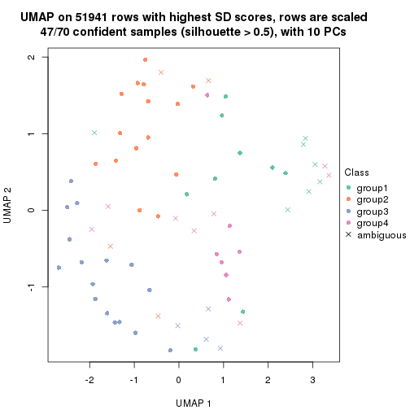</p>

</div>
<div id='tab-SD-NMF-dimension-reduction-4'>
<pre><code class="r">dimension_reduction(res, k = 5, method = &quot;UMAP&quot;)
</code></pre>

<p></p>

</div>
<div id='tab-SD-NMF-dimension-reduction-5'>
<pre><code class="r">dimension_reduction(res, k = 6, method = &quot;UMAP&quot;)
</code></pre>

<p></p>

</div>
</div>


Following heatmap shows how subgroups are split when increasing `k`:

```r
collect_classes(res)
```


Test correlation between subgroups and known annotations. If the known
annotation is numeric, one-way ANOVA test is applied, and if the known
annotation is discrete, chi-squared contingency table test is applied.

```r
test_to_known_factors(res)
```

```
#>         n disease.state(p) k
#> SD:NMF 69           0.1124 2
#> SD:NMF 59           0.0864 3
#> SD:NMF 47           0.5332 4
#> SD:NMF 59           0.2447 5
#> SD:NMF 45           0.6343 6
```


If matrix rows can be associated to genes, consider to use `GO_Enrichment(res,
...)` to perform function enrichment for the signature genes.


 

---------------------------------------------------


### CV:hclust


The object with results only for a single top-value method and a single partition method 
can be extracted as:

```r
res = res_list["CV", "hclust"]
# you can also extract it by
# res = res_list["CV:hclust"]
```

A summary of `res` and all the functions that can be applied to it:

```r
res
```

```
#> A 'ConsensusPartition' object with k = 2, 3, 4, 5, 6.
#>   On a matrix with 51941 rows and 70 columns.
#>   Top rows (1000, 2000, 3000, 4000, 5000) are extracted by 'CV' method.
#>   Subgroups are detected by 'hclust' method.
#>   Performed in total 1250 partitions by row resampling.
#>   Best k for subgroups seems to be 2.
#> 
#> Following methods can be applied to this 'ConsensusPartition' object:
#>  [1] "cola_report"             "collect_classes"         "collect_plots"          
#>  [4] "collect_stats"           "colnames"                "compare_signatures"     
#>  [7] "consensus_heatmap"       "dimension_reduction"     "functional_enrichment"  
#> [10] "get_anno_col"            "get_anno"                "get_classes"            
#> [13] "get_consensus"           "get_matrix"              "get_membership"         
#> [16] "get_param"               "get_signatures"          "get_stats"              
#> [19] "is_best_k"               "is_stable_k"             "membership_heatmap"     
#> [22] "ncol"                    "nrow"                    "plot_ecdf"              
#> [25] "rownames"                "select_partition_number" "show"                   
#> [28] "suggest_best_k"          "test_to_known_factors"
```

`collect_plots()` function collects all the plots made from `res` for all `k` (number of partitions)
into one single page to provide an easy and fast comparison between different `k`.

```r
collect_plots(res)
```


The plots are:

- The first row: a plot of the ECDF (Empirical cumulative distribution
  function) curves of the consensus matrix for each `k` and the heatmap of
  predicted classes for each `k`.
- The second row: heatmaps of the consensus matrix for each `k`.
- The third row: heatmaps of the membership matrix for each `k`.
- The fouth row: heatmaps of the signatures for each `k`.

All the plots in panels can be made by individual functions and they are
plotted later in this section.

`select_partition_number()` produces several plots showing different
statistics for choosing "optimized" `k`. There are following statistics:

- ECDF curves of the consensus matrix for each `k`;
- 1-PAC. [The PAC
  score](https://en.wikipedia.org/wiki/Consensus_clustering#Over-interpretation_potential_of_consensus_clustering)
  measures the proportion of the ambiguous subgrouping.
- Mean silhouette score.
- Concordance. The mean probability of fiting the consensus class ids in all
  partitions.
- Area increased. Denote $A_k$ as the area under the ECDF curve for current
  `k`, the area increased is defined as $A_k - A_{k-1}$.
- Rand index. The percent of pairs of samples that are both in a same cluster
  or both are not in a same cluster in the partition of k and k-1.
- Jaccard index. The ratio of pairs of samples are both in a same cluster in
  the partition of k and k-1 and the pairs of samples are both in a same
  cluster in the partition k or k-1.

The detailed explanations of these statistics can be found in [the cola
vignette](http://bioconductor.org/packages/devel/bioc/vignettes/cola/inst/doc/cola.html#toc_13).

Generally speaking, lower PAC score, higher mean silhouette score or higher
concordance corresponds to better partition. Rand index and Jaccard index
measure how similar the current partition is compared to partition with `k-1`.
If they are too similar, we won't accept `k` is better than `k-1`.

```r
select_partition_number(res)
```


The numeric values for all these statistics can be obtained by `get_stats()`.

```r
get_stats(res)
```

```
#>   k 1-PAC mean_silhouette concordance area_increased  Rand Jaccard
#> 2 2 0.289           0.696       0.826         0.4028 0.552   0.552
#> 3 3 0.302           0.575       0.728         0.3911 0.675   0.482
#> 4 4 0.473           0.576       0.683         0.1730 0.882   0.705
#> 5 5 0.548           0.505       0.698         0.1036 0.740   0.389
#> 6 6 0.662           0.685       0.784         0.0648 0.884   0.618
```

`suggest_best_k()` suggests the best $k$ based on these statistics. The rules are as follows:

- All $k$ with Jaccard index larger than 0.95 are removed because the increase of
  the partition number does not provides enough extra information. If all $k$ are removed,
  the best $k$ is assigned by `NA`.
- For $k$ with 1-PAC larger than 0.9, the maximal $k$ is taken as the "best k". Other $k$ is called "optional k".
- If it does not fit the second rule. The $k$ with the highest vote of highest
  1-PAC, mean silhouette and concordance is taken as the "best k".

```r
suggest_best_k(res)
```

```
#> [1] 2
```


Following shows the table of the partitions (You need to click the **show/hide
code output** link to see it). The membership matrix (columns with name `p*`)
is inferred by
[`clue::cl_consensus()`](https://www.rdocumentation.org/link/cl_consensus?package=clue)
function with the `SE` method. Basically the value in the membership matrix
represents the probability to belong to a certain group. The finall class
label for an item is determined with the group with highest probability it
belongs to.

In `get_classes()` function, the entropy is calculated from the membership
matrix and the silhouette score is calculated from the consensus matrix.


<script>
$( function() {
	$( '#tabs-CV-hclust-get-classes' ).tabs();
} );
</script>
<div id='tabs-CV-hclust-get-classes'>
<ul>
<li><a href='#tab-CV-hclust-get-classes-1'>k = 2</a></li>
<li><a href='#tab-CV-hclust-get-classes-2'>k = 3</a></li>
<li><a href='#tab-CV-hclust-get-classes-3'>k = 4</a></li>
<li><a href='#tab-CV-hclust-get-classes-4'>k = 5</a></li>
<li><a href='#tab-CV-hclust-get-classes-5'>k = 6</a></li>
</ul>

<div id='tab-CV-hclust-get-classes-1'>
<p><a id='tab-CV-hclust-get-classes-1-a' style='color:#0366d6' href='#'>show/hide code output</a></p>
<pre><code class="r">cbind(get_classes(res, k = 2), get_membership(res, k = 2))
</code></pre>

<pre><code>#&gt;            class entropy silhouette    p1    p2
#&gt; GSM1299517     2  0.0938      0.809 0.012 0.988
#&gt; GSM1299518     2  0.4939      0.786 0.108 0.892
#&gt; GSM1299519     2  0.4562      0.783 0.096 0.904
#&gt; GSM1299520     1  0.9944      0.639 0.544 0.456
#&gt; GSM1299521     1  0.8081      0.920 0.752 0.248
#&gt; GSM1299522     2  0.4562      0.783 0.096 0.904
#&gt; GSM1299523     2  0.9922     -0.393 0.448 0.552
#&gt; GSM1299524     2  0.9833     -0.278 0.424 0.576
#&gt; GSM1299525     2  0.8081      0.650 0.248 0.752
#&gt; GSM1299526     2  0.4562      0.783 0.096 0.904
#&gt; GSM1299527     2  0.0938      0.809 0.012 0.988
#&gt; GSM1299528     2  0.0000      0.810 0.000 1.000
#&gt; GSM1299529     2  0.8081      0.650 0.248 0.752
#&gt; GSM1299530     1  0.9933      0.649 0.548 0.452
#&gt; GSM1299531     2  0.0938      0.808 0.012 0.988
#&gt; GSM1299575     1  0.8144      0.921 0.748 0.252
#&gt; GSM1299532     2  0.0938      0.809 0.012 0.988
#&gt; GSM1299533     1  0.8207      0.919 0.744 0.256
#&gt; GSM1299534     2  0.0672      0.809 0.008 0.992
#&gt; GSM1299535     2  0.1184      0.806 0.016 0.984
#&gt; GSM1299536     1  0.9460      0.818 0.636 0.364
#&gt; GSM1299537     2  0.0938      0.809 0.012 0.988
#&gt; GSM1299538     2  0.7453      0.495 0.212 0.788
#&gt; GSM1299539     2  0.8081      0.650 0.248 0.752
#&gt; GSM1299540     2  0.8555      0.336 0.280 0.720
#&gt; GSM1299541     2  0.4562      0.791 0.096 0.904
#&gt; GSM1299542     2  0.0938      0.809 0.012 0.988
#&gt; GSM1299543     2  0.3584      0.794 0.068 0.932
#&gt; GSM1299544     2  0.0000      0.810 0.000 1.000
#&gt; GSM1299545     2  0.9881     -0.326 0.436 0.564
#&gt; GSM1299546     2  0.4562      0.783 0.096 0.904
#&gt; GSM1299547     1  0.8555      0.907 0.720 0.280
#&gt; GSM1299548     2  0.0938      0.809 0.012 0.988
#&gt; GSM1299549     1  0.9286      0.845 0.656 0.344
#&gt; GSM1299550     1  0.9710      0.765 0.600 0.400
#&gt; GSM1299551     2  0.4562      0.783 0.096 0.904
#&gt; GSM1299552     1  0.8555      0.907 0.720 0.280
#&gt; GSM1299553     2  0.8016      0.653 0.244 0.756
#&gt; GSM1299554     2  0.0938      0.809 0.012 0.988
#&gt; GSM1299555     2  0.8207      0.401 0.256 0.744
#&gt; GSM1299556     2  0.0938      0.809 0.012 0.988
#&gt; GSM1299557     2  0.8081      0.650 0.248 0.752
#&gt; GSM1299558     2  0.0000      0.810 0.000 1.000
#&gt; GSM1299559     2  0.0938      0.809 0.012 0.988
#&gt; GSM1299560     2  0.0938      0.809 0.012 0.988
#&gt; GSM1299576     1  0.8081      0.920 0.752 0.248
#&gt; GSM1299577     1  0.9044      0.872 0.680 0.320
#&gt; GSM1299561     2  0.1184      0.807 0.016 0.984
#&gt; GSM1299562     2  0.2423      0.786 0.040 0.960
#&gt; GSM1299563     2  0.9881     -0.347 0.436 0.564
#&gt; GSM1299564     2  0.9909     -0.381 0.444 0.556
#&gt; GSM1299565     2  0.4562      0.783 0.096 0.904
#&gt; GSM1299566     2  0.0000      0.810 0.000 1.000
#&gt; GSM1299567     2  0.9909     -0.363 0.444 0.556
#&gt; GSM1299568     2  0.0672      0.809 0.008 0.992
#&gt; GSM1299569     2  0.0672      0.809 0.008 0.992
#&gt; GSM1299570     1  0.9933      0.649 0.548 0.452
#&gt; GSM1299571     2  0.4562      0.783 0.096 0.904
#&gt; GSM1299572     1  0.8207      0.919 0.744 0.256
#&gt; GSM1299573     2  0.0938      0.809 0.012 0.988
#&gt; GSM1299574     2  0.4562      0.783 0.096 0.904
#&gt; GSM1299578     1  0.8144      0.921 0.748 0.252
#&gt; GSM1299579     1  0.8081      0.920 0.752 0.248
#&gt; GSM1299580     1  0.8144      0.921 0.748 0.252
#&gt; GSM1299581     1  0.8081      0.920 0.752 0.248
#&gt; GSM1299582     1  0.8081      0.920 0.752 0.248
#&gt; GSM1299583     1  0.8081      0.920 0.752 0.248
#&gt; GSM1299584     1  0.8081      0.920 0.752 0.248
#&gt; GSM1299585     1  0.8081      0.920 0.752 0.248
#&gt; GSM1299586     1  0.8144      0.921 0.748 0.252
</code></pre>

<script>
$('#tab-CV-hclust-get-classes-1-a').parent().next().next().hide();
$('#tab-CV-hclust-get-classes-1-a').click(function(){
  $('#tab-CV-hclust-get-classes-1-a').parent().next().next().toggle();
  return(false);
});
</script>
</div>

<div id='tab-CV-hclust-get-classes-2'>
<p><a id='tab-CV-hclust-get-classes-2-a' style='color:#0366d6' href='#'>show/hide code output</a></p>
<pre><code class="r">cbind(get_classes(res, k = 3), get_membership(res, k = 3))
</code></pre>

<pre><code>#&gt;            class entropy silhouette    p1    p2    p3
#&gt; GSM1299517     3  0.9087    0.62260 0.188 0.268 0.544
#&gt; GSM1299518     3  0.3670    0.50054 0.020 0.092 0.888
#&gt; GSM1299519     3  0.0592    0.46779 0.000 0.012 0.988
#&gt; GSM1299520     1  0.4702    0.68050 0.788 0.212 0.000
#&gt; GSM1299521     1  0.0000    0.79538 1.000 0.000 0.000
#&gt; GSM1299522     3  0.1529    0.46058 0.000 0.040 0.960
#&gt; GSM1299523     1  0.8045    0.46759 0.624 0.272 0.104
#&gt; GSM1299524     1  0.8009    0.38297 0.624 0.100 0.276
#&gt; GSM1299525     2  0.0424    0.63763 0.000 0.992 0.008
#&gt; GSM1299526     3  0.0000    0.46891 0.000 0.000 1.000
#&gt; GSM1299527     3  0.9087    0.62260 0.188 0.268 0.544
#&gt; GSM1299528     2  0.8307    0.38513 0.176 0.632 0.192
#&gt; GSM1299529     2  0.0237    0.63693 0.000 0.996 0.004
#&gt; GSM1299530     1  0.4654    0.68417 0.792 0.208 0.000
#&gt; GSM1299531     3  0.9234    0.39620 0.160 0.364 0.476
#&gt; GSM1299575     1  0.0237    0.79656 0.996 0.004 0.000
#&gt; GSM1299532     3  0.9087    0.62260 0.188 0.268 0.544
#&gt; GSM1299533     1  0.0424    0.79522 0.992 0.000 0.008
#&gt; GSM1299534     3  0.9303    0.56080 0.184 0.316 0.500
#&gt; GSM1299535     3  0.9045    0.61875 0.192 0.256 0.552
#&gt; GSM1299536     1  0.3618    0.76007 0.884 0.104 0.012
#&gt; GSM1299537     3  0.9087    0.62260 0.188 0.268 0.544
#&gt; GSM1299538     2  0.8618    0.18703 0.388 0.508 0.104
#&gt; GSM1299539     2  0.0237    0.63693 0.000 0.996 0.004
#&gt; GSM1299540     1  0.9485    0.02989 0.484 0.212 0.304
#&gt; GSM1299541     3  0.5375    0.52435 0.056 0.128 0.816
#&gt; GSM1299542     3  0.9061    0.62309 0.188 0.264 0.548
#&gt; GSM1299543     3  0.8339    0.00568 0.080 0.448 0.472
#&gt; GSM1299544     2  0.8350    0.37601 0.176 0.628 0.196
#&gt; GSM1299545     1  0.8246    0.46711 0.632 0.220 0.148
#&gt; GSM1299546     3  0.0592    0.46779 0.000 0.012 0.988
#&gt; GSM1299547     1  0.1482    0.79236 0.968 0.020 0.012
#&gt; GSM1299548     3  0.9112    0.61855 0.188 0.272 0.540
#&gt; GSM1299549     1  0.3499    0.76297 0.900 0.072 0.028
#&gt; GSM1299550     1  0.5695    0.70493 0.804 0.120 0.076
#&gt; GSM1299551     3  0.0592    0.46779 0.000 0.012 0.988
#&gt; GSM1299552     1  0.1453    0.79240 0.968 0.024 0.008
#&gt; GSM1299553     2  0.0000    0.63739 0.000 1.000 0.000
#&gt; GSM1299554     3  0.9073    0.62100 0.184 0.272 0.544
#&gt; GSM1299555     1  0.9676   -0.16616 0.432 0.220 0.348
#&gt; GSM1299556     3  0.9087    0.62260 0.188 0.268 0.544
#&gt; GSM1299557     2  0.0424    0.63763 0.000 0.992 0.008
#&gt; GSM1299558     2  0.9089    0.14186 0.176 0.536 0.288
#&gt; GSM1299559     3  0.9087    0.62260 0.188 0.268 0.544
#&gt; GSM1299560     3  0.9048    0.62319 0.184 0.268 0.548
#&gt; GSM1299576     1  0.0000    0.79538 1.000 0.000 0.000
#&gt; GSM1299577     1  0.4357    0.74116 0.868 0.052 0.080
#&gt; GSM1299561     3  0.8787    0.61717 0.188 0.228 0.584
#&gt; GSM1299562     3  0.9025    0.46636 0.284 0.172 0.544
#&gt; GSM1299563     1  0.8318    0.43108 0.612 0.260 0.128
#&gt; GSM1299564     1  0.8173    0.45812 0.620 0.264 0.116
#&gt; GSM1299565     3  0.1964    0.44501 0.000 0.056 0.944
#&gt; GSM1299566     2  0.8307    0.38513 0.176 0.632 0.192
#&gt; GSM1299567     1  0.8300    0.44817 0.620 0.244 0.136
#&gt; GSM1299568     3  0.9303    0.56080 0.184 0.316 0.500
#&gt; GSM1299569     3  0.9320    0.55413 0.184 0.320 0.496
#&gt; GSM1299570     1  0.4654    0.68417 0.792 0.208 0.000
#&gt; GSM1299571     3  0.0237    0.47108 0.000 0.004 0.996
#&gt; GSM1299572     1  0.0424    0.79522 0.992 0.000 0.008
#&gt; GSM1299573     3  0.9112    0.61855 0.188 0.272 0.540
#&gt; GSM1299574     3  0.0592    0.46779 0.000 0.012 0.988
#&gt; GSM1299578     1  0.0237    0.79656 0.996 0.004 0.000
#&gt; GSM1299579     1  0.0000    0.79538 1.000 0.000 0.000
#&gt; GSM1299580     1  0.0237    0.79656 0.996 0.004 0.000
#&gt; GSM1299581     1  0.0000    0.79538 1.000 0.000 0.000
#&gt; GSM1299582     1  0.0000    0.79538 1.000 0.000 0.000
#&gt; GSM1299583     1  0.0000    0.79538 1.000 0.000 0.000
#&gt; GSM1299584     1  0.0000    0.79538 1.000 0.000 0.000
#&gt; GSM1299585     1  0.0000    0.79538 1.000 0.000 0.000
#&gt; GSM1299586     1  0.0237    0.79656 0.996 0.004 0.000
</code></pre>

<script>
$('#tab-CV-hclust-get-classes-2-a').parent().next().next().hide();
$('#tab-CV-hclust-get-classes-2-a').click(function(){
  $('#tab-CV-hclust-get-classes-2-a').parent().next().next().toggle();
  return(false);
});
</script>
</div>

<div id='tab-CV-hclust-get-classes-3'>
<p><a id='tab-CV-hclust-get-classes-3-a' style='color:#0366d6' href='#'>show/hide code output</a></p>
<pre><code class="r">cbind(get_classes(res, k = 4), get_membership(res, k = 4))
</code></pre>

<pre><code>#&gt;            class entropy silhouette    p1    p2    p3    p4
#&gt; GSM1299517     3  0.6474     0.5948 0.000 0.076 0.536 0.388
#&gt; GSM1299518     3  0.2924     0.5069 0.000 0.016 0.884 0.100
#&gt; GSM1299519     3  0.0524     0.4811 0.000 0.008 0.988 0.004
#&gt; GSM1299520     4  0.4252     0.4741 0.252 0.004 0.000 0.744
#&gt; GSM1299521     1  0.0000     0.7918 1.000 0.000 0.000 0.000
#&gt; GSM1299522     3  0.1488     0.4725 0.000 0.012 0.956 0.032
#&gt; GSM1299523     4  0.6645     0.6249 0.208 0.028 0.096 0.668
#&gt; GSM1299524     1  0.7616    -0.1175 0.520 0.008 0.268 0.204
#&gt; GSM1299525     2  0.1584     0.9255 0.000 0.952 0.012 0.036
#&gt; GSM1299526     3  0.0336     0.4814 0.000 0.008 0.992 0.000
#&gt; GSM1299527     3  0.6474     0.5948 0.000 0.076 0.536 0.388
#&gt; GSM1299528     4  0.6750     0.2772 0.000 0.208 0.180 0.612
#&gt; GSM1299529     2  0.1452     0.9237 0.000 0.956 0.008 0.036
#&gt; GSM1299530     4  0.4283     0.4688 0.256 0.004 0.000 0.740
#&gt; GSM1299531     3  0.6960     0.3630 0.000 0.112 0.468 0.420
#&gt; GSM1299575     1  0.3444     0.7986 0.816 0.000 0.000 0.184
#&gt; GSM1299532     3  0.6474     0.5948 0.000 0.076 0.536 0.388
#&gt; GSM1299533     1  0.1109     0.7954 0.968 0.000 0.004 0.028
#&gt; GSM1299534     3  0.6595     0.5392 0.000 0.080 0.492 0.428
#&gt; GSM1299535     3  0.6286     0.5881 0.000 0.064 0.552 0.384
#&gt; GSM1299536     1  0.3345     0.7368 0.860 0.012 0.004 0.124
#&gt; GSM1299537     3  0.6474     0.5948 0.000 0.076 0.536 0.388
#&gt; GSM1299538     4  0.4750     0.5071 0.008 0.092 0.096 0.804
#&gt; GSM1299539     2  0.4608     0.6667 0.000 0.692 0.004 0.304
#&gt; GSM1299540     4  0.5911     0.2556 0.032 0.016 0.304 0.648
#&gt; GSM1299541     3  0.4149     0.5249 0.000 0.036 0.812 0.152
#&gt; GSM1299542     3  0.6417     0.5950 0.000 0.072 0.540 0.388
#&gt; GSM1299543     3  0.7441     0.1322 0.000 0.180 0.468 0.352
#&gt; GSM1299544     4  0.6785     0.2710 0.000 0.208 0.184 0.608
#&gt; GSM1299545     4  0.6429     0.5781 0.172 0.008 0.148 0.672
#&gt; GSM1299546     3  0.0524     0.4811 0.000 0.008 0.988 0.004
#&gt; GSM1299547     1  0.1398     0.7872 0.956 0.000 0.004 0.040
#&gt; GSM1299548     3  0.6483     0.5905 0.000 0.076 0.532 0.392
#&gt; GSM1299549     1  0.5757     0.3258 0.652 0.020 0.020 0.308
#&gt; GSM1299550     1  0.5766     0.4965 0.716 0.012 0.068 0.204
#&gt; GSM1299551     3  0.0524     0.4811 0.000 0.008 0.988 0.004
#&gt; GSM1299552     1  0.2847     0.7601 0.896 0.016 0.004 0.084
#&gt; GSM1299553     2  0.1545     0.9243 0.000 0.952 0.008 0.040
#&gt; GSM1299554     3  0.6474     0.5941 0.000 0.076 0.536 0.388
#&gt; GSM1299555     4  0.6025     0.1531 0.032 0.012 0.352 0.604
#&gt; GSM1299556     3  0.6474     0.5948 0.000 0.076 0.536 0.388
#&gt; GSM1299557     2  0.1584     0.9255 0.000 0.952 0.012 0.036
#&gt; GSM1299558     4  0.7271     0.0565 0.000 0.192 0.276 0.532
#&gt; GSM1299559     3  0.6474     0.5948 0.000 0.076 0.536 0.388
#&gt; GSM1299560     3  0.6464     0.5963 0.000 0.076 0.540 0.384
#&gt; GSM1299576     1  0.3400     0.7998 0.820 0.000 0.000 0.180
#&gt; GSM1299577     1  0.6382     0.3980 0.580 0.000 0.080 0.340
#&gt; GSM1299561     3  0.6097     0.5892 0.000 0.056 0.580 0.364
#&gt; GSM1299562     3  0.6384     0.4449 0.004 0.056 0.532 0.408
#&gt; GSM1299563     4  0.7151     0.6100 0.228 0.032 0.116 0.624
#&gt; GSM1299564     4  0.6820     0.6227 0.216 0.028 0.104 0.652
#&gt; GSM1299565     3  0.1888     0.4588 0.000 0.016 0.940 0.044
#&gt; GSM1299566     4  0.6750     0.2772 0.000 0.208 0.180 0.612
#&gt; GSM1299567     4  0.6485     0.5952 0.184 0.012 0.132 0.672
#&gt; GSM1299568     3  0.6591     0.5416 0.000 0.080 0.496 0.424
#&gt; GSM1299569     3  0.6595     0.5358 0.000 0.080 0.492 0.428
#&gt; GSM1299570     4  0.4283     0.4688 0.256 0.004 0.000 0.740
#&gt; GSM1299571     3  0.0188     0.4838 0.000 0.004 0.996 0.000
#&gt; GSM1299572     1  0.1109     0.7954 0.968 0.000 0.004 0.028
#&gt; GSM1299573     3  0.6483     0.5905 0.000 0.076 0.532 0.392
#&gt; GSM1299574     3  0.0524     0.4811 0.000 0.008 0.988 0.004
#&gt; GSM1299578     1  0.3444     0.7986 0.816 0.000 0.000 0.184
#&gt; GSM1299579     1  0.1211     0.8037 0.960 0.000 0.000 0.040
#&gt; GSM1299580     1  0.3444     0.7986 0.816 0.000 0.000 0.184
#&gt; GSM1299581     1  0.3400     0.7998 0.820 0.000 0.000 0.180
#&gt; GSM1299582     1  0.3400     0.7998 0.820 0.000 0.000 0.180
#&gt; GSM1299583     1  0.1211     0.8037 0.960 0.000 0.000 0.040
#&gt; GSM1299584     1  0.3400     0.7998 0.820 0.000 0.000 0.180
#&gt; GSM1299585     1  0.0000     0.7918 1.000 0.000 0.000 0.000
#&gt; GSM1299586     1  0.3444     0.7986 0.816 0.000 0.000 0.184
</code></pre>

<script>
$('#tab-CV-hclust-get-classes-3-a').parent().next().next().hide();
$('#tab-CV-hclust-get-classes-3-a').click(function(){
  $('#tab-CV-hclust-get-classes-3-a').parent().next().next().toggle();
  return(false);
});
</script>
</div>

<div id='tab-CV-hclust-get-classes-4'>
<p><a id='tab-CV-hclust-get-classes-4-a' style='color:#0366d6' href='#'>show/hide code output</a></p>
<pre><code class="r">cbind(get_classes(res, k = 5), get_membership(res, k = 5))
</code></pre>

<pre><code>#&gt;            class entropy silhouette    p1    p2    p3    p4    p5
#&gt; GSM1299517     3  0.0000     0.6187 0.000 0.000 1.000 0.000 0.000
#&gt; GSM1299518     2  0.4562     0.7025 0.000 0.500 0.492 0.000 0.008
#&gt; GSM1299519     2  0.3983     0.9505 0.000 0.660 0.340 0.000 0.000
#&gt; GSM1299520     5  0.7770     0.0890 0.360 0.056 0.156 0.016 0.412
#&gt; GSM1299521     5  0.4307     0.1683 0.500 0.000 0.000 0.000 0.500
#&gt; GSM1299522     2  0.4440     0.9271 0.000 0.660 0.324 0.004 0.012
#&gt; GSM1299523     3  0.8461     0.1312 0.300 0.084 0.368 0.024 0.224
#&gt; GSM1299524     3  0.6802    -0.1153 0.172 0.016 0.456 0.000 0.356
#&gt; GSM1299525     4  0.0794     0.9136 0.000 0.000 0.028 0.972 0.000
#&gt; GSM1299526     2  0.3999     0.9455 0.000 0.656 0.344 0.000 0.000
#&gt; GSM1299527     3  0.0000     0.6187 0.000 0.000 1.000 0.000 0.000
#&gt; GSM1299528     3  0.6372     0.4643 0.000 0.292 0.576 0.040 0.092
#&gt; GSM1299529     4  0.0609     0.9108 0.000 0.000 0.020 0.980 0.000
#&gt; GSM1299530     5  0.7723     0.0876 0.364 0.052 0.156 0.016 0.412
#&gt; GSM1299531     3  0.4538     0.5073 0.000 0.180 0.752 0.008 0.060
#&gt; GSM1299575     1  0.0451     0.7508 0.988 0.000 0.008 0.000 0.004
#&gt; GSM1299532     3  0.0000     0.6187 0.000 0.000 1.000 0.000 0.000
#&gt; GSM1299533     5  0.4906     0.2276 0.480 0.000 0.024 0.000 0.496
#&gt; GSM1299534     3  0.1662     0.6166 0.000 0.056 0.936 0.004 0.004
#&gt; GSM1299535     3  0.1026     0.6064 0.004 0.024 0.968 0.000 0.004
#&gt; GSM1299536     5  0.6181     0.2776 0.388 0.032 0.064 0.000 0.516
#&gt; GSM1299537     3  0.0000     0.6187 0.000 0.000 1.000 0.000 0.000
#&gt; GSM1299538     3  0.8676     0.2765 0.100 0.272 0.356 0.028 0.244
#&gt; GSM1299539     4  0.6330     0.6480 0.000 0.236 0.028 0.600 0.136
#&gt; GSM1299540     3  0.7265     0.3445 0.140 0.060 0.548 0.012 0.240
#&gt; GSM1299541     3  0.4392    -0.4206 0.000 0.380 0.612 0.000 0.008
#&gt; GSM1299542     3  0.0290     0.6178 0.000 0.008 0.992 0.000 0.000
#&gt; GSM1299543     3  0.6199     0.2499 0.000 0.384 0.520 0.040 0.056
#&gt; GSM1299544     3  0.6354     0.4691 0.000 0.288 0.580 0.040 0.092
#&gt; GSM1299545     3  0.7897     0.1557 0.300 0.048 0.396 0.012 0.244
#&gt; GSM1299546     2  0.3983     0.9505 0.000 0.660 0.340 0.000 0.000
#&gt; GSM1299547     5  0.5178     0.2374 0.480 0.000 0.040 0.000 0.480
#&gt; GSM1299548     3  0.0162     0.6197 0.000 0.004 0.996 0.000 0.000
#&gt; GSM1299549     5  0.6705     0.2541 0.284 0.008 0.176 0.008 0.524
#&gt; GSM1299550     5  0.7059     0.2709 0.264 0.032 0.208 0.000 0.496
#&gt; GSM1299551     2  0.3983     0.9505 0.000 0.660 0.340 0.000 0.000
#&gt; GSM1299552     5  0.5586     0.2644 0.432 0.000 0.052 0.008 0.508
#&gt; GSM1299553     4  0.0703     0.9127 0.000 0.000 0.024 0.976 0.000
#&gt; GSM1299554     3  0.0404     0.6187 0.000 0.012 0.988 0.000 0.000
#&gt; GSM1299555     3  0.6447     0.4497 0.140 0.056 0.656 0.012 0.136
#&gt; GSM1299556     3  0.0000     0.6187 0.000 0.000 1.000 0.000 0.000
#&gt; GSM1299557     4  0.0794     0.9136 0.000 0.000 0.028 0.972 0.000
#&gt; GSM1299558     3  0.5805     0.4891 0.000 0.272 0.632 0.040 0.056
#&gt; GSM1299559     3  0.0000     0.6187 0.000 0.000 1.000 0.000 0.000
#&gt; GSM1299560     3  0.0162     0.6158 0.000 0.004 0.996 0.000 0.000
#&gt; GSM1299576     1  0.0451     0.7496 0.988 0.000 0.008 0.000 0.004
#&gt; GSM1299577     1  0.4465     0.2569 0.732 0.000 0.212 0.000 0.056
#&gt; GSM1299561     3  0.1571     0.5675 0.000 0.060 0.936 0.000 0.004
#&gt; GSM1299562     3  0.5177     0.2132 0.000 0.132 0.688 0.000 0.180
#&gt; GSM1299563     3  0.7881     0.2259 0.304 0.060 0.448 0.020 0.168
#&gt; GSM1299564     3  0.8249     0.1723 0.296 0.076 0.400 0.020 0.208
#&gt; GSM1299565     2  0.4365     0.9076 0.000 0.676 0.308 0.004 0.012
#&gt; GSM1299566     3  0.6372     0.4643 0.000 0.292 0.576 0.040 0.092
#&gt; GSM1299567     3  0.7740     0.2364 0.284 0.048 0.444 0.012 0.212
#&gt; GSM1299568     3  0.1731     0.6155 0.000 0.060 0.932 0.004 0.004
#&gt; GSM1299569     3  0.1798     0.6152 0.000 0.064 0.928 0.004 0.004
#&gt; GSM1299570     5  0.7723     0.0876 0.364 0.052 0.156 0.016 0.412
#&gt; GSM1299571     2  0.4030     0.9438 0.000 0.648 0.352 0.000 0.000
#&gt; GSM1299572     5  0.4906     0.2276 0.480 0.000 0.024 0.000 0.496
#&gt; GSM1299573     3  0.0162     0.6197 0.000 0.004 0.996 0.000 0.000
#&gt; GSM1299574     2  0.3983     0.9505 0.000 0.660 0.340 0.000 0.000
#&gt; GSM1299578     1  0.0451     0.7508 0.988 0.000 0.008 0.000 0.004
#&gt; GSM1299579     1  0.3661     0.2762 0.724 0.000 0.000 0.000 0.276
#&gt; GSM1299580     1  0.0451     0.7508 0.988 0.000 0.008 0.000 0.004
#&gt; GSM1299581     1  0.0798     0.7399 0.976 0.000 0.008 0.000 0.016
#&gt; GSM1299582     1  0.0290     0.7513 0.992 0.000 0.008 0.000 0.000
#&gt; GSM1299583     1  0.3636     0.2859 0.728 0.000 0.000 0.000 0.272
#&gt; GSM1299584     1  0.0290     0.7513 0.992 0.000 0.008 0.000 0.000
#&gt; GSM1299585     1  0.4307    -0.3069 0.500 0.000 0.000 0.000 0.500
#&gt; GSM1299586     1  0.0451     0.7508 0.988 0.000 0.008 0.000 0.004
</code></pre>

<script>
$('#tab-CV-hclust-get-classes-4-a').parent().next().next().hide();
$('#tab-CV-hclust-get-classes-4-a').click(function(){
  $('#tab-CV-hclust-get-classes-4-a').parent().next().next().toggle();
  return(false);
});
</script>
</div>

<div id='tab-CV-hclust-get-classes-5'>
<p><a id='tab-CV-hclust-get-classes-5-a' style='color:#0366d6' href='#'>show/hide code output</a></p>
<pre><code class="r">cbind(get_classes(res, k = 6), get_membership(res, k = 6))
</code></pre>

<pre><code>#&gt;            class entropy silhouette    p1    p2    p3    p4    p5    p6
#&gt; GSM1299517     3  0.0000      0.779 0.000 0.000 1.000 0.000 0.000 0.000
#&gt; GSM1299518     2  0.4253      0.635 0.000 0.524 0.460 0.016 0.000 0.000
#&gt; GSM1299519     2  0.3266      0.945 0.000 0.728 0.272 0.000 0.000 0.000
#&gt; GSM1299520     4  0.3053      0.563 0.168 0.000 0.020 0.812 0.000 0.000
#&gt; GSM1299521     5  0.1477      0.796 0.048 0.004 0.000 0.008 0.940 0.000
#&gt; GSM1299522     2  0.3679      0.923 0.000 0.724 0.260 0.012 0.004 0.000
#&gt; GSM1299523     4  0.5437      0.678 0.108 0.012 0.272 0.604 0.004 0.000
#&gt; GSM1299524     5  0.4563      0.217 0.012 0.016 0.448 0.000 0.524 0.000
#&gt; GSM1299525     6  0.0405      0.906 0.000 0.000 0.008 0.004 0.000 0.988
#&gt; GSM1299526     2  0.3309      0.940 0.000 0.720 0.280 0.000 0.000 0.000
#&gt; GSM1299527     3  0.0000      0.779 0.000 0.000 1.000 0.000 0.000 0.000
#&gt; GSM1299528     3  0.5800      0.353 0.000 0.264 0.564 0.152 0.020 0.000
#&gt; GSM1299529     6  0.0000      0.904 0.000 0.000 0.000 0.000 0.000 1.000
#&gt; GSM1299530     4  0.3088      0.564 0.172 0.000 0.020 0.808 0.000 0.000
#&gt; GSM1299531     3  0.4345      0.615 0.000 0.188 0.732 0.068 0.012 0.000
#&gt; GSM1299575     1  0.0260      0.872 0.992 0.000 0.000 0.008 0.000 0.000
#&gt; GSM1299532     3  0.0000      0.779 0.000 0.000 1.000 0.000 0.000 0.000
#&gt; GSM1299533     5  0.1391      0.808 0.040 0.000 0.016 0.000 0.944 0.000
#&gt; GSM1299534     3  0.1500      0.758 0.000 0.052 0.936 0.012 0.000 0.000
#&gt; GSM1299535     3  0.1003      0.761 0.000 0.020 0.964 0.016 0.000 0.000
#&gt; GSM1299536     5  0.3737      0.768 0.032 0.032 0.052 0.048 0.836 0.000
#&gt; GSM1299537     3  0.0000      0.779 0.000 0.000 1.000 0.000 0.000 0.000
#&gt; GSM1299538     4  0.5574      0.481 0.004 0.156 0.256 0.580 0.004 0.000
#&gt; GSM1299539     6  0.5471      0.593 0.000 0.164 0.004 0.224 0.004 0.604
#&gt; GSM1299540     4  0.5285      0.383 0.060 0.016 0.436 0.488 0.000 0.000
#&gt; GSM1299541     3  0.4150     -0.285 0.000 0.392 0.592 0.016 0.000 0.000
#&gt; GSM1299542     3  0.0260      0.778 0.000 0.008 0.992 0.000 0.000 0.000
#&gt; GSM1299543     3  0.5519      0.316 0.000 0.392 0.496 0.104 0.008 0.000
#&gt; GSM1299544     3  0.5783      0.360 0.000 0.260 0.568 0.152 0.020 0.000
#&gt; GSM1299545     4  0.5388      0.662 0.120 0.004 0.280 0.592 0.004 0.000
#&gt; GSM1299546     2  0.3266      0.945 0.000 0.728 0.272 0.000 0.000 0.000
#&gt; GSM1299547     5  0.2144      0.808 0.048 0.004 0.032 0.004 0.912 0.000
#&gt; GSM1299548     3  0.0146      0.779 0.000 0.004 0.996 0.000 0.000 0.000
#&gt; GSM1299549     5  0.5614      0.608 0.032 0.000 0.132 0.180 0.648 0.008
#&gt; GSM1299550     5  0.4945      0.616 0.016 0.032 0.196 0.048 0.708 0.000
#&gt; GSM1299551     2  0.3266      0.945 0.000 0.728 0.272 0.000 0.000 0.000
#&gt; GSM1299552     5  0.2968      0.787 0.040 0.000 0.040 0.036 0.876 0.008
#&gt; GSM1299553     6  0.0146      0.906 0.000 0.000 0.004 0.000 0.000 0.996
#&gt; GSM1299554     3  0.0363      0.778 0.000 0.012 0.988 0.000 0.000 0.000
#&gt; GSM1299555     3  0.5186     -0.215 0.060 0.016 0.556 0.368 0.000 0.000
#&gt; GSM1299556     3  0.0000      0.779 0.000 0.000 1.000 0.000 0.000 0.000
#&gt; GSM1299557     6  0.0405      0.906 0.000 0.000 0.008 0.004 0.000 0.988
#&gt; GSM1299558     3  0.5208      0.462 0.000 0.248 0.624 0.120 0.008 0.000
#&gt; GSM1299559     3  0.0000      0.779 0.000 0.000 1.000 0.000 0.000 0.000
#&gt; GSM1299560     3  0.0146      0.776 0.000 0.004 0.996 0.000 0.000 0.000
#&gt; GSM1299576     1  0.0000      0.871 1.000 0.000 0.000 0.000 0.000 0.000
#&gt; GSM1299577     1  0.3954      0.419 0.740 0.000 0.204 0.056 0.000 0.000
#&gt; GSM1299561     3  0.1625      0.725 0.000 0.060 0.928 0.012 0.000 0.000
#&gt; GSM1299562     3  0.5483      0.242 0.000 0.132 0.640 0.196 0.032 0.000
#&gt; GSM1299563     4  0.5993      0.540 0.136 0.008 0.392 0.456 0.008 0.000
#&gt; GSM1299564     4  0.5723      0.644 0.120 0.012 0.320 0.544 0.004 0.000
#&gt; GSM1299565     2  0.3697      0.907 0.000 0.732 0.248 0.016 0.004 0.000
#&gt; GSM1299566     3  0.5800      0.353 0.000 0.264 0.564 0.152 0.020 0.000
#&gt; GSM1299567     4  0.5304      0.646 0.104 0.004 0.336 0.556 0.000 0.000
#&gt; GSM1299568     3  0.1563      0.758 0.000 0.056 0.932 0.012 0.000 0.000
#&gt; GSM1299569     3  0.1625      0.755 0.000 0.060 0.928 0.012 0.000 0.000
#&gt; GSM1299570     4  0.3088      0.564 0.172 0.000 0.020 0.808 0.000 0.000
#&gt; GSM1299571     2  0.3351      0.937 0.000 0.712 0.288 0.000 0.000 0.000
#&gt; GSM1299572     5  0.1391      0.808 0.040 0.000 0.016 0.000 0.944 0.000
#&gt; GSM1299573     3  0.0146      0.779 0.000 0.004 0.996 0.000 0.000 0.000
#&gt; GSM1299574     2  0.3266      0.945 0.000 0.728 0.272 0.000 0.000 0.000
#&gt; GSM1299578     1  0.0260      0.872 0.992 0.000 0.000 0.008 0.000 0.000
#&gt; GSM1299579     1  0.3789      0.466 0.668 0.004 0.000 0.004 0.324 0.000
#&gt; GSM1299580     1  0.0260      0.872 0.992 0.000 0.000 0.008 0.000 0.000
#&gt; GSM1299581     1  0.0363      0.865 0.988 0.000 0.000 0.000 0.012 0.000
#&gt; GSM1299582     1  0.0146      0.872 0.996 0.000 0.000 0.004 0.000 0.000
#&gt; GSM1299583     1  0.3756      0.482 0.676 0.004 0.000 0.004 0.316 0.000
#&gt; GSM1299584     1  0.0146      0.872 0.996 0.000 0.000 0.004 0.000 0.000
#&gt; GSM1299585     5  0.1477      0.796 0.048 0.004 0.000 0.008 0.940 0.000
#&gt; GSM1299586     1  0.0260      0.872 0.992 0.000 0.000 0.008 0.000 0.000
</code></pre>

<script>
$('#tab-CV-hclust-get-classes-5-a').parent().next().next().hide();
$('#tab-CV-hclust-get-classes-5-a').click(function(){
  $('#tab-CV-hclust-get-classes-5-a').parent().next().next().toggle();
  return(false);
});
</script>
</div>
</div>

Heatmaps for the consensus matrix. It visualizes the probability of two
samples to be in a same group.


<script>
$( function() {
	$( '#tabs-CV-hclust-consensus-heatmap' ).tabs();
} );
</script>
<div id='tabs-CV-hclust-consensus-heatmap'>
<ul>
<li><a href='#tab-CV-hclust-consensus-heatmap-1'>k = 2</a></li>
<li><a href='#tab-CV-hclust-consensus-heatmap-2'>k = 3</a></li>
<li><a href='#tab-CV-hclust-consensus-heatmap-3'>k = 4</a></li>
<li><a href='#tab-CV-hclust-consensus-heatmap-4'>k = 5</a></li>
<li><a href='#tab-CV-hclust-consensus-heatmap-5'>k = 6</a></li>
</ul>
<div id='tab-CV-hclust-consensus-heatmap-1'>
<pre><code class="r">consensus_heatmap(res, k = 2)
</code></pre>

<p></p>

</div>
<div id='tab-CV-hclust-consensus-heatmap-2'>
<pre><code class="r">consensus_heatmap(res, k = 3)
</code></pre>

<p></p>

</div>
<div id='tab-CV-hclust-consensus-heatmap-3'>
<pre><code class="r">consensus_heatmap(res, k = 4)
</code></pre>

<p></p>

</div>
<div id='tab-CV-hclust-consensus-heatmap-4'>
<pre><code class="r">consensus_heatmap(res, k = 5)
</code></pre>

<p></p>

</div>
<div id='tab-CV-hclust-consensus-heatmap-5'>
<pre><code class="r">consensus_heatmap(res, k = 6)
</code></pre>

<p></p>

</div>
</div>

Heatmaps for the membership of samples in all partitions to see how consistent they are:


<script>
$( function() {
	$( '#tabs-CV-hclust-membership-heatmap' ).tabs();
} );
</script>
<div id='tabs-CV-hclust-membership-heatmap'>
<ul>
<li><a href='#tab-CV-hclust-membership-heatmap-1'>k = 2</a></li>
<li><a href='#tab-CV-hclust-membership-heatmap-2'>k = 3</a></li>
<li><a href='#tab-CV-hclust-membership-heatmap-3'>k = 4</a></li>
<li><a href='#tab-CV-hclust-membership-heatmap-4'>k = 5</a></li>
<li><a href='#tab-CV-hclust-membership-heatmap-5'>k = 6</a></li>
</ul>
<div id='tab-CV-hclust-membership-heatmap-1'>
<pre><code class="r">membership_heatmap(res, k = 2)
</code></pre>

<p></p>

</div>
<div id='tab-CV-hclust-membership-heatmap-2'>
<pre><code class="r">membership_heatmap(res, k = 3)
</code></pre>

<p></p>

</div>
<div id='tab-CV-hclust-membership-heatmap-3'>
<pre><code class="r">membership_heatmap(res, k = 4)
</code></pre>

<p></p>

</div>
<div id='tab-CV-hclust-membership-heatmap-4'>
<pre><code class="r">membership_heatmap(res, k = 5)
</code></pre>

<p></p>

</div>
<div id='tab-CV-hclust-membership-heatmap-5'>
<pre><code class="r">membership_heatmap(res, k = 6)
</code></pre>

<p></p>

</div>
</div>

As soon as we have had the classes for columns, we can look for signatures
which are significantly different between classes which can be candidate marks
for certain classes. Following are the heatmaps for signatures.


Signature heatmaps where rows are scaled:


<script>
$( function() {
	$( '#tabs-CV-hclust-get-signatures' ).tabs();
} );
</script>
<div id='tabs-CV-hclust-get-signatures'>
<ul>
<li><a href='#tab-CV-hclust-get-signatures-1'>k = 2</a></li>
<li><a href='#tab-CV-hclust-get-signatures-2'>k = 3</a></li>
<li><a href='#tab-CV-hclust-get-signatures-3'>k = 4</a></li>
<li><a href='#tab-CV-hclust-get-signatures-4'>k = 5</a></li>
<li><a href='#tab-CV-hclust-get-signatures-5'>k = 6</a></li>
</ul>
<div id='tab-CV-hclust-get-signatures-1'>
<pre><code class="r">get_signatures(res, k = 2)
</code></pre>

<p></p>

</div>
<div id='tab-CV-hclust-get-signatures-2'>
<pre><code class="r">get_signatures(res, k = 3)
</code></pre>

<p></p>

</div>
<div id='tab-CV-hclust-get-signatures-3'>
<pre><code class="r">get_signatures(res, k = 4)
</code></pre>

<p></p>

</div>
<div id='tab-CV-hclust-get-signatures-4'>
<pre><code class="r">get_signatures(res, k = 5)
</code></pre>

<p></p>

</div>
<div id='tab-CV-hclust-get-signatures-5'>
<pre><code class="r">get_signatures(res, k = 6)
</code></pre>

<p></p>

</div>
</div>


Signature heatmaps where rows are not scaled:


<script>
$( function() {
	$( '#tabs-CV-hclust-get-signatures-no-scale' ).tabs();
} );
</script>
<div id='tabs-CV-hclust-get-signatures-no-scale'>
<ul>
<li><a href='#tab-CV-hclust-get-signatures-no-scale-1'>k = 2</a></li>
<li><a href='#tab-CV-hclust-get-signatures-no-scale-2'>k = 3</a></li>
<li><a href='#tab-CV-hclust-get-signatures-no-scale-3'>k = 4</a></li>
<li><a href='#tab-CV-hclust-get-signatures-no-scale-4'>k = 5</a></li>
<li><a href='#tab-CV-hclust-get-signatures-no-scale-5'>k = 6</a></li>
</ul>
<div id='tab-CV-hclust-get-signatures-no-scale-1'>
<pre><code class="r">get_signatures(res, k = 2, scale_rows = FALSE)
</code></pre>

<p></p>

</div>
<div id='tab-CV-hclust-get-signatures-no-scale-2'>
<pre><code class="r">get_signatures(res, k = 3, scale_rows = FALSE)
</code></pre>

<p></p>

</div>
<div id='tab-CV-hclust-get-signatures-no-scale-3'>
<pre><code class="r">get_signatures(res, k = 4, scale_rows = FALSE)
</code></pre>

<p></p>

</div>
<div id='tab-CV-hclust-get-signatures-no-scale-4'>
<pre><code class="r">get_signatures(res, k = 5, scale_rows = FALSE)
</code></pre>

<p></p>

</div>
<div id='tab-CV-hclust-get-signatures-no-scale-5'>
<pre><code class="r">get_signatures(res, k = 6, scale_rows = FALSE)
</code></pre>

<p></p>

</div>
</div>


Compare the overlap of signatures from different k:

```r
compare_signatures(res)
```


`get_signature()` returns a data frame invisibly. TO get the list of signatures, the function
call should be assigned to a variable explicitly. In following code, if `plot` argument is set
to `FALSE`, no heatmap is plotted while only the differential analysis is performed.

```r
# code only for demonstration
tb = get_signature(res, k = ..., plot = FALSE)
```

An example of the output of `tb` is:

```
#>   which_row         fdr    mean_1    mean_2 scaled_mean_1 scaled_mean_2 km
#> 1        38 0.042760348  8.373488  9.131774    -0.5533452     0.5164555  1
#> 2        40 0.018707592  7.106213  8.469186    -0.6173731     0.5762149  1
#> 3        55 0.019134737 10.221463 11.207825    -0.6159697     0.5749050  1
#> 4        59 0.006059896  5.921854  7.869574    -0.6899429     0.6439467  1
#> 5        60 0.018055526  8.928898 10.211722    -0.6204761     0.5791110  1
#> 6        98 0.009384629 15.714769 14.887706     0.6635654    -0.6193277  2
...
```

The columns in `tb` are:

1. `which_row`: row indices corresponding to the input matrix.
2. `fdr`: FDR for the differential test. 
3. `mean_x`: The mean value in group x.
4. `scaled_mean_x`: The mean value in group x after rows are scaled.
5. `km`: Row groups if k-means clustering is applied to rows.


UMAP plot which shows how samples are separated.


<script>
$( function() {
	$( '#tabs-CV-hclust-dimension-reduction' ).tabs();
} );
</script>
<div id='tabs-CV-hclust-dimension-reduction'>
<ul>
<li><a href='#tab-CV-hclust-dimension-reduction-1'>k = 2</a></li>
<li><a href='#tab-CV-hclust-dimension-reduction-2'>k = 3</a></li>
<li><a href='#tab-CV-hclust-dimension-reduction-3'>k = 4</a></li>
<li><a href='#tab-CV-hclust-dimension-reduction-4'>k = 5</a></li>
<li><a href='#tab-CV-hclust-dimension-reduction-5'>k = 6</a></li>
</ul>
<div id='tab-CV-hclust-dimension-reduction-1'>
<pre><code class="r">dimension_reduction(res, k = 2, method = &quot;UMAP&quot;)
</code></pre>

<p></p>

</div>
<div id='tab-CV-hclust-dimension-reduction-2'>
<pre><code class="r">dimension_reduction(res, k = 3, method = &quot;UMAP&quot;)
</code></pre>

<p></p>

</div>
<div id='tab-CV-hclust-dimension-reduction-3'>
<pre><code class="r">dimension_reduction(res, k = 4, method = &quot;UMAP&quot;)
</code></pre>

<p></p>

</div>
<div id='tab-CV-hclust-dimension-reduction-4'>
<pre><code class="r">dimension_reduction(res, k = 5, method = &quot;UMAP&quot;)
</code></pre>

<p></p>

</div>
<div id='tab-CV-hclust-dimension-reduction-5'>
<pre><code class="r">dimension_reduction(res, k = 6, method = &quot;UMAP&quot;)
</code></pre>

<p></p>

</div>
</div>


Following heatmap shows how subgroups are split when increasing `k`:

```r
collect_classes(res)
```


Test correlation between subgroups and known annotations. If the known
annotation is numeric, one-way ANOVA test is applied, and if the known
annotation is discrete, chi-squared contingency table test is applied.

```r
test_to_known_factors(res)
```

```
#>            n disease.state(p) k
#> CV:hclust 61           0.1500 2
#> CV:hclust 46           0.1528 3
#> CV:hclust 46           0.1465 4
#> CV:hclust 39           0.0424 5
#> CV:hclust 56           0.0517 6
```


If matrix rows can be associated to genes, consider to use `GO_Enrichment(res,
...)` to perform function enrichment for the signature genes.


 

---------------------------------------------------


### CV:kmeans


The object with results only for a single top-value method and a single partition method 
can be extracted as:

```r
res = res_list["CV", "kmeans"]
# you can also extract it by
# res = res_list["CV:kmeans"]
```

A summary of `res` and all the functions that can be applied to it:

```r
res
```

```
#> A 'ConsensusPartition' object with k = 2, 3, 4, 5, 6.
#>   On a matrix with 51941 rows and 70 columns.
#>   Top rows (1000, 2000, 3000, 4000, 5000) are extracted by 'CV' method.
#>   Subgroups are detected by 'kmeans' method.
#>   Performed in total 1250 partitions by row resampling.
#>   Best k for subgroups seems to be 2.
#> 
#> Following methods can be applied to this 'ConsensusPartition' object:
#>  [1] "cola_report"             "collect_classes"         "collect_plots"          
#>  [4] "collect_stats"           "colnames"                "compare_signatures"     
#>  [7] "consensus_heatmap"       "dimension_reduction"     "functional_enrichment"  
#> [10] "get_anno_col"            "get_anno"                "get_classes"            
#> [13] "get_consensus"           "get_matrix"              "get_membership"         
#> [16] "get_param"               "get_signatures"          "get_stats"              
#> [19] "is_best_k"               "is_stable_k"             "membership_heatmap"     
#> [22] "ncol"                    "nrow"                    "plot_ecdf"              
#> [25] "rownames"                "select_partition_number" "show"                   
#> [28] "suggest_best_k"          "test_to_known_factors"
```

`collect_plots()` function collects all the plots made from `res` for all `k` (number of partitions)
into one single page to provide an easy and fast comparison between different `k`.

```r
collect_plots(res)
```


The plots are:

- The first row: a plot of the ECDF (Empirical cumulative distribution
  function) curves of the consensus matrix for each `k` and the heatmap of
  predicted classes for each `k`.
- The second row: heatmaps of the consensus matrix for each `k`.
- The third row: heatmaps of the membership matrix for each `k`.
- The fouth row: heatmaps of the signatures for each `k`.

All the plots in panels can be made by individual functions and they are
plotted later in this section.

`select_partition_number()` produces several plots showing different
statistics for choosing "optimized" `k`. There are following statistics:

- ECDF curves of the consensus matrix for each `k`;
- 1-PAC. [The PAC
  score](https://en.wikipedia.org/wiki/Consensus_clustering#Over-interpretation_potential_of_consensus_clustering)
  measures the proportion of the ambiguous subgrouping.
- Mean silhouette score.
- Concordance. The mean probability of fiting the consensus class ids in all
  partitions.
- Area increased. Denote $A_k$ as the area under the ECDF curve for current
  `k`, the area increased is defined as $A_k - A_{k-1}$.
- Rand index. The percent of pairs of samples that are both in a same cluster
  or both are not in a same cluster in the partition of k and k-1.
- Jaccard index. The ratio of pairs of samples are both in a same cluster in
  the partition of k and k-1 and the pairs of samples are both in a same
  cluster in the partition k or k-1.

The detailed explanations of these statistics can be found in [the cola
vignette](http://bioconductor.org/packages/devel/bioc/vignettes/cola/inst/doc/cola.html#toc_13).

Generally speaking, lower PAC score, higher mean silhouette score or higher
concordance corresponds to better partition. Rand index and Jaccard index
measure how similar the current partition is compared to partition with `k-1`.
If they are too similar, we won't accept `k` is better than `k-1`.

```r
select_partition_number(res)
```


The numeric values for all these statistics can be obtained by `get_stats()`.

```r
get_stats(res)
```

```
#>   k 1-PAC mean_silhouette concordance area_increased  Rand Jaccard
#> 2 2 0.828           0.890       0.932         0.4439 0.543   0.543
#> 3 3 0.462           0.456       0.754         0.3508 0.801   0.674
#> 4 4 0.433           0.393       0.628         0.1318 0.725   0.478
#> 5 5 0.593           0.716       0.801         0.1058 0.864   0.598
#> 6 6 0.788           0.757       0.818         0.0582 0.946   0.784
```

`suggest_best_k()` suggests the best $k$ based on these statistics. The rules are as follows:

- All $k$ with Jaccard index larger than 0.95 are removed because the increase of
  the partition number does not provides enough extra information. If all $k$ are removed,
  the best $k$ is assigned by `NA`.
- For $k$ with 1-PAC larger than 0.9, the maximal $k$ is taken as the "best k". Other $k$ is called "optional k".
- If it does not fit the second rule. The $k$ with the highest vote of highest
  1-PAC, mean silhouette and concordance is taken as the "best k".

```r
suggest_best_k(res)
```

```
#> [1] 2
```


Following shows the table of the partitions (You need to click the **show/hide
code output** link to see it). The membership matrix (columns with name `p*`)
is inferred by
[`clue::cl_consensus()`](https://www.rdocumentation.org/link/cl_consensus?package=clue)
function with the `SE` method. Basically the value in the membership matrix
represents the probability to belong to a certain group. The finall class
label for an item is determined with the group with highest probability it
belongs to.

In `get_classes()` function, the entropy is calculated from the membership
matrix and the silhouette score is calculated from the consensus matrix.


<script>
$( function() {
	$( '#tabs-CV-kmeans-get-classes' ).tabs();
} );
</script>
<div id='tabs-CV-kmeans-get-classes'>
<ul>
<li><a href='#tab-CV-kmeans-get-classes-1'>k = 2</a></li>
<li><a href='#tab-CV-kmeans-get-classes-2'>k = 3</a></li>
<li><a href='#tab-CV-kmeans-get-classes-3'>k = 4</a></li>
<li><a href='#tab-CV-kmeans-get-classes-4'>k = 5</a></li>
<li><a href='#tab-CV-kmeans-get-classes-5'>k = 6</a></li>
</ul>

<div id='tab-CV-kmeans-get-classes-1'>
<p><a id='tab-CV-kmeans-get-classes-1-a' style='color:#0366d6' href='#'>show/hide code output</a></p>
<pre><code class="r">cbind(get_classes(res, k = 2), get_membership(res, k = 2))
</code></pre>

<pre><code>#&gt;            class entropy silhouette    p1    p2
#&gt; GSM1299517     2  0.1633      0.950 0.024 0.976
#&gt; GSM1299518     2  0.0000      0.943 0.000 1.000
#&gt; GSM1299519     2  0.1633      0.928 0.024 0.976
#&gt; GSM1299520     1  0.8861      0.570 0.696 0.304
#&gt; GSM1299521     1  0.2948      0.935 0.948 0.052
#&gt; GSM1299522     2  0.0000      0.943 0.000 1.000
#&gt; GSM1299523     2  0.9686      0.388 0.396 0.604
#&gt; GSM1299524     2  0.1633      0.950 0.024 0.976
#&gt; GSM1299525     2  0.3114      0.910 0.056 0.944
#&gt; GSM1299526     2  0.0000      0.943 0.000 1.000
#&gt; GSM1299527     2  0.1414      0.949 0.020 0.980
#&gt; GSM1299528     2  0.1633      0.950 0.024 0.976
#&gt; GSM1299529     2  0.2948      0.907 0.052 0.948
#&gt; GSM1299530     1  0.1184      0.904 0.984 0.016
#&gt; GSM1299531     2  0.1633      0.950 0.024 0.976
#&gt; GSM1299575     1  0.2948      0.935 0.948 0.052
#&gt; GSM1299532     2  0.1633      0.950 0.024 0.976
#&gt; GSM1299533     1  0.7056      0.793 0.808 0.192
#&gt; GSM1299534     2  0.1633      0.950 0.024 0.976
#&gt; GSM1299535     2  0.1633      0.950 0.024 0.976
#&gt; GSM1299536     1  0.2948      0.935 0.948 0.052
#&gt; GSM1299537     2  0.1633      0.950 0.024 0.976
#&gt; GSM1299538     2  0.4022      0.907 0.080 0.920
#&gt; GSM1299539     2  0.4939      0.884 0.108 0.892
#&gt; GSM1299540     2  0.2236      0.942 0.036 0.964
#&gt; GSM1299541     2  0.1633      0.950 0.024 0.976
#&gt; GSM1299542     2  0.1633      0.950 0.024 0.976
#&gt; GSM1299543     2  0.0000      0.943 0.000 1.000
#&gt; GSM1299544     2  0.1633      0.950 0.024 0.976
#&gt; GSM1299545     1  0.2948      0.925 0.948 0.052
#&gt; GSM1299546     2  0.0000      0.943 0.000 1.000
#&gt; GSM1299547     1  0.2948      0.935 0.948 0.052
#&gt; GSM1299548     2  0.1633      0.950 0.024 0.976
#&gt; GSM1299549     1  0.9087      0.520 0.676 0.324
#&gt; GSM1299550     2  0.1633      0.950 0.024 0.976
#&gt; GSM1299551     2  0.1633      0.928 0.024 0.976
#&gt; GSM1299552     1  0.0938      0.906 0.988 0.012
#&gt; GSM1299553     2  0.9358      0.501 0.352 0.648
#&gt; GSM1299554     2  0.1633      0.950 0.024 0.976
#&gt; GSM1299555     2  0.1633      0.950 0.024 0.976
#&gt; GSM1299556     2  0.1633      0.950 0.024 0.976
#&gt; GSM1299557     2  0.3114      0.910 0.056 0.944
#&gt; GSM1299558     2  0.1633      0.950 0.024 0.976
#&gt; GSM1299559     2  0.1633      0.950 0.024 0.976
#&gt; GSM1299560     2  0.1633      0.950 0.024 0.976
#&gt; GSM1299576     1  0.2948      0.935 0.948 0.052
#&gt; GSM1299577     1  0.3114      0.932 0.944 0.056
#&gt; GSM1299561     2  0.1633      0.950 0.024 0.976
#&gt; GSM1299562     2  0.3274      0.926 0.060 0.940
#&gt; GSM1299563     1  0.9775      0.372 0.588 0.412
#&gt; GSM1299564     2  0.8909      0.545 0.308 0.692
#&gt; GSM1299565     2  0.0000      0.943 0.000 1.000
#&gt; GSM1299566     2  0.1633      0.950 0.024 0.976
#&gt; GSM1299567     2  0.9000      0.534 0.316 0.684
#&gt; GSM1299568     2  0.1414      0.949 0.020 0.980
#&gt; GSM1299569     2  0.1633      0.950 0.024 0.976
#&gt; GSM1299570     1  0.4939      0.855 0.892 0.108
#&gt; GSM1299571     2  0.0000      0.943 0.000 1.000
#&gt; GSM1299572     1  0.2948      0.935 0.948 0.052
#&gt; GSM1299573     2  0.1633      0.950 0.024 0.976
#&gt; GSM1299574     2  0.0000      0.943 0.000 1.000
#&gt; GSM1299578     1  0.2948      0.935 0.948 0.052
#&gt; GSM1299579     1  0.2948      0.935 0.948 0.052
#&gt; GSM1299580     1  0.2948      0.935 0.948 0.052
#&gt; GSM1299581     1  0.2948      0.935 0.948 0.052
#&gt; GSM1299582     1  0.2948      0.935 0.948 0.052
#&gt; GSM1299583     1  0.2948      0.935 0.948 0.052
#&gt; GSM1299584     1  0.2948      0.935 0.948 0.052
#&gt; GSM1299585     1  0.2948      0.935 0.948 0.052
#&gt; GSM1299586     1  0.2948      0.935 0.948 0.052
</code></pre>

<script>
$('#tab-CV-kmeans-get-classes-1-a').parent().next().next().hide();
$('#tab-CV-kmeans-get-classes-1-a').click(function(){
  $('#tab-CV-kmeans-get-classes-1-a').parent().next().next().toggle();
  return(false);
});
</script>
</div>

<div id='tab-CV-kmeans-get-classes-2'>
<p><a id='tab-CV-kmeans-get-classes-2-a' style='color:#0366d6' href='#'>show/hide code output</a></p>
<pre><code class="r">cbind(get_classes(res, k = 3), get_membership(res, k = 3))
</code></pre>

<pre><code>#&gt;            class entropy silhouette    p1    p2    p3
#&gt; GSM1299517     3  0.0829    0.59404 0.004 0.012 0.984
#&gt; GSM1299518     3  0.4931    0.19038 0.000 0.232 0.768
#&gt; GSM1299519     2  0.6307    0.41639 0.000 0.512 0.488
#&gt; GSM1299520     3  0.9724    0.00583 0.236 0.328 0.436
#&gt; GSM1299521     1  0.4861    0.82430 0.800 0.192 0.008
#&gt; GSM1299522     3  0.6192   -0.29431 0.000 0.420 0.580
#&gt; GSM1299523     3  0.8841    0.12789 0.136 0.328 0.536
#&gt; GSM1299524     3  0.3573    0.52018 0.004 0.120 0.876
#&gt; GSM1299525     2  0.6489    0.44391 0.004 0.540 0.456
#&gt; GSM1299526     3  0.6192   -0.29431 0.000 0.420 0.580
#&gt; GSM1299527     3  0.0829    0.59404 0.004 0.012 0.984
#&gt; GSM1299528     3  0.3784    0.52380 0.004 0.132 0.864
#&gt; GSM1299529     2  0.5982    0.54870 0.004 0.668 0.328
#&gt; GSM1299530     1  0.7492    0.60165 0.608 0.340 0.052
#&gt; GSM1299531     3  0.2711    0.53475 0.000 0.088 0.912
#&gt; GSM1299575     1  0.1711    0.85489 0.960 0.032 0.008
#&gt; GSM1299532     3  0.0475    0.59607 0.004 0.004 0.992
#&gt; GSM1299533     1  0.7960    0.73662 0.648 0.232 0.120
#&gt; GSM1299534     3  0.1765    0.58058 0.004 0.040 0.956
#&gt; GSM1299535     3  0.0829    0.59404 0.004 0.012 0.984
#&gt; GSM1299536     1  0.7831    0.74481 0.632 0.280 0.088
#&gt; GSM1299537     3  0.0983    0.59691 0.004 0.016 0.980
#&gt; GSM1299538     3  0.8068    0.18820 0.088 0.316 0.596
#&gt; GSM1299539     2  0.6984    0.43884 0.040 0.656 0.304
#&gt; GSM1299540     3  0.5526    0.41537 0.036 0.172 0.792
#&gt; GSM1299541     3  0.0424    0.59637 0.000 0.008 0.992
#&gt; GSM1299542     3  0.0237    0.59713 0.004 0.000 0.996
#&gt; GSM1299543     3  0.6235   -0.34285 0.000 0.436 0.564
#&gt; GSM1299544     3  0.2682    0.55012 0.004 0.076 0.920
#&gt; GSM1299545     1  0.7660    0.58535 0.612 0.324 0.064
#&gt; GSM1299546     3  0.6274   -0.38826 0.000 0.456 0.544
#&gt; GSM1299547     1  0.6025    0.81501 0.740 0.232 0.028
#&gt; GSM1299548     3  0.0829    0.59705 0.004 0.012 0.984
#&gt; GSM1299549     3  0.8622    0.13664 0.132 0.296 0.572
#&gt; GSM1299550     3  0.4978    0.42271 0.004 0.216 0.780
#&gt; GSM1299551     2  0.6307    0.41639 0.000 0.512 0.488
#&gt; GSM1299552     1  0.5692    0.80888 0.724 0.268 0.008
#&gt; GSM1299553     2  0.8817    0.31133 0.160 0.568 0.272
#&gt; GSM1299554     3  0.0983    0.59684 0.004 0.016 0.980
#&gt; GSM1299555     3  0.0983    0.59691 0.004 0.016 0.980
#&gt; GSM1299556     3  0.0983    0.59691 0.004 0.016 0.980
#&gt; GSM1299557     3  0.6513   -0.42530 0.004 0.476 0.520
#&gt; GSM1299558     3  0.4121    0.41368 0.000 0.168 0.832
#&gt; GSM1299559     3  0.1647    0.58822 0.004 0.036 0.960
#&gt; GSM1299560     3  0.0424    0.59429 0.000 0.008 0.992
#&gt; GSM1299576     1  0.0661    0.86180 0.988 0.004 0.008
#&gt; GSM1299577     1  0.6679    0.73106 0.748 0.152 0.100
#&gt; GSM1299561     3  0.0661    0.59774 0.004 0.008 0.988
#&gt; GSM1299562     3  0.3784    0.49131 0.004 0.132 0.864
#&gt; GSM1299563     3  0.9601    0.03804 0.224 0.312 0.464
#&gt; GSM1299564     3  0.8592    0.15185 0.116 0.332 0.552
#&gt; GSM1299565     3  0.6192   -0.29431 0.000 0.420 0.580
#&gt; GSM1299566     3  0.3983    0.51709 0.004 0.144 0.852
#&gt; GSM1299567     3  0.8462    0.18128 0.124 0.288 0.588
#&gt; GSM1299568     3  0.2625    0.53853 0.000 0.084 0.916
#&gt; GSM1299569     3  0.1765    0.58058 0.004 0.040 0.956
#&gt; GSM1299570     3  0.9937   -0.05076 0.288 0.328 0.384
#&gt; GSM1299571     3  0.6192   -0.29431 0.000 0.420 0.580
#&gt; GSM1299572     1  0.6025    0.81501 0.740 0.232 0.028
#&gt; GSM1299573     3  0.0661    0.59774 0.004 0.008 0.988
#&gt; GSM1299574     3  0.6291   -0.41904 0.000 0.468 0.532
#&gt; GSM1299578     1  0.1711    0.85489 0.960 0.032 0.008
#&gt; GSM1299579     1  0.1015    0.86157 0.980 0.012 0.008
#&gt; GSM1299580     1  0.1711    0.85489 0.960 0.032 0.008
#&gt; GSM1299581     1  0.0661    0.86180 0.988 0.004 0.008
#&gt; GSM1299582     1  0.0661    0.86180 0.988 0.004 0.008
#&gt; GSM1299583     1  0.2280    0.85095 0.940 0.052 0.008
#&gt; GSM1299584     1  0.0424    0.86151 0.992 0.000 0.008
#&gt; GSM1299585     1  0.4861    0.82430 0.800 0.192 0.008
#&gt; GSM1299586     1  0.0661    0.86180 0.988 0.004 0.008
</code></pre>

<script>
$('#tab-CV-kmeans-get-classes-2-a').parent().next().next().hide();
$('#tab-CV-kmeans-get-classes-2-a').click(function(){
  $('#tab-CV-kmeans-get-classes-2-a').parent().next().next().toggle();
  return(false);
});
</script>
</div>

<div id='tab-CV-kmeans-get-classes-3'>
<p><a id='tab-CV-kmeans-get-classes-3-a' style='color:#0366d6' href='#'>show/hide code output</a></p>
<pre><code class="r">cbind(get_classes(res, k = 4), get_membership(res, k = 4))
</code></pre>

<pre><code>#&gt;            class entropy silhouette    p1    p2    p3    p4
#&gt; GSM1299517     3  0.0000     0.7836 0.000 0.000 1.000 0.000
#&gt; GSM1299518     3  0.7250     0.0561 0.000 0.316 0.516 0.168
#&gt; GSM1299519     2  0.7517     0.1471 0.000 0.484 0.212 0.304
#&gt; GSM1299520     4  0.8600     0.5116 0.144 0.072 0.328 0.456
#&gt; GSM1299521     1  0.1211     0.6785 0.960 0.040 0.000 0.000
#&gt; GSM1299522     2  0.7693     0.2033 0.000 0.424 0.352 0.224
#&gt; GSM1299523     4  0.8264     0.4652 0.100 0.072 0.372 0.456
#&gt; GSM1299524     3  0.3903     0.6432 0.156 0.008 0.824 0.012
#&gt; GSM1299525     4  0.6897     0.3239 0.000 0.180 0.228 0.592
#&gt; GSM1299526     2  0.7693     0.2033 0.000 0.424 0.352 0.224
#&gt; GSM1299527     3  0.0000     0.7836 0.000 0.000 1.000 0.000
#&gt; GSM1299528     3  0.3923     0.6990 0.008 0.016 0.828 0.148
#&gt; GSM1299529     4  0.6639     0.0388 0.000 0.284 0.120 0.596
#&gt; GSM1299530     4  0.8943     0.3344 0.288 0.108 0.148 0.456
#&gt; GSM1299531     3  0.2774     0.7514 0.008 0.024 0.908 0.060
#&gt; GSM1299575     2  0.6137    -0.2599 0.448 0.504 0.000 0.048
#&gt; GSM1299532     3  0.0000     0.7836 0.000 0.000 1.000 0.000
#&gt; GSM1299533     1  0.3533     0.6326 0.864 0.008 0.104 0.024
#&gt; GSM1299534     3  0.1677     0.7671 0.000 0.012 0.948 0.040
#&gt; GSM1299535     3  0.0000     0.7836 0.000 0.000 1.000 0.000
#&gt; GSM1299536     1  0.3928     0.6262 0.852 0.008 0.084 0.056
#&gt; GSM1299537     3  0.0188     0.7825 0.000 0.000 0.996 0.004
#&gt; GSM1299538     4  0.7057     0.3458 0.040 0.044 0.420 0.496
#&gt; GSM1299539     4  0.4409     0.4682 0.008 0.068 0.100 0.824
#&gt; GSM1299540     3  0.5214     0.3652 0.008 0.024 0.708 0.260
#&gt; GSM1299541     3  0.0000     0.7836 0.000 0.000 1.000 0.000
#&gt; GSM1299542     3  0.0000     0.7836 0.000 0.000 1.000 0.000
#&gt; GSM1299543     3  0.7887    -0.1287 0.000 0.332 0.376 0.292
#&gt; GSM1299544     3  0.3190     0.7354 0.008 0.016 0.880 0.096
#&gt; GSM1299545     4  0.9040     0.3148 0.280 0.124 0.144 0.452
#&gt; GSM1299546     2  0.7756     0.2047 0.000 0.428 0.320 0.252
#&gt; GSM1299547     1  0.1520     0.7010 0.956 0.000 0.024 0.020
#&gt; GSM1299548     3  0.0188     0.7825 0.000 0.000 0.996 0.004
#&gt; GSM1299549     3  0.7665    -0.1817 0.240 0.004 0.496 0.260
#&gt; GSM1299550     3  0.6345     0.3972 0.244 0.012 0.660 0.084
#&gt; GSM1299551     2  0.7366     0.1167 0.000 0.484 0.172 0.344
#&gt; GSM1299552     1  0.2048     0.6843 0.928 0.008 0.000 0.064
#&gt; GSM1299553     4  0.5592     0.4865 0.016 0.092 0.140 0.752
#&gt; GSM1299554     3  0.0336     0.7819 0.000 0.008 0.992 0.000
#&gt; GSM1299555     3  0.0336     0.7808 0.000 0.000 0.992 0.008
#&gt; GSM1299556     3  0.0188     0.7825 0.000 0.000 0.996 0.004
#&gt; GSM1299557     4  0.6955     0.3453 0.000 0.144 0.296 0.560
#&gt; GSM1299558     3  0.5041     0.6449 0.008 0.092 0.784 0.116
#&gt; GSM1299559     3  0.1824     0.7360 0.004 0.000 0.936 0.060
#&gt; GSM1299560     3  0.0000     0.7836 0.000 0.000 1.000 0.000
#&gt; GSM1299576     2  0.5776    -0.2683 0.468 0.504 0.000 0.028
#&gt; GSM1299577     1  0.9896    -0.0401 0.284 0.272 0.180 0.264
#&gt; GSM1299561     3  0.0000     0.7836 0.000 0.000 1.000 0.000
#&gt; GSM1299562     3  0.4988     0.4264 0.036 0.000 0.728 0.236
#&gt; GSM1299563     4  0.8491     0.4252 0.140 0.060 0.396 0.404
#&gt; GSM1299564     3  0.7657    -0.3252 0.076 0.048 0.476 0.400
#&gt; GSM1299565     2  0.7706     0.2026 0.000 0.424 0.348 0.228
#&gt; GSM1299566     3  0.4148     0.6880 0.012 0.016 0.816 0.156
#&gt; GSM1299567     3  0.7192    -0.2736 0.032 0.064 0.508 0.396
#&gt; GSM1299568     3  0.2796     0.7415 0.000 0.016 0.892 0.092
#&gt; GSM1299569     3  0.2781     0.7497 0.008 0.016 0.904 0.072
#&gt; GSM1299570     4  0.8997     0.5161 0.168 0.104 0.272 0.456
#&gt; GSM1299571     2  0.7693     0.2033 0.000 0.424 0.352 0.224
#&gt; GSM1299572     1  0.1610     0.7001 0.952 0.000 0.032 0.016
#&gt; GSM1299573     3  0.0000     0.7836 0.000 0.000 1.000 0.000
#&gt; GSM1299574     2  0.7738     0.2020 0.000 0.436 0.312 0.252
#&gt; GSM1299578     2  0.6071    -0.2603 0.452 0.504 0.000 0.044
#&gt; GSM1299579     1  0.5781     0.1819 0.492 0.480 0.000 0.028
#&gt; GSM1299580     2  0.6137    -0.2599 0.448 0.504 0.000 0.048
#&gt; GSM1299581     2  0.5858    -0.2684 0.468 0.500 0.000 0.032
#&gt; GSM1299582     2  0.5933    -0.2647 0.464 0.500 0.000 0.036
#&gt; GSM1299583     1  0.5281     0.2410 0.528 0.464 0.000 0.008
#&gt; GSM1299584     2  0.5858    -0.2684 0.468 0.500 0.000 0.032
#&gt; GSM1299585     1  0.1211     0.6785 0.960 0.040 0.000 0.000
#&gt; GSM1299586     2  0.5856    -0.2645 0.464 0.504 0.000 0.032
</code></pre>

<script>
$('#tab-CV-kmeans-get-classes-3-a').parent().next().next().hide();
$('#tab-CV-kmeans-get-classes-3-a').click(function(){
  $('#tab-CV-kmeans-get-classes-3-a').parent().next().next().toggle();
  return(false);
});
</script>
</div>

<div id='tab-CV-kmeans-get-classes-4'>
<p><a id='tab-CV-kmeans-get-classes-4-a' style='color:#0366d6' href='#'>show/hide code output</a></p>
<pre><code class="r">cbind(get_classes(res, k = 5), get_membership(res, k = 5))
</code></pre>

<pre><code>#&gt;            class entropy silhouette    p1    p2    p3    p4    p5
#&gt; GSM1299517     3  0.0162     0.8256 0.000 0.000 0.996 0.004 0.000
#&gt; GSM1299518     2  0.4192     0.5564 0.000 0.596 0.404 0.000 0.000
#&gt; GSM1299519     2  0.1341     0.7529 0.000 0.944 0.056 0.000 0.000
#&gt; GSM1299520     4  0.5305     0.6864 0.076 0.004 0.132 0.740 0.048
#&gt; GSM1299521     5  0.3980     0.8560 0.284 0.008 0.000 0.000 0.708
#&gt; GSM1299522     2  0.3010     0.8323 0.000 0.824 0.172 0.000 0.004
#&gt; GSM1299523     4  0.5065     0.6920 0.068 0.000 0.156 0.740 0.036
#&gt; GSM1299524     3  0.2536     0.7676 0.000 0.004 0.868 0.000 0.128
#&gt; GSM1299525     4  0.7147     0.0796 0.000 0.348 0.036 0.444 0.172
#&gt; GSM1299526     2  0.3010     0.8323 0.000 0.824 0.172 0.000 0.004
#&gt; GSM1299527     3  0.0162     0.8256 0.000 0.000 0.996 0.004 0.000
#&gt; GSM1299528     3  0.5934     0.6750 0.000 0.072 0.688 0.128 0.112
#&gt; GSM1299529     2  0.6408     0.3020 0.000 0.568 0.016 0.252 0.164
#&gt; GSM1299530     4  0.5520     0.6653 0.100 0.004 0.096 0.732 0.068
#&gt; GSM1299531     3  0.4928     0.7291 0.000 0.064 0.768 0.072 0.096
#&gt; GSM1299575     1  0.0771     0.9592 0.976 0.000 0.000 0.020 0.004
#&gt; GSM1299532     3  0.0000     0.8266 0.000 0.000 1.000 0.000 0.000
#&gt; GSM1299533     5  0.5078     0.8615 0.144 0.000 0.072 0.040 0.744
#&gt; GSM1299534     3  0.4329     0.7507 0.000 0.048 0.808 0.068 0.076
#&gt; GSM1299535     3  0.0000     0.8266 0.000 0.000 1.000 0.000 0.000
#&gt; GSM1299536     5  0.4729     0.8623 0.140 0.000 0.044 0.048 0.768
#&gt; GSM1299537     3  0.0000     0.8266 0.000 0.000 1.000 0.000 0.000
#&gt; GSM1299538     4  0.3798     0.6791 0.024 0.000 0.160 0.804 0.012
#&gt; GSM1299539     4  0.5648     0.3867 0.000 0.152 0.004 0.648 0.196
#&gt; GSM1299540     3  0.4972    -0.2848 0.020 0.004 0.500 0.476 0.000
#&gt; GSM1299541     3  0.0000     0.8266 0.000 0.000 1.000 0.000 0.000
#&gt; GSM1299542     3  0.0000     0.8266 0.000 0.000 1.000 0.000 0.000
#&gt; GSM1299543     2  0.6490     0.5016 0.000 0.572 0.292 0.068 0.068
#&gt; GSM1299544     3  0.5403     0.7099 0.000 0.064 0.732 0.096 0.108
#&gt; GSM1299545     4  0.5475     0.6551 0.136 0.000 0.092 0.720 0.052
#&gt; GSM1299546     2  0.2732     0.8320 0.000 0.840 0.160 0.000 0.000
#&gt; GSM1299547     5  0.4923     0.9085 0.212 0.000 0.024 0.044 0.720
#&gt; GSM1299548     3  0.0000     0.8266 0.000 0.000 1.000 0.000 0.000
#&gt; GSM1299549     4  0.6771     0.4903 0.016 0.004 0.324 0.500 0.156
#&gt; GSM1299550     3  0.6019     0.5467 0.000 0.012 0.608 0.132 0.248
#&gt; GSM1299551     2  0.0955     0.7284 0.000 0.968 0.028 0.004 0.000
#&gt; GSM1299552     5  0.4772     0.8894 0.208 0.004 0.000 0.068 0.720
#&gt; GSM1299553     4  0.6814     0.4413 0.028 0.160 0.028 0.612 0.172
#&gt; GSM1299554     3  0.0486     0.8243 0.000 0.004 0.988 0.004 0.004
#&gt; GSM1299555     3  0.0162     0.8243 0.000 0.000 0.996 0.004 0.000
#&gt; GSM1299556     3  0.0000     0.8266 0.000 0.000 1.000 0.000 0.000
#&gt; GSM1299557     4  0.8079     0.1532 0.000 0.288 0.144 0.404 0.164
#&gt; GSM1299558     3  0.6171     0.6274 0.000 0.140 0.668 0.084 0.108
#&gt; GSM1299559     3  0.2424     0.6883 0.000 0.000 0.868 0.132 0.000
#&gt; GSM1299560     3  0.0000     0.8266 0.000 0.000 1.000 0.000 0.000
#&gt; GSM1299576     1  0.0000     0.9702 1.000 0.000 0.000 0.000 0.000
#&gt; GSM1299577     4  0.6782     0.3494 0.380 0.000 0.164 0.440 0.016
#&gt; GSM1299561     3  0.0000     0.8266 0.000 0.000 1.000 0.000 0.000
#&gt; GSM1299562     3  0.4913    -0.2437 0.000 0.008 0.496 0.484 0.012
#&gt; GSM1299563     4  0.5770     0.6683 0.064 0.000 0.224 0.664 0.048
#&gt; GSM1299564     4  0.4956     0.6603 0.032 0.000 0.248 0.696 0.024
#&gt; GSM1299565     2  0.2930     0.8316 0.000 0.832 0.164 0.000 0.004
#&gt; GSM1299566     3  0.5975     0.6714 0.000 0.072 0.684 0.132 0.112
#&gt; GSM1299567     4  0.5041     0.6028 0.044 0.000 0.316 0.636 0.004
#&gt; GSM1299568     3  0.5136     0.7228 0.000 0.060 0.752 0.084 0.104
#&gt; GSM1299569     3  0.5185     0.7212 0.000 0.060 0.748 0.084 0.108
#&gt; GSM1299570     4  0.5337     0.6825 0.088 0.004 0.120 0.740 0.048
#&gt; GSM1299571     2  0.3010     0.8323 0.000 0.824 0.172 0.000 0.004
#&gt; GSM1299572     5  0.4935     0.9086 0.212 0.000 0.028 0.040 0.720
#&gt; GSM1299573     3  0.0000     0.8266 0.000 0.000 1.000 0.000 0.000
#&gt; GSM1299574     2  0.2690     0.8307 0.000 0.844 0.156 0.000 0.000
#&gt; GSM1299578     1  0.0771     0.9592 0.976 0.000 0.000 0.020 0.004
#&gt; GSM1299579     1  0.1173     0.9544 0.964 0.012 0.000 0.004 0.020
#&gt; GSM1299580     1  0.0771     0.9592 0.976 0.000 0.000 0.020 0.004
#&gt; GSM1299581     1  0.0613     0.9705 0.984 0.008 0.000 0.004 0.004
#&gt; GSM1299582     1  0.0613     0.9705 0.984 0.008 0.000 0.004 0.004
#&gt; GSM1299583     1  0.1605     0.9268 0.944 0.012 0.000 0.004 0.040
#&gt; GSM1299584     1  0.0613     0.9705 0.984 0.008 0.000 0.004 0.004
#&gt; GSM1299585     5  0.3980     0.8560 0.284 0.008 0.000 0.000 0.708
#&gt; GSM1299586     1  0.0162     0.9695 0.996 0.000 0.000 0.000 0.004
</code></pre>

<script>
$('#tab-CV-kmeans-get-classes-4-a').parent().next().next().hide();
$('#tab-CV-kmeans-get-classes-4-a').click(function(){
  $('#tab-CV-kmeans-get-classes-4-a').parent().next().next().toggle();
  return(false);
});
</script>
</div>

<div id='tab-CV-kmeans-get-classes-5'>
<p><a id='tab-CV-kmeans-get-classes-5-a' style='color:#0366d6' href='#'>show/hide code output</a></p>
<pre><code class="r">cbind(get_classes(res, k = 6), get_membership(res, k = 6))
</code></pre>

<pre><code>#&gt;            class entropy silhouette    p1    p2    p3    p4    p5    p6
#&gt; GSM1299517     3  0.0291     0.7804 0.000 0.004 0.992 0.000 0.000 0.004
#&gt; GSM1299518     2  0.4411     0.4678 0.000 0.628 0.340 0.012 0.020 0.000
#&gt; GSM1299519     2  0.1965     0.7771 0.000 0.924 0.024 0.004 0.008 0.040
#&gt; GSM1299520     4  0.2544     0.7524 0.028 0.004 0.048 0.896 0.024 0.000
#&gt; GSM1299521     5  0.3693     0.9332 0.128 0.012 0.000 0.032 0.812 0.016
#&gt; GSM1299522     2  0.2102     0.8251 0.000 0.908 0.068 0.012 0.012 0.000
#&gt; GSM1299523     4  0.2323     0.7670 0.012 0.000 0.084 0.892 0.012 0.000
#&gt; GSM1299524     3  0.2923     0.7243 0.000 0.008 0.856 0.004 0.108 0.024
#&gt; GSM1299525     6  0.4404     0.7780 0.000 0.136 0.024 0.088 0.000 0.752
#&gt; GSM1299526     2  0.2252     0.8243 0.000 0.900 0.072 0.016 0.012 0.000
#&gt; GSM1299527     3  0.0291     0.7804 0.000 0.004 0.992 0.000 0.000 0.004
#&gt; GSM1299528     3  0.6793     0.5976 0.000 0.040 0.544 0.064 0.104 0.248
#&gt; GSM1299529     6  0.3852     0.6522 0.000 0.256 0.008 0.016 0.000 0.720
#&gt; GSM1299530     4  0.2489     0.7443 0.028 0.004 0.040 0.900 0.028 0.000
#&gt; GSM1299531     3  0.6506     0.6176 0.000 0.040 0.580 0.052 0.100 0.228
#&gt; GSM1299575     1  0.1931     0.9588 0.928 0.032 0.000 0.016 0.004 0.020
#&gt; GSM1299532     3  0.0146     0.7804 0.000 0.004 0.996 0.000 0.000 0.000
#&gt; GSM1299533     5  0.2693     0.9120 0.052 0.000 0.036 0.028 0.884 0.000
#&gt; GSM1299534     3  0.6157     0.6410 0.000 0.032 0.624 0.060 0.084 0.200
#&gt; GSM1299535     3  0.0146     0.7804 0.000 0.004 0.996 0.000 0.000 0.000
#&gt; GSM1299536     5  0.2466     0.9116 0.052 0.000 0.024 0.028 0.896 0.000
#&gt; GSM1299537     3  0.0551     0.7766 0.000 0.008 0.984 0.000 0.004 0.004
#&gt; GSM1299538     4  0.2711     0.7384 0.000 0.000 0.080 0.876 0.024 0.020
#&gt; GSM1299539     6  0.3843     0.7456 0.000 0.008 0.004 0.232 0.016 0.740
#&gt; GSM1299540     4  0.4408     0.4359 0.000 0.008 0.468 0.512 0.012 0.000
#&gt; GSM1299541     3  0.0508     0.7764 0.000 0.004 0.984 0.000 0.012 0.000
#&gt; GSM1299542     3  0.0000     0.7807 0.000 0.000 1.000 0.000 0.000 0.000
#&gt; GSM1299543     2  0.7517     0.0543 0.000 0.420 0.316 0.052 0.072 0.140
#&gt; GSM1299544     3  0.6707     0.6069 0.000 0.040 0.556 0.060 0.104 0.240
#&gt; GSM1299545     4  0.2950     0.7587 0.040 0.004 0.060 0.872 0.024 0.000
#&gt; GSM1299546     2  0.1845     0.8272 0.000 0.916 0.072 0.004 0.008 0.000
#&gt; GSM1299547     5  0.3003     0.9468 0.104 0.000 0.016 0.028 0.852 0.000
#&gt; GSM1299548     3  0.0291     0.7792 0.000 0.004 0.992 0.000 0.000 0.004
#&gt; GSM1299549     4  0.5944     0.4863 0.004 0.004 0.328 0.544 0.088 0.032
#&gt; GSM1299550     3  0.6630     0.5777 0.000 0.012 0.544 0.072 0.140 0.232
#&gt; GSM1299551     2  0.1901     0.7605 0.000 0.924 0.012 0.004 0.008 0.052
#&gt; GSM1299552     5  0.3767     0.9351 0.100 0.012 0.000 0.040 0.820 0.028
#&gt; GSM1299553     6  0.4040     0.7306 0.008 0.012 0.004 0.256 0.004 0.716
#&gt; GSM1299554     3  0.0291     0.7806 0.000 0.004 0.992 0.004 0.000 0.000
#&gt; GSM1299555     3  0.1338     0.7467 0.000 0.008 0.952 0.032 0.004 0.004
#&gt; GSM1299556     3  0.0551     0.7766 0.000 0.008 0.984 0.000 0.004 0.004
#&gt; GSM1299557     6  0.4752     0.7136 0.000 0.036 0.156 0.084 0.000 0.724
#&gt; GSM1299558     3  0.6974     0.5815 0.000 0.064 0.536 0.056 0.104 0.240
#&gt; GSM1299559     3  0.3550     0.3834 0.000 0.008 0.752 0.232 0.004 0.004
#&gt; GSM1299560     3  0.0146     0.7804 0.000 0.004 0.996 0.000 0.000 0.000
#&gt; GSM1299576     1  0.1321     0.9656 0.952 0.024 0.000 0.004 0.000 0.020
#&gt; GSM1299577     4  0.5279     0.6272 0.136 0.004 0.176 0.668 0.008 0.008
#&gt; GSM1299561     3  0.0260     0.7794 0.000 0.000 0.992 0.000 0.008 0.000
#&gt; GSM1299562     4  0.5044     0.4558 0.000 0.028 0.428 0.520 0.020 0.004
#&gt; GSM1299563     4  0.3302     0.7494 0.028 0.000 0.136 0.824 0.008 0.004
#&gt; GSM1299564     4  0.2563     0.7687 0.008 0.000 0.108 0.872 0.004 0.008
#&gt; GSM1299565     2  0.1787     0.8272 0.000 0.920 0.068 0.004 0.008 0.000
#&gt; GSM1299566     3  0.6793     0.5976 0.000 0.040 0.544 0.064 0.104 0.248
#&gt; GSM1299567     4  0.3370     0.7309 0.004 0.004 0.188 0.792 0.008 0.004
#&gt; GSM1299568     3  0.6510     0.6186 0.000 0.036 0.580 0.060 0.096 0.228
#&gt; GSM1299569     3  0.6688     0.6101 0.000 0.040 0.560 0.060 0.104 0.236
#&gt; GSM1299570     4  0.2544     0.7524 0.028 0.004 0.048 0.896 0.024 0.000
#&gt; GSM1299571     2  0.1732     0.8284 0.000 0.920 0.072 0.004 0.004 0.000
#&gt; GSM1299572     5  0.3003     0.9468 0.104 0.000 0.016 0.028 0.852 0.000
#&gt; GSM1299573     3  0.0000     0.7807 0.000 0.000 1.000 0.000 0.000 0.000
#&gt; GSM1299574     2  0.1845     0.8272 0.000 0.916 0.072 0.004 0.008 0.000
#&gt; GSM1299578     1  0.1854     0.9604 0.932 0.028 0.000 0.016 0.004 0.020
#&gt; GSM1299579     1  0.0603     0.9592 0.980 0.000 0.000 0.000 0.004 0.016
#&gt; GSM1299580     1  0.1931     0.9588 0.928 0.032 0.000 0.016 0.004 0.020
#&gt; GSM1299581     1  0.0146     0.9651 0.996 0.000 0.000 0.000 0.000 0.004
#&gt; GSM1299582     1  0.0000     0.9657 1.000 0.000 0.000 0.000 0.000 0.000
#&gt; GSM1299583     1  0.0603     0.9592 0.980 0.000 0.000 0.000 0.004 0.016
#&gt; GSM1299584     1  0.0146     0.9651 0.996 0.000 0.000 0.000 0.000 0.004
#&gt; GSM1299585     5  0.3693     0.9332 0.128 0.012 0.000 0.032 0.812 0.016
#&gt; GSM1299586     1  0.1659     0.9623 0.940 0.028 0.000 0.008 0.004 0.020
</code></pre>

<script>
$('#tab-CV-kmeans-get-classes-5-a').parent().next().next().hide();
$('#tab-CV-kmeans-get-classes-5-a').click(function(){
  $('#tab-CV-kmeans-get-classes-5-a').parent().next().next().toggle();
  return(false);
});
</script>
</div>
</div>

Heatmaps for the consensus matrix. It visualizes the probability of two
samples to be in a same group.


<script>
$( function() {
	$( '#tabs-CV-kmeans-consensus-heatmap' ).tabs();
} );
</script>
<div id='tabs-CV-kmeans-consensus-heatmap'>
<ul>
<li><a href='#tab-CV-kmeans-consensus-heatmap-1'>k = 2</a></li>
<li><a href='#tab-CV-kmeans-consensus-heatmap-2'>k = 3</a></li>
<li><a href='#tab-CV-kmeans-consensus-heatmap-3'>k = 4</a></li>
<li><a href='#tab-CV-kmeans-consensus-heatmap-4'>k = 5</a></li>
<li><a href='#tab-CV-kmeans-consensus-heatmap-5'>k = 6</a></li>
</ul>
<div id='tab-CV-kmeans-consensus-heatmap-1'>
<pre><code class="r">consensus_heatmap(res, k = 2)
</code></pre>

<p>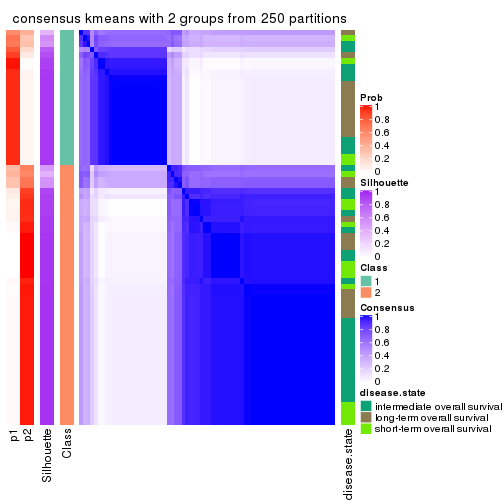</p>

</div>
<div id='tab-CV-kmeans-consensus-heatmap-2'>
<pre><code class="r">consensus_heatmap(res, k = 3)
</code></pre>

<p></p>

</div>
<div id='tab-CV-kmeans-consensus-heatmap-3'>
<pre><code class="r">consensus_heatmap(res, k = 4)
</code></pre>

<p></p>

</div>
<div id='tab-CV-kmeans-consensus-heatmap-4'>
<pre><code class="r">consensus_heatmap(res, k = 5)
</code></pre>

<p></p>

</div>
<div id='tab-CV-kmeans-consensus-heatmap-5'>
<pre><code class="r">consensus_heatmap(res, k = 6)
</code></pre>

<p></p>

</div>
</div>

Heatmaps for the membership of samples in all partitions to see how consistent they are:


<script>
$( function() {
	$( '#tabs-CV-kmeans-membership-heatmap' ).tabs();
} );
</script>
<div id='tabs-CV-kmeans-membership-heatmap'>
<ul>
<li><a href='#tab-CV-kmeans-membership-heatmap-1'>k = 2</a></li>
<li><a href='#tab-CV-kmeans-membership-heatmap-2'>k = 3</a></li>
<li><a href='#tab-CV-kmeans-membership-heatmap-3'>k = 4</a></li>
<li><a href='#tab-CV-kmeans-membership-heatmap-4'>k = 5</a></li>
<li><a href='#tab-CV-kmeans-membership-heatmap-5'>k = 6</a></li>
</ul>
<div id='tab-CV-kmeans-membership-heatmap-1'>
<pre><code class="r">membership_heatmap(res, k = 2)
</code></pre>

<p></p>

</div>
<div id='tab-CV-kmeans-membership-heatmap-2'>
<pre><code class="r">membership_heatmap(res, k = 3)
</code></pre>

<p></p>

</div>
<div id='tab-CV-kmeans-membership-heatmap-3'>
<pre><code class="r">membership_heatmap(res, k = 4)
</code></pre>

<p></p>

</div>
<div id='tab-CV-kmeans-membership-heatmap-4'>
<pre><code class="r">membership_heatmap(res, k = 5)
</code></pre>

<p></p>

</div>
<div id='tab-CV-kmeans-membership-heatmap-5'>
<pre><code class="r">membership_heatmap(res, k = 6)
</code></pre>

<p></p>

</div>
</div>

As soon as we have had the classes for columns, we can look for signatures
which are significantly different between classes which can be candidate marks
for certain classes. Following are the heatmaps for signatures.


Signature heatmaps where rows are scaled:


<script>
$( function() {
	$( '#tabs-CV-kmeans-get-signatures' ).tabs();
} );
</script>
<div id='tabs-CV-kmeans-get-signatures'>
<ul>
<li><a href='#tab-CV-kmeans-get-signatures-1'>k = 2</a></li>
<li><a href='#tab-CV-kmeans-get-signatures-2'>k = 3</a></li>
<li><a href='#tab-CV-kmeans-get-signatures-3'>k = 4</a></li>
<li><a href='#tab-CV-kmeans-get-signatures-4'>k = 5</a></li>
<li><a href='#tab-CV-kmeans-get-signatures-5'>k = 6</a></li>
</ul>
<div id='tab-CV-kmeans-get-signatures-1'>
<pre><code class="r">get_signatures(res, k = 2)
</code></pre>

<p></p>

</div>
<div id='tab-CV-kmeans-get-signatures-2'>
<pre><code class="r">get_signatures(res, k = 3)
</code></pre>

<p></p>

</div>
<div id='tab-CV-kmeans-get-signatures-3'>
<pre><code class="r">get_signatures(res, k = 4)
</code></pre>

<p></p>

</div>
<div id='tab-CV-kmeans-get-signatures-4'>
<pre><code class="r">get_signatures(res, k = 5)
</code></pre>

<p></p>

</div>
<div id='tab-CV-kmeans-get-signatures-5'>
<pre><code class="r">get_signatures(res, k = 6)
</code></pre>

<p></p>

</div>
</div>


Signature heatmaps where rows are not scaled:


<script>
$( function() {
	$( '#tabs-CV-kmeans-get-signatures-no-scale' ).tabs();
} );
</script>
<div id='tabs-CV-kmeans-get-signatures-no-scale'>
<ul>
<li><a href='#tab-CV-kmeans-get-signatures-no-scale-1'>k = 2</a></li>
<li><a href='#tab-CV-kmeans-get-signatures-no-scale-2'>k = 3</a></li>
<li><a href='#tab-CV-kmeans-get-signatures-no-scale-3'>k = 4</a></li>
<li><a href='#tab-CV-kmeans-get-signatures-no-scale-4'>k = 5</a></li>
<li><a href='#tab-CV-kmeans-get-signatures-no-scale-5'>k = 6</a></li>
</ul>
<div id='tab-CV-kmeans-get-signatures-no-scale-1'>
<pre><code class="r">get_signatures(res, k = 2, scale_rows = FALSE)
</code></pre>

<p></p>

</div>
<div id='tab-CV-kmeans-get-signatures-no-scale-2'>
<pre><code class="r">get_signatures(res, k = 3, scale_rows = FALSE)
</code></pre>

<p></p>

</div>
<div id='tab-CV-kmeans-get-signatures-no-scale-3'>
<pre><code class="r">get_signatures(res, k = 4, scale_rows = FALSE)
</code></pre>

<p></p>

</div>
<div id='tab-CV-kmeans-get-signatures-no-scale-4'>
<pre><code class="r">get_signatures(res, k = 5, scale_rows = FALSE)
</code></pre>

<p></p>

</div>
<div id='tab-CV-kmeans-get-signatures-no-scale-5'>
<pre><code class="r">get_signatures(res, k = 6, scale_rows = FALSE)
</code></pre>

<p></p>

</div>
</div>


Compare the overlap of signatures from different k:

```r
compare_signatures(res)
```


`get_signature()` returns a data frame invisibly. TO get the list of signatures, the function
call should be assigned to a variable explicitly. In following code, if `plot` argument is set
to `FALSE`, no heatmap is plotted while only the differential analysis is performed.

```r
# code only for demonstration
tb = get_signature(res, k = ..., plot = FALSE)
```

An example of the output of `tb` is:

```
#>   which_row         fdr    mean_1    mean_2 scaled_mean_1 scaled_mean_2 km
#> 1        38 0.042760348  8.373488  9.131774    -0.5533452     0.5164555  1
#> 2        40 0.018707592  7.106213  8.469186    -0.6173731     0.5762149  1
#> 3        55 0.019134737 10.221463 11.207825    -0.6159697     0.5749050  1
#> 4        59 0.006059896  5.921854  7.869574    -0.6899429     0.6439467  1
#> 5        60 0.018055526  8.928898 10.211722    -0.6204761     0.5791110  1
#> 6        98 0.009384629 15.714769 14.887706     0.6635654    -0.6193277  2
...
```

The columns in `tb` are:

1. `which_row`: row indices corresponding to the input matrix.
2. `fdr`: FDR for the differential test. 
3. `mean_x`: The mean value in group x.
4. `scaled_mean_x`: The mean value in group x after rows are scaled.
5. `km`: Row groups if k-means clustering is applied to rows.


UMAP plot which shows how samples are separated.


<script>
$( function() {
	$( '#tabs-CV-kmeans-dimension-reduction' ).tabs();
} );
</script>
<div id='tabs-CV-kmeans-dimension-reduction'>
<ul>
<li><a href='#tab-CV-kmeans-dimension-reduction-1'>k = 2</a></li>
<li><a href='#tab-CV-kmeans-dimension-reduction-2'>k = 3</a></li>
<li><a href='#tab-CV-kmeans-dimension-reduction-3'>k = 4</a></li>
<li><a href='#tab-CV-kmeans-dimension-reduction-4'>k = 5</a></li>
<li><a href='#tab-CV-kmeans-dimension-reduction-5'>k = 6</a></li>
</ul>
<div id='tab-CV-kmeans-dimension-reduction-1'>
<pre><code class="r">dimension_reduction(res, k = 2, method = &quot;UMAP&quot;)
</code></pre>

<p></p>

</div>
<div id='tab-CV-kmeans-dimension-reduction-2'>
<pre><code class="r">dimension_reduction(res, k = 3, method = &quot;UMAP&quot;)
</code></pre>

<p></p>

</div>
<div id='tab-CV-kmeans-dimension-reduction-3'>
<pre><code class="r">dimension_reduction(res, k = 4, method = &quot;UMAP&quot;)
</code></pre>

<p></p>

</div>
<div id='tab-CV-kmeans-dimension-reduction-4'>
<pre><code class="r">dimension_reduction(res, k = 5, method = &quot;UMAP&quot;)
</code></pre>

<p></p>

</div>
<div id='tab-CV-kmeans-dimension-reduction-5'>
<pre><code class="r">dimension_reduction(res, k = 6, method = &quot;UMAP&quot;)
</code></pre>

<p></p>

</div>
</div>


Following heatmap shows how subgroups are split when increasing `k`:

```r
collect_classes(res)
```


Test correlation between subgroups and known annotations. If the known
annotation is numeric, one-way ANOVA test is applied, and if the known
annotation is discrete, chi-squared contingency table test is applied.

```r
test_to_known_factors(res)
```

```
#>            n disease.state(p) k
#> CV:kmeans 68           0.1492 2
#> CV:kmeans 44           0.0987 3
#> CV:kmeans 33           0.5883 4
#> CV:kmeans 61           0.0379 5
#> CV:kmeans 64           0.0666 6
```


If matrix rows can be associated to genes, consider to use `GO_Enrichment(res,
...)` to perform function enrichment for the signature genes.


 

---------------------------------------------------


### CV:skmeans**


The object with results only for a single top-value method and a single partition method 
can be extracted as:

```r
res = res_list["CV", "skmeans"]
# you can also extract it by
# res = res_list["CV:skmeans"]
```

A summary of `res` and all the functions that can be applied to it:

```r
res
```

```
#> A 'ConsensusPartition' object with k = 2, 3, 4, 5, 6.
#>   On a matrix with 51941 rows and 70 columns.
#>   Top rows (1000, 2000, 3000, 4000, 5000) are extracted by 'CV' method.
#>   Subgroups are detected by 'skmeans' method.
#>   Performed in total 1250 partitions by row resampling.
#>   Best k for subgroups seems to be 2.
#> 
#> Following methods can be applied to this 'ConsensusPartition' object:
#>  [1] "cola_report"             "collect_classes"         "collect_plots"          
#>  [4] "collect_stats"           "colnames"                "compare_signatures"     
#>  [7] "consensus_heatmap"       "dimension_reduction"     "functional_enrichment"  
#> [10] "get_anno_col"            "get_anno"                "get_classes"            
#> [13] "get_consensus"           "get_matrix"              "get_membership"         
#> [16] "get_param"               "get_signatures"          "get_stats"              
#> [19] "is_best_k"               "is_stable_k"             "membership_heatmap"     
#> [22] "ncol"                    "nrow"                    "plot_ecdf"              
#> [25] "rownames"                "select_partition_number" "show"                   
#> [28] "suggest_best_k"          "test_to_known_factors"
```

`collect_plots()` function collects all the plots made from `res` for all `k` (number of partitions)
into one single page to provide an easy and fast comparison between different `k`.

```r
collect_plots(res)
```


The plots are:

- The first row: a plot of the ECDF (Empirical cumulative distribution
  function) curves of the consensus matrix for each `k` and the heatmap of
  predicted classes for each `k`.
- The second row: heatmaps of the consensus matrix for each `k`.
- The third row: heatmaps of the membership matrix for each `k`.
- The fouth row: heatmaps of the signatures for each `k`.

All the plots in panels can be made by individual functions and they are
plotted later in this section.

`select_partition_number()` produces several plots showing different
statistics for choosing "optimized" `k`. There are following statistics:

- ECDF curves of the consensus matrix for each `k`;
- 1-PAC. [The PAC
  score](https://en.wikipedia.org/wiki/Consensus_clustering#Over-interpretation_potential_of_consensus_clustering)
  measures the proportion of the ambiguous subgrouping.
- Mean silhouette score.
- Concordance. The mean probability of fiting the consensus class ids in all
  partitions.
- Area increased. Denote $A_k$ as the area under the ECDF curve for current
  `k`, the area increased is defined as $A_k - A_{k-1}$.
- Rand index. The percent of pairs of samples that are both in a same cluster
  or both are not in a same cluster in the partition of k and k-1.
- Jaccard index. The ratio of pairs of samples are both in a same cluster in
  the partition of k and k-1 and the pairs of samples are both in a same
  cluster in the partition k or k-1.

The detailed explanations of these statistics can be found in [the cola
vignette](http://bioconductor.org/packages/devel/bioc/vignettes/cola/inst/doc/cola.html#toc_13).

Generally speaking, lower PAC score, higher mean silhouette score or higher
concordance corresponds to better partition. Rand index and Jaccard index
measure how similar the current partition is compared to partition with `k-1`.
If they are too similar, we won't accept `k` is better than `k-1`.

```r
select_partition_number(res)
```


The numeric values for all these statistics can be obtained by `get_stats()`.

```r
get_stats(res)
```

```
#>   k 1-PAC mean_silhouette concordance area_increased  Rand Jaccard
#> 2 2 1.000           0.966       0.986         0.4998 0.499   0.499
#> 3 3 0.615           0.735       0.868         0.3285 0.756   0.547
#> 4 4 0.659           0.666       0.809         0.1228 0.825   0.542
#> 5 5 0.696           0.698       0.821         0.0687 0.940   0.769
#> 6 6 0.741           0.628       0.791         0.0465 0.916   0.624
```

`suggest_best_k()` suggests the best $k$ based on these statistics. The rules are as follows:

- All $k$ with Jaccard index larger than 0.95 are removed because the increase of
  the partition number does not provides enough extra information. If all $k$ are removed,
  the best $k$ is assigned by `NA`.
- For $k$ with 1-PAC larger than 0.9, the maximal $k$ is taken as the "best k". Other $k$ is called "optional k".
- If it does not fit the second rule. The $k$ with the highest vote of highest
  1-PAC, mean silhouette and concordance is taken as the "best k".

```r
suggest_best_k(res)
```

```
#> [1] 2
```


Following shows the table of the partitions (You need to click the **show/hide
code output** link to see it). The membership matrix (columns with name `p*`)
is inferred by
[`clue::cl_consensus()`](https://www.rdocumentation.org/link/cl_consensus?package=clue)
function with the `SE` method. Basically the value in the membership matrix
represents the probability to belong to a certain group. The finall class
label for an item is determined with the group with highest probability it
belongs to.

In `get_classes()` function, the entropy is calculated from the membership
matrix and the silhouette score is calculated from the consensus matrix.


<script>
$( function() {
	$( '#tabs-CV-skmeans-get-classes' ).tabs();
} );
</script>
<div id='tabs-CV-skmeans-get-classes'>
<ul>
<li><a href='#tab-CV-skmeans-get-classes-1'>k = 2</a></li>
<li><a href='#tab-CV-skmeans-get-classes-2'>k = 3</a></li>
<li><a href='#tab-CV-skmeans-get-classes-3'>k = 4</a></li>
<li><a href='#tab-CV-skmeans-get-classes-4'>k = 5</a></li>
<li><a href='#tab-CV-skmeans-get-classes-5'>k = 6</a></li>
</ul>

<div id='tab-CV-skmeans-get-classes-1'>
<p><a id='tab-CV-skmeans-get-classes-1-a' style='color:#0366d6' href='#'>show/hide code output</a></p>
<pre><code class="r">cbind(get_classes(res, k = 2), get_membership(res, k = 2))
</code></pre>

<pre><code>#&gt;            class entropy silhouette    p1    p2
#&gt; GSM1299517     2   0.000      0.991 0.000 1.000
#&gt; GSM1299518     2   0.000      0.991 0.000 1.000
#&gt; GSM1299519     2   0.000      0.991 0.000 1.000
#&gt; GSM1299520     1   0.000      0.977 1.000 0.000
#&gt; GSM1299521     1   0.000      0.977 1.000 0.000
#&gt; GSM1299522     2   0.000      0.991 0.000 1.000
#&gt; GSM1299523     1   0.000      0.977 1.000 0.000
#&gt; GSM1299524     2   0.416      0.903 0.084 0.916
#&gt; GSM1299525     2   0.000      0.991 0.000 1.000
#&gt; GSM1299526     2   0.000      0.991 0.000 1.000
#&gt; GSM1299527     2   0.000      0.991 0.000 1.000
#&gt; GSM1299528     2   0.000      0.991 0.000 1.000
#&gt; GSM1299529     2   0.000      0.991 0.000 1.000
#&gt; GSM1299530     1   0.000      0.977 1.000 0.000
#&gt; GSM1299531     2   0.000      0.991 0.000 1.000
#&gt; GSM1299575     1   0.000      0.977 1.000 0.000
#&gt; GSM1299532     2   0.000      0.991 0.000 1.000
#&gt; GSM1299533     1   0.000      0.977 1.000 0.000
#&gt; GSM1299534     2   0.000      0.991 0.000 1.000
#&gt; GSM1299535     2   0.000      0.991 0.000 1.000
#&gt; GSM1299536     1   0.000      0.977 1.000 0.000
#&gt; GSM1299537     2   0.000      0.991 0.000 1.000
#&gt; GSM1299538     1   0.184      0.952 0.972 0.028
#&gt; GSM1299539     1   0.971      0.354 0.600 0.400
#&gt; GSM1299540     2   0.795      0.677 0.240 0.760
#&gt; GSM1299541     2   0.000      0.991 0.000 1.000
#&gt; GSM1299542     2   0.000      0.991 0.000 1.000
#&gt; GSM1299543     2   0.000      0.991 0.000 1.000
#&gt; GSM1299544     2   0.000      0.991 0.000 1.000
#&gt; GSM1299545     1   0.000      0.977 1.000 0.000
#&gt; GSM1299546     2   0.000      0.991 0.000 1.000
#&gt; GSM1299547     1   0.000      0.977 1.000 0.000
#&gt; GSM1299548     2   0.000      0.991 0.000 1.000
#&gt; GSM1299549     1   0.000      0.977 1.000 0.000
#&gt; GSM1299550     1   0.795      0.684 0.760 0.240
#&gt; GSM1299551     2   0.000      0.991 0.000 1.000
#&gt; GSM1299552     1   0.000      0.977 1.000 0.000
#&gt; GSM1299553     1   0.000      0.977 1.000 0.000
#&gt; GSM1299554     2   0.000      0.991 0.000 1.000
#&gt; GSM1299555     2   0.000      0.991 0.000 1.000
#&gt; GSM1299556     2   0.000      0.991 0.000 1.000
#&gt; GSM1299557     2   0.000      0.991 0.000 1.000
#&gt; GSM1299558     2   0.000      0.991 0.000 1.000
#&gt; GSM1299559     2   0.000      0.991 0.000 1.000
#&gt; GSM1299560     2   0.000      0.991 0.000 1.000
#&gt; GSM1299576     1   0.000      0.977 1.000 0.000
#&gt; GSM1299577     1   0.000      0.977 1.000 0.000
#&gt; GSM1299561     2   0.000      0.991 0.000 1.000
#&gt; GSM1299562     2   0.000      0.991 0.000 1.000
#&gt; GSM1299563     1   0.000      0.977 1.000 0.000
#&gt; GSM1299564     1   0.000      0.977 1.000 0.000
#&gt; GSM1299565     2   0.000      0.991 0.000 1.000
#&gt; GSM1299566     2   0.000      0.991 0.000 1.000
#&gt; GSM1299567     1   0.000      0.977 1.000 0.000
#&gt; GSM1299568     2   0.000      0.991 0.000 1.000
#&gt; GSM1299569     2   0.000      0.991 0.000 1.000
#&gt; GSM1299570     1   0.000      0.977 1.000 0.000
#&gt; GSM1299571     2   0.000      0.991 0.000 1.000
#&gt; GSM1299572     1   0.000      0.977 1.000 0.000
#&gt; GSM1299573     2   0.000      0.991 0.000 1.000
#&gt; GSM1299574     2   0.000      0.991 0.000 1.000
#&gt; GSM1299578     1   0.000      0.977 1.000 0.000
#&gt; GSM1299579     1   0.000      0.977 1.000 0.000
#&gt; GSM1299580     1   0.000      0.977 1.000 0.000
#&gt; GSM1299581     1   0.000      0.977 1.000 0.000
#&gt; GSM1299582     1   0.000      0.977 1.000 0.000
#&gt; GSM1299583     1   0.000      0.977 1.000 0.000
#&gt; GSM1299584     1   0.000      0.977 1.000 0.000
#&gt; GSM1299585     1   0.000      0.977 1.000 0.000
#&gt; GSM1299586     1   0.000      0.977 1.000 0.000
</code></pre>

<script>
$('#tab-CV-skmeans-get-classes-1-a').parent().next().next().hide();
$('#tab-CV-skmeans-get-classes-1-a').click(function(){
  $('#tab-CV-skmeans-get-classes-1-a').parent().next().next().toggle();
  return(false);
});
</script>
</div>

<div id='tab-CV-skmeans-get-classes-2'>
<p><a id='tab-CV-skmeans-get-classes-2-a' style='color:#0366d6' href='#'>show/hide code output</a></p>
<pre><code class="r">cbind(get_classes(res, k = 3), get_membership(res, k = 3))
</code></pre>

<pre><code>#&gt;            class entropy silhouette    p1    p2    p3
#&gt; GSM1299517     3  0.0000     0.7583 0.000 0.000 1.000
#&gt; GSM1299518     2  0.5835     0.5788 0.000 0.660 0.340
#&gt; GSM1299519     2  0.4121     0.7902 0.000 0.832 0.168
#&gt; GSM1299520     1  0.3551     0.8848 0.868 0.132 0.000
#&gt; GSM1299521     1  0.1163     0.9383 0.972 0.028 0.000
#&gt; GSM1299522     2  0.4121     0.7902 0.000 0.832 0.168
#&gt; GSM1299523     1  0.4293     0.8565 0.832 0.164 0.004
#&gt; GSM1299524     3  0.3678     0.6750 0.080 0.028 0.892
#&gt; GSM1299525     2  0.1163     0.7599 0.000 0.972 0.028
#&gt; GSM1299526     2  0.4399     0.7770 0.000 0.812 0.188
#&gt; GSM1299527     3  0.0592     0.7531 0.000 0.012 0.988
#&gt; GSM1299528     3  0.6168     0.3563 0.000 0.412 0.588
#&gt; GSM1299529     2  0.1289     0.7620 0.000 0.968 0.032
#&gt; GSM1299530     1  0.3482     0.8869 0.872 0.128 0.000
#&gt; GSM1299531     3  0.6215     0.2926 0.000 0.428 0.572
#&gt; GSM1299575     1  0.0000     0.9454 1.000 0.000 0.000
#&gt; GSM1299532     3  0.0000     0.7583 0.000 0.000 1.000
#&gt; GSM1299533     1  0.2116     0.9259 0.948 0.040 0.012
#&gt; GSM1299534     3  0.5465     0.5454 0.000 0.288 0.712
#&gt; GSM1299535     3  0.4605     0.5875 0.000 0.204 0.796
#&gt; GSM1299536     1  0.1163     0.9383 0.972 0.028 0.000
#&gt; GSM1299537     3  0.0000     0.7583 0.000 0.000 1.000
#&gt; GSM1299538     2  0.6595     0.5583 0.180 0.744 0.076
#&gt; GSM1299539     2  0.1525     0.7394 0.032 0.964 0.004
#&gt; GSM1299540     2  0.7657     0.0929 0.044 0.508 0.448
#&gt; GSM1299541     3  0.0000     0.7583 0.000 0.000 1.000
#&gt; GSM1299542     3  0.0000     0.7583 0.000 0.000 1.000
#&gt; GSM1299543     2  0.4062     0.7856 0.000 0.836 0.164
#&gt; GSM1299544     3  0.5859     0.4730 0.000 0.344 0.656
#&gt; GSM1299545     1  0.3038     0.9015 0.896 0.104 0.000
#&gt; GSM1299546     2  0.4121     0.7902 0.000 0.832 0.168
#&gt; GSM1299547     1  0.1163     0.9383 0.972 0.028 0.000
#&gt; GSM1299548     3  0.0000     0.7583 0.000 0.000 1.000
#&gt; GSM1299549     1  0.4172     0.8850 0.840 0.156 0.004
#&gt; GSM1299550     3  0.8971     0.3446 0.336 0.144 0.520
#&gt; GSM1299551     2  0.4002     0.7879 0.000 0.840 0.160
#&gt; GSM1299552     1  0.1163     0.9383 0.972 0.028 0.000
#&gt; GSM1299553     2  0.6095     0.1459 0.392 0.608 0.000
#&gt; GSM1299554     3  0.0592     0.7543 0.000 0.012 0.988
#&gt; GSM1299555     3  0.3941     0.6220 0.000 0.156 0.844
#&gt; GSM1299556     3  0.0000     0.7583 0.000 0.000 1.000
#&gt; GSM1299557     2  0.2165     0.7597 0.000 0.936 0.064
#&gt; GSM1299558     3  0.6267     0.2424 0.000 0.452 0.548
#&gt; GSM1299559     3  0.1964     0.7187 0.000 0.056 0.944
#&gt; GSM1299560     3  0.0000     0.7583 0.000 0.000 1.000
#&gt; GSM1299576     1  0.0000     0.9454 1.000 0.000 0.000
#&gt; GSM1299577     1  0.0000     0.9454 1.000 0.000 0.000
#&gt; GSM1299561     3  0.0000     0.7583 0.000 0.000 1.000
#&gt; GSM1299562     2  0.2860     0.7345 0.004 0.912 0.084
#&gt; GSM1299563     1  0.3965     0.8811 0.860 0.132 0.008
#&gt; GSM1299564     1  0.7043     0.7445 0.728 0.136 0.136
#&gt; GSM1299565     2  0.4121     0.7902 0.000 0.832 0.168
#&gt; GSM1299566     3  0.6192     0.3450 0.000 0.420 0.580
#&gt; GSM1299567     3  0.8996     0.1070 0.356 0.140 0.504
#&gt; GSM1299568     3  0.6045     0.4112 0.000 0.380 0.620
#&gt; GSM1299569     3  0.5591     0.5291 0.000 0.304 0.696
#&gt; GSM1299570     1  0.3551     0.8848 0.868 0.132 0.000
#&gt; GSM1299571     2  0.4178     0.7884 0.000 0.828 0.172
#&gt; GSM1299572     1  0.1163     0.9383 0.972 0.028 0.000
#&gt; GSM1299573     3  0.0000     0.7583 0.000 0.000 1.000
#&gt; GSM1299574     2  0.4121     0.7902 0.000 0.832 0.168
#&gt; GSM1299578     1  0.0000     0.9454 1.000 0.000 0.000
#&gt; GSM1299579     1  0.0000     0.9454 1.000 0.000 0.000
#&gt; GSM1299580     1  0.0000     0.9454 1.000 0.000 0.000
#&gt; GSM1299581     1  0.0000     0.9454 1.000 0.000 0.000
#&gt; GSM1299582     1  0.0000     0.9454 1.000 0.000 0.000
#&gt; GSM1299583     1  0.0000     0.9454 1.000 0.000 0.000
#&gt; GSM1299584     1  0.0000     0.9454 1.000 0.000 0.000
#&gt; GSM1299585     1  0.1163     0.9383 0.972 0.028 0.000
#&gt; GSM1299586     1  0.0000     0.9454 1.000 0.000 0.000
</code></pre>

<script>
$('#tab-CV-skmeans-get-classes-2-a').parent().next().next().hide();
$('#tab-CV-skmeans-get-classes-2-a').click(function(){
  $('#tab-CV-skmeans-get-classes-2-a').parent().next().next().toggle();
  return(false);
});
</script>
</div>

<div id='tab-CV-skmeans-get-classes-3'>
<p><a id='tab-CV-skmeans-get-classes-3-a' style='color:#0366d6' href='#'>show/hide code output</a></p>
<pre><code class="r">cbind(get_classes(res, k = 4), get_membership(res, k = 4))
</code></pre>

<pre><code>#&gt;            class entropy silhouette    p1    p2    p3    p4
#&gt; GSM1299517     3  0.0469     0.8348 0.000 0.012 0.988 0.000
#&gt; GSM1299518     2  0.3266     0.7309 0.000 0.832 0.168 0.000
#&gt; GSM1299519     2  0.0921     0.8402 0.000 0.972 0.028 0.000
#&gt; GSM1299520     1  0.2197     0.6102 0.928 0.024 0.000 0.048
#&gt; GSM1299521     4  0.0336     0.8141 0.008 0.000 0.000 0.992
#&gt; GSM1299522     2  0.1118     0.8394 0.000 0.964 0.036 0.000
#&gt; GSM1299523     1  0.2115     0.6083 0.936 0.024 0.004 0.036
#&gt; GSM1299524     4  0.5573     0.2678 0.012 0.008 0.396 0.584
#&gt; GSM1299525     2  0.2654     0.7907 0.108 0.888 0.004 0.000
#&gt; GSM1299526     2  0.1389     0.8356 0.000 0.952 0.048 0.000
#&gt; GSM1299527     3  0.1576     0.8158 0.004 0.048 0.948 0.000
#&gt; GSM1299528     3  0.6969     0.4445 0.112 0.308 0.572 0.008
#&gt; GSM1299529     2  0.2266     0.8026 0.084 0.912 0.004 0.000
#&gt; GSM1299530     1  0.3946     0.5995 0.812 0.020 0.000 0.168
#&gt; GSM1299531     2  0.5721     0.0589 0.020 0.548 0.428 0.004
#&gt; GSM1299575     1  0.5016     0.6469 0.600 0.004 0.000 0.396
#&gt; GSM1299532     3  0.0000     0.8375 0.000 0.000 1.000 0.000
#&gt; GSM1299533     4  0.0336     0.8110 0.000 0.008 0.000 0.992
#&gt; GSM1299534     3  0.4989     0.6823 0.036 0.200 0.756 0.008
#&gt; GSM1299535     3  0.4644     0.6451 0.024 0.228 0.748 0.000
#&gt; GSM1299536     4  0.1302     0.7888 0.044 0.000 0.000 0.956
#&gt; GSM1299537     3  0.0000     0.8375 0.000 0.000 1.000 0.000
#&gt; GSM1299538     1  0.2940     0.5485 0.892 0.088 0.008 0.012
#&gt; GSM1299539     2  0.4761     0.5767 0.332 0.664 0.000 0.004
#&gt; GSM1299540     1  0.6906     0.0859 0.484 0.108 0.408 0.000
#&gt; GSM1299541     3  0.0592     0.8341 0.000 0.016 0.984 0.000
#&gt; GSM1299542     3  0.0000     0.8375 0.000 0.000 1.000 0.000
#&gt; GSM1299543     2  0.1610     0.8367 0.016 0.952 0.032 0.000
#&gt; GSM1299544     3  0.6202     0.5631 0.072 0.268 0.652 0.008
#&gt; GSM1299545     1  0.4214     0.6506 0.780 0.016 0.000 0.204
#&gt; GSM1299546     2  0.1022     0.8402 0.000 0.968 0.032 0.000
#&gt; GSM1299547     4  0.0336     0.8141 0.008 0.000 0.000 0.992
#&gt; GSM1299548     3  0.0000     0.8375 0.000 0.000 1.000 0.000
#&gt; GSM1299549     4  0.3806     0.6693 0.156 0.020 0.000 0.824
#&gt; GSM1299550     4  0.6650     0.4938 0.176 0.000 0.200 0.624
#&gt; GSM1299551     2  0.0921     0.8402 0.000 0.972 0.028 0.000
#&gt; GSM1299552     4  0.0592     0.8102 0.016 0.000 0.000 0.984
#&gt; GSM1299553     1  0.6061     0.1984 0.552 0.400 0.000 0.048
#&gt; GSM1299554     3  0.0927     0.8328 0.016 0.000 0.976 0.008
#&gt; GSM1299555     3  0.4485     0.6937 0.052 0.152 0.796 0.000
#&gt; GSM1299556     3  0.0188     0.8373 0.000 0.004 0.996 0.000
#&gt; GSM1299557     2  0.3525     0.7807 0.100 0.860 0.040 0.000
#&gt; GSM1299558     2  0.5943    -0.0917 0.028 0.504 0.464 0.004
#&gt; GSM1299559     3  0.3048     0.7508 0.108 0.016 0.876 0.000
#&gt; GSM1299560     3  0.0188     0.8373 0.000 0.004 0.996 0.000
#&gt; GSM1299576     1  0.5039     0.6430 0.592 0.004 0.000 0.404
#&gt; GSM1299577     1  0.4855     0.6528 0.644 0.004 0.000 0.352
#&gt; GSM1299561     3  0.0000     0.8375 0.000 0.000 1.000 0.000
#&gt; GSM1299562     2  0.7927     0.4522 0.160 0.576 0.056 0.208
#&gt; GSM1299563     1  0.3658     0.5751 0.836 0.020 0.000 0.144
#&gt; GSM1299564     1  0.3470     0.5700 0.884 0.024 0.040 0.052
#&gt; GSM1299565     2  0.1118     0.8394 0.000 0.964 0.036 0.000
#&gt; GSM1299566     3  0.7141     0.3882 0.120 0.328 0.544 0.008
#&gt; GSM1299567     1  0.4323     0.5027 0.776 0.020 0.204 0.000
#&gt; GSM1299568     3  0.5905     0.4842 0.036 0.332 0.624 0.008
#&gt; GSM1299569     3  0.5914     0.6195 0.072 0.228 0.692 0.008
#&gt; GSM1299570     1  0.2335     0.6191 0.920 0.020 0.000 0.060
#&gt; GSM1299571     2  0.1118     0.8399 0.000 0.964 0.036 0.000
#&gt; GSM1299572     4  0.0336     0.8141 0.008 0.000 0.000 0.992
#&gt; GSM1299573     3  0.0188     0.8371 0.004 0.000 0.996 0.000
#&gt; GSM1299574     2  0.0921     0.8402 0.000 0.972 0.028 0.000
#&gt; GSM1299578     1  0.5028     0.6456 0.596 0.004 0.000 0.400
#&gt; GSM1299579     1  0.5097     0.6149 0.568 0.004 0.000 0.428
#&gt; GSM1299580     1  0.5016     0.6469 0.600 0.004 0.000 0.396
#&gt; GSM1299581     1  0.5039     0.6430 0.592 0.004 0.000 0.404
#&gt; GSM1299582     1  0.5028     0.6456 0.596 0.004 0.000 0.400
#&gt; GSM1299583     1  0.5119     0.5983 0.556 0.004 0.000 0.440
#&gt; GSM1299584     1  0.5028     0.6456 0.596 0.004 0.000 0.400
#&gt; GSM1299585     4  0.0336     0.8141 0.008 0.000 0.000 0.992
#&gt; GSM1299586     1  0.5039     0.6430 0.592 0.004 0.000 0.404
</code></pre>

<script>
$('#tab-CV-skmeans-get-classes-3-a').parent().next().next().hide();
$('#tab-CV-skmeans-get-classes-3-a').click(function(){
  $('#tab-CV-skmeans-get-classes-3-a').parent().next().next().toggle();
  return(false);
});
</script>
</div>

<div id='tab-CV-skmeans-get-classes-4'>
<p><a id='tab-CV-skmeans-get-classes-4-a' style='color:#0366d6' href='#'>show/hide code output</a></p>
<pre><code class="r">cbind(get_classes(res, k = 5), get_membership(res, k = 5))
</code></pre>

<pre><code>#&gt;            class entropy silhouette    p1    p2    p3    p4    p5
#&gt; GSM1299517     3  0.1461     0.7890 0.000 0.016 0.952 0.028 0.004
#&gt; GSM1299518     2  0.1704     0.7438 0.000 0.928 0.068 0.000 0.004
#&gt; GSM1299519     2  0.0000     0.7744 0.000 1.000 0.000 0.000 0.000
#&gt; GSM1299520     4  0.4106     0.6886 0.256 0.000 0.000 0.724 0.020
#&gt; GSM1299521     5  0.2020     0.9125 0.100 0.000 0.000 0.000 0.900
#&gt; GSM1299522     2  0.0566     0.7746 0.000 0.984 0.012 0.004 0.000
#&gt; GSM1299523     4  0.3492     0.7131 0.188 0.000 0.000 0.796 0.016
#&gt; GSM1299524     5  0.2445     0.8044 0.004 0.000 0.108 0.004 0.884
#&gt; GSM1299525     2  0.4851     0.4785 0.000 0.624 0.000 0.340 0.036
#&gt; GSM1299526     2  0.0162     0.7754 0.000 0.996 0.004 0.000 0.000
#&gt; GSM1299527     3  0.1934     0.7802 0.000 0.020 0.932 0.040 0.008
#&gt; GSM1299528     3  0.7181     0.5100 0.000 0.124 0.528 0.264 0.084
#&gt; GSM1299529     2  0.4326     0.5829 0.000 0.708 0.000 0.264 0.028
#&gt; GSM1299530     4  0.5288     0.6710 0.244 0.000 0.000 0.656 0.100
#&gt; GSM1299531     2  0.7059     0.0952 0.000 0.492 0.332 0.112 0.064
#&gt; GSM1299575     1  0.0000     0.9438 1.000 0.000 0.000 0.000 0.000
#&gt; GSM1299532     3  0.0324     0.7937 0.000 0.000 0.992 0.004 0.004
#&gt; GSM1299533     5  0.2112     0.9139 0.084 0.000 0.004 0.004 0.908
#&gt; GSM1299534     3  0.5969     0.6393 0.000 0.144 0.676 0.128 0.052
#&gt; GSM1299535     3  0.5933     0.4827 0.000 0.268 0.612 0.104 0.016
#&gt; GSM1299536     5  0.1809     0.9026 0.060 0.000 0.000 0.012 0.928
#&gt; GSM1299537     3  0.0771     0.7894 0.000 0.000 0.976 0.020 0.004
#&gt; GSM1299538     4  0.1928     0.6769 0.072 0.000 0.004 0.920 0.004
#&gt; GSM1299539     4  0.4605     0.2435 0.000 0.248 0.004 0.708 0.040
#&gt; GSM1299540     4  0.7750     0.2734 0.096 0.132 0.356 0.412 0.004
#&gt; GSM1299541     3  0.1830     0.7794 0.000 0.052 0.932 0.012 0.004
#&gt; GSM1299542     3  0.0162     0.7936 0.000 0.000 0.996 0.000 0.004
#&gt; GSM1299543     2  0.3980     0.7044 0.000 0.824 0.056 0.092 0.028
#&gt; GSM1299544     3  0.6833     0.5694 0.000 0.124 0.588 0.208 0.080
#&gt; GSM1299545     1  0.4770     0.2430 0.644 0.000 0.000 0.320 0.036
#&gt; GSM1299546     2  0.0162     0.7754 0.000 0.996 0.004 0.000 0.000
#&gt; GSM1299547     5  0.2068     0.9150 0.092 0.000 0.000 0.004 0.904
#&gt; GSM1299548     3  0.0290     0.7923 0.000 0.000 0.992 0.008 0.000
#&gt; GSM1299549     5  0.5344     0.6041 0.092 0.004 0.000 0.244 0.660
#&gt; GSM1299550     5  0.2628     0.7937 0.000 0.000 0.028 0.088 0.884
#&gt; GSM1299551     2  0.0912     0.7693 0.000 0.972 0.000 0.016 0.012
#&gt; GSM1299552     5  0.2068     0.9115 0.092 0.000 0.000 0.004 0.904
#&gt; GSM1299553     4  0.7230     0.2922 0.344 0.216 0.000 0.412 0.028
#&gt; GSM1299554     3  0.2077     0.7813 0.000 0.000 0.920 0.040 0.040
#&gt; GSM1299555     3  0.5240     0.5492 0.000 0.228 0.676 0.092 0.004
#&gt; GSM1299556     3  0.1243     0.7880 0.000 0.008 0.960 0.028 0.004
#&gt; GSM1299557     2  0.5804     0.4798 0.000 0.604 0.044 0.312 0.040
#&gt; GSM1299558     2  0.7351    -0.1428 0.000 0.404 0.396 0.132 0.068
#&gt; GSM1299559     3  0.3554     0.5851 0.004 0.000 0.776 0.216 0.004
#&gt; GSM1299560     3  0.1952     0.7710 0.000 0.084 0.912 0.004 0.000
#&gt; GSM1299576     1  0.0162     0.9430 0.996 0.000 0.000 0.000 0.004
#&gt; GSM1299577     1  0.1121     0.8979 0.956 0.000 0.000 0.044 0.000
#&gt; GSM1299561     3  0.0000     0.7934 0.000 0.000 1.000 0.000 0.000
#&gt; GSM1299562     2  0.6460     0.0454 0.000 0.448 0.008 0.404 0.140
#&gt; GSM1299563     4  0.5261     0.6930 0.200 0.000 0.012 0.696 0.092
#&gt; GSM1299564     4  0.4575     0.7087 0.196 0.000 0.024 0.748 0.032
#&gt; GSM1299565     2  0.0912     0.7720 0.000 0.972 0.012 0.016 0.000
#&gt; GSM1299566     3  0.7391     0.4503 0.000 0.124 0.476 0.312 0.088
#&gt; GSM1299567     4  0.6116     0.5864 0.268 0.000 0.156 0.572 0.004
#&gt; GSM1299568     3  0.6862     0.5411 0.000 0.188 0.584 0.160 0.068
#&gt; GSM1299569     3  0.6532     0.6025 0.000 0.124 0.624 0.180 0.072
#&gt; GSM1299570     4  0.4290     0.6493 0.304 0.000 0.000 0.680 0.016
#&gt; GSM1299571     2  0.0451     0.7752 0.000 0.988 0.008 0.004 0.000
#&gt; GSM1299572     5  0.2068     0.9150 0.092 0.000 0.000 0.004 0.904
#&gt; GSM1299573     3  0.0798     0.7941 0.000 0.000 0.976 0.008 0.016
#&gt; GSM1299574     2  0.0000     0.7744 0.000 1.000 0.000 0.000 0.000
#&gt; GSM1299578     1  0.0000     0.9438 1.000 0.000 0.000 0.000 0.000
#&gt; GSM1299579     1  0.0898     0.9257 0.972 0.000 0.000 0.008 0.020
#&gt; GSM1299580     1  0.0000     0.9438 1.000 0.000 0.000 0.000 0.000
#&gt; GSM1299581     1  0.0162     0.9430 0.996 0.000 0.000 0.000 0.004
#&gt; GSM1299582     1  0.0000     0.9438 1.000 0.000 0.000 0.000 0.000
#&gt; GSM1299583     1  0.0703     0.9243 0.976 0.000 0.000 0.000 0.024
#&gt; GSM1299584     1  0.0162     0.9430 0.996 0.000 0.000 0.000 0.004
#&gt; GSM1299585     5  0.2020     0.9125 0.100 0.000 0.000 0.000 0.900
#&gt; GSM1299586     1  0.0000     0.9438 1.000 0.000 0.000 0.000 0.000
</code></pre>

<script>
$('#tab-CV-skmeans-get-classes-4-a').parent().next().next().hide();
$('#tab-CV-skmeans-get-classes-4-a').click(function(){
  $('#tab-CV-skmeans-get-classes-4-a').parent().next().next().toggle();
  return(false);
});
</script>
</div>

<div id='tab-CV-skmeans-get-classes-5'>
<p><a id='tab-CV-skmeans-get-classes-5-a' style='color:#0366d6' href='#'>show/hide code output</a></p>
<pre><code class="r">cbind(get_classes(res, k = 6), get_membership(res, k = 6))
</code></pre>

<pre><code>#&gt;            class entropy silhouette    p1    p2    p3    p4    p5    p6
#&gt; GSM1299517     3  0.2680    0.71439 0.000 0.000 0.856 0.016 0.004 0.124
#&gt; GSM1299518     2  0.2451    0.77506 0.000 0.892 0.076 0.012 0.004 0.016
#&gt; GSM1299519     2  0.0547    0.84495 0.000 0.980 0.000 0.000 0.000 0.020
#&gt; GSM1299520     4  0.2617    0.75285 0.100 0.000 0.000 0.872 0.016 0.012
#&gt; GSM1299521     5  0.1075    0.90858 0.048 0.000 0.000 0.000 0.952 0.000
#&gt; GSM1299522     2  0.0865    0.84241 0.000 0.964 0.000 0.000 0.000 0.036
#&gt; GSM1299523     4  0.2375    0.74563 0.060 0.000 0.000 0.896 0.008 0.036
#&gt; GSM1299524     5  0.3381    0.79344 0.004 0.004 0.088 0.004 0.836 0.064
#&gt; GSM1299525     6  0.6252    0.09038 0.000 0.336 0.004 0.156 0.024 0.480
#&gt; GSM1299526     2  0.0551    0.84806 0.000 0.984 0.004 0.004 0.000 0.008
#&gt; GSM1299527     3  0.4069    0.58761 0.000 0.004 0.740 0.028 0.012 0.216
#&gt; GSM1299528     6  0.5441    0.27813 0.000 0.044 0.348 0.032 0.008 0.568
#&gt; GSM1299529     6  0.5969   -0.02425 0.000 0.408 0.000 0.120 0.024 0.448
#&gt; GSM1299530     4  0.3536    0.74301 0.116 0.000 0.000 0.812 0.064 0.008
#&gt; GSM1299531     2  0.5962   -0.13070 0.000 0.416 0.188 0.000 0.004 0.392
#&gt; GSM1299575     1  0.0405    0.93151 0.988 0.000 0.000 0.004 0.000 0.008
#&gt; GSM1299532     3  0.1053    0.74932 0.000 0.000 0.964 0.012 0.004 0.020
#&gt; GSM1299533     5  0.1152    0.90750 0.044 0.004 0.000 0.000 0.952 0.000
#&gt; GSM1299534     3  0.5303    0.00164 0.000 0.060 0.528 0.008 0.008 0.396
#&gt; GSM1299535     3  0.7239    0.22262 0.000 0.208 0.460 0.084 0.016 0.232
#&gt; GSM1299536     5  0.1082    0.90649 0.040 0.000 0.000 0.000 0.956 0.004
#&gt; GSM1299537     3  0.1485    0.74646 0.000 0.000 0.944 0.024 0.004 0.028
#&gt; GSM1299538     4  0.3240    0.65148 0.008 0.004 0.004 0.816 0.008 0.160
#&gt; GSM1299539     6  0.5401   -0.00136 0.000 0.080 0.000 0.332 0.020 0.568
#&gt; GSM1299540     4  0.7275    0.35706 0.052 0.124 0.280 0.488 0.008 0.048
#&gt; GSM1299541     3  0.2488    0.73250 0.000 0.076 0.888 0.016 0.000 0.020
#&gt; GSM1299542     3  0.0937    0.74231 0.000 0.000 0.960 0.000 0.000 0.040
#&gt; GSM1299543     2  0.4056    0.56365 0.000 0.704 0.024 0.008 0.000 0.264
#&gt; GSM1299544     6  0.5258    0.22753 0.000 0.044 0.392 0.016 0.008 0.540
#&gt; GSM1299545     1  0.5898    0.22179 0.540 0.000 0.000 0.316 0.036 0.108
#&gt; GSM1299546     2  0.0260    0.85052 0.000 0.992 0.000 0.000 0.000 0.008
#&gt; GSM1299547     5  0.1075    0.90858 0.048 0.000 0.000 0.000 0.952 0.000
#&gt; GSM1299548     3  0.0976    0.75083 0.000 0.000 0.968 0.008 0.008 0.016
#&gt; GSM1299549     5  0.6188    0.38272 0.048 0.004 0.000 0.256 0.560 0.132
#&gt; GSM1299550     5  0.2655    0.82357 0.000 0.000 0.020 0.012 0.872 0.096
#&gt; GSM1299551     2  0.1501    0.80922 0.000 0.924 0.000 0.000 0.000 0.076
#&gt; GSM1299552     5  0.2024    0.88537 0.036 0.000 0.000 0.016 0.920 0.028
#&gt; GSM1299553     6  0.7477   -0.00131 0.192 0.100 0.000 0.240 0.024 0.444
#&gt; GSM1299554     3  0.3192    0.67308 0.000 0.004 0.844 0.016 0.028 0.108
#&gt; GSM1299555     3  0.6409    0.38075 0.000 0.248 0.540 0.152 0.004 0.056
#&gt; GSM1299556     3  0.2222    0.73913 0.000 0.012 0.912 0.040 0.004 0.032
#&gt; GSM1299557     6  0.6893    0.12118 0.000 0.312 0.056 0.132 0.024 0.476
#&gt; GSM1299558     6  0.6014    0.24605 0.000 0.292 0.236 0.004 0.000 0.468
#&gt; GSM1299559     3  0.4372    0.41167 0.000 0.000 0.652 0.308 0.004 0.036
#&gt; GSM1299560     3  0.3339    0.67396 0.000 0.144 0.816 0.012 0.000 0.028
#&gt; GSM1299576     1  0.0000    0.93387 1.000 0.000 0.000 0.000 0.000 0.000
#&gt; GSM1299577     1  0.1908    0.84614 0.900 0.000 0.000 0.096 0.000 0.004
#&gt; GSM1299561     3  0.1296    0.74188 0.000 0.004 0.948 0.004 0.000 0.044
#&gt; GSM1299562     4  0.7193    0.12676 0.000 0.376 0.024 0.396 0.092 0.112
#&gt; GSM1299563     4  0.5125    0.69330 0.076 0.000 0.012 0.728 0.100 0.084
#&gt; GSM1299564     4  0.3943    0.71800 0.040 0.000 0.036 0.816 0.020 0.088
#&gt; GSM1299565     2  0.1327    0.82525 0.000 0.936 0.000 0.000 0.000 0.064
#&gt; GSM1299566     6  0.5604    0.28698 0.000 0.040 0.324 0.052 0.008 0.576
#&gt; GSM1299567     4  0.4868    0.66147 0.124 0.000 0.136 0.712 0.000 0.028
#&gt; GSM1299568     6  0.5466    0.17352 0.000 0.072 0.416 0.008 0.008 0.496
#&gt; GSM1299569     6  0.5343    0.18937 0.000 0.048 0.412 0.016 0.008 0.516
#&gt; GSM1299570     4  0.2846    0.74306 0.140 0.000 0.000 0.840 0.016 0.004
#&gt; GSM1299571     2  0.0260    0.85060 0.000 0.992 0.000 0.000 0.000 0.008
#&gt; GSM1299572     5  0.1075    0.90858 0.048 0.000 0.000 0.000 0.952 0.000
#&gt; GSM1299573     3  0.2205    0.70928 0.000 0.008 0.896 0.004 0.004 0.088
#&gt; GSM1299574     2  0.0508    0.84806 0.000 0.984 0.004 0.000 0.000 0.012
#&gt; GSM1299578     1  0.0260    0.93298 0.992 0.000 0.000 0.000 0.000 0.008
#&gt; GSM1299579     1  0.1196    0.90334 0.952 0.000 0.000 0.008 0.040 0.000
#&gt; GSM1299580     1  0.0405    0.93151 0.988 0.000 0.000 0.004 0.000 0.008
#&gt; GSM1299581     1  0.0000    0.93387 1.000 0.000 0.000 0.000 0.000 0.000
#&gt; GSM1299582     1  0.0000    0.93387 1.000 0.000 0.000 0.000 0.000 0.000
#&gt; GSM1299583     1  0.0865    0.91007 0.964 0.000 0.000 0.000 0.036 0.000
#&gt; GSM1299584     1  0.0000    0.93387 1.000 0.000 0.000 0.000 0.000 0.000
#&gt; GSM1299585     5  0.1075    0.90858 0.048 0.000 0.000 0.000 0.952 0.000
#&gt; GSM1299586     1  0.0146    0.93352 0.996 0.000 0.000 0.000 0.000 0.004
</code></pre>

<script>
$('#tab-CV-skmeans-get-classes-5-a').parent().next().next().hide();
$('#tab-CV-skmeans-get-classes-5-a').click(function(){
  $('#tab-CV-skmeans-get-classes-5-a').parent().next().next().toggle();
  return(false);
});
</script>
</div>
</div>

Heatmaps for the consensus matrix. It visualizes the probability of two
samples to be in a same group.


<script>
$( function() {
	$( '#tabs-CV-skmeans-consensus-heatmap' ).tabs();
} );
</script>
<div id='tabs-CV-skmeans-consensus-heatmap'>
<ul>
<li><a href='#tab-CV-skmeans-consensus-heatmap-1'>k = 2</a></li>
<li><a href='#tab-CV-skmeans-consensus-heatmap-2'>k = 3</a></li>
<li><a href='#tab-CV-skmeans-consensus-heatmap-3'>k = 4</a></li>
<li><a href='#tab-CV-skmeans-consensus-heatmap-4'>k = 5</a></li>
<li><a href='#tab-CV-skmeans-consensus-heatmap-5'>k = 6</a></li>
</ul>
<div id='tab-CV-skmeans-consensus-heatmap-1'>
<pre><code class="r">consensus_heatmap(res, k = 2)
</code></pre>

<p></p>

</div>
<div id='tab-CV-skmeans-consensus-heatmap-2'>
<pre><code class="r">consensus_heatmap(res, k = 3)
</code></pre>

<p></p>

</div>
<div id='tab-CV-skmeans-consensus-heatmap-3'>
<pre><code class="r">consensus_heatmap(res, k = 4)
</code></pre>

<p></p>

</div>
<div id='tab-CV-skmeans-consensus-heatmap-4'>
<pre><code class="r">consensus_heatmap(res, k = 5)
</code></pre>

<p></p>

</div>
<div id='tab-CV-skmeans-consensus-heatmap-5'>
<pre><code class="r">consensus_heatmap(res, k = 6)
</code></pre>

<p></p>

</div>
</div>

Heatmaps for the membership of samples in all partitions to see how consistent they are:


<script>
$( function() {
	$( '#tabs-CV-skmeans-membership-heatmap' ).tabs();
} );
</script>
<div id='tabs-CV-skmeans-membership-heatmap'>
<ul>
<li><a href='#tab-CV-skmeans-membership-heatmap-1'>k = 2</a></li>
<li><a href='#tab-CV-skmeans-membership-heatmap-2'>k = 3</a></li>
<li><a href='#tab-CV-skmeans-membership-heatmap-3'>k = 4</a></li>
<li><a href='#tab-CV-skmeans-membership-heatmap-4'>k = 5</a></li>
<li><a href='#tab-CV-skmeans-membership-heatmap-5'>k = 6</a></li>
</ul>
<div id='tab-CV-skmeans-membership-heatmap-1'>
<pre><code class="r">membership_heatmap(res, k = 2)
</code></pre>

<p></p>

</div>
<div id='tab-CV-skmeans-membership-heatmap-2'>
<pre><code class="r">membership_heatmap(res, k = 3)
</code></pre>

<p></p>

</div>
<div id='tab-CV-skmeans-membership-heatmap-3'>
<pre><code class="r">membership_heatmap(res, k = 4)
</code></pre>

<p></p>

</div>
<div id='tab-CV-skmeans-membership-heatmap-4'>
<pre><code class="r">membership_heatmap(res, k = 5)
</code></pre>

<p></p>

</div>
<div id='tab-CV-skmeans-membership-heatmap-5'>
<pre><code class="r">membership_heatmap(res, k = 6)
</code></pre>

<p></p>

</div>
</div>

As soon as we have had the classes for columns, we can look for signatures
which are significantly different between classes which can be candidate marks
for certain classes. Following are the heatmaps for signatures.


Signature heatmaps where rows are scaled:


<script>
$( function() {
	$( '#tabs-CV-skmeans-get-signatures' ).tabs();
} );
</script>
<div id='tabs-CV-skmeans-get-signatures'>
<ul>
<li><a href='#tab-CV-skmeans-get-signatures-1'>k = 2</a></li>
<li><a href='#tab-CV-skmeans-get-signatures-2'>k = 3</a></li>
<li><a href='#tab-CV-skmeans-get-signatures-3'>k = 4</a></li>
<li><a href='#tab-CV-skmeans-get-signatures-4'>k = 5</a></li>
<li><a href='#tab-CV-skmeans-get-signatures-5'>k = 6</a></li>
</ul>
<div id='tab-CV-skmeans-get-signatures-1'>
<pre><code class="r">get_signatures(res, k = 2)
</code></pre>

<p></p>

</div>
<div id='tab-CV-skmeans-get-signatures-2'>
<pre><code class="r">get_signatures(res, k = 3)
</code></pre>

<p></p>

</div>
<div id='tab-CV-skmeans-get-signatures-3'>
<pre><code class="r">get_signatures(res, k = 4)
</code></pre>

<p></p>

</div>
<div id='tab-CV-skmeans-get-signatures-4'>
<pre><code class="r">get_signatures(res, k = 5)
</code></pre>

<p></p>

</div>
<div id='tab-CV-skmeans-get-signatures-5'>
<pre><code class="r">get_signatures(res, k = 6)
</code></pre>

<p></p>

</div>
</div>


Signature heatmaps where rows are not scaled:


<script>
$( function() {
	$( '#tabs-CV-skmeans-get-signatures-no-scale' ).tabs();
} );
</script>
<div id='tabs-CV-skmeans-get-signatures-no-scale'>
<ul>
<li><a href='#tab-CV-skmeans-get-signatures-no-scale-1'>k = 2</a></li>
<li><a href='#tab-CV-skmeans-get-signatures-no-scale-2'>k = 3</a></li>
<li><a href='#tab-CV-skmeans-get-signatures-no-scale-3'>k = 4</a></li>
<li><a href='#tab-CV-skmeans-get-signatures-no-scale-4'>k = 5</a></li>
<li><a href='#tab-CV-skmeans-get-signatures-no-scale-5'>k = 6</a></li>
</ul>
<div id='tab-CV-skmeans-get-signatures-no-scale-1'>
<pre><code class="r">get_signatures(res, k = 2, scale_rows = FALSE)
</code></pre>

<p></p>

</div>
<div id='tab-CV-skmeans-get-signatures-no-scale-2'>
<pre><code class="r">get_signatures(res, k = 3, scale_rows = FALSE)
</code></pre>

<p></p>

</div>
<div id='tab-CV-skmeans-get-signatures-no-scale-3'>
<pre><code class="r">get_signatures(res, k = 4, scale_rows = FALSE)
</code></pre>

<p>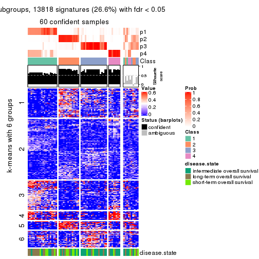</p>

</div>
<div id='tab-CV-skmeans-get-signatures-no-scale-4'>
<pre><code class="r">get_signatures(res, k = 5, scale_rows = FALSE)
</code></pre>

<p></p>

</div>
<div id='tab-CV-skmeans-get-signatures-no-scale-5'>
<pre><code class="r">get_signatures(res, k = 6, scale_rows = FALSE)
</code></pre>

<p></p>

</div>
</div>


Compare the overlap of signatures from different k:

```r
compare_signatures(res)
```


`get_signature()` returns a data frame invisibly. TO get the list of signatures, the function
call should be assigned to a variable explicitly. In following code, if `plot` argument is set
to `FALSE`, no heatmap is plotted while only the differential analysis is performed.

```r
# code only for demonstration
tb = get_signature(res, k = ..., plot = FALSE)
```

An example of the output of `tb` is:

```
#>   which_row         fdr    mean_1    mean_2 scaled_mean_1 scaled_mean_2 km
#> 1        38 0.042760348  8.373488  9.131774    -0.5533452     0.5164555  1
#> 2        40 0.018707592  7.106213  8.469186    -0.6173731     0.5762149  1
#> 3        55 0.019134737 10.221463 11.207825    -0.6159697     0.5749050  1
#> 4        59 0.006059896  5.921854  7.869574    -0.6899429     0.6439467  1
#> 5        60 0.018055526  8.928898 10.211722    -0.6204761     0.5791110  1
#> 6        98 0.009384629 15.714769 14.887706     0.6635654    -0.6193277  2
...
```

The columns in `tb` are:

1. `which_row`: row indices corresponding to the input matrix.
2. `fdr`: FDR for the differential test. 
3. `mean_x`: The mean value in group x.
4. `scaled_mean_x`: The mean value in group x after rows are scaled.
5. `km`: Row groups if k-means clustering is applied to rows.


UMAP plot which shows how samples are separated.


<script>
$( function() {
	$( '#tabs-CV-skmeans-dimension-reduction' ).tabs();
} );
</script>
<div id='tabs-CV-skmeans-dimension-reduction'>
<ul>
<li><a href='#tab-CV-skmeans-dimension-reduction-1'>k = 2</a></li>
<li><a href='#tab-CV-skmeans-dimension-reduction-2'>k = 3</a></li>
<li><a href='#tab-CV-skmeans-dimension-reduction-3'>k = 4</a></li>
<li><a href='#tab-CV-skmeans-dimension-reduction-4'>k = 5</a></li>
<li><a href='#tab-CV-skmeans-dimension-reduction-5'>k = 6</a></li>
</ul>
<div id='tab-CV-skmeans-dimension-reduction-1'>
<pre><code class="r">dimension_reduction(res, k = 2, method = &quot;UMAP&quot;)
</code></pre>

<p></p>

</div>
<div id='tab-CV-skmeans-dimension-reduction-2'>
<pre><code class="r">dimension_reduction(res, k = 3, method = &quot;UMAP&quot;)
</code></pre>

<p></p>

</div>
<div id='tab-CV-skmeans-dimension-reduction-3'>
<pre><code class="r">dimension_reduction(res, k = 4, method = &quot;UMAP&quot;)
</code></pre>

<p>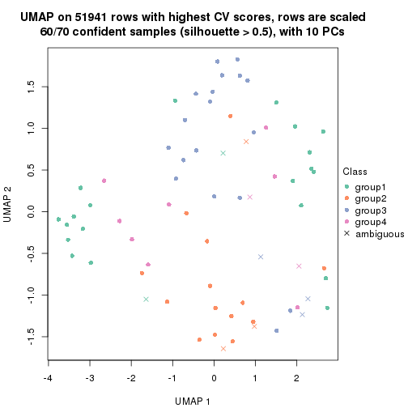</p>

</div>
<div id='tab-CV-skmeans-dimension-reduction-4'>
<pre><code class="r">dimension_reduction(res, k = 5, method = &quot;UMAP&quot;)
</code></pre>

<p></p>

</div>
<div id='tab-CV-skmeans-dimension-reduction-5'>
<pre><code class="r">dimension_reduction(res, k = 6, method = &quot;UMAP&quot;)
</code></pre>

<p>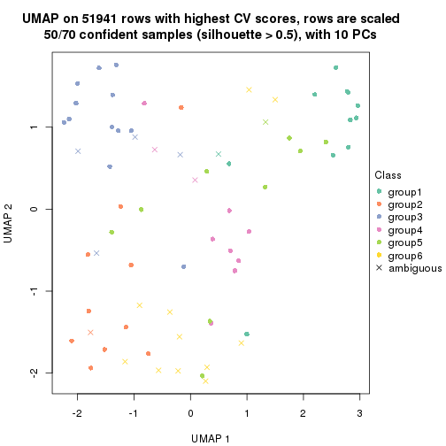</p>

</div>
</div>


Following heatmap shows how subgroups are split when increasing `k`:

```r
collect_classes(res)
```


Test correlation between subgroups and known annotations. If the known
annotation is numeric, one-way ANOVA test is applied, and if the known
annotation is discrete, chi-squared contingency table test is applied.

```r
test_to_known_factors(res)
```

```
#>             n disease.state(p) k
#> CV:skmeans 69          0.11244 2
#> CV:skmeans 60          0.05535 3
#> CV:skmeans 60          0.00842 4
#> CV:skmeans 59          0.02252 5
#> CV:skmeans 50          0.05988 6
```


If matrix rows can be associated to genes, consider to use `GO_Enrichment(res,
...)` to perform function enrichment for the signature genes.


 

---------------------------------------------------


### CV:pam


The object with results only for a single top-value method and a single partition method 
can be extracted as:

```r
res = res_list["CV", "pam"]
# you can also extract it by
# res = res_list["CV:pam"]
```

A summary of `res` and all the functions that can be applied to it:

```r
res
```

```
#> A 'ConsensusPartition' object with k = 2, 3, 4, 5, 6.
#>   On a matrix with 51941 rows and 70 columns.
#>   Top rows (1000, 2000, 3000, 4000, 5000) are extracted by 'CV' method.
#>   Subgroups are detected by 'pam' method.
#>   Performed in total 1250 partitions by row resampling.
#>   Best k for subgroups seems to be 5.
#> 
#> Following methods can be applied to this 'ConsensusPartition' object:
#>  [1] "cola_report"             "collect_classes"         "collect_plots"          
#>  [4] "collect_stats"           "colnames"                "compare_signatures"     
#>  [7] "consensus_heatmap"       "dimension_reduction"     "functional_enrichment"  
#> [10] "get_anno_col"            "get_anno"                "get_classes"            
#> [13] "get_consensus"           "get_matrix"              "get_membership"         
#> [16] "get_param"               "get_signatures"          "get_stats"              
#> [19] "is_best_k"               "is_stable_k"             "membership_heatmap"     
#> [22] "ncol"                    "nrow"                    "plot_ecdf"              
#> [25] "rownames"                "select_partition_number" "show"                   
#> [28] "suggest_best_k"          "test_to_known_factors"
```

`collect_plots()` function collects all the plots made from `res` for all `k` (number of partitions)
into one single page to provide an easy and fast comparison between different `k`.

```r
collect_plots(res)
```


The plots are:

- The first row: a plot of the ECDF (Empirical cumulative distribution
  function) curves of the consensus matrix for each `k` and the heatmap of
  predicted classes for each `k`.
- The second row: heatmaps of the consensus matrix for each `k`.
- The third row: heatmaps of the membership matrix for each `k`.
- The fouth row: heatmaps of the signatures for each `k`.

All the plots in panels can be made by individual functions and they are
plotted later in this section.

`select_partition_number()` produces several plots showing different
statistics for choosing "optimized" `k`. There are following statistics:

- ECDF curves of the consensus matrix for each `k`;
- 1-PAC. [The PAC
  score](https://en.wikipedia.org/wiki/Consensus_clustering#Over-interpretation_potential_of_consensus_clustering)
  measures the proportion of the ambiguous subgrouping.
- Mean silhouette score.
- Concordance. The mean probability of fiting the consensus class ids in all
  partitions.
- Area increased. Denote $A_k$ as the area under the ECDF curve for current
  `k`, the area increased is defined as $A_k - A_{k-1}$.
- Rand index. The percent of pairs of samples that are both in a same cluster
  or both are not in a same cluster in the partition of k and k-1.
- Jaccard index. The ratio of pairs of samples are both in a same cluster in
  the partition of k and k-1 and the pairs of samples are both in a same
  cluster in the partition k or k-1.

The detailed explanations of these statistics can be found in [the cola
vignette](http://bioconductor.org/packages/devel/bioc/vignettes/cola/inst/doc/cola.html#toc_13).

Generally speaking, lower PAC score, higher mean silhouette score or higher
concordance corresponds to better partition. Rand index and Jaccard index
measure how similar the current partition is compared to partition with `k-1`.
If they are too similar, we won't accept `k` is better than `k-1`.

```r
select_partition_number(res)
```


The numeric values for all these statistics can be obtained by `get_stats()`.

```r
get_stats(res)
```

```
#>   k 1-PAC mean_silhouette concordance area_increased  Rand Jaccard
#> 2 2 0.826           0.907       0.958         0.3636 0.612   0.612
#> 3 3 0.503           0.692       0.832         0.5185 0.789   0.665
#> 4 4 0.662           0.732       0.838         0.2205 0.800   0.566
#> 5 5 0.770           0.773       0.895         0.0844 0.924   0.751
#> 6 6 0.715           0.696       0.850         0.0541 0.973   0.889
```

`suggest_best_k()` suggests the best $k$ based on these statistics. The rules are as follows:

- All $k$ with Jaccard index larger than 0.95 are removed because the increase of
  the partition number does not provides enough extra information. If all $k$ are removed,
  the best $k$ is assigned by `NA`.
- For $k$ with 1-PAC larger than 0.9, the maximal $k$ is taken as the "best k". Other $k$ is called "optional k".
- If it does not fit the second rule. The $k$ with the highest vote of highest
  1-PAC, mean silhouette and concordance is taken as the "best k".

```r
suggest_best_k(res)
```

```
#> [1] 5
```


Following shows the table of the partitions (You need to click the **show/hide
code output** link to see it). The membership matrix (columns with name `p*`)
is inferred by
[`clue::cl_consensus()`](https://www.rdocumentation.org/link/cl_consensus?package=clue)
function with the `SE` method. Basically the value in the membership matrix
represents the probability to belong to a certain group. The finall class
label for an item is determined with the group with highest probability it
belongs to.

In `get_classes()` function, the entropy is calculated from the membership
matrix and the silhouette score is calculated from the consensus matrix.


<script>
$( function() {
	$( '#tabs-CV-pam-get-classes' ).tabs();
} );
</script>
<div id='tabs-CV-pam-get-classes'>
<ul>
<li><a href='#tab-CV-pam-get-classes-1'>k = 2</a></li>
<li><a href='#tab-CV-pam-get-classes-2'>k = 3</a></li>
<li><a href='#tab-CV-pam-get-classes-3'>k = 4</a></li>
<li><a href='#tab-CV-pam-get-classes-4'>k = 5</a></li>
<li><a href='#tab-CV-pam-get-classes-5'>k = 6</a></li>
</ul>

<div id='tab-CV-pam-get-classes-1'>
<p><a id='tab-CV-pam-get-classes-1-a' style='color:#0366d6' href='#'>show/hide code output</a></p>
<pre><code class="r">cbind(get_classes(res, k = 2), get_membership(res, k = 2))
</code></pre>

<pre><code>#&gt;            class entropy silhouette    p1    p2
#&gt; GSM1299517     2  0.0000      0.983 0.000 1.000
#&gt; GSM1299518     2  0.0000      0.983 0.000 1.000
#&gt; GSM1299519     2  0.0000      0.983 0.000 1.000
#&gt; GSM1299520     2  0.0000      0.983 0.000 1.000
#&gt; GSM1299521     1  0.0000      0.866 1.000 0.000
#&gt; GSM1299522     2  0.0000      0.983 0.000 1.000
#&gt; GSM1299523     2  0.0000      0.983 0.000 1.000
#&gt; GSM1299524     2  0.0000      0.983 0.000 1.000
#&gt; GSM1299525     2  0.0000      0.983 0.000 1.000
#&gt; GSM1299526     2  0.0000      0.983 0.000 1.000
#&gt; GSM1299527     2  0.0000      0.983 0.000 1.000
#&gt; GSM1299528     2  0.0000      0.983 0.000 1.000
#&gt; GSM1299529     2  0.0000      0.983 0.000 1.000
#&gt; GSM1299530     1  0.9686      0.476 0.604 0.396
#&gt; GSM1299531     2  0.0000      0.983 0.000 1.000
#&gt; GSM1299575     1  0.9988      0.254 0.520 0.480
#&gt; GSM1299532     2  0.0000      0.983 0.000 1.000
#&gt; GSM1299533     2  0.8386      0.577 0.268 0.732
#&gt; GSM1299534     2  0.0000      0.983 0.000 1.000
#&gt; GSM1299535     2  0.0000      0.983 0.000 1.000
#&gt; GSM1299536     1  0.9170      0.580 0.668 0.332
#&gt; GSM1299537     2  0.0000      0.983 0.000 1.000
#&gt; GSM1299538     2  0.0000      0.983 0.000 1.000
#&gt; GSM1299539     2  0.0000      0.983 0.000 1.000
#&gt; GSM1299540     2  0.0000      0.983 0.000 1.000
#&gt; GSM1299541     2  0.0000      0.983 0.000 1.000
#&gt; GSM1299542     2  0.0000      0.983 0.000 1.000
#&gt; GSM1299543     2  0.0000      0.983 0.000 1.000
#&gt; GSM1299544     2  0.0000      0.983 0.000 1.000
#&gt; GSM1299545     2  0.5294      0.833 0.120 0.880
#&gt; GSM1299546     2  0.0000      0.983 0.000 1.000
#&gt; GSM1299547     1  0.4939      0.835 0.892 0.108
#&gt; GSM1299548     2  0.0000      0.983 0.000 1.000
#&gt; GSM1299549     2  0.2778      0.929 0.048 0.952
#&gt; GSM1299550     2  0.0000      0.983 0.000 1.000
#&gt; GSM1299551     2  0.0000      0.983 0.000 1.000
#&gt; GSM1299552     1  0.0672      0.866 0.992 0.008
#&gt; GSM1299553     2  0.0000      0.983 0.000 1.000
#&gt; GSM1299554     2  0.0000      0.983 0.000 1.000
#&gt; GSM1299555     2  0.0000      0.983 0.000 1.000
#&gt; GSM1299556     2  0.0000      0.983 0.000 1.000
#&gt; GSM1299557     2  0.0000      0.983 0.000 1.000
#&gt; GSM1299558     2  0.0000      0.983 0.000 1.000
#&gt; GSM1299559     2  0.0000      0.983 0.000 1.000
#&gt; GSM1299560     2  0.0000      0.983 0.000 1.000
#&gt; GSM1299576     1  0.0000      0.866 1.000 0.000
#&gt; GSM1299577     1  0.9996      0.232 0.512 0.488
#&gt; GSM1299561     2  0.0000      0.983 0.000 1.000
#&gt; GSM1299562     2  0.0000      0.983 0.000 1.000
#&gt; GSM1299563     2  0.0000      0.983 0.000 1.000
#&gt; GSM1299564     2  0.0000      0.983 0.000 1.000
#&gt; GSM1299565     2  0.0000      0.983 0.000 1.000
#&gt; GSM1299566     2  0.0000      0.983 0.000 1.000
#&gt; GSM1299567     2  0.0000      0.983 0.000 1.000
#&gt; GSM1299568     2  0.0000      0.983 0.000 1.000
#&gt; GSM1299569     2  0.0000      0.983 0.000 1.000
#&gt; GSM1299570     2  0.9044      0.419 0.320 0.680
#&gt; GSM1299571     2  0.0000      0.983 0.000 1.000
#&gt; GSM1299572     1  0.5059      0.833 0.888 0.112
#&gt; GSM1299573     2  0.0000      0.983 0.000 1.000
#&gt; GSM1299574     2  0.0000      0.983 0.000 1.000
#&gt; GSM1299578     1  0.3274      0.861 0.940 0.060
#&gt; GSM1299579     1  0.0000      0.866 1.000 0.000
#&gt; GSM1299580     1  0.4690      0.843 0.900 0.100
#&gt; GSM1299581     1  0.0000      0.866 1.000 0.000
#&gt; GSM1299582     1  0.3274      0.861 0.940 0.060
#&gt; GSM1299583     1  0.0000      0.866 1.000 0.000
#&gt; GSM1299584     1  0.0000      0.866 1.000 0.000
#&gt; GSM1299585     1  0.0000      0.866 1.000 0.000
#&gt; GSM1299586     1  0.3114      0.862 0.944 0.056
</code></pre>

<script>
$('#tab-CV-pam-get-classes-1-a').parent().next().next().hide();
$('#tab-CV-pam-get-classes-1-a').click(function(){
  $('#tab-CV-pam-get-classes-1-a').parent().next().next().toggle();
  return(false);
});
</script>
</div>

<div id='tab-CV-pam-get-classes-2'>
<p><a id='tab-CV-pam-get-classes-2-a' style='color:#0366d6' href='#'>show/hide code output</a></p>
<pre><code class="r">cbind(get_classes(res, k = 3), get_membership(res, k = 3))
</code></pre>

<pre><code>#&gt;            class entropy silhouette    p1    p2    p3
#&gt; GSM1299517     3  0.0237     0.7976 0.000 0.004 0.996
#&gt; GSM1299518     3  0.5465     0.1803 0.000 0.288 0.712
#&gt; GSM1299519     2  0.5905     0.9043 0.000 0.648 0.352
#&gt; GSM1299520     3  0.4164     0.7052 0.008 0.144 0.848
#&gt; GSM1299521     1  0.4702     0.8185 0.788 0.212 0.000
#&gt; GSM1299522     2  0.5926     0.9061 0.000 0.644 0.356
#&gt; GSM1299523     3  0.3686     0.7111 0.000 0.140 0.860
#&gt; GSM1299524     3  0.0892     0.7950 0.000 0.020 0.980
#&gt; GSM1299525     3  0.6299    -0.6378 0.000 0.476 0.524
#&gt; GSM1299526     2  0.5988     0.8998 0.000 0.632 0.368
#&gt; GSM1299527     3  0.0592     0.7975 0.000 0.012 0.988
#&gt; GSM1299528     3  0.1031     0.7928 0.000 0.024 0.976
#&gt; GSM1299529     2  0.6244     0.8162 0.000 0.560 0.440
#&gt; GSM1299530     1  0.9177     0.0505 0.452 0.148 0.400
#&gt; GSM1299531     3  0.4235     0.5446 0.000 0.176 0.824
#&gt; GSM1299575     1  0.5722     0.5179 0.704 0.004 0.292
#&gt; GSM1299532     3  0.0424     0.7982 0.000 0.008 0.992
#&gt; GSM1299533     3  0.9489     0.0205 0.280 0.228 0.492
#&gt; GSM1299534     3  0.1753     0.7665 0.000 0.048 0.952
#&gt; GSM1299535     3  0.0592     0.7971 0.000 0.012 0.988
#&gt; GSM1299536     1  0.8758     0.6322 0.588 0.220 0.192
#&gt; GSM1299537     3  0.0000     0.7983 0.000 0.000 1.000
#&gt; GSM1299538     3  0.3752     0.7111 0.000 0.144 0.856
#&gt; GSM1299539     2  0.6235     0.3950 0.000 0.564 0.436
#&gt; GSM1299540     3  0.0237     0.7983 0.000 0.004 0.996
#&gt; GSM1299541     3  0.0237     0.7986 0.000 0.004 0.996
#&gt; GSM1299542     3  0.0592     0.7974 0.000 0.012 0.988
#&gt; GSM1299543     2  0.6309     0.6610 0.000 0.504 0.496
#&gt; GSM1299544     3  0.0892     0.7938 0.000 0.020 0.980
#&gt; GSM1299545     3  0.8587     0.3639 0.260 0.148 0.592
#&gt; GSM1299546     2  0.5926     0.9061 0.000 0.644 0.356
#&gt; GSM1299547     1  0.5643     0.8116 0.760 0.220 0.020
#&gt; GSM1299548     3  0.0000     0.7983 0.000 0.000 1.000
#&gt; GSM1299549     3  0.2301     0.7605 0.060 0.004 0.936
#&gt; GSM1299550     3  0.3116     0.7553 0.000 0.108 0.892
#&gt; GSM1299551     2  0.5948     0.9009 0.000 0.640 0.360
#&gt; GSM1299552     1  0.5156     0.8168 0.776 0.216 0.008
#&gt; GSM1299553     3  0.4953     0.6876 0.016 0.176 0.808
#&gt; GSM1299554     3  0.0592     0.7974 0.000 0.012 0.988
#&gt; GSM1299555     3  0.0424     0.7977 0.000 0.008 0.992
#&gt; GSM1299556     3  0.0424     0.7985 0.000 0.008 0.992
#&gt; GSM1299557     3  0.1411     0.7804 0.000 0.036 0.964
#&gt; GSM1299558     3  0.6291    -0.6136 0.000 0.468 0.532
#&gt; GSM1299559     3  0.0000     0.7983 0.000 0.000 1.000
#&gt; GSM1299560     3  0.0237     0.7983 0.000 0.004 0.996
#&gt; GSM1299576     1  0.0000     0.8593 1.000 0.000 0.000
#&gt; GSM1299577     3  0.8799     0.2743 0.300 0.144 0.556
#&gt; GSM1299561     3  0.0592     0.7974 0.000 0.012 0.988
#&gt; GSM1299562     3  0.4654     0.4594 0.000 0.208 0.792
#&gt; GSM1299563     3  0.4679     0.6992 0.020 0.148 0.832
#&gt; GSM1299564     3  0.3879     0.7120 0.000 0.152 0.848
#&gt; GSM1299565     2  0.5926     0.9061 0.000 0.644 0.356
#&gt; GSM1299566     3  0.5785     0.4575 0.000 0.332 0.668
#&gt; GSM1299567     3  0.3752     0.7116 0.000 0.144 0.856
#&gt; GSM1299568     3  0.0747     0.7951 0.000 0.016 0.984
#&gt; GSM1299569     3  0.1031     0.7928 0.000 0.024 0.976
#&gt; GSM1299570     3  0.6843     0.5823 0.116 0.144 0.740
#&gt; GSM1299571     2  0.5948     0.9051 0.000 0.640 0.360
#&gt; GSM1299572     1  0.5597     0.8129 0.764 0.216 0.020
#&gt; GSM1299573     3  0.0747     0.7961 0.000 0.016 0.984
#&gt; GSM1299574     2  0.5948     0.9050 0.000 0.640 0.360
#&gt; GSM1299578     1  0.0592     0.8556 0.988 0.000 0.012
#&gt; GSM1299579     1  0.0000     0.8593 1.000 0.000 0.000
#&gt; GSM1299580     1  0.0983     0.8522 0.980 0.004 0.016
#&gt; GSM1299581     1  0.0000     0.8593 1.000 0.000 0.000
#&gt; GSM1299582     1  0.0000     0.8593 1.000 0.000 0.000
#&gt; GSM1299583     1  0.0237     0.8593 0.996 0.004 0.000
#&gt; GSM1299584     1  0.0000     0.8593 1.000 0.000 0.000
#&gt; GSM1299585     1  0.4702     0.8185 0.788 0.212 0.000
#&gt; GSM1299586     1  0.0000     0.8593 1.000 0.000 0.000
</code></pre>

<script>
$('#tab-CV-pam-get-classes-2-a').parent().next().next().hide();
$('#tab-CV-pam-get-classes-2-a').click(function(){
  $('#tab-CV-pam-get-classes-2-a').parent().next().next().toggle();
  return(false);
});
</script>
</div>

<div id='tab-CV-pam-get-classes-3'>
<p><a id='tab-CV-pam-get-classes-3-a' style='color:#0366d6' href='#'>show/hide code output</a></p>
<pre><code class="r">cbind(get_classes(res, k = 4), get_membership(res, k = 4))
</code></pre>

<pre><code>#&gt;            class entropy silhouette    p1    p2    p3    p4
#&gt; GSM1299517     3  0.0336      0.888 0.000 0.008 0.992 0.000
#&gt; GSM1299518     2  0.5039      0.360 0.000 0.592 0.404 0.004
#&gt; GSM1299519     2  0.0000      0.786 0.000 1.000 0.000 0.000
#&gt; GSM1299520     4  0.5243      0.835 0.004 0.004 0.416 0.576
#&gt; GSM1299521     1  0.0000      0.727 1.000 0.000 0.000 0.000
#&gt; GSM1299522     2  0.0336      0.791 0.000 0.992 0.008 0.000
#&gt; GSM1299523     4  0.4916      0.832 0.000 0.000 0.424 0.576
#&gt; GSM1299524     3  0.0469      0.890 0.000 0.012 0.988 0.000
#&gt; GSM1299525     2  0.4713      0.370 0.000 0.640 0.360 0.000
#&gt; GSM1299526     2  0.0336      0.791 0.000 0.992 0.008 0.000
#&gt; GSM1299527     3  0.0336      0.888 0.000 0.008 0.992 0.000
#&gt; GSM1299528     3  0.0657      0.889 0.000 0.012 0.984 0.004
#&gt; GSM1299529     2  0.3649      0.631 0.000 0.796 0.204 0.000
#&gt; GSM1299530     4  0.6263      0.799 0.068 0.000 0.356 0.576
#&gt; GSM1299531     3  0.1305      0.868 0.000 0.036 0.960 0.004
#&gt; GSM1299575     1  0.7037      0.697 0.464 0.000 0.120 0.416
#&gt; GSM1299532     3  0.0188      0.891 0.000 0.004 0.996 0.000
#&gt; GSM1299533     1  0.4382      0.354 0.704 0.000 0.296 0.000
#&gt; GSM1299534     3  0.0188      0.892 0.000 0.000 0.996 0.004
#&gt; GSM1299535     3  0.0336      0.888 0.000 0.008 0.992 0.000
#&gt; GSM1299536     1  0.0188      0.724 0.996 0.000 0.004 0.000
#&gt; GSM1299537     3  0.0188      0.891 0.000 0.004 0.996 0.000
#&gt; GSM1299538     4  0.5203      0.835 0.000 0.008 0.416 0.576
#&gt; GSM1299539     4  0.5649      0.830 0.000 0.028 0.392 0.580
#&gt; GSM1299540     3  0.0188      0.892 0.000 0.004 0.996 0.000
#&gt; GSM1299541     3  0.0336      0.890 0.000 0.008 0.992 0.000
#&gt; GSM1299542     3  0.0376      0.892 0.000 0.004 0.992 0.004
#&gt; GSM1299543     2  0.4585      0.421 0.000 0.668 0.332 0.000
#&gt; GSM1299544     3  0.0524      0.890 0.000 0.008 0.988 0.004
#&gt; GSM1299545     4  0.2799      0.449 0.000 0.008 0.108 0.884
#&gt; GSM1299546     2  0.0336      0.791 0.000 0.992 0.008 0.000
#&gt; GSM1299547     1  0.0000      0.727 1.000 0.000 0.000 0.000
#&gt; GSM1299548     3  0.0000      0.892 0.000 0.000 1.000 0.000
#&gt; GSM1299549     3  0.3272      0.707 0.128 0.008 0.860 0.004
#&gt; GSM1299550     3  0.2234      0.822 0.004 0.008 0.924 0.064
#&gt; GSM1299551     2  0.0469      0.782 0.000 0.988 0.012 0.000
#&gt; GSM1299552     1  0.0000      0.727 1.000 0.000 0.000 0.000
#&gt; GSM1299553     3  0.5417      0.333 0.000 0.056 0.704 0.240
#&gt; GSM1299554     3  0.0376      0.892 0.000 0.004 0.992 0.004
#&gt; GSM1299555     3  0.0469      0.890 0.000 0.012 0.988 0.000
#&gt; GSM1299556     3  0.0336      0.892 0.000 0.008 0.992 0.000
#&gt; GSM1299557     3  0.3024      0.704 0.000 0.148 0.852 0.000
#&gt; GSM1299558     2  0.4888      0.279 0.000 0.588 0.412 0.000
#&gt; GSM1299559     3  0.0000      0.892 0.000 0.000 1.000 0.000
#&gt; GSM1299560     3  0.0188      0.892 0.000 0.004 0.996 0.000
#&gt; GSM1299576     1  0.4907      0.809 0.580 0.000 0.000 0.420
#&gt; GSM1299577     4  0.3444      0.603 0.000 0.000 0.184 0.816
#&gt; GSM1299561     3  0.0376      0.892 0.000 0.004 0.992 0.004
#&gt; GSM1299562     3  0.3873      0.572 0.000 0.228 0.772 0.000
#&gt; GSM1299563     4  0.5355      0.836 0.004 0.008 0.408 0.580
#&gt; GSM1299564     4  0.5276      0.807 0.004 0.004 0.432 0.560
#&gt; GSM1299565     2  0.0336      0.791 0.000 0.992 0.008 0.000
#&gt; GSM1299566     3  0.5452     -0.463 0.000 0.016 0.556 0.428
#&gt; GSM1299567     3  0.5155     -0.602 0.000 0.004 0.528 0.468
#&gt; GSM1299568     3  0.0188      0.892 0.000 0.000 0.996 0.004
#&gt; GSM1299569     3  0.0657      0.889 0.000 0.012 0.984 0.004
#&gt; GSM1299570     4  0.5193      0.837 0.000 0.008 0.412 0.580
#&gt; GSM1299571     2  0.0336      0.791 0.000 0.992 0.008 0.000
#&gt; GSM1299572     1  0.0000      0.727 1.000 0.000 0.000 0.000
#&gt; GSM1299573     3  0.0657      0.889 0.000 0.012 0.984 0.004
#&gt; GSM1299574     2  0.0469      0.790 0.000 0.988 0.012 0.000
#&gt; GSM1299578     1  0.5300      0.804 0.580 0.000 0.012 0.408
#&gt; GSM1299579     1  0.4907      0.809 0.580 0.000 0.000 0.420
#&gt; GSM1299580     1  0.4907      0.809 0.580 0.000 0.000 0.420
#&gt; GSM1299581     1  0.4907      0.809 0.580 0.000 0.000 0.420
#&gt; GSM1299582     1  0.4907      0.809 0.580 0.000 0.000 0.420
#&gt; GSM1299583     1  0.4855      0.808 0.600 0.000 0.000 0.400
#&gt; GSM1299584     1  0.4907      0.809 0.580 0.000 0.000 0.420
#&gt; GSM1299585     1  0.0000      0.727 1.000 0.000 0.000 0.000
#&gt; GSM1299586     1  0.4907      0.809 0.580 0.000 0.000 0.420
</code></pre>

<script>
$('#tab-CV-pam-get-classes-3-a').parent().next().next().hide();
$('#tab-CV-pam-get-classes-3-a').click(function(){
  $('#tab-CV-pam-get-classes-3-a').parent().next().next().toggle();
  return(false);
});
</script>
</div>

<div id='tab-CV-pam-get-classes-4'>
<p><a id='tab-CV-pam-get-classes-4-a' style='color:#0366d6' href='#'>show/hide code output</a></p>
<pre><code class="r">cbind(get_classes(res, k = 5), get_membership(res, k = 5))
</code></pre>

<pre><code>#&gt;            class entropy silhouette    p1    p2    p3    p4    p5
#&gt; GSM1299517     3  0.0671      0.891 0.000 0.004 0.980 0.016 0.000
#&gt; GSM1299518     2  0.4455      0.314 0.000 0.588 0.404 0.008 0.000
#&gt; GSM1299519     2  0.0000      0.787 0.000 1.000 0.000 0.000 0.000
#&gt; GSM1299520     4  0.1544      0.687 0.000 0.000 0.068 0.932 0.000
#&gt; GSM1299521     5  0.0000      1.000 0.000 0.000 0.000 0.000 1.000
#&gt; GSM1299522     2  0.0162      0.790 0.000 0.996 0.004 0.000 0.000
#&gt; GSM1299523     4  0.1608      0.689 0.000 0.000 0.072 0.928 0.000
#&gt; GSM1299524     3  0.1894      0.862 0.000 0.008 0.920 0.072 0.000
#&gt; GSM1299525     2  0.5556      0.472 0.000 0.616 0.276 0.108 0.000
#&gt; GSM1299526     2  0.0162      0.790 0.000 0.996 0.004 0.000 0.000
#&gt; GSM1299527     3  0.0671      0.891 0.000 0.004 0.980 0.016 0.000
#&gt; GSM1299528     3  0.0290      0.897 0.000 0.008 0.992 0.000 0.000
#&gt; GSM1299529     2  0.3656      0.643 0.000 0.784 0.196 0.020 0.000
#&gt; GSM1299530     4  0.1704      0.683 0.000 0.000 0.068 0.928 0.004
#&gt; GSM1299531     3  0.0703      0.890 0.000 0.024 0.976 0.000 0.000
#&gt; GSM1299575     1  0.1430      0.874 0.944 0.000 0.004 0.052 0.000
#&gt; GSM1299532     3  0.0290      0.896 0.000 0.000 0.992 0.008 0.000
#&gt; GSM1299533     5  0.0000      1.000 0.000 0.000 0.000 0.000 1.000
#&gt; GSM1299534     3  0.0000      0.897 0.000 0.000 1.000 0.000 0.000
#&gt; GSM1299535     3  0.0671      0.891 0.000 0.004 0.980 0.016 0.000
#&gt; GSM1299536     5  0.0000      1.000 0.000 0.000 0.000 0.000 1.000
#&gt; GSM1299537     3  0.1892      0.862 0.000 0.004 0.916 0.080 0.000
#&gt; GSM1299538     4  0.4276      0.690 0.000 0.004 0.380 0.616 0.000
#&gt; GSM1299539     4  0.4238      0.687 0.000 0.004 0.368 0.628 0.000
#&gt; GSM1299540     3  0.1768      0.863 0.000 0.004 0.924 0.072 0.000
#&gt; GSM1299541     3  0.1082      0.891 0.000 0.008 0.964 0.028 0.000
#&gt; GSM1299542     3  0.0162      0.897 0.000 0.004 0.996 0.000 0.000
#&gt; GSM1299543     2  0.4066      0.483 0.000 0.672 0.324 0.004 0.000
#&gt; GSM1299544     3  0.0324      0.897 0.000 0.004 0.992 0.004 0.000
#&gt; GSM1299545     1  0.3085      0.793 0.868 0.004 0.068 0.060 0.000
#&gt; GSM1299546     2  0.0162      0.790 0.000 0.996 0.004 0.000 0.000
#&gt; GSM1299547     5  0.0000      1.000 0.000 0.000 0.000 0.000 1.000
#&gt; GSM1299548     3  0.1270      0.878 0.000 0.000 0.948 0.052 0.000
#&gt; GSM1299549     3  0.5395      0.520 0.000 0.004 0.676 0.132 0.188
#&gt; GSM1299550     3  0.1731      0.853 0.000 0.004 0.932 0.060 0.004
#&gt; GSM1299551     2  0.0290      0.784 0.000 0.992 0.008 0.000 0.000
#&gt; GSM1299552     5  0.0000      1.000 0.000 0.000 0.000 0.000 1.000
#&gt; GSM1299553     1  0.4801      0.249 0.604 0.004 0.372 0.020 0.000
#&gt; GSM1299554     3  0.0162      0.897 0.000 0.004 0.996 0.000 0.000
#&gt; GSM1299555     3  0.1894      0.862 0.000 0.008 0.920 0.072 0.000
#&gt; GSM1299556     3  0.1792      0.862 0.000 0.000 0.916 0.084 0.000
#&gt; GSM1299557     3  0.3106      0.729 0.000 0.140 0.840 0.020 0.000
#&gt; GSM1299558     2  0.4210      0.340 0.000 0.588 0.412 0.000 0.000
#&gt; GSM1299559     3  0.1608      0.863 0.000 0.000 0.928 0.072 0.000
#&gt; GSM1299560     3  0.0324      0.897 0.000 0.004 0.992 0.004 0.000
#&gt; GSM1299576     1  0.0000      0.881 1.000 0.000 0.000 0.000 0.000
#&gt; GSM1299577     1  0.6138      0.233 0.552 0.000 0.176 0.272 0.000
#&gt; GSM1299561     3  0.0162      0.897 0.000 0.004 0.996 0.000 0.000
#&gt; GSM1299562     3  0.5355      0.379 0.000 0.120 0.660 0.220 0.000
#&gt; GSM1299563     4  0.4375      0.701 0.000 0.004 0.364 0.628 0.004
#&gt; GSM1299564     4  0.4201      0.641 0.000 0.000 0.408 0.592 0.000
#&gt; GSM1299565     2  0.0162      0.790 0.000 0.996 0.004 0.000 0.000
#&gt; GSM1299566     3  0.4522     -0.328 0.000 0.008 0.552 0.440 0.000
#&gt; GSM1299567     4  0.4390      0.520 0.000 0.004 0.428 0.568 0.000
#&gt; GSM1299568     3  0.0162      0.897 0.000 0.000 0.996 0.004 0.000
#&gt; GSM1299569     3  0.0290      0.897 0.000 0.008 0.992 0.000 0.000
#&gt; GSM1299570     4  0.1608      0.689 0.000 0.000 0.072 0.928 0.000
#&gt; GSM1299571     2  0.0162      0.790 0.000 0.996 0.004 0.000 0.000
#&gt; GSM1299572     5  0.0000      1.000 0.000 0.000 0.000 0.000 1.000
#&gt; GSM1299573     3  0.0290      0.897 0.000 0.008 0.992 0.000 0.000
#&gt; GSM1299574     2  0.0290      0.789 0.000 0.992 0.008 0.000 0.000
#&gt; GSM1299578     1  0.1670      0.871 0.936 0.000 0.012 0.052 0.000
#&gt; GSM1299579     1  0.0000      0.881 1.000 0.000 0.000 0.000 0.000
#&gt; GSM1299580     1  0.1270      0.873 0.948 0.000 0.000 0.052 0.000
#&gt; GSM1299581     1  0.0000      0.881 1.000 0.000 0.000 0.000 0.000
#&gt; GSM1299582     1  0.0000      0.881 1.000 0.000 0.000 0.000 0.000
#&gt; GSM1299583     1  0.0703      0.871 0.976 0.000 0.000 0.000 0.024
#&gt; GSM1299584     1  0.0000      0.881 1.000 0.000 0.000 0.000 0.000
#&gt; GSM1299585     5  0.0000      1.000 0.000 0.000 0.000 0.000 1.000
#&gt; GSM1299586     1  0.1270      0.873 0.948 0.000 0.000 0.052 0.000
</code></pre>

<script>
$('#tab-CV-pam-get-classes-4-a').parent().next().next().hide();
$('#tab-CV-pam-get-classes-4-a').click(function(){
  $('#tab-CV-pam-get-classes-4-a').parent().next().next().toggle();
  return(false);
});
</script>
</div>

<div id='tab-CV-pam-get-classes-5'>
<p><a id='tab-CV-pam-get-classes-5-a' style='color:#0366d6' href='#'>show/hide code output</a></p>
<pre><code class="r">cbind(get_classes(res, k = 6), get_membership(res, k = 6))
</code></pre>

<pre><code>#&gt;            class entropy silhouette    p1    p2    p3    p4    p5    p6
#&gt; GSM1299517     3  0.1007     0.8244 0.000 0.000 0.956 0.000 0.000 0.044
#&gt; GSM1299518     2  0.3934     0.0934 0.000 0.616 0.376 0.008 0.000 0.000
#&gt; GSM1299519     2  0.0000     0.7476 0.000 1.000 0.000 0.000 0.000 0.000
#&gt; GSM1299520     4  0.0000     0.5598 0.000 0.000 0.000 1.000 0.000 0.000
#&gt; GSM1299521     5  0.0000     0.9983 0.000 0.000 0.000 0.000 1.000 0.000
#&gt; GSM1299522     2  0.0146     0.7454 0.000 0.996 0.000 0.000 0.000 0.004
#&gt; GSM1299523     4  0.0000     0.5598 0.000 0.000 0.000 1.000 0.000 0.000
#&gt; GSM1299524     3  0.2039     0.8105 0.000 0.000 0.904 0.076 0.000 0.020
#&gt; GSM1299525     6  0.5915     0.7054 0.000 0.224 0.212 0.016 0.000 0.548
#&gt; GSM1299526     2  0.0000     0.7476 0.000 1.000 0.000 0.000 0.000 0.000
#&gt; GSM1299527     3  0.1204     0.8197 0.000 0.000 0.944 0.000 0.000 0.056
#&gt; GSM1299528     3  0.2969     0.7003 0.000 0.000 0.776 0.000 0.000 0.224
#&gt; GSM1299529     6  0.4983     0.4939 0.000 0.356 0.080 0.000 0.000 0.564
#&gt; GSM1299530     4  0.0000     0.5598 0.000 0.000 0.000 1.000 0.000 0.000
#&gt; GSM1299531     3  0.3287     0.6946 0.000 0.012 0.768 0.000 0.000 0.220
#&gt; GSM1299575     1  0.2964     0.8093 0.792 0.000 0.004 0.000 0.000 0.204
#&gt; GSM1299532     3  0.0713     0.8299 0.000 0.000 0.972 0.000 0.000 0.028
#&gt; GSM1299533     5  0.0000     0.9983 0.000 0.000 0.000 0.000 1.000 0.000
#&gt; GSM1299534     3  0.1444     0.8140 0.000 0.000 0.928 0.000 0.000 0.072
#&gt; GSM1299535     3  0.1204     0.8197 0.000 0.000 0.944 0.000 0.000 0.056
#&gt; GSM1299536     5  0.0000     0.9983 0.000 0.000 0.000 0.000 1.000 0.000
#&gt; GSM1299537     3  0.2509     0.7918 0.000 0.000 0.876 0.088 0.000 0.036
#&gt; GSM1299538     4  0.4218     0.5424 0.000 0.000 0.360 0.616 0.000 0.024
#&gt; GSM1299539     4  0.5081     0.4943 0.000 0.000 0.308 0.588 0.000 0.104
#&gt; GSM1299540     3  0.2019     0.7982 0.000 0.000 0.900 0.088 0.000 0.012
#&gt; GSM1299541     3  0.1148     0.8324 0.000 0.004 0.960 0.020 0.000 0.016
#&gt; GSM1299542     3  0.0146     0.8328 0.000 0.000 0.996 0.000 0.000 0.004
#&gt; GSM1299543     2  0.5575     0.0278 0.000 0.528 0.304 0.000 0.000 0.168
#&gt; GSM1299544     3  0.3076     0.6997 0.000 0.000 0.760 0.000 0.000 0.240
#&gt; GSM1299545     1  0.2747     0.7749 0.880 0.000 0.040 0.024 0.000 0.056
#&gt; GSM1299546     2  0.0000     0.7476 0.000 1.000 0.000 0.000 0.000 0.000
#&gt; GSM1299547     5  0.0000     0.9983 0.000 0.000 0.000 0.000 1.000 0.000
#&gt; GSM1299548     3  0.1584     0.8161 0.000 0.000 0.928 0.064 0.000 0.008
#&gt; GSM1299549     3  0.7112    -0.1399 0.000 0.000 0.420 0.124 0.156 0.300
#&gt; GSM1299550     3  0.3756     0.6828 0.000 0.000 0.736 0.016 0.008 0.240
#&gt; GSM1299551     2  0.0000     0.7476 0.000 1.000 0.000 0.000 0.000 0.000
#&gt; GSM1299552     5  0.0000     0.9983 0.000 0.000 0.000 0.000 1.000 0.000
#&gt; GSM1299553     6  0.5486     0.5601 0.224 0.000 0.208 0.000 0.000 0.568
#&gt; GSM1299554     3  0.0000     0.8327 0.000 0.000 1.000 0.000 0.000 0.000
#&gt; GSM1299555     3  0.1806     0.7981 0.000 0.000 0.908 0.088 0.000 0.004
#&gt; GSM1299556     3  0.2509     0.7942 0.000 0.000 0.876 0.088 0.000 0.036
#&gt; GSM1299557     6  0.5351     0.6832 0.000 0.144 0.288 0.000 0.000 0.568
#&gt; GSM1299558     2  0.5883    -0.0721 0.000 0.436 0.360 0.000 0.000 0.204
#&gt; GSM1299559     3  0.1918     0.7992 0.000 0.000 0.904 0.088 0.000 0.008
#&gt; GSM1299560     3  0.0260     0.8328 0.000 0.000 0.992 0.000 0.000 0.008
#&gt; GSM1299576     1  0.0000     0.8605 1.000 0.000 0.000 0.000 0.000 0.000
#&gt; GSM1299577     1  0.5790     0.1221 0.512 0.000 0.184 0.300 0.000 0.004
#&gt; GSM1299561     3  0.0458     0.8323 0.000 0.000 0.984 0.000 0.000 0.016
#&gt; GSM1299562     3  0.5955     0.2599 0.000 0.112 0.576 0.260 0.000 0.052
#&gt; GSM1299563     4  0.4278     0.5502 0.000 0.000 0.352 0.624 0.008 0.016
#&gt; GSM1299564     4  0.4712     0.4879 0.000 0.000 0.384 0.564 0.000 0.052
#&gt; GSM1299565     2  0.1141     0.7102 0.000 0.948 0.000 0.000 0.000 0.052
#&gt; GSM1299566     3  0.5571     0.2165 0.000 0.000 0.552 0.220 0.000 0.228
#&gt; GSM1299567     4  0.4335     0.2517 0.000 0.000 0.472 0.508 0.000 0.020
#&gt; GSM1299568     3  0.1714     0.8096 0.000 0.000 0.908 0.000 0.000 0.092
#&gt; GSM1299569     3  0.1814     0.8028 0.000 0.000 0.900 0.000 0.000 0.100
#&gt; GSM1299570     4  0.0000     0.5598 0.000 0.000 0.000 1.000 0.000 0.000
#&gt; GSM1299571     2  0.0000     0.7476 0.000 1.000 0.000 0.000 0.000 0.000
#&gt; GSM1299572     5  0.0000     0.9983 0.000 0.000 0.000 0.000 1.000 0.000
#&gt; GSM1299573     3  0.0363     0.8332 0.000 0.000 0.988 0.000 0.000 0.012
#&gt; GSM1299574     2  0.0000     0.7476 0.000 1.000 0.000 0.000 0.000 0.000
#&gt; GSM1299578     1  0.3103     0.8049 0.784 0.000 0.008 0.000 0.000 0.208
#&gt; GSM1299579     1  0.0000     0.8605 1.000 0.000 0.000 0.000 0.000 0.000
#&gt; GSM1299580     1  0.2854     0.8099 0.792 0.000 0.000 0.000 0.000 0.208
#&gt; GSM1299581     1  0.0000     0.8605 1.000 0.000 0.000 0.000 0.000 0.000
#&gt; GSM1299582     1  0.0146     0.8602 0.996 0.000 0.000 0.000 0.000 0.004
#&gt; GSM1299583     1  0.0363     0.8561 0.988 0.000 0.000 0.000 0.012 0.000
#&gt; GSM1299584     1  0.0146     0.8602 0.996 0.000 0.000 0.000 0.000 0.004
#&gt; GSM1299585     5  0.0260     0.9895 0.008 0.000 0.000 0.000 0.992 0.000
#&gt; GSM1299586     1  0.2823     0.8102 0.796 0.000 0.000 0.000 0.000 0.204
</code></pre>

<script>
$('#tab-CV-pam-get-classes-5-a').parent().next().next().hide();
$('#tab-CV-pam-get-classes-5-a').click(function(){
  $('#tab-CV-pam-get-classes-5-a').parent().next().next().toggle();
  return(false);
});
</script>
</div>
</div>

Heatmaps for the consensus matrix. It visualizes the probability of two
samples to be in a same group.


<script>
$( function() {
	$( '#tabs-CV-pam-consensus-heatmap' ).tabs();
} );
</script>
<div id='tabs-CV-pam-consensus-heatmap'>
<ul>
<li><a href='#tab-CV-pam-consensus-heatmap-1'>k = 2</a></li>
<li><a href='#tab-CV-pam-consensus-heatmap-2'>k = 3</a></li>
<li><a href='#tab-CV-pam-consensus-heatmap-3'>k = 4</a></li>
<li><a href='#tab-CV-pam-consensus-heatmap-4'>k = 5</a></li>
<li><a href='#tab-CV-pam-consensus-heatmap-5'>k = 6</a></li>
</ul>
<div id='tab-CV-pam-consensus-heatmap-1'>
<pre><code class="r">consensus_heatmap(res, k = 2)
</code></pre>

<p></p>

</div>
<div id='tab-CV-pam-consensus-heatmap-2'>
<pre><code class="r">consensus_heatmap(res, k = 3)
</code></pre>

<p></p>

</div>
<div id='tab-CV-pam-consensus-heatmap-3'>
<pre><code class="r">consensus_heatmap(res, k = 4)
</code></pre>

<p></p>

</div>
<div id='tab-CV-pam-consensus-heatmap-4'>
<pre><code class="r">consensus_heatmap(res, k = 5)
</code></pre>

<p></p>

</div>
<div id='tab-CV-pam-consensus-heatmap-5'>
<pre><code class="r">consensus_heatmap(res, k = 6)
</code></pre>

<p></p>

</div>
</div>

Heatmaps for the membership of samples in all partitions to see how consistent they are:


<script>
$( function() {
	$( '#tabs-CV-pam-membership-heatmap' ).tabs();
} );
</script>
<div id='tabs-CV-pam-membership-heatmap'>
<ul>
<li><a href='#tab-CV-pam-membership-heatmap-1'>k = 2</a></li>
<li><a href='#tab-CV-pam-membership-heatmap-2'>k = 3</a></li>
<li><a href='#tab-CV-pam-membership-heatmap-3'>k = 4</a></li>
<li><a href='#tab-CV-pam-membership-heatmap-4'>k = 5</a></li>
<li><a href='#tab-CV-pam-membership-heatmap-5'>k = 6</a></li>
</ul>
<div id='tab-CV-pam-membership-heatmap-1'>
<pre><code class="r">membership_heatmap(res, k = 2)
</code></pre>

<p></p>

</div>
<div id='tab-CV-pam-membership-heatmap-2'>
<pre><code class="r">membership_heatmap(res, k = 3)
</code></pre>

<p></p>

</div>
<div id='tab-CV-pam-membership-heatmap-3'>
<pre><code class="r">membership_heatmap(res, k = 4)
</code></pre>

<p></p>

</div>
<div id='tab-CV-pam-membership-heatmap-4'>
<pre><code class="r">membership_heatmap(res, k = 5)
</code></pre>

<p></p>

</div>
<div id='tab-CV-pam-membership-heatmap-5'>
<pre><code class="r">membership_heatmap(res, k = 6)
</code></pre>

<p></p>

</div>
</div>

As soon as we have had the classes for columns, we can look for signatures
which are significantly different between classes which can be candidate marks
for certain classes. Following are the heatmaps for signatures.


Signature heatmaps where rows are scaled:


<script>
$( function() {
	$( '#tabs-CV-pam-get-signatures' ).tabs();
} );
</script>
<div id='tabs-CV-pam-get-signatures'>
<ul>
<li><a href='#tab-CV-pam-get-signatures-1'>k = 2</a></li>
<li><a href='#tab-CV-pam-get-signatures-2'>k = 3</a></li>
<li><a href='#tab-CV-pam-get-signatures-3'>k = 4</a></li>
<li><a href='#tab-CV-pam-get-signatures-4'>k = 5</a></li>
<li><a href='#tab-CV-pam-get-signatures-5'>k = 6</a></li>
</ul>
<div id='tab-CV-pam-get-signatures-1'>
<pre><code class="r">get_signatures(res, k = 2)
</code></pre>

<p></p>

</div>
<div id='tab-CV-pam-get-signatures-2'>
<pre><code class="r">get_signatures(res, k = 3)
</code></pre>

<p></p>

</div>
<div id='tab-CV-pam-get-signatures-3'>
<pre><code class="r">get_signatures(res, k = 4)
</code></pre>

<p></p>

</div>
<div id='tab-CV-pam-get-signatures-4'>
<pre><code class="r">get_signatures(res, k = 5)
</code></pre>

<p></p>

</div>
<div id='tab-CV-pam-get-signatures-5'>
<pre><code class="r">get_signatures(res, k = 6)
</code></pre>

<p></p>

</div>
</div>


Signature heatmaps where rows are not scaled:


<script>
$( function() {
	$( '#tabs-CV-pam-get-signatures-no-scale' ).tabs();
} );
</script>
<div id='tabs-CV-pam-get-signatures-no-scale'>
<ul>
<li><a href='#tab-CV-pam-get-signatures-no-scale-1'>k = 2</a></li>
<li><a href='#tab-CV-pam-get-signatures-no-scale-2'>k = 3</a></li>
<li><a href='#tab-CV-pam-get-signatures-no-scale-3'>k = 4</a></li>
<li><a href='#tab-CV-pam-get-signatures-no-scale-4'>k = 5</a></li>
<li><a href='#tab-CV-pam-get-signatures-no-scale-5'>k = 6</a></li>
</ul>
<div id='tab-CV-pam-get-signatures-no-scale-1'>
<pre><code class="r">get_signatures(res, k = 2, scale_rows = FALSE)
</code></pre>

<p></p>

</div>
<div id='tab-CV-pam-get-signatures-no-scale-2'>
<pre><code class="r">get_signatures(res, k = 3, scale_rows = FALSE)
</code></pre>

<p></p>

</div>
<div id='tab-CV-pam-get-signatures-no-scale-3'>
<pre><code class="r">get_signatures(res, k = 4, scale_rows = FALSE)
</code></pre>

<p></p>

</div>
<div id='tab-CV-pam-get-signatures-no-scale-4'>
<pre><code class="r">get_signatures(res, k = 5, scale_rows = FALSE)
</code></pre>

<p></p>

</div>
<div id='tab-CV-pam-get-signatures-no-scale-5'>
<pre><code class="r">get_signatures(res, k = 6, scale_rows = FALSE)
</code></pre>

<p></p>

</div>
</div>


Compare the overlap of signatures from different k:

```r
compare_signatures(res)
```


`get_signature()` returns a data frame invisibly. TO get the list of signatures, the function
call should be assigned to a variable explicitly. In following code, if `plot` argument is set
to `FALSE`, no heatmap is plotted while only the differential analysis is performed.

```r
# code only for demonstration
tb = get_signature(res, k = ..., plot = FALSE)
```

An example of the output of `tb` is:

```
#>   which_row         fdr    mean_1    mean_2 scaled_mean_1 scaled_mean_2 km
#> 1        38 0.042760348  8.373488  9.131774    -0.5533452     0.5164555  1
#> 2        40 0.018707592  7.106213  8.469186    -0.6173731     0.5762149  1
#> 3        55 0.019134737 10.221463 11.207825    -0.6159697     0.5749050  1
#> 4        59 0.006059896  5.921854  7.869574    -0.6899429     0.6439467  1
#> 5        60 0.018055526  8.928898 10.211722    -0.6204761     0.5791110  1
#> 6        98 0.009384629 15.714769 14.887706     0.6635654    -0.6193277  2
...
```

The columns in `tb` are:

1. `which_row`: row indices corresponding to the input matrix.
2. `fdr`: FDR for the differential test. 
3. `mean_x`: The mean value in group x.
4. `scaled_mean_x`: The mean value in group x after rows are scaled.
5. `km`: Row groups if k-means clustering is applied to rows.


UMAP plot which shows how samples are separated.


<script>
$( function() {
	$( '#tabs-CV-pam-dimension-reduction' ).tabs();
} );
</script>
<div id='tabs-CV-pam-dimension-reduction'>
<ul>
<li><a href='#tab-CV-pam-dimension-reduction-1'>k = 2</a></li>
<li><a href='#tab-CV-pam-dimension-reduction-2'>k = 3</a></li>
<li><a href='#tab-CV-pam-dimension-reduction-3'>k = 4</a></li>
<li><a href='#tab-CV-pam-dimension-reduction-4'>k = 5</a></li>
<li><a href='#tab-CV-pam-dimension-reduction-5'>k = 6</a></li>
</ul>
<div id='tab-CV-pam-dimension-reduction-1'>
<pre><code class="r">dimension_reduction(res, k = 2, method = &quot;UMAP&quot;)
</code></pre>

<p></p>

</div>
<div id='tab-CV-pam-dimension-reduction-2'>
<pre><code class="r">dimension_reduction(res, k = 3, method = &quot;UMAP&quot;)
</code></pre>

<p></p>

</div>
<div id='tab-CV-pam-dimension-reduction-3'>
<pre><code class="r">dimension_reduction(res, k = 4, method = &quot;UMAP&quot;)
</code></pre>

<p></p>

</div>
<div id='tab-CV-pam-dimension-reduction-4'>
<pre><code class="r">dimension_reduction(res, k = 5, method = &quot;UMAP&quot;)
</code></pre>

<p></p>

</div>
<div id='tab-CV-pam-dimension-reduction-5'>
<pre><code class="r">dimension_reduction(res, k = 6, method = &quot;UMAP&quot;)
</code></pre>

<p></p>

</div>
</div>


Following heatmap shows how subgroups are split when increasing `k`:

```r
collect_classes(res)
```


Test correlation between subgroups and known annotations. If the known
annotation is numeric, one-way ANOVA test is applied, and if the known
annotation is discrete, chi-squared contingency table test is applied.

```r
test_to_known_factors(res)
```

```
#>         n disease.state(p) k
#> CV:pam 66          0.00703 2
#> CV:pam 60          0.04243 3
#> CV:pam 61          0.03282 4
#> CV:pam 62          0.02030 5
#> CV:pam 59          0.05262 6
```


If matrix rows can be associated to genes, consider to use `GO_Enrichment(res,
...)` to perform function enrichment for the signature genes.


 

---------------------------------------------------


### CV:mclust


The object with results only for a single top-value method and a single partition method 
can be extracted as:

```r
res = res_list["CV", "mclust"]
# you can also extract it by
# res = res_list["CV:mclust"]
```

A summary of `res` and all the functions that can be applied to it:

```r
res
```

```
#> A 'ConsensusPartition' object with k = 2, 3, 4, 5, 6.
#>   On a matrix with 51941 rows and 70 columns.
#>   Top rows (1000, 2000, 3000, 4000, 5000) are extracted by 'CV' method.
#>   Subgroups are detected by 'mclust' method.
#>   Performed in total 1250 partitions by row resampling.
#>   Best k for subgroups seems to be 2.
#> 
#> Following methods can be applied to this 'ConsensusPartition' object:
#>  [1] "cola_report"             "collect_classes"         "collect_plots"          
#>  [4] "collect_stats"           "colnames"                "compare_signatures"     
#>  [7] "consensus_heatmap"       "dimension_reduction"     "functional_enrichment"  
#> [10] "get_anno_col"            "get_anno"                "get_classes"            
#> [13] "get_consensus"           "get_matrix"              "get_membership"         
#> [16] "get_param"               "get_signatures"          "get_stats"              
#> [19] "is_best_k"               "is_stable_k"             "membership_heatmap"     
#> [22] "ncol"                    "nrow"                    "plot_ecdf"              
#> [25] "rownames"                "select_partition_number" "show"                   
#> [28] "suggest_best_k"          "test_to_known_factors"
```

`collect_plots()` function collects all the plots made from `res` for all `k` (number of partitions)
into one single page to provide an easy and fast comparison between different `k`.

```r
collect_plots(res)
```


The plots are:

- The first row: a plot of the ECDF (Empirical cumulative distribution
  function) curves of the consensus matrix for each `k` and the heatmap of
  predicted classes for each `k`.
- The second row: heatmaps of the consensus matrix for each `k`.
- The third row: heatmaps of the membership matrix for each `k`.
- The fouth row: heatmaps of the signatures for each `k`.

All the plots in panels can be made by individual functions and they are
plotted later in this section.

`select_partition_number()` produces several plots showing different
statistics for choosing "optimized" `k`. There are following statistics:

- ECDF curves of the consensus matrix for each `k`;
- 1-PAC. [The PAC
  score](https://en.wikipedia.org/wiki/Consensus_clustering#Over-interpretation_potential_of_consensus_clustering)
  measures the proportion of the ambiguous subgrouping.
- Mean silhouette score.
- Concordance. The mean probability of fiting the consensus class ids in all
  partitions.
- Area increased. Denote $A_k$ as the area under the ECDF curve for current
  `k`, the area increased is defined as $A_k - A_{k-1}$.
- Rand index. The percent of pairs of samples that are both in a same cluster
  or both are not in a same cluster in the partition of k and k-1.
- Jaccard index. The ratio of pairs of samples are both in a same cluster in
  the partition of k and k-1 and the pairs of samples are both in a same
  cluster in the partition k or k-1.

The detailed explanations of these statistics can be found in [the cola
vignette](http://bioconductor.org/packages/devel/bioc/vignettes/cola/inst/doc/cola.html#toc_13).

Generally speaking, lower PAC score, higher mean silhouette score or higher
concordance corresponds to better partition. Rand index and Jaccard index
measure how similar the current partition is compared to partition with `k-1`.
If they are too similar, we won't accept `k` is better than `k-1`.

```r
select_partition_number(res)
```


The numeric values for all these statistics can be obtained by `get_stats()`.

```r
get_stats(res)
```

```
#>   k 1-PAC mean_silhouette concordance area_increased  Rand Jaccard
#> 2 2 0.452           0.775       0.881         0.4701 0.513   0.513
#> 3 3 0.359           0.466       0.662         0.2984 0.742   0.534
#> 4 4 0.415           0.599       0.772         0.1460 0.815   0.535
#> 5 5 0.601           0.624       0.702         0.0910 0.921   0.726
#> 6 6 0.710           0.658       0.799         0.0575 0.953   0.796
```

`suggest_best_k()` suggests the best $k$ based on these statistics. The rules are as follows:

- All $k$ with Jaccard index larger than 0.95 are removed because the increase of
  the partition number does not provides enough extra information. If all $k$ are removed,
  the best $k$ is assigned by `NA`.
- For $k$ with 1-PAC larger than 0.9, the maximal $k$ is taken as the "best k". Other $k$ is called "optional k".
- If it does not fit the second rule. The $k$ with the highest vote of highest
  1-PAC, mean silhouette and concordance is taken as the "best k".

```r
suggest_best_k(res)
```

```
#> [1] 2
```


Following shows the table of the partitions (You need to click the **show/hide
code output** link to see it). The membership matrix (columns with name `p*`)
is inferred by
[`clue::cl_consensus()`](https://www.rdocumentation.org/link/cl_consensus?package=clue)
function with the `SE` method. Basically the value in the membership matrix
represents the probability to belong to a certain group. The finall class
label for an item is determined with the group with highest probability it
belongs to.

In `get_classes()` function, the entropy is calculated from the membership
matrix and the silhouette score is calculated from the consensus matrix.


<script>
$( function() {
	$( '#tabs-CV-mclust-get-classes' ).tabs();
} );
</script>
<div id='tabs-CV-mclust-get-classes'>
<ul>
<li><a href='#tab-CV-mclust-get-classes-1'>k = 2</a></li>
<li><a href='#tab-CV-mclust-get-classes-2'>k = 3</a></li>
<li><a href='#tab-CV-mclust-get-classes-3'>k = 4</a></li>
<li><a href='#tab-CV-mclust-get-classes-4'>k = 5</a></li>
<li><a href='#tab-CV-mclust-get-classes-5'>k = 6</a></li>
</ul>

<div id='tab-CV-mclust-get-classes-1'>
<p><a id='tab-CV-mclust-get-classes-1-a' style='color:#0366d6' href='#'>show/hide code output</a></p>
<pre><code class="r">cbind(get_classes(res, k = 2), get_membership(res, k = 2))
</code></pre>

<pre><code>#&gt;            class entropy silhouette    p1    p2
#&gt; GSM1299517     2  0.1184    0.82106 0.016 0.984
#&gt; GSM1299518     2  0.2948    0.82611 0.052 0.948
#&gt; GSM1299519     2  0.8713    0.68794 0.292 0.708
#&gt; GSM1299520     1  0.8443    0.50940 0.728 0.272
#&gt; GSM1299521     1  0.0000    0.92665 1.000 0.000
#&gt; GSM1299522     2  0.4939    0.83122 0.108 0.892
#&gt; GSM1299523     1  0.9732    0.06981 0.596 0.404
#&gt; GSM1299524     1  0.4298    0.85348 0.912 0.088
#&gt; GSM1299525     2  0.9661    0.55771 0.392 0.608
#&gt; GSM1299526     2  0.3584    0.82924 0.068 0.932
#&gt; GSM1299527     2  0.3431    0.82057 0.064 0.936
#&gt; GSM1299528     2  0.7219    0.77849 0.200 0.800
#&gt; GSM1299529     2  0.9661    0.55771 0.392 0.608
#&gt; GSM1299530     1  0.0376    0.92486 0.996 0.004
#&gt; GSM1299531     2  0.7674    0.75576 0.224 0.776
#&gt; GSM1299575     1  0.0376    0.92594 0.996 0.004
#&gt; GSM1299532     2  0.0000    0.81657 0.000 1.000
#&gt; GSM1299533     1  0.1184    0.92091 0.984 0.016
#&gt; GSM1299534     2  0.4022    0.83198 0.080 0.920
#&gt; GSM1299535     2  0.5178    0.82979 0.116 0.884
#&gt; GSM1299536     1  0.1184    0.92091 0.984 0.016
#&gt; GSM1299537     2  0.0000    0.81657 0.000 1.000
#&gt; GSM1299538     2  0.9944    0.41381 0.456 0.544
#&gt; GSM1299539     2  0.9833    0.49830 0.424 0.576
#&gt; GSM1299540     2  0.9988    0.32999 0.480 0.520
#&gt; GSM1299541     2  0.0000    0.81657 0.000 1.000
#&gt; GSM1299542     2  0.0000    0.81657 0.000 1.000
#&gt; GSM1299543     2  0.6438    0.80929 0.164 0.836
#&gt; GSM1299544     2  0.6343    0.80650 0.160 0.840
#&gt; GSM1299545     1  0.3733    0.86683 0.928 0.072
#&gt; GSM1299546     2  0.4939    0.83122 0.108 0.892
#&gt; GSM1299547     1  0.0000    0.92665 1.000 0.000
#&gt; GSM1299548     2  0.0000    0.81657 0.000 1.000
#&gt; GSM1299549     1  0.1414    0.91877 0.980 0.020
#&gt; GSM1299550     1  0.1633    0.91741 0.976 0.024
#&gt; GSM1299551     2  0.9286    0.62948 0.344 0.656
#&gt; GSM1299552     1  0.0000    0.92665 1.000 0.000
#&gt; GSM1299553     2  0.9933    0.43500 0.452 0.548
#&gt; GSM1299554     2  0.4022    0.83198 0.080 0.920
#&gt; GSM1299555     2  0.0000    0.81657 0.000 1.000
#&gt; GSM1299556     2  0.0000    0.81657 0.000 1.000
#&gt; GSM1299557     2  0.9635    0.56426 0.388 0.612
#&gt; GSM1299558     2  0.5408    0.82551 0.124 0.876
#&gt; GSM1299559     2  0.0376    0.81775 0.004 0.996
#&gt; GSM1299560     2  0.0000    0.81657 0.000 1.000
#&gt; GSM1299576     1  0.0000    0.92665 1.000 0.000
#&gt; GSM1299577     1  0.5294    0.80542 0.880 0.120
#&gt; GSM1299561     2  0.0000    0.81657 0.000 1.000
#&gt; GSM1299562     2  0.9866    0.44688 0.432 0.568
#&gt; GSM1299563     1  0.2236    0.90920 0.964 0.036
#&gt; GSM1299564     2  0.9977    0.36951 0.472 0.528
#&gt; GSM1299565     2  0.4939    0.83122 0.108 0.892
#&gt; GSM1299566     2  0.7745    0.75733 0.228 0.772
#&gt; GSM1299567     1  0.9833   -0.00789 0.576 0.424
#&gt; GSM1299568     2  0.4022    0.83198 0.080 0.920
#&gt; GSM1299569     2  0.5629    0.82083 0.132 0.868
#&gt; GSM1299570     1  0.0938    0.92254 0.988 0.012
#&gt; GSM1299571     2  0.3733    0.83221 0.072 0.928
#&gt; GSM1299572     1  0.0000    0.92665 1.000 0.000
#&gt; GSM1299573     2  0.0000    0.81657 0.000 1.000
#&gt; GSM1299574     2  0.4939    0.83122 0.108 0.892
#&gt; GSM1299578     1  0.0000    0.92665 1.000 0.000
#&gt; GSM1299579     1  0.0000    0.92665 1.000 0.000
#&gt; GSM1299580     1  0.0376    0.92594 0.996 0.004
#&gt; GSM1299581     1  0.0000    0.92665 1.000 0.000
#&gt; GSM1299582     1  0.0000    0.92665 1.000 0.000
#&gt; GSM1299583     1  0.0000    0.92665 1.000 0.000
#&gt; GSM1299584     1  0.0000    0.92665 1.000 0.000
#&gt; GSM1299585     1  0.0000    0.92665 1.000 0.000
#&gt; GSM1299586     1  0.0000    0.92665 1.000 0.000
</code></pre>

<script>
$('#tab-CV-mclust-get-classes-1-a').parent().next().next().hide();
$('#tab-CV-mclust-get-classes-1-a').click(function(){
  $('#tab-CV-mclust-get-classes-1-a').parent().next().next().toggle();
  return(false);
});
</script>
</div>

<div id='tab-CV-mclust-get-classes-2'>
<p><a id='tab-CV-mclust-get-classes-2-a' style='color:#0366d6' href='#'>show/hide code output</a></p>
<pre><code class="r">cbind(get_classes(res, k = 3), get_membership(res, k = 3))
</code></pre>

<pre><code>#&gt;            class entropy silhouette    p1    p2    p3
#&gt; GSM1299517     3   0.640     0.5218 0.004 0.416 0.580
#&gt; GSM1299518     2   0.653    -0.0268 0.008 0.588 0.404
#&gt; GSM1299519     2   0.390     0.4626 0.056 0.888 0.056
#&gt; GSM1299520     1   0.616     0.7205 0.760 0.188 0.052
#&gt; GSM1299521     1   0.967     0.6373 0.436 0.220 0.344
#&gt; GSM1299522     2   0.478     0.4337 0.004 0.796 0.200
#&gt; GSM1299523     1   0.733     0.5637 0.636 0.312 0.052
#&gt; GSM1299524     3   0.949    -0.6552 0.404 0.184 0.412
#&gt; GSM1299525     2   0.412     0.4371 0.108 0.868 0.024
#&gt; GSM1299526     2   0.590     0.3216 0.008 0.700 0.292
#&gt; GSM1299527     3   0.690     0.4903 0.016 0.436 0.548
#&gt; GSM1299528     3   0.852     0.1834 0.092 0.448 0.460
#&gt; GSM1299529     2   0.375     0.4329 0.120 0.872 0.008
#&gt; GSM1299530     1   0.567     0.7606 0.800 0.140 0.060
#&gt; GSM1299531     3   0.729     0.0790 0.048 0.320 0.632
#&gt; GSM1299575     1   0.000     0.7417 1.000 0.000 0.000
#&gt; GSM1299532     3   0.603     0.5761 0.000 0.376 0.624
#&gt; GSM1299533     1   0.946     0.6111 0.416 0.180 0.404
#&gt; GSM1299534     3   0.630     0.3540 0.000 0.484 0.516
#&gt; GSM1299535     2   0.717    -0.2880 0.024 0.516 0.460
#&gt; GSM1299536     1   0.946     0.6094 0.412 0.180 0.408
#&gt; GSM1299537     3   0.679     0.5823 0.028 0.324 0.648
#&gt; GSM1299538     1   0.802     0.3175 0.520 0.416 0.064
#&gt; GSM1299539     2   0.615     0.3477 0.204 0.752 0.044
#&gt; GSM1299540     1   0.816     0.3876 0.556 0.364 0.080
#&gt; GSM1299541     3   0.645     0.5926 0.016 0.328 0.656
#&gt; GSM1299542     3   0.665     0.5859 0.024 0.320 0.656
#&gt; GSM1299543     2   0.522     0.4466 0.016 0.788 0.196
#&gt; GSM1299544     2   0.650    -0.2800 0.004 0.532 0.464
#&gt; GSM1299545     1   0.738     0.7342 0.704 0.164 0.132
#&gt; GSM1299546     2   0.473     0.4379 0.004 0.800 0.196
#&gt; GSM1299547     1   0.968     0.6323 0.420 0.216 0.364
#&gt; GSM1299548     3   0.595     0.5882 0.000 0.360 0.640
#&gt; GSM1299549     1   0.915     0.6782 0.544 0.220 0.236
#&gt; GSM1299550     1   0.949     0.6099 0.416 0.184 0.400
#&gt; GSM1299551     2   0.386     0.4593 0.072 0.888 0.040
#&gt; GSM1299552     1   0.921     0.6726 0.536 0.220 0.244
#&gt; GSM1299553     2   0.642     0.3085 0.288 0.688 0.024
#&gt; GSM1299554     3   0.808     0.3948 0.068 0.412 0.520
#&gt; GSM1299555     3   0.621     0.5810 0.004 0.368 0.628
#&gt; GSM1299556     3   0.621     0.5810 0.004 0.368 0.628
#&gt; GSM1299557     2   0.414     0.4341 0.116 0.864 0.020
#&gt; GSM1299558     2   0.623    -0.1948 0.000 0.564 0.436
#&gt; GSM1299559     3   0.615     0.5890 0.004 0.356 0.640
#&gt; GSM1299560     3   0.590     0.5931 0.000 0.352 0.648
#&gt; GSM1299576     1   0.000     0.7417 1.000 0.000 0.000
#&gt; GSM1299577     1   0.617     0.7484 0.776 0.144 0.080
#&gt; GSM1299561     3   0.586     0.5962 0.000 0.344 0.656
#&gt; GSM1299562     3   0.852    -0.0800 0.104 0.356 0.540
#&gt; GSM1299563     1   0.572     0.7345 0.792 0.156 0.052
#&gt; GSM1299564     1   0.672     0.6835 0.724 0.212 0.064
#&gt; GSM1299565     2   0.473     0.4379 0.004 0.800 0.196
#&gt; GSM1299566     3   0.915     0.1605 0.148 0.384 0.468
#&gt; GSM1299567     1   0.617     0.7166 0.768 0.168 0.064
#&gt; GSM1299568     2   0.648    -0.2451 0.004 0.548 0.448
#&gt; GSM1299569     2   0.651    -0.3060 0.004 0.524 0.472
#&gt; GSM1299570     1   0.489     0.7527 0.836 0.124 0.040
#&gt; GSM1299571     2   0.586     0.3327 0.008 0.704 0.288
#&gt; GSM1299572     1   0.946     0.6128 0.420 0.180 0.400
#&gt; GSM1299573     3   0.588     0.5956 0.000 0.348 0.652
#&gt; GSM1299574     2   0.465     0.4531 0.008 0.816 0.176
#&gt; GSM1299578     1   0.129     0.7503 0.968 0.032 0.000
#&gt; GSM1299579     1   0.378     0.7565 0.892 0.044 0.064
#&gt; GSM1299580     1   0.000     0.7417 1.000 0.000 0.000
#&gt; GSM1299581     1   0.000     0.7417 1.000 0.000 0.000
#&gt; GSM1299582     1   0.103     0.7418 0.976 0.000 0.024
#&gt; GSM1299583     1   0.388     0.7599 0.888 0.068 0.044
#&gt; GSM1299584     1   0.141     0.7414 0.964 0.000 0.036
#&gt; GSM1299585     1   0.967     0.6373 0.436 0.220 0.344
#&gt; GSM1299586     1   0.000     0.7417 1.000 0.000 0.000
</code></pre>

<script>
$('#tab-CV-mclust-get-classes-2-a').parent().next().next().hide();
$('#tab-CV-mclust-get-classes-2-a').click(function(){
  $('#tab-CV-mclust-get-classes-2-a').parent().next().next().toggle();
  return(false);
});
</script>
</div>

<div id='tab-CV-mclust-get-classes-3'>
<p><a id='tab-CV-mclust-get-classes-3-a' style='color:#0366d6' href='#'>show/hide code output</a></p>
<pre><code class="r">cbind(get_classes(res, k = 4), get_membership(res, k = 4))
</code></pre>

<pre><code>#&gt;            class entropy silhouette    p1    p2    p3    p4
#&gt; GSM1299517     3  0.3528      0.670 0.000 0.192 0.808 0.000
#&gt; GSM1299518     3  0.5311      0.165 0.004 0.392 0.596 0.008
#&gt; GSM1299519     2  0.3617      0.680 0.000 0.860 0.064 0.076
#&gt; GSM1299520     1  0.7975      0.597 0.604 0.120 0.136 0.140
#&gt; GSM1299521     4  0.1356      0.822 0.032 0.008 0.000 0.960
#&gt; GSM1299522     2  0.4431      0.529 0.000 0.696 0.304 0.000
#&gt; GSM1299523     1  0.9215      0.473 0.452 0.188 0.228 0.132
#&gt; GSM1299524     4  0.4989      0.600 0.008 0.036 0.200 0.756
#&gt; GSM1299525     2  0.4330      0.648 0.032 0.836 0.032 0.100
#&gt; GSM1299526     2  0.5427      0.348 0.004 0.544 0.444 0.008
#&gt; GSM1299527     3  0.4353      0.649 0.000 0.232 0.756 0.012
#&gt; GSM1299528     3  0.6279      0.602 0.036 0.188 0.704 0.072
#&gt; GSM1299529     2  0.4072      0.651 0.032 0.848 0.024 0.096
#&gt; GSM1299530     1  0.5942      0.621 0.716 0.072 0.020 0.192
#&gt; GSM1299531     3  0.7714      0.497 0.072 0.220 0.600 0.108
#&gt; GSM1299575     1  0.0188      0.665 0.996 0.000 0.000 0.004
#&gt; GSM1299532     3  0.1792      0.752 0.000 0.068 0.932 0.000
#&gt; GSM1299533     4  0.0804      0.826 0.012 0.008 0.000 0.980
#&gt; GSM1299534     3  0.3351      0.718 0.000 0.148 0.844 0.008
#&gt; GSM1299535     3  0.5173      0.502 0.000 0.320 0.660 0.020
#&gt; GSM1299536     4  0.0524      0.823 0.004 0.008 0.000 0.988
#&gt; GSM1299537     3  0.2521      0.742 0.020 0.060 0.916 0.004
#&gt; GSM1299538     1  0.9439      0.288 0.368 0.296 0.224 0.112
#&gt; GSM1299539     2  0.5725      0.568 0.044 0.748 0.048 0.160
#&gt; GSM1299540     3  0.8902     -0.267 0.376 0.164 0.380 0.080
#&gt; GSM1299541     3  0.0779      0.751 0.000 0.016 0.980 0.004
#&gt; GSM1299542     3  0.2010      0.745 0.004 0.060 0.932 0.004
#&gt; GSM1299543     2  0.5092      0.608 0.016 0.728 0.240 0.016
#&gt; GSM1299544     3  0.5034      0.672 0.008 0.172 0.768 0.052
#&gt; GSM1299545     1  0.6996      0.564 0.636 0.080 0.044 0.240
#&gt; GSM1299546     2  0.4072      0.594 0.000 0.748 0.252 0.000
#&gt; GSM1299547     4  0.0779      0.825 0.016 0.004 0.000 0.980
#&gt; GSM1299548     3  0.0657      0.751 0.000 0.012 0.984 0.004
#&gt; GSM1299549     1  0.9282      0.214 0.344 0.092 0.220 0.344
#&gt; GSM1299550     4  0.6725      0.544 0.072 0.068 0.172 0.688
#&gt; GSM1299551     2  0.3837      0.667 0.020 0.860 0.032 0.088
#&gt; GSM1299552     4  0.6398      0.133 0.344 0.080 0.000 0.576
#&gt; GSM1299553     2  0.6425      0.474 0.136 0.692 0.020 0.152
#&gt; GSM1299554     3  0.3047      0.732 0.000 0.116 0.872 0.012
#&gt; GSM1299555     3  0.1824      0.750 0.000 0.060 0.936 0.004
#&gt; GSM1299556     3  0.1305      0.753 0.000 0.036 0.960 0.004
#&gt; GSM1299557     2  0.4681      0.661 0.032 0.820 0.048 0.100
#&gt; GSM1299558     3  0.5403      0.505 0.000 0.348 0.628 0.024
#&gt; GSM1299559     3  0.1675      0.752 0.004 0.044 0.948 0.004
#&gt; GSM1299560     3  0.0779      0.750 0.000 0.016 0.980 0.004
#&gt; GSM1299576     1  0.0000      0.665 1.000 0.000 0.000 0.000
#&gt; GSM1299577     1  0.5852      0.657 0.752 0.064 0.052 0.132
#&gt; GSM1299561     3  0.0376      0.748 0.000 0.004 0.992 0.004
#&gt; GSM1299562     3  0.8935      0.252 0.120 0.208 0.492 0.180
#&gt; GSM1299563     1  0.8688      0.516 0.508 0.096 0.232 0.164
#&gt; GSM1299564     1  0.9261      0.425 0.424 0.184 0.272 0.120
#&gt; GSM1299565     2  0.4382      0.534 0.000 0.704 0.296 0.000
#&gt; GSM1299566     3  0.6143      0.599 0.040 0.160 0.724 0.076
#&gt; GSM1299567     1  0.8795      0.515 0.500 0.136 0.240 0.124
#&gt; GSM1299568     3  0.4963      0.636 0.000 0.284 0.696 0.020
#&gt; GSM1299569     3  0.4733      0.681 0.004 0.172 0.780 0.044
#&gt; GSM1299570     1  0.6944      0.635 0.684 0.084 0.092 0.140
#&gt; GSM1299571     2  0.5080      0.377 0.004 0.576 0.420 0.000
#&gt; GSM1299572     4  0.0927      0.826 0.016 0.008 0.000 0.976
#&gt; GSM1299573     3  0.0376      0.749 0.000 0.004 0.992 0.004
#&gt; GSM1299574     2  0.4502      0.622 0.000 0.748 0.236 0.016
#&gt; GSM1299578     1  0.1389      0.667 0.952 0.000 0.000 0.048
#&gt; GSM1299579     1  0.4284      0.607 0.780 0.020 0.000 0.200
#&gt; GSM1299580     1  0.0188      0.665 0.996 0.000 0.000 0.004
#&gt; GSM1299581     1  0.0000      0.665 1.000 0.000 0.000 0.000
#&gt; GSM1299582     1  0.0000      0.665 1.000 0.000 0.000 0.000
#&gt; GSM1299583     1  0.5085      0.449 0.676 0.020 0.000 0.304
#&gt; GSM1299584     1  0.1118      0.645 0.964 0.000 0.000 0.036
#&gt; GSM1299585     4  0.1356      0.822 0.032 0.008 0.000 0.960
#&gt; GSM1299586     1  0.0000      0.665 1.000 0.000 0.000 0.000
</code></pre>

<script>
$('#tab-CV-mclust-get-classes-3-a').parent().next().next().hide();
$('#tab-CV-mclust-get-classes-3-a').click(function(){
  $('#tab-CV-mclust-get-classes-3-a').parent().next().next().toggle();
  return(false);
});
</script>
</div>

<div id='tab-CV-mclust-get-classes-4'>
<p><a id='tab-CV-mclust-get-classes-4-a' style='color:#0366d6' href='#'>show/hide code output</a></p>
<pre><code class="r">cbind(get_classes(res, k = 5), get_membership(res, k = 5))
</code></pre>

<pre><code>#&gt;            class entropy silhouette    p1    p2    p3    p4    p5
#&gt; GSM1299517     3  0.5136      0.562 0.016 0.332 0.624 0.028 0.000
#&gt; GSM1299518     3  0.5309      0.383 0.016 0.360 0.592 0.032 0.000
#&gt; GSM1299519     2  0.5325      0.573 0.300 0.640 0.032 0.028 0.000
#&gt; GSM1299520     4  0.2452      0.770 0.052 0.000 0.028 0.908 0.012
#&gt; GSM1299521     5  0.1356      0.886 0.012 0.004 0.000 0.028 0.956
#&gt; GSM1299522     2  0.3970      0.454 0.000 0.752 0.224 0.024 0.000
#&gt; GSM1299523     4  0.2784      0.776 0.040 0.004 0.048 0.896 0.012
#&gt; GSM1299524     5  0.3834      0.758 0.000 0.012 0.140 0.036 0.812
#&gt; GSM1299525     2  0.6344      0.505 0.408 0.496 0.028 0.060 0.008
#&gt; GSM1299526     2  0.5261      0.358 0.012 0.600 0.352 0.036 0.000
#&gt; GSM1299527     3  0.5396      0.541 0.016 0.344 0.600 0.040 0.000
#&gt; GSM1299528     3  0.6513      0.598 0.168 0.080 0.660 0.068 0.024
#&gt; GSM1299529     2  0.6129      0.494 0.416 0.500 0.012 0.060 0.012
#&gt; GSM1299530     4  0.4070      0.652 0.072 0.016 0.000 0.812 0.100
#&gt; GSM1299531     3  0.5040      0.726 0.036 0.220 0.716 0.016 0.012
#&gt; GSM1299575     1  0.4437      0.620 0.532 0.000 0.000 0.464 0.004
#&gt; GSM1299532     3  0.2763      0.765 0.000 0.148 0.848 0.004 0.000
#&gt; GSM1299533     5  0.1603      0.888 0.004 0.004 0.012 0.032 0.948
#&gt; GSM1299534     3  0.3839      0.751 0.008 0.188 0.788 0.008 0.008
#&gt; GSM1299535     3  0.5434      0.576 0.016 0.332 0.612 0.036 0.004
#&gt; GSM1299536     5  0.1492      0.889 0.004 0.000 0.008 0.040 0.948
#&gt; GSM1299537     3  0.0290      0.777 0.000 0.000 0.992 0.008 0.000
#&gt; GSM1299538     4  0.5608      0.634 0.144 0.052 0.068 0.724 0.012
#&gt; GSM1299539     1  0.7479     -0.472 0.420 0.392 0.024 0.128 0.036
#&gt; GSM1299540     4  0.4292      0.630 0.008 0.016 0.204 0.760 0.012
#&gt; GSM1299541     3  0.0162      0.778 0.000 0.000 0.996 0.004 0.000
#&gt; GSM1299542     3  0.0290      0.777 0.000 0.000 0.992 0.008 0.000
#&gt; GSM1299543     2  0.6577      0.506 0.132 0.600 0.216 0.052 0.000
#&gt; GSM1299544     3  0.6299      0.683 0.072 0.160 0.680 0.060 0.028
#&gt; GSM1299545     4  0.4191      0.601 0.096 0.004 0.012 0.808 0.080
#&gt; GSM1299546     2  0.4173      0.486 0.008 0.760 0.204 0.028 0.000
#&gt; GSM1299547     5  0.1282      0.887 0.000 0.004 0.000 0.044 0.952
#&gt; GSM1299548     3  0.0324      0.779 0.000 0.004 0.992 0.004 0.000
#&gt; GSM1299549     4  0.5950      0.582 0.048 0.024 0.040 0.676 0.212
#&gt; GSM1299550     5  0.4703      0.776 0.044 0.012 0.068 0.080 0.796
#&gt; GSM1299551     2  0.5754      0.546 0.384 0.548 0.028 0.040 0.000
#&gt; GSM1299552     5  0.5602      0.488 0.060 0.020 0.000 0.296 0.624
#&gt; GSM1299553     1  0.6708     -0.391 0.428 0.396 0.000 0.164 0.012
#&gt; GSM1299554     3  0.3929      0.760 0.004 0.164 0.796 0.032 0.004
#&gt; GSM1299555     3  0.1059      0.774 0.004 0.020 0.968 0.008 0.000
#&gt; GSM1299556     3  0.0324      0.778 0.004 0.000 0.992 0.004 0.000
#&gt; GSM1299557     2  0.6349      0.507 0.412 0.492 0.028 0.060 0.008
#&gt; GSM1299558     3  0.5757      0.689 0.048 0.228 0.676 0.024 0.024
#&gt; GSM1299559     3  0.0807      0.776 0.000 0.012 0.976 0.012 0.000
#&gt; GSM1299560     3  0.0162      0.778 0.004 0.000 0.996 0.000 0.000
#&gt; GSM1299576     1  0.4434      0.629 0.536 0.000 0.000 0.460 0.004
#&gt; GSM1299577     4  0.3043      0.652 0.088 0.000 0.020 0.872 0.020
#&gt; GSM1299561     3  0.0000      0.778 0.000 0.000 1.000 0.000 0.000
#&gt; GSM1299562     3  0.7389      0.504 0.024 0.276 0.536 0.084 0.080
#&gt; GSM1299563     4  0.3924      0.766 0.052 0.024 0.040 0.848 0.036
#&gt; GSM1299564     4  0.3976      0.754 0.052 0.016 0.088 0.832 0.012
#&gt; GSM1299565     2  0.3993      0.462 0.000 0.756 0.216 0.028 0.000
#&gt; GSM1299566     3  0.6596      0.596 0.168 0.076 0.656 0.072 0.028
#&gt; GSM1299567     4  0.3692      0.732 0.020 0.024 0.100 0.844 0.012
#&gt; GSM1299568     3  0.5388      0.706 0.032 0.232 0.692 0.032 0.012
#&gt; GSM1299569     3  0.5452      0.728 0.036 0.168 0.728 0.044 0.024
#&gt; GSM1299570     4  0.1804      0.744 0.024 0.000 0.024 0.940 0.012
#&gt; GSM1299571     2  0.4620      0.386 0.000 0.652 0.320 0.028 0.000
#&gt; GSM1299572     5  0.1573      0.889 0.004 0.004 0.008 0.036 0.948
#&gt; GSM1299573     3  0.0671      0.780 0.000 0.016 0.980 0.004 0.000
#&gt; GSM1299574     2  0.5298      0.607 0.180 0.712 0.080 0.028 0.000
#&gt; GSM1299578     1  0.4552      0.615 0.524 0.000 0.000 0.468 0.008
#&gt; GSM1299579     1  0.6575      0.304 0.428 0.004 0.000 0.392 0.176
#&gt; GSM1299580     1  0.4437      0.620 0.532 0.000 0.000 0.464 0.004
#&gt; GSM1299581     1  0.4434      0.629 0.536 0.000 0.000 0.460 0.004
#&gt; GSM1299582     1  0.4434      0.629 0.536 0.000 0.000 0.460 0.004
#&gt; GSM1299583     1  0.6622      0.348 0.416 0.000 0.000 0.364 0.220
#&gt; GSM1299584     1  0.4434      0.629 0.536 0.000 0.000 0.460 0.004
#&gt; GSM1299585     5  0.1461      0.885 0.016 0.004 0.000 0.028 0.952
#&gt; GSM1299586     1  0.4434      0.629 0.536 0.000 0.000 0.460 0.004
</code></pre>

<script>
$('#tab-CV-mclust-get-classes-4-a').parent().next().next().hide();
$('#tab-CV-mclust-get-classes-4-a').click(function(){
  $('#tab-CV-mclust-get-classes-4-a').parent().next().next().toggle();
  return(false);
});
</script>
</div>

<div id='tab-CV-mclust-get-classes-5'>
<p><a id='tab-CV-mclust-get-classes-5-a' style='color:#0366d6' href='#'>show/hide code output</a></p>
<pre><code class="r">cbind(get_classes(res, k = 6), get_membership(res, k = 6))
</code></pre>

<pre><code>#&gt;            class entropy silhouette    p1    p2    p3    p4    p5    p6
#&gt; GSM1299517     3  0.4174     0.3880 0.000 0.352 0.628 0.004 0.000 0.016
#&gt; GSM1299518     2  0.4389     0.1267 0.000 0.512 0.468 0.004 0.000 0.016
#&gt; GSM1299519     6  0.4631     0.5960 0.000 0.352 0.052 0.000 0.000 0.596
#&gt; GSM1299520     4  0.1518     0.7320 0.024 0.000 0.008 0.944 0.000 0.024
#&gt; GSM1299521     5  0.2257     0.8094 0.008 0.020 0.000 0.016 0.912 0.044
#&gt; GSM1299522     2  0.2740     0.6745 0.000 0.864 0.076 0.000 0.000 0.060
#&gt; GSM1299523     4  0.1858     0.7340 0.024 0.004 0.016 0.932 0.000 0.024
#&gt; GSM1299524     5  0.3621     0.6834 0.000 0.012 0.144 0.020 0.808 0.016
#&gt; GSM1299525     6  0.3321     0.8112 0.000 0.180 0.016 0.008 0.000 0.796
#&gt; GSM1299526     2  0.4476     0.6207 0.000 0.664 0.272 0.000 0.000 0.064
#&gt; GSM1299527     3  0.4474     0.3612 0.000 0.360 0.608 0.012 0.000 0.020
#&gt; GSM1299528     3  0.5716     0.5716 0.000 0.136 0.628 0.028 0.008 0.200
#&gt; GSM1299529     6  0.3121     0.8112 0.000 0.180 0.012 0.004 0.000 0.804
#&gt; GSM1299530     4  0.6637     0.3167 0.280 0.004 0.000 0.468 0.208 0.040
#&gt; GSM1299531     3  0.4723     0.6498 0.000 0.260 0.672 0.004 0.012 0.052
#&gt; GSM1299575     1  0.0603     0.9317 0.980 0.000 0.000 0.016 0.004 0.000
#&gt; GSM1299532     3  0.1493     0.7634 0.000 0.056 0.936 0.004 0.000 0.004
#&gt; GSM1299533     5  0.1554     0.8221 0.004 0.004 0.000 0.044 0.940 0.008
#&gt; GSM1299534     3  0.3158     0.7216 0.000 0.164 0.812 0.000 0.004 0.020
#&gt; GSM1299535     3  0.4842     0.4600 0.000 0.316 0.624 0.036 0.000 0.024
#&gt; GSM1299536     5  0.1285     0.8205 0.000 0.000 0.000 0.052 0.944 0.004
#&gt; GSM1299537     3  0.0000     0.7712 0.000 0.000 1.000 0.000 0.000 0.000
#&gt; GSM1299538     4  0.3608     0.6650 0.004 0.016 0.032 0.824 0.008 0.116
#&gt; GSM1299539     6  0.2868     0.7383 0.004 0.052 0.008 0.056 0.004 0.876
#&gt; GSM1299540     4  0.4297     0.5090 0.024 0.004 0.284 0.680 0.000 0.008
#&gt; GSM1299541     3  0.0000     0.7712 0.000 0.000 1.000 0.000 0.000 0.000
#&gt; GSM1299542     3  0.0000     0.7712 0.000 0.000 1.000 0.000 0.000 0.000
#&gt; GSM1299543     2  0.3593     0.5759 0.000 0.800 0.064 0.004 0.000 0.132
#&gt; GSM1299544     3  0.5107     0.5900 0.000 0.272 0.636 0.008 0.008 0.076
#&gt; GSM1299545     4  0.5741     0.3643 0.352 0.016 0.000 0.548 0.048 0.036
#&gt; GSM1299546     2  0.2857     0.6679 0.000 0.856 0.072 0.000 0.000 0.072
#&gt; GSM1299547     5  0.2526     0.8177 0.004 0.020 0.000 0.052 0.896 0.028
#&gt; GSM1299548     3  0.0146     0.7707 0.000 0.004 0.996 0.000 0.000 0.000
#&gt; GSM1299549     4  0.6714    -0.0812 0.044 0.032 0.008 0.440 0.404 0.072
#&gt; GSM1299550     5  0.3304     0.7792 0.000 0.032 0.012 0.064 0.856 0.036
#&gt; GSM1299551     6  0.4185     0.6940 0.000 0.332 0.020 0.004 0.000 0.644
#&gt; GSM1299552     5  0.5998     0.5287 0.020 0.040 0.000 0.252 0.600 0.088
#&gt; GSM1299553     6  0.5019     0.7004 0.076 0.072 0.000 0.104 0.012 0.736
#&gt; GSM1299554     3  0.2095     0.7599 0.000 0.076 0.904 0.016 0.000 0.004
#&gt; GSM1299555     3  0.1086     0.7665 0.000 0.012 0.964 0.012 0.000 0.012
#&gt; GSM1299556     3  0.0976     0.7673 0.000 0.016 0.968 0.008 0.000 0.008
#&gt; GSM1299557     6  0.3946     0.8060 0.004 0.160 0.036 0.020 0.000 0.780
#&gt; GSM1299558     3  0.5105     0.5745 0.000 0.320 0.600 0.004 0.008 0.068
#&gt; GSM1299559     3  0.1092     0.7608 0.000 0.020 0.960 0.020 0.000 0.000
#&gt; GSM1299560     3  0.0622     0.7702 0.000 0.008 0.980 0.000 0.000 0.012
#&gt; GSM1299576     1  0.0000     0.9335 1.000 0.000 0.000 0.000 0.000 0.000
#&gt; GSM1299577     4  0.3819     0.5073 0.316 0.000 0.000 0.672 0.012 0.000
#&gt; GSM1299561     3  0.0000     0.7712 0.000 0.000 1.000 0.000 0.000 0.000
#&gt; GSM1299562     3  0.6414     0.4885 0.000 0.200 0.600 0.028 0.096 0.076
#&gt; GSM1299563     4  0.1696     0.7280 0.016 0.008 0.008 0.944 0.012 0.012
#&gt; GSM1299564     4  0.2095     0.7273 0.016 0.004 0.052 0.916 0.000 0.012
#&gt; GSM1299565     2  0.2629     0.6666 0.000 0.872 0.068 0.000 0.000 0.060
#&gt; GSM1299566     3  0.5671     0.5725 0.000 0.128 0.632 0.028 0.008 0.204
#&gt; GSM1299567     4  0.4420     0.6388 0.072 0.004 0.168 0.744 0.004 0.008
#&gt; GSM1299568     3  0.4894     0.4589 0.000 0.412 0.532 0.000 0.004 0.052
#&gt; GSM1299569     3  0.4914     0.6282 0.000 0.244 0.668 0.008 0.008 0.072
#&gt; GSM1299570     4  0.1779     0.7271 0.064 0.000 0.000 0.920 0.000 0.016
#&gt; GSM1299571     2  0.4158     0.6428 0.000 0.704 0.244 0.000 0.000 0.052
#&gt; GSM1299572     5  0.1152     0.8224 0.004 0.000 0.000 0.044 0.952 0.000
#&gt; GSM1299573     3  0.0405     0.7709 0.000 0.004 0.988 0.008 0.000 0.000
#&gt; GSM1299574     2  0.4921    -0.1602 0.000 0.508 0.052 0.004 0.000 0.436
#&gt; GSM1299578     1  0.1219     0.9056 0.948 0.000 0.000 0.048 0.000 0.004
#&gt; GSM1299579     1  0.5586     0.4890 0.616 0.000 0.000 0.152 0.208 0.024
#&gt; GSM1299580     1  0.0603     0.9317 0.980 0.000 0.000 0.016 0.004 0.000
#&gt; GSM1299581     1  0.0000     0.9335 1.000 0.000 0.000 0.000 0.000 0.000
#&gt; GSM1299582     1  0.0000     0.9335 1.000 0.000 0.000 0.000 0.000 0.000
#&gt; GSM1299583     5  0.5218     0.0190 0.460 0.000 0.000 0.068 0.464 0.008
#&gt; GSM1299584     1  0.0547     0.9294 0.980 0.000 0.000 0.020 0.000 0.000
#&gt; GSM1299585     5  0.2341     0.8086 0.008 0.024 0.000 0.016 0.908 0.044
#&gt; GSM1299586     1  0.0146     0.9330 0.996 0.000 0.000 0.000 0.000 0.004
</code></pre>

<script>
$('#tab-CV-mclust-get-classes-5-a').parent().next().next().hide();
$('#tab-CV-mclust-get-classes-5-a').click(function(){
  $('#tab-CV-mclust-get-classes-5-a').parent().next().next().toggle();
  return(false);
});
</script>
</div>
</div>

Heatmaps for the consensus matrix. It visualizes the probability of two
samples to be in a same group.


<script>
$( function() {
	$( '#tabs-CV-mclust-consensus-heatmap' ).tabs();
} );
</script>
<div id='tabs-CV-mclust-consensus-heatmap'>
<ul>
<li><a href='#tab-CV-mclust-consensus-heatmap-1'>k = 2</a></li>
<li><a href='#tab-CV-mclust-consensus-heatmap-2'>k = 3</a></li>
<li><a href='#tab-CV-mclust-consensus-heatmap-3'>k = 4</a></li>
<li><a href='#tab-CV-mclust-consensus-heatmap-4'>k = 5</a></li>
<li><a href='#tab-CV-mclust-consensus-heatmap-5'>k = 6</a></li>
</ul>
<div id='tab-CV-mclust-consensus-heatmap-1'>
<pre><code class="r">consensus_heatmap(res, k = 2)
</code></pre>

<p></p>

</div>
<div id='tab-CV-mclust-consensus-heatmap-2'>
<pre><code class="r">consensus_heatmap(res, k = 3)
</code></pre>

<p></p>

</div>
<div id='tab-CV-mclust-consensus-heatmap-3'>
<pre><code class="r">consensus_heatmap(res, k = 4)
</code></pre>

<p></p>

</div>
<div id='tab-CV-mclust-consensus-heatmap-4'>
<pre><code class="r">consensus_heatmap(res, k = 5)
</code></pre>

<p></p>

</div>
<div id='tab-CV-mclust-consensus-heatmap-5'>
<pre><code class="r">consensus_heatmap(res, k = 6)
</code></pre>

<p></p>

</div>
</div>

Heatmaps for the membership of samples in all partitions to see how consistent they are:


<script>
$( function() {
	$( '#tabs-CV-mclust-membership-heatmap' ).tabs();
} );
</script>
<div id='tabs-CV-mclust-membership-heatmap'>
<ul>
<li><a href='#tab-CV-mclust-membership-heatmap-1'>k = 2</a></li>
<li><a href='#tab-CV-mclust-membership-heatmap-2'>k = 3</a></li>
<li><a href='#tab-CV-mclust-membership-heatmap-3'>k = 4</a></li>
<li><a href='#tab-CV-mclust-membership-heatmap-4'>k = 5</a></li>
<li><a href='#tab-CV-mclust-membership-heatmap-5'>k = 6</a></li>
</ul>
<div id='tab-CV-mclust-membership-heatmap-1'>
<pre><code class="r">membership_heatmap(res, k = 2)
</code></pre>

<p></p>

</div>
<div id='tab-CV-mclust-membership-heatmap-2'>
<pre><code class="r">membership_heatmap(res, k = 3)
</code></pre>

<p></p>

</div>
<div id='tab-CV-mclust-membership-heatmap-3'>
<pre><code class="r">membership_heatmap(res, k = 4)
</code></pre>

<p></p>

</div>
<div id='tab-CV-mclust-membership-heatmap-4'>
<pre><code class="r">membership_heatmap(res, k = 5)
</code></pre>

<p></p>

</div>
<div id='tab-CV-mclust-membership-heatmap-5'>
<pre><code class="r">membership_heatmap(res, k = 6)
</code></pre>

<p></p>

</div>
</div>

As soon as we have had the classes for columns, we can look for signatures
which are significantly different between classes which can be candidate marks
for certain classes. Following are the heatmaps for signatures.


Signature heatmaps where rows are scaled:


<script>
$( function() {
	$( '#tabs-CV-mclust-get-signatures' ).tabs();
} );
</script>
<div id='tabs-CV-mclust-get-signatures'>
<ul>
<li><a href='#tab-CV-mclust-get-signatures-1'>k = 2</a></li>
<li><a href='#tab-CV-mclust-get-signatures-2'>k = 3</a></li>
<li><a href='#tab-CV-mclust-get-signatures-3'>k = 4</a></li>
<li><a href='#tab-CV-mclust-get-signatures-4'>k = 5</a></li>
<li><a href='#tab-CV-mclust-get-signatures-5'>k = 6</a></li>
</ul>
<div id='tab-CV-mclust-get-signatures-1'>
<pre><code class="r">get_signatures(res, k = 2)
</code></pre>

<p>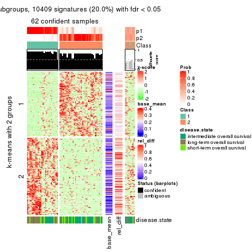</p>

</div>
<div id='tab-CV-mclust-get-signatures-2'>
<pre><code class="r">get_signatures(res, k = 3)
</code></pre>

<p></p>

</div>
<div id='tab-CV-mclust-get-signatures-3'>
<pre><code class="r">get_signatures(res, k = 4)
</code></pre>

<p></p>

</div>
<div id='tab-CV-mclust-get-signatures-4'>
<pre><code class="r">get_signatures(res, k = 5)
</code></pre>

<p></p>

</div>
<div id='tab-CV-mclust-get-signatures-5'>
<pre><code class="r">get_signatures(res, k = 6)
</code></pre>

<p></p>

</div>
</div>


Signature heatmaps where rows are not scaled:


<script>
$( function() {
	$( '#tabs-CV-mclust-get-signatures-no-scale' ).tabs();
} );
</script>
<div id='tabs-CV-mclust-get-signatures-no-scale'>
<ul>
<li><a href='#tab-CV-mclust-get-signatures-no-scale-1'>k = 2</a></li>
<li><a href='#tab-CV-mclust-get-signatures-no-scale-2'>k = 3</a></li>
<li><a href='#tab-CV-mclust-get-signatures-no-scale-3'>k = 4</a></li>
<li><a href='#tab-CV-mclust-get-signatures-no-scale-4'>k = 5</a></li>
<li><a href='#tab-CV-mclust-get-signatures-no-scale-5'>k = 6</a></li>
</ul>
<div id='tab-CV-mclust-get-signatures-no-scale-1'>
<pre><code class="r">get_signatures(res, k = 2, scale_rows = FALSE)
</code></pre>

<p></p>

</div>
<div id='tab-CV-mclust-get-signatures-no-scale-2'>
<pre><code class="r">get_signatures(res, k = 3, scale_rows = FALSE)
</code></pre>

<p></p>

</div>
<div id='tab-CV-mclust-get-signatures-no-scale-3'>
<pre><code class="r">get_signatures(res, k = 4, scale_rows = FALSE)
</code></pre>

<p></p>

</div>
<div id='tab-CV-mclust-get-signatures-no-scale-4'>
<pre><code class="r">get_signatures(res, k = 5, scale_rows = FALSE)
</code></pre>

<p></p>

</div>
<div id='tab-CV-mclust-get-signatures-no-scale-5'>
<pre><code class="r">get_signatures(res, k = 6, scale_rows = FALSE)
</code></pre>

<p></p>

</div>
</div>


Compare the overlap of signatures from different k:

```r
compare_signatures(res)
```


`get_signature()` returns a data frame invisibly. TO get the list of signatures, the function
call should be assigned to a variable explicitly. In following code, if `plot` argument is set
to `FALSE`, no heatmap is plotted while only the differential analysis is performed.

```r
# code only for demonstration
tb = get_signature(res, k = ..., plot = FALSE)
```

An example of the output of `tb` is:

```
#>   which_row         fdr    mean_1    mean_2 scaled_mean_1 scaled_mean_2 km
#> 1        38 0.042760348  8.373488  9.131774    -0.5533452     0.5164555  1
#> 2        40 0.018707592  7.106213  8.469186    -0.6173731     0.5762149  1
#> 3        55 0.019134737 10.221463 11.207825    -0.6159697     0.5749050  1
#> 4        59 0.006059896  5.921854  7.869574    -0.6899429     0.6439467  1
#> 5        60 0.018055526  8.928898 10.211722    -0.6204761     0.5791110  1
#> 6        98 0.009384629 15.714769 14.887706     0.6635654    -0.6193277  2
...
```

The columns in `tb` are:

1. `which_row`: row indices corresponding to the input matrix.
2. `fdr`: FDR for the differential test. 
3. `mean_x`: The mean value in group x.
4. `scaled_mean_x`: The mean value in group x after rows are scaled.
5. `km`: Row groups if k-means clustering is applied to rows.


UMAP plot which shows how samples are separated.


<script>
$( function() {
	$( '#tabs-CV-mclust-dimension-reduction' ).tabs();
} );
</script>
<div id='tabs-CV-mclust-dimension-reduction'>
<ul>
<li><a href='#tab-CV-mclust-dimension-reduction-1'>k = 2</a></li>
<li><a href='#tab-CV-mclust-dimension-reduction-2'>k = 3</a></li>
<li><a href='#tab-CV-mclust-dimension-reduction-3'>k = 4</a></li>
<li><a href='#tab-CV-mclust-dimension-reduction-4'>k = 5</a></li>
<li><a href='#tab-CV-mclust-dimension-reduction-5'>k = 6</a></li>
</ul>
<div id='tab-CV-mclust-dimension-reduction-1'>
<pre><code class="r">dimension_reduction(res, k = 2, method = &quot;UMAP&quot;)
</code></pre>

<p>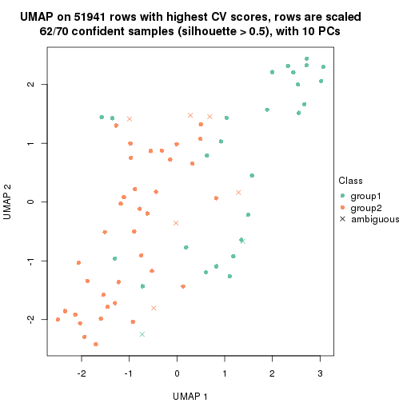</p>

</div>
<div id='tab-CV-mclust-dimension-reduction-2'>
<pre><code class="r">dimension_reduction(res, k = 3, method = &quot;UMAP&quot;)
</code></pre>

<p></p>

</div>
<div id='tab-CV-mclust-dimension-reduction-3'>
<pre><code class="r">dimension_reduction(res, k = 4, method = &quot;UMAP&quot;)
</code></pre>

<p></p>

</div>
<div id='tab-CV-mclust-dimension-reduction-4'>
<pre><code class="r">dimension_reduction(res, k = 5, method = &quot;UMAP&quot;)
</code></pre>

<p></p>

</div>
<div id='tab-CV-mclust-dimension-reduction-5'>
<pre><code class="r">dimension_reduction(res, k = 6, method = &quot;UMAP&quot;)
</code></pre>

<p></p>

</div>
</div>


Following heatmap shows how subgroups are split when increasing `k`:

```r
collect_classes(res)
```


Test correlation between subgroups and known annotations. If the known
annotation is numeric, one-way ANOVA test is applied, and if the known
annotation is discrete, chi-squared contingency table test is applied.

```r
test_to_known_factors(res)
```

```
#>            n disease.state(p) k
#> CV:mclust 62           0.1383 2
#> CV:mclust 40           0.0435 3
#> CV:mclust 57           0.0670 4
#> CV:mclust 58           0.3163 5
#> CV:mclust 58           0.0862 6
```


If matrix rows can be associated to genes, consider to use `GO_Enrichment(res,
...)` to perform function enrichment for the signature genes.


 

---------------------------------------------------


### CV:NMF*


The object with results only for a single top-value method and a single partition method 
can be extracted as:

```r
res = res_list["CV", "NMF"]
# you can also extract it by
# res = res_list["CV:NMF"]
```

A summary of `res` and all the functions that can be applied to it:

```r
res
```

```
#> A 'ConsensusPartition' object with k = 2, 3, 4, 5, 6.
#>   On a matrix with 51941 rows and 70 columns.
#>   Top rows (1000, 2000, 3000, 4000, 5000) are extracted by 'CV' method.
#>   Subgroups are detected by 'NMF' method.
#>   Performed in total 1250 partitions by row resampling.
#>   Best k for subgroups seems to be 2.
#> 
#> Following methods can be applied to this 'ConsensusPartition' object:
#>  [1] "cola_report"             "collect_classes"         "collect_plots"          
#>  [4] "collect_stats"           "colnames"                "compare_signatures"     
#>  [7] "consensus_heatmap"       "dimension_reduction"     "functional_enrichment"  
#> [10] "get_anno_col"            "get_anno"                "get_classes"            
#> [13] "get_consensus"           "get_matrix"              "get_membership"         
#> [16] "get_param"               "get_signatures"          "get_stats"              
#> [19] "is_best_k"               "is_stable_k"             "membership_heatmap"     
#> [22] "ncol"                    "nrow"                    "plot_ecdf"              
#> [25] "rownames"                "select_partition_number" "show"                   
#> [28] "suggest_best_k"          "test_to_known_factors"
```

`collect_plots()` function collects all the plots made from `res` for all `k` (number of partitions)
into one single page to provide an easy and fast comparison between different `k`.

```r
collect_plots(res)
```


The plots are:

- The first row: a plot of the ECDF (Empirical cumulative distribution
  function) curves of the consensus matrix for each `k` and the heatmap of
  predicted classes for each `k`.
- The second row: heatmaps of the consensus matrix for each `k`.
- The third row: heatmaps of the membership matrix for each `k`.
- The fouth row: heatmaps of the signatures for each `k`.

All the plots in panels can be made by individual functions and they are
plotted later in this section.

`select_partition_number()` produces several plots showing different
statistics for choosing "optimized" `k`. There are following statistics:

- ECDF curves of the consensus matrix for each `k`;
- 1-PAC. [The PAC
  score](https://en.wikipedia.org/wiki/Consensus_clustering#Over-interpretation_potential_of_consensus_clustering)
  measures the proportion of the ambiguous subgrouping.
- Mean silhouette score.
- Concordance. The mean probability of fiting the consensus class ids in all
  partitions.
- Area increased. Denote $A_k$ as the area under the ECDF curve for current
  `k`, the area increased is defined as $A_k - A_{k-1}$.
- Rand index. The percent of pairs of samples that are both in a same cluster
  or both are not in a same cluster in the partition of k and k-1.
- Jaccard index. The ratio of pairs of samples are both in a same cluster in
  the partition of k and k-1 and the pairs of samples are both in a same
  cluster in the partition k or k-1.

The detailed explanations of these statistics can be found in [the cola
vignette](http://bioconductor.org/packages/devel/bioc/vignettes/cola/inst/doc/cola.html#toc_13).

Generally speaking, lower PAC score, higher mean silhouette score or higher
concordance corresponds to better partition. Rand index and Jaccard index
measure how similar the current partition is compared to partition with `k-1`.
If they are too similar, we won't accept `k` is better than `k-1`.

```r
select_partition_number(res)
```


The numeric values for all these statistics can be obtained by `get_stats()`.

```r
get_stats(res)
```

```
#>   k 1-PAC mean_silhouette concordance area_increased  Rand Jaccard
#> 2 2 0.940           0.929       0.973         0.4936 0.508   0.508
#> 3 3 0.465           0.484       0.710         0.3217 0.832   0.680
#> 4 4 0.518           0.410       0.630         0.1301 0.722   0.386
#> 5 5 0.620           0.597       0.743         0.0778 0.857   0.524
#> 6 6 0.781           0.691       0.801         0.0506 0.928   0.673
```

`suggest_best_k()` suggests the best $k$ based on these statistics. The rules are as follows:

- All $k$ with Jaccard index larger than 0.95 are removed because the increase of
  the partition number does not provides enough extra information. If all $k$ are removed,
  the best $k$ is assigned by `NA`.
- For $k$ with 1-PAC larger than 0.9, the maximal $k$ is taken as the "best k". Other $k$ is called "optional k".
- If it does not fit the second rule. The $k$ with the highest vote of highest
  1-PAC, mean silhouette and concordance is taken as the "best k".

```r
suggest_best_k(res)
```

```
#> [1] 2
```


Following shows the table of the partitions (You need to click the **show/hide
code output** link to see it). The membership matrix (columns with name `p*`)
is inferred by
[`clue::cl_consensus()`](https://www.rdocumentation.org/link/cl_consensus?package=clue)
function with the `SE` method. Basically the value in the membership matrix
represents the probability to belong to a certain group. The finall class
label for an item is determined with the group with highest probability it
belongs to.

In `get_classes()` function, the entropy is calculated from the membership
matrix and the silhouette score is calculated from the consensus matrix.


<script>
$( function() {
	$( '#tabs-CV-NMF-get-classes' ).tabs();
} );
</script>
<div id='tabs-CV-NMF-get-classes'>
<ul>
<li><a href='#tab-CV-NMF-get-classes-1'>k = 2</a></li>
<li><a href='#tab-CV-NMF-get-classes-2'>k = 3</a></li>
<li><a href='#tab-CV-NMF-get-classes-3'>k = 4</a></li>
<li><a href='#tab-CV-NMF-get-classes-4'>k = 5</a></li>
<li><a href='#tab-CV-NMF-get-classes-5'>k = 6</a></li>
</ul>

<div id='tab-CV-NMF-get-classes-1'>
<p><a id='tab-CV-NMF-get-classes-1-a' style='color:#0366d6' href='#'>show/hide code output</a></p>
<pre><code class="r">cbind(get_classes(res, k = 2), get_membership(res, k = 2))
</code></pre>

<pre><code>#&gt;            class entropy silhouette    p1    p2
#&gt; GSM1299517     2  0.0000     0.9721 0.000 1.000
#&gt; GSM1299518     2  0.0000     0.9721 0.000 1.000
#&gt; GSM1299519     2  0.0000     0.9721 0.000 1.000
#&gt; GSM1299520     1  0.0000     0.9702 1.000 0.000
#&gt; GSM1299521     1  0.0000     0.9702 1.000 0.000
#&gt; GSM1299522     2  0.0000     0.9721 0.000 1.000
#&gt; GSM1299523     1  0.0672     0.9632 0.992 0.008
#&gt; GSM1299524     2  0.7528     0.7221 0.216 0.784
#&gt; GSM1299525     2  0.0000     0.9721 0.000 1.000
#&gt; GSM1299526     2  0.0000     0.9721 0.000 1.000
#&gt; GSM1299527     2  0.0000     0.9721 0.000 1.000
#&gt; GSM1299528     2  0.0000     0.9721 0.000 1.000
#&gt; GSM1299529     2  0.0000     0.9721 0.000 1.000
#&gt; GSM1299530     1  0.0000     0.9702 1.000 0.000
#&gt; GSM1299531     2  0.0000     0.9721 0.000 1.000
#&gt; GSM1299575     1  0.0000     0.9702 1.000 0.000
#&gt; GSM1299532     2  0.0000     0.9721 0.000 1.000
#&gt; GSM1299533     1  0.0000     0.9702 1.000 0.000
#&gt; GSM1299534     2  0.0000     0.9721 0.000 1.000
#&gt; GSM1299535     2  0.0000     0.9721 0.000 1.000
#&gt; GSM1299536     1  0.0000     0.9702 1.000 0.000
#&gt; GSM1299537     2  0.0000     0.9721 0.000 1.000
#&gt; GSM1299538     2  0.9970     0.1021 0.468 0.532
#&gt; GSM1299539     2  0.0000     0.9721 0.000 1.000
#&gt; GSM1299540     2  0.5629     0.8369 0.132 0.868
#&gt; GSM1299541     2  0.0000     0.9721 0.000 1.000
#&gt; GSM1299542     2  0.0000     0.9721 0.000 1.000
#&gt; GSM1299543     2  0.0000     0.9721 0.000 1.000
#&gt; GSM1299544     2  0.0000     0.9721 0.000 1.000
#&gt; GSM1299545     1  0.0000     0.9702 1.000 0.000
#&gt; GSM1299546     2  0.0000     0.9721 0.000 1.000
#&gt; GSM1299547     1  0.0000     0.9702 1.000 0.000
#&gt; GSM1299548     2  0.0000     0.9721 0.000 1.000
#&gt; GSM1299549     1  0.0376     0.9669 0.996 0.004
#&gt; GSM1299550     1  0.8955     0.5287 0.688 0.312
#&gt; GSM1299551     2  0.0000     0.9721 0.000 1.000
#&gt; GSM1299552     1  0.0000     0.9702 1.000 0.000
#&gt; GSM1299553     1  0.9988     0.0642 0.520 0.480
#&gt; GSM1299554     2  0.0000     0.9721 0.000 1.000
#&gt; GSM1299555     2  0.0000     0.9721 0.000 1.000
#&gt; GSM1299556     2  0.0000     0.9721 0.000 1.000
#&gt; GSM1299557     2  0.0000     0.9721 0.000 1.000
#&gt; GSM1299558     2  0.0000     0.9721 0.000 1.000
#&gt; GSM1299559     2  0.8267     0.6490 0.260 0.740
#&gt; GSM1299560     2  0.0000     0.9721 0.000 1.000
#&gt; GSM1299576     1  0.0000     0.9702 1.000 0.000
#&gt; GSM1299577     1  0.0000     0.9702 1.000 0.000
#&gt; GSM1299561     2  0.0000     0.9721 0.000 1.000
#&gt; GSM1299562     2  0.0000     0.9721 0.000 1.000
#&gt; GSM1299563     1  0.0000     0.9702 1.000 0.000
#&gt; GSM1299564     1  0.0000     0.9702 1.000 0.000
#&gt; GSM1299565     2  0.0000     0.9721 0.000 1.000
#&gt; GSM1299566     2  0.0000     0.9721 0.000 1.000
#&gt; GSM1299567     1  0.0000     0.9702 1.000 0.000
#&gt; GSM1299568     2  0.0000     0.9721 0.000 1.000
#&gt; GSM1299569     2  0.0000     0.9721 0.000 1.000
#&gt; GSM1299570     1  0.0000     0.9702 1.000 0.000
#&gt; GSM1299571     2  0.0000     0.9721 0.000 1.000
#&gt; GSM1299572     1  0.0000     0.9702 1.000 0.000
#&gt; GSM1299573     2  0.0000     0.9721 0.000 1.000
#&gt; GSM1299574     2  0.0000     0.9721 0.000 1.000
#&gt; GSM1299578     1  0.0000     0.9702 1.000 0.000
#&gt; GSM1299579     1  0.0000     0.9702 1.000 0.000
#&gt; GSM1299580     1  0.0000     0.9702 1.000 0.000
#&gt; GSM1299581     1  0.0000     0.9702 1.000 0.000
#&gt; GSM1299582     1  0.0000     0.9702 1.000 0.000
#&gt; GSM1299583     1  0.0000     0.9702 1.000 0.000
#&gt; GSM1299584     1  0.0000     0.9702 1.000 0.000
#&gt; GSM1299585     1  0.0000     0.9702 1.000 0.000
#&gt; GSM1299586     1  0.0000     0.9702 1.000 0.000
</code></pre>

<script>
$('#tab-CV-NMF-get-classes-1-a').parent().next().next().hide();
$('#tab-CV-NMF-get-classes-1-a').click(function(){
  $('#tab-CV-NMF-get-classes-1-a').parent().next().next().toggle();
  return(false);
});
</script>
</div>

<div id='tab-CV-NMF-get-classes-2'>
<p><a id='tab-CV-NMF-get-classes-2-a' style='color:#0366d6' href='#'>show/hide code output</a></p>
<pre><code class="r">cbind(get_classes(res, k = 3), get_membership(res, k = 3))
</code></pre>

<pre><code>#&gt;            class entropy silhouette    p1    p2    p3
#&gt; GSM1299517     2  0.5497     0.5657 0.000 0.708 0.292
#&gt; GSM1299518     2  0.4062     0.5766 0.000 0.836 0.164
#&gt; GSM1299519     2  0.0000     0.6215 0.000 1.000 0.000
#&gt; GSM1299520     3  0.6299    -0.0329 0.476 0.000 0.524
#&gt; GSM1299521     1  0.4654     0.7696 0.792 0.000 0.208
#&gt; GSM1299522     2  0.0000     0.6215 0.000 1.000 0.000
#&gt; GSM1299523     3  0.5465     0.3806 0.288 0.000 0.712
#&gt; GSM1299524     3  0.6798    -0.1906 0.016 0.400 0.584
#&gt; GSM1299525     2  0.6140     0.1970 0.000 0.596 0.404
#&gt; GSM1299526     2  0.0424     0.6212 0.000 0.992 0.008
#&gt; GSM1299527     2  0.6180     0.4123 0.000 0.584 0.416
#&gt; GSM1299528     2  0.6204     0.4158 0.000 0.576 0.424
#&gt; GSM1299529     2  0.6095     0.2122 0.000 0.608 0.392
#&gt; GSM1299530     1  0.5591     0.5525 0.696 0.000 0.304
#&gt; GSM1299531     2  0.1860     0.6251 0.000 0.948 0.052
#&gt; GSM1299575     1  0.0000     0.8249 1.000 0.000 0.000
#&gt; GSM1299532     2  0.6079     0.5218 0.000 0.612 0.388
#&gt; GSM1299533     1  0.5061     0.7645 0.784 0.008 0.208
#&gt; GSM1299534     2  0.5431     0.5672 0.000 0.716 0.284
#&gt; GSM1299535     2  0.4235     0.5093 0.000 0.824 0.176
#&gt; GSM1299536     1  0.5327     0.7143 0.728 0.000 0.272
#&gt; GSM1299537     2  0.6126     0.5093 0.000 0.600 0.400
#&gt; GSM1299538     3  0.8649     0.3690 0.204 0.196 0.600
#&gt; GSM1299539     2  0.6678     0.0916 0.008 0.512 0.480
#&gt; GSM1299540     3  0.9266     0.0745 0.156 0.420 0.424
#&gt; GSM1299541     2  0.6079     0.5218 0.000 0.612 0.388
#&gt; GSM1299542     2  0.6079     0.5218 0.000 0.612 0.388
#&gt; GSM1299543     2  0.4452     0.4851 0.000 0.808 0.192
#&gt; GSM1299544     2  0.6235     0.4252 0.000 0.564 0.436
#&gt; GSM1299545     1  0.3686     0.6974 0.860 0.000 0.140
#&gt; GSM1299546     2  0.0000     0.6215 0.000 1.000 0.000
#&gt; GSM1299547     1  0.4654     0.7696 0.792 0.000 0.208
#&gt; GSM1299548     2  0.6095     0.5178 0.000 0.608 0.392
#&gt; GSM1299549     3  0.6235    -0.2078 0.436 0.000 0.564
#&gt; GSM1299550     3  0.7187     0.3008 0.232 0.076 0.692
#&gt; GSM1299551     2  0.0000     0.6215 0.000 1.000 0.000
#&gt; GSM1299552     1  0.5785     0.6769 0.668 0.000 0.332
#&gt; GSM1299553     3  0.9836     0.2624 0.344 0.252 0.404
#&gt; GSM1299554     3  0.6280    -0.4571 0.000 0.460 0.540
#&gt; GSM1299555     2  0.4796     0.5581 0.000 0.780 0.220
#&gt; GSM1299556     2  0.6062     0.5226 0.000 0.616 0.384
#&gt; GSM1299557     2  0.6095     0.2122 0.000 0.608 0.392
#&gt; GSM1299558     2  0.4235     0.5851 0.000 0.824 0.176
#&gt; GSM1299559     3  0.8768    -0.1810 0.112 0.408 0.480
#&gt; GSM1299560     2  0.5760     0.5447 0.000 0.672 0.328
#&gt; GSM1299576     1  0.0000     0.8249 1.000 0.000 0.000
#&gt; GSM1299577     1  0.0000     0.8249 1.000 0.000 0.000
#&gt; GSM1299561     2  0.6079     0.5218 0.000 0.612 0.388
#&gt; GSM1299562     3  0.6460    -0.1447 0.004 0.440 0.556
#&gt; GSM1299563     3  0.6309    -0.1598 0.496 0.000 0.504
#&gt; GSM1299564     3  0.5016     0.4226 0.240 0.000 0.760
#&gt; GSM1299565     2  0.0000     0.6215 0.000 1.000 0.000
#&gt; GSM1299566     2  0.6307     0.3173 0.000 0.512 0.488
#&gt; GSM1299567     1  0.6260     0.0368 0.552 0.000 0.448
#&gt; GSM1299568     2  0.5733     0.5261 0.000 0.676 0.324
#&gt; GSM1299569     2  0.6260     0.4311 0.000 0.552 0.448
#&gt; GSM1299570     1  0.5785     0.4821 0.668 0.000 0.332
#&gt; GSM1299571     2  0.0000     0.6215 0.000 1.000 0.000
#&gt; GSM1299572     1  0.4654     0.7696 0.792 0.000 0.208
#&gt; GSM1299573     2  0.6079     0.5218 0.000 0.612 0.388
#&gt; GSM1299574     2  0.0000     0.6215 0.000 1.000 0.000
#&gt; GSM1299578     1  0.0000     0.8249 1.000 0.000 0.000
#&gt; GSM1299579     1  0.2165     0.8170 0.936 0.000 0.064
#&gt; GSM1299580     1  0.0000     0.8249 1.000 0.000 0.000
#&gt; GSM1299581     1  0.0237     0.8250 0.996 0.000 0.004
#&gt; GSM1299582     1  0.0000     0.8249 1.000 0.000 0.000
#&gt; GSM1299583     1  0.2625     0.8053 0.916 0.000 0.084
#&gt; GSM1299584     1  0.0237     0.8247 0.996 0.000 0.004
#&gt; GSM1299585     1  0.4605     0.7713 0.796 0.000 0.204
#&gt; GSM1299586     1  0.0000     0.8249 1.000 0.000 0.000
</code></pre>

<script>
$('#tab-CV-NMF-get-classes-2-a').parent().next().next().hide();
$('#tab-CV-NMF-get-classes-2-a').click(function(){
  $('#tab-CV-NMF-get-classes-2-a').parent().next().next().toggle();
  return(false);
});
</script>
</div>

<div id='tab-CV-NMF-get-classes-3'>
<p><a id='tab-CV-NMF-get-classes-3-a' style='color:#0366d6' href='#'>show/hide code output</a></p>
<pre><code class="r">cbind(get_classes(res, k = 4), get_membership(res, k = 4))
</code></pre>

<pre><code>#&gt;            class entropy silhouette    p1    p2    p3    p4
#&gt; GSM1299517     3  0.2271     0.6017 0.008 0.076 0.916 0.000
#&gt; GSM1299518     3  0.4961    -0.2286 0.000 0.448 0.552 0.000
#&gt; GSM1299519     2  0.4776     0.5267 0.000 0.624 0.376 0.000
#&gt; GSM1299520     1  0.6272     0.3506 0.720 0.124 0.036 0.120
#&gt; GSM1299521     4  0.0000     0.7136 0.000 0.000 0.000 1.000
#&gt; GSM1299522     2  0.4790     0.5260 0.000 0.620 0.380 0.000
#&gt; GSM1299523     1  0.6934     0.3361 0.680 0.148 0.064 0.108
#&gt; GSM1299524     3  0.4790     0.3323 0.000 0.000 0.620 0.380
#&gt; GSM1299525     2  0.5022     0.3664 0.220 0.736 0.044 0.000
#&gt; GSM1299526     2  0.4804     0.5210 0.000 0.616 0.384 0.000
#&gt; GSM1299527     3  0.5427     0.2857 0.020 0.336 0.640 0.004
#&gt; GSM1299528     3  0.7697     0.1132 0.176 0.348 0.468 0.008
#&gt; GSM1299529     2  0.4356     0.4182 0.140 0.812 0.044 0.004
#&gt; GSM1299530     1  0.7300     0.3546 0.584 0.100 0.032 0.284
#&gt; GSM1299531     2  0.5161     0.3192 0.004 0.520 0.476 0.000
#&gt; GSM1299575     1  0.4855     0.4413 0.600 0.000 0.000 0.400
#&gt; GSM1299532     3  0.0000     0.6363 0.000 0.000 1.000 0.000
#&gt; GSM1299533     4  0.0921     0.7010 0.000 0.028 0.000 0.972
#&gt; GSM1299534     3  0.2596     0.5934 0.024 0.068 0.908 0.000
#&gt; GSM1299535     2  0.5638     0.3368 0.028 0.584 0.388 0.000
#&gt; GSM1299536     4  0.1854     0.6801 0.048 0.012 0.000 0.940
#&gt; GSM1299537     3  0.0524     0.6358 0.004 0.008 0.988 0.000
#&gt; GSM1299538     1  0.5633     0.2146 0.624 0.348 0.016 0.012
#&gt; GSM1299539     2  0.5993     0.3214 0.276 0.664 0.044 0.016
#&gt; GSM1299540     3  0.7153     0.0553 0.424 0.132 0.444 0.000
#&gt; GSM1299541     3  0.1022     0.6233 0.000 0.032 0.968 0.000
#&gt; GSM1299542     3  0.0188     0.6359 0.000 0.004 0.996 0.000
#&gt; GSM1299543     2  0.4158     0.4735 0.008 0.768 0.224 0.000
#&gt; GSM1299544     3  0.7384     0.1596 0.156 0.336 0.504 0.004
#&gt; GSM1299545     1  0.4711     0.4441 0.740 0.024 0.000 0.236
#&gt; GSM1299546     2  0.4790     0.5260 0.000 0.620 0.380 0.000
#&gt; GSM1299547     4  0.0000     0.7136 0.000 0.000 0.000 1.000
#&gt; GSM1299548     3  0.0336     0.6366 0.000 0.008 0.992 0.000
#&gt; GSM1299549     4  0.8390     0.2163 0.180 0.140 0.120 0.560
#&gt; GSM1299550     4  0.8364     0.2890 0.168 0.104 0.168 0.560
#&gt; GSM1299551     2  0.3942     0.5246 0.000 0.764 0.236 0.000
#&gt; GSM1299552     4  0.1284     0.6993 0.024 0.012 0.000 0.964
#&gt; GSM1299553     2  0.6622    -0.0620 0.440 0.500 0.032 0.028
#&gt; GSM1299554     3  0.2593     0.5850 0.004 0.104 0.892 0.000
#&gt; GSM1299555     3  0.5673     0.2094 0.052 0.288 0.660 0.000
#&gt; GSM1299556     3  0.0592     0.6317 0.000 0.016 0.984 0.000
#&gt; GSM1299557     2  0.5020     0.3924 0.184 0.760 0.052 0.004
#&gt; GSM1299558     2  0.5858     0.0358 0.032 0.500 0.468 0.000
#&gt; GSM1299559     3  0.4704     0.4645 0.204 0.028 0.764 0.004
#&gt; GSM1299560     3  0.2216     0.5688 0.000 0.092 0.908 0.000
#&gt; GSM1299576     1  0.4855     0.4413 0.600 0.000 0.000 0.400
#&gt; GSM1299577     1  0.4790     0.4432 0.620 0.000 0.000 0.380
#&gt; GSM1299561     3  0.0188     0.6359 0.000 0.004 0.996 0.000
#&gt; GSM1299562     2  0.9013     0.1662 0.184 0.412 0.320 0.084
#&gt; GSM1299563     1  0.7083     0.2878 0.628 0.176 0.020 0.176
#&gt; GSM1299564     1  0.7703     0.2754 0.616 0.184 0.084 0.116
#&gt; GSM1299565     2  0.4790     0.5260 0.000 0.620 0.380 0.000
#&gt; GSM1299566     3  0.7800     0.1152 0.176 0.344 0.468 0.012
#&gt; GSM1299567     1  0.6092     0.3148 0.652 0.072 0.272 0.004
#&gt; GSM1299568     3  0.6585     0.2275 0.104 0.312 0.584 0.000
#&gt; GSM1299569     3  0.7370     0.2472 0.156 0.272 0.560 0.012
#&gt; GSM1299570     1  0.6478     0.3803 0.644 0.100 0.008 0.248
#&gt; GSM1299571     2  0.4790     0.5260 0.000 0.620 0.380 0.000
#&gt; GSM1299572     4  0.0000     0.7136 0.000 0.000 0.000 1.000
#&gt; GSM1299573     3  0.0000     0.6363 0.000 0.000 1.000 0.000
#&gt; GSM1299574     2  0.4790     0.5260 0.000 0.620 0.380 0.000
#&gt; GSM1299578     1  0.4855     0.4413 0.600 0.000 0.000 0.400
#&gt; GSM1299579     4  0.4907    -0.1238 0.420 0.000 0.000 0.580
#&gt; GSM1299580     1  0.4855     0.4413 0.600 0.000 0.000 0.400
#&gt; GSM1299581     1  0.4855     0.4413 0.600 0.000 0.000 0.400
#&gt; GSM1299582     1  0.4855     0.4413 0.600 0.000 0.000 0.400
#&gt; GSM1299583     4  0.4817     0.0614 0.388 0.000 0.000 0.612
#&gt; GSM1299584     1  0.4855     0.4413 0.600 0.000 0.000 0.400
#&gt; GSM1299585     4  0.0188     0.7108 0.004 0.000 0.000 0.996
#&gt; GSM1299586     1  0.4855     0.4413 0.600 0.000 0.000 0.400
</code></pre>

<script>
$('#tab-CV-NMF-get-classes-3-a').parent().next().next().hide();
$('#tab-CV-NMF-get-classes-3-a').click(function(){
  $('#tab-CV-NMF-get-classes-3-a').parent().next().next().toggle();
  return(false);
});
</script>
</div>

<div id='tab-CV-NMF-get-classes-4'>
<p><a id='tab-CV-NMF-get-classes-4-a' style='color:#0366d6' href='#'>show/hide code output</a></p>
<pre><code class="r">cbind(get_classes(res, k = 5), get_membership(res, k = 5))
</code></pre>

<pre><code>#&gt;            class entropy silhouette    p1    p2    p3    p4    p5
#&gt; GSM1299517     3  0.4295     0.6285 0.000 0.092 0.808 0.052 0.048
#&gt; GSM1299518     2  0.3210     0.7333 0.000 0.788 0.212 0.000 0.000
#&gt; GSM1299519     2  0.2516     0.7763 0.000 0.860 0.140 0.000 0.000
#&gt; GSM1299520     4  0.4542     0.5304 0.264 0.000 0.016 0.704 0.016
#&gt; GSM1299521     5  0.2966     0.8824 0.184 0.000 0.000 0.000 0.816
#&gt; GSM1299522     2  0.2561     0.7787 0.000 0.856 0.144 0.000 0.000
#&gt; GSM1299523     4  0.4065     0.5679 0.212 0.000 0.020 0.760 0.008
#&gt; GSM1299524     3  0.4504     0.1703 0.008 0.000 0.564 0.000 0.428
#&gt; GSM1299525     4  0.6784     0.2532 0.000 0.360 0.040 0.488 0.112
#&gt; GSM1299526     2  0.2561     0.7787 0.000 0.856 0.144 0.000 0.000
#&gt; GSM1299527     3  0.6869     0.3723 0.000 0.212 0.584 0.120 0.084
#&gt; GSM1299528     3  0.7134     0.3929 0.000 0.068 0.460 0.364 0.108
#&gt; GSM1299529     2  0.6571    -0.1815 0.000 0.464 0.024 0.400 0.112
#&gt; GSM1299530     4  0.5608     0.4701 0.304 0.000 0.016 0.616 0.064
#&gt; GSM1299531     2  0.4878     0.6669 0.000 0.720 0.208 0.012 0.060
#&gt; GSM1299575     1  0.0162     0.9066 0.996 0.000 0.000 0.004 0.000
#&gt; GSM1299532     3  0.0162     0.7130 0.000 0.004 0.996 0.000 0.000
#&gt; GSM1299533     5  0.3171     0.8794 0.176 0.008 0.000 0.000 0.816
#&gt; GSM1299534     3  0.3980     0.6591 0.000 0.036 0.828 0.076 0.060
#&gt; GSM1299535     2  0.7765     0.0618 0.000 0.428 0.300 0.184 0.088
#&gt; GSM1299536     5  0.2886     0.8648 0.148 0.000 0.000 0.008 0.844
#&gt; GSM1299537     3  0.0671     0.7109 0.000 0.004 0.980 0.016 0.000
#&gt; GSM1299538     4  0.1638     0.5994 0.064 0.000 0.004 0.932 0.000
#&gt; GSM1299539     4  0.5852     0.3981 0.000 0.160 0.028 0.668 0.144
#&gt; GSM1299540     4  0.7551     0.3665 0.308 0.084 0.152 0.456 0.000
#&gt; GSM1299541     3  0.1571     0.6774 0.000 0.060 0.936 0.004 0.000
#&gt; GSM1299542     3  0.0451     0.7122 0.000 0.008 0.988 0.000 0.004
#&gt; GSM1299543     2  0.5029     0.6620 0.000 0.756 0.100 0.100 0.044
#&gt; GSM1299544     3  0.6984     0.4423 0.000 0.064 0.500 0.332 0.104
#&gt; GSM1299545     1  0.4045     0.2397 0.644 0.000 0.000 0.356 0.000
#&gt; GSM1299546     2  0.2561     0.7787 0.000 0.856 0.144 0.000 0.000
#&gt; GSM1299547     5  0.2966     0.8824 0.184 0.000 0.000 0.000 0.816
#&gt; GSM1299548     3  0.0324     0.7132 0.000 0.004 0.992 0.004 0.000
#&gt; GSM1299549     4  0.7476     0.1233 0.032 0.060 0.076 0.440 0.392
#&gt; GSM1299550     5  0.6416     0.2243 0.000 0.016 0.160 0.260 0.564
#&gt; GSM1299551     2  0.0693     0.6592 0.000 0.980 0.012 0.000 0.008
#&gt; GSM1299552     5  0.3555     0.8238 0.124 0.000 0.000 0.052 0.824
#&gt; GSM1299553     4  0.8354     0.3778 0.136 0.260 0.036 0.456 0.112
#&gt; GSM1299554     3  0.1648     0.7068 0.000 0.040 0.940 0.020 0.000
#&gt; GSM1299555     2  0.5182     0.4085 0.000 0.544 0.412 0.044 0.000
#&gt; GSM1299556     3  0.0510     0.7083 0.000 0.016 0.984 0.000 0.000
#&gt; GSM1299557     4  0.6897     0.1763 0.000 0.404 0.044 0.440 0.112
#&gt; GSM1299558     2  0.7494     0.0680 0.000 0.420 0.368 0.120 0.092
#&gt; GSM1299559     3  0.4047     0.3616 0.000 0.004 0.676 0.320 0.000
#&gt; GSM1299560     3  0.3336     0.4517 0.000 0.228 0.772 0.000 0.000
#&gt; GSM1299576     1  0.0000     0.9088 1.000 0.000 0.000 0.000 0.000
#&gt; GSM1299577     1  0.0963     0.8741 0.964 0.000 0.000 0.036 0.000
#&gt; GSM1299561     3  0.0451     0.7132 0.000 0.008 0.988 0.004 0.000
#&gt; GSM1299562     4  0.5908     0.1329 0.000 0.404 0.080 0.508 0.008
#&gt; GSM1299563     4  0.2580     0.5971 0.064 0.000 0.016 0.900 0.020
#&gt; GSM1299564     4  0.3090     0.5909 0.052 0.000 0.056 0.876 0.016
#&gt; GSM1299565     2  0.2561     0.7787 0.000 0.856 0.144 0.000 0.000
#&gt; GSM1299566     3  0.7127     0.3849 0.000 0.064 0.456 0.368 0.112
#&gt; GSM1299567     4  0.5432     0.3462 0.392 0.000 0.064 0.544 0.000
#&gt; GSM1299568     3  0.6736     0.4949 0.000 0.064 0.568 0.264 0.104
#&gt; GSM1299569     3  0.6661     0.4772 0.000 0.056 0.540 0.316 0.088
#&gt; GSM1299570     4  0.4960     0.4319 0.352 0.000 0.016 0.616 0.016
#&gt; GSM1299571     2  0.2561     0.7787 0.000 0.856 0.144 0.000 0.000
#&gt; GSM1299572     5  0.2966     0.8824 0.184 0.000 0.000 0.000 0.816
#&gt; GSM1299573     3  0.0162     0.7130 0.000 0.004 0.996 0.000 0.000
#&gt; GSM1299574     2  0.2561     0.7787 0.000 0.856 0.144 0.000 0.000
#&gt; GSM1299578     1  0.0000     0.9088 1.000 0.000 0.000 0.000 0.000
#&gt; GSM1299579     1  0.2648     0.7337 0.848 0.000 0.000 0.000 0.152
#&gt; GSM1299580     1  0.0162     0.9066 0.996 0.000 0.000 0.004 0.000
#&gt; GSM1299581     1  0.0000     0.9088 1.000 0.000 0.000 0.000 0.000
#&gt; GSM1299582     1  0.0000     0.9088 1.000 0.000 0.000 0.000 0.000
#&gt; GSM1299583     1  0.2891     0.6869 0.824 0.000 0.000 0.000 0.176
#&gt; GSM1299584     1  0.0000     0.9088 1.000 0.000 0.000 0.000 0.000
#&gt; GSM1299585     5  0.2966     0.8824 0.184 0.000 0.000 0.000 0.816
#&gt; GSM1299586     1  0.0000     0.9088 1.000 0.000 0.000 0.000 0.000
</code></pre>

<script>
$('#tab-CV-NMF-get-classes-4-a').parent().next().next().hide();
$('#tab-CV-NMF-get-classes-4-a').click(function(){
  $('#tab-CV-NMF-get-classes-4-a').parent().next().next().toggle();
  return(false);
});
</script>
</div>

<div id='tab-CV-NMF-get-classes-5'>
<p><a id='tab-CV-NMF-get-classes-5-a' style='color:#0366d6' href='#'>show/hide code output</a></p>
<pre><code class="r">cbind(get_classes(res, k = 6), get_membership(res, k = 6))
</code></pre>

<pre><code>#&gt;            class entropy silhouette    p1    p2    p3    p4    p5    p6
#&gt; GSM1299517     3  0.3464     0.3404 0.000 0.000 0.688 0.000 0.000 0.312
#&gt; GSM1299518     2  0.0865     0.8989 0.000 0.964 0.036 0.000 0.000 0.000
#&gt; GSM1299519     2  0.0146     0.9203 0.000 0.996 0.004 0.000 0.000 0.000
#&gt; GSM1299520     4  0.2320     0.8246 0.132 0.000 0.004 0.864 0.000 0.000
#&gt; GSM1299521     5  0.1075     0.8562 0.048 0.000 0.000 0.000 0.952 0.000
#&gt; GSM1299522     2  0.0146     0.9203 0.000 0.996 0.004 0.000 0.000 0.000
#&gt; GSM1299523     4  0.2420     0.8239 0.128 0.000 0.004 0.864 0.000 0.004
#&gt; GSM1299524     5  0.4135     0.3246 0.000 0.008 0.404 0.000 0.584 0.004
#&gt; GSM1299525     6  0.3577     0.6855 0.000 0.088 0.012 0.084 0.000 0.816
#&gt; GSM1299526     2  0.0146     0.9203 0.000 0.996 0.004 0.000 0.000 0.000
#&gt; GSM1299527     6  0.3742     0.3684 0.000 0.000 0.348 0.004 0.000 0.648
#&gt; GSM1299528     3  0.6967     0.2615 0.000 0.008 0.396 0.216 0.048 0.332
#&gt; GSM1299529     6  0.3385     0.6656 0.000 0.144 0.008 0.036 0.000 0.812
#&gt; GSM1299530     4  0.2734     0.8222 0.148 0.000 0.004 0.840 0.008 0.000
#&gt; GSM1299531     2  0.1732     0.8688 0.000 0.920 0.004 0.000 0.004 0.072
#&gt; GSM1299575     1  0.0405     0.9641 0.988 0.000 0.004 0.000 0.000 0.008
#&gt; GSM1299532     3  0.0777     0.6733 0.000 0.024 0.972 0.004 0.000 0.000
#&gt; GSM1299533     5  0.1075     0.8562 0.048 0.000 0.000 0.000 0.952 0.000
#&gt; GSM1299534     3  0.5201     0.5435 0.000 0.016 0.716 0.100 0.044 0.124
#&gt; GSM1299535     6  0.4784     0.6072 0.000 0.140 0.136 0.016 0.000 0.708
#&gt; GSM1299536     5  0.0713     0.8451 0.028 0.000 0.000 0.000 0.972 0.000
#&gt; GSM1299537     3  0.0909     0.6717 0.000 0.020 0.968 0.012 0.000 0.000
#&gt; GSM1299538     4  0.0458     0.7583 0.016 0.000 0.000 0.984 0.000 0.000
#&gt; GSM1299539     6  0.4948     0.4214 0.000 0.000 0.020 0.316 0.048 0.616
#&gt; GSM1299540     4  0.5218     0.7337 0.168 0.064 0.080 0.688 0.000 0.000
#&gt; GSM1299541     3  0.2320     0.6038 0.000 0.132 0.864 0.004 0.000 0.000
#&gt; GSM1299542     3  0.1003     0.6734 0.000 0.028 0.964 0.004 0.000 0.004
#&gt; GSM1299543     2  0.4934     0.5640 0.000 0.704 0.032 0.028 0.028 0.208
#&gt; GSM1299544     3  0.6863     0.3205 0.000 0.012 0.444 0.176 0.048 0.320
#&gt; GSM1299545     4  0.3907     0.4807 0.408 0.000 0.000 0.588 0.000 0.004
#&gt; GSM1299546     2  0.0146     0.9203 0.000 0.996 0.004 0.000 0.000 0.000
#&gt; GSM1299547     5  0.1075     0.8562 0.048 0.000 0.000 0.000 0.952 0.000
#&gt; GSM1299548     3  0.0820     0.6720 0.000 0.016 0.972 0.012 0.000 0.000
#&gt; GSM1299549     6  0.6239     0.2735 0.000 0.000 0.016 0.296 0.224 0.464
#&gt; GSM1299550     5  0.5875     0.3983 0.000 0.000 0.068 0.144 0.624 0.164
#&gt; GSM1299551     2  0.2300     0.7793 0.000 0.856 0.000 0.000 0.000 0.144
#&gt; GSM1299552     5  0.2020     0.7813 0.008 0.000 0.000 0.000 0.896 0.096
#&gt; GSM1299553     6  0.3733     0.6667 0.020 0.048 0.008 0.108 0.000 0.816
#&gt; GSM1299554     3  0.0837     0.6657 0.000 0.004 0.972 0.004 0.000 0.020
#&gt; GSM1299555     2  0.3065     0.7497 0.000 0.820 0.152 0.028 0.000 0.000
#&gt; GSM1299556     3  0.1010     0.6698 0.000 0.036 0.960 0.004 0.000 0.000
#&gt; GSM1299557     6  0.3617     0.6868 0.000 0.088 0.016 0.080 0.000 0.816
#&gt; GSM1299558     6  0.8292    -0.1344 0.000 0.264 0.236 0.152 0.048 0.300
#&gt; GSM1299559     3  0.3817     0.0521 0.000 0.000 0.568 0.432 0.000 0.000
#&gt; GSM1299560     3  0.3563     0.3581 0.000 0.336 0.664 0.000 0.000 0.000
#&gt; GSM1299576     1  0.0291     0.9641 0.992 0.000 0.004 0.000 0.000 0.004
#&gt; GSM1299577     1  0.1364     0.9163 0.944 0.004 0.004 0.048 0.000 0.000
#&gt; GSM1299561     3  0.0858     0.6735 0.000 0.028 0.968 0.004 0.000 0.000
#&gt; GSM1299562     4  0.4079     0.3831 0.000 0.380 0.008 0.608 0.000 0.004
#&gt; GSM1299563     4  0.1003     0.7628 0.020 0.000 0.016 0.964 0.000 0.000
#&gt; GSM1299564     4  0.0909     0.7641 0.020 0.000 0.012 0.968 0.000 0.000
#&gt; GSM1299565     2  0.0146     0.9203 0.000 0.996 0.004 0.000 0.000 0.000
#&gt; GSM1299566     3  0.6873     0.2544 0.000 0.004 0.400 0.216 0.048 0.332
#&gt; GSM1299567     4  0.3053     0.8122 0.168 0.000 0.020 0.812 0.000 0.000
#&gt; GSM1299568     3  0.6751     0.3381 0.000 0.012 0.464 0.156 0.048 0.320
#&gt; GSM1299569     3  0.6842     0.3396 0.000 0.012 0.460 0.180 0.048 0.300
#&gt; GSM1299570     4  0.2595     0.8191 0.160 0.000 0.004 0.836 0.000 0.000
#&gt; GSM1299571     2  0.0146     0.9203 0.000 0.996 0.004 0.000 0.000 0.000
#&gt; GSM1299572     5  0.1075     0.8562 0.048 0.000 0.000 0.000 0.952 0.000
#&gt; GSM1299573     3  0.0922     0.6737 0.000 0.024 0.968 0.004 0.000 0.004
#&gt; GSM1299574     2  0.0146     0.9203 0.000 0.996 0.004 0.000 0.000 0.000
#&gt; GSM1299578     1  0.0405     0.9641 0.988 0.000 0.004 0.000 0.000 0.008
#&gt; GSM1299579     1  0.1788     0.9021 0.916 0.004 0.004 0.000 0.076 0.000
#&gt; GSM1299580     1  0.0405     0.9641 0.988 0.000 0.004 0.000 0.000 0.008
#&gt; GSM1299581     1  0.0436     0.9608 0.988 0.004 0.004 0.000 0.000 0.004
#&gt; GSM1299582     1  0.0146     0.9628 0.996 0.000 0.000 0.000 0.000 0.004
#&gt; GSM1299583     1  0.2292     0.8686 0.884 0.004 0.004 0.000 0.104 0.004
#&gt; GSM1299584     1  0.0291     0.9621 0.992 0.004 0.000 0.000 0.000 0.004
#&gt; GSM1299585     5  0.1075     0.8562 0.048 0.000 0.000 0.000 0.952 0.000
#&gt; GSM1299586     1  0.0405     0.9641 0.988 0.000 0.004 0.000 0.000 0.008
</code></pre>

<script>
$('#tab-CV-NMF-get-classes-5-a').parent().next().next().hide();
$('#tab-CV-NMF-get-classes-5-a').click(function(){
  $('#tab-CV-NMF-get-classes-5-a').parent().next().next().toggle();
  return(false);
});
</script>
</div>
</div>

Heatmaps for the consensus matrix. It visualizes the probability of two
samples to be in a same group.


<script>
$( function() {
	$( '#tabs-CV-NMF-consensus-heatmap' ).tabs();
} );
</script>
<div id='tabs-CV-NMF-consensus-heatmap'>
<ul>
<li><a href='#tab-CV-NMF-consensus-heatmap-1'>k = 2</a></li>
<li><a href='#tab-CV-NMF-consensus-heatmap-2'>k = 3</a></li>
<li><a href='#tab-CV-NMF-consensus-heatmap-3'>k = 4</a></li>
<li><a href='#tab-CV-NMF-consensus-heatmap-4'>k = 5</a></li>
<li><a href='#tab-CV-NMF-consensus-heatmap-5'>k = 6</a></li>
</ul>
<div id='tab-CV-NMF-consensus-heatmap-1'>
<pre><code class="r">consensus_heatmap(res, k = 2)
</code></pre>

<p></p>

</div>
<div id='tab-CV-NMF-consensus-heatmap-2'>
<pre><code class="r">consensus_heatmap(res, k = 3)
</code></pre>

<p></p>

</div>
<div id='tab-CV-NMF-consensus-heatmap-3'>
<pre><code class="r">consensus_heatmap(res, k = 4)
</code></pre>

<p></p>

</div>
<div id='tab-CV-NMF-consensus-heatmap-4'>
<pre><code class="r">consensus_heatmap(res, k = 5)
</code></pre>

<p></p>

</div>
<div id='tab-CV-NMF-consensus-heatmap-5'>
<pre><code class="r">consensus_heatmap(res, k = 6)
</code></pre>

<p></p>

</div>
</div>

Heatmaps for the membership of samples in all partitions to see how consistent they are:


<script>
$( function() {
	$( '#tabs-CV-NMF-membership-heatmap' ).tabs();
} );
</script>
<div id='tabs-CV-NMF-membership-heatmap'>
<ul>
<li><a href='#tab-CV-NMF-membership-heatmap-1'>k = 2</a></li>
<li><a href='#tab-CV-NMF-membership-heatmap-2'>k = 3</a></li>
<li><a href='#tab-CV-NMF-membership-heatmap-3'>k = 4</a></li>
<li><a href='#tab-CV-NMF-membership-heatmap-4'>k = 5</a></li>
<li><a href='#tab-CV-NMF-membership-heatmap-5'>k = 6</a></li>
</ul>
<div id='tab-CV-NMF-membership-heatmap-1'>
<pre><code class="r">membership_heatmap(res, k = 2)
</code></pre>

<p></p>

</div>
<div id='tab-CV-NMF-membership-heatmap-2'>
<pre><code class="r">membership_heatmap(res, k = 3)
</code></pre>

<p></p>

</div>
<div id='tab-CV-NMF-membership-heatmap-3'>
<pre><code class="r">membership_heatmap(res, k = 4)
</code></pre>

<p></p>

</div>
<div id='tab-CV-NMF-membership-heatmap-4'>
<pre><code class="r">membership_heatmap(res, k = 5)
</code></pre>

<p></p>

</div>
<div id='tab-CV-NMF-membership-heatmap-5'>
<pre><code class="r">membership_heatmap(res, k = 6)
</code></pre>

<p></p>

</div>
</div>

As soon as we have had the classes for columns, we can look for signatures
which are significantly different between classes which can be candidate marks
for certain classes. Following are the heatmaps for signatures.


Signature heatmaps where rows are scaled:


<script>
$( function() {
	$( '#tabs-CV-NMF-get-signatures' ).tabs();
} );
</script>
<div id='tabs-CV-NMF-get-signatures'>
<ul>
<li><a href='#tab-CV-NMF-get-signatures-1'>k = 2</a></li>
<li><a href='#tab-CV-NMF-get-signatures-2'>k = 3</a></li>
<li><a href='#tab-CV-NMF-get-signatures-3'>k = 4</a></li>
<li><a href='#tab-CV-NMF-get-signatures-4'>k = 5</a></li>
<li><a href='#tab-CV-NMF-get-signatures-5'>k = 6</a></li>
</ul>
<div id='tab-CV-NMF-get-signatures-1'>
<pre><code class="r">get_signatures(res, k = 2)
</code></pre>

<p></p>

</div>
<div id='tab-CV-NMF-get-signatures-2'>
<pre><code class="r">get_signatures(res, k = 3)
</code></pre>

<p></p>

</div>
<div id='tab-CV-NMF-get-signatures-3'>
<pre><code class="r">get_signatures(res, k = 4)
</code></pre>

<p></p>

</div>
<div id='tab-CV-NMF-get-signatures-4'>
<pre><code class="r">get_signatures(res, k = 5)
</code></pre>

<p></p>

</div>
<div id='tab-CV-NMF-get-signatures-5'>
<pre><code class="r">get_signatures(res, k = 6)
</code></pre>

<p>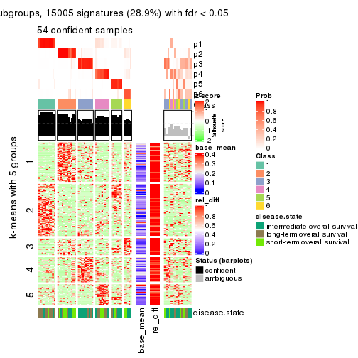</p>

</div>
</div>


Signature heatmaps where rows are not scaled:


<script>
$( function() {
	$( '#tabs-CV-NMF-get-signatures-no-scale' ).tabs();
} );
</script>
<div id='tabs-CV-NMF-get-signatures-no-scale'>
<ul>
<li><a href='#tab-CV-NMF-get-signatures-no-scale-1'>k = 2</a></li>
<li><a href='#tab-CV-NMF-get-signatures-no-scale-2'>k = 3</a></li>
<li><a href='#tab-CV-NMF-get-signatures-no-scale-3'>k = 4</a></li>
<li><a href='#tab-CV-NMF-get-signatures-no-scale-4'>k = 5</a></li>
<li><a href='#tab-CV-NMF-get-signatures-no-scale-5'>k = 6</a></li>
</ul>
<div id='tab-CV-NMF-get-signatures-no-scale-1'>
<pre><code class="r">get_signatures(res, k = 2, scale_rows = FALSE)
</code></pre>

<p></p>

</div>
<div id='tab-CV-NMF-get-signatures-no-scale-2'>
<pre><code class="r">get_signatures(res, k = 3, scale_rows = FALSE)
</code></pre>

<p></p>

</div>
<div id='tab-CV-NMF-get-signatures-no-scale-3'>
<pre><code class="r">get_signatures(res, k = 4, scale_rows = FALSE)
</code></pre>

<p></p>

</div>
<div id='tab-CV-NMF-get-signatures-no-scale-4'>
<pre><code class="r">get_signatures(res, k = 5, scale_rows = FALSE)
</code></pre>

<p></p>

</div>
<div id='tab-CV-NMF-get-signatures-no-scale-5'>
<pre><code class="r">get_signatures(res, k = 6, scale_rows = FALSE)
</code></pre>

<p></p>

</div>
</div>


Compare the overlap of signatures from different k:

```r
compare_signatures(res)
```


`get_signature()` returns a data frame invisibly. TO get the list of signatures, the function
call should be assigned to a variable explicitly. In following code, if `plot` argument is set
to `FALSE`, no heatmap is plotted while only the differential analysis is performed.

```r
# code only for demonstration
tb = get_signature(res, k = ..., plot = FALSE)
```

An example of the output of `tb` is:

```
#>   which_row         fdr    mean_1    mean_2 scaled_mean_1 scaled_mean_2 km
#> 1        38 0.042760348  8.373488  9.131774    -0.5533452     0.5164555  1
#> 2        40 0.018707592  7.106213  8.469186    -0.6173731     0.5762149  1
#> 3        55 0.019134737 10.221463 11.207825    -0.6159697     0.5749050  1
#> 4        59 0.006059896  5.921854  7.869574    -0.6899429     0.6439467  1
#> 5        60 0.018055526  8.928898 10.211722    -0.6204761     0.5791110  1
#> 6        98 0.009384629 15.714769 14.887706     0.6635654    -0.6193277  2
...
```

The columns in `tb` are:

1. `which_row`: row indices corresponding to the input matrix.
2. `fdr`: FDR for the differential test. 
3. `mean_x`: The mean value in group x.
4. `scaled_mean_x`: The mean value in group x after rows are scaled.
5. `km`: Row groups if k-means clustering is applied to rows.


UMAP plot which shows how samples are separated.


<script>
$( function() {
	$( '#tabs-CV-NMF-dimension-reduction' ).tabs();
} );
</script>
<div id='tabs-CV-NMF-dimension-reduction'>
<ul>
<li><a href='#tab-CV-NMF-dimension-reduction-1'>k = 2</a></li>
<li><a href='#tab-CV-NMF-dimension-reduction-2'>k = 3</a></li>
<li><a href='#tab-CV-NMF-dimension-reduction-3'>k = 4</a></li>
<li><a href='#tab-CV-NMF-dimension-reduction-4'>k = 5</a></li>
<li><a href='#tab-CV-NMF-dimension-reduction-5'>k = 6</a></li>
</ul>
<div id='tab-CV-NMF-dimension-reduction-1'>
<pre><code class="r">dimension_reduction(res, k = 2, method = &quot;UMAP&quot;)
</code></pre>

<p>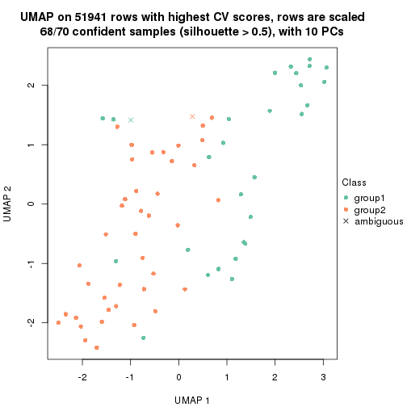</p>

</div>
<div id='tab-CV-NMF-dimension-reduction-2'>
<pre><code class="r">dimension_reduction(res, k = 3, method = &quot;UMAP&quot;)
</code></pre>

<p></p>

</div>
<div id='tab-CV-NMF-dimension-reduction-3'>
<pre><code class="r">dimension_reduction(res, k = 4, method = &quot;UMAP&quot;)
</code></pre>

<p></p>

</div>
<div id='tab-CV-NMF-dimension-reduction-4'>
<pre><code class="r">dimension_reduction(res, k = 5, method = &quot;UMAP&quot;)
</code></pre>

<p></p>

</div>
<div id='tab-CV-NMF-dimension-reduction-5'>
<pre><code class="r">dimension_reduction(res, k = 6, method = &quot;UMAP&quot;)
</code></pre>

<p></p>

</div>
</div>


Following heatmap shows how subgroups are split when increasing `k`:

```r
collect_classes(res)
```


Test correlation between subgroups and known annotations. If the known
annotation is numeric, one-way ANOVA test is applied, and if the known
annotation is discrete, chi-squared contingency table test is applied.

```r
test_to_known_factors(res)
```

```
#>         n disease.state(p) k
#> CV:NMF 68           0.0619 2
#> CV:NMF 45           0.1935 3
#> CV:NMF 27           0.2588 4
#> CV:NMF 45           0.0401 5
#> CV:NMF 54           0.0236 6
```


If matrix rows can be associated to genes, consider to use `GO_Enrichment(res,
...)` to perform function enrichment for the signature genes.


 

---------------------------------------------------


### MAD:hclust


The object with results only for a single top-value method and a single partition method 
can be extracted as:

```r
res = res_list["MAD", "hclust"]
# you can also extract it by
# res = res_list["MAD:hclust"]
```

A summary of `res` and all the functions that can be applied to it:

```r
res
```

```
#> A 'ConsensusPartition' object with k = 2, 3, 4, 5, 6.
#>   On a matrix with 51941 rows and 70 columns.
#>   Top rows (1000, 2000, 3000, 4000, 5000) are extracted by 'MAD' method.
#>   Subgroups are detected by 'hclust' method.
#>   Performed in total 1250 partitions by row resampling.
#>   Best k for subgroups seems to be 3.
#> 
#> Following methods can be applied to this 'ConsensusPartition' object:
#>  [1] "cola_report"             "collect_classes"         "collect_plots"          
#>  [4] "collect_stats"           "colnames"                "compare_signatures"     
#>  [7] "consensus_heatmap"       "dimension_reduction"     "functional_enrichment"  
#> [10] "get_anno_col"            "get_anno"                "get_classes"            
#> [13] "get_consensus"           "get_matrix"              "get_membership"         
#> [16] "get_param"               "get_signatures"          "get_stats"              
#> [19] "is_best_k"               "is_stable_k"             "membership_heatmap"     
#> [22] "ncol"                    "nrow"                    "plot_ecdf"              
#> [25] "rownames"                "select_partition_number" "show"                   
#> [28] "suggest_best_k"          "test_to_known_factors"
```

`collect_plots()` function collects all the plots made from `res` for all `k` (number of partitions)
into one single page to provide an easy and fast comparison between different `k`.

```r
collect_plots(res)
```


The plots are:

- The first row: a plot of the ECDF (Empirical cumulative distribution
  function) curves of the consensus matrix for each `k` and the heatmap of
  predicted classes for each `k`.
- The second row: heatmaps of the consensus matrix for each `k`.
- The third row: heatmaps of the membership matrix for each `k`.
- The fouth row: heatmaps of the signatures for each `k`.

All the plots in panels can be made by individual functions and they are
plotted later in this section.

`select_partition_number()` produces several plots showing different
statistics for choosing "optimized" `k`. There are following statistics:

- ECDF curves of the consensus matrix for each `k`;
- 1-PAC. [The PAC
  score](https://en.wikipedia.org/wiki/Consensus_clustering#Over-interpretation_potential_of_consensus_clustering)
  measures the proportion of the ambiguous subgrouping.
- Mean silhouette score.
- Concordance. The mean probability of fiting the consensus class ids in all
  partitions.
- Area increased. Denote $A_k$ as the area under the ECDF curve for current
  `k`, the area increased is defined as $A_k - A_{k-1}$.
- Rand index. The percent of pairs of samples that are both in a same cluster
  or both are not in a same cluster in the partition of k and k-1.
- Jaccard index. The ratio of pairs of samples are both in a same cluster in
  the partition of k and k-1 and the pairs of samples are both in a same
  cluster in the partition k or k-1.

The detailed explanations of these statistics can be found in [the cola
vignette](http://bioconductor.org/packages/devel/bioc/vignettes/cola/inst/doc/cola.html#toc_13).

Generally speaking, lower PAC score, higher mean silhouette score or higher
concordance corresponds to better partition. Rand index and Jaccard index
measure how similar the current partition is compared to partition with `k-1`.
If they are too similar, we won't accept `k` is better than `k-1`.

```r
select_partition_number(res)
```


The numeric values for all these statistics can be obtained by `get_stats()`.

```r
get_stats(res)
```

```
#>   k 1-PAC mean_silhouette concordance area_increased  Rand Jaccard
#> 2 2 0.125           0.665       0.778         0.4519 0.526   0.526
#> 3 3 0.415           0.691       0.820         0.4069 0.810   0.639
#> 4 4 0.516           0.474       0.720         0.1347 0.902   0.733
#> 5 5 0.570           0.425       0.676         0.0739 0.854   0.567
#> 6 6 0.642           0.386       0.664         0.0446 0.860   0.507
```

`suggest_best_k()` suggests the best $k$ based on these statistics. The rules are as follows:

- All $k$ with Jaccard index larger than 0.95 are removed because the increase of
  the partition number does not provides enough extra information. If all $k$ are removed,
  the best $k$ is assigned by `NA`.
- For $k$ with 1-PAC larger than 0.9, the maximal $k$ is taken as the "best k". Other $k$ is called "optional k".
- If it does not fit the second rule. The $k$ with the highest vote of highest
  1-PAC, mean silhouette and concordance is taken as the "best k".

```r
suggest_best_k(res)
```

```
#> [1] 3
```


Following shows the table of the partitions (You need to click the **show/hide
code output** link to see it). The membership matrix (columns with name `p*`)
is inferred by
[`clue::cl_consensus()`](https://www.rdocumentation.org/link/cl_consensus?package=clue)
function with the `SE` method. Basically the value in the membership matrix
represents the probability to belong to a certain group. The finall class
label for an item is determined with the group with highest probability it
belongs to.

In `get_classes()` function, the entropy is calculated from the membership
matrix and the silhouette score is calculated from the consensus matrix.


<script>
$( function() {
	$( '#tabs-MAD-hclust-get-classes' ).tabs();
} );
</script>
<div id='tabs-MAD-hclust-get-classes'>
<ul>
<li><a href='#tab-MAD-hclust-get-classes-1'>k = 2</a></li>
<li><a href='#tab-MAD-hclust-get-classes-2'>k = 3</a></li>
<li><a href='#tab-MAD-hclust-get-classes-3'>k = 4</a></li>
<li><a href='#tab-MAD-hclust-get-classes-4'>k = 5</a></li>
<li><a href='#tab-MAD-hclust-get-classes-5'>k = 6</a></li>
</ul>

<div id='tab-MAD-hclust-get-classes-1'>
<p><a id='tab-MAD-hclust-get-classes-1-a' style='color:#0366d6' href='#'>show/hide code output</a></p>
<pre><code class="r">cbind(get_classes(res, k = 2), get_membership(res, k = 2))
</code></pre>

<pre><code>#&gt;            class entropy silhouette    p1    p2
#&gt; GSM1299517     2   0.876      0.653 0.296 0.704
#&gt; GSM1299518     2   0.738      0.646 0.208 0.792
#&gt; GSM1299519     2   0.730      0.703 0.204 0.796
#&gt; GSM1299520     1   0.224      0.845 0.964 0.036
#&gt; GSM1299521     1   0.402      0.807 0.920 0.080
#&gt; GSM1299522     2   0.730      0.703 0.204 0.796
#&gt; GSM1299523     1   0.224      0.845 0.964 0.036
#&gt; GSM1299524     2   0.821      0.699 0.256 0.744
#&gt; GSM1299525     2   0.904      0.612 0.320 0.680
#&gt; GSM1299526     2   0.844      0.704 0.272 0.728
#&gt; GSM1299527     2   0.722      0.617 0.200 0.800
#&gt; GSM1299528     2   0.981      0.452 0.420 0.580
#&gt; GSM1299529     2   0.961      0.524 0.384 0.616
#&gt; GSM1299530     1   0.224      0.845 0.964 0.036
#&gt; GSM1299531     2   0.730      0.703 0.204 0.796
#&gt; GSM1299575     1   0.141      0.843 0.980 0.020
#&gt; GSM1299532     2   0.671      0.652 0.176 0.824
#&gt; GSM1299533     2   0.767      0.702 0.224 0.776
#&gt; GSM1299534     2   0.722      0.691 0.200 0.800
#&gt; GSM1299535     2   0.730      0.716 0.204 0.796
#&gt; GSM1299536     2   0.975      0.470 0.408 0.592
#&gt; GSM1299537     2   0.808      0.607 0.248 0.752
#&gt; GSM1299538     2   0.985      0.435 0.428 0.572
#&gt; GSM1299539     2   0.987      0.426 0.432 0.568
#&gt; GSM1299540     2   0.921      0.523 0.336 0.664
#&gt; GSM1299541     2   0.808      0.607 0.248 0.752
#&gt; GSM1299542     2   0.722      0.617 0.200 0.800
#&gt; GSM1299543     2   0.706      0.697 0.192 0.808
#&gt; GSM1299544     2   0.917      0.599 0.332 0.668
#&gt; GSM1299545     1   0.184      0.839 0.972 0.028
#&gt; GSM1299546     2   0.730      0.703 0.204 0.796
#&gt; GSM1299547     1   0.662      0.718 0.828 0.172
#&gt; GSM1299548     2   0.961      0.562 0.384 0.616
#&gt; GSM1299549     1   0.891      0.395 0.692 0.308
#&gt; GSM1299550     2   0.975      0.470 0.408 0.592
#&gt; GSM1299551     2   0.730      0.703 0.204 0.796
#&gt; GSM1299552     1   0.891      0.395 0.692 0.308
#&gt; GSM1299553     1   0.506      0.775 0.888 0.112
#&gt; GSM1299554     2   0.991      0.391 0.444 0.556
#&gt; GSM1299555     2   0.921      0.523 0.336 0.664
#&gt; GSM1299556     2   0.808      0.607 0.248 0.752
#&gt; GSM1299557     1   0.891      0.395 0.692 0.308
#&gt; GSM1299558     2   0.706      0.697 0.192 0.808
#&gt; GSM1299559     2   0.808      0.607 0.248 0.752
#&gt; GSM1299560     2   0.722      0.617 0.200 0.800
#&gt; GSM1299576     1   0.141      0.843 0.980 0.020
#&gt; GSM1299577     1   0.373      0.820 0.928 0.072
#&gt; GSM1299561     2   0.738      0.646 0.208 0.792
#&gt; GSM1299562     2   0.760      0.696 0.220 0.780
#&gt; GSM1299563     1   0.662      0.718 0.828 0.172
#&gt; GSM1299564     1   0.730      0.652 0.796 0.204
#&gt; GSM1299565     2   0.844      0.704 0.272 0.728
#&gt; GSM1299566     2   0.981      0.452 0.420 0.580
#&gt; GSM1299567     1   0.904      0.438 0.680 0.320
#&gt; GSM1299568     2   0.833      0.695 0.264 0.736
#&gt; GSM1299569     2   0.921      0.601 0.336 0.664
#&gt; GSM1299570     1   0.224      0.845 0.964 0.036
#&gt; GSM1299571     2   0.821      0.707 0.256 0.744
#&gt; GSM1299572     2   0.881      0.665 0.300 0.700
#&gt; GSM1299573     2   0.671      0.673 0.176 0.824
#&gt; GSM1299574     2   0.730      0.703 0.204 0.796
#&gt; GSM1299578     1   0.141      0.843 0.980 0.020
#&gt; GSM1299579     1   0.722      0.658 0.800 0.200
#&gt; GSM1299580     1   0.141      0.843 0.980 0.020
#&gt; GSM1299581     1   0.141      0.843 0.980 0.020
#&gt; GSM1299582     1   0.141      0.843 0.980 0.020
#&gt; GSM1299583     1   0.278      0.833 0.952 0.048
#&gt; GSM1299584     1   0.141      0.843 0.980 0.020
#&gt; GSM1299585     1   0.402      0.807 0.920 0.080
#&gt; GSM1299586     1   0.141      0.843 0.980 0.020
</code></pre>

<script>
$('#tab-MAD-hclust-get-classes-1-a').parent().next().next().hide();
$('#tab-MAD-hclust-get-classes-1-a').click(function(){
  $('#tab-MAD-hclust-get-classes-1-a').parent().next().next().toggle();
  return(false);
});
</script>
</div>

<div id='tab-MAD-hclust-get-classes-2'>
<p><a id='tab-MAD-hclust-get-classes-2-a' style='color:#0366d6' href='#'>show/hide code output</a></p>
<pre><code class="r">cbind(get_classes(res, k = 3), get_membership(res, k = 3))
</code></pre>

<pre><code>#&gt;            class entropy silhouette    p1    p2    p3
#&gt; GSM1299517     3  0.6349      0.674 0.080 0.156 0.764
#&gt; GSM1299518     3  0.4539      0.779 0.016 0.148 0.836
#&gt; GSM1299519     2  0.3116      0.752 0.000 0.892 0.108
#&gt; GSM1299520     1  0.2200      0.848 0.940 0.056 0.004
#&gt; GSM1299521     1  0.3551      0.821 0.868 0.132 0.000
#&gt; GSM1299522     2  0.3116      0.752 0.000 0.892 0.108
#&gt; GSM1299523     1  0.2301      0.848 0.936 0.060 0.004
#&gt; GSM1299524     2  0.6853      0.685 0.064 0.712 0.224
#&gt; GSM1299525     2  0.4945      0.760 0.104 0.840 0.056
#&gt; GSM1299526     2  0.5465      0.578 0.000 0.712 0.288
#&gt; GSM1299527     3  0.3267      0.784 0.000 0.116 0.884
#&gt; GSM1299528     2  0.4062      0.718 0.164 0.836 0.000
#&gt; GSM1299529     2  0.4679      0.736 0.148 0.832 0.020
#&gt; GSM1299530     1  0.2301      0.848 0.936 0.060 0.004
#&gt; GSM1299531     2  0.3116      0.752 0.000 0.892 0.108
#&gt; GSM1299575     1  0.0000      0.845 1.000 0.000 0.000
#&gt; GSM1299532     3  0.4750      0.741 0.000 0.216 0.784
#&gt; GSM1299533     3  0.6587      0.341 0.008 0.424 0.568
#&gt; GSM1299534     2  0.6822     -0.160 0.012 0.508 0.480
#&gt; GSM1299535     2  0.6161      0.576 0.020 0.708 0.272
#&gt; GSM1299536     2  0.3941      0.719 0.156 0.844 0.000
#&gt; GSM1299537     3  0.0892      0.762 0.020 0.000 0.980
#&gt; GSM1299538     2  0.4346      0.700 0.184 0.816 0.000
#&gt; GSM1299539     2  0.4399      0.696 0.188 0.812 0.000
#&gt; GSM1299540     3  0.6662      0.723 0.120 0.128 0.752
#&gt; GSM1299541     3  0.0892      0.762 0.020 0.000 0.980
#&gt; GSM1299542     3  0.3267      0.784 0.000 0.116 0.884
#&gt; GSM1299543     2  0.2878      0.754 0.000 0.904 0.096
#&gt; GSM1299544     2  0.4609      0.759 0.092 0.856 0.052
#&gt; GSM1299545     1  0.0424      0.842 0.992 0.000 0.008
#&gt; GSM1299546     2  0.3116      0.752 0.000 0.892 0.108
#&gt; GSM1299547     1  0.5178      0.723 0.744 0.256 0.000
#&gt; GSM1299548     2  0.9067      0.174 0.140 0.476 0.384
#&gt; GSM1299549     1  0.7043      0.387 0.576 0.400 0.024
#&gt; GSM1299550     2  0.3879      0.721 0.152 0.848 0.000
#&gt; GSM1299551     2  0.3116      0.752 0.000 0.892 0.108
#&gt; GSM1299552     1  0.7043      0.387 0.576 0.400 0.024
#&gt; GSM1299553     1  0.3425      0.817 0.884 0.112 0.004
#&gt; GSM1299554     2  0.5331      0.681 0.184 0.792 0.024
#&gt; GSM1299555     3  0.6662      0.723 0.120 0.128 0.752
#&gt; GSM1299556     3  0.0892      0.762 0.020 0.000 0.980
#&gt; GSM1299557     1  0.7043      0.387 0.576 0.400 0.024
#&gt; GSM1299558     2  0.2959      0.754 0.000 0.900 0.100
#&gt; GSM1299559     3  0.0892      0.762 0.020 0.000 0.980
#&gt; GSM1299560     3  0.3340      0.785 0.000 0.120 0.880
#&gt; GSM1299576     1  0.0000      0.845 1.000 0.000 0.000
#&gt; GSM1299577     1  0.3551      0.821 0.868 0.132 0.000
#&gt; GSM1299561     3  0.4539      0.779 0.016 0.148 0.836
#&gt; GSM1299562     3  0.6688      0.385 0.012 0.408 0.580
#&gt; GSM1299563     1  0.5178      0.723 0.744 0.256 0.000
#&gt; GSM1299564     1  0.5431      0.692 0.716 0.284 0.000
#&gt; GSM1299565     2  0.5465      0.578 0.000 0.712 0.288
#&gt; GSM1299566     2  0.4062      0.718 0.164 0.836 0.000
#&gt; GSM1299567     1  0.6267      0.174 0.548 0.000 0.452
#&gt; GSM1299568     2  0.6488      0.718 0.064 0.744 0.192
#&gt; GSM1299569     2  0.4807      0.758 0.092 0.848 0.060
#&gt; GSM1299570     1  0.2301      0.848 0.936 0.060 0.004
#&gt; GSM1299571     2  0.4842      0.637 0.000 0.776 0.224
#&gt; GSM1299572     3  0.9594      0.297 0.204 0.360 0.436
#&gt; GSM1299573     3  0.6298      0.491 0.004 0.388 0.608
#&gt; GSM1299574     2  0.3116      0.752 0.000 0.892 0.108
#&gt; GSM1299578     1  0.0000      0.845 1.000 0.000 0.000
#&gt; GSM1299579     1  0.5178      0.702 0.744 0.256 0.000
#&gt; GSM1299580     1  0.0000      0.845 1.000 0.000 0.000
#&gt; GSM1299581     1  0.0000      0.845 1.000 0.000 0.000
#&gt; GSM1299582     1  0.0000      0.845 1.000 0.000 0.000
#&gt; GSM1299583     1  0.2066      0.844 0.940 0.060 0.000
#&gt; GSM1299584     1  0.0000      0.845 1.000 0.000 0.000
#&gt; GSM1299585     1  0.3551      0.821 0.868 0.132 0.000
#&gt; GSM1299586     1  0.0000      0.845 1.000 0.000 0.000
</code></pre>

<script>
$('#tab-MAD-hclust-get-classes-2-a').parent().next().next().hide();
$('#tab-MAD-hclust-get-classes-2-a').click(function(){
  $('#tab-MAD-hclust-get-classes-2-a').parent().next().next().toggle();
  return(false);
});
</script>
</div>

<div id='tab-MAD-hclust-get-classes-3'>
<p><a id='tab-MAD-hclust-get-classes-3-a' style='color:#0366d6' href='#'>show/hide code output</a></p>
<pre><code class="r">cbind(get_classes(res, k = 4), get_membership(res, k = 4))
</code></pre>

<pre><code>#&gt;            class entropy silhouette    p1    p2    p3    p4
#&gt; GSM1299517     3  0.5000    0.48818 0.000 0.128 0.772 0.100
#&gt; GSM1299518     3  0.7008    0.66403 0.000 0.160 0.564 0.276
#&gt; GSM1299519     2  0.0000    0.52540 0.000 1.000 0.000 0.000
#&gt; GSM1299520     1  0.3232    0.81094 0.872 0.016 0.004 0.108
#&gt; GSM1299521     1  0.4436    0.78018 0.800 0.052 0.000 0.148
#&gt; GSM1299522     2  0.0469    0.52542 0.000 0.988 0.000 0.012
#&gt; GSM1299523     1  0.3232    0.81099 0.872 0.016 0.004 0.108
#&gt; GSM1299524     2  0.5951    0.29639 0.000 0.636 0.064 0.300
#&gt; GSM1299525     2  0.4420    0.34793 0.012 0.748 0.000 0.240
#&gt; GSM1299526     2  0.4605    0.39573 0.000 0.800 0.108 0.092
#&gt; GSM1299527     3  0.6640    0.67838 0.000 0.168 0.624 0.208
#&gt; GSM1299528     2  0.6087    0.01202 0.048 0.540 0.000 0.412
#&gt; GSM1299529     2  0.5793    0.16238 0.048 0.628 0.000 0.324
#&gt; GSM1299530     1  0.3232    0.81099 0.872 0.016 0.004 0.108
#&gt; GSM1299531     2  0.0469    0.52542 0.000 0.988 0.000 0.012
#&gt; GSM1299575     1  0.0000    0.81197 1.000 0.000 0.000 0.000
#&gt; GSM1299532     3  0.7704    0.55623 0.000 0.232 0.432 0.336
#&gt; GSM1299533     2  0.7438   -0.12251 0.000 0.484 0.328 0.188
#&gt; GSM1299534     4  0.6611   -0.06807 0.000 0.456 0.080 0.464
#&gt; GSM1299535     2  0.5325    0.36153 0.000 0.744 0.096 0.160
#&gt; GSM1299536     4  0.5372    0.06961 0.012 0.444 0.000 0.544
#&gt; GSM1299537     3  0.0188    0.66138 0.000 0.000 0.996 0.004
#&gt; GSM1299538     2  0.6400   -0.00517 0.068 0.524 0.000 0.408
#&gt; GSM1299539     2  0.6458   -0.01259 0.072 0.520 0.000 0.408
#&gt; GSM1299540     3  0.8487    0.54966 0.096 0.152 0.536 0.216
#&gt; GSM1299541     3  0.0188    0.66138 0.000 0.000 0.996 0.004
#&gt; GSM1299542     3  0.7084    0.66353 0.000 0.176 0.560 0.264
#&gt; GSM1299543     2  0.1302    0.51533 0.000 0.956 0.000 0.044
#&gt; GSM1299544     2  0.4999    0.26849 0.000 0.660 0.012 0.328
#&gt; GSM1299545     1  0.0672    0.80807 0.984 0.000 0.008 0.008
#&gt; GSM1299546     2  0.0000    0.52540 0.000 1.000 0.000 0.000
#&gt; GSM1299547     1  0.5785    0.69882 0.664 0.064 0.000 0.272
#&gt; GSM1299548     4  0.8047    0.18031 0.012 0.212 0.368 0.408
#&gt; GSM1299549     1  0.7877    0.26773 0.452 0.212 0.008 0.328
#&gt; GSM1299550     4  0.5132    0.06799 0.004 0.448 0.000 0.548
#&gt; GSM1299551     2  0.0000    0.52540 0.000 1.000 0.000 0.000
#&gt; GSM1299552     1  0.7877    0.26773 0.452 0.212 0.008 0.328
#&gt; GSM1299553     1  0.3328    0.77961 0.872 0.024 0.004 0.100
#&gt; GSM1299554     4  0.5334    0.15170 0.012 0.364 0.004 0.620
#&gt; GSM1299555     3  0.8487    0.54966 0.096 0.152 0.536 0.216
#&gt; GSM1299556     3  0.0000    0.66301 0.000 0.000 1.000 0.000
#&gt; GSM1299557     1  0.7877    0.26773 0.452 0.212 0.008 0.328
#&gt; GSM1299558     2  0.2271    0.50407 0.000 0.916 0.008 0.076
#&gt; GSM1299559     3  0.0000    0.66301 0.000 0.000 1.000 0.000
#&gt; GSM1299560     3  0.7105    0.66192 0.000 0.176 0.556 0.268
#&gt; GSM1299576     1  0.0000    0.81197 1.000 0.000 0.000 0.000
#&gt; GSM1299577     1  0.4204    0.78217 0.788 0.020 0.000 0.192
#&gt; GSM1299561     3  0.7008    0.66403 0.000 0.160 0.564 0.276
#&gt; GSM1299562     2  0.7771   -0.22304 0.000 0.432 0.292 0.276
#&gt; GSM1299563     1  0.5785    0.69882 0.664 0.064 0.000 0.272
#&gt; GSM1299564     1  0.5530    0.67496 0.632 0.032 0.000 0.336
#&gt; GSM1299565     2  0.4605    0.39573 0.000 0.800 0.108 0.092
#&gt; GSM1299566     2  0.6087    0.01202 0.048 0.540 0.000 0.412
#&gt; GSM1299567     1  0.5594    0.15763 0.520 0.000 0.460 0.020
#&gt; GSM1299568     2  0.5599    0.33010 0.000 0.664 0.048 0.288
#&gt; GSM1299569     2  0.5323    0.22909 0.000 0.628 0.020 0.352
#&gt; GSM1299570     1  0.3232    0.81099 0.872 0.016 0.004 0.108
#&gt; GSM1299571     2  0.3542    0.43538 0.000 0.864 0.060 0.076
#&gt; GSM1299572     2  0.9836   -0.22472 0.196 0.340 0.244 0.220
#&gt; GSM1299573     4  0.7782   -0.34844 0.000 0.360 0.244 0.396
#&gt; GSM1299574     2  0.0000    0.52540 0.000 1.000 0.000 0.000
#&gt; GSM1299578     1  0.0000    0.81197 1.000 0.000 0.000 0.000
#&gt; GSM1299579     1  0.6339    0.62856 0.656 0.148 0.000 0.196
#&gt; GSM1299580     1  0.0000    0.81197 1.000 0.000 0.000 0.000
#&gt; GSM1299581     1  0.0707    0.81409 0.980 0.000 0.000 0.020
#&gt; GSM1299582     1  0.0000    0.81197 1.000 0.000 0.000 0.000
#&gt; GSM1299583     1  0.2443    0.81096 0.916 0.024 0.000 0.060
#&gt; GSM1299584     1  0.0000    0.81197 1.000 0.000 0.000 0.000
#&gt; GSM1299585     1  0.4436    0.78018 0.800 0.052 0.000 0.148
#&gt; GSM1299586     1  0.0000    0.81197 1.000 0.000 0.000 0.000
</code></pre>

<script>
$('#tab-MAD-hclust-get-classes-3-a').parent().next().next().hide();
$('#tab-MAD-hclust-get-classes-3-a').click(function(){
  $('#tab-MAD-hclust-get-classes-3-a').parent().next().next().toggle();
  return(false);
});
</script>
</div>

<div id='tab-MAD-hclust-get-classes-4'>
<p><a id='tab-MAD-hclust-get-classes-4-a' style='color:#0366d6' href='#'>show/hide code output</a></p>
<pre><code class="r">cbind(get_classes(res, k = 5), get_membership(res, k = 5))
</code></pre>

<pre><code>#&gt;            class entropy silhouette    p1    p2    p3    p4    p5
#&gt; GSM1299517     3  0.7257    -0.0907 0.000 0.052 0.472 0.312 0.164
#&gt; GSM1299518     3  0.3319     0.2633 0.000 0.016 0.848 0.116 0.020
#&gt; GSM1299519     2  0.0162     0.7049 0.000 0.996 0.004 0.000 0.000
#&gt; GSM1299520     1  0.4322     0.7758 0.768 0.000 0.000 0.088 0.144
#&gt; GSM1299521     1  0.4554     0.7322 0.736 0.016 0.000 0.032 0.216
#&gt; GSM1299522     2  0.0404     0.7001 0.000 0.988 0.000 0.000 0.012
#&gt; GSM1299523     1  0.4334     0.7765 0.768 0.000 0.000 0.092 0.140
#&gt; GSM1299524     2  0.8024     0.1368 0.000 0.396 0.136 0.156 0.312
#&gt; GSM1299525     2  0.4029     0.2812 0.004 0.680 0.000 0.000 0.316
#&gt; GSM1299526     2  0.4190     0.6198 0.000 0.768 0.060 0.172 0.000
#&gt; GSM1299527     3  0.2249     0.2495 0.000 0.008 0.896 0.096 0.000
#&gt; GSM1299528     5  0.4935     0.4565 0.040 0.344 0.000 0.000 0.616
#&gt; GSM1299529     2  0.5265    -0.1044 0.040 0.544 0.000 0.004 0.412
#&gt; GSM1299530     1  0.4334     0.7765 0.768 0.000 0.000 0.092 0.140
#&gt; GSM1299531     2  0.0566     0.7014 0.000 0.984 0.000 0.004 0.012
#&gt; GSM1299575     1  0.0162     0.8021 0.996 0.000 0.000 0.004 0.000
#&gt; GSM1299532     3  0.2949     0.2554 0.000 0.028 0.884 0.064 0.024
#&gt; GSM1299533     2  0.6712    -0.1478 0.000 0.416 0.260 0.324 0.000
#&gt; GSM1299534     3  0.7429     0.0979 0.000 0.164 0.504 0.248 0.084
#&gt; GSM1299535     2  0.6835     0.4515 0.000 0.600 0.136 0.092 0.172
#&gt; GSM1299536     5  0.3211     0.5262 0.004 0.164 0.000 0.008 0.824
#&gt; GSM1299537     3  0.4307    -0.2550 0.000 0.000 0.500 0.500 0.000
#&gt; GSM1299538     5  0.5145     0.4685 0.056 0.332 0.000 0.000 0.612
#&gt; GSM1299539     5  0.5338     0.4711 0.060 0.328 0.000 0.004 0.608
#&gt; GSM1299540     4  0.6272     0.4660 0.036 0.056 0.380 0.524 0.004
#&gt; GSM1299541     4  0.4307    -0.1690 0.000 0.000 0.500 0.500 0.000
#&gt; GSM1299542     3  0.0898     0.2914 0.000 0.008 0.972 0.020 0.000
#&gt; GSM1299543     2  0.1197     0.6780 0.000 0.952 0.000 0.000 0.048
#&gt; GSM1299544     5  0.5555     0.0668 0.000 0.452 0.000 0.068 0.480
#&gt; GSM1299545     1  0.1671     0.7858 0.924 0.000 0.000 0.076 0.000
#&gt; GSM1299546     2  0.0162     0.7049 0.000 0.996 0.004 0.000 0.000
#&gt; GSM1299547     1  0.5126     0.6305 0.600 0.004 0.000 0.040 0.356
#&gt; GSM1299548     5  0.6537     0.0299 0.000 0.012 0.232 0.212 0.544
#&gt; GSM1299549     5  0.6841    -0.0142 0.428 0.084 0.004 0.048 0.436
#&gt; GSM1299550     5  0.3203     0.5221 0.000 0.168 0.000 0.012 0.820
#&gt; GSM1299551     2  0.0162     0.7049 0.000 0.996 0.004 0.000 0.000
#&gt; GSM1299552     5  0.6841    -0.0142 0.428 0.084 0.004 0.048 0.436
#&gt; GSM1299553     1  0.3069     0.7449 0.864 0.016 0.000 0.016 0.104
#&gt; GSM1299554     5  0.3757     0.4933 0.000 0.088 0.008 0.076 0.828
#&gt; GSM1299555     4  0.6272     0.4660 0.036 0.056 0.380 0.524 0.004
#&gt; GSM1299556     3  0.4307    -0.2502 0.000 0.000 0.504 0.496 0.000
#&gt; GSM1299557     5  0.6841    -0.0142 0.428 0.084 0.004 0.048 0.436
#&gt; GSM1299558     2  0.2438     0.6593 0.000 0.900 0.000 0.040 0.060
#&gt; GSM1299559     3  0.4307    -0.2502 0.000 0.000 0.504 0.496 0.000
#&gt; GSM1299560     3  0.0798     0.2923 0.000 0.008 0.976 0.016 0.000
#&gt; GSM1299576     1  0.0324     0.8026 0.992 0.000 0.000 0.004 0.004
#&gt; GSM1299577     1  0.5284     0.7184 0.660 0.000 0.000 0.104 0.236
#&gt; GSM1299561     3  0.3319     0.2633 0.000 0.016 0.848 0.116 0.020
#&gt; GSM1299562     3  0.7344    -0.1429 0.000 0.312 0.364 0.300 0.024
#&gt; GSM1299563     1  0.5126     0.6305 0.600 0.004 0.000 0.040 0.356
#&gt; GSM1299564     1  0.5255     0.5872 0.560 0.000 0.000 0.052 0.388
#&gt; GSM1299565     2  0.4190     0.6198 0.000 0.768 0.060 0.172 0.000
#&gt; GSM1299566     5  0.4935     0.4565 0.040 0.344 0.000 0.000 0.616
#&gt; GSM1299567     1  0.6108    -0.0491 0.456 0.000 0.108 0.432 0.004
#&gt; GSM1299568     2  0.7803     0.1629 0.000 0.424 0.112 0.148 0.316
#&gt; GSM1299569     5  0.6328     0.1750 0.000 0.376 0.012 0.116 0.496
#&gt; GSM1299570     1  0.4334     0.7765 0.768 0.000 0.000 0.092 0.140
#&gt; GSM1299571     2  0.3262     0.6525 0.000 0.840 0.036 0.124 0.000
#&gt; GSM1299572     3  0.9494    -0.0956 0.172 0.172 0.356 0.196 0.104
#&gt; GSM1299573     3  0.6246     0.1078 0.000 0.080 0.604 0.268 0.048
#&gt; GSM1299574     2  0.0162     0.7049 0.000 0.996 0.004 0.000 0.000
#&gt; GSM1299578     1  0.0324     0.8026 0.992 0.000 0.000 0.004 0.004
#&gt; GSM1299579     1  0.6073     0.5330 0.612 0.088 0.000 0.032 0.268
#&gt; GSM1299580     1  0.0162     0.8021 0.996 0.000 0.000 0.004 0.000
#&gt; GSM1299581     1  0.0671     0.8047 0.980 0.000 0.000 0.004 0.016
#&gt; GSM1299582     1  0.0162     0.8021 0.996 0.000 0.000 0.004 0.000
#&gt; GSM1299583     1  0.2414     0.7947 0.900 0.008 0.000 0.012 0.080
#&gt; GSM1299584     1  0.0162     0.8021 0.996 0.000 0.000 0.004 0.000
#&gt; GSM1299585     1  0.4554     0.7322 0.736 0.016 0.000 0.032 0.216
#&gt; GSM1299586     1  0.0324     0.8026 0.992 0.000 0.000 0.004 0.004
</code></pre>

<script>
$('#tab-MAD-hclust-get-classes-4-a').parent().next().next().hide();
$('#tab-MAD-hclust-get-classes-4-a').click(function(){
  $('#tab-MAD-hclust-get-classes-4-a').parent().next().next().toggle();
  return(false);
});
</script>
</div>

<div id='tab-MAD-hclust-get-classes-5'>
<p><a id='tab-MAD-hclust-get-classes-5-a' style='color:#0366d6' href='#'>show/hide code output</a></p>
<pre><code class="r">cbind(get_classes(res, k = 6), get_membership(res, k = 6))
</code></pre>

<pre><code>#&gt;            class entropy silhouette    p1    p2    p3    p4    p5    p6
#&gt; GSM1299517     3  0.4130     0.4004 0.000 0.044 0.760 0.004 0.016 0.176
#&gt; GSM1299518     3  0.4400     0.3374 0.000 0.000 0.524 0.456 0.008 0.012
#&gt; GSM1299519     2  0.0000     0.7034 0.000 1.000 0.000 0.000 0.000 0.000
#&gt; GSM1299520     1  0.5287     0.6082 0.636 0.000 0.000 0.080 0.252 0.032
#&gt; GSM1299521     1  0.4203     0.5229 0.608 0.008 0.000 0.004 0.376 0.004
#&gt; GSM1299522     2  0.0508     0.6996 0.000 0.984 0.000 0.000 0.012 0.004
#&gt; GSM1299523     1  0.5287     0.6092 0.636 0.000 0.000 0.080 0.252 0.032
#&gt; GSM1299524     6  0.5965     0.4240 0.000 0.272 0.004 0.152 0.020 0.552
#&gt; GSM1299525     2  0.4869     0.3255 0.000 0.628 0.000 0.000 0.276 0.096
#&gt; GSM1299526     2  0.4687     0.5807 0.000 0.760 0.076 0.088 0.008 0.068
#&gt; GSM1299527     3  0.4084     0.3991 0.000 0.000 0.588 0.400 0.000 0.012
#&gt; GSM1299528     5  0.6135     0.2393 0.016 0.248 0.000 0.000 0.500 0.236
#&gt; GSM1299529     2  0.5913     0.0552 0.016 0.492 0.000 0.004 0.368 0.120
#&gt; GSM1299530     1  0.5287     0.6092 0.636 0.000 0.000 0.080 0.252 0.032
#&gt; GSM1299531     2  0.0725     0.7005 0.000 0.976 0.000 0.000 0.012 0.012
#&gt; GSM1299575     1  0.0000     0.7106 1.000 0.000 0.000 0.000 0.000 0.000
#&gt; GSM1299532     4  0.4273    -0.2787 0.000 0.000 0.380 0.596 0.000 0.024
#&gt; GSM1299533     2  0.7344    -0.1695 0.000 0.408 0.160 0.312 0.012 0.108
#&gt; GSM1299534     4  0.4550     0.2801 0.000 0.044 0.008 0.692 0.008 0.248
#&gt; GSM1299535     2  0.5447     0.2242 0.000 0.580 0.000 0.152 0.004 0.264
#&gt; GSM1299536     5  0.4652     0.1082 0.000 0.072 0.000 0.000 0.640 0.288
#&gt; GSM1299537     3  0.0458     0.5218 0.000 0.000 0.984 0.016 0.000 0.000
#&gt; GSM1299538     5  0.6427     0.2548 0.028 0.236 0.000 0.004 0.496 0.236
#&gt; GSM1299539     5  0.6456     0.2558 0.032 0.232 0.000 0.004 0.500 0.232
#&gt; GSM1299540     4  0.6957     0.3290 0.012 0.044 0.312 0.484 0.020 0.128
#&gt; GSM1299541     3  0.0458     0.5218 0.000 0.000 0.984 0.016 0.000 0.000
#&gt; GSM1299542     3  0.4181     0.3403 0.000 0.000 0.512 0.476 0.000 0.012
#&gt; GSM1299543     2  0.1285     0.6783 0.000 0.944 0.000 0.000 0.052 0.004
#&gt; GSM1299544     2  0.6611    -0.2379 0.000 0.344 0.000 0.024 0.320 0.312
#&gt; GSM1299545     1  0.1951     0.6845 0.908 0.000 0.000 0.076 0.000 0.016
#&gt; GSM1299546     2  0.0000     0.7034 0.000 1.000 0.000 0.000 0.000 0.000
#&gt; GSM1299547     5  0.4454    -0.4267 0.476 0.004 0.000 0.008 0.504 0.008
#&gt; GSM1299548     6  0.6101     0.0993 0.000 0.004 0.360 0.008 0.176 0.452
#&gt; GSM1299549     1  0.6878     0.1825 0.412 0.060 0.000 0.000 0.228 0.300
#&gt; GSM1299550     5  0.4751     0.0707 0.000 0.072 0.000 0.000 0.616 0.312
#&gt; GSM1299551     2  0.0000     0.7034 0.000 1.000 0.000 0.000 0.000 0.000
#&gt; GSM1299552     1  0.6878     0.1825 0.412 0.060 0.000 0.000 0.228 0.300
#&gt; GSM1299553     1  0.3331     0.6293 0.840 0.016 0.000 0.008 0.104 0.032
#&gt; GSM1299554     6  0.4835     0.2249 0.000 0.048 0.000 0.004 0.408 0.540
#&gt; GSM1299555     4  0.6957     0.3290 0.012 0.044 0.312 0.484 0.020 0.128
#&gt; GSM1299556     3  0.0146     0.5281 0.000 0.000 0.996 0.004 0.000 0.000
#&gt; GSM1299557     1  0.6878     0.1825 0.412 0.060 0.000 0.000 0.228 0.300
#&gt; GSM1299558     2  0.2583     0.6442 0.000 0.884 0.000 0.008 0.056 0.052
#&gt; GSM1299559     3  0.0146     0.5281 0.000 0.000 0.996 0.004 0.000 0.000
#&gt; GSM1299560     3  0.4183     0.3356 0.000 0.000 0.508 0.480 0.000 0.012
#&gt; GSM1299576     1  0.0146     0.7109 0.996 0.000 0.000 0.000 0.004 0.000
#&gt; GSM1299577     1  0.5662     0.4519 0.484 0.000 0.000 0.084 0.408 0.024
#&gt; GSM1299561     3  0.4400     0.3374 0.000 0.000 0.524 0.456 0.008 0.012
#&gt; GSM1299562     4  0.7094     0.3307 0.000 0.292 0.140 0.464 0.016 0.088
#&gt; GSM1299563     5  0.4454    -0.4267 0.476 0.004 0.000 0.008 0.504 0.008
#&gt; GSM1299564     5  0.4636    -0.3650 0.396 0.000 0.000 0.012 0.568 0.024
#&gt; GSM1299565     2  0.4687     0.5807 0.000 0.760 0.076 0.088 0.008 0.068
#&gt; GSM1299566     5  0.6135     0.2393 0.016 0.248 0.000 0.000 0.500 0.236
#&gt; GSM1299567     3  0.6074    -0.0475 0.432 0.000 0.436 0.096 0.008 0.028
#&gt; GSM1299568     6  0.5719     0.4138 0.000 0.300 0.000 0.124 0.020 0.556
#&gt; GSM1299569     6  0.6551     0.1814 0.000 0.188 0.000 0.048 0.292 0.472
#&gt; GSM1299570     1  0.5287     0.6092 0.636 0.000 0.000 0.080 0.252 0.032
#&gt; GSM1299571     2  0.3632     0.6222 0.000 0.832 0.036 0.080 0.008 0.044
#&gt; GSM1299572     4  0.8953     0.2882 0.152 0.156 0.096 0.408 0.120 0.068
#&gt; GSM1299573     4  0.5129     0.2479 0.000 0.004 0.120 0.644 0.004 0.228
#&gt; GSM1299574     2  0.0000     0.7034 0.000 1.000 0.000 0.000 0.000 0.000
#&gt; GSM1299578     1  0.0146     0.7109 0.996 0.000 0.000 0.000 0.004 0.000
#&gt; GSM1299579     1  0.5542     0.3335 0.496 0.060 0.000 0.004 0.416 0.024
#&gt; GSM1299580     1  0.0000     0.7106 1.000 0.000 0.000 0.000 0.000 0.000
#&gt; GSM1299581     1  0.1007     0.7072 0.956 0.000 0.000 0.000 0.044 0.000
#&gt; GSM1299582     1  0.0000     0.7106 1.000 0.000 0.000 0.000 0.000 0.000
#&gt; GSM1299583     1  0.2700     0.6729 0.836 0.000 0.000 0.004 0.156 0.004
#&gt; GSM1299584     1  0.0000     0.7106 1.000 0.000 0.000 0.000 0.000 0.000
#&gt; GSM1299585     1  0.4203     0.5229 0.608 0.008 0.000 0.004 0.376 0.004
#&gt; GSM1299586     1  0.0146     0.7109 0.996 0.000 0.000 0.000 0.004 0.000
</code></pre>

<script>
$('#tab-MAD-hclust-get-classes-5-a').parent().next().next().hide();
$('#tab-MAD-hclust-get-classes-5-a').click(function(){
  $('#tab-MAD-hclust-get-classes-5-a').parent().next().next().toggle();
  return(false);
});
</script>
</div>
</div>

Heatmaps for the consensus matrix. It visualizes the probability of two
samples to be in a same group.


<script>
$( function() {
	$( '#tabs-MAD-hclust-consensus-heatmap' ).tabs();
} );
</script>
<div id='tabs-MAD-hclust-consensus-heatmap'>
<ul>
<li><a href='#tab-MAD-hclust-consensus-heatmap-1'>k = 2</a></li>
<li><a href='#tab-MAD-hclust-consensus-heatmap-2'>k = 3</a></li>
<li><a href='#tab-MAD-hclust-consensus-heatmap-3'>k = 4</a></li>
<li><a href='#tab-MAD-hclust-consensus-heatmap-4'>k = 5</a></li>
<li><a href='#tab-MAD-hclust-consensus-heatmap-5'>k = 6</a></li>
</ul>
<div id='tab-MAD-hclust-consensus-heatmap-1'>
<pre><code class="r">consensus_heatmap(res, k = 2)
</code></pre>

<p></p>

</div>
<div id='tab-MAD-hclust-consensus-heatmap-2'>
<pre><code class="r">consensus_heatmap(res, k = 3)
</code></pre>

<p></p>

</div>
<div id='tab-MAD-hclust-consensus-heatmap-3'>
<pre><code class="r">consensus_heatmap(res, k = 4)
</code></pre>

<p></p>

</div>
<div id='tab-MAD-hclust-consensus-heatmap-4'>
<pre><code class="r">consensus_heatmap(res, k = 5)
</code></pre>

<p></p>

</div>
<div id='tab-MAD-hclust-consensus-heatmap-5'>
<pre><code class="r">consensus_heatmap(res, k = 6)
</code></pre>

<p></p>

</div>
</div>

Heatmaps for the membership of samples in all partitions to see how consistent they are:


<script>
$( function() {
	$( '#tabs-MAD-hclust-membership-heatmap' ).tabs();
} );
</script>
<div id='tabs-MAD-hclust-membership-heatmap'>
<ul>
<li><a href='#tab-MAD-hclust-membership-heatmap-1'>k = 2</a></li>
<li><a href='#tab-MAD-hclust-membership-heatmap-2'>k = 3</a></li>
<li><a href='#tab-MAD-hclust-membership-heatmap-3'>k = 4</a></li>
<li><a href='#tab-MAD-hclust-membership-heatmap-4'>k = 5</a></li>
<li><a href='#tab-MAD-hclust-membership-heatmap-5'>k = 6</a></li>
</ul>
<div id='tab-MAD-hclust-membership-heatmap-1'>
<pre><code class="r">membership_heatmap(res, k = 2)
</code></pre>

<p></p>

</div>
<div id='tab-MAD-hclust-membership-heatmap-2'>
<pre><code class="r">membership_heatmap(res, k = 3)
</code></pre>

<p></p>

</div>
<div id='tab-MAD-hclust-membership-heatmap-3'>
<pre><code class="r">membership_heatmap(res, k = 4)
</code></pre>

<p></p>

</div>
<div id='tab-MAD-hclust-membership-heatmap-4'>
<pre><code class="r">membership_heatmap(res, k = 5)
</code></pre>

<p></p>

</div>
<div id='tab-MAD-hclust-membership-heatmap-5'>
<pre><code class="r">membership_heatmap(res, k = 6)
</code></pre>

<p></p>

</div>
</div>

As soon as we have had the classes for columns, we can look for signatures
which are significantly different between classes which can be candidate marks
for certain classes. Following are the heatmaps for signatures.


Signature heatmaps where rows are scaled:


<script>
$( function() {
	$( '#tabs-MAD-hclust-get-signatures' ).tabs();
} );
</script>
<div id='tabs-MAD-hclust-get-signatures'>
<ul>
<li><a href='#tab-MAD-hclust-get-signatures-1'>k = 2</a></li>
<li><a href='#tab-MAD-hclust-get-signatures-2'>k = 3</a></li>
<li><a href='#tab-MAD-hclust-get-signatures-3'>k = 4</a></li>
<li><a href='#tab-MAD-hclust-get-signatures-4'>k = 5</a></li>
<li><a href='#tab-MAD-hclust-get-signatures-5'>k = 6</a></li>
</ul>
<div id='tab-MAD-hclust-get-signatures-1'>
<pre><code class="r">get_signatures(res, k = 2)
</code></pre>

<p></p>

</div>
<div id='tab-MAD-hclust-get-signatures-2'>
<pre><code class="r">get_signatures(res, k = 3)
</code></pre>

<p></p>

</div>
<div id='tab-MAD-hclust-get-signatures-3'>
<pre><code class="r">get_signatures(res, k = 4)
</code></pre>

<p></p>

</div>
<div id='tab-MAD-hclust-get-signatures-4'>
<pre><code class="r">get_signatures(res, k = 5)
</code></pre>

<p></p>

</div>
<div id='tab-MAD-hclust-get-signatures-5'>
<pre><code class="r">get_signatures(res, k = 6)
</code></pre>

<p></p>

</div>
</div>


Signature heatmaps where rows are not scaled:


<script>
$( function() {
	$( '#tabs-MAD-hclust-get-signatures-no-scale' ).tabs();
} );
</script>
<div id='tabs-MAD-hclust-get-signatures-no-scale'>
<ul>
<li><a href='#tab-MAD-hclust-get-signatures-no-scale-1'>k = 2</a></li>
<li><a href='#tab-MAD-hclust-get-signatures-no-scale-2'>k = 3</a></li>
<li><a href='#tab-MAD-hclust-get-signatures-no-scale-3'>k = 4</a></li>
<li><a href='#tab-MAD-hclust-get-signatures-no-scale-4'>k = 5</a></li>
<li><a href='#tab-MAD-hclust-get-signatures-no-scale-5'>k = 6</a></li>
</ul>
<div id='tab-MAD-hclust-get-signatures-no-scale-1'>
<pre><code class="r">get_signatures(res, k = 2, scale_rows = FALSE)
</code></pre>

<p></p>

</div>
<div id='tab-MAD-hclust-get-signatures-no-scale-2'>
<pre><code class="r">get_signatures(res, k = 3, scale_rows = FALSE)
</code></pre>

<p></p>

</div>
<div id='tab-MAD-hclust-get-signatures-no-scale-3'>
<pre><code class="r">get_signatures(res, k = 4, scale_rows = FALSE)
</code></pre>

<p></p>

</div>
<div id='tab-MAD-hclust-get-signatures-no-scale-4'>
<pre><code class="r">get_signatures(res, k = 5, scale_rows = FALSE)
</code></pre>

<p></p>

</div>
<div id='tab-MAD-hclust-get-signatures-no-scale-5'>
<pre><code class="r">get_signatures(res, k = 6, scale_rows = FALSE)
</code></pre>

<p></p>

</div>
</div>


Compare the overlap of signatures from different k:

```r
compare_signatures(res)
```


`get_signature()` returns a data frame invisibly. TO get the list of signatures, the function
call should be assigned to a variable explicitly. In following code, if `plot` argument is set
to `FALSE`, no heatmap is plotted while only the differential analysis is performed.

```r
# code only for demonstration
tb = get_signature(res, k = ..., plot = FALSE)
```

An example of the output of `tb` is:

```
#>   which_row         fdr    mean_1    mean_2 scaled_mean_1 scaled_mean_2 km
#> 1        38 0.042760348  8.373488  9.131774    -0.5533452     0.5164555  1
#> 2        40 0.018707592  7.106213  8.469186    -0.6173731     0.5762149  1
#> 3        55 0.019134737 10.221463 11.207825    -0.6159697     0.5749050  1
#> 4        59 0.006059896  5.921854  7.869574    -0.6899429     0.6439467  1
#> 5        60 0.018055526  8.928898 10.211722    -0.6204761     0.5791110  1
#> 6        98 0.009384629 15.714769 14.887706     0.6635654    -0.6193277  2
...
```

The columns in `tb` are:

1. `which_row`: row indices corresponding to the input matrix.
2. `fdr`: FDR for the differential test. 
3. `mean_x`: The mean value in group x.
4. `scaled_mean_x`: The mean value in group x after rows are scaled.
5. `km`: Row groups if k-means clustering is applied to rows.


UMAP plot which shows how samples are separated.


<script>
$( function() {
	$( '#tabs-MAD-hclust-dimension-reduction' ).tabs();
} );
</script>
<div id='tabs-MAD-hclust-dimension-reduction'>
<ul>
<li><a href='#tab-MAD-hclust-dimension-reduction-1'>k = 2</a></li>
<li><a href='#tab-MAD-hclust-dimension-reduction-2'>k = 3</a></li>
<li><a href='#tab-MAD-hclust-dimension-reduction-3'>k = 4</a></li>
<li><a href='#tab-MAD-hclust-dimension-reduction-4'>k = 5</a></li>
<li><a href='#tab-MAD-hclust-dimension-reduction-5'>k = 6</a></li>
</ul>
<div id='tab-MAD-hclust-dimension-reduction-1'>
<pre><code class="r">dimension_reduction(res, k = 2, method = &quot;UMAP&quot;)
</code></pre>

<p></p>

</div>
<div id='tab-MAD-hclust-dimension-reduction-2'>
<pre><code class="r">dimension_reduction(res, k = 3, method = &quot;UMAP&quot;)
</code></pre>

<p></p>

</div>
<div id='tab-MAD-hclust-dimension-reduction-3'>
<pre><code class="r">dimension_reduction(res, k = 4, method = &quot;UMAP&quot;)
</code></pre>

<p></p>

</div>
<div id='tab-MAD-hclust-dimension-reduction-4'>
<pre><code class="r">dimension_reduction(res, k = 5, method = &quot;UMAP&quot;)
</code></pre>

<p></p>

</div>
<div id='tab-MAD-hclust-dimension-reduction-5'>
<pre><code class="r">dimension_reduction(res, k = 6, method = &quot;UMAP&quot;)
</code></pre>

<p></p>

</div>
</div>


Following heatmap shows how subgroups are split when increasing `k`:

```r
collect_classes(res)
```


Test correlation between subgroups and known annotations. If the known
annotation is numeric, one-way ANOVA test is applied, and if the known
annotation is discrete, chi-squared contingency table test is applied.

```r
test_to_known_factors(res)
```

```
#>             n disease.state(p) k
#> MAD:hclust 59           0.0493 2
#> MAD:hclust 60           0.0243 3
#> MAD:hclust 42           0.0157 4
#> MAD:hclust 35           0.1432 5
#> MAD:hclust 32           0.0302 6
```


If matrix rows can be associated to genes, consider to use `GO_Enrichment(res,
...)` to perform function enrichment for the signature genes.


 

---------------------------------------------------


### MAD:kmeans


The object with results only for a single top-value method and a single partition method 
can be extracted as:

```r
res = res_list["MAD", "kmeans"]
# you can also extract it by
# res = res_list["MAD:kmeans"]
```

A summary of `res` and all the functions that can be applied to it:

```r
res
```

```
#> A 'ConsensusPartition' object with k = 2, 3, 4, 5, 6.
#>   On a matrix with 51941 rows and 70 columns.
#>   Top rows (1000, 2000, 3000, 4000, 5000) are extracted by 'MAD' method.
#>   Subgroups are detected by 'kmeans' method.
#>   Performed in total 1250 partitions by row resampling.
#>   Best k for subgroups seems to be 2.
#> 
#> Following methods can be applied to this 'ConsensusPartition' object:
#>  [1] "cola_report"             "collect_classes"         "collect_plots"          
#>  [4] "collect_stats"           "colnames"                "compare_signatures"     
#>  [7] "consensus_heatmap"       "dimension_reduction"     "functional_enrichment"  
#> [10] "get_anno_col"            "get_anno"                "get_classes"            
#> [13] "get_consensus"           "get_matrix"              "get_membership"         
#> [16] "get_param"               "get_signatures"          "get_stats"              
#> [19] "is_best_k"               "is_stable_k"             "membership_heatmap"     
#> [22] "ncol"                    "nrow"                    "plot_ecdf"              
#> [25] "rownames"                "select_partition_number" "show"                   
#> [28] "suggest_best_k"          "test_to_known_factors"
```

`collect_plots()` function collects all the plots made from `res` for all `k` (number of partitions)
into one single page to provide an easy and fast comparison between different `k`.

```r
collect_plots(res)
```


The plots are:

- The first row: a plot of the ECDF (Empirical cumulative distribution
  function) curves of the consensus matrix for each `k` and the heatmap of
  predicted classes for each `k`.
- The second row: heatmaps of the consensus matrix for each `k`.
- The third row: heatmaps of the membership matrix for each `k`.
- The fouth row: heatmaps of the signatures for each `k`.

All the plots in panels can be made by individual functions and they are
plotted later in this section.

`select_partition_number()` produces several plots showing different
statistics for choosing "optimized" `k`. There are following statistics:

- ECDF curves of the consensus matrix for each `k`;
- 1-PAC. [The PAC
  score](https://en.wikipedia.org/wiki/Consensus_clustering#Over-interpretation_potential_of_consensus_clustering)
  measures the proportion of the ambiguous subgrouping.
- Mean silhouette score.
- Concordance. The mean probability of fiting the consensus class ids in all
  partitions.
- Area increased. Denote $A_k$ as the area under the ECDF curve for current
  `k`, the area increased is defined as $A_k - A_{k-1}$.
- Rand index. The percent of pairs of samples that are both in a same cluster
  or both are not in a same cluster in the partition of k and k-1.
- Jaccard index. The ratio of pairs of samples are both in a same cluster in
  the partition of k and k-1 and the pairs of samples are both in a same
  cluster in the partition k or k-1.

The detailed explanations of these statistics can be found in [the cola
vignette](http://bioconductor.org/packages/devel/bioc/vignettes/cola/inst/doc/cola.html#toc_13).

Generally speaking, lower PAC score, higher mean silhouette score or higher
concordance corresponds to better partition. Rand index and Jaccard index
measure how similar the current partition is compared to partition with `k-1`.
If they are too similar, we won't accept `k` is better than `k-1`.

```r
select_partition_number(res)
```


The numeric values for all these statistics can be obtained by `get_stats()`.

```r
get_stats(res)
```

```
#>   k 1-PAC mean_silhouette concordance area_increased  Rand Jaccard
#> 2 2 0.771           0.942       0.951         0.4898 0.513   0.513
#> 3 3 0.854           0.913       0.933         0.3611 0.800   0.616
#> 4 4 0.728           0.720       0.842         0.1195 0.868   0.628
#> 5 5 0.712           0.570       0.765         0.0649 0.952   0.813
#> 6 6 0.708           0.501       0.705         0.0442 0.900   0.592
```

`suggest_best_k()` suggests the best $k$ based on these statistics. The rules are as follows:

- All $k$ with Jaccard index larger than 0.95 are removed because the increase of
  the partition number does not provides enough extra information. If all $k$ are removed,
  the best $k$ is assigned by `NA`.
- For $k$ with 1-PAC larger than 0.9, the maximal $k$ is taken as the "best k". Other $k$ is called "optional k".
- If it does not fit the second rule. The $k$ with the highest vote of highest
  1-PAC, mean silhouette and concordance is taken as the "best k".

```r
suggest_best_k(res)
```

```
#> [1] 2
```


Following shows the table of the partitions (You need to click the **show/hide
code output** link to see it). The membership matrix (columns with name `p*`)
is inferred by
[`clue::cl_consensus()`](https://www.rdocumentation.org/link/cl_consensus?package=clue)
function with the `SE` method. Basically the value in the membership matrix
represents the probability to belong to a certain group. The finall class
label for an item is determined with the group with highest probability it
belongs to.

In `get_classes()` function, the entropy is calculated from the membership
matrix and the silhouette score is calculated from the consensus matrix.


<script>
$( function() {
	$( '#tabs-MAD-kmeans-get-classes' ).tabs();
} );
</script>
<div id='tabs-MAD-kmeans-get-classes'>
<ul>
<li><a href='#tab-MAD-kmeans-get-classes-1'>k = 2</a></li>
<li><a href='#tab-MAD-kmeans-get-classes-2'>k = 3</a></li>
<li><a href='#tab-MAD-kmeans-get-classes-3'>k = 4</a></li>
<li><a href='#tab-MAD-kmeans-get-classes-4'>k = 5</a></li>
<li><a href='#tab-MAD-kmeans-get-classes-5'>k = 6</a></li>
</ul>

<div id='tab-MAD-kmeans-get-classes-1'>
<p><a id='tab-MAD-kmeans-get-classes-1-a' style='color:#0366d6' href='#'>show/hide code output</a></p>
<pre><code class="r">cbind(get_classes(res, k = 2), get_membership(res, k = 2))
</code></pre>

<pre><code>#&gt;            class entropy silhouette    p1    p2
#&gt; GSM1299517     2  0.2236      0.934 0.036 0.964
#&gt; GSM1299518     2  0.2423      0.934 0.040 0.960
#&gt; GSM1299519     2  0.3584      0.944 0.068 0.932
#&gt; GSM1299520     1  0.0376      0.967 0.996 0.004
#&gt; GSM1299521     1  0.0376      0.967 0.996 0.004
#&gt; GSM1299522     2  0.3584      0.944 0.068 0.932
#&gt; GSM1299523     1  0.3274      0.951 0.940 0.060
#&gt; GSM1299524     2  0.0376      0.935 0.004 0.996
#&gt; GSM1299525     2  0.3584      0.944 0.068 0.932
#&gt; GSM1299526     2  0.0376      0.935 0.004 0.996
#&gt; GSM1299527     2  0.2423      0.934 0.040 0.960
#&gt; GSM1299528     2  0.7219      0.824 0.200 0.800
#&gt; GSM1299529     2  0.3584      0.944 0.068 0.932
#&gt; GSM1299530     1  0.0376      0.967 0.996 0.004
#&gt; GSM1299531     2  0.3584      0.944 0.068 0.932
#&gt; GSM1299575     1  0.3584      0.947 0.932 0.068
#&gt; GSM1299532     2  0.0376      0.935 0.004 0.996
#&gt; GSM1299533     2  0.3274      0.944 0.060 0.940
#&gt; GSM1299534     2  0.3584      0.944 0.068 0.932
#&gt; GSM1299535     2  0.3431      0.944 0.064 0.936
#&gt; GSM1299536     1  0.0376      0.967 0.996 0.004
#&gt; GSM1299537     2  0.2423      0.934 0.040 0.960
#&gt; GSM1299538     1  0.2423      0.936 0.960 0.040
#&gt; GSM1299539     1  0.2423      0.936 0.960 0.040
#&gt; GSM1299540     2  0.2423      0.934 0.040 0.960
#&gt; GSM1299541     2  0.2423      0.934 0.040 0.960
#&gt; GSM1299542     2  0.2423      0.934 0.040 0.960
#&gt; GSM1299543     2  0.3584      0.944 0.068 0.932
#&gt; GSM1299544     2  0.3584      0.944 0.068 0.932
#&gt; GSM1299545     1  0.3584      0.947 0.932 0.068
#&gt; GSM1299546     2  0.3584      0.944 0.068 0.932
#&gt; GSM1299547     1  0.0376      0.967 0.996 0.004
#&gt; GSM1299548     2  0.2423      0.934 0.040 0.960
#&gt; GSM1299549     1  0.0376      0.967 0.996 0.004
#&gt; GSM1299550     2  0.7219      0.824 0.200 0.800
#&gt; GSM1299551     2  0.3584      0.944 0.068 0.932
#&gt; GSM1299552     1  0.0376      0.967 0.996 0.004
#&gt; GSM1299553     1  0.0376      0.967 0.996 0.004
#&gt; GSM1299554     2  0.3584      0.944 0.068 0.932
#&gt; GSM1299555     2  0.2423      0.934 0.040 0.960
#&gt; GSM1299556     2  0.2423      0.934 0.040 0.960
#&gt; GSM1299557     2  0.2948      0.937 0.052 0.948
#&gt; GSM1299558     2  0.3584      0.944 0.068 0.932
#&gt; GSM1299559     2  0.2423      0.934 0.040 0.960
#&gt; GSM1299560     2  0.2423      0.934 0.040 0.960
#&gt; GSM1299576     1  0.1184      0.966 0.984 0.016
#&gt; GSM1299577     1  0.3584      0.947 0.932 0.068
#&gt; GSM1299561     2  0.2423      0.934 0.040 0.960
#&gt; GSM1299562     2  0.3733      0.944 0.072 0.928
#&gt; GSM1299563     1  0.0000      0.967 1.000 0.000
#&gt; GSM1299564     1  0.0000      0.967 1.000 0.000
#&gt; GSM1299565     2  0.3584      0.944 0.068 0.932
#&gt; GSM1299566     2  0.7219      0.824 0.200 0.800
#&gt; GSM1299567     1  0.3584      0.947 0.932 0.068
#&gt; GSM1299568     2  0.3584      0.944 0.068 0.932
#&gt; GSM1299569     2  0.3584      0.944 0.068 0.932
#&gt; GSM1299570     1  0.3274      0.951 0.940 0.060
#&gt; GSM1299571     2  0.3274      0.944 0.060 0.940
#&gt; GSM1299572     2  0.2423      0.934 0.040 0.960
#&gt; GSM1299573     2  0.2423      0.934 0.040 0.960
#&gt; GSM1299574     2  0.3584      0.944 0.068 0.932
#&gt; GSM1299578     1  0.0376      0.967 0.996 0.004
#&gt; GSM1299579     1  0.0376      0.967 0.996 0.004
#&gt; GSM1299580     1  0.3584      0.947 0.932 0.068
#&gt; GSM1299581     1  0.1184      0.966 0.984 0.016
#&gt; GSM1299582     1  0.3584      0.947 0.932 0.068
#&gt; GSM1299583     1  0.0376      0.967 0.996 0.004
#&gt; GSM1299584     1  0.3584      0.947 0.932 0.068
#&gt; GSM1299585     1  0.0376      0.967 0.996 0.004
#&gt; GSM1299586     1  0.3584      0.947 0.932 0.068
</code></pre>

<script>
$('#tab-MAD-kmeans-get-classes-1-a').parent().next().next().hide();
$('#tab-MAD-kmeans-get-classes-1-a').click(function(){
  $('#tab-MAD-kmeans-get-classes-1-a').parent().next().next().toggle();
  return(false);
});
</script>
</div>

<div id='tab-MAD-kmeans-get-classes-2'>
<p><a id='tab-MAD-kmeans-get-classes-2-a' style='color:#0366d6' href='#'>show/hide code output</a></p>
<pre><code class="r">cbind(get_classes(res, k = 3), get_membership(res, k = 3))
</code></pre>

<pre><code>#&gt;            class entropy silhouette    p1    p2    p3
#&gt; GSM1299517     3  0.1031      0.948 0.000 0.024 0.976
#&gt; GSM1299518     3  0.1031      0.948 0.000 0.024 0.976
#&gt; GSM1299519     2  0.2448      0.933 0.000 0.924 0.076
#&gt; GSM1299520     1  0.2845      0.955 0.920 0.068 0.012
#&gt; GSM1299521     1  0.2066      0.959 0.940 0.060 0.000
#&gt; GSM1299522     2  0.2448      0.933 0.000 0.924 0.076
#&gt; GSM1299523     1  0.2383      0.960 0.940 0.044 0.016
#&gt; GSM1299524     3  0.1031      0.948 0.000 0.024 0.976
#&gt; GSM1299525     2  0.0848      0.888 0.008 0.984 0.008
#&gt; GSM1299526     3  0.5291      0.613 0.000 0.268 0.732
#&gt; GSM1299527     3  0.1031      0.948 0.000 0.024 0.976
#&gt; GSM1299528     2  0.1015      0.885 0.012 0.980 0.008
#&gt; GSM1299529     2  0.0000      0.887 0.000 1.000 0.000
#&gt; GSM1299530     1  0.1950      0.961 0.952 0.040 0.008
#&gt; GSM1299531     2  0.2448      0.933 0.000 0.924 0.076
#&gt; GSM1299575     1  0.0829      0.955 0.984 0.004 0.012
#&gt; GSM1299532     3  0.1031      0.948 0.000 0.024 0.976
#&gt; GSM1299533     2  0.2537      0.932 0.000 0.920 0.080
#&gt; GSM1299534     2  0.6154      0.473 0.000 0.592 0.408
#&gt; GSM1299535     2  0.2537      0.932 0.000 0.920 0.080
#&gt; GSM1299536     1  0.3183      0.951 0.908 0.076 0.016
#&gt; GSM1299537     3  0.0424      0.945 0.000 0.008 0.992
#&gt; GSM1299538     1  0.5247      0.791 0.768 0.224 0.008
#&gt; GSM1299539     1  0.2866      0.953 0.916 0.076 0.008
#&gt; GSM1299540     3  0.0237      0.939 0.004 0.000 0.996
#&gt; GSM1299541     3  0.0424      0.945 0.000 0.008 0.992
#&gt; GSM1299542     3  0.1031      0.948 0.000 0.024 0.976
#&gt; GSM1299543     2  0.2448      0.933 0.000 0.924 0.076
#&gt; GSM1299544     2  0.2261      0.930 0.000 0.932 0.068
#&gt; GSM1299545     1  0.1620      0.955 0.964 0.012 0.024
#&gt; GSM1299546     2  0.2448      0.933 0.000 0.924 0.076
#&gt; GSM1299547     1  0.2356      0.956 0.928 0.072 0.000
#&gt; GSM1299548     3  0.0424      0.945 0.000 0.008 0.992
#&gt; GSM1299549     1  0.2537      0.956 0.920 0.080 0.000
#&gt; GSM1299550     2  0.4539      0.793 0.016 0.836 0.148
#&gt; GSM1299551     2  0.2448      0.933 0.000 0.924 0.076
#&gt; GSM1299552     1  0.2356      0.957 0.928 0.072 0.000
#&gt; GSM1299553     1  0.2448      0.957 0.924 0.076 0.000
#&gt; GSM1299554     2  0.5450      0.687 0.012 0.760 0.228
#&gt; GSM1299555     3  0.0592      0.946 0.000 0.012 0.988
#&gt; GSM1299556     3  0.0000      0.941 0.000 0.000 1.000
#&gt; GSM1299557     3  0.1753      0.933 0.000 0.048 0.952
#&gt; GSM1299558     2  0.2448      0.933 0.000 0.924 0.076
#&gt; GSM1299559     3  0.0000      0.941 0.000 0.000 1.000
#&gt; GSM1299560     3  0.1031      0.948 0.000 0.024 0.976
#&gt; GSM1299576     1  0.0661      0.956 0.988 0.004 0.008
#&gt; GSM1299577     1  0.1453      0.955 0.968 0.008 0.024
#&gt; GSM1299561     3  0.1031      0.948 0.000 0.024 0.976
#&gt; GSM1299562     2  0.4605      0.823 0.000 0.796 0.204
#&gt; GSM1299563     1  0.2939      0.954 0.916 0.072 0.012
#&gt; GSM1299564     1  0.3031      0.952 0.912 0.076 0.012
#&gt; GSM1299565     2  0.2537      0.932 0.000 0.920 0.080
#&gt; GSM1299566     2  0.1170      0.870 0.016 0.976 0.008
#&gt; GSM1299567     3  0.6483      0.321 0.392 0.008 0.600
#&gt; GSM1299568     2  0.2537      0.932 0.000 0.920 0.080
#&gt; GSM1299569     2  0.2796      0.923 0.000 0.908 0.092
#&gt; GSM1299570     1  0.2383      0.960 0.940 0.044 0.016
#&gt; GSM1299571     2  0.2537      0.932 0.000 0.920 0.080
#&gt; GSM1299572     3  0.0592      0.946 0.000 0.012 0.988
#&gt; GSM1299573     3  0.1031      0.948 0.000 0.024 0.976
#&gt; GSM1299574     2  0.2448      0.933 0.000 0.924 0.076
#&gt; GSM1299578     1  0.0237      0.958 0.996 0.004 0.000
#&gt; GSM1299579     1  0.1964      0.959 0.944 0.056 0.000
#&gt; GSM1299580     1  0.0829      0.955 0.984 0.004 0.012
#&gt; GSM1299581     1  0.0661      0.956 0.988 0.004 0.008
#&gt; GSM1299582     1  0.0829      0.955 0.984 0.004 0.012
#&gt; GSM1299583     1  0.0237      0.958 0.996 0.004 0.000
#&gt; GSM1299584     1  0.0829      0.955 0.984 0.004 0.012
#&gt; GSM1299585     1  0.0237      0.958 0.996 0.004 0.000
#&gt; GSM1299586     1  0.0829      0.955 0.984 0.004 0.012
</code></pre>

<script>
$('#tab-MAD-kmeans-get-classes-2-a').parent().next().next().hide();
$('#tab-MAD-kmeans-get-classes-2-a').click(function(){
  $('#tab-MAD-kmeans-get-classes-2-a').parent().next().next().toggle();
  return(false);
});
</script>
</div>

<div id='tab-MAD-kmeans-get-classes-3'>
<p><a id='tab-MAD-kmeans-get-classes-3-a' style='color:#0366d6' href='#'>show/hide code output</a></p>
<pre><code class="r">cbind(get_classes(res, k = 4), get_membership(res, k = 4))
</code></pre>

<pre><code>#&gt;            class entropy silhouette    p1    p2    p3    p4
#&gt; GSM1299517     3  0.2918    0.89612 0.000 0.008 0.876 0.116
#&gt; GSM1299518     3  0.0779    0.90662 0.000 0.004 0.980 0.016
#&gt; GSM1299519     2  0.0804    0.89612 0.000 0.980 0.008 0.012
#&gt; GSM1299520     4  0.4991    0.56869 0.388 0.000 0.004 0.608
#&gt; GSM1299521     1  0.3668    0.60017 0.808 0.004 0.000 0.188
#&gt; GSM1299522     2  0.0188    0.89736 0.000 0.996 0.004 0.000
#&gt; GSM1299523     4  0.5165    0.46098 0.484 0.000 0.004 0.512
#&gt; GSM1299524     3  0.1661    0.89682 0.000 0.004 0.944 0.052
#&gt; GSM1299525     2  0.1211    0.88457 0.000 0.960 0.000 0.040
#&gt; GSM1299526     2  0.6634    0.32397 0.000 0.580 0.312 0.108
#&gt; GSM1299527     3  0.0779    0.90814 0.000 0.004 0.980 0.016
#&gt; GSM1299528     2  0.4250    0.69915 0.000 0.724 0.000 0.276
#&gt; GSM1299529     2  0.1302    0.88397 0.000 0.956 0.000 0.044
#&gt; GSM1299530     4  0.5167    0.45282 0.488 0.000 0.004 0.508
#&gt; GSM1299531     2  0.0336    0.89747 0.000 0.992 0.008 0.000
#&gt; GSM1299575     1  0.0188    0.78785 0.996 0.000 0.000 0.004
#&gt; GSM1299532     3  0.1305    0.90179 0.000 0.004 0.960 0.036
#&gt; GSM1299533     2  0.1798    0.88467 0.000 0.944 0.016 0.040
#&gt; GSM1299534     3  0.6756    0.47912 0.000 0.200 0.612 0.188
#&gt; GSM1299535     2  0.1798    0.88579 0.000 0.944 0.016 0.040
#&gt; GSM1299536     4  0.3306    0.63695 0.156 0.004 0.000 0.840
#&gt; GSM1299537     3  0.2401    0.90072 0.000 0.004 0.904 0.092
#&gt; GSM1299538     4  0.4624    0.63145 0.164 0.052 0.000 0.784
#&gt; GSM1299539     4  0.3982    0.64617 0.220 0.004 0.000 0.776
#&gt; GSM1299540     3  0.3172    0.88418 0.000 0.000 0.840 0.160
#&gt; GSM1299541     3  0.2266    0.90243 0.000 0.004 0.912 0.084
#&gt; GSM1299542     3  0.0188    0.90836 0.000 0.004 0.996 0.000
#&gt; GSM1299543     2  0.0188    0.89736 0.000 0.996 0.004 0.000
#&gt; GSM1299544     2  0.4123    0.75966 0.000 0.772 0.008 0.220
#&gt; GSM1299545     1  0.5150    0.00467 0.596 0.000 0.008 0.396
#&gt; GSM1299546     2  0.0336    0.89747 0.000 0.992 0.008 0.000
#&gt; GSM1299547     4  0.5163    0.31690 0.480 0.004 0.000 0.516
#&gt; GSM1299548     3  0.1661    0.90746 0.000 0.004 0.944 0.052
#&gt; GSM1299549     1  0.5203    0.05650 0.576 0.008 0.000 0.416
#&gt; GSM1299550     4  0.3681    0.52246 0.004 0.124 0.024 0.848
#&gt; GSM1299551     2  0.0336    0.89747 0.000 0.992 0.008 0.000
#&gt; GSM1299552     1  0.4560    0.42096 0.700 0.004 0.000 0.296
#&gt; GSM1299553     1  0.4920    0.16068 0.628 0.004 0.000 0.368
#&gt; GSM1299554     4  0.4231    0.51500 0.000 0.080 0.096 0.824
#&gt; GSM1299555     3  0.2647    0.89313 0.000 0.000 0.880 0.120
#&gt; GSM1299556     3  0.2814    0.89037 0.000 0.000 0.868 0.132
#&gt; GSM1299557     3  0.4074    0.85917 0.004 0.008 0.792 0.196
#&gt; GSM1299558     2  0.0188    0.89736 0.000 0.996 0.004 0.000
#&gt; GSM1299559     3  0.2868    0.88887 0.000 0.000 0.864 0.136
#&gt; GSM1299560     3  0.0188    0.90836 0.000 0.004 0.996 0.000
#&gt; GSM1299576     1  0.0000    0.79150 1.000 0.000 0.000 0.000
#&gt; GSM1299577     4  0.5167    0.43219 0.488 0.000 0.004 0.508
#&gt; GSM1299561     3  0.0188    0.90836 0.000 0.004 0.996 0.000
#&gt; GSM1299562     2  0.3876    0.80196 0.000 0.836 0.124 0.040
#&gt; GSM1299563     4  0.4920    0.57967 0.368 0.000 0.004 0.628
#&gt; GSM1299564     4  0.3583    0.64551 0.180 0.004 0.000 0.816
#&gt; GSM1299565     2  0.0672    0.89680 0.000 0.984 0.008 0.008
#&gt; GSM1299566     2  0.4992    0.33691 0.000 0.524 0.000 0.476
#&gt; GSM1299567     3  0.7276    0.45054 0.236 0.000 0.540 0.224
#&gt; GSM1299568     2  0.1388    0.89196 0.000 0.960 0.012 0.028
#&gt; GSM1299569     2  0.5235    0.72309 0.000 0.716 0.048 0.236
#&gt; GSM1299570     4  0.5158    0.46800 0.472 0.000 0.004 0.524
#&gt; GSM1299571     2  0.1151    0.89247 0.000 0.968 0.008 0.024
#&gt; GSM1299572     3  0.2081    0.89815 0.000 0.000 0.916 0.084
#&gt; GSM1299573     3  0.1305    0.90179 0.000 0.004 0.960 0.036
#&gt; GSM1299574     2  0.0524    0.89706 0.000 0.988 0.004 0.008
#&gt; GSM1299578     1  0.0000    0.79150 1.000 0.000 0.000 0.000
#&gt; GSM1299579     1  0.4624    0.26922 0.660 0.000 0.000 0.340
#&gt; GSM1299580     1  0.0188    0.78785 0.996 0.000 0.000 0.004
#&gt; GSM1299581     1  0.0000    0.79150 1.000 0.000 0.000 0.000
#&gt; GSM1299582     1  0.0000    0.79150 1.000 0.000 0.000 0.000
#&gt; GSM1299583     1  0.0000    0.79150 1.000 0.000 0.000 0.000
#&gt; GSM1299584     1  0.0000    0.79150 1.000 0.000 0.000 0.000
#&gt; GSM1299585     1  0.0000    0.79150 1.000 0.000 0.000 0.000
#&gt; GSM1299586     1  0.0000    0.79150 1.000 0.000 0.000 0.000
</code></pre>

<script>
$('#tab-MAD-kmeans-get-classes-3-a').parent().next().next().hide();
$('#tab-MAD-kmeans-get-classes-3-a').click(function(){
  $('#tab-MAD-kmeans-get-classes-3-a').parent().next().next().toggle();
  return(false);
});
</script>
</div>

<div id='tab-MAD-kmeans-get-classes-4'>
<p><a id='tab-MAD-kmeans-get-classes-4-a' style='color:#0366d6' href='#'>show/hide code output</a></p>
<pre><code class="r">cbind(get_classes(res, k = 5), get_membership(res, k = 5))
</code></pre>

<pre><code>#&gt;            class entropy silhouette    p1    p2    p3    p4    p5
#&gt; GSM1299517     3  0.4218     0.5442 0.000 0.000 0.660 0.008 0.332
#&gt; GSM1299518     3  0.0404     0.7314 0.000 0.000 0.988 0.000 0.012
#&gt; GSM1299519     2  0.0404     0.8705 0.000 0.988 0.000 0.000 0.012
#&gt; GSM1299520     4  0.5998     0.4062 0.228 0.000 0.000 0.584 0.188
#&gt; GSM1299521     1  0.4645     0.5576 0.724 0.000 0.000 0.204 0.072
#&gt; GSM1299522     2  0.0162     0.8722 0.000 0.996 0.000 0.004 0.000
#&gt; GSM1299523     4  0.6394     0.3361 0.292 0.000 0.000 0.504 0.204
#&gt; GSM1299524     3  0.4221     0.5488 0.000 0.000 0.732 0.032 0.236
#&gt; GSM1299525     2  0.1740     0.8469 0.000 0.932 0.000 0.056 0.012
#&gt; GSM1299526     2  0.4291     0.6944 0.000 0.772 0.092 0.000 0.136
#&gt; GSM1299527     3  0.1041     0.7295 0.000 0.000 0.964 0.004 0.032
#&gt; GSM1299528     4  0.6269    -0.1820 0.000 0.408 0.000 0.444 0.148
#&gt; GSM1299529     2  0.3493     0.7846 0.000 0.832 0.000 0.108 0.060
#&gt; GSM1299530     4  0.6363     0.3420 0.304 0.000 0.000 0.504 0.192
#&gt; GSM1299531     2  0.0162     0.8722 0.000 0.996 0.000 0.004 0.000
#&gt; GSM1299575     1  0.1544     0.7400 0.932 0.000 0.000 0.000 0.068
#&gt; GSM1299532     3  0.2358     0.6950 0.000 0.000 0.888 0.008 0.104
#&gt; GSM1299533     2  0.2707     0.8134 0.000 0.860 0.008 0.000 0.132
#&gt; GSM1299534     3  0.5989     0.4170 0.000 0.036 0.636 0.088 0.240
#&gt; GSM1299535     2  0.2964     0.8079 0.000 0.840 0.004 0.004 0.152
#&gt; GSM1299536     4  0.1764     0.5003 0.008 0.000 0.000 0.928 0.064
#&gt; GSM1299537     3  0.3074     0.6643 0.000 0.000 0.804 0.000 0.196
#&gt; GSM1299538     4  0.1830     0.5197 0.040 0.000 0.000 0.932 0.028
#&gt; GSM1299539     4  0.2054     0.5213 0.052 0.000 0.000 0.920 0.028
#&gt; GSM1299540     3  0.4449     0.3766 0.000 0.004 0.512 0.000 0.484
#&gt; GSM1299541     3  0.2732     0.6850 0.000 0.000 0.840 0.000 0.160
#&gt; GSM1299542     3  0.0162     0.7315 0.000 0.000 0.996 0.000 0.004
#&gt; GSM1299543     2  0.0162     0.8722 0.000 0.996 0.000 0.004 0.000
#&gt; GSM1299544     2  0.6326     0.3234 0.000 0.492 0.000 0.336 0.172
#&gt; GSM1299545     5  0.7032    -0.1005 0.328 0.000 0.012 0.252 0.408
#&gt; GSM1299546     2  0.0162     0.8722 0.000 0.996 0.000 0.004 0.000
#&gt; GSM1299547     4  0.6084     0.1166 0.360 0.000 0.000 0.508 0.132
#&gt; GSM1299548     3  0.2930     0.6872 0.000 0.000 0.832 0.004 0.164
#&gt; GSM1299549     1  0.6381     0.1189 0.448 0.000 0.000 0.384 0.168
#&gt; GSM1299550     4  0.2690     0.4513 0.000 0.000 0.000 0.844 0.156
#&gt; GSM1299551     2  0.0162     0.8722 0.000 0.996 0.000 0.004 0.000
#&gt; GSM1299552     1  0.6172     0.2267 0.500 0.000 0.000 0.356 0.144
#&gt; GSM1299553     1  0.6289     0.0921 0.452 0.000 0.000 0.396 0.152
#&gt; GSM1299554     4  0.3766     0.3831 0.000 0.000 0.004 0.728 0.268
#&gt; GSM1299555     3  0.4101     0.5265 0.000 0.004 0.664 0.000 0.332
#&gt; GSM1299556     3  0.4074     0.5200 0.000 0.000 0.636 0.000 0.364
#&gt; GSM1299557     5  0.7014    -0.1255 0.032 0.016 0.292 0.124 0.536
#&gt; GSM1299558     2  0.0162     0.8722 0.000 0.996 0.000 0.004 0.000
#&gt; GSM1299559     3  0.4150     0.4849 0.000 0.000 0.612 0.000 0.388
#&gt; GSM1299560     3  0.0162     0.7315 0.000 0.000 0.996 0.000 0.004
#&gt; GSM1299576     1  0.0000     0.7594 1.000 0.000 0.000 0.000 0.000
#&gt; GSM1299577     4  0.6608     0.2559 0.300 0.000 0.000 0.456 0.244
#&gt; GSM1299561     3  0.0000     0.7314 0.000 0.000 1.000 0.000 0.000
#&gt; GSM1299562     2  0.3555     0.7882 0.000 0.824 0.052 0.000 0.124
#&gt; GSM1299563     4  0.5902     0.4093 0.208 0.000 0.000 0.600 0.192
#&gt; GSM1299564     4  0.1725     0.5161 0.020 0.000 0.000 0.936 0.044
#&gt; GSM1299565     2  0.0404     0.8705 0.000 0.988 0.000 0.000 0.012
#&gt; GSM1299566     4  0.5224     0.3348 0.000 0.176 0.000 0.684 0.140
#&gt; GSM1299567     5  0.7216     0.2725 0.132 0.000 0.256 0.084 0.528
#&gt; GSM1299568     2  0.3847     0.7429 0.000 0.784 0.000 0.036 0.180
#&gt; GSM1299569     2  0.7530     0.2137 0.000 0.416 0.060 0.340 0.184
#&gt; GSM1299570     4  0.6424     0.3292 0.288 0.000 0.000 0.500 0.212
#&gt; GSM1299571     2  0.0510     0.8697 0.000 0.984 0.000 0.000 0.016
#&gt; GSM1299572     3  0.4109     0.5842 0.000 0.000 0.700 0.012 0.288
#&gt; GSM1299573     3  0.2513     0.6900 0.000 0.000 0.876 0.008 0.116
#&gt; GSM1299574     2  0.0404     0.8705 0.000 0.988 0.000 0.000 0.012
#&gt; GSM1299578     1  0.0404     0.7582 0.988 0.000 0.000 0.000 0.012
#&gt; GSM1299579     1  0.4425     0.2924 0.600 0.000 0.000 0.392 0.008
#&gt; GSM1299580     1  0.1544     0.7400 0.932 0.000 0.000 0.000 0.068
#&gt; GSM1299581     1  0.0000     0.7594 1.000 0.000 0.000 0.000 0.000
#&gt; GSM1299582     1  0.1410     0.7438 0.940 0.000 0.000 0.000 0.060
#&gt; GSM1299583     1  0.0000     0.7594 1.000 0.000 0.000 0.000 0.000
#&gt; GSM1299584     1  0.1410     0.7438 0.940 0.000 0.000 0.000 0.060
#&gt; GSM1299585     1  0.0324     0.7568 0.992 0.000 0.000 0.004 0.004
#&gt; GSM1299586     1  0.0880     0.7537 0.968 0.000 0.000 0.000 0.032
</code></pre>

<script>
$('#tab-MAD-kmeans-get-classes-4-a').parent().next().next().hide();
$('#tab-MAD-kmeans-get-classes-4-a').click(function(){
  $('#tab-MAD-kmeans-get-classes-4-a').parent().next().next().toggle();
  return(false);
});
</script>
</div>

<div id='tab-MAD-kmeans-get-classes-5'>
<p><a id='tab-MAD-kmeans-get-classes-5-a' style='color:#0366d6' href='#'>show/hide code output</a></p>
<pre><code class="r">cbind(get_classes(res, k = 6), get_membership(res, k = 6))
</code></pre>

<pre><code>#&gt;            class entropy silhouette    p1    p2    p3    p4    p5    p6
#&gt; GSM1299517     3  0.4026    0.36318 0.000 0.008 0.800 0.028 0.060 0.104
#&gt; GSM1299518     3  0.4079    0.09974 0.000 0.000 0.608 0.008 0.004 0.380
#&gt; GSM1299519     2  0.0260    0.86001 0.000 0.992 0.000 0.000 0.000 0.008
#&gt; GSM1299520     4  0.2436    0.62192 0.088 0.000 0.000 0.880 0.032 0.000
#&gt; GSM1299521     1  0.5913    0.49037 0.632 0.000 0.000 0.140 0.124 0.104
#&gt; GSM1299522     2  0.0458    0.86091 0.000 0.984 0.000 0.000 0.016 0.000
#&gt; GSM1299523     4  0.2135    0.63433 0.128 0.000 0.000 0.872 0.000 0.000
#&gt; GSM1299524     6  0.5556    0.39574 0.000 0.000 0.264 0.000 0.188 0.548
#&gt; GSM1299525     2  0.2743    0.74593 0.000 0.828 0.000 0.000 0.164 0.008
#&gt; GSM1299526     2  0.3574    0.76735 0.000 0.824 0.104 0.008 0.012 0.052
#&gt; GSM1299527     3  0.4187    0.18548 0.000 0.000 0.652 0.012 0.012 0.324
#&gt; GSM1299528     5  0.5055    0.54705 0.000 0.184 0.000 0.080 0.692 0.044
#&gt; GSM1299529     2  0.3631    0.71545 0.000 0.792 0.000 0.012 0.160 0.036
#&gt; GSM1299530     4  0.2135    0.63433 0.128 0.000 0.000 0.872 0.000 0.000
#&gt; GSM1299531     2  0.0458    0.86091 0.000 0.984 0.000 0.000 0.016 0.000
#&gt; GSM1299575     1  0.1370    0.82512 0.948 0.000 0.000 0.036 0.004 0.012
#&gt; GSM1299532     6  0.4875    0.18816 0.000 0.000 0.460 0.008 0.040 0.492
#&gt; GSM1299533     2  0.3706    0.73821 0.000 0.776 0.000 0.024 0.016 0.184
#&gt; GSM1299534     6  0.5922    0.38853 0.000 0.004 0.248 0.008 0.200 0.540
#&gt; GSM1299535     2  0.4826    0.62933 0.000 0.660 0.000 0.028 0.044 0.268
#&gt; GSM1299536     5  0.3634    0.24297 0.000 0.000 0.000 0.356 0.644 0.000
#&gt; GSM1299537     3  0.0291    0.45624 0.000 0.000 0.992 0.004 0.000 0.004
#&gt; GSM1299538     4  0.4314   -0.03580 0.004 0.000 0.000 0.500 0.484 0.012
#&gt; GSM1299539     4  0.4408    0.01185 0.008 0.000 0.000 0.512 0.468 0.012
#&gt; GSM1299540     3  0.6081    0.10842 0.004 0.008 0.524 0.124 0.016 0.324
#&gt; GSM1299541     3  0.0790    0.45248 0.000 0.000 0.968 0.000 0.000 0.032
#&gt; GSM1299542     3  0.3955    0.19817 0.000 0.000 0.648 0.008 0.004 0.340
#&gt; GSM1299543     2  0.0865    0.85508 0.000 0.964 0.000 0.000 0.036 0.000
#&gt; GSM1299544     5  0.4913    0.46553 0.000 0.252 0.000 0.000 0.636 0.112
#&gt; GSM1299545     4  0.6233    0.45186 0.112 0.000 0.060 0.632 0.036 0.160
#&gt; GSM1299546     2  0.0458    0.86091 0.000 0.984 0.000 0.000 0.016 0.000
#&gt; GSM1299547     4  0.7472    0.19881 0.256 0.000 0.000 0.344 0.264 0.136
#&gt; GSM1299548     3  0.2159    0.42436 0.000 0.000 0.904 0.012 0.012 0.072
#&gt; GSM1299549     5  0.7797   -0.17964 0.284 0.008 0.000 0.196 0.320 0.192
#&gt; GSM1299550     5  0.3221    0.40608 0.000 0.000 0.000 0.264 0.736 0.000
#&gt; GSM1299551     2  0.0547    0.86027 0.000 0.980 0.000 0.000 0.020 0.000
#&gt; GSM1299552     1  0.7378    0.04550 0.388 0.000 0.000 0.188 0.272 0.152
#&gt; GSM1299553     4  0.7574    0.14223 0.280 0.000 0.000 0.312 0.252 0.156
#&gt; GSM1299554     5  0.4039    0.42025 0.000 0.000 0.000 0.156 0.752 0.092
#&gt; GSM1299555     6  0.5911    0.00272 0.000 0.008 0.356 0.120 0.012 0.504
#&gt; GSM1299556     3  0.3240    0.39545 0.000 0.000 0.812 0.040 0.000 0.148
#&gt; GSM1299557     6  0.8206   -0.02567 0.024 0.020 0.220 0.112 0.284 0.340
#&gt; GSM1299558     2  0.1007    0.85193 0.000 0.956 0.000 0.000 0.044 0.000
#&gt; GSM1299559     3  0.3637    0.37337 0.000 0.000 0.780 0.056 0.000 0.164
#&gt; GSM1299560     3  0.3955    0.19817 0.000 0.000 0.648 0.008 0.004 0.340
#&gt; GSM1299576     1  0.0964    0.83134 0.968 0.000 0.000 0.004 0.012 0.016
#&gt; GSM1299577     4  0.3272    0.61601 0.124 0.000 0.000 0.824 0.004 0.048
#&gt; GSM1299561     3  0.3940    0.20311 0.000 0.000 0.652 0.008 0.004 0.336
#&gt; GSM1299562     2  0.4571    0.61704 0.000 0.652 0.000 0.024 0.024 0.300
#&gt; GSM1299563     4  0.3761    0.57943 0.100 0.000 0.000 0.804 0.080 0.016
#&gt; GSM1299564     4  0.3684    0.37419 0.004 0.000 0.000 0.692 0.300 0.004
#&gt; GSM1299565     2  0.0405    0.85960 0.000 0.988 0.000 0.004 0.000 0.008
#&gt; GSM1299566     5  0.5065    0.52161 0.000 0.100 0.000 0.172 0.692 0.036
#&gt; GSM1299567     3  0.6628    0.10275 0.064 0.000 0.452 0.352 0.004 0.128
#&gt; GSM1299568     2  0.5544    0.37618 0.000 0.568 0.000 0.004 0.260 0.168
#&gt; GSM1299569     5  0.5707    0.46545 0.000 0.184 0.052 0.000 0.632 0.132
#&gt; GSM1299570     4  0.2446    0.63140 0.124 0.000 0.000 0.864 0.000 0.012
#&gt; GSM1299571     2  0.0862    0.85472 0.000 0.972 0.000 0.004 0.008 0.016
#&gt; GSM1299572     6  0.5122    0.25244 0.000 0.004 0.240 0.072 0.024 0.660
#&gt; GSM1299573     6  0.5065    0.30628 0.000 0.000 0.400 0.012 0.052 0.536
#&gt; GSM1299574     2  0.0260    0.86001 0.000 0.992 0.000 0.000 0.000 0.008
#&gt; GSM1299578     1  0.0458    0.83351 0.984 0.000 0.000 0.016 0.000 0.000
#&gt; GSM1299579     1  0.5877    0.24251 0.556 0.000 0.000 0.256 0.168 0.020
#&gt; GSM1299580     1  0.1370    0.82512 0.948 0.000 0.000 0.036 0.004 0.012
#&gt; GSM1299581     1  0.0964    0.83134 0.968 0.000 0.000 0.004 0.012 0.016
#&gt; GSM1299582     1  0.1124    0.82808 0.956 0.000 0.000 0.036 0.000 0.008
#&gt; GSM1299583     1  0.0964    0.83074 0.968 0.000 0.000 0.004 0.016 0.012
#&gt; GSM1299584     1  0.1124    0.82808 0.956 0.000 0.000 0.036 0.000 0.008
#&gt; GSM1299585     1  0.1148    0.82763 0.960 0.000 0.000 0.004 0.016 0.020
#&gt; GSM1299586     1  0.0713    0.83169 0.972 0.000 0.000 0.028 0.000 0.000
</code></pre>

<script>
$('#tab-MAD-kmeans-get-classes-5-a').parent().next().next().hide();
$('#tab-MAD-kmeans-get-classes-5-a').click(function(){
  $('#tab-MAD-kmeans-get-classes-5-a').parent().next().next().toggle();
  return(false);
});
</script>
</div>
</div>

Heatmaps for the consensus matrix. It visualizes the probability of two
samples to be in a same group.


<script>
$( function() {
	$( '#tabs-MAD-kmeans-consensus-heatmap' ).tabs();
} );
</script>
<div id='tabs-MAD-kmeans-consensus-heatmap'>
<ul>
<li><a href='#tab-MAD-kmeans-consensus-heatmap-1'>k = 2</a></li>
<li><a href='#tab-MAD-kmeans-consensus-heatmap-2'>k = 3</a></li>
<li><a href='#tab-MAD-kmeans-consensus-heatmap-3'>k = 4</a></li>
<li><a href='#tab-MAD-kmeans-consensus-heatmap-4'>k = 5</a></li>
<li><a href='#tab-MAD-kmeans-consensus-heatmap-5'>k = 6</a></li>
</ul>
<div id='tab-MAD-kmeans-consensus-heatmap-1'>
<pre><code class="r">consensus_heatmap(res, k = 2)
</code></pre>

<p></p>

</div>
<div id='tab-MAD-kmeans-consensus-heatmap-2'>
<pre><code class="r">consensus_heatmap(res, k = 3)
</code></pre>

<p></p>

</div>
<div id='tab-MAD-kmeans-consensus-heatmap-3'>
<pre><code class="r">consensus_heatmap(res, k = 4)
</code></pre>

<p></p>

</div>
<div id='tab-MAD-kmeans-consensus-heatmap-4'>
<pre><code class="r">consensus_heatmap(res, k = 5)
</code></pre>

<p></p>

</div>
<div id='tab-MAD-kmeans-consensus-heatmap-5'>
<pre><code class="r">consensus_heatmap(res, k = 6)
</code></pre>

<p></p>

</div>
</div>

Heatmaps for the membership of samples in all partitions to see how consistent they are:


<script>
$( function() {
	$( '#tabs-MAD-kmeans-membership-heatmap' ).tabs();
} );
</script>
<div id='tabs-MAD-kmeans-membership-heatmap'>
<ul>
<li><a href='#tab-MAD-kmeans-membership-heatmap-1'>k = 2</a></li>
<li><a href='#tab-MAD-kmeans-membership-heatmap-2'>k = 3</a></li>
<li><a href='#tab-MAD-kmeans-membership-heatmap-3'>k = 4</a></li>
<li><a href='#tab-MAD-kmeans-membership-heatmap-4'>k = 5</a></li>
<li><a href='#tab-MAD-kmeans-membership-heatmap-5'>k = 6</a></li>
</ul>
<div id='tab-MAD-kmeans-membership-heatmap-1'>
<pre><code class="r">membership_heatmap(res, k = 2)
</code></pre>

<p></p>

</div>
<div id='tab-MAD-kmeans-membership-heatmap-2'>
<pre><code class="r">membership_heatmap(res, k = 3)
</code></pre>

<p></p>

</div>
<div id='tab-MAD-kmeans-membership-heatmap-3'>
<pre><code class="r">membership_heatmap(res, k = 4)
</code></pre>

<p></p>

</div>
<div id='tab-MAD-kmeans-membership-heatmap-4'>
<pre><code class="r">membership_heatmap(res, k = 5)
</code></pre>

<p></p>

</div>
<div id='tab-MAD-kmeans-membership-heatmap-5'>
<pre><code class="r">membership_heatmap(res, k = 6)
</code></pre>

<p></p>

</div>
</div>

As soon as we have had the classes for columns, we can look for signatures
which are significantly different between classes which can be candidate marks
for certain classes. Following are the heatmaps for signatures.


Signature heatmaps where rows are scaled:


<script>
$( function() {
	$( '#tabs-MAD-kmeans-get-signatures' ).tabs();
} );
</script>
<div id='tabs-MAD-kmeans-get-signatures'>
<ul>
<li><a href='#tab-MAD-kmeans-get-signatures-1'>k = 2</a></li>
<li><a href='#tab-MAD-kmeans-get-signatures-2'>k = 3</a></li>
<li><a href='#tab-MAD-kmeans-get-signatures-3'>k = 4</a></li>
<li><a href='#tab-MAD-kmeans-get-signatures-4'>k = 5</a></li>
<li><a href='#tab-MAD-kmeans-get-signatures-5'>k = 6</a></li>
</ul>
<div id='tab-MAD-kmeans-get-signatures-1'>
<pre><code class="r">get_signatures(res, k = 2)
</code></pre>

<p></p>

</div>
<div id='tab-MAD-kmeans-get-signatures-2'>
<pre><code class="r">get_signatures(res, k = 3)
</code></pre>

<p></p>

</div>
<div id='tab-MAD-kmeans-get-signatures-3'>
<pre><code class="r">get_signatures(res, k = 4)
</code></pre>

<p>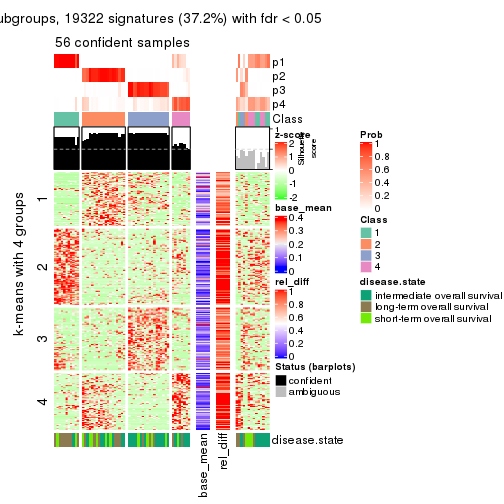</p>

</div>
<div id='tab-MAD-kmeans-get-signatures-4'>
<pre><code class="r">get_signatures(res, k = 5)
</code></pre>

<p></p>

</div>
<div id='tab-MAD-kmeans-get-signatures-5'>
<pre><code class="r">get_signatures(res, k = 6)
</code></pre>

<p></p>

</div>
</div>


Signature heatmaps where rows are not scaled:


<script>
$( function() {
	$( '#tabs-MAD-kmeans-get-signatures-no-scale' ).tabs();
} );
</script>
<div id='tabs-MAD-kmeans-get-signatures-no-scale'>
<ul>
<li><a href='#tab-MAD-kmeans-get-signatures-no-scale-1'>k = 2</a></li>
<li><a href='#tab-MAD-kmeans-get-signatures-no-scale-2'>k = 3</a></li>
<li><a href='#tab-MAD-kmeans-get-signatures-no-scale-3'>k = 4</a></li>
<li><a href='#tab-MAD-kmeans-get-signatures-no-scale-4'>k = 5</a></li>
<li><a href='#tab-MAD-kmeans-get-signatures-no-scale-5'>k = 6</a></li>
</ul>
<div id='tab-MAD-kmeans-get-signatures-no-scale-1'>
<pre><code class="r">get_signatures(res, k = 2, scale_rows = FALSE)
</code></pre>

<p></p>

</div>
<div id='tab-MAD-kmeans-get-signatures-no-scale-2'>
<pre><code class="r">get_signatures(res, k = 3, scale_rows = FALSE)
</code></pre>

<p></p>

</div>
<div id='tab-MAD-kmeans-get-signatures-no-scale-3'>
<pre><code class="r">get_signatures(res, k = 4, scale_rows = FALSE)
</code></pre>

<p></p>

</div>
<div id='tab-MAD-kmeans-get-signatures-no-scale-4'>
<pre><code class="r">get_signatures(res, k = 5, scale_rows = FALSE)
</code></pre>

<p></p>

</div>
<div id='tab-MAD-kmeans-get-signatures-no-scale-5'>
<pre><code class="r">get_signatures(res, k = 6, scale_rows = FALSE)
</code></pre>

<p></p>

</div>
</div>


Compare the overlap of signatures from different k:

```r
compare_signatures(res)
```


`get_signature()` returns a data frame invisibly. TO get the list of signatures, the function
call should be assigned to a variable explicitly. In following code, if `plot` argument is set
to `FALSE`, no heatmap is plotted while only the differential analysis is performed.

```r
# code only for demonstration
tb = get_signature(res, k = ..., plot = FALSE)
```

An example of the output of `tb` is:

```
#>   which_row         fdr    mean_1    mean_2 scaled_mean_1 scaled_mean_2 km
#> 1        38 0.042760348  8.373488  9.131774    -0.5533452     0.5164555  1
#> 2        40 0.018707592  7.106213  8.469186    -0.6173731     0.5762149  1
#> 3        55 0.019134737 10.221463 11.207825    -0.6159697     0.5749050  1
#> 4        59 0.006059896  5.921854  7.869574    -0.6899429     0.6439467  1
#> 5        60 0.018055526  8.928898 10.211722    -0.6204761     0.5791110  1
#> 6        98 0.009384629 15.714769 14.887706     0.6635654    -0.6193277  2
...
```

The columns in `tb` are:

1. `which_row`: row indices corresponding to the input matrix.
2. `fdr`: FDR for the differential test. 
3. `mean_x`: The mean value in group x.
4. `scaled_mean_x`: The mean value in group x after rows are scaled.
5. `km`: Row groups if k-means clustering is applied to rows.


UMAP plot which shows how samples are separated.


<script>
$( function() {
	$( '#tabs-MAD-kmeans-dimension-reduction' ).tabs();
} );
</script>
<div id='tabs-MAD-kmeans-dimension-reduction'>
<ul>
<li><a href='#tab-MAD-kmeans-dimension-reduction-1'>k = 2</a></li>
<li><a href='#tab-MAD-kmeans-dimension-reduction-2'>k = 3</a></li>
<li><a href='#tab-MAD-kmeans-dimension-reduction-3'>k = 4</a></li>
<li><a href='#tab-MAD-kmeans-dimension-reduction-4'>k = 5</a></li>
<li><a href='#tab-MAD-kmeans-dimension-reduction-5'>k = 6</a></li>
</ul>
<div id='tab-MAD-kmeans-dimension-reduction-1'>
<pre><code class="r">dimension_reduction(res, k = 2, method = &quot;UMAP&quot;)
</code></pre>

<p></p>

</div>
<div id='tab-MAD-kmeans-dimension-reduction-2'>
<pre><code class="r">dimension_reduction(res, k = 3, method = &quot;UMAP&quot;)
</code></pre>

<p></p>

</div>
<div id='tab-MAD-kmeans-dimension-reduction-3'>
<pre><code class="r">dimension_reduction(res, k = 4, method = &quot;UMAP&quot;)
</code></pre>

<p></p>

</div>
<div id='tab-MAD-kmeans-dimension-reduction-4'>
<pre><code class="r">dimension_reduction(res, k = 5, method = &quot;UMAP&quot;)
</code></pre>

<p></p>

</div>
<div id='tab-MAD-kmeans-dimension-reduction-5'>
<pre><code class="r">dimension_reduction(res, k = 6, method = &quot;UMAP&quot;)
</code></pre>

<p></p>

</div>
</div>


Following heatmap shows how subgroups are split when increasing `k`:

```r
collect_classes(res)
```


Test correlation between subgroups and known annotations. If the known
annotation is numeric, one-way ANOVA test is applied, and if the known
annotation is discrete, chi-squared contingency table test is applied.

```r
test_to_known_factors(res)
```

```
#>             n disease.state(p) k
#> MAD:kmeans 70           0.1422 2
#> MAD:kmeans 68           0.3437 3
#> MAD:kmeans 56           0.0433 4
#> MAD:kmeans 47           0.0581 5
#> MAD:kmeans 34           0.1445 6
```


If matrix rows can be associated to genes, consider to use `GO_Enrichment(res,
...)` to perform function enrichment for the signature genes.


 

---------------------------------------------------


### MAD:skmeans**


The object with results only for a single top-value method and a single partition method 
can be extracted as:

```r
res = res_list["MAD", "skmeans"]
# you can also extract it by
# res = res_list["MAD:skmeans"]
```

A summary of `res` and all the functions that can be applied to it:

```r
res
```

```
#> A 'ConsensusPartition' object with k = 2, 3, 4, 5, 6.
#>   On a matrix with 51941 rows and 70 columns.
#>   Top rows (1000, 2000, 3000, 4000, 5000) are extracted by 'MAD' method.
#>   Subgroups are detected by 'skmeans' method.
#>   Performed in total 1250 partitions by row resampling.
#>   Best k for subgroups seems to be 3.
#> 
#> Following methods can be applied to this 'ConsensusPartition' object:
#>  [1] "cola_report"             "collect_classes"         "collect_plots"          
#>  [4] "collect_stats"           "colnames"                "compare_signatures"     
#>  [7] "consensus_heatmap"       "dimension_reduction"     "functional_enrichment"  
#> [10] "get_anno_col"            "get_anno"                "get_classes"            
#> [13] "get_consensus"           "get_matrix"              "get_membership"         
#> [16] "get_param"               "get_signatures"          "get_stats"              
#> [19] "is_best_k"               "is_stable_k"             "membership_heatmap"     
#> [22] "ncol"                    "nrow"                    "plot_ecdf"              
#> [25] "rownames"                "select_partition_number" "show"                   
#> [28] "suggest_best_k"          "test_to_known_factors"
```

`collect_plots()` function collects all the plots made from `res` for all `k` (number of partitions)
into one single page to provide an easy and fast comparison between different `k`.

```r
collect_plots(res)
```


The plots are:

- The first row: a plot of the ECDF (Empirical cumulative distribution
  function) curves of the consensus matrix for each `k` and the heatmap of
  predicted classes for each `k`.
- The second row: heatmaps of the consensus matrix for each `k`.
- The third row: heatmaps of the membership matrix for each `k`.
- The fouth row: heatmaps of the signatures for each `k`.

All the plots in panels can be made by individual functions and they are
plotted later in this section.

`select_partition_number()` produces several plots showing different
statistics for choosing "optimized" `k`. There are following statistics:

- ECDF curves of the consensus matrix for each `k`;
- 1-PAC. [The PAC
  score](https://en.wikipedia.org/wiki/Consensus_clustering#Over-interpretation_potential_of_consensus_clustering)
  measures the proportion of the ambiguous subgrouping.
- Mean silhouette score.
- Concordance. The mean probability of fiting the consensus class ids in all
  partitions.
- Area increased. Denote $A_k$ as the area under the ECDF curve for current
  `k`, the area increased is defined as $A_k - A_{k-1}$.
- Rand index. The percent of pairs of samples that are both in a same cluster
  or both are not in a same cluster in the partition of k and k-1.
- Jaccard index. The ratio of pairs of samples are both in a same cluster in
  the partition of k and k-1 and the pairs of samples are both in a same
  cluster in the partition k or k-1.

The detailed explanations of these statistics can be found in [the cola
vignette](http://bioconductor.org/packages/devel/bioc/vignettes/cola/inst/doc/cola.html#toc_13).

Generally speaking, lower PAC score, higher mean silhouette score or higher
concordance corresponds to better partition. Rand index and Jaccard index
measure how similar the current partition is compared to partition with `k-1`.
If they are too similar, we won't accept `k` is better than `k-1`.

```r
select_partition_number(res)
```


The numeric values for all these statistics can be obtained by `get_stats()`.

```r
get_stats(res)
```

```
#>   k 1-PAC mean_silhouette concordance area_increased  Rand Jaccard
#> 2 2 0.971           0.968       0.986          0.499 0.499   0.499
#> 3 3 0.977           0.939       0.974          0.343 0.764   0.556
#> 4 4 0.850           0.837       0.921          0.122 0.847   0.579
#> 5 5 0.748           0.690       0.814          0.057 0.943   0.777
#> 6 6 0.742           0.617       0.783          0.039 0.954   0.790
```

`suggest_best_k()` suggests the best $k$ based on these statistics. The rules are as follows:

- All $k$ with Jaccard index larger than 0.95 are removed because the increase of
  the partition number does not provides enough extra information. If all $k$ are removed,
  the best $k$ is assigned by `NA`.
- For $k$ with 1-PAC larger than 0.9, the maximal $k$ is taken as the "best k". Other $k$ is called "optional k".
- If it does not fit the second rule. The $k$ with the highest vote of highest
  1-PAC, mean silhouette and concordance is taken as the "best k".

```r
suggest_best_k(res)
```

```
#> [1] 3
#> attr(,"optional")
#> [1] 2
```

There is also optional best $k$ = 2 that is worth to check.

Following shows the table of the partitions (You need to click the **show/hide
code output** link to see it). The membership matrix (columns with name `p*`)
is inferred by
[`clue::cl_consensus()`](https://www.rdocumentation.org/link/cl_consensus?package=clue)
function with the `SE` method. Basically the value in the membership matrix
represents the probability to belong to a certain group. The finall class
label for an item is determined with the group with highest probability it
belongs to.

In `get_classes()` function, the entropy is calculated from the membership
matrix and the silhouette score is calculated from the consensus matrix.


<script>
$( function() {
	$( '#tabs-MAD-skmeans-get-classes' ).tabs();
} );
</script>
<div id='tabs-MAD-skmeans-get-classes'>
<ul>
<li><a href='#tab-MAD-skmeans-get-classes-1'>k = 2</a></li>
<li><a href='#tab-MAD-skmeans-get-classes-2'>k = 3</a></li>
<li><a href='#tab-MAD-skmeans-get-classes-3'>k = 4</a></li>
<li><a href='#tab-MAD-skmeans-get-classes-4'>k = 5</a></li>
<li><a href='#tab-MAD-skmeans-get-classes-5'>k = 6</a></li>
</ul>

<div id='tab-MAD-skmeans-get-classes-1'>
<p><a id='tab-MAD-skmeans-get-classes-1-a' style='color:#0366d6' href='#'>show/hide code output</a></p>
<pre><code class="r">cbind(get_classes(res, k = 2), get_membership(res, k = 2))
</code></pre>

<pre><code>#&gt;            class entropy silhouette    p1    p2
#&gt; GSM1299517     2  0.0000      0.992 0.000 1.000
#&gt; GSM1299518     2  0.0000      0.992 0.000 1.000
#&gt; GSM1299519     2  0.0000      0.992 0.000 1.000
#&gt; GSM1299520     1  0.0000      0.976 1.000 0.000
#&gt; GSM1299521     1  0.0000      0.976 1.000 0.000
#&gt; GSM1299522     2  0.0000      0.992 0.000 1.000
#&gt; GSM1299523     1  0.0000      0.976 1.000 0.000
#&gt; GSM1299524     2  0.0000      0.992 0.000 1.000
#&gt; GSM1299525     2  0.0000      0.992 0.000 1.000
#&gt; GSM1299526     2  0.0000      0.992 0.000 1.000
#&gt; GSM1299527     2  0.0000      0.992 0.000 1.000
#&gt; GSM1299528     1  0.9686      0.373 0.604 0.396
#&gt; GSM1299529     2  0.0000      0.992 0.000 1.000
#&gt; GSM1299530     1  0.0000      0.976 1.000 0.000
#&gt; GSM1299531     2  0.0000      0.992 0.000 1.000
#&gt; GSM1299575     1  0.0000      0.976 1.000 0.000
#&gt; GSM1299532     2  0.0000      0.992 0.000 1.000
#&gt; GSM1299533     2  0.0000      0.992 0.000 1.000
#&gt; GSM1299534     2  0.0000      0.992 0.000 1.000
#&gt; GSM1299535     2  0.0000      0.992 0.000 1.000
#&gt; GSM1299536     1  0.0000      0.976 1.000 0.000
#&gt; GSM1299537     2  0.0000      0.992 0.000 1.000
#&gt; GSM1299538     1  0.0000      0.976 1.000 0.000
#&gt; GSM1299539     1  0.0000      0.976 1.000 0.000
#&gt; GSM1299540     2  0.5059      0.875 0.112 0.888
#&gt; GSM1299541     2  0.0000      0.992 0.000 1.000
#&gt; GSM1299542     2  0.0000      0.992 0.000 1.000
#&gt; GSM1299543     2  0.0000      0.992 0.000 1.000
#&gt; GSM1299544     2  0.0000      0.992 0.000 1.000
#&gt; GSM1299545     1  0.0000      0.976 1.000 0.000
#&gt; GSM1299546     2  0.0000      0.992 0.000 1.000
#&gt; GSM1299547     1  0.0000      0.976 1.000 0.000
#&gt; GSM1299548     2  0.0000      0.992 0.000 1.000
#&gt; GSM1299549     1  0.0000      0.976 1.000 0.000
#&gt; GSM1299550     1  0.5519      0.850 0.872 0.128
#&gt; GSM1299551     2  0.0000      0.992 0.000 1.000
#&gt; GSM1299552     1  0.0000      0.976 1.000 0.000
#&gt; GSM1299553     1  0.0000      0.976 1.000 0.000
#&gt; GSM1299554     2  0.0672      0.986 0.008 0.992
#&gt; GSM1299555     2  0.0000      0.992 0.000 1.000
#&gt; GSM1299556     2  0.1414      0.975 0.020 0.980
#&gt; GSM1299557     2  0.5519      0.855 0.128 0.872
#&gt; GSM1299558     2  0.0000      0.992 0.000 1.000
#&gt; GSM1299559     2  0.1184      0.979 0.016 0.984
#&gt; GSM1299560     2  0.0000      0.992 0.000 1.000
#&gt; GSM1299576     1  0.0000      0.976 1.000 0.000
#&gt; GSM1299577     1  0.0000      0.976 1.000 0.000
#&gt; GSM1299561     2  0.0000      0.992 0.000 1.000
#&gt; GSM1299562     2  0.0000      0.992 0.000 1.000
#&gt; GSM1299563     1  0.0000      0.976 1.000 0.000
#&gt; GSM1299564     1  0.0000      0.976 1.000 0.000
#&gt; GSM1299565     2  0.0000      0.992 0.000 1.000
#&gt; GSM1299566     1  0.7056      0.770 0.808 0.192
#&gt; GSM1299567     1  0.0000      0.976 1.000 0.000
#&gt; GSM1299568     2  0.0000      0.992 0.000 1.000
#&gt; GSM1299569     2  0.0000      0.992 0.000 1.000
#&gt; GSM1299570     1  0.0000      0.976 1.000 0.000
#&gt; GSM1299571     2  0.0000      0.992 0.000 1.000
#&gt; GSM1299572     2  0.0000      0.992 0.000 1.000
#&gt; GSM1299573     2  0.0000      0.992 0.000 1.000
#&gt; GSM1299574     2  0.0000      0.992 0.000 1.000
#&gt; GSM1299578     1  0.0000      0.976 1.000 0.000
#&gt; GSM1299579     1  0.0000      0.976 1.000 0.000
#&gt; GSM1299580     1  0.0000      0.976 1.000 0.000
#&gt; GSM1299581     1  0.0000      0.976 1.000 0.000
#&gt; GSM1299582     1  0.0000      0.976 1.000 0.000
#&gt; GSM1299583     1  0.0000      0.976 1.000 0.000
#&gt; GSM1299584     1  0.0000      0.976 1.000 0.000
#&gt; GSM1299585     1  0.0000      0.976 1.000 0.000
#&gt; GSM1299586     1  0.0000      0.976 1.000 0.000
</code></pre>

<script>
$('#tab-MAD-skmeans-get-classes-1-a').parent().next().next().hide();
$('#tab-MAD-skmeans-get-classes-1-a').click(function(){
  $('#tab-MAD-skmeans-get-classes-1-a').parent().next().next().toggle();
  return(false);
});
</script>
</div>

<div id='tab-MAD-skmeans-get-classes-2'>
<p><a id='tab-MAD-skmeans-get-classes-2-a' style='color:#0366d6' href='#'>show/hide code output</a></p>
<pre><code class="r">cbind(get_classes(res, k = 3), get_membership(res, k = 3))
</code></pre>

<pre><code>#&gt;            class entropy silhouette    p1    p2    p3
#&gt; GSM1299517     3   0.000      0.958 0.000 0.000 1.000
#&gt; GSM1299518     3   0.000      0.958 0.000 0.000 1.000
#&gt; GSM1299519     2   0.000      0.959 0.000 1.000 0.000
#&gt; GSM1299520     1   0.000      0.993 1.000 0.000 0.000
#&gt; GSM1299521     1   0.000      0.993 1.000 0.000 0.000
#&gt; GSM1299522     2   0.000      0.959 0.000 1.000 0.000
#&gt; GSM1299523     1   0.000      0.993 1.000 0.000 0.000
#&gt; GSM1299524     3   0.000      0.958 0.000 0.000 1.000
#&gt; GSM1299525     2   0.000      0.959 0.000 1.000 0.000
#&gt; GSM1299526     3   0.565      0.538 0.000 0.312 0.688
#&gt; GSM1299527     3   0.000      0.958 0.000 0.000 1.000
#&gt; GSM1299528     2   0.000      0.959 0.000 1.000 0.000
#&gt; GSM1299529     2   0.000      0.959 0.000 1.000 0.000
#&gt; GSM1299530     1   0.000      0.993 1.000 0.000 0.000
#&gt; GSM1299531     2   0.000      0.959 0.000 1.000 0.000
#&gt; GSM1299575     1   0.000      0.993 1.000 0.000 0.000
#&gt; GSM1299532     3   0.000      0.958 0.000 0.000 1.000
#&gt; GSM1299533     2   0.129      0.935 0.000 0.968 0.032
#&gt; GSM1299534     2   0.619      0.329 0.000 0.580 0.420
#&gt; GSM1299535     2   0.000      0.959 0.000 1.000 0.000
#&gt; GSM1299536     1   0.000      0.993 1.000 0.000 0.000
#&gt; GSM1299537     3   0.000      0.958 0.000 0.000 1.000
#&gt; GSM1299538     1   0.424      0.782 0.824 0.176 0.000
#&gt; GSM1299539     1   0.000      0.993 1.000 0.000 0.000
#&gt; GSM1299540     3   0.000      0.958 0.000 0.000 1.000
#&gt; GSM1299541     3   0.000      0.958 0.000 0.000 1.000
#&gt; GSM1299542     3   0.000      0.958 0.000 0.000 1.000
#&gt; GSM1299543     2   0.000      0.959 0.000 1.000 0.000
#&gt; GSM1299544     2   0.000      0.959 0.000 1.000 0.000
#&gt; GSM1299545     1   0.000      0.993 1.000 0.000 0.000
#&gt; GSM1299546     2   0.000      0.959 0.000 1.000 0.000
#&gt; GSM1299547     1   0.000      0.993 1.000 0.000 0.000
#&gt; GSM1299548     3   0.000      0.958 0.000 0.000 1.000
#&gt; GSM1299549     1   0.000      0.993 1.000 0.000 0.000
#&gt; GSM1299550     2   0.327      0.885 0.016 0.904 0.080
#&gt; GSM1299551     2   0.000      0.959 0.000 1.000 0.000
#&gt; GSM1299552     1   0.000      0.993 1.000 0.000 0.000
#&gt; GSM1299553     1   0.000      0.993 1.000 0.000 0.000
#&gt; GSM1299554     2   0.522      0.664 0.000 0.740 0.260
#&gt; GSM1299555     3   0.000      0.958 0.000 0.000 1.000
#&gt; GSM1299556     3   0.000      0.958 0.000 0.000 1.000
#&gt; GSM1299557     3   0.265      0.897 0.060 0.012 0.928
#&gt; GSM1299558     2   0.000      0.959 0.000 1.000 0.000
#&gt; GSM1299559     3   0.000      0.958 0.000 0.000 1.000
#&gt; GSM1299560     3   0.000      0.958 0.000 0.000 1.000
#&gt; GSM1299576     1   0.000      0.993 1.000 0.000 0.000
#&gt; GSM1299577     1   0.000      0.993 1.000 0.000 0.000
#&gt; GSM1299561     3   0.000      0.958 0.000 0.000 1.000
#&gt; GSM1299562     2   0.236      0.903 0.000 0.928 0.072
#&gt; GSM1299563     1   0.000      0.993 1.000 0.000 0.000
#&gt; GSM1299564     1   0.000      0.993 1.000 0.000 0.000
#&gt; GSM1299565     2   0.000      0.959 0.000 1.000 0.000
#&gt; GSM1299566     2   0.000      0.959 0.000 1.000 0.000
#&gt; GSM1299567     3   0.590      0.457 0.352 0.000 0.648
#&gt; GSM1299568     2   0.000      0.959 0.000 1.000 0.000
#&gt; GSM1299569     2   0.000      0.959 0.000 1.000 0.000
#&gt; GSM1299570     1   0.000      0.993 1.000 0.000 0.000
#&gt; GSM1299571     2   0.000      0.959 0.000 1.000 0.000
#&gt; GSM1299572     3   0.000      0.958 0.000 0.000 1.000
#&gt; GSM1299573     3   0.000      0.958 0.000 0.000 1.000
#&gt; GSM1299574     2   0.000      0.959 0.000 1.000 0.000
#&gt; GSM1299578     1   0.000      0.993 1.000 0.000 0.000
#&gt; GSM1299579     1   0.000      0.993 1.000 0.000 0.000
#&gt; GSM1299580     1   0.000      0.993 1.000 0.000 0.000
#&gt; GSM1299581     1   0.000      0.993 1.000 0.000 0.000
#&gt; GSM1299582     1   0.000      0.993 1.000 0.000 0.000
#&gt; GSM1299583     1   0.000      0.993 1.000 0.000 0.000
#&gt; GSM1299584     1   0.000      0.993 1.000 0.000 0.000
#&gt; GSM1299585     1   0.000      0.993 1.000 0.000 0.000
#&gt; GSM1299586     1   0.000      0.993 1.000 0.000 0.000
</code></pre>

<script>
$('#tab-MAD-skmeans-get-classes-2-a').parent().next().next().hide();
$('#tab-MAD-skmeans-get-classes-2-a').click(function(){
  $('#tab-MAD-skmeans-get-classes-2-a').parent().next().next().toggle();
  return(false);
});
</script>
</div>

<div id='tab-MAD-skmeans-get-classes-3'>
<p><a id='tab-MAD-skmeans-get-classes-3-a' style='color:#0366d6' href='#'>show/hide code output</a></p>
<pre><code class="r">cbind(get_classes(res, k = 4), get_membership(res, k = 4))
</code></pre>

<pre><code>#&gt;            class entropy silhouette    p1    p2    p3    p4
#&gt; GSM1299517     3  0.0336      0.946 0.000 0.000 0.992 0.008
#&gt; GSM1299518     3  0.0000      0.950 0.000 0.000 1.000 0.000
#&gt; GSM1299519     2  0.0000      0.943 0.000 1.000 0.000 0.000
#&gt; GSM1299520     4  0.3528      0.758 0.192 0.000 0.000 0.808
#&gt; GSM1299521     1  0.1022      0.884 0.968 0.000 0.000 0.032
#&gt; GSM1299522     2  0.0000      0.943 0.000 1.000 0.000 0.000
#&gt; GSM1299523     4  0.4624      0.648 0.340 0.000 0.000 0.660
#&gt; GSM1299524     3  0.0188      0.948 0.000 0.000 0.996 0.004
#&gt; GSM1299525     2  0.0592      0.936 0.000 0.984 0.000 0.016
#&gt; GSM1299526     2  0.2868      0.813 0.000 0.864 0.136 0.000
#&gt; GSM1299527     3  0.0000      0.950 0.000 0.000 1.000 0.000
#&gt; GSM1299528     2  0.4643      0.567 0.000 0.656 0.000 0.344
#&gt; GSM1299529     2  0.0707      0.935 0.000 0.980 0.000 0.020
#&gt; GSM1299530     4  0.4643      0.643 0.344 0.000 0.000 0.656
#&gt; GSM1299531     2  0.0000      0.943 0.000 1.000 0.000 0.000
#&gt; GSM1299575     1  0.0000      0.899 1.000 0.000 0.000 0.000
#&gt; GSM1299532     3  0.0000      0.950 0.000 0.000 1.000 0.000
#&gt; GSM1299533     2  0.0000      0.943 0.000 1.000 0.000 0.000
#&gt; GSM1299534     3  0.7134      0.280 0.000 0.312 0.532 0.156
#&gt; GSM1299535     2  0.0336      0.939 0.000 0.992 0.008 0.000
#&gt; GSM1299536     4  0.0336      0.791 0.008 0.000 0.000 0.992
#&gt; GSM1299537     3  0.0000      0.950 0.000 0.000 1.000 0.000
#&gt; GSM1299538     4  0.1557      0.798 0.056 0.000 0.000 0.944
#&gt; GSM1299539     4  0.1637      0.798 0.060 0.000 0.000 0.940
#&gt; GSM1299540     3  0.0336      0.947 0.000 0.000 0.992 0.008
#&gt; GSM1299541     3  0.0000      0.950 0.000 0.000 1.000 0.000
#&gt; GSM1299542     3  0.0000      0.950 0.000 0.000 1.000 0.000
#&gt; GSM1299543     2  0.0000      0.943 0.000 1.000 0.000 0.000
#&gt; GSM1299544     2  0.3726      0.765 0.000 0.788 0.000 0.212
#&gt; GSM1299545     1  0.2704      0.770 0.876 0.000 0.000 0.124
#&gt; GSM1299546     2  0.0000      0.943 0.000 1.000 0.000 0.000
#&gt; GSM1299547     1  0.4250      0.602 0.724 0.000 0.000 0.276
#&gt; GSM1299548     3  0.0000      0.950 0.000 0.000 1.000 0.000
#&gt; GSM1299549     1  0.2081      0.850 0.916 0.000 0.000 0.084
#&gt; GSM1299550     4  0.0469      0.787 0.000 0.000 0.012 0.988
#&gt; GSM1299551     2  0.0000      0.943 0.000 1.000 0.000 0.000
#&gt; GSM1299552     1  0.1792      0.862 0.932 0.000 0.000 0.068
#&gt; GSM1299553     1  0.0921      0.886 0.972 0.000 0.000 0.028
#&gt; GSM1299554     4  0.1545      0.772 0.000 0.008 0.040 0.952
#&gt; GSM1299555     3  0.0336      0.947 0.000 0.000 0.992 0.008
#&gt; GSM1299556     3  0.0336      0.947 0.000 0.000 0.992 0.008
#&gt; GSM1299557     1  0.6383      0.483 0.636 0.028 0.292 0.044
#&gt; GSM1299558     2  0.0000      0.943 0.000 1.000 0.000 0.000
#&gt; GSM1299559     3  0.0336      0.947 0.000 0.000 0.992 0.008
#&gt; GSM1299560     3  0.0000      0.950 0.000 0.000 1.000 0.000
#&gt; GSM1299576     1  0.0000      0.899 1.000 0.000 0.000 0.000
#&gt; GSM1299577     4  0.4804      0.571 0.384 0.000 0.000 0.616
#&gt; GSM1299561     3  0.0000      0.950 0.000 0.000 1.000 0.000
#&gt; GSM1299562     2  0.1557      0.899 0.000 0.944 0.056 0.000
#&gt; GSM1299563     4  0.3569      0.749 0.196 0.000 0.000 0.804
#&gt; GSM1299564     4  0.0469      0.792 0.012 0.000 0.000 0.988
#&gt; GSM1299565     2  0.0000      0.943 0.000 1.000 0.000 0.000
#&gt; GSM1299566     4  0.3801      0.577 0.000 0.220 0.000 0.780
#&gt; GSM1299567     3  0.6330      0.502 0.200 0.000 0.656 0.144
#&gt; GSM1299568     2  0.0336      0.940 0.000 0.992 0.000 0.008
#&gt; GSM1299569     2  0.4353      0.732 0.000 0.756 0.012 0.232
#&gt; GSM1299570     4  0.4585      0.657 0.332 0.000 0.000 0.668
#&gt; GSM1299571     2  0.0000      0.943 0.000 1.000 0.000 0.000
#&gt; GSM1299572     3  0.0469      0.945 0.000 0.000 0.988 0.012
#&gt; GSM1299573     3  0.0000      0.950 0.000 0.000 1.000 0.000
#&gt; GSM1299574     2  0.0000      0.943 0.000 1.000 0.000 0.000
#&gt; GSM1299578     1  0.0000      0.899 1.000 0.000 0.000 0.000
#&gt; GSM1299579     1  0.4907      0.119 0.580 0.000 0.000 0.420
#&gt; GSM1299580     1  0.0000      0.899 1.000 0.000 0.000 0.000
#&gt; GSM1299581     1  0.0000      0.899 1.000 0.000 0.000 0.000
#&gt; GSM1299582     1  0.0000      0.899 1.000 0.000 0.000 0.000
#&gt; GSM1299583     1  0.0000      0.899 1.000 0.000 0.000 0.000
#&gt; GSM1299584     1  0.0000      0.899 1.000 0.000 0.000 0.000
#&gt; GSM1299585     1  0.0000      0.899 1.000 0.000 0.000 0.000
#&gt; GSM1299586     1  0.0000      0.899 1.000 0.000 0.000 0.000
</code></pre>

<script>
$('#tab-MAD-skmeans-get-classes-3-a').parent().next().next().hide();
$('#tab-MAD-skmeans-get-classes-3-a').click(function(){
  $('#tab-MAD-skmeans-get-classes-3-a').parent().next().next().toggle();
  return(false);
});
</script>
</div>

<div id='tab-MAD-skmeans-get-classes-4'>
<p><a id='tab-MAD-skmeans-get-classes-4-a' style='color:#0366d6' href='#'>show/hide code output</a></p>
<pre><code class="r">cbind(get_classes(res, k = 5), get_membership(res, k = 5))
</code></pre>

<pre><code>#&gt;            class entropy silhouette    p1    p2    p3    p4    p5
#&gt; GSM1299517     3  0.3521     0.8268 0.000 0.008 0.824 0.144 0.024
#&gt; GSM1299518     3  0.0290     0.8622 0.000 0.000 0.992 0.008 0.000
#&gt; GSM1299519     2  0.0162     0.9102 0.000 0.996 0.000 0.004 0.000
#&gt; GSM1299520     5  0.5597    -0.4903 0.072 0.000 0.000 0.440 0.488
#&gt; GSM1299521     1  0.2825     0.7976 0.860 0.000 0.000 0.124 0.016
#&gt; GSM1299522     2  0.0000     0.9104 0.000 1.000 0.000 0.000 0.000
#&gt; GSM1299523     4  0.6292     0.5640 0.152 0.000 0.000 0.448 0.400
#&gt; GSM1299524     3  0.3741     0.7631 0.000 0.000 0.816 0.108 0.076
#&gt; GSM1299525     2  0.2389     0.8299 0.000 0.880 0.000 0.004 0.116
#&gt; GSM1299526     2  0.3477     0.7639 0.000 0.832 0.112 0.056 0.000
#&gt; GSM1299527     3  0.0703     0.8621 0.000 0.000 0.976 0.024 0.000
#&gt; GSM1299528     5  0.4963     0.2706 0.000 0.352 0.000 0.040 0.608
#&gt; GSM1299529     2  0.2464     0.8459 0.000 0.888 0.000 0.016 0.096
#&gt; GSM1299530     4  0.6366     0.5676 0.164 0.000 0.000 0.440 0.396
#&gt; GSM1299531     2  0.0290     0.9092 0.000 0.992 0.000 0.008 0.000
#&gt; GSM1299575     1  0.1270     0.8238 0.948 0.000 0.000 0.052 0.000
#&gt; GSM1299532     3  0.1671     0.8405 0.000 0.000 0.924 0.076 0.000
#&gt; GSM1299533     2  0.0865     0.9045 0.000 0.972 0.004 0.024 0.000
#&gt; GSM1299534     3  0.6909     0.3934 0.000 0.088 0.576 0.112 0.224
#&gt; GSM1299535     2  0.2026     0.8817 0.000 0.924 0.012 0.056 0.008
#&gt; GSM1299536     5  0.1851     0.5006 0.000 0.000 0.000 0.088 0.912
#&gt; GSM1299537     3  0.2074     0.8504 0.000 0.000 0.896 0.104 0.000
#&gt; GSM1299538     5  0.2605     0.4580 0.000 0.000 0.000 0.148 0.852
#&gt; GSM1299539     5  0.2971     0.4487 0.008 0.000 0.000 0.156 0.836
#&gt; GSM1299540     3  0.4009     0.7276 0.004 0.000 0.684 0.312 0.000
#&gt; GSM1299541     3  0.1851     0.8537 0.000 0.000 0.912 0.088 0.000
#&gt; GSM1299542     3  0.0404     0.8629 0.000 0.000 0.988 0.012 0.000
#&gt; GSM1299543     2  0.0162     0.9099 0.000 0.996 0.000 0.004 0.000
#&gt; GSM1299544     2  0.5599     0.0576 0.000 0.484 0.000 0.072 0.444
#&gt; GSM1299545     4  0.4973     0.3285 0.408 0.000 0.004 0.564 0.024
#&gt; GSM1299546     2  0.0000     0.9104 0.000 1.000 0.000 0.000 0.000
#&gt; GSM1299547     1  0.5464     0.6190 0.648 0.000 0.000 0.224 0.128
#&gt; GSM1299548     3  0.1851     0.8571 0.000 0.000 0.912 0.088 0.000
#&gt; GSM1299549     1  0.4238     0.7406 0.756 0.000 0.000 0.192 0.052
#&gt; GSM1299550     5  0.0290     0.5231 0.000 0.000 0.000 0.008 0.992
#&gt; GSM1299551     2  0.0000     0.9104 0.000 1.000 0.000 0.000 0.000
#&gt; GSM1299552     1  0.3639     0.7629 0.792 0.000 0.000 0.184 0.024
#&gt; GSM1299553     1  0.3563     0.7644 0.780 0.000 0.000 0.208 0.012
#&gt; GSM1299554     5  0.4734     0.4192 0.000 0.000 0.096 0.176 0.728
#&gt; GSM1299555     3  0.3395     0.7865 0.000 0.000 0.764 0.236 0.000
#&gt; GSM1299556     3  0.3424     0.7915 0.000 0.000 0.760 0.240 0.000
#&gt; GSM1299557     1  0.7468     0.3451 0.460 0.020 0.188 0.308 0.024
#&gt; GSM1299558     2  0.0451     0.9083 0.000 0.988 0.000 0.008 0.004
#&gt; GSM1299559     3  0.3508     0.7826 0.000 0.000 0.748 0.252 0.000
#&gt; GSM1299560     3  0.0290     0.8623 0.000 0.000 0.992 0.008 0.000
#&gt; GSM1299576     1  0.0000     0.8381 1.000 0.000 0.000 0.000 0.000
#&gt; GSM1299577     4  0.6556     0.5604 0.260 0.000 0.000 0.476 0.264
#&gt; GSM1299561     3  0.0290     0.8627 0.000 0.000 0.992 0.008 0.000
#&gt; GSM1299562     2  0.2929     0.8314 0.000 0.876 0.076 0.044 0.004
#&gt; GSM1299563     4  0.5929     0.3795 0.104 0.000 0.000 0.464 0.432
#&gt; GSM1299564     5  0.3796     0.1831 0.000 0.000 0.000 0.300 0.700
#&gt; GSM1299565     2  0.0162     0.9102 0.000 0.996 0.000 0.004 0.000
#&gt; GSM1299566     5  0.2723     0.5143 0.000 0.124 0.000 0.012 0.864
#&gt; GSM1299567     4  0.6476     0.1554 0.152 0.000 0.288 0.544 0.016
#&gt; GSM1299568     2  0.4435     0.7285 0.000 0.776 0.008 0.092 0.124
#&gt; GSM1299569     5  0.7319     0.1523 0.000 0.340 0.104 0.092 0.464
#&gt; GSM1299570     4  0.6217     0.5428 0.140 0.000 0.000 0.444 0.416
#&gt; GSM1299571     2  0.0162     0.9102 0.000 0.996 0.000 0.004 0.000
#&gt; GSM1299572     3  0.3366     0.7980 0.000 0.000 0.784 0.212 0.004
#&gt; GSM1299573     3  0.2136     0.8339 0.000 0.000 0.904 0.088 0.008
#&gt; GSM1299574     2  0.0162     0.9102 0.000 0.996 0.000 0.004 0.000
#&gt; GSM1299578     1  0.0290     0.8370 0.992 0.000 0.000 0.008 0.000
#&gt; GSM1299579     1  0.4840     0.5128 0.676 0.000 0.000 0.056 0.268
#&gt; GSM1299580     1  0.1270     0.8238 0.948 0.000 0.000 0.052 0.000
#&gt; GSM1299581     1  0.0000     0.8381 1.000 0.000 0.000 0.000 0.000
#&gt; GSM1299582     1  0.1197     0.8250 0.952 0.000 0.000 0.048 0.000
#&gt; GSM1299583     1  0.0290     0.8379 0.992 0.000 0.000 0.008 0.000
#&gt; GSM1299584     1  0.1197     0.8250 0.952 0.000 0.000 0.048 0.000
#&gt; GSM1299585     1  0.0703     0.8359 0.976 0.000 0.000 0.024 0.000
#&gt; GSM1299586     1  0.0963     0.8297 0.964 0.000 0.000 0.036 0.000
</code></pre>

<script>
$('#tab-MAD-skmeans-get-classes-4-a').parent().next().next().hide();
$('#tab-MAD-skmeans-get-classes-4-a').click(function(){
  $('#tab-MAD-skmeans-get-classes-4-a').parent().next().next().toggle();
  return(false);
});
</script>
</div>

<div id='tab-MAD-skmeans-get-classes-5'>
<p><a id='tab-MAD-skmeans-get-classes-5-a' style='color:#0366d6' href='#'>show/hide code output</a></p>
<pre><code class="r">cbind(get_classes(res, k = 6), get_membership(res, k = 6))
</code></pre>

<pre><code>#&gt;            class entropy silhouette    p1    p2    p3    p4    p5    p6
#&gt; GSM1299517     3  0.4253     0.3419 0.000 0.008 0.608 0.000 0.012 0.372
#&gt; GSM1299518     3  0.0790     0.6794 0.000 0.000 0.968 0.000 0.000 0.032
#&gt; GSM1299519     2  0.0146     0.8934 0.000 0.996 0.000 0.000 0.000 0.004
#&gt; GSM1299520     4  0.2383     0.6919 0.024 0.000 0.000 0.880 0.096 0.000
#&gt; GSM1299521     1  0.3736     0.7457 0.804 0.000 0.000 0.056 0.020 0.120
#&gt; GSM1299522     2  0.0363     0.8939 0.000 0.988 0.000 0.000 0.012 0.000
#&gt; GSM1299523     4  0.2263     0.7639 0.100 0.000 0.000 0.884 0.016 0.000
#&gt; GSM1299524     3  0.4125     0.5289 0.000 0.000 0.748 0.000 0.128 0.124
#&gt; GSM1299525     2  0.3457     0.6943 0.000 0.752 0.000 0.000 0.232 0.016
#&gt; GSM1299526     2  0.3307     0.7666 0.000 0.820 0.072 0.000 0.000 0.108
#&gt; GSM1299527     3  0.1643     0.6778 0.000 0.000 0.924 0.000 0.008 0.068
#&gt; GSM1299528     5  0.3455     0.6253 0.000 0.132 0.000 0.036 0.816 0.016
#&gt; GSM1299529     2  0.3976     0.7089 0.000 0.748 0.000 0.004 0.196 0.052
#&gt; GSM1299530     4  0.2489     0.7576 0.128 0.000 0.000 0.860 0.012 0.000
#&gt; GSM1299531     2  0.0363     0.8939 0.000 0.988 0.000 0.000 0.012 0.000
#&gt; GSM1299575     1  0.1478     0.8107 0.944 0.000 0.000 0.032 0.004 0.020
#&gt; GSM1299532     3  0.2537     0.6307 0.000 0.000 0.872 0.000 0.032 0.096
#&gt; GSM1299533     2  0.1327     0.8733 0.000 0.936 0.000 0.000 0.000 0.064
#&gt; GSM1299534     3  0.5667     0.3374 0.000 0.020 0.588 0.000 0.248 0.144
#&gt; GSM1299535     2  0.3716     0.8024 0.000 0.820 0.068 0.000 0.044 0.068
#&gt; GSM1299536     5  0.4322     0.4495 0.000 0.000 0.000 0.372 0.600 0.028
#&gt; GSM1299537     3  0.3151     0.5181 0.000 0.000 0.748 0.000 0.000 0.252
#&gt; GSM1299538     5  0.4433     0.3745 0.008 0.000 0.000 0.416 0.560 0.016
#&gt; GSM1299539     5  0.4329     0.4013 0.012 0.000 0.000 0.404 0.576 0.008
#&gt; GSM1299540     6  0.5031     0.0519 0.000 0.000 0.404 0.064 0.004 0.528
#&gt; GSM1299541     3  0.2664     0.5939 0.000 0.000 0.816 0.000 0.000 0.184
#&gt; GSM1299542     3  0.0937     0.6804 0.000 0.000 0.960 0.000 0.000 0.040
#&gt; GSM1299543     2  0.0865     0.8879 0.000 0.964 0.000 0.000 0.036 0.000
#&gt; GSM1299544     5  0.4631     0.4486 0.000 0.288 0.008 0.000 0.652 0.052
#&gt; GSM1299545     4  0.5901     0.2708 0.180 0.000 0.000 0.500 0.008 0.312
#&gt; GSM1299546     2  0.0260     0.8938 0.000 0.992 0.000 0.000 0.008 0.000
#&gt; GSM1299547     1  0.6734     0.5072 0.508 0.000 0.000 0.152 0.104 0.236
#&gt; GSM1299548     3  0.2553     0.6419 0.000 0.000 0.848 0.000 0.008 0.144
#&gt; GSM1299549     1  0.6408     0.5015 0.512 0.000 0.000 0.088 0.100 0.300
#&gt; GSM1299550     5  0.3481     0.6156 0.000 0.000 0.000 0.192 0.776 0.032
#&gt; GSM1299551     2  0.0547     0.8924 0.000 0.980 0.000 0.000 0.020 0.000
#&gt; GSM1299552     1  0.5899     0.5954 0.600 0.000 0.000 0.088 0.076 0.236
#&gt; GSM1299553     1  0.6378     0.5696 0.552 0.000 0.000 0.164 0.072 0.212
#&gt; GSM1299554     5  0.5309     0.5437 0.000 0.004 0.056 0.100 0.692 0.148
#&gt; GSM1299555     6  0.4937    -0.0740 0.000 0.004 0.468 0.052 0.000 0.476
#&gt; GSM1299556     3  0.4076     0.0946 0.000 0.000 0.540 0.008 0.000 0.452
#&gt; GSM1299557     6  0.8027    -0.1196 0.240 0.016 0.116 0.080 0.092 0.456
#&gt; GSM1299558     2  0.1387     0.8754 0.000 0.932 0.000 0.000 0.068 0.000
#&gt; GSM1299559     3  0.4473    -0.0698 0.000 0.000 0.488 0.028 0.000 0.484
#&gt; GSM1299560     3  0.0632     0.6790 0.000 0.000 0.976 0.000 0.000 0.024
#&gt; GSM1299576     1  0.0146     0.8213 0.996 0.000 0.000 0.004 0.000 0.000
#&gt; GSM1299577     4  0.3876     0.7010 0.156 0.000 0.000 0.772 0.004 0.068
#&gt; GSM1299561     3  0.0865     0.6795 0.000 0.000 0.964 0.000 0.000 0.036
#&gt; GSM1299562     2  0.3699     0.7905 0.000 0.812 0.092 0.000 0.020 0.076
#&gt; GSM1299563     4  0.3434     0.6840 0.052 0.000 0.000 0.840 0.052 0.056
#&gt; GSM1299564     4  0.3993     0.2862 0.000 0.000 0.000 0.676 0.300 0.024
#&gt; GSM1299565     2  0.0146     0.8934 0.000 0.996 0.000 0.000 0.000 0.004
#&gt; GSM1299566     5  0.3207     0.6446 0.000 0.044 0.000 0.124 0.828 0.004
#&gt; GSM1299567     6  0.6822     0.0607 0.080 0.000 0.132 0.356 0.004 0.428
#&gt; GSM1299568     2  0.5385     0.5149 0.000 0.628 0.052 0.000 0.260 0.060
#&gt; GSM1299569     5  0.5501     0.5420 0.000 0.152 0.108 0.000 0.668 0.072
#&gt; GSM1299570     4  0.2169     0.7635 0.080 0.000 0.000 0.900 0.008 0.012
#&gt; GSM1299571     2  0.0260     0.8926 0.000 0.992 0.000 0.000 0.000 0.008
#&gt; GSM1299572     3  0.5241     0.3076 0.000 0.000 0.616 0.056 0.036 0.292
#&gt; GSM1299573     3  0.3190     0.6173 0.000 0.000 0.820 0.000 0.044 0.136
#&gt; GSM1299574     2  0.0146     0.8934 0.000 0.996 0.000 0.000 0.000 0.004
#&gt; GSM1299578     1  0.0405     0.8205 0.988 0.000 0.000 0.008 0.000 0.004
#&gt; GSM1299579     1  0.4779     0.6079 0.712 0.000 0.000 0.152 0.116 0.020
#&gt; GSM1299580     1  0.1478     0.8107 0.944 0.000 0.000 0.032 0.004 0.020
#&gt; GSM1299581     1  0.0000     0.8211 1.000 0.000 0.000 0.000 0.000 0.000
#&gt; GSM1299582     1  0.1390     0.8124 0.948 0.000 0.000 0.032 0.004 0.016
#&gt; GSM1299583     1  0.0146     0.8211 0.996 0.000 0.000 0.000 0.000 0.004
#&gt; GSM1299584     1  0.1390     0.8124 0.948 0.000 0.000 0.032 0.004 0.016
#&gt; GSM1299585     1  0.1225     0.8119 0.952 0.000 0.000 0.012 0.000 0.036
#&gt; GSM1299586     1  0.0909     0.8181 0.968 0.000 0.000 0.020 0.000 0.012
</code></pre>

<script>
$('#tab-MAD-skmeans-get-classes-5-a').parent().next().next().hide();
$('#tab-MAD-skmeans-get-classes-5-a').click(function(){
  $('#tab-MAD-skmeans-get-classes-5-a').parent().next().next().toggle();
  return(false);
});
</script>
</div>
</div>

Heatmaps for the consensus matrix. It visualizes the probability of two
samples to be in a same group.


<script>
$( function() {
	$( '#tabs-MAD-skmeans-consensus-heatmap' ).tabs();
} );
</script>
<div id='tabs-MAD-skmeans-consensus-heatmap'>
<ul>
<li><a href='#tab-MAD-skmeans-consensus-heatmap-1'>k = 2</a></li>
<li><a href='#tab-MAD-skmeans-consensus-heatmap-2'>k = 3</a></li>
<li><a href='#tab-MAD-skmeans-consensus-heatmap-3'>k = 4</a></li>
<li><a href='#tab-MAD-skmeans-consensus-heatmap-4'>k = 5</a></li>
<li><a href='#tab-MAD-skmeans-consensus-heatmap-5'>k = 6</a></li>
</ul>
<div id='tab-MAD-skmeans-consensus-heatmap-1'>
<pre><code class="r">consensus_heatmap(res, k = 2)
</code></pre>

<p></p>

</div>
<div id='tab-MAD-skmeans-consensus-heatmap-2'>
<pre><code class="r">consensus_heatmap(res, k = 3)
</code></pre>

<p></p>

</div>
<div id='tab-MAD-skmeans-consensus-heatmap-3'>
<pre><code class="r">consensus_heatmap(res, k = 4)
</code></pre>

<p></p>

</div>
<div id='tab-MAD-skmeans-consensus-heatmap-4'>
<pre><code class="r">consensus_heatmap(res, k = 5)
</code></pre>

<p></p>

</div>
<div id='tab-MAD-skmeans-consensus-heatmap-5'>
<pre><code class="r">consensus_heatmap(res, k = 6)
</code></pre>

<p></p>

</div>
</div>

Heatmaps for the membership of samples in all partitions to see how consistent they are:


<script>
$( function() {
	$( '#tabs-MAD-skmeans-membership-heatmap' ).tabs();
} );
</script>
<div id='tabs-MAD-skmeans-membership-heatmap'>
<ul>
<li><a href='#tab-MAD-skmeans-membership-heatmap-1'>k = 2</a></li>
<li><a href='#tab-MAD-skmeans-membership-heatmap-2'>k = 3</a></li>
<li><a href='#tab-MAD-skmeans-membership-heatmap-3'>k = 4</a></li>
<li><a href='#tab-MAD-skmeans-membership-heatmap-4'>k = 5</a></li>
<li><a href='#tab-MAD-skmeans-membership-heatmap-5'>k = 6</a></li>
</ul>
<div id='tab-MAD-skmeans-membership-heatmap-1'>
<pre><code class="r">membership_heatmap(res, k = 2)
</code></pre>

<p></p>

</div>
<div id='tab-MAD-skmeans-membership-heatmap-2'>
<pre><code class="r">membership_heatmap(res, k = 3)
</code></pre>

<p></p>

</div>
<div id='tab-MAD-skmeans-membership-heatmap-3'>
<pre><code class="r">membership_heatmap(res, k = 4)
</code></pre>

<p></p>

</div>
<div id='tab-MAD-skmeans-membership-heatmap-4'>
<pre><code class="r">membership_heatmap(res, k = 5)
</code></pre>

<p></p>

</div>
<div id='tab-MAD-skmeans-membership-heatmap-5'>
<pre><code class="r">membership_heatmap(res, k = 6)
</code></pre>

<p></p>

</div>
</div>

As soon as we have had the classes for columns, we can look for signatures
which are significantly different between classes which can be candidate marks
for certain classes. Following are the heatmaps for signatures.


Signature heatmaps where rows are scaled:


<script>
$( function() {
	$( '#tabs-MAD-skmeans-get-signatures' ).tabs();
} );
</script>
<div id='tabs-MAD-skmeans-get-signatures'>
<ul>
<li><a href='#tab-MAD-skmeans-get-signatures-1'>k = 2</a></li>
<li><a href='#tab-MAD-skmeans-get-signatures-2'>k = 3</a></li>
<li><a href='#tab-MAD-skmeans-get-signatures-3'>k = 4</a></li>
<li><a href='#tab-MAD-skmeans-get-signatures-4'>k = 5</a></li>
<li><a href='#tab-MAD-skmeans-get-signatures-5'>k = 6</a></li>
</ul>
<div id='tab-MAD-skmeans-get-signatures-1'>
<pre><code class="r">get_signatures(res, k = 2)
</code></pre>

<p></p>

</div>
<div id='tab-MAD-skmeans-get-signatures-2'>
<pre><code class="r">get_signatures(res, k = 3)
</code></pre>

<p></p>

</div>
<div id='tab-MAD-skmeans-get-signatures-3'>
<pre><code class="r">get_signatures(res, k = 4)
</code></pre>

<p></p>

</div>
<div id='tab-MAD-skmeans-get-signatures-4'>
<pre><code class="r">get_signatures(res, k = 5)
</code></pre>

<p></p>

</div>
<div id='tab-MAD-skmeans-get-signatures-5'>
<pre><code class="r">get_signatures(res, k = 6)
</code></pre>

<p></p>

</div>
</div>


Signature heatmaps where rows are not scaled:


<script>
$( function() {
	$( '#tabs-MAD-skmeans-get-signatures-no-scale' ).tabs();
} );
</script>
<div id='tabs-MAD-skmeans-get-signatures-no-scale'>
<ul>
<li><a href='#tab-MAD-skmeans-get-signatures-no-scale-1'>k = 2</a></li>
<li><a href='#tab-MAD-skmeans-get-signatures-no-scale-2'>k = 3</a></li>
<li><a href='#tab-MAD-skmeans-get-signatures-no-scale-3'>k = 4</a></li>
<li><a href='#tab-MAD-skmeans-get-signatures-no-scale-4'>k = 5</a></li>
<li><a href='#tab-MAD-skmeans-get-signatures-no-scale-5'>k = 6</a></li>
</ul>
<div id='tab-MAD-skmeans-get-signatures-no-scale-1'>
<pre><code class="r">get_signatures(res, k = 2, scale_rows = FALSE)
</code></pre>

<p></p>

</div>
<div id='tab-MAD-skmeans-get-signatures-no-scale-2'>
<pre><code class="r">get_signatures(res, k = 3, scale_rows = FALSE)
</code></pre>

<p>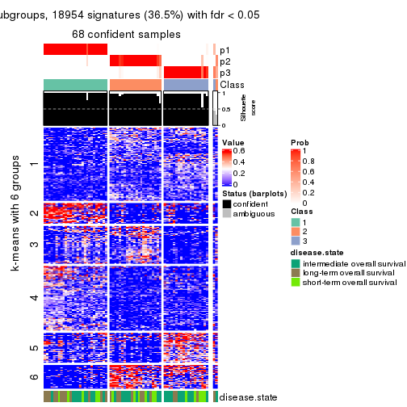</p>

</div>
<div id='tab-MAD-skmeans-get-signatures-no-scale-3'>
<pre><code class="r">get_signatures(res, k = 4, scale_rows = FALSE)
</code></pre>

<p></p>

</div>
<div id='tab-MAD-skmeans-get-signatures-no-scale-4'>
<pre><code class="r">get_signatures(res, k = 5, scale_rows = FALSE)
</code></pre>

<p></p>

</div>
<div id='tab-MAD-skmeans-get-signatures-no-scale-5'>
<pre><code class="r">get_signatures(res, k = 6, scale_rows = FALSE)
</code></pre>

<p></p>

</div>
</div>


Compare the overlap of signatures from different k:

```r
compare_signatures(res)
```


`get_signature()` returns a data frame invisibly. TO get the list of signatures, the function
call should be assigned to a variable explicitly. In following code, if `plot` argument is set
to `FALSE`, no heatmap is plotted while only the differential analysis is performed.

```r
# code only for demonstration
tb = get_signature(res, k = ..., plot = FALSE)
```

An example of the output of `tb` is:

```
#>   which_row         fdr    mean_1    mean_2 scaled_mean_1 scaled_mean_2 km
#> 1        38 0.042760348  8.373488  9.131774    -0.5533452     0.5164555  1
#> 2        40 0.018707592  7.106213  8.469186    -0.6173731     0.5762149  1
#> 3        55 0.019134737 10.221463 11.207825    -0.6159697     0.5749050  1
#> 4        59 0.006059896  5.921854  7.869574    -0.6899429     0.6439467  1
#> 5        60 0.018055526  8.928898 10.211722    -0.6204761     0.5791110  1
#> 6        98 0.009384629 15.714769 14.887706     0.6635654    -0.6193277  2
...
```

The columns in `tb` are:

1. `which_row`: row indices corresponding to the input matrix.
2. `fdr`: FDR for the differential test. 
3. `mean_x`: The mean value in group x.
4. `scaled_mean_x`: The mean value in group x after rows are scaled.
5. `km`: Row groups if k-means clustering is applied to rows.


UMAP plot which shows how samples are separated.


<script>
$( function() {
	$( '#tabs-MAD-skmeans-dimension-reduction' ).tabs();
} );
</script>
<div id='tabs-MAD-skmeans-dimension-reduction'>
<ul>
<li><a href='#tab-MAD-skmeans-dimension-reduction-1'>k = 2</a></li>
<li><a href='#tab-MAD-skmeans-dimension-reduction-2'>k = 3</a></li>
<li><a href='#tab-MAD-skmeans-dimension-reduction-3'>k = 4</a></li>
<li><a href='#tab-MAD-skmeans-dimension-reduction-4'>k = 5</a></li>
<li><a href='#tab-MAD-skmeans-dimension-reduction-5'>k = 6</a></li>
</ul>
<div id='tab-MAD-skmeans-dimension-reduction-1'>
<pre><code class="r">dimension_reduction(res, k = 2, method = &quot;UMAP&quot;)
</code></pre>

<p></p>

</div>
<div id='tab-MAD-skmeans-dimension-reduction-2'>
<pre><code class="r">dimension_reduction(res, k = 3, method = &quot;UMAP&quot;)
</code></pre>

<p></p>

</div>
<div id='tab-MAD-skmeans-dimension-reduction-3'>
<pre><code class="r">dimension_reduction(res, k = 4, method = &quot;UMAP&quot;)
</code></pre>

<p></p>

</div>
<div id='tab-MAD-skmeans-dimension-reduction-4'>
<pre><code class="r">dimension_reduction(res, k = 5, method = &quot;UMAP&quot;)
</code></pre>

<p></p>

</div>
<div id='tab-MAD-skmeans-dimension-reduction-5'>
<pre><code class="r">dimension_reduction(res, k = 6, method = &quot;UMAP&quot;)
</code></pre>

<p>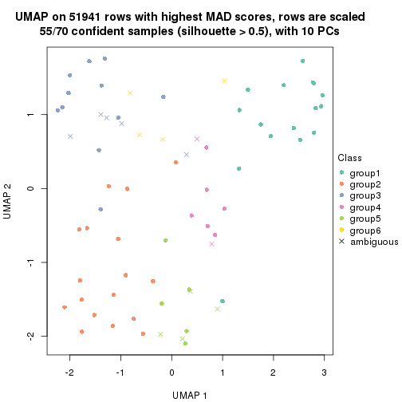</p>

</div>
</div>


Following heatmap shows how subgroups are split when increasing `k`:

```r
collect_classes(res)
```


Test correlation between subgroups and known annotations. If the known
annotation is numeric, one-way ANOVA test is applied, and if the known
annotation is discrete, chi-squared contingency table test is applied.

```r
test_to_known_factors(res)
```

```
#>              n disease.state(p) k
#> MAD:skmeans 69            0.119 2
#> MAD:skmeans 68            0.344 3
#> MAD:skmeans 67            0.526 4
#> MAD:skmeans 57            0.268 5
#> MAD:skmeans 55            0.464 6
```


If matrix rows can be associated to genes, consider to use `GO_Enrichment(res,
...)` to perform function enrichment for the signature genes.


 

---------------------------------------------------


### MAD:pam


The object with results only for a single top-value method and a single partition method 
can be extracted as:

```r
res = res_list["MAD", "pam"]
# you can also extract it by
# res = res_list["MAD:pam"]
```

A summary of `res` and all the functions that can be applied to it:

```r
res
```

```
#> A 'ConsensusPartition' object with k = 2, 3, 4, 5, 6.
#>   On a matrix with 51941 rows and 70 columns.
#>   Top rows (1000, 2000, 3000, 4000, 5000) are extracted by 'MAD' method.
#>   Subgroups are detected by 'pam' method.
#>   Performed in total 1250 partitions by row resampling.
#>   Best k for subgroups seems to be 2.
#> 
#> Following methods can be applied to this 'ConsensusPartition' object:
#>  [1] "cola_report"             "collect_classes"         "collect_plots"          
#>  [4] "collect_stats"           "colnames"                "compare_signatures"     
#>  [7] "consensus_heatmap"       "dimension_reduction"     "functional_enrichment"  
#> [10] "get_anno_col"            "get_anno"                "get_classes"            
#> [13] "get_consensus"           "get_matrix"              "get_membership"         
#> [16] "get_param"               "get_signatures"          "get_stats"              
#> [19] "is_best_k"               "is_stable_k"             "membership_heatmap"     
#> [22] "ncol"                    "nrow"                    "plot_ecdf"              
#> [25] "rownames"                "select_partition_number" "show"                   
#> [28] "suggest_best_k"          "test_to_known_factors"
```

`collect_plots()` function collects all the plots made from `res` for all `k` (number of partitions)
into one single page to provide an easy and fast comparison between different `k`.

```r
collect_plots(res)
```


The plots are:

- The first row: a plot of the ECDF (Empirical cumulative distribution
  function) curves of the consensus matrix for each `k` and the heatmap of
  predicted classes for each `k`.
- The second row: heatmaps of the consensus matrix for each `k`.
- The third row: heatmaps of the membership matrix for each `k`.
- The fouth row: heatmaps of the signatures for each `k`.

All the plots in panels can be made by individual functions and they are
plotted later in this section.

`select_partition_number()` produces several plots showing different
statistics for choosing "optimized" `k`. There are following statistics:

- ECDF curves of the consensus matrix for each `k`;
- 1-PAC. [The PAC
  score](https://en.wikipedia.org/wiki/Consensus_clustering#Over-interpretation_potential_of_consensus_clustering)
  measures the proportion of the ambiguous subgrouping.
- Mean silhouette score.
- Concordance. The mean probability of fiting the consensus class ids in all
  partitions.
- Area increased. Denote $A_k$ as the area under the ECDF curve for current
  `k`, the area increased is defined as $A_k - A_{k-1}$.
- Rand index. The percent of pairs of samples that are both in a same cluster
  or both are not in a same cluster in the partition of k and k-1.
- Jaccard index. The ratio of pairs of samples are both in a same cluster in
  the partition of k and k-1 and the pairs of samples are both in a same
  cluster in the partition k or k-1.

The detailed explanations of these statistics can be found in [the cola
vignette](http://bioconductor.org/packages/devel/bioc/vignettes/cola/inst/doc/cola.html#toc_13).

Generally speaking, lower PAC score, higher mean silhouette score or higher
concordance corresponds to better partition. Rand index and Jaccard index
measure how similar the current partition is compared to partition with `k-1`.
If they are too similar, we won't accept `k` is better than `k-1`.

```r
select_partition_number(res)
```


The numeric values for all these statistics can be obtained by `get_stats()`.

```r
get_stats(res)
```

```
#>   k 1-PAC mean_silhouette concordance area_increased  Rand Jaccard
#> 2 2 0.766           0.916       0.961         0.5053 0.494   0.494
#> 3 3 0.677           0.764       0.839         0.2954 0.824   0.655
#> 4 4 0.630           0.752       0.864         0.1358 0.847   0.595
#> 5 5 0.817           0.773       0.889         0.0661 0.909   0.673
#> 6 6 0.889           0.803       0.906         0.0445 0.933   0.705
```

`suggest_best_k()` suggests the best $k$ based on these statistics. The rules are as follows:

- All $k$ with Jaccard index larger than 0.95 are removed because the increase of
  the partition number does not provides enough extra information. If all $k$ are removed,
  the best $k$ is assigned by `NA`.
- For $k$ with 1-PAC larger than 0.9, the maximal $k$ is taken as the "best k". Other $k$ is called "optional k".
- If it does not fit the second rule. The $k$ with the highest vote of highest
  1-PAC, mean silhouette and concordance is taken as the "best k".

```r
suggest_best_k(res)
```

```
#> [1] 2
```


Following shows the table of the partitions (You need to click the **show/hide
code output** link to see it). The membership matrix (columns with name `p*`)
is inferred by
[`clue::cl_consensus()`](https://www.rdocumentation.org/link/cl_consensus?package=clue)
function with the `SE` method. Basically the value in the membership matrix
represents the probability to belong to a certain group. The finall class
label for an item is determined with the group with highest probability it
belongs to.

In `get_classes()` function, the entropy is calculated from the membership
matrix and the silhouette score is calculated from the consensus matrix.


<script>
$( function() {
	$( '#tabs-MAD-pam-get-classes' ).tabs();
} );
</script>
<div id='tabs-MAD-pam-get-classes'>
<ul>
<li><a href='#tab-MAD-pam-get-classes-1'>k = 2</a></li>
<li><a href='#tab-MAD-pam-get-classes-2'>k = 3</a></li>
<li><a href='#tab-MAD-pam-get-classes-3'>k = 4</a></li>
<li><a href='#tab-MAD-pam-get-classes-4'>k = 5</a></li>
<li><a href='#tab-MAD-pam-get-classes-5'>k = 6</a></li>
</ul>

<div id='tab-MAD-pam-get-classes-1'>
<p><a id='tab-MAD-pam-get-classes-1-a' style='color:#0366d6' href='#'>show/hide code output</a></p>
<pre><code class="r">cbind(get_classes(res, k = 2), get_membership(res, k = 2))
</code></pre>

<pre><code>#&gt;            class entropy silhouette    p1    p2
#&gt; GSM1299517     2  0.0000      0.957 0.000 1.000
#&gt; GSM1299518     2  0.0000      0.957 0.000 1.000
#&gt; GSM1299519     2  0.0000      0.957 0.000 1.000
#&gt; GSM1299520     1  0.0000      0.957 1.000 0.000
#&gt; GSM1299521     1  0.0000      0.957 1.000 0.000
#&gt; GSM1299522     2  0.0000      0.957 0.000 1.000
#&gt; GSM1299523     1  0.0000      0.957 1.000 0.000
#&gt; GSM1299524     2  0.0000      0.957 0.000 1.000
#&gt; GSM1299525     2  0.6048      0.842 0.148 0.852
#&gt; GSM1299526     2  0.0000      0.957 0.000 1.000
#&gt; GSM1299527     2  0.0000      0.957 0.000 1.000
#&gt; GSM1299528     2  0.9954      0.198 0.460 0.540
#&gt; GSM1299529     2  0.2603      0.930 0.044 0.956
#&gt; GSM1299530     1  0.0000      0.957 1.000 0.000
#&gt; GSM1299531     2  0.0000      0.957 0.000 1.000
#&gt; GSM1299575     1  0.0000      0.957 1.000 0.000
#&gt; GSM1299532     2  0.0000      0.957 0.000 1.000
#&gt; GSM1299533     2  0.0000      0.957 0.000 1.000
#&gt; GSM1299534     2  0.0000      0.957 0.000 1.000
#&gt; GSM1299535     2  0.0000      0.957 0.000 1.000
#&gt; GSM1299536     1  0.0000      0.957 1.000 0.000
#&gt; GSM1299537     2  0.0000      0.957 0.000 1.000
#&gt; GSM1299538     1  0.0672      0.951 0.992 0.008
#&gt; GSM1299539     1  0.0000      0.957 1.000 0.000
#&gt; GSM1299540     2  0.0000      0.957 0.000 1.000
#&gt; GSM1299541     2  0.1843      0.938 0.028 0.972
#&gt; GSM1299542     2  0.0000      0.957 0.000 1.000
#&gt; GSM1299543     2  0.5059      0.876 0.112 0.888
#&gt; GSM1299544     2  0.6048      0.842 0.148 0.852
#&gt; GSM1299545     1  0.6048      0.830 0.852 0.148
#&gt; GSM1299546     2  0.0000      0.957 0.000 1.000
#&gt; GSM1299547     1  0.0000      0.957 1.000 0.000
#&gt; GSM1299548     1  0.9323      0.527 0.652 0.348
#&gt; GSM1299549     1  0.0000      0.957 1.000 0.000
#&gt; GSM1299550     1  0.0000      0.957 1.000 0.000
#&gt; GSM1299551     2  0.0000      0.957 0.000 1.000
#&gt; GSM1299552     1  0.0000      0.957 1.000 0.000
#&gt; GSM1299553     1  0.0000      0.957 1.000 0.000
#&gt; GSM1299554     2  0.6148      0.838 0.152 0.848
#&gt; GSM1299555     2  0.0000      0.957 0.000 1.000
#&gt; GSM1299556     1  0.6148      0.827 0.848 0.152
#&gt; GSM1299557     2  0.0000      0.957 0.000 1.000
#&gt; GSM1299558     2  0.3431      0.916 0.064 0.936
#&gt; GSM1299559     1  0.6973      0.789 0.812 0.188
#&gt; GSM1299560     2  0.0000      0.957 0.000 1.000
#&gt; GSM1299576     1  0.0000      0.957 1.000 0.000
#&gt; GSM1299577     1  0.0000      0.957 1.000 0.000
#&gt; GSM1299561     2  0.0000      0.957 0.000 1.000
#&gt; GSM1299562     2  0.0000      0.957 0.000 1.000
#&gt; GSM1299563     1  0.0000      0.957 1.000 0.000
#&gt; GSM1299564     1  0.0000      0.957 1.000 0.000
#&gt; GSM1299565     2  0.0000      0.957 0.000 1.000
#&gt; GSM1299566     1  0.8861      0.540 0.696 0.304
#&gt; GSM1299567     1  0.6048      0.830 0.852 0.148
#&gt; GSM1299568     2  0.0000      0.957 0.000 1.000
#&gt; GSM1299569     2  0.6048      0.842 0.148 0.852
#&gt; GSM1299570     1  0.0000      0.957 1.000 0.000
#&gt; GSM1299571     2  0.0000      0.957 0.000 1.000
#&gt; GSM1299572     2  0.6048      0.842 0.148 0.852
#&gt; GSM1299573     2  0.0000      0.957 0.000 1.000
#&gt; GSM1299574     2  0.0000      0.957 0.000 1.000
#&gt; GSM1299578     1  0.0000      0.957 1.000 0.000
#&gt; GSM1299579     1  0.0000      0.957 1.000 0.000
#&gt; GSM1299580     1  0.0376      0.955 0.996 0.004
#&gt; GSM1299581     1  0.0000      0.957 1.000 0.000
#&gt; GSM1299582     1  0.0000      0.957 1.000 0.000
#&gt; GSM1299583     1  0.0000      0.957 1.000 0.000
#&gt; GSM1299584     1  0.0000      0.957 1.000 0.000
#&gt; GSM1299585     1  0.0000      0.957 1.000 0.000
#&gt; GSM1299586     1  0.0000      0.957 1.000 0.000
</code></pre>

<script>
$('#tab-MAD-pam-get-classes-1-a').parent().next().next().hide();
$('#tab-MAD-pam-get-classes-1-a').click(function(){
  $('#tab-MAD-pam-get-classes-1-a').parent().next().next().toggle();
  return(false);
});
</script>
</div>

<div id='tab-MAD-pam-get-classes-2'>
<p><a id='tab-MAD-pam-get-classes-2-a' style='color:#0366d6' href='#'>show/hide code output</a></p>
<pre><code class="r">cbind(get_classes(res, k = 3), get_membership(res, k = 3))
</code></pre>

<pre><code>#&gt;            class entropy silhouette    p1    p2    p3
#&gt; GSM1299517     3  0.6252     0.7300 0.000 0.444 0.556
#&gt; GSM1299518     2  0.0000     0.7363 0.000 1.000 0.000
#&gt; GSM1299519     2  0.0000     0.7363 0.000 1.000 0.000
#&gt; GSM1299520     1  0.5431     0.7181 0.716 0.000 0.284
#&gt; GSM1299521     1  0.0000     0.9115 1.000 0.000 0.000
#&gt; GSM1299522     2  0.0000     0.7363 0.000 1.000 0.000
#&gt; GSM1299523     1  0.0000     0.9115 1.000 0.000 0.000
#&gt; GSM1299524     3  0.6192     0.7600 0.000 0.420 0.580
#&gt; GSM1299525     2  0.5497     0.7157 0.000 0.708 0.292
#&gt; GSM1299526     2  0.0000     0.7363 0.000 1.000 0.000
#&gt; GSM1299527     3  0.5497     0.8949 0.000 0.292 0.708
#&gt; GSM1299528     2  0.9070     0.5313 0.172 0.536 0.292
#&gt; GSM1299529     2  0.5497     0.7157 0.000 0.708 0.292
#&gt; GSM1299530     1  0.0000     0.9115 1.000 0.000 0.000
#&gt; GSM1299531     2  0.5497     0.7157 0.000 0.708 0.292
#&gt; GSM1299575     1  0.0000     0.9115 1.000 0.000 0.000
#&gt; GSM1299532     3  0.6062     0.7234 0.000 0.384 0.616
#&gt; GSM1299533     2  0.0424     0.7300 0.000 0.992 0.008
#&gt; GSM1299534     2  0.5529     0.7146 0.000 0.704 0.296
#&gt; GSM1299535     2  0.0000     0.7363 0.000 1.000 0.000
#&gt; GSM1299536     1  0.5560     0.7063 0.700 0.000 0.300
#&gt; GSM1299537     3  0.5497     0.8949 0.000 0.292 0.708
#&gt; GSM1299538     1  0.5896     0.7045 0.700 0.008 0.292
#&gt; GSM1299539     1  0.5497     0.7116 0.708 0.000 0.292
#&gt; GSM1299540     2  0.6308    -0.6306 0.000 0.508 0.492
#&gt; GSM1299541     3  0.5497     0.8949 0.000 0.292 0.708
#&gt; GSM1299542     3  0.5560     0.8902 0.000 0.300 0.700
#&gt; GSM1299543     2  0.5497     0.7157 0.000 0.708 0.292
#&gt; GSM1299544     2  0.5497     0.7157 0.000 0.708 0.292
#&gt; GSM1299545     1  0.0237     0.9088 0.996 0.000 0.004
#&gt; GSM1299546     2  0.0000     0.7363 0.000 1.000 0.000
#&gt; GSM1299547     1  0.0000     0.9115 1.000 0.000 0.000
#&gt; GSM1299548     3  0.6161     0.8802 0.020 0.272 0.708
#&gt; GSM1299549     1  0.0000     0.9115 1.000 0.000 0.000
#&gt; GSM1299550     1  0.5560     0.7063 0.700 0.000 0.300
#&gt; GSM1299551     2  0.5216     0.7220 0.000 0.740 0.260
#&gt; GSM1299552     1  0.0000     0.9115 1.000 0.000 0.000
#&gt; GSM1299553     1  0.0000     0.9115 1.000 0.000 0.000
#&gt; GSM1299554     3  0.0424     0.5272 0.000 0.008 0.992
#&gt; GSM1299555     2  0.3686     0.5270 0.000 0.860 0.140
#&gt; GSM1299556     3  0.5497     0.8949 0.000 0.292 0.708
#&gt; GSM1299557     2  0.0000     0.7363 0.000 1.000 0.000
#&gt; GSM1299558     2  0.5497     0.7157 0.000 0.708 0.292
#&gt; GSM1299559     3  0.5497     0.8949 0.000 0.292 0.708
#&gt; GSM1299560     3  0.5497     0.8949 0.000 0.292 0.708
#&gt; GSM1299576     1  0.0000     0.9115 1.000 0.000 0.000
#&gt; GSM1299577     1  0.0000     0.9115 1.000 0.000 0.000
#&gt; GSM1299561     3  0.5497     0.8949 0.000 0.292 0.708
#&gt; GSM1299562     2  0.0000     0.7363 0.000 1.000 0.000
#&gt; GSM1299563     1  0.0424     0.9060 0.992 0.000 0.008
#&gt; GSM1299564     1  0.5529     0.7090 0.704 0.000 0.296
#&gt; GSM1299565     2  0.0000     0.7363 0.000 1.000 0.000
#&gt; GSM1299566     1  0.9889     0.0441 0.408 0.296 0.296
#&gt; GSM1299567     3  0.9184     0.7047 0.188 0.284 0.528
#&gt; GSM1299568     2  0.5397     0.7191 0.000 0.720 0.280
#&gt; GSM1299569     2  0.5560     0.7129 0.000 0.700 0.300
#&gt; GSM1299570     1  0.0000     0.9115 1.000 0.000 0.000
#&gt; GSM1299571     2  0.0000     0.7363 0.000 1.000 0.000
#&gt; GSM1299572     2  0.6051     0.5350 0.292 0.696 0.012
#&gt; GSM1299573     2  0.0424     0.7300 0.000 0.992 0.008
#&gt; GSM1299574     2  0.0000     0.7363 0.000 1.000 0.000
#&gt; GSM1299578     1  0.0000     0.9115 1.000 0.000 0.000
#&gt; GSM1299579     1  0.0000     0.9115 1.000 0.000 0.000
#&gt; GSM1299580     1  0.0000     0.9115 1.000 0.000 0.000
#&gt; GSM1299581     1  0.0000     0.9115 1.000 0.000 0.000
#&gt; GSM1299582     1  0.0000     0.9115 1.000 0.000 0.000
#&gt; GSM1299583     1  0.0000     0.9115 1.000 0.000 0.000
#&gt; GSM1299584     1  0.0000     0.9115 1.000 0.000 0.000
#&gt; GSM1299585     1  0.0000     0.9115 1.000 0.000 0.000
#&gt; GSM1299586     1  0.0000     0.9115 1.000 0.000 0.000
</code></pre>

<script>
$('#tab-MAD-pam-get-classes-2-a').parent().next().next().hide();
$('#tab-MAD-pam-get-classes-2-a').click(function(){
  $('#tab-MAD-pam-get-classes-2-a').parent().next().next().toggle();
  return(false);
});
</script>
</div>

<div id='tab-MAD-pam-get-classes-3'>
<p><a id='tab-MAD-pam-get-classes-3-a' style='color:#0366d6' href='#'>show/hide code output</a></p>
<pre><code class="r">cbind(get_classes(res, k = 4), get_membership(res, k = 4))
</code></pre>

<pre><code>#&gt;            class entropy silhouette    p1    p2    p3    p4
#&gt; GSM1299517     3  0.4164     0.7524 0.000 0.264 0.736 0.000
#&gt; GSM1299518     2  0.0188     0.9107 0.000 0.996 0.004 0.000
#&gt; GSM1299519     2  0.0188     0.9107 0.000 0.996 0.004 0.000
#&gt; GSM1299520     4  0.1118     0.7407 0.036 0.000 0.000 0.964
#&gt; GSM1299521     1  0.0188     0.8249 0.996 0.000 0.000 0.004
#&gt; GSM1299522     2  0.0000     0.9111 0.000 1.000 0.000 0.000
#&gt; GSM1299523     4  0.4599     0.5648 0.088 0.000 0.112 0.800
#&gt; GSM1299524     3  0.5188     0.7504 0.000 0.240 0.716 0.044
#&gt; GSM1299525     2  0.3569     0.7730 0.000 0.804 0.000 0.196
#&gt; GSM1299526     2  0.0188     0.9107 0.000 0.996 0.004 0.000
#&gt; GSM1299527     3  0.2530     0.8654 0.000 0.112 0.888 0.000
#&gt; GSM1299528     4  0.4643     0.4804 0.000 0.344 0.000 0.656
#&gt; GSM1299529     4  0.4925     0.3358 0.000 0.428 0.000 0.572
#&gt; GSM1299530     1  0.6792     0.5376 0.548 0.000 0.112 0.340
#&gt; GSM1299531     2  0.2530     0.8578 0.000 0.888 0.000 0.112
#&gt; GSM1299575     1  0.2530     0.8398 0.888 0.000 0.112 0.000
#&gt; GSM1299532     3  0.5310     0.4537 0.000 0.412 0.576 0.012
#&gt; GSM1299533     2  0.0188     0.9107 0.000 0.996 0.004 0.000
#&gt; GSM1299534     2  0.2944     0.8501 0.000 0.868 0.004 0.128
#&gt; GSM1299535     2  0.0000     0.9111 0.000 1.000 0.000 0.000
#&gt; GSM1299536     4  0.0817     0.7530 0.024 0.000 0.000 0.976
#&gt; GSM1299537     3  0.2530     0.8654 0.000 0.112 0.888 0.000
#&gt; GSM1299538     4  0.0000     0.7527 0.000 0.000 0.000 1.000
#&gt; GSM1299539     4  0.0469     0.7552 0.012 0.000 0.000 0.988
#&gt; GSM1299540     3  0.4857     0.6423 0.004 0.176 0.772 0.048
#&gt; GSM1299541     3  0.2530     0.8654 0.000 0.112 0.888 0.000
#&gt; GSM1299542     3  0.2530     0.8654 0.000 0.112 0.888 0.000
#&gt; GSM1299543     2  0.2589     0.8559 0.000 0.884 0.000 0.116
#&gt; GSM1299544     4  0.4981     0.1829 0.000 0.464 0.000 0.536
#&gt; GSM1299545     1  0.6664     0.5799 0.580 0.000 0.112 0.308
#&gt; GSM1299546     2  0.0000     0.9111 0.000 1.000 0.000 0.000
#&gt; GSM1299547     1  0.0188     0.8249 0.996 0.000 0.000 0.004
#&gt; GSM1299548     3  0.0188     0.7650 0.004 0.000 0.996 0.000
#&gt; GSM1299549     1  0.0188     0.8249 0.996 0.000 0.000 0.004
#&gt; GSM1299550     4  0.0188     0.7527 0.000 0.004 0.000 0.996
#&gt; GSM1299551     2  0.2345     0.8666 0.000 0.900 0.000 0.100
#&gt; GSM1299552     1  0.0188     0.8249 0.996 0.000 0.000 0.004
#&gt; GSM1299553     1  0.4985    -0.0674 0.532 0.000 0.000 0.468
#&gt; GSM1299554     4  0.3545     0.6488 0.000 0.008 0.164 0.828
#&gt; GSM1299555     2  0.2921     0.7587 0.000 0.860 0.140 0.000
#&gt; GSM1299556     3  0.2530     0.8654 0.000 0.112 0.888 0.000
#&gt; GSM1299557     2  0.0657     0.9078 0.012 0.984 0.004 0.000
#&gt; GSM1299558     2  0.3219     0.8134 0.000 0.836 0.000 0.164
#&gt; GSM1299559     3  0.2530     0.8654 0.000 0.112 0.888 0.000
#&gt; GSM1299560     3  0.2530     0.8654 0.000 0.112 0.888 0.000
#&gt; GSM1299576     1  0.0188     0.8249 0.996 0.000 0.000 0.004
#&gt; GSM1299577     1  0.6792     0.5376 0.548 0.000 0.112 0.340
#&gt; GSM1299561     3  0.2530     0.8654 0.000 0.112 0.888 0.000
#&gt; GSM1299562     2  0.0188     0.9107 0.000 0.996 0.004 0.000
#&gt; GSM1299563     4  0.3975     0.5382 0.240 0.000 0.000 0.760
#&gt; GSM1299564     4  0.1940     0.7175 0.076 0.000 0.000 0.924
#&gt; GSM1299565     2  0.0188     0.9107 0.000 0.996 0.004 0.000
#&gt; GSM1299566     4  0.2589     0.7269 0.000 0.116 0.000 0.884
#&gt; GSM1299567     3  0.4800     0.3571 0.004 0.000 0.656 0.340
#&gt; GSM1299568     2  0.2704     0.8518 0.000 0.876 0.000 0.124
#&gt; GSM1299569     4  0.4776     0.4248 0.000 0.376 0.000 0.624
#&gt; GSM1299570     1  0.6894     0.4786 0.512 0.000 0.112 0.376
#&gt; GSM1299571     2  0.0188     0.9107 0.000 0.996 0.004 0.000
#&gt; GSM1299572     2  0.5272     0.6821 0.112 0.752 0.000 0.136
#&gt; GSM1299573     2  0.2714     0.8373 0.112 0.884 0.000 0.004
#&gt; GSM1299574     2  0.0000     0.9111 0.000 1.000 0.000 0.000
#&gt; GSM1299578     1  0.2530     0.8398 0.888 0.000 0.112 0.000
#&gt; GSM1299579     1  0.0188     0.8249 0.996 0.000 0.000 0.004
#&gt; GSM1299580     1  0.2530     0.8398 0.888 0.000 0.112 0.000
#&gt; GSM1299581     1  0.2530     0.8398 0.888 0.000 0.112 0.000
#&gt; GSM1299582     1  0.2530     0.8398 0.888 0.000 0.112 0.000
#&gt; GSM1299583     1  0.2530     0.8398 0.888 0.000 0.112 0.000
#&gt; GSM1299584     1  0.2530     0.8398 0.888 0.000 0.112 0.000
#&gt; GSM1299585     1  0.0188     0.8249 0.996 0.000 0.000 0.004
#&gt; GSM1299586     1  0.2530     0.8398 0.888 0.000 0.112 0.000
</code></pre>

<script>
$('#tab-MAD-pam-get-classes-3-a').parent().next().next().hide();
$('#tab-MAD-pam-get-classes-3-a').click(function(){
  $('#tab-MAD-pam-get-classes-3-a').parent().next().next().toggle();
  return(false);
});
</script>
</div>

<div id='tab-MAD-pam-get-classes-4'>
<p><a id='tab-MAD-pam-get-classes-4-a' style='color:#0366d6' href='#'>show/hide code output</a></p>
<pre><code class="r">cbind(get_classes(res, k = 5), get_membership(res, k = 5))
</code></pre>

<pre><code>#&gt;            class entropy silhouette    p1    p2    p3    p4    p5
#&gt; GSM1299517     3  0.2648     0.7497 0.000 0.152 0.848 0.000 0.000
#&gt; GSM1299518     2  0.0162     0.8953 0.000 0.996 0.004 0.000 0.000
#&gt; GSM1299519     2  0.0162     0.8953 0.000 0.996 0.004 0.000 0.000
#&gt; GSM1299520     4  0.2329     0.7287 0.000 0.000 0.000 0.876 0.124
#&gt; GSM1299521     1  0.1041     0.9306 0.964 0.000 0.000 0.004 0.032
#&gt; GSM1299522     2  0.0000     0.8952 0.000 1.000 0.000 0.000 0.000
#&gt; GSM1299523     4  0.2020     0.7406 0.000 0.000 0.000 0.900 0.100
#&gt; GSM1299524     3  0.6516     0.4029 0.000 0.036 0.528 0.096 0.340
#&gt; GSM1299525     2  0.4302     0.0261 0.000 0.520 0.000 0.000 0.480
#&gt; GSM1299526     2  0.0162     0.8953 0.000 0.996 0.004 0.000 0.000
#&gt; GSM1299527     3  0.0000     0.8598 0.000 0.000 1.000 0.000 0.000
#&gt; GSM1299528     5  0.1851     0.8761 0.000 0.088 0.000 0.000 0.912
#&gt; GSM1299529     2  0.2020     0.8269 0.000 0.900 0.000 0.000 0.100
#&gt; GSM1299530     4  0.2020     0.7309 0.100 0.000 0.000 0.900 0.000
#&gt; GSM1299531     2  0.0000     0.8952 0.000 1.000 0.000 0.000 0.000
#&gt; GSM1299575     1  0.0703     0.9349 0.976 0.000 0.000 0.024 0.000
#&gt; GSM1299532     3  0.7159     0.2905 0.000 0.340 0.480 0.096 0.084
#&gt; GSM1299533     2  0.3047     0.8163 0.000 0.868 0.004 0.044 0.084
#&gt; GSM1299534     2  0.3796     0.7985 0.000 0.820 0.004 0.076 0.100
#&gt; GSM1299535     2  0.0000     0.8952 0.000 1.000 0.000 0.000 0.000
#&gt; GSM1299536     5  0.1732     0.8849 0.000 0.000 0.000 0.080 0.920
#&gt; GSM1299537     3  0.0000     0.8598 0.000 0.000 1.000 0.000 0.000
#&gt; GSM1299538     4  0.4138     0.3738 0.000 0.000 0.000 0.616 0.384
#&gt; GSM1299539     5  0.2338     0.8691 0.004 0.000 0.000 0.112 0.884
#&gt; GSM1299540     3  0.5846     0.7002 0.028 0.112 0.724 0.052 0.084
#&gt; GSM1299541     3  0.0000     0.8598 0.000 0.000 1.000 0.000 0.000
#&gt; GSM1299542     3  0.0000     0.8598 0.000 0.000 1.000 0.000 0.000
#&gt; GSM1299543     2  0.0510     0.8888 0.000 0.984 0.000 0.000 0.016
#&gt; GSM1299544     5  0.2329     0.8527 0.000 0.124 0.000 0.000 0.876
#&gt; GSM1299545     4  0.1544     0.7239 0.068 0.000 0.000 0.932 0.000
#&gt; GSM1299546     2  0.0000     0.8952 0.000 1.000 0.000 0.000 0.000
#&gt; GSM1299547     1  0.1124     0.9288 0.960 0.000 0.000 0.004 0.036
#&gt; GSM1299548     3  0.0162     0.8573 0.004 0.000 0.996 0.000 0.000
#&gt; GSM1299549     1  0.1041     0.9306 0.964 0.000 0.000 0.004 0.032
#&gt; GSM1299550     5  0.0880     0.8659 0.000 0.000 0.000 0.032 0.968
#&gt; GSM1299551     2  0.0000     0.8952 0.000 1.000 0.000 0.000 0.000
#&gt; GSM1299552     1  0.1041     0.9306 0.964 0.000 0.000 0.004 0.032
#&gt; GSM1299553     1  0.6127     0.0201 0.484 0.000 0.000 0.384 0.132
#&gt; GSM1299554     4  0.4300     0.1631 0.000 0.000 0.000 0.524 0.476
#&gt; GSM1299555     2  0.5823     0.6442 0.000 0.700 0.120 0.096 0.084
#&gt; GSM1299556     3  0.0404     0.8562 0.000 0.000 0.988 0.000 0.012
#&gt; GSM1299557     2  0.1372     0.8748 0.016 0.956 0.004 0.000 0.024
#&gt; GSM1299558     2  0.4300     0.0360 0.000 0.524 0.000 0.000 0.476
#&gt; GSM1299559     3  0.0000     0.8598 0.000 0.000 1.000 0.000 0.000
#&gt; GSM1299560     3  0.0000     0.8598 0.000 0.000 1.000 0.000 0.000
#&gt; GSM1299576     1  0.1041     0.9306 0.964 0.000 0.000 0.004 0.032
#&gt; GSM1299577     4  0.1121     0.7468 0.044 0.000 0.000 0.956 0.000
#&gt; GSM1299561     3  0.3702     0.7612 0.000 0.000 0.820 0.096 0.084
#&gt; GSM1299562     2  0.0162     0.8953 0.000 0.996 0.004 0.000 0.000
#&gt; GSM1299563     4  0.2193     0.7477 0.028 0.000 0.000 0.912 0.060
#&gt; GSM1299564     4  0.2707     0.7384 0.024 0.000 0.000 0.876 0.100
#&gt; GSM1299565     2  0.0162     0.8953 0.000 0.996 0.004 0.000 0.000
#&gt; GSM1299566     5  0.2416     0.8824 0.000 0.012 0.000 0.100 0.888
#&gt; GSM1299567     4  0.4990     0.2735 0.036 0.000 0.384 0.580 0.000
#&gt; GSM1299568     2  0.1478     0.8560 0.000 0.936 0.000 0.000 0.064
#&gt; GSM1299569     5  0.1792     0.8817 0.000 0.084 0.000 0.000 0.916
#&gt; GSM1299570     4  0.2248     0.7372 0.088 0.000 0.000 0.900 0.012
#&gt; GSM1299571     2  0.0162     0.8953 0.000 0.996 0.004 0.000 0.000
#&gt; GSM1299572     4  0.6479     0.2314 0.024 0.332 0.000 0.528 0.116
#&gt; GSM1299573     2  0.4835     0.7306 0.024 0.760 0.000 0.100 0.116
#&gt; GSM1299574     2  0.0000     0.8952 0.000 1.000 0.000 0.000 0.000
#&gt; GSM1299578     1  0.0703     0.9349 0.976 0.000 0.000 0.024 0.000
#&gt; GSM1299579     1  0.0963     0.9298 0.964 0.000 0.000 0.000 0.036
#&gt; GSM1299580     1  0.0703     0.9349 0.976 0.000 0.000 0.024 0.000
#&gt; GSM1299581     1  0.0703     0.9349 0.976 0.000 0.000 0.024 0.000
#&gt; GSM1299582     1  0.0703     0.9349 0.976 0.000 0.000 0.024 0.000
#&gt; GSM1299583     1  0.0703     0.9349 0.976 0.000 0.000 0.024 0.000
#&gt; GSM1299584     1  0.0703     0.9349 0.976 0.000 0.000 0.024 0.000
#&gt; GSM1299585     1  0.1041     0.9306 0.964 0.000 0.000 0.004 0.032
#&gt; GSM1299586     1  0.0703     0.9349 0.976 0.000 0.000 0.024 0.000
</code></pre>

<script>
$('#tab-MAD-pam-get-classes-4-a').parent().next().next().hide();
$('#tab-MAD-pam-get-classes-4-a').click(function(){
  $('#tab-MAD-pam-get-classes-4-a').parent().next().next().toggle();
  return(false);
});
</script>
</div>

<div id='tab-MAD-pam-get-classes-5'>
<p><a id='tab-MAD-pam-get-classes-5-a' style='color:#0366d6' href='#'>show/hide code output</a></p>
<pre><code class="r">cbind(get_classes(res, k = 6), get_membership(res, k = 6))
</code></pre>

<pre><code>#&gt;            class entropy silhouette    p1    p2    p3    p4    p5    p6
#&gt; GSM1299517     3  0.2378     0.7430 0.000 0.152 0.848 0.000 0.000 0.000
#&gt; GSM1299518     2  0.0146     0.9432 0.000 0.996 0.000 0.000 0.000 0.004
#&gt; GSM1299519     2  0.0000     0.9457 0.000 1.000 0.000 0.000 0.000 0.000
#&gt; GSM1299520     4  0.0146     0.8321 0.000 0.000 0.000 0.996 0.004 0.000
#&gt; GSM1299521     1  0.1327     0.9119 0.936 0.000 0.000 0.000 0.000 0.064
#&gt; GSM1299522     2  0.0000     0.9457 0.000 1.000 0.000 0.000 0.000 0.000
#&gt; GSM1299523     4  0.0146     0.8321 0.000 0.000 0.000 0.996 0.004 0.000
#&gt; GSM1299524     6  0.2595     0.8118 0.000 0.000 0.084 0.000 0.044 0.872
#&gt; GSM1299525     5  0.3782     0.4009 0.000 0.412 0.000 0.000 0.588 0.000
#&gt; GSM1299526     2  0.0000     0.9457 0.000 1.000 0.000 0.000 0.000 0.000
#&gt; GSM1299527     3  0.0363     0.9173 0.000 0.000 0.988 0.000 0.000 0.012
#&gt; GSM1299528     5  0.0146     0.8292 0.000 0.004 0.000 0.000 0.996 0.000
#&gt; GSM1299529     2  0.1204     0.8973 0.000 0.944 0.000 0.000 0.056 0.000
#&gt; GSM1299530     4  0.0146     0.8317 0.004 0.000 0.000 0.996 0.000 0.000
#&gt; GSM1299531     2  0.0000     0.9457 0.000 1.000 0.000 0.000 0.000 0.000
#&gt; GSM1299575     1  0.0363     0.9182 0.988 0.000 0.000 0.000 0.000 0.012
#&gt; GSM1299532     6  0.2962     0.8347 0.000 0.068 0.084 0.000 0.000 0.848
#&gt; GSM1299533     2  0.3864    -0.1240 0.000 0.520 0.000 0.000 0.000 0.480
#&gt; GSM1299534     6  0.4356     0.4707 0.000 0.360 0.000 0.000 0.032 0.608
#&gt; GSM1299535     2  0.0000     0.9457 0.000 1.000 0.000 0.000 0.000 0.000
#&gt; GSM1299536     5  0.0820     0.8264 0.000 0.000 0.000 0.012 0.972 0.016
#&gt; GSM1299537     3  0.0000     0.9148 0.000 0.000 1.000 0.000 0.000 0.000
#&gt; GSM1299538     4  0.3330     0.5964 0.000 0.000 0.000 0.716 0.284 0.000
#&gt; GSM1299539     5  0.0632     0.8216 0.000 0.000 0.000 0.024 0.976 0.000
#&gt; GSM1299540     3  0.4943     0.2241 0.044 0.012 0.552 0.000 0.000 0.392
#&gt; GSM1299541     3  0.0363     0.9173 0.000 0.000 0.988 0.000 0.000 0.012
#&gt; GSM1299542     3  0.0363     0.9173 0.000 0.000 0.988 0.000 0.000 0.012
#&gt; GSM1299543     2  0.0547     0.9318 0.000 0.980 0.000 0.000 0.020 0.000
#&gt; GSM1299544     5  0.1204     0.8183 0.000 0.056 0.000 0.000 0.944 0.000
#&gt; GSM1299545     4  0.4834     0.5156 0.104 0.000 0.000 0.644 0.000 0.252
#&gt; GSM1299546     2  0.0000     0.9457 0.000 1.000 0.000 0.000 0.000 0.000
#&gt; GSM1299547     1  0.2544     0.8712 0.852 0.000 0.000 0.004 0.004 0.140
#&gt; GSM1299548     3  0.0363     0.9164 0.000 0.000 0.988 0.000 0.000 0.012
#&gt; GSM1299549     1  0.2288     0.8864 0.876 0.000 0.000 0.004 0.004 0.116
#&gt; GSM1299550     5  0.1644     0.7935 0.000 0.000 0.000 0.004 0.920 0.076
#&gt; GSM1299551     2  0.0000     0.9457 0.000 1.000 0.000 0.000 0.000 0.000
#&gt; GSM1299552     1  0.2288     0.8864 0.876 0.000 0.000 0.004 0.004 0.116
#&gt; GSM1299553     1  0.6371     0.0319 0.416 0.000 0.000 0.412 0.056 0.116
#&gt; GSM1299554     4  0.5876     0.3003 0.000 0.000 0.000 0.480 0.260 0.260
#&gt; GSM1299555     6  0.2696     0.8254 0.000 0.116 0.028 0.000 0.000 0.856
#&gt; GSM1299556     3  0.0547     0.9049 0.000 0.000 0.980 0.000 0.000 0.020
#&gt; GSM1299557     2  0.2306     0.8389 0.008 0.888 0.000 0.004 0.004 0.096
#&gt; GSM1299558     5  0.3756     0.4263 0.000 0.400 0.000 0.000 0.600 0.000
#&gt; GSM1299559     3  0.0000     0.9148 0.000 0.000 1.000 0.000 0.000 0.000
#&gt; GSM1299560     3  0.0363     0.9173 0.000 0.000 0.988 0.000 0.000 0.012
#&gt; GSM1299576     1  0.1327     0.9119 0.936 0.000 0.000 0.000 0.000 0.064
#&gt; GSM1299577     4  0.0146     0.8316 0.000 0.000 0.000 0.996 0.000 0.004
#&gt; GSM1299561     6  0.2178     0.7922 0.000 0.000 0.132 0.000 0.000 0.868
#&gt; GSM1299562     2  0.0000     0.9457 0.000 1.000 0.000 0.000 0.000 0.000
#&gt; GSM1299563     4  0.0146     0.8316 0.000 0.000 0.000 0.996 0.000 0.004
#&gt; GSM1299564     4  0.1204     0.8102 0.000 0.000 0.000 0.944 0.056 0.000
#&gt; GSM1299565     2  0.0000     0.9457 0.000 1.000 0.000 0.000 0.000 0.000
#&gt; GSM1299566     5  0.0260     0.8276 0.000 0.000 0.000 0.008 0.992 0.000
#&gt; GSM1299567     4  0.5102     0.3355 0.064 0.000 0.348 0.576 0.000 0.012
#&gt; GSM1299568     2  0.1444     0.8810 0.000 0.928 0.000 0.000 0.072 0.000
#&gt; GSM1299569     5  0.1418     0.8229 0.000 0.032 0.000 0.000 0.944 0.024
#&gt; GSM1299570     4  0.0146     0.8317 0.004 0.000 0.000 0.996 0.000 0.000
#&gt; GSM1299571     2  0.0000     0.9457 0.000 1.000 0.000 0.000 0.000 0.000
#&gt; GSM1299572     6  0.2107     0.8140 0.012 0.024 0.008 0.036 0.000 0.920
#&gt; GSM1299573     6  0.1757     0.8319 0.012 0.052 0.000 0.000 0.008 0.928
#&gt; GSM1299574     2  0.0000     0.9457 0.000 1.000 0.000 0.000 0.000 0.000
#&gt; GSM1299578     1  0.0363     0.9182 0.988 0.000 0.000 0.000 0.000 0.012
#&gt; GSM1299579     1  0.1327     0.9119 0.936 0.000 0.000 0.000 0.000 0.064
#&gt; GSM1299580     1  0.0363     0.9182 0.988 0.000 0.000 0.000 0.000 0.012
#&gt; GSM1299581     1  0.0000     0.9191 1.000 0.000 0.000 0.000 0.000 0.000
#&gt; GSM1299582     1  0.0363     0.9182 0.988 0.000 0.000 0.000 0.000 0.012
#&gt; GSM1299583     1  0.0000     0.9191 1.000 0.000 0.000 0.000 0.000 0.000
#&gt; GSM1299584     1  0.0363     0.9182 0.988 0.000 0.000 0.000 0.000 0.012
#&gt; GSM1299585     1  0.1327     0.9119 0.936 0.000 0.000 0.000 0.000 0.064
#&gt; GSM1299586     1  0.0363     0.9182 0.988 0.000 0.000 0.000 0.000 0.012
</code></pre>

<script>
$('#tab-MAD-pam-get-classes-5-a').parent().next().next().hide();
$('#tab-MAD-pam-get-classes-5-a').click(function(){
  $('#tab-MAD-pam-get-classes-5-a').parent().next().next().toggle();
  return(false);
});
</script>
</div>
</div>

Heatmaps for the consensus matrix. It visualizes the probability of two
samples to be in a same group.


<script>
$( function() {
	$( '#tabs-MAD-pam-consensus-heatmap' ).tabs();
} );
</script>
<div id='tabs-MAD-pam-consensus-heatmap'>
<ul>
<li><a href='#tab-MAD-pam-consensus-heatmap-1'>k = 2</a></li>
<li><a href='#tab-MAD-pam-consensus-heatmap-2'>k = 3</a></li>
<li><a href='#tab-MAD-pam-consensus-heatmap-3'>k = 4</a></li>
<li><a href='#tab-MAD-pam-consensus-heatmap-4'>k = 5</a></li>
<li><a href='#tab-MAD-pam-consensus-heatmap-5'>k = 6</a></li>
</ul>
<div id='tab-MAD-pam-consensus-heatmap-1'>
<pre><code class="r">consensus_heatmap(res, k = 2)
</code></pre>

<p></p>

</div>
<div id='tab-MAD-pam-consensus-heatmap-2'>
<pre><code class="r">consensus_heatmap(res, k = 3)
</code></pre>

<p></p>

</div>
<div id='tab-MAD-pam-consensus-heatmap-3'>
<pre><code class="r">consensus_heatmap(res, k = 4)
</code></pre>

<p></p>

</div>
<div id='tab-MAD-pam-consensus-heatmap-4'>
<pre><code class="r">consensus_heatmap(res, k = 5)
</code></pre>

<p></p>

</div>
<div id='tab-MAD-pam-consensus-heatmap-5'>
<pre><code class="r">consensus_heatmap(res, k = 6)
</code></pre>

<p></p>

</div>
</div>

Heatmaps for the membership of samples in all partitions to see how consistent they are:


<script>
$( function() {
	$( '#tabs-MAD-pam-membership-heatmap' ).tabs();
} );
</script>
<div id='tabs-MAD-pam-membership-heatmap'>
<ul>
<li><a href='#tab-MAD-pam-membership-heatmap-1'>k = 2</a></li>
<li><a href='#tab-MAD-pam-membership-heatmap-2'>k = 3</a></li>
<li><a href='#tab-MAD-pam-membership-heatmap-3'>k = 4</a></li>
<li><a href='#tab-MAD-pam-membership-heatmap-4'>k = 5</a></li>
<li><a href='#tab-MAD-pam-membership-heatmap-5'>k = 6</a></li>
</ul>
<div id='tab-MAD-pam-membership-heatmap-1'>
<pre><code class="r">membership_heatmap(res, k = 2)
</code></pre>

<p></p>

</div>
<div id='tab-MAD-pam-membership-heatmap-2'>
<pre><code class="r">membership_heatmap(res, k = 3)
</code></pre>

<p></p>

</div>
<div id='tab-MAD-pam-membership-heatmap-3'>
<pre><code class="r">membership_heatmap(res, k = 4)
</code></pre>

<p></p>

</div>
<div id='tab-MAD-pam-membership-heatmap-4'>
<pre><code class="r">membership_heatmap(res, k = 5)
</code></pre>

<p></p>

</div>
<div id='tab-MAD-pam-membership-heatmap-5'>
<pre><code class="r">membership_heatmap(res, k = 6)
</code></pre>

<p></p>

</div>
</div>

As soon as we have had the classes for columns, we can look for signatures
which are significantly different between classes which can be candidate marks
for certain classes. Following are the heatmaps for signatures.


Signature heatmaps where rows are scaled:


<script>
$( function() {
	$( '#tabs-MAD-pam-get-signatures' ).tabs();
} );
</script>
<div id='tabs-MAD-pam-get-signatures'>
<ul>
<li><a href='#tab-MAD-pam-get-signatures-1'>k = 2</a></li>
<li><a href='#tab-MAD-pam-get-signatures-2'>k = 3</a></li>
<li><a href='#tab-MAD-pam-get-signatures-3'>k = 4</a></li>
<li><a href='#tab-MAD-pam-get-signatures-4'>k = 5</a></li>
<li><a href='#tab-MAD-pam-get-signatures-5'>k = 6</a></li>
</ul>
<div id='tab-MAD-pam-get-signatures-1'>
<pre><code class="r">get_signatures(res, k = 2)
</code></pre>

<p></p>

</div>
<div id='tab-MAD-pam-get-signatures-2'>
<pre><code class="r">get_signatures(res, k = 3)
</code></pre>

<p></p>

</div>
<div id='tab-MAD-pam-get-signatures-3'>
<pre><code class="r">get_signatures(res, k = 4)
</code></pre>

<p></p>

</div>
<div id='tab-MAD-pam-get-signatures-4'>
<pre><code class="r">get_signatures(res, k = 5)
</code></pre>

<p></p>

</div>
<div id='tab-MAD-pam-get-signatures-5'>
<pre><code class="r">get_signatures(res, k = 6)
</code></pre>

<p></p>

</div>
</div>


Signature heatmaps where rows are not scaled:


<script>
$( function() {
	$( '#tabs-MAD-pam-get-signatures-no-scale' ).tabs();
} );
</script>
<div id='tabs-MAD-pam-get-signatures-no-scale'>
<ul>
<li><a href='#tab-MAD-pam-get-signatures-no-scale-1'>k = 2</a></li>
<li><a href='#tab-MAD-pam-get-signatures-no-scale-2'>k = 3</a></li>
<li><a href='#tab-MAD-pam-get-signatures-no-scale-3'>k = 4</a></li>
<li><a href='#tab-MAD-pam-get-signatures-no-scale-4'>k = 5</a></li>
<li><a href='#tab-MAD-pam-get-signatures-no-scale-5'>k = 6</a></li>
</ul>
<div id='tab-MAD-pam-get-signatures-no-scale-1'>
<pre><code class="r">get_signatures(res, k = 2, scale_rows = FALSE)
</code></pre>

<p></p>

</div>
<div id='tab-MAD-pam-get-signatures-no-scale-2'>
<pre><code class="r">get_signatures(res, k = 3, scale_rows = FALSE)
</code></pre>

<p></p>

</div>
<div id='tab-MAD-pam-get-signatures-no-scale-3'>
<pre><code class="r">get_signatures(res, k = 4, scale_rows = FALSE)
</code></pre>

<p>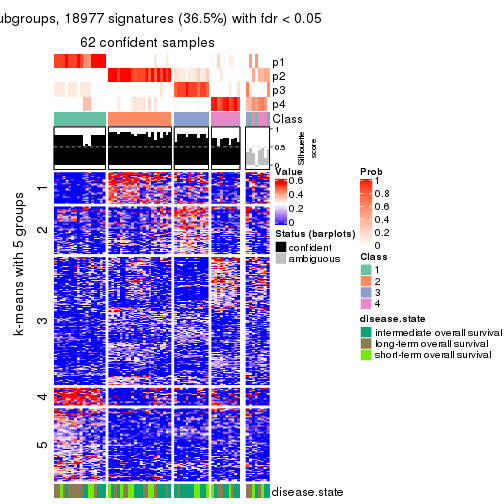</p>

</div>
<div id='tab-MAD-pam-get-signatures-no-scale-4'>
<pre><code class="r">get_signatures(res, k = 5, scale_rows = FALSE)
</code></pre>

<p></p>

</div>
<div id='tab-MAD-pam-get-signatures-no-scale-5'>
<pre><code class="r">get_signatures(res, k = 6, scale_rows = FALSE)
</code></pre>

<p></p>

</div>
</div>


Compare the overlap of signatures from different k:

```r
compare_signatures(res)
```


`get_signature()` returns a data frame invisibly. TO get the list of signatures, the function
call should be assigned to a variable explicitly. In following code, if `plot` argument is set
to `FALSE`, no heatmap is plotted while only the differential analysis is performed.

```r
# code only for demonstration
tb = get_signature(res, k = ..., plot = FALSE)
```

An example of the output of `tb` is:

```
#>   which_row         fdr    mean_1    mean_2 scaled_mean_1 scaled_mean_2 km
#> 1        38 0.042760348  8.373488  9.131774    -0.5533452     0.5164555  1
#> 2        40 0.018707592  7.106213  8.469186    -0.6173731     0.5762149  1
#> 3        55 0.019134737 10.221463 11.207825    -0.6159697     0.5749050  1
#> 4        59 0.006059896  5.921854  7.869574    -0.6899429     0.6439467  1
#> 5        60 0.018055526  8.928898 10.211722    -0.6204761     0.5791110  1
#> 6        98 0.009384629 15.714769 14.887706     0.6635654    -0.6193277  2
...
```

The columns in `tb` are:

1. `which_row`: row indices corresponding to the input matrix.
2. `fdr`: FDR for the differential test. 
3. `mean_x`: The mean value in group x.
4. `scaled_mean_x`: The mean value in group x after rows are scaled.
5. `km`: Row groups if k-means clustering is applied to rows.


UMAP plot which shows how samples are separated.


<script>
$( function() {
	$( '#tabs-MAD-pam-dimension-reduction' ).tabs();
} );
</script>
<div id='tabs-MAD-pam-dimension-reduction'>
<ul>
<li><a href='#tab-MAD-pam-dimension-reduction-1'>k = 2</a></li>
<li><a href='#tab-MAD-pam-dimension-reduction-2'>k = 3</a></li>
<li><a href='#tab-MAD-pam-dimension-reduction-3'>k = 4</a></li>
<li><a href='#tab-MAD-pam-dimension-reduction-4'>k = 5</a></li>
<li><a href='#tab-MAD-pam-dimension-reduction-5'>k = 6</a></li>
</ul>
<div id='tab-MAD-pam-dimension-reduction-1'>
<pre><code class="r">dimension_reduction(res, k = 2, method = &quot;UMAP&quot;)
</code></pre>

<p></p>

</div>
<div id='tab-MAD-pam-dimension-reduction-2'>
<pre><code class="r">dimension_reduction(res, k = 3, method = &quot;UMAP&quot;)
</code></pre>

<p></p>

</div>
<div id='tab-MAD-pam-dimension-reduction-3'>
<pre><code class="r">dimension_reduction(res, k = 4, method = &quot;UMAP&quot;)
</code></pre>

<p></p>

</div>
<div id='tab-MAD-pam-dimension-reduction-4'>
<pre><code class="r">dimension_reduction(res, k = 5, method = &quot;UMAP&quot;)
</code></pre>

<p></p>

</div>
<div id='tab-MAD-pam-dimension-reduction-5'>
<pre><code class="r">dimension_reduction(res, k = 6, method = &quot;UMAP&quot;)
</code></pre>

<p>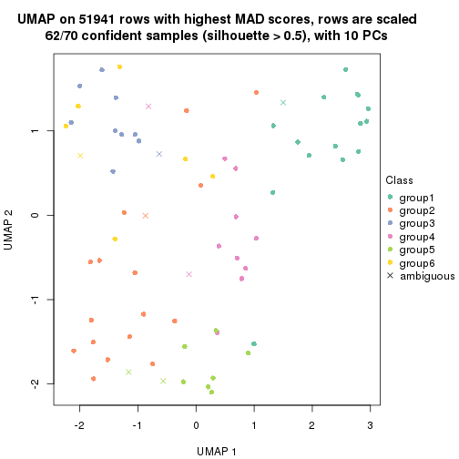</p>

</div>
</div>


Following heatmap shows how subgroups are split when increasing `k`:

```r
collect_classes(res)
```


Test correlation between subgroups and known annotations. If the known
annotation is numeric, one-way ANOVA test is applied, and if the known
annotation is discrete, chi-squared contingency table test is applied.

```r
test_to_known_factors(res)
```

```
#>          n disease.state(p) k
#> MAD:pam 69            0.232 2
#> MAD:pam 68            0.287 3
#> MAD:pam 62            0.382 4
#> MAD:pam 61            0.179 5
#> MAD:pam 62            0.185 6
```


If matrix rows can be associated to genes, consider to use `GO_Enrichment(res,
...)` to perform function enrichment for the signature genes.


 

---------------------------------------------------


### MAD:mclust


The object with results only for a single top-value method and a single partition method 
can be extracted as:

```r
res = res_list["MAD", "mclust"]
# you can also extract it by
# res = res_list["MAD:mclust"]
```

A summary of `res` and all the functions that can be applied to it:

```r
res
```

```
#> A 'ConsensusPartition' object with k = 2, 3, 4, 5, 6.
#>   On a matrix with 51941 rows and 70 columns.
#>   Top rows (1000, 2000, 3000, 4000, 5000) are extracted by 'MAD' method.
#>   Subgroups are detected by 'mclust' method.
#>   Performed in total 1250 partitions by row resampling.
#>   Best k for subgroups seems to be 4.
#> 
#> Following methods can be applied to this 'ConsensusPartition' object:
#>  [1] "cola_report"             "collect_classes"         "collect_plots"          
#>  [4] "collect_stats"           "colnames"                "compare_signatures"     
#>  [7] "consensus_heatmap"       "dimension_reduction"     "functional_enrichment"  
#> [10] "get_anno_col"            "get_anno"                "get_classes"            
#> [13] "get_consensus"           "get_matrix"              "get_membership"         
#> [16] "get_param"               "get_signatures"          "get_stats"              
#> [19] "is_best_k"               "is_stable_k"             "membership_heatmap"     
#> [22] "ncol"                    "nrow"                    "plot_ecdf"              
#> [25] "rownames"                "select_partition_number" "show"                   
#> [28] "suggest_best_k"          "test_to_known_factors"
```

`collect_plots()` function collects all the plots made from `res` for all `k` (number of partitions)
into one single page to provide an easy and fast comparison between different `k`.

```r
collect_plots(res)
```


The plots are:

- The first row: a plot of the ECDF (Empirical cumulative distribution
  function) curves of the consensus matrix for each `k` and the heatmap of
  predicted classes for each `k`.
- The second row: heatmaps of the consensus matrix for each `k`.
- The third row: heatmaps of the membership matrix for each `k`.
- The fouth row: heatmaps of the signatures for each `k`.

All the plots in panels can be made by individual functions and they are
plotted later in this section.

`select_partition_number()` produces several plots showing different
statistics for choosing "optimized" `k`. There are following statistics:

- ECDF curves of the consensus matrix for each `k`;
- 1-PAC. [The PAC
  score](https://en.wikipedia.org/wiki/Consensus_clustering#Over-interpretation_potential_of_consensus_clustering)
  measures the proportion of the ambiguous subgrouping.
- Mean silhouette score.
- Concordance. The mean probability of fiting the consensus class ids in all
  partitions.
- Area increased. Denote $A_k$ as the area under the ECDF curve for current
  `k`, the area increased is defined as $A_k - A_{k-1}$.
- Rand index. The percent of pairs of samples that are both in a same cluster
  or both are not in a same cluster in the partition of k and k-1.
- Jaccard index. The ratio of pairs of samples are both in a same cluster in
  the partition of k and k-1 and the pairs of samples are both in a same
  cluster in the partition k or k-1.

The detailed explanations of these statistics can be found in [the cola
vignette](http://bioconductor.org/packages/devel/bioc/vignettes/cola/inst/doc/cola.html#toc_13).

Generally speaking, lower PAC score, higher mean silhouette score or higher
concordance corresponds to better partition. Rand index and Jaccard index
measure how similar the current partition is compared to partition with `k-1`.
If they are too similar, we won't accept `k` is better than `k-1`.

```r
select_partition_number(res)
```


The numeric values for all these statistics can be obtained by `get_stats()`.

```r
get_stats(res)
```

```
#>   k 1-PAC mean_silhouette concordance area_increased  Rand Jaccard
#> 2 2 0.412           0.725       0.843         0.3969 0.612   0.612
#> 3 3 0.538           0.661       0.845         0.4305 0.622   0.450
#> 4 4 0.751           0.883       0.916         0.2176 0.812   0.573
#> 5 5 0.697           0.662       0.787         0.1245 0.789   0.422
#> 6 6 0.719           0.637       0.767         0.0547 0.948   0.761
```

`suggest_best_k()` suggests the best $k$ based on these statistics. The rules are as follows:

- All $k$ with Jaccard index larger than 0.95 are removed because the increase of
  the partition number does not provides enough extra information. If all $k$ are removed,
  the best $k$ is assigned by `NA`.
- For $k$ with 1-PAC larger than 0.9, the maximal $k$ is taken as the "best k". Other $k$ is called "optional k".
- If it does not fit the second rule. The $k$ with the highest vote of highest
  1-PAC, mean silhouette and concordance is taken as the "best k".

```r
suggest_best_k(res)
```

```
#> [1] 4
```


Following shows the table of the partitions (You need to click the **show/hide
code output** link to see it). The membership matrix (columns with name `p*`)
is inferred by
[`clue::cl_consensus()`](https://www.rdocumentation.org/link/cl_consensus?package=clue)
function with the `SE` method. Basically the value in the membership matrix
represents the probability to belong to a certain group. The finall class
label for an item is determined with the group with highest probability it
belongs to.

In `get_classes()` function, the entropy is calculated from the membership
matrix and the silhouette score is calculated from the consensus matrix.


<script>
$( function() {
	$( '#tabs-MAD-mclust-get-classes' ).tabs();
} );
</script>
<div id='tabs-MAD-mclust-get-classes'>
<ul>
<li><a href='#tab-MAD-mclust-get-classes-1'>k = 2</a></li>
<li><a href='#tab-MAD-mclust-get-classes-2'>k = 3</a></li>
<li><a href='#tab-MAD-mclust-get-classes-3'>k = 4</a></li>
<li><a href='#tab-MAD-mclust-get-classes-4'>k = 5</a></li>
<li><a href='#tab-MAD-mclust-get-classes-5'>k = 6</a></li>
</ul>

<div id='tab-MAD-mclust-get-classes-1'>
<p><a id='tab-MAD-mclust-get-classes-1-a' style='color:#0366d6' href='#'>show/hide code output</a></p>
<pre><code class="r">cbind(get_classes(res, k = 2), get_membership(res, k = 2))
</code></pre>

<pre><code>#&gt;            class entropy silhouette    p1    p2
#&gt; GSM1299517     2  0.9087      0.338 0.324 0.676
#&gt; GSM1299518     1  0.9580      0.651 0.620 0.380
#&gt; GSM1299519     2  0.0000      0.886 0.000 1.000
#&gt; GSM1299520     1  0.1414      0.761 0.980 0.020
#&gt; GSM1299521     1  0.1414      0.761 0.980 0.020
#&gt; GSM1299522     2  0.0000      0.886 0.000 1.000
#&gt; GSM1299523     1  0.1414      0.761 0.980 0.020
#&gt; GSM1299524     1  0.9580      0.651 0.620 0.380
#&gt; GSM1299525     2  0.9129      0.326 0.328 0.672
#&gt; GSM1299526     2  0.0000      0.886 0.000 1.000
#&gt; GSM1299527     1  0.9580      0.651 0.620 0.380
#&gt; GSM1299528     1  0.8661      0.710 0.712 0.288
#&gt; GSM1299529     2  0.8499      0.476 0.276 0.724
#&gt; GSM1299530     1  0.0938      0.758 0.988 0.012
#&gt; GSM1299531     2  0.0000      0.886 0.000 1.000
#&gt; GSM1299575     1  0.0000      0.751 1.000 0.000
#&gt; GSM1299532     1  0.9580      0.651 0.620 0.380
#&gt; GSM1299533     2  0.0000      0.886 0.000 1.000
#&gt; GSM1299534     1  0.9580      0.651 0.620 0.380
#&gt; GSM1299535     2  0.0000      0.886 0.000 1.000
#&gt; GSM1299536     1  0.6712      0.757 0.824 0.176
#&gt; GSM1299537     1  0.9580      0.651 0.620 0.380
#&gt; GSM1299538     1  0.6438      0.759 0.836 0.164
#&gt; GSM1299539     1  0.2236      0.764 0.964 0.036
#&gt; GSM1299540     1  0.9491      0.659 0.632 0.368
#&gt; GSM1299541     1  0.9580      0.651 0.620 0.380
#&gt; GSM1299542     1  0.9580      0.651 0.620 0.380
#&gt; GSM1299543     2  0.0000      0.886 0.000 1.000
#&gt; GSM1299544     1  0.9922      0.510 0.552 0.448
#&gt; GSM1299545     1  0.2603      0.764 0.956 0.044
#&gt; GSM1299546     2  0.0000      0.886 0.000 1.000
#&gt; GSM1299547     1  0.5178      0.764 0.884 0.116
#&gt; GSM1299548     1  0.9580      0.651 0.620 0.380
#&gt; GSM1299549     1  0.5408      0.764 0.876 0.124
#&gt; GSM1299550     1  0.7299      0.748 0.796 0.204
#&gt; GSM1299551     2  0.0000      0.886 0.000 1.000
#&gt; GSM1299552     1  0.1414      0.761 0.980 0.020
#&gt; GSM1299553     1  0.1414      0.761 0.980 0.020
#&gt; GSM1299554     1  0.7745      0.739 0.772 0.228
#&gt; GSM1299555     1  0.9580      0.651 0.620 0.380
#&gt; GSM1299556     1  0.9580      0.651 0.620 0.380
#&gt; GSM1299557     1  0.9491      0.659 0.632 0.368
#&gt; GSM1299558     2  0.0000      0.886 0.000 1.000
#&gt; GSM1299559     1  0.9580      0.651 0.620 0.380
#&gt; GSM1299560     1  0.9580      0.651 0.620 0.380
#&gt; GSM1299576     1  0.0000      0.751 1.000 0.000
#&gt; GSM1299577     1  0.1414      0.761 0.980 0.020
#&gt; GSM1299561     1  0.9580      0.651 0.620 0.380
#&gt; GSM1299562     2  0.3114      0.835 0.056 0.944
#&gt; GSM1299563     1  0.1633      0.762 0.976 0.024
#&gt; GSM1299564     1  0.6438      0.759 0.836 0.164
#&gt; GSM1299565     2  0.0000      0.886 0.000 1.000
#&gt; GSM1299566     1  0.7745      0.739 0.772 0.228
#&gt; GSM1299567     1  0.6438      0.759 0.836 0.164
#&gt; GSM1299568     2  0.9460      0.183 0.364 0.636
#&gt; GSM1299569     1  0.9580      0.651 0.620 0.380
#&gt; GSM1299570     1  0.1414      0.761 0.980 0.020
#&gt; GSM1299571     2  0.0000      0.886 0.000 1.000
#&gt; GSM1299572     1  0.9580      0.651 0.620 0.380
#&gt; GSM1299573     1  0.9580      0.651 0.620 0.380
#&gt; GSM1299574     2  0.0000      0.886 0.000 1.000
#&gt; GSM1299578     1  0.0000      0.751 1.000 0.000
#&gt; GSM1299579     1  0.1414      0.761 0.980 0.020
#&gt; GSM1299580     1  0.0000      0.751 1.000 0.000
#&gt; GSM1299581     1  0.0000      0.751 1.000 0.000
#&gt; GSM1299582     1  0.0000      0.751 1.000 0.000
#&gt; GSM1299583     1  0.0000      0.751 1.000 0.000
#&gt; GSM1299584     1  0.0000      0.751 1.000 0.000
#&gt; GSM1299585     1  0.0000      0.751 1.000 0.000
#&gt; GSM1299586     1  0.0000      0.751 1.000 0.000
</code></pre>

<script>
$('#tab-MAD-mclust-get-classes-1-a').parent().next().next().hide();
$('#tab-MAD-mclust-get-classes-1-a').click(function(){
  $('#tab-MAD-mclust-get-classes-1-a').parent().next().next().toggle();
  return(false);
});
</script>
</div>

<div id='tab-MAD-mclust-get-classes-2'>
<p><a id='tab-MAD-mclust-get-classes-2-a' style='color:#0366d6' href='#'>show/hide code output</a></p>
<pre><code class="r">cbind(get_classes(res, k = 3), get_membership(res, k = 3))
</code></pre>

<pre><code>#&gt;            class entropy silhouette    p1    p2    p3
#&gt; GSM1299517     3  0.0592     0.8359 0.000 0.012 0.988
#&gt; GSM1299518     3  0.0237     0.8360 0.000 0.004 0.996
#&gt; GSM1299519     2  0.0747     0.8997 0.000 0.984 0.016
#&gt; GSM1299520     1  0.6754     0.5382 0.556 0.012 0.432
#&gt; GSM1299521     1  0.6724     0.5479 0.568 0.012 0.420
#&gt; GSM1299522     2  0.0747     0.8997 0.000 0.984 0.016
#&gt; GSM1299523     1  0.6754     0.5382 0.556 0.012 0.432
#&gt; GSM1299524     3  0.0000     0.8360 0.000 0.000 1.000
#&gt; GSM1299525     3  0.3193     0.8003 0.004 0.100 0.896
#&gt; GSM1299526     2  0.5760     0.5987 0.000 0.672 0.328
#&gt; GSM1299527     3  0.0000     0.8360 0.000 0.000 1.000
#&gt; GSM1299528     3  0.3528     0.7996 0.016 0.092 0.892
#&gt; GSM1299529     3  0.5650     0.4591 0.000 0.312 0.688
#&gt; GSM1299530     1  0.6735     0.5461 0.564 0.012 0.424
#&gt; GSM1299531     2  0.0747     0.8997 0.000 0.984 0.016
#&gt; GSM1299575     1  0.0237     0.6211 0.996 0.004 0.000
#&gt; GSM1299532     3  0.0000     0.8360 0.000 0.000 1.000
#&gt; GSM1299533     2  0.4796     0.7430 0.000 0.780 0.220
#&gt; GSM1299534     3  0.0000     0.8360 0.000 0.000 1.000
#&gt; GSM1299535     3  0.6045     0.2661 0.000 0.380 0.620
#&gt; GSM1299536     3  0.6688    -0.0487 0.408 0.012 0.580
#&gt; GSM1299537     3  0.0000     0.8360 0.000 0.000 1.000
#&gt; GSM1299538     3  0.6811    -0.0266 0.404 0.016 0.580
#&gt; GSM1299539     1  0.6745     0.5412 0.560 0.012 0.428
#&gt; GSM1299540     3  0.0592     0.8359 0.000 0.012 0.988
#&gt; GSM1299541     3  0.0000     0.8360 0.000 0.000 1.000
#&gt; GSM1299542     3  0.0000     0.8360 0.000 0.000 1.000
#&gt; GSM1299543     2  0.0747     0.8997 0.000 0.984 0.016
#&gt; GSM1299544     3  0.2878     0.8025 0.000 0.096 0.904
#&gt; GSM1299545     1  0.6936     0.4552 0.524 0.016 0.460
#&gt; GSM1299546     2  0.0747     0.8997 0.000 0.984 0.016
#&gt; GSM1299547     3  0.6763    -0.1744 0.436 0.012 0.552
#&gt; GSM1299548     3  0.0000     0.8360 0.000 0.000 1.000
#&gt; GSM1299549     3  0.5812     0.4694 0.264 0.012 0.724
#&gt; GSM1299550     3  0.6578     0.5157 0.224 0.052 0.724
#&gt; GSM1299551     2  0.0747     0.8997 0.000 0.984 0.016
#&gt; GSM1299552     1  0.6745     0.5412 0.560 0.012 0.428
#&gt; GSM1299553     1  0.6745     0.5412 0.560 0.012 0.428
#&gt; GSM1299554     3  0.2492     0.8190 0.016 0.048 0.936
#&gt; GSM1299555     3  0.0592     0.8359 0.000 0.012 0.988
#&gt; GSM1299556     3  0.0424     0.8360 0.000 0.008 0.992
#&gt; GSM1299557     3  0.1399     0.8322 0.004 0.028 0.968
#&gt; GSM1299558     2  0.5650     0.5713 0.000 0.688 0.312
#&gt; GSM1299559     3  0.0424     0.8360 0.000 0.008 0.992
#&gt; GSM1299560     3  0.0000     0.8360 0.000 0.000 1.000
#&gt; GSM1299576     1  0.0237     0.6211 0.996 0.004 0.000
#&gt; GSM1299577     1  0.6754     0.5382 0.556 0.012 0.432
#&gt; GSM1299561     3  0.0000     0.8360 0.000 0.000 1.000
#&gt; GSM1299562     3  0.2711     0.8093 0.000 0.088 0.912
#&gt; GSM1299563     1  0.6793     0.4896 0.536 0.012 0.452
#&gt; GSM1299564     3  0.6701    -0.0666 0.412 0.012 0.576
#&gt; GSM1299565     2  0.0747     0.8997 0.000 0.984 0.016
#&gt; GSM1299566     3  0.3805     0.7950 0.024 0.092 0.884
#&gt; GSM1299567     3  0.6783    -0.0149 0.396 0.016 0.588
#&gt; GSM1299568     3  0.3038     0.7974 0.000 0.104 0.896
#&gt; GSM1299569     3  0.2796     0.8048 0.000 0.092 0.908
#&gt; GSM1299570     1  0.6754     0.5382 0.556 0.012 0.432
#&gt; GSM1299571     2  0.2711     0.8652 0.000 0.912 0.088
#&gt; GSM1299572     3  0.0592     0.8359 0.000 0.012 0.988
#&gt; GSM1299573     3  0.0237     0.8360 0.000 0.004 0.996
#&gt; GSM1299574     2  0.1411     0.8934 0.000 0.964 0.036
#&gt; GSM1299578     1  0.0237     0.6211 0.996 0.004 0.000
#&gt; GSM1299579     1  0.6724     0.5479 0.568 0.012 0.420
#&gt; GSM1299580     1  0.0661     0.6235 0.988 0.004 0.008
#&gt; GSM1299581     1  0.0237     0.6211 0.996 0.004 0.000
#&gt; GSM1299582     1  0.0237     0.6211 0.996 0.004 0.000
#&gt; GSM1299583     1  0.0237     0.6211 0.996 0.004 0.000
#&gt; GSM1299584     1  0.0237     0.6211 0.996 0.004 0.000
#&gt; GSM1299585     1  0.0592     0.6248 0.988 0.000 0.012
#&gt; GSM1299586     1  0.0237     0.6211 0.996 0.004 0.000
</code></pre>

<script>
$('#tab-MAD-mclust-get-classes-2-a').parent().next().next().hide();
$('#tab-MAD-mclust-get-classes-2-a').click(function(){
  $('#tab-MAD-mclust-get-classes-2-a').parent().next().next().toggle();
  return(false);
});
</script>
</div>

<div id='tab-MAD-mclust-get-classes-3'>
<p><a id='tab-MAD-mclust-get-classes-3-a' style='color:#0366d6' href='#'>show/hide code output</a></p>
<pre><code class="r">cbind(get_classes(res, k = 4), get_membership(res, k = 4))
</code></pre>

<pre><code>#&gt;            class entropy silhouette    p1    p2    p3    p4
#&gt; GSM1299517     3  0.0188      0.919 0.000 0.004 0.996 0.000
#&gt; GSM1299518     3  0.0000      0.920 0.000 0.000 1.000 0.000
#&gt; GSM1299519     2  0.0000      0.917 0.000 1.000 0.000 0.000
#&gt; GSM1299520     4  0.0000      0.910 0.000 0.000 0.000 1.000
#&gt; GSM1299521     4  0.0336      0.911 0.008 0.000 0.000 0.992
#&gt; GSM1299522     2  0.0000      0.917 0.000 1.000 0.000 0.000
#&gt; GSM1299523     4  0.0336      0.911 0.008 0.000 0.000 0.992
#&gt; GSM1299524     3  0.0000      0.920 0.000 0.000 1.000 0.000
#&gt; GSM1299525     3  0.3569      0.819 0.000 0.196 0.804 0.000
#&gt; GSM1299526     3  0.3400      0.831 0.000 0.180 0.820 0.000
#&gt; GSM1299527     3  0.0000      0.920 0.000 0.000 1.000 0.000
#&gt; GSM1299528     3  0.3950      0.823 0.008 0.184 0.804 0.004
#&gt; GSM1299529     3  0.3569      0.819 0.000 0.196 0.804 0.000
#&gt; GSM1299530     4  0.0336      0.911 0.008 0.000 0.000 0.992
#&gt; GSM1299531     2  0.0000      0.917 0.000 1.000 0.000 0.000
#&gt; GSM1299575     1  0.3486      1.000 0.812 0.000 0.000 0.188
#&gt; GSM1299532     3  0.0000      0.920 0.000 0.000 1.000 0.000
#&gt; GSM1299533     3  0.3569      0.819 0.000 0.196 0.804 0.000
#&gt; GSM1299534     3  0.0000      0.920 0.000 0.000 1.000 0.000
#&gt; GSM1299535     3  0.3569      0.819 0.000 0.196 0.804 0.000
#&gt; GSM1299536     4  0.3668      0.753 0.188 0.000 0.004 0.808
#&gt; GSM1299537     3  0.0000      0.920 0.000 0.000 1.000 0.000
#&gt; GSM1299538     4  0.3529      0.716 0.012 0.000 0.152 0.836
#&gt; GSM1299539     4  0.0469      0.904 0.012 0.000 0.000 0.988
#&gt; GSM1299540     3  0.0188      0.919 0.000 0.000 0.996 0.004
#&gt; GSM1299541     3  0.0000      0.920 0.000 0.000 1.000 0.000
#&gt; GSM1299542     3  0.0000      0.920 0.000 0.000 1.000 0.000
#&gt; GSM1299543     2  0.0000      0.917 0.000 1.000 0.000 0.000
#&gt; GSM1299544     3  0.3768      0.824 0.008 0.184 0.808 0.000
#&gt; GSM1299545     4  0.0524      0.910 0.008 0.000 0.004 0.988
#&gt; GSM1299546     2  0.0000      0.917 0.000 1.000 0.000 0.000
#&gt; GSM1299547     4  0.2081      0.853 0.084 0.000 0.000 0.916
#&gt; GSM1299548     3  0.0000      0.920 0.000 0.000 1.000 0.000
#&gt; GSM1299549     4  0.2861      0.804 0.016 0.000 0.096 0.888
#&gt; GSM1299550     3  0.3937      0.823 0.188 0.000 0.800 0.012
#&gt; GSM1299551     2  0.0000      0.917 0.000 1.000 0.000 0.000
#&gt; GSM1299552     4  0.0336      0.911 0.008 0.000 0.000 0.992
#&gt; GSM1299553     4  0.0336      0.911 0.008 0.000 0.000 0.992
#&gt; GSM1299554     3  0.3810      0.825 0.188 0.000 0.804 0.008
#&gt; GSM1299555     3  0.0188      0.919 0.000 0.000 0.996 0.004
#&gt; GSM1299556     3  0.0188      0.919 0.000 0.000 0.996 0.004
#&gt; GSM1299557     3  0.0804      0.915 0.000 0.008 0.980 0.012
#&gt; GSM1299558     2  0.1022      0.895 0.000 0.968 0.032 0.000
#&gt; GSM1299559     3  0.0188      0.919 0.000 0.000 0.996 0.004
#&gt; GSM1299560     3  0.0000      0.920 0.000 0.000 1.000 0.000
#&gt; GSM1299576     1  0.3486      1.000 0.812 0.000 0.000 0.188
#&gt; GSM1299577     4  0.0336      0.911 0.008 0.000 0.000 0.992
#&gt; GSM1299561     3  0.0000      0.920 0.000 0.000 1.000 0.000
#&gt; GSM1299562     3  0.1211      0.908 0.000 0.040 0.960 0.000
#&gt; GSM1299563     4  0.0188      0.908 0.004 0.000 0.000 0.996
#&gt; GSM1299564     4  0.3668      0.753 0.188 0.000 0.004 0.808
#&gt; GSM1299565     2  0.0000      0.917 0.000 1.000 0.000 0.000
#&gt; GSM1299566     3  0.4657      0.837 0.136 0.048 0.804 0.012
#&gt; GSM1299567     4  0.0672      0.909 0.008 0.000 0.008 0.984
#&gt; GSM1299568     3  0.3726      0.803 0.000 0.212 0.788 0.000
#&gt; GSM1299569     3  0.4337      0.840 0.140 0.052 0.808 0.000
#&gt; GSM1299570     4  0.0336      0.911 0.008 0.000 0.000 0.992
#&gt; GSM1299571     2  0.3873      0.690 0.000 0.772 0.228 0.000
#&gt; GSM1299572     3  0.0188      0.919 0.000 0.000 0.996 0.004
#&gt; GSM1299573     3  0.0000      0.920 0.000 0.000 1.000 0.000
#&gt; GSM1299574     2  0.4072      0.648 0.000 0.748 0.252 0.000
#&gt; GSM1299578     1  0.3486      1.000 0.812 0.000 0.000 0.188
#&gt; GSM1299579     4  0.0469      0.909 0.012 0.000 0.000 0.988
#&gt; GSM1299580     1  0.3486      1.000 0.812 0.000 0.000 0.188
#&gt; GSM1299581     1  0.3486      1.000 0.812 0.000 0.000 0.188
#&gt; GSM1299582     1  0.3486      1.000 0.812 0.000 0.000 0.188
#&gt; GSM1299583     1  0.3486      1.000 0.812 0.000 0.000 0.188
#&gt; GSM1299584     1  0.3486      1.000 0.812 0.000 0.000 0.188
#&gt; GSM1299585     4  0.4746      0.179 0.368 0.000 0.000 0.632
#&gt; GSM1299586     1  0.3486      1.000 0.812 0.000 0.000 0.188
</code></pre>

<script>
$('#tab-MAD-mclust-get-classes-3-a').parent().next().next().hide();
$('#tab-MAD-mclust-get-classes-3-a').click(function(){
  $('#tab-MAD-mclust-get-classes-3-a').parent().next().next().toggle();
  return(false);
});
</script>
</div>

<div id='tab-MAD-mclust-get-classes-4'>
<p><a id='tab-MAD-mclust-get-classes-4-a' style='color:#0366d6' href='#'>show/hide code output</a></p>
<pre><code class="r">cbind(get_classes(res, k = 5), get_membership(res, k = 5))
</code></pre>

<pre><code>#&gt;            class entropy silhouette    p1    p2    p3    p4    p5
#&gt; GSM1299517     4  0.4876    0.68029 0.000 0.028 0.396 0.576 0.000
#&gt; GSM1299518     3  0.0404    0.72679 0.000 0.000 0.988 0.012 0.000
#&gt; GSM1299519     2  0.0912    0.85307 0.000 0.972 0.016 0.012 0.000
#&gt; GSM1299520     5  0.2966    0.72683 0.184 0.000 0.000 0.000 0.816
#&gt; GSM1299521     1  0.3730    0.48421 0.712 0.000 0.000 0.000 0.288
#&gt; GSM1299522     2  0.0000    0.84907 0.000 1.000 0.000 0.000 0.000
#&gt; GSM1299523     5  0.3160    0.72628 0.188 0.000 0.000 0.004 0.808
#&gt; GSM1299524     3  0.0162    0.73405 0.000 0.000 0.996 0.004 0.000
#&gt; GSM1299525     2  0.5824    0.59173 0.000 0.628 0.100 0.256 0.016
#&gt; GSM1299526     2  0.3368    0.76236 0.000 0.820 0.156 0.024 0.000
#&gt; GSM1299527     3  0.0000    0.73596 0.000 0.000 1.000 0.000 0.000
#&gt; GSM1299528     5  0.7956    0.10497 0.004 0.176 0.096 0.308 0.416
#&gt; GSM1299529     2  0.5102    0.65629 0.000 0.684 0.100 0.216 0.000
#&gt; GSM1299530     5  0.3752    0.67396 0.292 0.000 0.000 0.000 0.708
#&gt; GSM1299531     2  0.0000    0.84907 0.000 1.000 0.000 0.000 0.000
#&gt; GSM1299575     1  0.0000    0.90510 1.000 0.000 0.000 0.000 0.000
#&gt; GSM1299532     3  0.0000    0.73596 0.000 0.000 1.000 0.000 0.000
#&gt; GSM1299533     2  0.2740    0.81867 0.000 0.876 0.096 0.028 0.000
#&gt; GSM1299534     3  0.0162    0.73405 0.000 0.000 0.996 0.004 0.000
#&gt; GSM1299535     2  0.5263    0.62572 0.000 0.660 0.100 0.240 0.000
#&gt; GSM1299536     5  0.1197    0.65131 0.000 0.000 0.000 0.048 0.952
#&gt; GSM1299537     3  0.0000    0.73596 0.000 0.000 1.000 0.000 0.000
#&gt; GSM1299538     5  0.4473    0.63854 0.324 0.000 0.000 0.020 0.656
#&gt; GSM1299539     5  0.3983    0.62868 0.340 0.000 0.000 0.000 0.660
#&gt; GSM1299540     4  0.3427    0.71674 0.000 0.012 0.192 0.796 0.000
#&gt; GSM1299541     3  0.0000    0.73596 0.000 0.000 1.000 0.000 0.000
#&gt; GSM1299542     3  0.0000    0.73596 0.000 0.000 1.000 0.000 0.000
#&gt; GSM1299543     2  0.0000    0.84907 0.000 1.000 0.000 0.000 0.000
#&gt; GSM1299544     3  0.7402    0.03244 0.000 0.184 0.460 0.300 0.056
#&gt; GSM1299545     5  0.6055    0.49466 0.380 0.000 0.016 0.080 0.524
#&gt; GSM1299546     2  0.0000    0.84907 0.000 1.000 0.000 0.000 0.000
#&gt; GSM1299547     5  0.1851    0.70731 0.088 0.000 0.000 0.000 0.912
#&gt; GSM1299548     3  0.1818    0.68602 0.000 0.000 0.932 0.024 0.044
#&gt; GSM1299549     5  0.5002    0.63407 0.312 0.000 0.000 0.052 0.636
#&gt; GSM1299550     5  0.3904    0.51499 0.000 0.000 0.052 0.156 0.792
#&gt; GSM1299551     2  0.0000    0.84907 0.000 1.000 0.000 0.000 0.000
#&gt; GSM1299552     5  0.4192    0.53971 0.404 0.000 0.000 0.000 0.596
#&gt; GSM1299553     5  0.4171    0.55936 0.396 0.000 0.000 0.000 0.604
#&gt; GSM1299554     3  0.6207    0.15910 0.000 0.000 0.460 0.140 0.400
#&gt; GSM1299555     4  0.3519    0.72658 0.000 0.008 0.216 0.776 0.000
#&gt; GSM1299556     4  0.4304    0.57630 0.000 0.000 0.484 0.516 0.000
#&gt; GSM1299557     4  0.6296    0.69897 0.032 0.052 0.268 0.620 0.028
#&gt; GSM1299558     2  0.1469    0.85239 0.000 0.948 0.036 0.016 0.000
#&gt; GSM1299559     4  0.4440    0.59507 0.000 0.000 0.468 0.528 0.004
#&gt; GSM1299560     3  0.0000    0.73596 0.000 0.000 1.000 0.000 0.000
#&gt; GSM1299576     1  0.0963    0.90314 0.964 0.000 0.000 0.036 0.000
#&gt; GSM1299577     5  0.3196    0.72564 0.192 0.000 0.000 0.004 0.804
#&gt; GSM1299561     3  0.0000    0.73596 0.000 0.000 1.000 0.000 0.000
#&gt; GSM1299562     2  0.6102    0.43954 0.000 0.560 0.176 0.264 0.000
#&gt; GSM1299563     5  0.2929    0.72702 0.180 0.000 0.000 0.000 0.820
#&gt; GSM1299564     5  0.0880    0.65810 0.000 0.000 0.000 0.032 0.968
#&gt; GSM1299565     2  0.0566    0.84989 0.000 0.984 0.004 0.012 0.000
#&gt; GSM1299566     5  0.6214    0.30684 0.004 0.028 0.084 0.292 0.592
#&gt; GSM1299567     5  0.5975    0.55016 0.052 0.000 0.076 0.220 0.652
#&gt; GSM1299568     3  0.6544    0.00588 0.000 0.308 0.468 0.224 0.000
#&gt; GSM1299569     3  0.5691    0.42280 0.000 0.036 0.684 0.096 0.184
#&gt; GSM1299570     5  0.3160    0.72628 0.188 0.000 0.000 0.004 0.808
#&gt; GSM1299571     2  0.1872    0.84758 0.000 0.928 0.052 0.020 0.000
#&gt; GSM1299572     3  0.4957   -0.56367 0.000 0.000 0.528 0.444 0.028
#&gt; GSM1299573     3  0.2074    0.61590 0.000 0.000 0.896 0.104 0.000
#&gt; GSM1299574     2  0.1628    0.84825 0.000 0.936 0.056 0.008 0.000
#&gt; GSM1299578     1  0.0963    0.90314 0.964 0.000 0.000 0.036 0.000
#&gt; GSM1299579     1  0.3752    0.47521 0.708 0.000 0.000 0.000 0.292
#&gt; GSM1299580     1  0.0000    0.90510 1.000 0.000 0.000 0.000 0.000
#&gt; GSM1299581     1  0.0963    0.90314 0.964 0.000 0.000 0.036 0.000
#&gt; GSM1299582     1  0.0000    0.90510 1.000 0.000 0.000 0.000 0.000
#&gt; GSM1299583     1  0.0963    0.90314 0.964 0.000 0.000 0.036 0.000
#&gt; GSM1299584     1  0.0000    0.90510 1.000 0.000 0.000 0.000 0.000
#&gt; GSM1299585     1  0.2554    0.84574 0.892 0.000 0.000 0.036 0.072
#&gt; GSM1299586     1  0.0000    0.90510 1.000 0.000 0.000 0.000 0.000
</code></pre>

<script>
$('#tab-MAD-mclust-get-classes-4-a').parent().next().next().hide();
$('#tab-MAD-mclust-get-classes-4-a').click(function(){
  $('#tab-MAD-mclust-get-classes-4-a').parent().next().next().toggle();
  return(false);
});
</script>
</div>

<div id='tab-MAD-mclust-get-classes-5'>
<p><a id='tab-MAD-mclust-get-classes-5-a' style='color:#0366d6' href='#'>show/hide code output</a></p>
<pre><code class="r">cbind(get_classes(res, k = 6), get_membership(res, k = 6))
</code></pre>

<pre><code>#&gt;            class entropy silhouette    p1    p2    p3    p4    p5    p6
#&gt; GSM1299517     6  0.3309     0.7022 0.000 0.000 0.280 0.000 0.000 0.720
#&gt; GSM1299518     3  0.1814     0.7491 0.000 0.000 0.900 0.000 0.000 0.100
#&gt; GSM1299519     2  0.0000     0.8351 0.000 1.000 0.000 0.000 0.000 0.000
#&gt; GSM1299520     4  0.4276     0.6562 0.104 0.000 0.000 0.728 0.168 0.000
#&gt; GSM1299521     1  0.3892     0.2901 0.640 0.000 0.000 0.352 0.004 0.004
#&gt; GSM1299522     2  0.2178     0.8253 0.000 0.868 0.000 0.000 0.132 0.000
#&gt; GSM1299523     4  0.4595     0.6635 0.136 0.000 0.000 0.696 0.168 0.000
#&gt; GSM1299524     3  0.0000     0.8358 0.000 0.000 1.000 0.000 0.000 0.000
#&gt; GSM1299525     2  0.6355     0.3412 0.000 0.472 0.004 0.016 0.260 0.248
#&gt; GSM1299526     2  0.2660     0.7622 0.000 0.868 0.048 0.000 0.000 0.084
#&gt; GSM1299527     3  0.0000     0.8358 0.000 0.000 1.000 0.000 0.000 0.000
#&gt; GSM1299528     5  0.5705     0.4096 0.000 0.052 0.000 0.300 0.576 0.072
#&gt; GSM1299529     2  0.5986     0.4262 0.000 0.528 0.004 0.008 0.212 0.248
#&gt; GSM1299530     4  0.3081     0.6461 0.220 0.000 0.000 0.776 0.004 0.000
#&gt; GSM1299531     2  0.2178     0.8253 0.000 0.868 0.000 0.000 0.132 0.000
#&gt; GSM1299575     1  0.1536     0.8818 0.940 0.000 0.000 0.004 0.016 0.040
#&gt; GSM1299532     3  0.0000     0.8358 0.000 0.000 1.000 0.000 0.000 0.000
#&gt; GSM1299533     2  0.1649     0.8182 0.000 0.936 0.016 0.000 0.008 0.040
#&gt; GSM1299534     3  0.1524     0.7933 0.000 0.000 0.932 0.000 0.060 0.008
#&gt; GSM1299535     2  0.5163     0.2706 0.000 0.536 0.020 0.000 0.048 0.396
#&gt; GSM1299536     4  0.3838     0.1337 0.000 0.000 0.000 0.552 0.448 0.000
#&gt; GSM1299537     3  0.0000     0.8358 0.000 0.000 1.000 0.000 0.000 0.000
#&gt; GSM1299538     4  0.4460     0.5508 0.112 0.000 0.000 0.736 0.140 0.012
#&gt; GSM1299539     4  0.4011     0.6196 0.228 0.000 0.000 0.732 0.028 0.012
#&gt; GSM1299540     6  0.2376     0.6431 0.000 0.044 0.068 0.000 0.000 0.888
#&gt; GSM1299541     3  0.0000     0.8358 0.000 0.000 1.000 0.000 0.000 0.000
#&gt; GSM1299542     3  0.0000     0.8358 0.000 0.000 1.000 0.000 0.000 0.000
#&gt; GSM1299543     2  0.2178     0.8253 0.000 0.868 0.000 0.000 0.132 0.000
#&gt; GSM1299544     5  0.7006    -0.0624 0.000 0.048 0.320 0.004 0.352 0.276
#&gt; GSM1299545     4  0.6346     0.3985 0.232 0.000 0.020 0.536 0.016 0.196
#&gt; GSM1299546     2  0.0363     0.8358 0.000 0.988 0.000 0.000 0.012 0.000
#&gt; GSM1299547     4  0.2442     0.5762 0.004 0.000 0.000 0.852 0.144 0.000
#&gt; GSM1299548     3  0.2546     0.7488 0.000 0.000 0.888 0.060 0.040 0.012
#&gt; GSM1299549     4  0.4347     0.6073 0.152 0.000 0.000 0.744 0.092 0.012
#&gt; GSM1299550     5  0.3795     0.1955 0.000 0.000 0.000 0.364 0.632 0.004
#&gt; GSM1299551     2  0.2178     0.8253 0.000 0.868 0.000 0.000 0.132 0.000
#&gt; GSM1299552     4  0.3608     0.6199 0.248 0.000 0.000 0.736 0.004 0.012
#&gt; GSM1299553     4  0.3716     0.6195 0.248 0.000 0.000 0.732 0.008 0.012
#&gt; GSM1299554     5  0.5862     0.4176 0.000 0.000 0.232 0.228 0.532 0.008
#&gt; GSM1299555     6  0.1531     0.6560 0.000 0.004 0.068 0.000 0.000 0.928
#&gt; GSM1299556     6  0.3607     0.6520 0.000 0.000 0.348 0.000 0.000 0.652
#&gt; GSM1299557     6  0.5221     0.6554 0.004 0.020 0.120 0.076 0.052 0.728
#&gt; GSM1299558     2  0.3494     0.7995 0.000 0.792 0.004 0.000 0.168 0.036
#&gt; GSM1299559     6  0.3531     0.6652 0.000 0.000 0.328 0.000 0.000 0.672
#&gt; GSM1299560     3  0.0000     0.8358 0.000 0.000 1.000 0.000 0.000 0.000
#&gt; GSM1299576     1  0.0260     0.8833 0.992 0.000 0.000 0.000 0.000 0.008
#&gt; GSM1299577     4  0.4442     0.6551 0.120 0.000 0.000 0.712 0.168 0.000
#&gt; GSM1299561     3  0.0000     0.8358 0.000 0.000 1.000 0.000 0.000 0.000
#&gt; GSM1299562     6  0.6467     0.1424 0.000 0.372 0.140 0.000 0.052 0.436
#&gt; GSM1299563     4  0.3815     0.6646 0.092 0.000 0.000 0.776 0.132 0.000
#&gt; GSM1299564     4  0.3782     0.2128 0.000 0.000 0.000 0.588 0.412 0.000
#&gt; GSM1299565     2  0.0000     0.8351 0.000 1.000 0.000 0.000 0.000 0.000
#&gt; GSM1299566     5  0.4571     0.4167 0.000 0.004 0.004 0.308 0.644 0.040
#&gt; GSM1299567     4  0.7508     0.3951 0.104 0.000 0.036 0.468 0.168 0.224
#&gt; GSM1299568     3  0.7110    -0.2200 0.000 0.316 0.324 0.004 0.056 0.300
#&gt; GSM1299569     3  0.4979     0.3594 0.000 0.004 0.624 0.008 0.300 0.064
#&gt; GSM1299570     4  0.4595     0.6665 0.136 0.000 0.000 0.696 0.168 0.000
#&gt; GSM1299571     2  0.0000     0.8351 0.000 1.000 0.000 0.000 0.000 0.000
#&gt; GSM1299572     6  0.3684     0.5990 0.000 0.000 0.372 0.000 0.000 0.628
#&gt; GSM1299573     3  0.3464     0.3553 0.000 0.000 0.688 0.000 0.000 0.312
#&gt; GSM1299574     2  0.0146     0.8343 0.000 0.996 0.004 0.000 0.000 0.000
#&gt; GSM1299578     1  0.0260     0.8833 0.992 0.000 0.000 0.000 0.000 0.008
#&gt; GSM1299579     1  0.3850     0.3134 0.652 0.000 0.000 0.340 0.004 0.004
#&gt; GSM1299580     1  0.1391     0.8829 0.944 0.000 0.000 0.000 0.016 0.040
#&gt; GSM1299581     1  0.0260     0.8833 0.992 0.000 0.000 0.000 0.000 0.008
#&gt; GSM1299582     1  0.1391     0.8829 0.944 0.000 0.000 0.000 0.016 0.040
#&gt; GSM1299583     1  0.0260     0.8833 0.992 0.000 0.000 0.000 0.000 0.008
#&gt; GSM1299584     1  0.1391     0.8829 0.944 0.000 0.000 0.000 0.016 0.040
#&gt; GSM1299585     1  0.0935     0.8650 0.964 0.000 0.000 0.032 0.000 0.004
#&gt; GSM1299586     1  0.1391     0.8829 0.944 0.000 0.000 0.000 0.016 0.040
</code></pre>

<script>
$('#tab-MAD-mclust-get-classes-5-a').parent().next().next().hide();
$('#tab-MAD-mclust-get-classes-5-a').click(function(){
  $('#tab-MAD-mclust-get-classes-5-a').parent().next().next().toggle();
  return(false);
});
</script>
</div>
</div>

Heatmaps for the consensus matrix. It visualizes the probability of two
samples to be in a same group.


<script>
$( function() {
	$( '#tabs-MAD-mclust-consensus-heatmap' ).tabs();
} );
</script>
<div id='tabs-MAD-mclust-consensus-heatmap'>
<ul>
<li><a href='#tab-MAD-mclust-consensus-heatmap-1'>k = 2</a></li>
<li><a href='#tab-MAD-mclust-consensus-heatmap-2'>k = 3</a></li>
<li><a href='#tab-MAD-mclust-consensus-heatmap-3'>k = 4</a></li>
<li><a href='#tab-MAD-mclust-consensus-heatmap-4'>k = 5</a></li>
<li><a href='#tab-MAD-mclust-consensus-heatmap-5'>k = 6</a></li>
</ul>
<div id='tab-MAD-mclust-consensus-heatmap-1'>
<pre><code class="r">consensus_heatmap(res, k = 2)
</code></pre>

<p></p>

</div>
<div id='tab-MAD-mclust-consensus-heatmap-2'>
<pre><code class="r">consensus_heatmap(res, k = 3)
</code></pre>

<p></p>

</div>
<div id='tab-MAD-mclust-consensus-heatmap-3'>
<pre><code class="r">consensus_heatmap(res, k = 4)
</code></pre>

<p></p>

</div>
<div id='tab-MAD-mclust-consensus-heatmap-4'>
<pre><code class="r">consensus_heatmap(res, k = 5)
</code></pre>

<p></p>

</div>
<div id='tab-MAD-mclust-consensus-heatmap-5'>
<pre><code class="r">consensus_heatmap(res, k = 6)
</code></pre>

<p></p>

</div>
</div>

Heatmaps for the membership of samples in all partitions to see how consistent they are:


<script>
$( function() {
	$( '#tabs-MAD-mclust-membership-heatmap' ).tabs();
} );
</script>
<div id='tabs-MAD-mclust-membership-heatmap'>
<ul>
<li><a href='#tab-MAD-mclust-membership-heatmap-1'>k = 2</a></li>
<li><a href='#tab-MAD-mclust-membership-heatmap-2'>k = 3</a></li>
<li><a href='#tab-MAD-mclust-membership-heatmap-3'>k = 4</a></li>
<li><a href='#tab-MAD-mclust-membership-heatmap-4'>k = 5</a></li>
<li><a href='#tab-MAD-mclust-membership-heatmap-5'>k = 6</a></li>
</ul>
<div id='tab-MAD-mclust-membership-heatmap-1'>
<pre><code class="r">membership_heatmap(res, k = 2)
</code></pre>

<p></p>

</div>
<div id='tab-MAD-mclust-membership-heatmap-2'>
<pre><code class="r">membership_heatmap(res, k = 3)
</code></pre>

<p>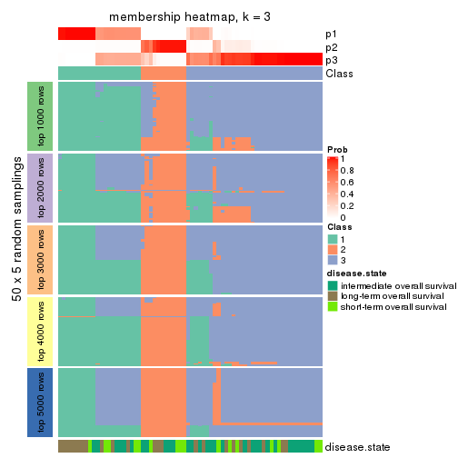</p>

</div>
<div id='tab-MAD-mclust-membership-heatmap-3'>
<pre><code class="r">membership_heatmap(res, k = 4)
</code></pre>

<p></p>

</div>
<div id='tab-MAD-mclust-membership-heatmap-4'>
<pre><code class="r">membership_heatmap(res, k = 5)
</code></pre>

<p></p>

</div>
<div id='tab-MAD-mclust-membership-heatmap-5'>
<pre><code class="r">membership_heatmap(res, k = 6)
</code></pre>

<p></p>

</div>
</div>

As soon as we have had the classes for columns, we can look for signatures
which are significantly different between classes which can be candidate marks
for certain classes. Following are the heatmaps for signatures.


Signature heatmaps where rows are scaled:


<script>
$( function() {
	$( '#tabs-MAD-mclust-get-signatures' ).tabs();
} );
</script>
<div id='tabs-MAD-mclust-get-signatures'>
<ul>
<li><a href='#tab-MAD-mclust-get-signatures-1'>k = 2</a></li>
<li><a href='#tab-MAD-mclust-get-signatures-2'>k = 3</a></li>
<li><a href='#tab-MAD-mclust-get-signatures-3'>k = 4</a></li>
<li><a href='#tab-MAD-mclust-get-signatures-4'>k = 5</a></li>
<li><a href='#tab-MAD-mclust-get-signatures-5'>k = 6</a></li>
</ul>
<div id='tab-MAD-mclust-get-signatures-1'>
<pre><code class="r">get_signatures(res, k = 2)
</code></pre>

<p></p>

</div>
<div id='tab-MAD-mclust-get-signatures-2'>
<pre><code class="r">get_signatures(res, k = 3)
</code></pre>

<p></p>

</div>
<div id='tab-MAD-mclust-get-signatures-3'>
<pre><code class="r">get_signatures(res, k = 4)
</code></pre>

<p></p>

</div>
<div id='tab-MAD-mclust-get-signatures-4'>
<pre><code class="r">get_signatures(res, k = 5)
</code></pre>

<p></p>

</div>
<div id='tab-MAD-mclust-get-signatures-5'>
<pre><code class="r">get_signatures(res, k = 6)
</code></pre>

<p></p>

</div>
</div>


Signature heatmaps where rows are not scaled:


<script>
$( function() {
	$( '#tabs-MAD-mclust-get-signatures-no-scale' ).tabs();
} );
</script>
<div id='tabs-MAD-mclust-get-signatures-no-scale'>
<ul>
<li><a href='#tab-MAD-mclust-get-signatures-no-scale-1'>k = 2</a></li>
<li><a href='#tab-MAD-mclust-get-signatures-no-scale-2'>k = 3</a></li>
<li><a href='#tab-MAD-mclust-get-signatures-no-scale-3'>k = 4</a></li>
<li><a href='#tab-MAD-mclust-get-signatures-no-scale-4'>k = 5</a></li>
<li><a href='#tab-MAD-mclust-get-signatures-no-scale-5'>k = 6</a></li>
</ul>
<div id='tab-MAD-mclust-get-signatures-no-scale-1'>
<pre><code class="r">get_signatures(res, k = 2, scale_rows = FALSE)
</code></pre>

<p></p>

</div>
<div id='tab-MAD-mclust-get-signatures-no-scale-2'>
<pre><code class="r">get_signatures(res, k = 3, scale_rows = FALSE)
</code></pre>

<p></p>

</div>
<div id='tab-MAD-mclust-get-signatures-no-scale-3'>
<pre><code class="r">get_signatures(res, k = 4, scale_rows = FALSE)
</code></pre>

<p></p>

</div>
<div id='tab-MAD-mclust-get-signatures-no-scale-4'>
<pre><code class="r">get_signatures(res, k = 5, scale_rows = FALSE)
</code></pre>

<p></p>

</div>
<div id='tab-MAD-mclust-get-signatures-no-scale-5'>
<pre><code class="r">get_signatures(res, k = 6, scale_rows = FALSE)
</code></pre>

<p>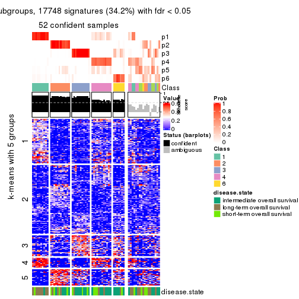</p>

</div>
</div>


Compare the overlap of signatures from different k:

```r
compare_signatures(res)
```


`get_signature()` returns a data frame invisibly. TO get the list of signatures, the function
call should be assigned to a variable explicitly. In following code, if `plot` argument is set
to `FALSE`, no heatmap is plotted while only the differential analysis is performed.

```r
# code only for demonstration
tb = get_signature(res, k = ..., plot = FALSE)
```

An example of the output of `tb` is:

```
#>   which_row         fdr    mean_1    mean_2 scaled_mean_1 scaled_mean_2 km
#> 1        38 0.042760348  8.373488  9.131774    -0.5533452     0.5164555  1
#> 2        40 0.018707592  7.106213  8.469186    -0.6173731     0.5762149  1
#> 3        55 0.019134737 10.221463 11.207825    -0.6159697     0.5749050  1
#> 4        59 0.006059896  5.921854  7.869574    -0.6899429     0.6439467  1
#> 5        60 0.018055526  8.928898 10.211722    -0.6204761     0.5791110  1
#> 6        98 0.009384629 15.714769 14.887706     0.6635654    -0.6193277  2
...
```

The columns in `tb` are:

1. `which_row`: row indices corresponding to the input matrix.
2. `fdr`: FDR for the differential test. 
3. `mean_x`: The mean value in group x.
4. `scaled_mean_x`: The mean value in group x after rows are scaled.
5. `km`: Row groups if k-means clustering is applied to rows.


UMAP plot which shows how samples are separated.


<script>
$( function() {
	$( '#tabs-MAD-mclust-dimension-reduction' ).tabs();
} );
</script>
<div id='tabs-MAD-mclust-dimension-reduction'>
<ul>
<li><a href='#tab-MAD-mclust-dimension-reduction-1'>k = 2</a></li>
<li><a href='#tab-MAD-mclust-dimension-reduction-2'>k = 3</a></li>
<li><a href='#tab-MAD-mclust-dimension-reduction-3'>k = 4</a></li>
<li><a href='#tab-MAD-mclust-dimension-reduction-4'>k = 5</a></li>
<li><a href='#tab-MAD-mclust-dimension-reduction-5'>k = 6</a></li>
</ul>
<div id='tab-MAD-mclust-dimension-reduction-1'>
<pre><code class="r">dimension_reduction(res, k = 2, method = &quot;UMAP&quot;)
</code></pre>

<p></p>

</div>
<div id='tab-MAD-mclust-dimension-reduction-2'>
<pre><code class="r">dimension_reduction(res, k = 3, method = &quot;UMAP&quot;)
</code></pre>

<p></p>

</div>
<div id='tab-MAD-mclust-dimension-reduction-3'>
<pre><code class="r">dimension_reduction(res, k = 4, method = &quot;UMAP&quot;)
</code></pre>

<p></p>

</div>
<div id='tab-MAD-mclust-dimension-reduction-4'>
<pre><code class="r">dimension_reduction(res, k = 5, method = &quot;UMAP&quot;)
</code></pre>

<p></p>

</div>
<div id='tab-MAD-mclust-dimension-reduction-5'>
<pre><code class="r">dimension_reduction(res, k = 6, method = &quot;UMAP&quot;)
</code></pre>

<p></p>

</div>
</div>


Following heatmap shows how subgroups are split when increasing `k`:

```r
collect_classes(res)
```


Test correlation between subgroups and known annotations. If the known
annotation is numeric, one-way ANOVA test is applied, and if the known
annotation is discrete, chi-squared contingency table test is applied.

```r
test_to_known_factors(res)
```

```
#>             n disease.state(p) k
#> MAD:mclust 66           0.6391 2
#> MAD:mclust 60           0.2615 3
#> MAD:mclust 69           0.0947 4
#> MAD:mclust 59           0.0103 5
#> MAD:mclust 52           0.0204 6
```


If matrix rows can be associated to genes, consider to use `GO_Enrichment(res,
...)` to perform function enrichment for the signature genes.


 

---------------------------------------------------


### MAD:NMF


The object with results only for a single top-value method and a single partition method 
can be extracted as:

```r
res = res_list["MAD", "NMF"]
# you can also extract it by
# res = res_list["MAD:NMF"]
```

A summary of `res` and all the functions that can be applied to it:

```r
res
```

```
#> A 'ConsensusPartition' object with k = 2, 3, 4, 5, 6.
#>   On a matrix with 51941 rows and 70 columns.
#>   Top rows (1000, 2000, 3000, 4000, 5000) are extracted by 'MAD' method.
#>   Subgroups are detected by 'NMF' method.
#>   Performed in total 1250 partitions by row resampling.
#>   Best k for subgroups seems to be 2.
#> 
#> Following methods can be applied to this 'ConsensusPartition' object:
#>  [1] "cola_report"             "collect_classes"         "collect_plots"          
#>  [4] "collect_stats"           "colnames"                "compare_signatures"     
#>  [7] "consensus_heatmap"       "dimension_reduction"     "functional_enrichment"  
#> [10] "get_anno_col"            "get_anno"                "get_classes"            
#> [13] "get_consensus"           "get_matrix"              "get_membership"         
#> [16] "get_param"               "get_signatures"          "get_stats"              
#> [19] "is_best_k"               "is_stable_k"             "membership_heatmap"     
#> [22] "ncol"                    "nrow"                    "plot_ecdf"              
#> [25] "rownames"                "select_partition_number" "show"                   
#> [28] "suggest_best_k"          "test_to_known_factors"
```

`collect_plots()` function collects all the plots made from `res` for all `k` (number of partitions)
into one single page to provide an easy and fast comparison between different `k`.

```r
collect_plots(res)
```


The plots are:

- The first row: a plot of the ECDF (Empirical cumulative distribution
  function) curves of the consensus matrix for each `k` and the heatmap of
  predicted classes for each `k`.
- The second row: heatmaps of the consensus matrix for each `k`.
- The third row: heatmaps of the membership matrix for each `k`.
- The fouth row: heatmaps of the signatures for each `k`.

All the plots in panels can be made by individual functions and they are
plotted later in this section.

`select_partition_number()` produces several plots showing different
statistics for choosing "optimized" `k`. There are following statistics:

- ECDF curves of the consensus matrix for each `k`;
- 1-PAC. [The PAC
  score](https://en.wikipedia.org/wiki/Consensus_clustering#Over-interpretation_potential_of_consensus_clustering)
  measures the proportion of the ambiguous subgrouping.
- Mean silhouette score.
- Concordance. The mean probability of fiting the consensus class ids in all
  partitions.
- Area increased. Denote $A_k$ as the area under the ECDF curve for current
  `k`, the area increased is defined as $A_k - A_{k-1}$.
- Rand index. The percent of pairs of samples that are both in a same cluster
  or both are not in a same cluster in the partition of k and k-1.
- Jaccard index. The ratio of pairs of samples are both in a same cluster in
  the partition of k and k-1 and the pairs of samples are both in a same
  cluster in the partition k or k-1.

The detailed explanations of these statistics can be found in [the cola
vignette](http://bioconductor.org/packages/devel/bioc/vignettes/cola/inst/doc/cola.html#toc_13).

Generally speaking, lower PAC score, higher mean silhouette score or higher
concordance corresponds to better partition. Rand index and Jaccard index
measure how similar the current partition is compared to partition with `k-1`.
If they are too similar, we won't accept `k` is better than `k-1`.

```r
select_partition_number(res)
```


The numeric values for all these statistics can be obtained by `get_stats()`.

```r
get_stats(res)
```

```
#>   k 1-PAC mean_silhouette concordance area_increased  Rand Jaccard
#> 2 2 0.879           0.904       0.961         0.4997 0.499   0.499
#> 3 3 0.537           0.685       0.851         0.3412 0.721   0.494
#> 4 4 0.767           0.842       0.908         0.1270 0.856   0.597
#> 5 5 0.763           0.732       0.862         0.0589 0.867   0.543
#> 6 6 0.721           0.627       0.786         0.0418 0.947   0.751
```

`suggest_best_k()` suggests the best $k$ based on these statistics. The rules are as follows:

- All $k$ with Jaccard index larger than 0.95 are removed because the increase of
  the partition number does not provides enough extra information. If all $k$ are removed,
  the best $k$ is assigned by `NA`.
- For $k$ with 1-PAC larger than 0.9, the maximal $k$ is taken as the "best k". Other $k$ is called "optional k".
- If it does not fit the second rule. The $k$ with the highest vote of highest
  1-PAC, mean silhouette and concordance is taken as the "best k".

```r
suggest_best_k(res)
```

```
#> [1] 2
```


Following shows the table of the partitions (You need to click the **show/hide
code output** link to see it). The membership matrix (columns with name `p*`)
is inferred by
[`clue::cl_consensus()`](https://www.rdocumentation.org/link/cl_consensus?package=clue)
function with the `SE` method. Basically the value in the membership matrix
represents the probability to belong to a certain group. The finall class
label for an item is determined with the group with highest probability it
belongs to.

In `get_classes()` function, the entropy is calculated from the membership
matrix and the silhouette score is calculated from the consensus matrix.


<script>
$( function() {
	$( '#tabs-MAD-NMF-get-classes' ).tabs();
} );
</script>
<div id='tabs-MAD-NMF-get-classes'>
<ul>
<li><a href='#tab-MAD-NMF-get-classes-1'>k = 2</a></li>
<li><a href='#tab-MAD-NMF-get-classes-2'>k = 3</a></li>
<li><a href='#tab-MAD-NMF-get-classes-3'>k = 4</a></li>
<li><a href='#tab-MAD-NMF-get-classes-4'>k = 5</a></li>
<li><a href='#tab-MAD-NMF-get-classes-5'>k = 6</a></li>
</ul>

<div id='tab-MAD-NMF-get-classes-1'>
<p><a id='tab-MAD-NMF-get-classes-1-a' style='color:#0366d6' href='#'>show/hide code output</a></p>
<pre><code class="r">cbind(get_classes(res, k = 2), get_membership(res, k = 2))
</code></pre>

<pre><code>#&gt;            class entropy silhouette    p1    p2
#&gt; GSM1299517     2  0.0000     0.9587 0.000 1.000
#&gt; GSM1299518     2  0.0000     0.9587 0.000 1.000
#&gt; GSM1299519     2  0.0000     0.9587 0.000 1.000
#&gt; GSM1299520     1  0.0000     0.9554 1.000 0.000
#&gt; GSM1299521     1  0.0000     0.9554 1.000 0.000
#&gt; GSM1299522     2  0.0000     0.9587 0.000 1.000
#&gt; GSM1299523     1  0.0000     0.9554 1.000 0.000
#&gt; GSM1299524     2  0.0000     0.9587 0.000 1.000
#&gt; GSM1299525     2  0.0000     0.9587 0.000 1.000
#&gt; GSM1299526     2  0.0000     0.9587 0.000 1.000
#&gt; GSM1299527     2  0.0000     0.9587 0.000 1.000
#&gt; GSM1299528     2  0.0000     0.9587 0.000 1.000
#&gt; GSM1299529     2  0.0000     0.9587 0.000 1.000
#&gt; GSM1299530     1  0.0000     0.9554 1.000 0.000
#&gt; GSM1299531     2  0.0000     0.9587 0.000 1.000
#&gt; GSM1299575     1  0.0000     0.9554 1.000 0.000
#&gt; GSM1299532     2  0.0000     0.9587 0.000 1.000
#&gt; GSM1299533     2  0.0000     0.9587 0.000 1.000
#&gt; GSM1299534     2  0.0000     0.9587 0.000 1.000
#&gt; GSM1299535     2  0.0000     0.9587 0.000 1.000
#&gt; GSM1299536     1  0.8144     0.6721 0.748 0.252
#&gt; GSM1299537     2  0.9248     0.4660 0.340 0.660
#&gt; GSM1299538     2  0.0938     0.9490 0.012 0.988
#&gt; GSM1299539     2  0.9710     0.3228 0.400 0.600
#&gt; GSM1299540     1  0.4022     0.8933 0.920 0.080
#&gt; GSM1299541     1  0.9460     0.4368 0.636 0.364
#&gt; GSM1299542     2  0.0000     0.9587 0.000 1.000
#&gt; GSM1299543     2  0.0000     0.9587 0.000 1.000
#&gt; GSM1299544     2  0.0000     0.9587 0.000 1.000
#&gt; GSM1299545     1  0.0000     0.9554 1.000 0.000
#&gt; GSM1299546     2  0.0000     0.9587 0.000 1.000
#&gt; GSM1299547     1  0.0000     0.9554 1.000 0.000
#&gt; GSM1299548     1  0.9170     0.5121 0.668 0.332
#&gt; GSM1299549     1  0.2603     0.9233 0.956 0.044
#&gt; GSM1299550     2  0.0000     0.9587 0.000 1.000
#&gt; GSM1299551     2  0.0000     0.9587 0.000 1.000
#&gt; GSM1299552     1  0.0000     0.9554 1.000 0.000
#&gt; GSM1299553     1  0.0000     0.9554 1.000 0.000
#&gt; GSM1299554     2  0.0000     0.9587 0.000 1.000
#&gt; GSM1299555     2  0.0000     0.9587 0.000 1.000
#&gt; GSM1299556     1  0.2948     0.9184 0.948 0.052
#&gt; GSM1299557     2  0.9963     0.0958 0.464 0.536
#&gt; GSM1299558     2  0.0000     0.9587 0.000 1.000
#&gt; GSM1299559     1  0.5294     0.8517 0.880 0.120
#&gt; GSM1299560     2  0.0000     0.9587 0.000 1.000
#&gt; GSM1299576     1  0.0000     0.9554 1.000 0.000
#&gt; GSM1299577     1  0.0000     0.9554 1.000 0.000
#&gt; GSM1299561     2  0.3274     0.9067 0.060 0.940
#&gt; GSM1299562     2  0.0000     0.9587 0.000 1.000
#&gt; GSM1299563     1  0.0000     0.9554 1.000 0.000
#&gt; GSM1299564     1  0.0938     0.9480 0.988 0.012
#&gt; GSM1299565     2  0.0000     0.9587 0.000 1.000
#&gt; GSM1299566     2  0.0000     0.9587 0.000 1.000
#&gt; GSM1299567     1  0.0000     0.9554 1.000 0.000
#&gt; GSM1299568     2  0.0000     0.9587 0.000 1.000
#&gt; GSM1299569     2  0.0000     0.9587 0.000 1.000
#&gt; GSM1299570     1  0.0000     0.9554 1.000 0.000
#&gt; GSM1299571     2  0.0000     0.9587 0.000 1.000
#&gt; GSM1299572     2  0.4298     0.8791 0.088 0.912
#&gt; GSM1299573     2  0.4690     0.8651 0.100 0.900
#&gt; GSM1299574     2  0.0000     0.9587 0.000 1.000
#&gt; GSM1299578     1  0.0000     0.9554 1.000 0.000
#&gt; GSM1299579     1  0.0000     0.9554 1.000 0.000
#&gt; GSM1299580     1  0.0000     0.9554 1.000 0.000
#&gt; GSM1299581     1  0.0000     0.9554 1.000 0.000
#&gt; GSM1299582     1  0.0000     0.9554 1.000 0.000
#&gt; GSM1299583     1  0.0000     0.9554 1.000 0.000
#&gt; GSM1299584     1  0.0000     0.9554 1.000 0.000
#&gt; GSM1299585     1  0.0000     0.9554 1.000 0.000
#&gt; GSM1299586     1  0.0000     0.9554 1.000 0.000
</code></pre>

<script>
$('#tab-MAD-NMF-get-classes-1-a').parent().next().next().hide();
$('#tab-MAD-NMF-get-classes-1-a').click(function(){
  $('#tab-MAD-NMF-get-classes-1-a').parent().next().next().toggle();
  return(false);
});
</script>
</div>

<div id='tab-MAD-NMF-get-classes-2'>
<p><a id='tab-MAD-NMF-get-classes-2-a' style='color:#0366d6' href='#'>show/hide code output</a></p>
<pre><code class="r">cbind(get_classes(res, k = 3), get_membership(res, k = 3))
</code></pre>

<pre><code>#&gt;            class entropy silhouette    p1    p2    p3
#&gt; GSM1299517     3  0.6140     0.4774 0.000 0.404 0.596
#&gt; GSM1299518     3  0.5497     0.6489 0.000 0.292 0.708
#&gt; GSM1299519     2  0.0000     0.8668 0.000 1.000 0.000
#&gt; GSM1299520     1  0.3038     0.7685 0.896 0.000 0.104
#&gt; GSM1299521     1  0.0000     0.8157 1.000 0.000 0.000
#&gt; GSM1299522     2  0.0000     0.8668 0.000 1.000 0.000
#&gt; GSM1299523     3  0.5706     0.1559 0.320 0.000 0.680
#&gt; GSM1299524     3  0.5785     0.6002 0.000 0.332 0.668
#&gt; GSM1299525     2  0.3715     0.7735 0.128 0.868 0.004
#&gt; GSM1299526     2  0.5988     0.1909 0.000 0.632 0.368
#&gt; GSM1299527     3  0.4399     0.7264 0.000 0.188 0.812
#&gt; GSM1299528     2  0.3192     0.7902 0.112 0.888 0.000
#&gt; GSM1299529     2  0.0000     0.8668 0.000 1.000 0.000
#&gt; GSM1299530     1  0.0424     0.8145 0.992 0.000 0.008
#&gt; GSM1299531     2  0.0000     0.8668 0.000 1.000 0.000
#&gt; GSM1299575     1  0.5397     0.7097 0.720 0.000 0.280
#&gt; GSM1299532     3  0.5678     0.6213 0.000 0.316 0.684
#&gt; GSM1299533     2  0.3192     0.7550 0.000 0.888 0.112
#&gt; GSM1299534     3  0.6286     0.3433 0.000 0.464 0.536
#&gt; GSM1299535     2  0.0000     0.8668 0.000 1.000 0.000
#&gt; GSM1299536     1  0.8822     0.2668 0.540 0.136 0.324
#&gt; GSM1299537     3  0.0592     0.7346 0.000 0.012 0.988
#&gt; GSM1299538     2  0.5588     0.6170 0.276 0.720 0.004
#&gt; GSM1299539     1  0.6330     0.2022 0.600 0.396 0.004
#&gt; GSM1299540     3  0.4062     0.5681 0.164 0.000 0.836
#&gt; GSM1299541     3  0.0592     0.7346 0.000 0.012 0.988
#&gt; GSM1299542     3  0.4750     0.7120 0.000 0.216 0.784
#&gt; GSM1299543     2  0.0000     0.8668 0.000 1.000 0.000
#&gt; GSM1299544     2  0.0000     0.8668 0.000 1.000 0.000
#&gt; GSM1299545     1  0.5397     0.7074 0.720 0.000 0.280
#&gt; GSM1299546     2  0.0000     0.8668 0.000 1.000 0.000
#&gt; GSM1299547     1  0.0237     0.8146 0.996 0.000 0.004
#&gt; GSM1299548     3  0.0424     0.7325 0.000 0.008 0.992
#&gt; GSM1299549     1  0.0424     0.8131 0.992 0.008 0.000
#&gt; GSM1299550     2  0.6187     0.6339 0.248 0.724 0.028
#&gt; GSM1299551     2  0.0000     0.8668 0.000 1.000 0.000
#&gt; GSM1299552     1  0.0000     0.8157 1.000 0.000 0.000
#&gt; GSM1299553     1  0.0000     0.8157 1.000 0.000 0.000
#&gt; GSM1299554     2  0.8896     0.3096 0.156 0.552 0.292
#&gt; GSM1299555     3  0.5591     0.6236 0.000 0.304 0.696
#&gt; GSM1299556     3  0.0237     0.7264 0.004 0.000 0.996
#&gt; GSM1299557     3  0.6247     0.3276 0.004 0.376 0.620
#&gt; GSM1299558     2  0.0000     0.8668 0.000 1.000 0.000
#&gt; GSM1299559     3  0.0475     0.7295 0.004 0.004 0.992
#&gt; GSM1299560     3  0.4842     0.7066 0.000 0.224 0.776
#&gt; GSM1299576     1  0.3116     0.8093 0.892 0.000 0.108
#&gt; GSM1299577     1  0.6079     0.5653 0.612 0.000 0.388
#&gt; GSM1299561     3  0.2261     0.7524 0.000 0.068 0.932
#&gt; GSM1299562     2  0.0000     0.8668 0.000 1.000 0.000
#&gt; GSM1299563     1  0.2711     0.7793 0.912 0.000 0.088
#&gt; GSM1299564     1  0.5948     0.3849 0.640 0.000 0.360
#&gt; GSM1299565     2  0.0000     0.8668 0.000 1.000 0.000
#&gt; GSM1299566     2  0.4409     0.7323 0.172 0.824 0.004
#&gt; GSM1299567     3  0.0237     0.7264 0.004 0.000 0.996
#&gt; GSM1299568     2  0.0000     0.8668 0.000 1.000 0.000
#&gt; GSM1299569     2  0.0237     0.8641 0.000 0.996 0.004
#&gt; GSM1299570     3  0.6062     0.0836 0.384 0.000 0.616
#&gt; GSM1299571     2  0.2711     0.7843 0.000 0.912 0.088
#&gt; GSM1299572     2  0.7054    -0.1889 0.020 0.524 0.456
#&gt; GSM1299573     3  0.2796     0.7561 0.000 0.092 0.908
#&gt; GSM1299574     2  0.0000     0.8668 0.000 1.000 0.000
#&gt; GSM1299578     1  0.3192     0.8086 0.888 0.000 0.112
#&gt; GSM1299579     1  0.0000     0.8157 1.000 0.000 0.000
#&gt; GSM1299580     1  0.5465     0.7013 0.712 0.000 0.288
#&gt; GSM1299581     1  0.3340     0.8055 0.880 0.000 0.120
#&gt; GSM1299582     1  0.4931     0.7498 0.768 0.000 0.232
#&gt; GSM1299583     1  0.2356     0.8151 0.928 0.000 0.072
#&gt; GSM1299584     1  0.5058     0.7409 0.756 0.000 0.244
#&gt; GSM1299585     1  0.0424     0.8169 0.992 0.000 0.008
#&gt; GSM1299586     1  0.4750     0.7598 0.784 0.000 0.216
</code></pre>

<script>
$('#tab-MAD-NMF-get-classes-2-a').parent().next().next().hide();
$('#tab-MAD-NMF-get-classes-2-a').click(function(){
  $('#tab-MAD-NMF-get-classes-2-a').parent().next().next().toggle();
  return(false);
});
</script>
</div>

<div id='tab-MAD-NMF-get-classes-3'>
<p><a id='tab-MAD-NMF-get-classes-3-a' style='color:#0366d6' href='#'>show/hide code output</a></p>
<pre><code class="r">cbind(get_classes(res, k = 4), get_membership(res, k = 4))
</code></pre>

<pre><code>#&gt;            class entropy silhouette    p1    p2    p3    p4
#&gt; GSM1299517     3  0.4206      0.806 0.000 0.048 0.816 0.136
#&gt; GSM1299518     3  0.1151      0.853 0.000 0.024 0.968 0.008
#&gt; GSM1299519     2  0.0000      0.989 0.000 1.000 0.000 0.000
#&gt; GSM1299520     4  0.3796      0.787 0.096 0.000 0.056 0.848
#&gt; GSM1299521     1  0.0000      0.955 1.000 0.000 0.000 0.000
#&gt; GSM1299522     2  0.0000      0.989 0.000 1.000 0.000 0.000
#&gt; GSM1299523     3  0.4994      0.681 0.048 0.000 0.744 0.208
#&gt; GSM1299524     3  0.3105      0.833 0.000 0.012 0.868 0.120
#&gt; GSM1299525     4  0.4454      0.630 0.000 0.308 0.000 0.692
#&gt; GSM1299526     2  0.1940      0.899 0.000 0.924 0.076 0.000
#&gt; GSM1299527     3  0.2675      0.841 0.000 0.008 0.892 0.100
#&gt; GSM1299528     4  0.4072      0.705 0.000 0.252 0.000 0.748
#&gt; GSM1299529     2  0.0592      0.974 0.000 0.984 0.000 0.016
#&gt; GSM1299530     1  0.4501      0.694 0.764 0.000 0.024 0.212
#&gt; GSM1299531     2  0.0000      0.989 0.000 1.000 0.000 0.000
#&gt; GSM1299575     1  0.1211      0.936 0.960 0.000 0.040 0.000
#&gt; GSM1299532     3  0.2198      0.848 0.000 0.008 0.920 0.072
#&gt; GSM1299533     2  0.0000      0.989 0.000 1.000 0.000 0.000
#&gt; GSM1299534     3  0.4690      0.721 0.000 0.016 0.724 0.260
#&gt; GSM1299535     2  0.0000      0.989 0.000 1.000 0.000 0.000
#&gt; GSM1299536     4  0.0000      0.821 0.000 0.000 0.000 1.000
#&gt; GSM1299537     3  0.0469      0.853 0.000 0.000 0.988 0.012
#&gt; GSM1299538     4  0.3606      0.790 0.020 0.140 0.000 0.840
#&gt; GSM1299539     4  0.2345      0.812 0.100 0.000 0.000 0.900
#&gt; GSM1299540     3  0.3266      0.795 0.108 0.024 0.868 0.000
#&gt; GSM1299541     3  0.0000      0.852 0.000 0.000 1.000 0.000
#&gt; GSM1299542     3  0.0804      0.854 0.000 0.008 0.980 0.012
#&gt; GSM1299543     2  0.0000      0.989 0.000 1.000 0.000 0.000
#&gt; GSM1299544     4  0.4697      0.482 0.000 0.356 0.000 0.644
#&gt; GSM1299545     1  0.0707      0.947 0.980 0.000 0.020 0.000
#&gt; GSM1299546     2  0.0000      0.989 0.000 1.000 0.000 0.000
#&gt; GSM1299547     4  0.2704      0.800 0.124 0.000 0.000 0.876
#&gt; GSM1299548     3  0.3528      0.798 0.000 0.000 0.808 0.192
#&gt; GSM1299549     1  0.2216      0.886 0.908 0.000 0.000 0.092
#&gt; GSM1299550     4  0.0000      0.821 0.000 0.000 0.000 1.000
#&gt; GSM1299551     2  0.0000      0.989 0.000 1.000 0.000 0.000
#&gt; GSM1299552     1  0.0921      0.940 0.972 0.000 0.000 0.028
#&gt; GSM1299553     1  0.0469      0.950 0.988 0.000 0.000 0.012
#&gt; GSM1299554     4  0.0336      0.819 0.000 0.000 0.008 0.992
#&gt; GSM1299555     3  0.4804      0.457 0.000 0.384 0.616 0.000
#&gt; GSM1299556     3  0.0000      0.852 0.000 0.000 1.000 0.000
#&gt; GSM1299557     3  0.9279      0.269 0.148 0.324 0.392 0.136
#&gt; GSM1299558     2  0.0000      0.989 0.000 1.000 0.000 0.000
#&gt; GSM1299559     3  0.0336      0.852 0.000 0.000 0.992 0.008
#&gt; GSM1299560     3  0.0672      0.854 0.000 0.008 0.984 0.008
#&gt; GSM1299576     1  0.0000      0.955 1.000 0.000 0.000 0.000
#&gt; GSM1299577     1  0.4534      0.776 0.800 0.000 0.132 0.068
#&gt; GSM1299561     3  0.0804      0.854 0.000 0.008 0.980 0.012
#&gt; GSM1299562     2  0.0000      0.989 0.000 1.000 0.000 0.000
#&gt; GSM1299563     4  0.3852      0.745 0.180 0.000 0.012 0.808
#&gt; GSM1299564     4  0.0592      0.820 0.000 0.000 0.016 0.984
#&gt; GSM1299565     2  0.0000      0.989 0.000 1.000 0.000 0.000
#&gt; GSM1299566     4  0.1474      0.825 0.000 0.052 0.000 0.948
#&gt; GSM1299567     3  0.0817      0.847 0.000 0.000 0.976 0.024
#&gt; GSM1299568     2  0.1302      0.944 0.000 0.956 0.000 0.044
#&gt; GSM1299569     4  0.3142      0.783 0.000 0.132 0.008 0.860
#&gt; GSM1299570     3  0.5807      0.658 0.160 0.000 0.708 0.132
#&gt; GSM1299571     2  0.0000      0.989 0.000 1.000 0.000 0.000
#&gt; GSM1299572     3  0.6426      0.588 0.108 0.272 0.620 0.000
#&gt; GSM1299573     3  0.3052      0.819 0.000 0.004 0.860 0.136
#&gt; GSM1299574     2  0.0000      0.989 0.000 1.000 0.000 0.000
#&gt; GSM1299578     1  0.0000      0.955 1.000 0.000 0.000 0.000
#&gt; GSM1299579     4  0.4992      0.208 0.476 0.000 0.000 0.524
#&gt; GSM1299580     1  0.1211      0.935 0.960 0.000 0.040 0.000
#&gt; GSM1299581     1  0.0000      0.955 1.000 0.000 0.000 0.000
#&gt; GSM1299582     1  0.0000      0.955 1.000 0.000 0.000 0.000
#&gt; GSM1299583     1  0.0000      0.955 1.000 0.000 0.000 0.000
#&gt; GSM1299584     1  0.0336      0.953 0.992 0.000 0.008 0.000
#&gt; GSM1299585     1  0.0000      0.955 1.000 0.000 0.000 0.000
#&gt; GSM1299586     1  0.0000      0.955 1.000 0.000 0.000 0.000
</code></pre>

<script>
$('#tab-MAD-NMF-get-classes-3-a').parent().next().next().hide();
$('#tab-MAD-NMF-get-classes-3-a').click(function(){
  $('#tab-MAD-NMF-get-classes-3-a').parent().next().next().toggle();
  return(false);
});
</script>
</div>

<div id='tab-MAD-NMF-get-classes-4'>
<p><a id='tab-MAD-NMF-get-classes-4-a' style='color:#0366d6' href='#'>show/hide code output</a></p>
<pre><code class="r">cbind(get_classes(res, k = 5), get_membership(res, k = 5))
</code></pre>

<pre><code>#&gt;            class entropy silhouette    p1    p2    p3    p4    p5
#&gt; GSM1299517     3  0.4293     0.7318 0.000 0.064 0.772 0.004 0.160
#&gt; GSM1299518     3  0.1697     0.7940 0.000 0.060 0.932 0.000 0.008
#&gt; GSM1299519     2  0.0000     0.9284 0.000 1.000 0.000 0.000 0.000
#&gt; GSM1299520     4  0.0324     0.8308 0.000 0.000 0.004 0.992 0.004
#&gt; GSM1299521     1  0.2104     0.8470 0.916 0.000 0.000 0.024 0.060
#&gt; GSM1299522     2  0.0000     0.9284 0.000 1.000 0.000 0.000 0.000
#&gt; GSM1299523     4  0.2054     0.8074 0.028 0.000 0.052 0.920 0.000
#&gt; GSM1299524     3  0.4464     0.6213 0.000 0.008 0.676 0.012 0.304
#&gt; GSM1299525     2  0.4062     0.6651 0.000 0.764 0.000 0.196 0.040
#&gt; GSM1299526     2  0.2280     0.8142 0.000 0.880 0.120 0.000 0.000
#&gt; GSM1299527     3  0.3274     0.7131 0.000 0.000 0.780 0.000 0.220
#&gt; GSM1299528     5  0.5659     0.4951 0.000 0.204 0.000 0.164 0.632
#&gt; GSM1299529     2  0.1205     0.9010 0.000 0.956 0.000 0.004 0.040
#&gt; GSM1299530     4  0.1282     0.8274 0.044 0.000 0.004 0.952 0.000
#&gt; GSM1299531     2  0.0000     0.9284 0.000 1.000 0.000 0.000 0.000
#&gt; GSM1299575     1  0.1768     0.8291 0.924 0.000 0.072 0.004 0.000
#&gt; GSM1299532     3  0.3561     0.6835 0.000 0.000 0.740 0.000 0.260
#&gt; GSM1299533     2  0.0000     0.9284 0.000 1.000 0.000 0.000 0.000
#&gt; GSM1299534     5  0.3724     0.5695 0.000 0.000 0.184 0.028 0.788
#&gt; GSM1299535     2  0.0865     0.9135 0.000 0.972 0.004 0.000 0.024
#&gt; GSM1299536     4  0.3636     0.6253 0.000 0.000 0.000 0.728 0.272
#&gt; GSM1299537     3  0.1341     0.7989 0.000 0.000 0.944 0.056 0.000
#&gt; GSM1299538     4  0.2278     0.8245 0.032 0.008 0.000 0.916 0.044
#&gt; GSM1299539     4  0.2782     0.8099 0.048 0.000 0.000 0.880 0.072
#&gt; GSM1299540     3  0.3216     0.7457 0.096 0.044 0.856 0.004 0.000
#&gt; GSM1299541     3  0.0671     0.8042 0.000 0.000 0.980 0.016 0.004
#&gt; GSM1299542     3  0.0771     0.8050 0.000 0.004 0.976 0.000 0.020
#&gt; GSM1299543     2  0.0000     0.9284 0.000 1.000 0.000 0.000 0.000
#&gt; GSM1299544     5  0.2370     0.7073 0.000 0.056 0.000 0.040 0.904
#&gt; GSM1299545     1  0.4029     0.6268 0.744 0.000 0.024 0.232 0.000
#&gt; GSM1299546     2  0.0000     0.9284 0.000 1.000 0.000 0.000 0.000
#&gt; GSM1299547     1  0.5242     0.3168 0.516 0.000 0.004 0.036 0.444
#&gt; GSM1299548     3  0.4088     0.5478 0.000 0.000 0.632 0.000 0.368
#&gt; GSM1299549     1  0.4142     0.6219 0.684 0.000 0.004 0.004 0.308
#&gt; GSM1299550     5  0.4201     0.0946 0.000 0.000 0.000 0.408 0.592
#&gt; GSM1299551     2  0.0000     0.9284 0.000 1.000 0.000 0.000 0.000
#&gt; GSM1299552     1  0.2338     0.8322 0.884 0.000 0.000 0.004 0.112
#&gt; GSM1299553     1  0.2470     0.8345 0.884 0.000 0.000 0.012 0.104
#&gt; GSM1299554     5  0.1774     0.6935 0.000 0.000 0.016 0.052 0.932
#&gt; GSM1299555     2  0.5010     0.2777 0.036 0.572 0.392 0.000 0.000
#&gt; GSM1299556     3  0.0162     0.8035 0.000 0.000 0.996 0.004 0.000
#&gt; GSM1299557     5  0.6561     0.1340 0.332 0.000 0.216 0.000 0.452
#&gt; GSM1299558     2  0.2280     0.8188 0.000 0.880 0.000 0.000 0.120
#&gt; GSM1299559     3  0.1942     0.7917 0.012 0.000 0.920 0.068 0.000
#&gt; GSM1299560     3  0.1956     0.7858 0.000 0.076 0.916 0.000 0.008
#&gt; GSM1299576     1  0.0703     0.8609 0.976 0.000 0.000 0.000 0.024
#&gt; GSM1299577     4  0.3771     0.7003 0.164 0.000 0.040 0.796 0.000
#&gt; GSM1299561     3  0.1197     0.8024 0.000 0.000 0.952 0.000 0.048
#&gt; GSM1299562     2  0.0000     0.9284 0.000 1.000 0.000 0.000 0.000
#&gt; GSM1299563     4  0.2747     0.8112 0.060 0.000 0.004 0.888 0.048
#&gt; GSM1299564     4  0.0404     0.8304 0.000 0.000 0.000 0.988 0.012
#&gt; GSM1299565     2  0.0000     0.9284 0.000 1.000 0.000 0.000 0.000
#&gt; GSM1299566     4  0.5816    -0.0455 0.000 0.092 0.000 0.468 0.440
#&gt; GSM1299567     3  0.3454     0.7365 0.064 0.000 0.836 0.100 0.000
#&gt; GSM1299568     5  0.3381     0.6622 0.000 0.176 0.016 0.000 0.808
#&gt; GSM1299569     5  0.2768     0.7106 0.000 0.040 0.024 0.040 0.896
#&gt; GSM1299570     4  0.1211     0.8277 0.016 0.000 0.024 0.960 0.000
#&gt; GSM1299571     2  0.0000     0.9284 0.000 1.000 0.000 0.000 0.000
#&gt; GSM1299572     3  0.6909     0.4620 0.180 0.212 0.568 0.028 0.012
#&gt; GSM1299573     3  0.4300     0.2829 0.000 0.000 0.524 0.000 0.476
#&gt; GSM1299574     2  0.0000     0.9284 0.000 1.000 0.000 0.000 0.000
#&gt; GSM1299578     1  0.0162     0.8625 0.996 0.000 0.000 0.004 0.000
#&gt; GSM1299579     1  0.5473     0.1783 0.520 0.000 0.000 0.416 0.064
#&gt; GSM1299580     1  0.1768     0.8291 0.924 0.000 0.072 0.004 0.000
#&gt; GSM1299581     1  0.0162     0.8625 0.996 0.000 0.000 0.004 0.000
#&gt; GSM1299582     1  0.0162     0.8625 0.996 0.000 0.000 0.004 0.000
#&gt; GSM1299583     1  0.0510     0.8624 0.984 0.000 0.000 0.000 0.016
#&gt; GSM1299584     1  0.0162     0.8625 0.996 0.000 0.000 0.004 0.000
#&gt; GSM1299585     1  0.2193     0.8459 0.912 0.000 0.000 0.028 0.060
#&gt; GSM1299586     1  0.0162     0.8625 0.996 0.000 0.000 0.004 0.000
</code></pre>

<script>
$('#tab-MAD-NMF-get-classes-4-a').parent().next().next().hide();
$('#tab-MAD-NMF-get-classes-4-a').click(function(){
  $('#tab-MAD-NMF-get-classes-4-a').parent().next().next().toggle();
  return(false);
});
</script>
</div>

<div id='tab-MAD-NMF-get-classes-5'>
<p><a id='tab-MAD-NMF-get-classes-5-a' style='color:#0366d6' href='#'>show/hide code output</a></p>
<pre><code class="r">cbind(get_classes(res, k = 6), get_membership(res, k = 6))
</code></pre>

<pre><code>#&gt;            class entropy silhouette    p1    p2    p3    p4    p5    p6
#&gt; GSM1299517     3  0.5201     0.3068 0.000 0.032 0.540 0.004 0.028 0.396
#&gt; GSM1299518     3  0.3388     0.6907 0.000 0.028 0.848 0.008 0.068 0.048
#&gt; GSM1299519     2  0.0000     0.9035 0.000 1.000 0.000 0.000 0.000 0.000
#&gt; GSM1299520     4  0.0767     0.8363 0.000 0.000 0.008 0.976 0.004 0.012
#&gt; GSM1299521     1  0.4756     0.3515 0.564 0.000 0.000 0.056 0.000 0.380
#&gt; GSM1299522     2  0.0291     0.9026 0.000 0.992 0.000 0.000 0.004 0.004
#&gt; GSM1299523     4  0.1615     0.8072 0.004 0.000 0.064 0.928 0.000 0.004
#&gt; GSM1299524     5  0.5056    -0.1008 0.000 0.000 0.424 0.004 0.508 0.064
#&gt; GSM1299525     2  0.5254     0.6199 0.000 0.696 0.000 0.088 0.132 0.084
#&gt; GSM1299526     2  0.2536     0.8061 0.000 0.864 0.116 0.000 0.000 0.020
#&gt; GSM1299527     3  0.4663     0.6019 0.000 0.000 0.684 0.000 0.124 0.192
#&gt; GSM1299528     5  0.3664     0.5748 0.000 0.072 0.000 0.052 0.824 0.052
#&gt; GSM1299529     2  0.4303     0.5782 0.000 0.676 0.000 0.008 0.032 0.284
#&gt; GSM1299530     4  0.0951     0.8363 0.008 0.000 0.000 0.968 0.004 0.020
#&gt; GSM1299531     2  0.1285     0.8794 0.000 0.944 0.000 0.000 0.052 0.004
#&gt; GSM1299575     1  0.2450     0.6678 0.892 0.000 0.068 0.004 0.004 0.032
#&gt; GSM1299532     3  0.4239     0.6215 0.000 0.000 0.740 0.008 0.180 0.072
#&gt; GSM1299533     2  0.0260     0.9024 0.000 0.992 0.000 0.000 0.000 0.008
#&gt; GSM1299534     5  0.3477     0.5631 0.000 0.000 0.132 0.004 0.808 0.056
#&gt; GSM1299535     2  0.1858     0.8538 0.000 0.904 0.000 0.000 0.004 0.092
#&gt; GSM1299536     4  0.5235     0.2372 0.000 0.000 0.012 0.508 0.416 0.064
#&gt; GSM1299537     3  0.2532     0.6983 0.000 0.000 0.884 0.060 0.004 0.052
#&gt; GSM1299538     4  0.2945     0.8068 0.004 0.012 0.000 0.868 0.052 0.064
#&gt; GSM1299539     4  0.4334     0.7395 0.020 0.000 0.000 0.756 0.092 0.132
#&gt; GSM1299540     3  0.6081     0.3249 0.340 0.084 0.524 0.008 0.000 0.044
#&gt; GSM1299541     3  0.1296     0.7058 0.000 0.000 0.952 0.012 0.004 0.032
#&gt; GSM1299542     3  0.2085     0.7055 0.000 0.008 0.912 0.000 0.056 0.024
#&gt; GSM1299543     2  0.2255     0.8435 0.000 0.892 0.000 0.000 0.080 0.028
#&gt; GSM1299544     5  0.0837     0.6095 0.000 0.000 0.004 0.004 0.972 0.020
#&gt; GSM1299545     1  0.4632     0.3710 0.656 0.000 0.064 0.276 0.000 0.004
#&gt; GSM1299546     2  0.0146     0.9031 0.000 0.996 0.000 0.000 0.000 0.004
#&gt; GSM1299547     6  0.5205     0.6606 0.188 0.000 0.000 0.040 0.096 0.676
#&gt; GSM1299548     3  0.5597     0.4583 0.000 0.000 0.560 0.004 0.260 0.176
#&gt; GSM1299549     6  0.3983     0.7104 0.108 0.000 0.004 0.004 0.104 0.780
#&gt; GSM1299550     5  0.4414     0.2544 0.000 0.000 0.004 0.336 0.628 0.032
#&gt; GSM1299551     2  0.0146     0.9031 0.000 0.996 0.000 0.000 0.000 0.004
#&gt; GSM1299552     6  0.4877     0.6648 0.268 0.000 0.000 0.016 0.064 0.652
#&gt; GSM1299553     6  0.4917     0.6181 0.308 0.000 0.000 0.048 0.020 0.624
#&gt; GSM1299554     5  0.5197     0.0555 0.000 0.000 0.076 0.004 0.484 0.436
#&gt; GSM1299555     2  0.3394     0.6643 0.000 0.752 0.236 0.012 0.000 0.000
#&gt; GSM1299556     3  0.2405     0.6889 0.016 0.000 0.892 0.008 0.004 0.080
#&gt; GSM1299557     6  0.5685     0.4519 0.112 0.000 0.164 0.000 0.076 0.648
#&gt; GSM1299558     5  0.3998    -0.0560 0.000 0.492 0.000 0.000 0.504 0.004
#&gt; GSM1299559     3  0.3542     0.6482 0.000 0.000 0.788 0.160 0.000 0.052
#&gt; GSM1299560     3  0.2068     0.6911 0.000 0.080 0.904 0.008 0.008 0.000
#&gt; GSM1299576     1  0.2527     0.6717 0.832 0.000 0.000 0.000 0.000 0.168
#&gt; GSM1299577     4  0.3185     0.7523 0.116 0.000 0.048 0.832 0.004 0.000
#&gt; GSM1299561     3  0.1908     0.6958 0.000 0.000 0.900 0.000 0.096 0.004
#&gt; GSM1299562     2  0.0692     0.8967 0.000 0.976 0.020 0.000 0.004 0.000
#&gt; GSM1299563     4  0.4114     0.6886 0.052 0.000 0.000 0.740 0.008 0.200
#&gt; GSM1299564     4  0.1434     0.8355 0.000 0.000 0.008 0.948 0.020 0.024
#&gt; GSM1299565     2  0.0000     0.9035 0.000 1.000 0.000 0.000 0.000 0.000
#&gt; GSM1299566     5  0.4690     0.4710 0.000 0.032 0.000 0.204 0.708 0.056
#&gt; GSM1299567     3  0.6092     0.3788 0.244 0.000 0.552 0.168 0.000 0.036
#&gt; GSM1299568     5  0.3230     0.6126 0.000 0.052 0.060 0.000 0.852 0.036
#&gt; GSM1299569     5  0.1693     0.6158 0.000 0.000 0.044 0.004 0.932 0.020
#&gt; GSM1299570     4  0.0858     0.8272 0.004 0.000 0.028 0.968 0.000 0.000
#&gt; GSM1299571     2  0.0000     0.9035 0.000 1.000 0.000 0.000 0.000 0.000
#&gt; GSM1299572     3  0.8415     0.2074 0.112 0.196 0.412 0.032 0.048 0.200
#&gt; GSM1299573     3  0.5488     0.4373 0.000 0.000 0.556 0.000 0.272 0.172
#&gt; GSM1299574     2  0.0000     0.9035 0.000 1.000 0.000 0.000 0.000 0.000
#&gt; GSM1299578     1  0.0146     0.7302 0.996 0.000 0.000 0.000 0.000 0.004
#&gt; GSM1299579     1  0.6075     0.1168 0.436 0.000 0.000 0.176 0.012 0.376
#&gt; GSM1299580     1  0.2333     0.6740 0.900 0.000 0.060 0.004 0.004 0.032
#&gt; GSM1299581     1  0.1663     0.7173 0.912 0.000 0.000 0.000 0.000 0.088
#&gt; GSM1299582     1  0.0146     0.7290 0.996 0.000 0.000 0.000 0.000 0.004
#&gt; GSM1299583     1  0.2823     0.6553 0.796 0.000 0.000 0.000 0.000 0.204
#&gt; GSM1299584     1  0.0000     0.7301 1.000 0.000 0.000 0.000 0.000 0.000
#&gt; GSM1299585     1  0.4252     0.4147 0.604 0.000 0.000 0.024 0.000 0.372
#&gt; GSM1299586     1  0.0000     0.7301 1.000 0.000 0.000 0.000 0.000 0.000
</code></pre>

<script>
$('#tab-MAD-NMF-get-classes-5-a').parent().next().next().hide();
$('#tab-MAD-NMF-get-classes-5-a').click(function(){
  $('#tab-MAD-NMF-get-classes-5-a').parent().next().next().toggle();
  return(false);
});
</script>
</div>
</div>

Heatmaps for the consensus matrix. It visualizes the probability of two
samples to be in a same group.


<script>
$( function() {
	$( '#tabs-MAD-NMF-consensus-heatmap' ).tabs();
} );
</script>
<div id='tabs-MAD-NMF-consensus-heatmap'>
<ul>
<li><a href='#tab-MAD-NMF-consensus-heatmap-1'>k = 2</a></li>
<li><a href='#tab-MAD-NMF-consensus-heatmap-2'>k = 3</a></li>
<li><a href='#tab-MAD-NMF-consensus-heatmap-3'>k = 4</a></li>
<li><a href='#tab-MAD-NMF-consensus-heatmap-4'>k = 5</a></li>
<li><a href='#tab-MAD-NMF-consensus-heatmap-5'>k = 6</a></li>
</ul>
<div id='tab-MAD-NMF-consensus-heatmap-1'>
<pre><code class="r">consensus_heatmap(res, k = 2)
</code></pre>

<p></p>

</div>
<div id='tab-MAD-NMF-consensus-heatmap-2'>
<pre><code class="r">consensus_heatmap(res, k = 3)
</code></pre>

<p></p>

</div>
<div id='tab-MAD-NMF-consensus-heatmap-3'>
<pre><code class="r">consensus_heatmap(res, k = 4)
</code></pre>

<p></p>

</div>
<div id='tab-MAD-NMF-consensus-heatmap-4'>
<pre><code class="r">consensus_heatmap(res, k = 5)
</code></pre>

<p></p>

</div>
<div id='tab-MAD-NMF-consensus-heatmap-5'>
<pre><code class="r">consensus_heatmap(res, k = 6)
</code></pre>

<p></p>

</div>
</div>

Heatmaps for the membership of samples in all partitions to see how consistent they are:


<script>
$( function() {
	$( '#tabs-MAD-NMF-membership-heatmap' ).tabs();
} );
</script>
<div id='tabs-MAD-NMF-membership-heatmap'>
<ul>
<li><a href='#tab-MAD-NMF-membership-heatmap-1'>k = 2</a></li>
<li><a href='#tab-MAD-NMF-membership-heatmap-2'>k = 3</a></li>
<li><a href='#tab-MAD-NMF-membership-heatmap-3'>k = 4</a></li>
<li><a href='#tab-MAD-NMF-membership-heatmap-4'>k = 5</a></li>
<li><a href='#tab-MAD-NMF-membership-heatmap-5'>k = 6</a></li>
</ul>
<div id='tab-MAD-NMF-membership-heatmap-1'>
<pre><code class="r">membership_heatmap(res, k = 2)
</code></pre>

<p></p>

</div>
<div id='tab-MAD-NMF-membership-heatmap-2'>
<pre><code class="r">membership_heatmap(res, k = 3)
</code></pre>

<p></p>

</div>
<div id='tab-MAD-NMF-membership-heatmap-3'>
<pre><code class="r">membership_heatmap(res, k = 4)
</code></pre>

<p></p>

</div>
<div id='tab-MAD-NMF-membership-heatmap-4'>
<pre><code class="r">membership_heatmap(res, k = 5)
</code></pre>

<p></p>

</div>
<div id='tab-MAD-NMF-membership-heatmap-5'>
<pre><code class="r">membership_heatmap(res, k = 6)
</code></pre>

<p></p>

</div>
</div>

As soon as we have had the classes for columns, we can look for signatures
which are significantly different between classes which can be candidate marks
for certain classes. Following are the heatmaps for signatures.


Signature heatmaps where rows are scaled:


<script>
$( function() {
	$( '#tabs-MAD-NMF-get-signatures' ).tabs();
} );
</script>
<div id='tabs-MAD-NMF-get-signatures'>
<ul>
<li><a href='#tab-MAD-NMF-get-signatures-1'>k = 2</a></li>
<li><a href='#tab-MAD-NMF-get-signatures-2'>k = 3</a></li>
<li><a href='#tab-MAD-NMF-get-signatures-3'>k = 4</a></li>
<li><a href='#tab-MAD-NMF-get-signatures-4'>k = 5</a></li>
<li><a href='#tab-MAD-NMF-get-signatures-5'>k = 6</a></li>
</ul>
<div id='tab-MAD-NMF-get-signatures-1'>
<pre><code class="r">get_signatures(res, k = 2)
</code></pre>

<p></p>

</div>
<div id='tab-MAD-NMF-get-signatures-2'>
<pre><code class="r">get_signatures(res, k = 3)
</code></pre>

<p></p>

</div>
<div id='tab-MAD-NMF-get-signatures-3'>
<pre><code class="r">get_signatures(res, k = 4)
</code></pre>

<p></p>

</div>
<div id='tab-MAD-NMF-get-signatures-4'>
<pre><code class="r">get_signatures(res, k = 5)
</code></pre>

<p></p>

</div>
<div id='tab-MAD-NMF-get-signatures-5'>
<pre><code class="r">get_signatures(res, k = 6)
</code></pre>

<p></p>

</div>
</div>


Signature heatmaps where rows are not scaled:


<script>
$( function() {
	$( '#tabs-MAD-NMF-get-signatures-no-scale' ).tabs();
} );
</script>
<div id='tabs-MAD-NMF-get-signatures-no-scale'>
<ul>
<li><a href='#tab-MAD-NMF-get-signatures-no-scale-1'>k = 2</a></li>
<li><a href='#tab-MAD-NMF-get-signatures-no-scale-2'>k = 3</a></li>
<li><a href='#tab-MAD-NMF-get-signatures-no-scale-3'>k = 4</a></li>
<li><a href='#tab-MAD-NMF-get-signatures-no-scale-4'>k = 5</a></li>
<li><a href='#tab-MAD-NMF-get-signatures-no-scale-5'>k = 6</a></li>
</ul>
<div id='tab-MAD-NMF-get-signatures-no-scale-1'>
<pre><code class="r">get_signatures(res, k = 2, scale_rows = FALSE)
</code></pre>

<p></p>

</div>
<div id='tab-MAD-NMF-get-signatures-no-scale-2'>
<pre><code class="r">get_signatures(res, k = 3, scale_rows = FALSE)
</code></pre>

<p></p>

</div>
<div id='tab-MAD-NMF-get-signatures-no-scale-3'>
<pre><code class="r">get_signatures(res, k = 4, scale_rows = FALSE)
</code></pre>

<p></p>

</div>
<div id='tab-MAD-NMF-get-signatures-no-scale-4'>
<pre><code class="r">get_signatures(res, k = 5, scale_rows = FALSE)
</code></pre>

<p></p>

</div>
<div id='tab-MAD-NMF-get-signatures-no-scale-5'>
<pre><code class="r">get_signatures(res, k = 6, scale_rows = FALSE)
</code></pre>

<p></p>

</div>
</div>


Compare the overlap of signatures from different k:

```r
compare_signatures(res)
```


`get_signature()` returns a data frame invisibly. TO get the list of signatures, the function
call should be assigned to a variable explicitly. In following code, if `plot` argument is set
to `FALSE`, no heatmap is plotted while only the differential analysis is performed.

```r
# code only for demonstration
tb = get_signature(res, k = ..., plot = FALSE)
```

An example of the output of `tb` is:

```
#>   which_row         fdr    mean_1    mean_2 scaled_mean_1 scaled_mean_2 km
#> 1        38 0.042760348  8.373488  9.131774    -0.5533452     0.5164555  1
#> 2        40 0.018707592  7.106213  8.469186    -0.6173731     0.5762149  1
#> 3        55 0.019134737 10.221463 11.207825    -0.6159697     0.5749050  1
#> 4        59 0.006059896  5.921854  7.869574    -0.6899429     0.6439467  1
#> 5        60 0.018055526  8.928898 10.211722    -0.6204761     0.5791110  1
#> 6        98 0.009384629 15.714769 14.887706     0.6635654    -0.6193277  2
...
```

The columns in `tb` are:

1. `which_row`: row indices corresponding to the input matrix.
2. `fdr`: FDR for the differential test. 
3. `mean_x`: The mean value in group x.
4. `scaled_mean_x`: The mean value in group x after rows are scaled.
5. `km`: Row groups if k-means clustering is applied to rows.


UMAP plot which shows how samples are separated.


<script>
$( function() {
	$( '#tabs-MAD-NMF-dimension-reduction' ).tabs();
} );
</script>
<div id='tabs-MAD-NMF-dimension-reduction'>
<ul>
<li><a href='#tab-MAD-NMF-dimension-reduction-1'>k = 2</a></li>
<li><a href='#tab-MAD-NMF-dimension-reduction-2'>k = 3</a></li>
<li><a href='#tab-MAD-NMF-dimension-reduction-3'>k = 4</a></li>
<li><a href='#tab-MAD-NMF-dimension-reduction-4'>k = 5</a></li>
<li><a href='#tab-MAD-NMF-dimension-reduction-5'>k = 6</a></li>
</ul>
<div id='tab-MAD-NMF-dimension-reduction-1'>
<pre><code class="r">dimension_reduction(res, k = 2, method = &quot;UMAP&quot;)
</code></pre>

<p>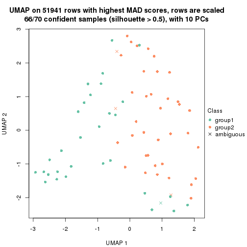</p>

</div>
<div id='tab-MAD-NMF-dimension-reduction-2'>
<pre><code class="r">dimension_reduction(res, k = 3, method = &quot;UMAP&quot;)
</code></pre>

<p></p>

</div>
<div id='tab-MAD-NMF-dimension-reduction-3'>
<pre><code class="r">dimension_reduction(res, k = 4, method = &quot;UMAP&quot;)
</code></pre>

<p></p>

</div>
<div id='tab-MAD-NMF-dimension-reduction-4'>
<pre><code class="r">dimension_reduction(res, k = 5, method = &quot;UMAP&quot;)
</code></pre>

<p></p>

</div>
<div id='tab-MAD-NMF-dimension-reduction-5'>
<pre><code class="r">dimension_reduction(res, k = 6, method = &quot;UMAP&quot;)
</code></pre>

<p></p>

</div>
</div>


Following heatmap shows how subgroups are split when increasing `k`:

```r
collect_classes(res)
```


Test correlation between subgroups and known annotations. If the known
annotation is numeric, one-way ANOVA test is applied, and if the known
annotation is discrete, chi-squared contingency table test is applied.

```r
test_to_known_factors(res)
```

```
#>          n disease.state(p) k
#> MAD:NMF 66           0.2938 2
#> MAD:NMF 59           0.3370 3
#> MAD:NMF 66           0.8486 4
#> MAD:NMF 61           0.3269 5
#> MAD:NMF 53           0.0371 6
```


If matrix rows can be associated to genes, consider to use `GO_Enrichment(res,
...)` to perform function enrichment for the signature genes.


 

---------------------------------------------------


### ATC:hclust


The object with results only for a single top-value method and a single partition method 
can be extracted as:

```r
res = res_list["ATC", "hclust"]
# you can also extract it by
# res = res_list["ATC:hclust"]
```

A summary of `res` and all the functions that can be applied to it:

```r
res
```

```
#> A 'ConsensusPartition' object with k = 2, 3, 4, 5, 6.
#>   On a matrix with 51941 rows and 70 columns.
#>   Top rows (1000, 2000, 3000, 4000, 5000) are extracted by 'ATC' method.
#>   Subgroups are detected by 'hclust' method.
#>   Performed in total 1250 partitions by row resampling.
#>   Best k for subgroups seems to be 2.
#> 
#> Following methods can be applied to this 'ConsensusPartition' object:
#>  [1] "cola_report"             "collect_classes"         "collect_plots"          
#>  [4] "collect_stats"           "colnames"                "compare_signatures"     
#>  [7] "consensus_heatmap"       "dimension_reduction"     "functional_enrichment"  
#> [10] "get_anno_col"            "get_anno"                "get_classes"            
#> [13] "get_consensus"           "get_matrix"              "get_membership"         
#> [16] "get_param"               "get_signatures"          "get_stats"              
#> [19] "is_best_k"               "is_stable_k"             "membership_heatmap"     
#> [22] "ncol"                    "nrow"                    "plot_ecdf"              
#> [25] "rownames"                "select_partition_number" "show"                   
#> [28] "suggest_best_k"          "test_to_known_factors"
```

`collect_plots()` function collects all the plots made from `res` for all `k` (number of partitions)
into one single page to provide an easy and fast comparison between different `k`.

```r
collect_plots(res)
```


The plots are:

- The first row: a plot of the ECDF (Empirical cumulative distribution
  function) curves of the consensus matrix for each `k` and the heatmap of
  predicted classes for each `k`.
- The second row: heatmaps of the consensus matrix for each `k`.
- The third row: heatmaps of the membership matrix for each `k`.
- The fouth row: heatmaps of the signatures for each `k`.

All the plots in panels can be made by individual functions and they are
plotted later in this section.

`select_partition_number()` produces several plots showing different
statistics for choosing "optimized" `k`. There are following statistics:

- ECDF curves of the consensus matrix for each `k`;
- 1-PAC. [The PAC
  score](https://en.wikipedia.org/wiki/Consensus_clustering#Over-interpretation_potential_of_consensus_clustering)
  measures the proportion of the ambiguous subgrouping.
- Mean silhouette score.
- Concordance. The mean probability of fiting the consensus class ids in all
  partitions.
- Area increased. Denote $A_k$ as the area under the ECDF curve for current
  `k`, the area increased is defined as $A_k - A_{k-1}$.
- Rand index. The percent of pairs of samples that are both in a same cluster
  or both are not in a same cluster in the partition of k and k-1.
- Jaccard index. The ratio of pairs of samples are both in a same cluster in
  the partition of k and k-1 and the pairs of samples are both in a same
  cluster in the partition k or k-1.

The detailed explanations of these statistics can be found in [the cola
vignette](http://bioconductor.org/packages/devel/bioc/vignettes/cola/inst/doc/cola.html#toc_13).

Generally speaking, lower PAC score, higher mean silhouette score or higher
concordance corresponds to better partition. Rand index and Jaccard index
measure how similar the current partition is compared to partition with `k-1`.
If they are too similar, we won't accept `k` is better than `k-1`.

```r
select_partition_number(res)
```


The numeric values for all these statistics can be obtained by `get_stats()`.

```r
get_stats(res)
```

```
#>   k 1-PAC mean_silhouette concordance area_increased  Rand Jaccard
#> 2 2 0.649           0.867       0.923         0.4631 0.543   0.543
#> 3 3 0.617           0.781       0.873         0.3353 0.851   0.725
#> 4 4 0.733           0.832       0.872         0.1772 0.876   0.686
#> 5 5 0.759           0.781       0.849         0.0582 0.952   0.824
#> 6 6 0.778           0.685       0.835         0.0393 0.968   0.865
```

`suggest_best_k()` suggests the best $k$ based on these statistics. The rules are as follows:

- All $k$ with Jaccard index larger than 0.95 are removed because the increase of
  the partition number does not provides enough extra information. If all $k$ are removed,
  the best $k$ is assigned by `NA`.
- For $k$ with 1-PAC larger than 0.9, the maximal $k$ is taken as the "best k". Other $k$ is called "optional k".
- If it does not fit the second rule. The $k$ with the highest vote of highest
  1-PAC, mean silhouette and concordance is taken as the "best k".

```r
suggest_best_k(res)
```

```
#> [1] 2
```


Following shows the table of the partitions (You need to click the **show/hide
code output** link to see it). The membership matrix (columns with name `p*`)
is inferred by
[`clue::cl_consensus()`](https://www.rdocumentation.org/link/cl_consensus?package=clue)
function with the `SE` method. Basically the value in the membership matrix
represents the probability to belong to a certain group. The finall class
label for an item is determined with the group with highest probability it
belongs to.

In `get_classes()` function, the entropy is calculated from the membership
matrix and the silhouette score is calculated from the consensus matrix.


<script>
$( function() {
	$( '#tabs-ATC-hclust-get-classes' ).tabs();
} );
</script>
<div id='tabs-ATC-hclust-get-classes'>
<ul>
<li><a href='#tab-ATC-hclust-get-classes-1'>k = 2</a></li>
<li><a href='#tab-ATC-hclust-get-classes-2'>k = 3</a></li>
<li><a href='#tab-ATC-hclust-get-classes-3'>k = 4</a></li>
<li><a href='#tab-ATC-hclust-get-classes-4'>k = 5</a></li>
<li><a href='#tab-ATC-hclust-get-classes-5'>k = 6</a></li>
</ul>

<div id='tab-ATC-hclust-get-classes-1'>
<p><a id='tab-ATC-hclust-get-classes-1-a' style='color:#0366d6' href='#'>show/hide code output</a></p>
<pre><code class="r">cbind(get_classes(res, k = 2), get_membership(res, k = 2))
</code></pre>

<pre><code>#&gt;            class entropy silhouette    p1    p2
#&gt; GSM1299517     1  0.2043      0.908 0.968 0.032
#&gt; GSM1299518     1  0.2603      0.909 0.956 0.044
#&gt; GSM1299519     2  0.1184      0.960 0.016 0.984
#&gt; GSM1299520     1  1.0000      0.226 0.504 0.496
#&gt; GSM1299521     1  0.7674      0.736 0.776 0.224
#&gt; GSM1299522     2  0.1184      0.960 0.016 0.984
#&gt; GSM1299523     1  0.8813      0.658 0.700 0.300
#&gt; GSM1299524     1  0.4562      0.887 0.904 0.096
#&gt; GSM1299525     2  0.0672      0.961 0.008 0.992
#&gt; GSM1299526     1  0.2423      0.909 0.960 0.040
#&gt; GSM1299527     1  0.2603      0.909 0.956 0.044
#&gt; GSM1299528     2  0.0000      0.961 0.000 1.000
#&gt; GSM1299529     2  0.1184      0.959 0.016 0.984
#&gt; GSM1299530     1  0.6048      0.851 0.852 0.148
#&gt; GSM1299531     2  0.1184      0.960 0.016 0.984
#&gt; GSM1299575     1  0.0000      0.898 1.000 0.000
#&gt; GSM1299532     1  0.3274      0.906 0.940 0.060
#&gt; GSM1299533     1  0.3431      0.904 0.936 0.064
#&gt; GSM1299534     2  0.0938      0.959 0.012 0.988
#&gt; GSM1299535     1  0.4562      0.887 0.904 0.096
#&gt; GSM1299536     2  0.0000      0.961 0.000 1.000
#&gt; GSM1299537     1  0.1633      0.907 0.976 0.024
#&gt; GSM1299538     2  0.1843      0.948 0.028 0.972
#&gt; GSM1299539     2  0.0000      0.961 0.000 1.000
#&gt; GSM1299540     1  0.1633      0.907 0.976 0.024
#&gt; GSM1299541     1  0.1633      0.907 0.976 0.024
#&gt; GSM1299542     1  0.2603      0.909 0.956 0.044
#&gt; GSM1299543     2  0.0000      0.961 0.000 1.000
#&gt; GSM1299544     2  0.0000      0.961 0.000 1.000
#&gt; GSM1299545     1  0.5294      0.872 0.880 0.120
#&gt; GSM1299546     2  0.1184      0.960 0.016 0.984
#&gt; GSM1299547     1  0.9896      0.377 0.560 0.440
#&gt; GSM1299548     1  0.2423      0.909 0.960 0.040
#&gt; GSM1299549     1  0.5178      0.875 0.884 0.116
#&gt; GSM1299550     2  0.0000      0.961 0.000 1.000
#&gt; GSM1299551     2  0.1184      0.960 0.016 0.984
#&gt; GSM1299552     1  0.5178      0.875 0.884 0.116
#&gt; GSM1299553     1  0.5946      0.857 0.856 0.144
#&gt; GSM1299554     2  0.7745      0.691 0.228 0.772
#&gt; GSM1299555     1  0.3431      0.904 0.936 0.064
#&gt; GSM1299556     1  0.1633      0.907 0.976 0.024
#&gt; GSM1299557     1  0.2603      0.909 0.956 0.044
#&gt; GSM1299558     2  0.0000      0.961 0.000 1.000
#&gt; GSM1299559     1  0.1633      0.907 0.976 0.024
#&gt; GSM1299560     1  0.2603      0.909 0.956 0.044
#&gt; GSM1299576     1  0.0000      0.898 1.000 0.000
#&gt; GSM1299577     1  0.5842      0.858 0.860 0.140
#&gt; GSM1299561     1  0.2603      0.909 0.956 0.044
#&gt; GSM1299562     2  0.6712      0.780 0.176 0.824
#&gt; GSM1299563     1  1.0000      0.226 0.504 0.496
#&gt; GSM1299564     1  0.9983      0.286 0.524 0.476
#&gt; GSM1299565     2  0.1184      0.960 0.016 0.984
#&gt; GSM1299566     2  0.0000      0.961 0.000 1.000
#&gt; GSM1299567     1  0.1633      0.907 0.976 0.024
#&gt; GSM1299568     2  0.7056      0.749 0.192 0.808
#&gt; GSM1299569     2  0.0000      0.961 0.000 1.000
#&gt; GSM1299570     1  0.5946      0.854 0.856 0.144
#&gt; GSM1299571     1  0.3431      0.904 0.936 0.064
#&gt; GSM1299572     1  0.3274      0.906 0.940 0.060
#&gt; GSM1299573     1  0.2603      0.909 0.956 0.044
#&gt; GSM1299574     2  0.2423      0.943 0.040 0.960
#&gt; GSM1299578     1  0.3879      0.880 0.924 0.076
#&gt; GSM1299579     2  0.0000      0.961 0.000 1.000
#&gt; GSM1299580     1  0.0000      0.898 1.000 0.000
#&gt; GSM1299581     1  0.0000      0.898 1.000 0.000
#&gt; GSM1299582     1  0.0000      0.898 1.000 0.000
#&gt; GSM1299583     1  0.0000      0.898 1.000 0.000
#&gt; GSM1299584     1  0.0000      0.898 1.000 0.000
#&gt; GSM1299585     1  0.3879      0.880 0.924 0.076
#&gt; GSM1299586     1  0.0000      0.898 1.000 0.000
</code></pre>

<script>
$('#tab-ATC-hclust-get-classes-1-a').parent().next().next().hide();
$('#tab-ATC-hclust-get-classes-1-a').click(function(){
  $('#tab-ATC-hclust-get-classes-1-a').parent().next().next().toggle();
  return(false);
});
</script>
</div>

<div id='tab-ATC-hclust-get-classes-2'>
<p><a id='tab-ATC-hclust-get-classes-2-a' style='color:#0366d6' href='#'>show/hide code output</a></p>
<pre><code class="r">cbind(get_classes(res, k = 3), get_membership(res, k = 3))
</code></pre>

<pre><code>#&gt;            class entropy silhouette    p1    p2    p3
#&gt; GSM1299517     3  0.0592      0.793 0.012 0.000 0.988
#&gt; GSM1299518     3  0.0000      0.796 0.000 0.000 1.000
#&gt; GSM1299519     2  0.2066      0.927 0.000 0.940 0.060
#&gt; GSM1299520     3  0.8688      0.400 0.112 0.372 0.516
#&gt; GSM1299521     3  0.8843      0.262 0.436 0.116 0.448
#&gt; GSM1299522     2  0.2066      0.927 0.000 0.940 0.060
#&gt; GSM1299523     3  0.8835      0.521 0.268 0.164 0.568
#&gt; GSM1299524     3  0.1860      0.777 0.000 0.052 0.948
#&gt; GSM1299525     2  0.1289      0.931 0.000 0.968 0.032
#&gt; GSM1299526     3  0.0237      0.795 0.004 0.000 0.996
#&gt; GSM1299527     3  0.0000      0.796 0.000 0.000 1.000
#&gt; GSM1299528     2  0.0000      0.928 0.000 1.000 0.000
#&gt; GSM1299529     2  0.1753      0.929 0.000 0.952 0.048
#&gt; GSM1299530     3  0.7114      0.501 0.388 0.028 0.584
#&gt; GSM1299531     2  0.2066      0.927 0.000 0.940 0.060
#&gt; GSM1299575     1  0.3412      0.934 0.876 0.000 0.124
#&gt; GSM1299532     3  0.0747      0.795 0.000 0.016 0.984
#&gt; GSM1299533     3  0.0892      0.794 0.000 0.020 0.980
#&gt; GSM1299534     2  0.0892      0.931 0.000 0.980 0.020
#&gt; GSM1299535     3  0.1860      0.777 0.000 0.052 0.948
#&gt; GSM1299536     2  0.1860      0.906 0.052 0.948 0.000
#&gt; GSM1299537     3  0.0892      0.790 0.020 0.000 0.980
#&gt; GSM1299538     2  0.2564      0.907 0.036 0.936 0.028
#&gt; GSM1299539     2  0.0000      0.928 0.000 1.000 0.000
#&gt; GSM1299540     3  0.1031      0.790 0.024 0.000 0.976
#&gt; GSM1299541     3  0.0892      0.790 0.020 0.000 0.980
#&gt; GSM1299542     3  0.0000      0.796 0.000 0.000 1.000
#&gt; GSM1299543     2  0.0000      0.928 0.000 1.000 0.000
#&gt; GSM1299544     2  0.0000      0.928 0.000 1.000 0.000
#&gt; GSM1299545     3  0.6879      0.528 0.360 0.024 0.616
#&gt; GSM1299546     2  0.2066      0.927 0.000 0.940 0.060
#&gt; GSM1299547     3  0.8614      0.501 0.128 0.304 0.568
#&gt; GSM1299548     3  0.0237      0.795 0.004 0.000 0.996
#&gt; GSM1299549     3  0.6859      0.530 0.356 0.024 0.620
#&gt; GSM1299550     2  0.0000      0.928 0.000 1.000 0.000
#&gt; GSM1299551     2  0.2066      0.927 0.000 0.940 0.060
#&gt; GSM1299552     3  0.6859      0.530 0.356 0.024 0.620
#&gt; GSM1299553     3  0.7271      0.532 0.352 0.040 0.608
#&gt; GSM1299554     2  0.5327      0.664 0.000 0.728 0.272
#&gt; GSM1299555     3  0.0892      0.794 0.000 0.020 0.980
#&gt; GSM1299556     3  0.1031      0.790 0.024 0.000 0.976
#&gt; GSM1299557     3  0.3192      0.737 0.112 0.000 0.888
#&gt; GSM1299558     2  0.0000      0.928 0.000 1.000 0.000
#&gt; GSM1299559     3  0.1031      0.790 0.024 0.000 0.976
#&gt; GSM1299560     3  0.0000      0.796 0.000 0.000 1.000
#&gt; GSM1299576     1  0.3267      0.932 0.884 0.000 0.116
#&gt; GSM1299577     3  0.6985      0.508 0.384 0.024 0.592
#&gt; GSM1299561     3  0.0000      0.796 0.000 0.000 1.000
#&gt; GSM1299562     2  0.4796      0.759 0.000 0.780 0.220
#&gt; GSM1299563     3  0.8688      0.400 0.112 0.372 0.516
#&gt; GSM1299564     3  0.8645      0.447 0.116 0.344 0.540
#&gt; GSM1299565     2  0.2066      0.927 0.000 0.940 0.060
#&gt; GSM1299566     2  0.0000      0.928 0.000 1.000 0.000
#&gt; GSM1299567     3  0.1031      0.790 0.024 0.000 0.976
#&gt; GSM1299568     2  0.4974      0.725 0.000 0.764 0.236
#&gt; GSM1299569     2  0.0000      0.928 0.000 1.000 0.000
#&gt; GSM1299570     3  0.7001      0.505 0.388 0.024 0.588
#&gt; GSM1299571     3  0.0892      0.794 0.000 0.020 0.980
#&gt; GSM1299572     3  0.0983      0.795 0.004 0.016 0.980
#&gt; GSM1299573     3  0.0000      0.796 0.000 0.000 1.000
#&gt; GSM1299574     2  0.2625      0.910 0.000 0.916 0.084
#&gt; GSM1299578     1  0.2959      0.829 0.900 0.000 0.100
#&gt; GSM1299579     2  0.1860      0.906 0.052 0.948 0.000
#&gt; GSM1299580     1  0.3412      0.934 0.876 0.000 0.124
#&gt; GSM1299581     1  0.3267      0.932 0.884 0.000 0.116
#&gt; GSM1299582     1  0.3412      0.934 0.876 0.000 0.124
#&gt; GSM1299583     1  0.3412      0.917 0.876 0.000 0.124
#&gt; GSM1299584     1  0.3412      0.934 0.876 0.000 0.124
#&gt; GSM1299585     1  0.5497      0.479 0.708 0.000 0.292
#&gt; GSM1299586     1  0.3412      0.934 0.876 0.000 0.124
</code></pre>

<script>
$('#tab-ATC-hclust-get-classes-2-a').parent().next().next().hide();
$('#tab-ATC-hclust-get-classes-2-a').click(function(){
  $('#tab-ATC-hclust-get-classes-2-a').parent().next().next().toggle();
  return(false);
});
</script>
</div>

<div id='tab-ATC-hclust-get-classes-3'>
<p><a id='tab-ATC-hclust-get-classes-3-a' style='color:#0366d6' href='#'>show/hide code output</a></p>
<pre><code class="r">cbind(get_classes(res, k = 4), get_membership(res, k = 4))
</code></pre>

<pre><code>#&gt;            class entropy silhouette    p1    p2    p3    p4
#&gt; GSM1299517     3  0.0469      0.943 0.000 0.000 0.988 0.012
#&gt; GSM1299518     3  0.0469      0.947 0.000 0.000 0.988 0.012
#&gt; GSM1299519     2  0.1929      0.867 0.000 0.940 0.036 0.024
#&gt; GSM1299520     4  0.2859      0.652 0.000 0.112 0.008 0.880
#&gt; GSM1299521     4  0.4456      0.614 0.280 0.000 0.004 0.716
#&gt; GSM1299522     2  0.1929      0.867 0.000 0.940 0.036 0.024
#&gt; GSM1299523     4  0.3375      0.737 0.116 0.008 0.012 0.864
#&gt; GSM1299524     3  0.3239      0.893 0.000 0.052 0.880 0.068
#&gt; GSM1299525     2  0.1174      0.869 0.000 0.968 0.012 0.020
#&gt; GSM1299526     3  0.0188      0.947 0.000 0.000 0.996 0.004
#&gt; GSM1299527     3  0.0336      0.947 0.000 0.000 0.992 0.008
#&gt; GSM1299528     2  0.2814      0.849 0.000 0.868 0.000 0.132
#&gt; GSM1299529     2  0.1610      0.868 0.000 0.952 0.016 0.032
#&gt; GSM1299530     4  0.4606      0.731 0.264 0.000 0.012 0.724
#&gt; GSM1299531     2  0.1929      0.867 0.000 0.940 0.036 0.024
#&gt; GSM1299575     1  0.0188      0.905 0.996 0.000 0.004 0.000
#&gt; GSM1299532     3  0.2300      0.922 0.000 0.016 0.920 0.064
#&gt; GSM1299533     3  0.2489      0.917 0.000 0.020 0.912 0.068
#&gt; GSM1299534     2  0.1398      0.868 0.000 0.956 0.004 0.040
#&gt; GSM1299535     3  0.3239      0.893 0.000 0.052 0.880 0.068
#&gt; GSM1299536     2  0.4454      0.693 0.000 0.692 0.000 0.308
#&gt; GSM1299537     3  0.0921      0.937 0.000 0.000 0.972 0.028
#&gt; GSM1299538     2  0.3764      0.775 0.000 0.784 0.000 0.216
#&gt; GSM1299539     2  0.2814      0.849 0.000 0.868 0.000 0.132
#&gt; GSM1299540     3  0.1256      0.934 0.008 0.000 0.964 0.028
#&gt; GSM1299541     3  0.0921      0.937 0.000 0.000 0.972 0.028
#&gt; GSM1299542     3  0.0336      0.947 0.000 0.000 0.992 0.008
#&gt; GSM1299543     2  0.2216      0.862 0.000 0.908 0.000 0.092
#&gt; GSM1299544     2  0.2216      0.862 0.000 0.908 0.000 0.092
#&gt; GSM1299545     4  0.5772      0.723 0.260 0.000 0.068 0.672
#&gt; GSM1299546     2  0.1929      0.867 0.000 0.940 0.036 0.024
#&gt; GSM1299547     4  0.2040      0.692 0.004 0.048 0.012 0.936
#&gt; GSM1299548     3  0.0592      0.947 0.000 0.000 0.984 0.016
#&gt; GSM1299549     4  0.6248      0.697 0.260 0.000 0.100 0.640
#&gt; GSM1299550     2  0.2589      0.855 0.000 0.884 0.000 0.116
#&gt; GSM1299551     2  0.1929      0.867 0.000 0.940 0.036 0.024
#&gt; GSM1299552     4  0.6248      0.697 0.260 0.000 0.100 0.640
#&gt; GSM1299553     4  0.5774      0.738 0.236 0.004 0.068 0.692
#&gt; GSM1299554     2  0.5384      0.668 0.000 0.728 0.196 0.076
#&gt; GSM1299555     3  0.2489      0.917 0.000 0.020 0.912 0.068
#&gt; GSM1299556     3  0.1256      0.934 0.008 0.000 0.964 0.028
#&gt; GSM1299557     3  0.4046      0.790 0.124 0.000 0.828 0.048
#&gt; GSM1299558     2  0.2216      0.862 0.000 0.908 0.000 0.092
#&gt; GSM1299559     3  0.1256      0.934 0.008 0.000 0.964 0.028
#&gt; GSM1299560     3  0.0336      0.947 0.000 0.000 0.992 0.008
#&gt; GSM1299576     1  0.0524      0.904 0.988 0.000 0.004 0.008
#&gt; GSM1299577     4  0.4826      0.734 0.264 0.000 0.020 0.716
#&gt; GSM1299561     3  0.0469      0.947 0.000 0.000 0.988 0.012
#&gt; GSM1299562     2  0.4804      0.736 0.000 0.780 0.148 0.072
#&gt; GSM1299563     4  0.2859      0.652 0.000 0.112 0.008 0.880
#&gt; GSM1299564     4  0.2412      0.672 0.000 0.084 0.008 0.908
#&gt; GSM1299565     2  0.1929      0.867 0.000 0.940 0.036 0.024
#&gt; GSM1299566     2  0.2814      0.849 0.000 0.868 0.000 0.132
#&gt; GSM1299567     3  0.1256      0.934 0.008 0.000 0.964 0.028
#&gt; GSM1299568     2  0.5011      0.715 0.000 0.764 0.160 0.076
#&gt; GSM1299569     2  0.2589      0.855 0.000 0.884 0.000 0.116
#&gt; GSM1299570     4  0.4720      0.733 0.264 0.000 0.016 0.720
#&gt; GSM1299571     3  0.2489      0.917 0.000 0.020 0.912 0.068
#&gt; GSM1299572     3  0.2561      0.917 0.004 0.016 0.912 0.068
#&gt; GSM1299573     3  0.0592      0.946 0.000 0.000 0.984 0.016
#&gt; GSM1299574     2  0.2500      0.855 0.000 0.916 0.044 0.040
#&gt; GSM1299578     1  0.3569      0.704 0.804 0.000 0.000 0.196
#&gt; GSM1299579     2  0.4454      0.693 0.000 0.692 0.000 0.308
#&gt; GSM1299580     1  0.0188      0.905 0.996 0.000 0.004 0.000
#&gt; GSM1299581     1  0.0524      0.904 0.988 0.000 0.004 0.008
#&gt; GSM1299582     1  0.0188      0.905 0.996 0.000 0.004 0.000
#&gt; GSM1299583     1  0.1637      0.863 0.940 0.000 0.000 0.060
#&gt; GSM1299584     1  0.0188      0.905 0.996 0.000 0.004 0.000
#&gt; GSM1299585     1  0.4817      0.190 0.612 0.000 0.000 0.388
#&gt; GSM1299586     1  0.0188      0.905 0.996 0.000 0.004 0.000
</code></pre>

<script>
$('#tab-ATC-hclust-get-classes-3-a').parent().next().next().hide();
$('#tab-ATC-hclust-get-classes-3-a').click(function(){
  $('#tab-ATC-hclust-get-classes-3-a').parent().next().next().toggle();
  return(false);
});
</script>
</div>

<div id='tab-ATC-hclust-get-classes-4'>
<p><a id='tab-ATC-hclust-get-classes-4-a' style='color:#0366d6' href='#'>show/hide code output</a></p>
<pre><code class="r">cbind(get_classes(res, k = 5), get_membership(res, k = 5))
</code></pre>

<pre><code>#&gt;            class entropy silhouette    p1    p2    p3    p4    p5
#&gt; GSM1299517     3  0.0290      0.942 0.000 0.008 0.992 0.000 0.000
#&gt; GSM1299518     3  0.0880      0.946 0.000 0.032 0.968 0.000 0.000
#&gt; GSM1299519     2  0.0290      0.782 0.000 0.992 0.008 0.000 0.000
#&gt; GSM1299520     4  0.4210      0.563 0.000 0.036 0.000 0.740 0.224
#&gt; GSM1299521     4  0.3911      0.701 0.060 0.000 0.000 0.796 0.144
#&gt; GSM1299522     2  0.0290      0.782 0.000 0.992 0.008 0.000 0.000
#&gt; GSM1299523     4  0.1270      0.739 0.000 0.000 0.000 0.948 0.052
#&gt; GSM1299524     3  0.3184      0.893 0.000 0.100 0.852 0.048 0.000
#&gt; GSM1299525     2  0.0794      0.769 0.000 0.972 0.000 0.000 0.028
#&gt; GSM1299526     3  0.0880      0.947 0.000 0.032 0.968 0.000 0.000
#&gt; GSM1299527     3  0.0794      0.946 0.000 0.028 0.972 0.000 0.000
#&gt; GSM1299528     5  0.2561      0.878 0.000 0.144 0.000 0.000 0.856
#&gt; GSM1299529     2  0.0798      0.776 0.000 0.976 0.000 0.008 0.016
#&gt; GSM1299530     4  0.2127      0.775 0.108 0.000 0.000 0.892 0.000
#&gt; GSM1299531     2  0.0290      0.782 0.000 0.992 0.008 0.000 0.000
#&gt; GSM1299575     1  0.0000      0.933 1.000 0.000 0.000 0.000 0.000
#&gt; GSM1299532     3  0.2580      0.922 0.000 0.064 0.892 0.044 0.000
#&gt; GSM1299533     3  0.2719      0.918 0.000 0.068 0.884 0.048 0.000
#&gt; GSM1299534     2  0.2017      0.737 0.000 0.912 0.000 0.008 0.080
#&gt; GSM1299535     3  0.3184      0.893 0.000 0.100 0.852 0.048 0.000
#&gt; GSM1299536     5  0.4827      0.819 0.000 0.116 0.000 0.160 0.724
#&gt; GSM1299537     3  0.0290      0.937 0.000 0.000 0.992 0.000 0.008
#&gt; GSM1299538     2  0.6085     -0.215 0.000 0.472 0.000 0.124 0.404
#&gt; GSM1299539     5  0.2561      0.878 0.000 0.144 0.000 0.000 0.856
#&gt; GSM1299540     3  0.0579      0.934 0.008 0.000 0.984 0.000 0.008
#&gt; GSM1299541     3  0.0290      0.937 0.000 0.000 0.992 0.000 0.008
#&gt; GSM1299542     3  0.0794      0.946 0.000 0.028 0.972 0.000 0.000
#&gt; GSM1299543     2  0.3857      0.541 0.000 0.688 0.000 0.000 0.312
#&gt; GSM1299544     2  0.3857      0.541 0.000 0.688 0.000 0.000 0.312
#&gt; GSM1299545     4  0.3427      0.766 0.108 0.000 0.056 0.836 0.000
#&gt; GSM1299546     2  0.0290      0.782 0.000 0.992 0.008 0.000 0.000
#&gt; GSM1299547     4  0.3318      0.646 0.000 0.012 0.000 0.808 0.180
#&gt; GSM1299548     3  0.0609      0.945 0.000 0.020 0.980 0.000 0.000
#&gt; GSM1299549     4  0.3912      0.746 0.108 0.000 0.088 0.804 0.000
#&gt; GSM1299550     2  0.4192      0.360 0.000 0.596 0.000 0.000 0.404
#&gt; GSM1299551     2  0.0290      0.782 0.000 0.992 0.008 0.000 0.000
#&gt; GSM1299552     4  0.3912      0.746 0.108 0.000 0.088 0.804 0.000
#&gt; GSM1299553     4  0.3260      0.776 0.084 0.000 0.056 0.856 0.004
#&gt; GSM1299554     2  0.4021      0.597 0.000 0.780 0.168 0.052 0.000
#&gt; GSM1299555     3  0.2719      0.918 0.000 0.068 0.884 0.048 0.000
#&gt; GSM1299556     3  0.0579      0.934 0.008 0.000 0.984 0.000 0.008
#&gt; GSM1299557     3  0.4420      0.803 0.080 0.040 0.800 0.080 0.000
#&gt; GSM1299558     2  0.3857      0.541 0.000 0.688 0.000 0.000 0.312
#&gt; GSM1299559     3  0.0579      0.934 0.008 0.000 0.984 0.000 0.008
#&gt; GSM1299560     3  0.0794      0.946 0.000 0.028 0.972 0.000 0.000
#&gt; GSM1299576     1  0.0290      0.930 0.992 0.000 0.000 0.008 0.000
#&gt; GSM1299577     4  0.2411      0.777 0.108 0.000 0.008 0.884 0.000
#&gt; GSM1299561     3  0.0880      0.946 0.000 0.032 0.968 0.000 0.000
#&gt; GSM1299562     2  0.3437      0.661 0.000 0.832 0.120 0.048 0.000
#&gt; GSM1299563     4  0.4210      0.563 0.000 0.036 0.000 0.740 0.224
#&gt; GSM1299564     4  0.3727      0.604 0.000 0.016 0.000 0.768 0.216
#&gt; GSM1299565     2  0.0290      0.782 0.000 0.992 0.008 0.000 0.000
#&gt; GSM1299566     5  0.2561      0.878 0.000 0.144 0.000 0.000 0.856
#&gt; GSM1299567     3  0.0579      0.934 0.008 0.000 0.984 0.000 0.008
#&gt; GSM1299568     2  0.3849      0.639 0.000 0.808 0.136 0.052 0.004
#&gt; GSM1299569     2  0.4045      0.464 0.000 0.644 0.000 0.000 0.356
#&gt; GSM1299570     4  0.2286      0.776 0.108 0.000 0.004 0.888 0.000
#&gt; GSM1299571     3  0.2719      0.918 0.000 0.068 0.884 0.048 0.000
#&gt; GSM1299572     3  0.2726      0.918 0.000 0.064 0.884 0.052 0.000
#&gt; GSM1299573     3  0.1124      0.945 0.000 0.036 0.960 0.004 0.000
#&gt; GSM1299574     2  0.1018      0.769 0.000 0.968 0.016 0.016 0.000
#&gt; GSM1299578     1  0.5493      0.522 0.632 0.000 0.000 0.256 0.112
#&gt; GSM1299579     5  0.4827      0.819 0.000 0.116 0.000 0.160 0.724
#&gt; GSM1299580     1  0.0000      0.933 1.000 0.000 0.000 0.000 0.000
#&gt; GSM1299581     1  0.0290      0.930 0.992 0.000 0.000 0.008 0.000
#&gt; GSM1299582     1  0.0000      0.933 1.000 0.000 0.000 0.000 0.000
#&gt; GSM1299583     1  0.3427      0.824 0.836 0.000 0.000 0.056 0.108
#&gt; GSM1299584     1  0.0000      0.933 1.000 0.000 0.000 0.000 0.000
#&gt; GSM1299585     4  0.5965      0.143 0.392 0.000 0.000 0.496 0.112
#&gt; GSM1299586     1  0.0000      0.933 1.000 0.000 0.000 0.000 0.000
</code></pre>

<script>
$('#tab-ATC-hclust-get-classes-4-a').parent().next().next().hide();
$('#tab-ATC-hclust-get-classes-4-a').click(function(){
  $('#tab-ATC-hclust-get-classes-4-a').parent().next().next().toggle();
  return(false);
});
</script>
</div>

<div id='tab-ATC-hclust-get-classes-5'>
<p><a id='tab-ATC-hclust-get-classes-5-a' style='color:#0366d6' href='#'>show/hide code output</a></p>
<pre><code class="r">cbind(get_classes(res, k = 6), get_membership(res, k = 6))
</code></pre>

<pre><code>#&gt;            class entropy silhouette    p1    p2    p3    p4    p5    p6
#&gt; GSM1299517     3  0.1285     0.8712 0.000 0.004 0.944 0.000 0.000 0.052
#&gt; GSM1299518     3  0.0458     0.8833 0.000 0.016 0.984 0.000 0.000 0.000
#&gt; GSM1299519     2  0.0260     0.8113 0.000 0.992 0.008 0.000 0.000 0.000
#&gt; GSM1299520     6  0.5961     0.9631 0.000 0.008 0.000 0.392 0.168 0.432
#&gt; GSM1299521     4  0.4100     0.2702 0.000 0.004 0.000 0.600 0.008 0.388
#&gt; GSM1299522     2  0.0260     0.8113 0.000 0.992 0.008 0.000 0.000 0.000
#&gt; GSM1299523     4  0.4010    -0.4643 0.000 0.000 0.000 0.584 0.008 0.408
#&gt; GSM1299524     3  0.3168     0.8376 0.000 0.076 0.852 0.048 0.000 0.024
#&gt; GSM1299525     2  0.0790     0.7983 0.000 0.968 0.000 0.000 0.032 0.000
#&gt; GSM1299526     3  0.0820     0.8835 0.000 0.016 0.972 0.000 0.000 0.012
#&gt; GSM1299527     3  0.0508     0.8830 0.000 0.012 0.984 0.000 0.000 0.004
#&gt; GSM1299528     5  0.0363     0.6446 0.000 0.012 0.000 0.000 0.988 0.000
#&gt; GSM1299529     2  0.0951     0.8055 0.000 0.968 0.004 0.008 0.020 0.000
#&gt; GSM1299530     4  0.0260     0.6004 0.000 0.000 0.000 0.992 0.000 0.008
#&gt; GSM1299531     2  0.0260     0.8113 0.000 0.992 0.008 0.000 0.000 0.000
#&gt; GSM1299575     1  0.0000     0.9316 1.000 0.000 0.000 0.000 0.000 0.000
#&gt; GSM1299532     3  0.2554     0.8605 0.000 0.040 0.892 0.044 0.000 0.024
#&gt; GSM1299533     3  0.2688     0.8569 0.000 0.044 0.884 0.048 0.000 0.024
#&gt; GSM1299534     2  0.2001     0.7542 0.000 0.900 0.000 0.004 0.092 0.004
#&gt; GSM1299535     3  0.3168     0.8376 0.000 0.076 0.852 0.048 0.000 0.024
#&gt; GSM1299536     5  0.3384     0.4689 0.000 0.008 0.000 0.004 0.760 0.228
#&gt; GSM1299537     3  0.2762     0.8042 0.000 0.000 0.804 0.000 0.000 0.196
#&gt; GSM1299538     5  0.6060     0.2824 0.000 0.380 0.000 0.024 0.460 0.136
#&gt; GSM1299539     5  0.0363     0.6446 0.000 0.012 0.000 0.000 0.988 0.000
#&gt; GSM1299540     3  0.3314     0.7650 0.004 0.000 0.740 0.000 0.000 0.256
#&gt; GSM1299541     3  0.2762     0.8042 0.000 0.000 0.804 0.000 0.000 0.196
#&gt; GSM1299542     3  0.0725     0.8827 0.000 0.012 0.976 0.000 0.000 0.012
#&gt; GSM1299543     2  0.3659     0.4559 0.000 0.636 0.000 0.000 0.364 0.000
#&gt; GSM1299544     2  0.3659     0.4559 0.000 0.636 0.000 0.000 0.364 0.000
#&gt; GSM1299545     4  0.1204     0.6143 0.000 0.000 0.056 0.944 0.000 0.000
#&gt; GSM1299546     2  0.0260     0.8113 0.000 0.992 0.008 0.000 0.000 0.000
#&gt; GSM1299547     4  0.5495    -0.7511 0.000 0.008 0.000 0.512 0.104 0.376
#&gt; GSM1299548     3  0.1074     0.8804 0.000 0.012 0.960 0.000 0.000 0.028
#&gt; GSM1299549     4  0.1812     0.6002 0.000 0.000 0.080 0.912 0.000 0.008
#&gt; GSM1299550     5  0.3868    -0.2320 0.000 0.492 0.000 0.000 0.508 0.000
#&gt; GSM1299551     2  0.0260     0.8113 0.000 0.992 0.008 0.000 0.000 0.000
#&gt; GSM1299552     4  0.1812     0.6002 0.000 0.000 0.080 0.912 0.000 0.008
#&gt; GSM1299553     4  0.2052     0.6010 0.000 0.000 0.056 0.912 0.004 0.028
#&gt; GSM1299554     2  0.4210     0.6118 0.000 0.756 0.168 0.052 0.000 0.024
#&gt; GSM1299555     3  0.2688     0.8569 0.000 0.044 0.884 0.048 0.000 0.024
#&gt; GSM1299556     3  0.3314     0.7650 0.004 0.000 0.740 0.000 0.000 0.256
#&gt; GSM1299557     3  0.3502     0.7635 0.000 0.024 0.800 0.160 0.000 0.016
#&gt; GSM1299558     2  0.3659     0.4559 0.000 0.636 0.000 0.000 0.364 0.000
#&gt; GSM1299559     3  0.3314     0.7650 0.004 0.000 0.740 0.000 0.000 0.256
#&gt; GSM1299560     3  0.0622     0.8829 0.000 0.012 0.980 0.000 0.000 0.008
#&gt; GSM1299576     1  0.0405     0.9287 0.988 0.000 0.000 0.004 0.000 0.008
#&gt; GSM1299577     4  0.0520     0.6078 0.000 0.000 0.008 0.984 0.000 0.008
#&gt; GSM1299561     3  0.0458     0.8833 0.000 0.016 0.984 0.000 0.000 0.000
#&gt; GSM1299562     2  0.3527     0.6872 0.000 0.820 0.112 0.048 0.000 0.020
#&gt; GSM1299563     6  0.5961     0.9631 0.000 0.008 0.000 0.392 0.168 0.432
#&gt; GSM1299564     6  0.5809     0.9230 0.000 0.008 0.000 0.424 0.140 0.428
#&gt; GSM1299565     2  0.0260     0.8113 0.000 0.992 0.008 0.000 0.000 0.000
#&gt; GSM1299566     5  0.0363     0.6446 0.000 0.012 0.000 0.000 0.988 0.000
#&gt; GSM1299567     3  0.3314     0.7650 0.004 0.000 0.740 0.000 0.000 0.256
#&gt; GSM1299568     2  0.3935     0.6557 0.000 0.788 0.140 0.052 0.004 0.016
#&gt; GSM1299569     2  0.3747     0.3832 0.000 0.604 0.000 0.000 0.396 0.000
#&gt; GSM1299570     4  0.0405     0.6056 0.000 0.000 0.004 0.988 0.000 0.008
#&gt; GSM1299571     3  0.2688     0.8569 0.000 0.044 0.884 0.048 0.000 0.024
#&gt; GSM1299572     3  0.2685     0.8569 0.000 0.040 0.884 0.052 0.000 0.024
#&gt; GSM1299573     3  0.0837     0.8832 0.000 0.020 0.972 0.004 0.000 0.004
#&gt; GSM1299574     2  0.0914     0.8001 0.000 0.968 0.016 0.016 0.000 0.000
#&gt; GSM1299578     1  0.5274     0.5910 0.596 0.004 0.000 0.088 0.008 0.304
#&gt; GSM1299579     5  0.3384     0.4689 0.000 0.008 0.000 0.004 0.760 0.228
#&gt; GSM1299580     1  0.0000     0.9316 1.000 0.000 0.000 0.000 0.000 0.000
#&gt; GSM1299581     1  0.0405     0.9287 0.988 0.000 0.000 0.004 0.000 0.008
#&gt; GSM1299582     1  0.0000     0.9316 1.000 0.000 0.000 0.000 0.000 0.000
#&gt; GSM1299583     1  0.3601     0.8043 0.800 0.004 0.000 0.036 0.008 0.152
#&gt; GSM1299584     1  0.0000     0.9316 1.000 0.000 0.000 0.000 0.000 0.000
#&gt; GSM1299585     4  0.6436    -0.0778 0.332 0.004 0.000 0.368 0.008 0.288
#&gt; GSM1299586     1  0.0000     0.9316 1.000 0.000 0.000 0.000 0.000 0.000
</code></pre>

<script>
$('#tab-ATC-hclust-get-classes-5-a').parent().next().next().hide();
$('#tab-ATC-hclust-get-classes-5-a').click(function(){
  $('#tab-ATC-hclust-get-classes-5-a').parent().next().next().toggle();
  return(false);
});
</script>
</div>
</div>

Heatmaps for the consensus matrix. It visualizes the probability of two
samples to be in a same group.


<script>
$( function() {
	$( '#tabs-ATC-hclust-consensus-heatmap' ).tabs();
} );
</script>
<div id='tabs-ATC-hclust-consensus-heatmap'>
<ul>
<li><a href='#tab-ATC-hclust-consensus-heatmap-1'>k = 2</a></li>
<li><a href='#tab-ATC-hclust-consensus-heatmap-2'>k = 3</a></li>
<li><a href='#tab-ATC-hclust-consensus-heatmap-3'>k = 4</a></li>
<li><a href='#tab-ATC-hclust-consensus-heatmap-4'>k = 5</a></li>
<li><a href='#tab-ATC-hclust-consensus-heatmap-5'>k = 6</a></li>
</ul>
<div id='tab-ATC-hclust-consensus-heatmap-1'>
<pre><code class="r">consensus_heatmap(res, k = 2)
</code></pre>

<p></p>

</div>
<div id='tab-ATC-hclust-consensus-heatmap-2'>
<pre><code class="r">consensus_heatmap(res, k = 3)
</code></pre>

<p></p>

</div>
<div id='tab-ATC-hclust-consensus-heatmap-3'>
<pre><code class="r">consensus_heatmap(res, k = 4)
</code></pre>

<p></p>

</div>
<div id='tab-ATC-hclust-consensus-heatmap-4'>
<pre><code class="r">consensus_heatmap(res, k = 5)
</code></pre>

<p></p>

</div>
<div id='tab-ATC-hclust-consensus-heatmap-5'>
<pre><code class="r">consensus_heatmap(res, k = 6)
</code></pre>

<p></p>

</div>
</div>

Heatmaps for the membership of samples in all partitions to see how consistent they are:


<script>
$( function() {
	$( '#tabs-ATC-hclust-membership-heatmap' ).tabs();
} );
</script>
<div id='tabs-ATC-hclust-membership-heatmap'>
<ul>
<li><a href='#tab-ATC-hclust-membership-heatmap-1'>k = 2</a></li>
<li><a href='#tab-ATC-hclust-membership-heatmap-2'>k = 3</a></li>
<li><a href='#tab-ATC-hclust-membership-heatmap-3'>k = 4</a></li>
<li><a href='#tab-ATC-hclust-membership-heatmap-4'>k = 5</a></li>
<li><a href='#tab-ATC-hclust-membership-heatmap-5'>k = 6</a></li>
</ul>
<div id='tab-ATC-hclust-membership-heatmap-1'>
<pre><code class="r">membership_heatmap(res, k = 2)
</code></pre>

<p></p>

</div>
<div id='tab-ATC-hclust-membership-heatmap-2'>
<pre><code class="r">membership_heatmap(res, k = 3)
</code></pre>

<p></p>

</div>
<div id='tab-ATC-hclust-membership-heatmap-3'>
<pre><code class="r">membership_heatmap(res, k = 4)
</code></pre>

<p></p>

</div>
<div id='tab-ATC-hclust-membership-heatmap-4'>
<pre><code class="r">membership_heatmap(res, k = 5)
</code></pre>

<p></p>

</div>
<div id='tab-ATC-hclust-membership-heatmap-5'>
<pre><code class="r">membership_heatmap(res, k = 6)
</code></pre>

<p></p>

</div>
</div>

As soon as we have had the classes for columns, we can look for signatures
which are significantly different between classes which can be candidate marks
for certain classes. Following are the heatmaps for signatures.


Signature heatmaps where rows are scaled:


<script>
$( function() {
	$( '#tabs-ATC-hclust-get-signatures' ).tabs();
} );
</script>
<div id='tabs-ATC-hclust-get-signatures'>
<ul>
<li><a href='#tab-ATC-hclust-get-signatures-1'>k = 2</a></li>
<li><a href='#tab-ATC-hclust-get-signatures-2'>k = 3</a></li>
<li><a href='#tab-ATC-hclust-get-signatures-3'>k = 4</a></li>
<li><a href='#tab-ATC-hclust-get-signatures-4'>k = 5</a></li>
<li><a href='#tab-ATC-hclust-get-signatures-5'>k = 6</a></li>
</ul>
<div id='tab-ATC-hclust-get-signatures-1'>
<pre><code class="r">get_signatures(res, k = 2)
</code></pre>

<p></p>

</div>
<div id='tab-ATC-hclust-get-signatures-2'>
<pre><code class="r">get_signatures(res, k = 3)
</code></pre>

<p></p>

</div>
<div id='tab-ATC-hclust-get-signatures-3'>
<pre><code class="r">get_signatures(res, k = 4)
</code></pre>

<p></p>

</div>
<div id='tab-ATC-hclust-get-signatures-4'>
<pre><code class="r">get_signatures(res, k = 5)
</code></pre>

<p></p>

</div>
<div id='tab-ATC-hclust-get-signatures-5'>
<pre><code class="r">get_signatures(res, k = 6)
</code></pre>

<p></p>

</div>
</div>


Signature heatmaps where rows are not scaled:


<script>
$( function() {
	$( '#tabs-ATC-hclust-get-signatures-no-scale' ).tabs();
} );
</script>
<div id='tabs-ATC-hclust-get-signatures-no-scale'>
<ul>
<li><a href='#tab-ATC-hclust-get-signatures-no-scale-1'>k = 2</a></li>
<li><a href='#tab-ATC-hclust-get-signatures-no-scale-2'>k = 3</a></li>
<li><a href='#tab-ATC-hclust-get-signatures-no-scale-3'>k = 4</a></li>
<li><a href='#tab-ATC-hclust-get-signatures-no-scale-4'>k = 5</a></li>
<li><a href='#tab-ATC-hclust-get-signatures-no-scale-5'>k = 6</a></li>
</ul>
<div id='tab-ATC-hclust-get-signatures-no-scale-1'>
<pre><code class="r">get_signatures(res, k = 2, scale_rows = FALSE)
</code></pre>

<p></p>

</div>
<div id='tab-ATC-hclust-get-signatures-no-scale-2'>
<pre><code class="r">get_signatures(res, k = 3, scale_rows = FALSE)
</code></pre>

<p></p>

</div>
<div id='tab-ATC-hclust-get-signatures-no-scale-3'>
<pre><code class="r">get_signatures(res, k = 4, scale_rows = FALSE)
</code></pre>

<p></p>

</div>
<div id='tab-ATC-hclust-get-signatures-no-scale-4'>
<pre><code class="r">get_signatures(res, k = 5, scale_rows = FALSE)
</code></pre>

<p></p>

</div>
<div id='tab-ATC-hclust-get-signatures-no-scale-5'>
<pre><code class="r">get_signatures(res, k = 6, scale_rows = FALSE)
</code></pre>

<p></p>

</div>
</div>


Compare the overlap of signatures from different k:

```r
compare_signatures(res)
```

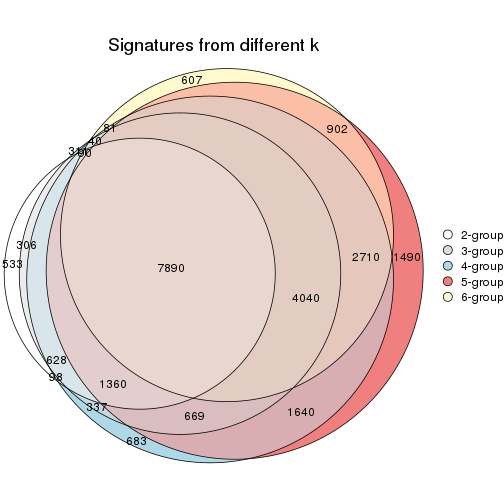

`get_signature()` returns a data frame invisibly. TO get the list of signatures, the function
call should be assigned to a variable explicitly. In following code, if `plot` argument is set
to `FALSE`, no heatmap is plotted while only the differential analysis is performed.

```r
# code only for demonstration
tb = get_signature(res, k = ..., plot = FALSE)
```

An example of the output of `tb` is:

```
#>   which_row         fdr    mean_1    mean_2 scaled_mean_1 scaled_mean_2 km
#> 1        38 0.042760348  8.373488  9.131774    -0.5533452     0.5164555  1
#> 2        40 0.018707592  7.106213  8.469186    -0.6173731     0.5762149  1
#> 3        55 0.019134737 10.221463 11.207825    -0.6159697     0.5749050  1
#> 4        59 0.006059896  5.921854  7.869574    -0.6899429     0.6439467  1
#> 5        60 0.018055526  8.928898 10.211722    -0.6204761     0.5791110  1
#> 6        98 0.009384629 15.714769 14.887706     0.6635654    -0.6193277  2
...
```

The columns in `tb` are:

1. `which_row`: row indices corresponding to the input matrix.
2. `fdr`: FDR for the differential test. 
3. `mean_x`: The mean value in group x.
4. `scaled_mean_x`: The mean value in group x after rows are scaled.
5. `km`: Row groups if k-means clustering is applied to rows.


UMAP plot which shows how samples are separated.


<script>
$( function() {
	$( '#tabs-ATC-hclust-dimension-reduction' ).tabs();
} );
</script>
<div id='tabs-ATC-hclust-dimension-reduction'>
<ul>
<li><a href='#tab-ATC-hclust-dimension-reduction-1'>k = 2</a></li>
<li><a href='#tab-ATC-hclust-dimension-reduction-2'>k = 3</a></li>
<li><a href='#tab-ATC-hclust-dimension-reduction-3'>k = 4</a></li>
<li><a href='#tab-ATC-hclust-dimension-reduction-4'>k = 5</a></li>
<li><a href='#tab-ATC-hclust-dimension-reduction-5'>k = 6</a></li>
</ul>
<div id='tab-ATC-hclust-dimension-reduction-1'>
<pre><code class="r">dimension_reduction(res, k = 2, method = &quot;UMAP&quot;)
</code></pre>

<p></p>

</div>
<div id='tab-ATC-hclust-dimension-reduction-2'>
<pre><code class="r">dimension_reduction(res, k = 3, method = &quot;UMAP&quot;)
</code></pre>

<p></p>

</div>
<div id='tab-ATC-hclust-dimension-reduction-3'>
<pre><code class="r">dimension_reduction(res, k = 4, method = &quot;UMAP&quot;)
</code></pre>

<p></p>

</div>
<div id='tab-ATC-hclust-dimension-reduction-4'>
<pre><code class="r">dimension_reduction(res, k = 5, method = &quot;UMAP&quot;)
</code></pre>

<p></p>

</div>
<div id='tab-ATC-hclust-dimension-reduction-5'>
<pre><code class="r">dimension_reduction(res, k = 6, method = &quot;UMAP&quot;)
</code></pre>

<p></p>

</div>
</div>


Following heatmap shows how subgroups are split when increasing `k`:

```r
collect_classes(res)
```


Test correlation between subgroups and known annotations. If the known
annotation is numeric, one-way ANOVA test is applied, and if the known
annotation is discrete, chi-squared contingency table test is applied.

```r
test_to_known_factors(res)
```

```
#>             n disease.state(p) k
#> ATC:hclust 66           0.9184 2
#> ATC:hclust 65           0.0171 3
#> ATC:hclust 69           0.0887 4
#> ATC:hclust 66           0.1642 5
#> ATC:hclust 58           0.0867 6
```


If matrix rows can be associated to genes, consider to use `GO_Enrichment(res,
...)` to perform function enrichment for the signature genes.


 

---------------------------------------------------


### ATC:kmeans*


The object with results only for a single top-value method and a single partition method 
can be extracted as:

```r
res = res_list["ATC", "kmeans"]
# you can also extract it by
# res = res_list["ATC:kmeans"]
```

A summary of `res` and all the functions that can be applied to it:

```r
res
```

```
#> A 'ConsensusPartition' object with k = 2, 3, 4, 5, 6.
#>   On a matrix with 51941 rows and 70 columns.
#>   Top rows (1000, 2000, 3000, 4000, 5000) are extracted by 'ATC' method.
#>   Subgroups are detected by 'kmeans' method.
#>   Performed in total 1250 partitions by row resampling.
#>   Best k for subgroups seems to be 3.
#> 
#> Following methods can be applied to this 'ConsensusPartition' object:
#>  [1] "cola_report"             "collect_classes"         "collect_plots"          
#>  [4] "collect_stats"           "colnames"                "compare_signatures"     
#>  [7] "consensus_heatmap"       "dimension_reduction"     "functional_enrichment"  
#> [10] "get_anno_col"            "get_anno"                "get_classes"            
#> [13] "get_consensus"           "get_matrix"              "get_membership"         
#> [16] "get_param"               "get_signatures"          "get_stats"              
#> [19] "is_best_k"               "is_stable_k"             "membership_heatmap"     
#> [22] "ncol"                    "nrow"                    "plot_ecdf"              
#> [25] "rownames"                "select_partition_number" "show"                   
#> [28] "suggest_best_k"          "test_to_known_factors"
```

`collect_plots()` function collects all the plots made from `res` for all `k` (number of partitions)
into one single page to provide an easy and fast comparison between different `k`.

```r
collect_plots(res)
```


The plots are:

- The first row: a plot of the ECDF (Empirical cumulative distribution
  function) curves of the consensus matrix for each `k` and the heatmap of
  predicted classes for each `k`.
- The second row: heatmaps of the consensus matrix for each `k`.
- The third row: heatmaps of the membership matrix for each `k`.
- The fouth row: heatmaps of the signatures for each `k`.

All the plots in panels can be made by individual functions and they are
plotted later in this section.

`select_partition_number()` produces several plots showing different
statistics for choosing "optimized" `k`. There are following statistics:

- ECDF curves of the consensus matrix for each `k`;
- 1-PAC. [The PAC
  score](https://en.wikipedia.org/wiki/Consensus_clustering#Over-interpretation_potential_of_consensus_clustering)
  measures the proportion of the ambiguous subgrouping.
- Mean silhouette score.
- Concordance. The mean probability of fiting the consensus class ids in all
  partitions.
- Area increased. Denote $A_k$ as the area under the ECDF curve for current
  `k`, the area increased is defined as $A_k - A_{k-1}$.
- Rand index. The percent of pairs of samples that are both in a same cluster
  or both are not in a same cluster in the partition of k and k-1.
- Jaccard index. The ratio of pairs of samples are both in a same cluster in
  the partition of k and k-1 and the pairs of samples are both in a same
  cluster in the partition k or k-1.

The detailed explanations of these statistics can be found in [the cola
vignette](http://bioconductor.org/packages/devel/bioc/vignettes/cola/inst/doc/cola.html#toc_13).

Generally speaking, lower PAC score, higher mean silhouette score or higher
concordance corresponds to better partition. Rand index and Jaccard index
measure how similar the current partition is compared to partition with `k-1`.
If they are too similar, we won't accept `k` is better than `k-1`.

```r
select_partition_number(res)
```


The numeric values for all these statistics can be obtained by `get_stats()`.

```r
get_stats(res)
```

```
#>   k 1-PAC mean_silhouette concordance area_increased  Rand Jaccard
#> 2 2 0.503           0.884       0.919         0.4900 0.503   0.503
#> 3 3 0.929           0.885       0.933         0.3382 0.771   0.574
#> 4 4 0.841           0.735       0.887         0.1275 0.859   0.621
#> 5 5 0.798           0.718       0.834         0.0755 0.892   0.626
#> 6 6 0.847           0.767       0.847         0.0434 0.915   0.619
```

`suggest_best_k()` suggests the best $k$ based on these statistics. The rules are as follows:

- All $k$ with Jaccard index larger than 0.95 are removed because the increase of
  the partition number does not provides enough extra information. If all $k$ are removed,
  the best $k$ is assigned by `NA`.
- For $k$ with 1-PAC larger than 0.9, the maximal $k$ is taken as the "best k". Other $k$ is called "optional k".
- If it does not fit the second rule. The $k$ with the highest vote of highest
  1-PAC, mean silhouette and concordance is taken as the "best k".

```r
suggest_best_k(res)
```

```
#> [1] 3
```


Following shows the table of the partitions (You need to click the **show/hide
code output** link to see it). The membership matrix (columns with name `p*`)
is inferred by
[`clue::cl_consensus()`](https://www.rdocumentation.org/link/cl_consensus?package=clue)
function with the `SE` method. Basically the value in the membership matrix
represents the probability to belong to a certain group. The finall class
label for an item is determined with the group with highest probability it
belongs to.

In `get_classes()` function, the entropy is calculated from the membership
matrix and the silhouette score is calculated from the consensus matrix.


<script>
$( function() {
	$( '#tabs-ATC-kmeans-get-classes' ).tabs();
} );
</script>
<div id='tabs-ATC-kmeans-get-classes'>
<ul>
<li><a href='#tab-ATC-kmeans-get-classes-1'>k = 2</a></li>
<li><a href='#tab-ATC-kmeans-get-classes-2'>k = 3</a></li>
<li><a href='#tab-ATC-kmeans-get-classes-3'>k = 4</a></li>
<li><a href='#tab-ATC-kmeans-get-classes-4'>k = 5</a></li>
<li><a href='#tab-ATC-kmeans-get-classes-5'>k = 6</a></li>
</ul>

<div id='tab-ATC-kmeans-get-classes-1'>
<p><a id='tab-ATC-kmeans-get-classes-1-a' style='color:#0366d6' href='#'>show/hide code output</a></p>
<pre><code class="r">cbind(get_classes(res, k = 2), get_membership(res, k = 2))
</code></pre>

<pre><code>#&gt;            class entropy silhouette    p1    p2
#&gt; GSM1299517     1  0.2603      0.923 0.956 0.044
#&gt; GSM1299518     1  0.2603      0.923 0.956 0.044
#&gt; GSM1299519     2  0.5294      0.905 0.120 0.880
#&gt; GSM1299520     2  0.0376      0.886 0.004 0.996
#&gt; GSM1299521     2  0.9686      0.254 0.396 0.604
#&gt; GSM1299522     2  0.5294      0.905 0.120 0.880
#&gt; GSM1299523     2  0.9850      0.126 0.428 0.572
#&gt; GSM1299524     1  0.2603      0.923 0.956 0.044
#&gt; GSM1299525     2  0.5178      0.907 0.116 0.884
#&gt; GSM1299526     1  0.2603      0.923 0.956 0.044
#&gt; GSM1299527     1  0.2603      0.923 0.956 0.044
#&gt; GSM1299528     2  0.0000      0.887 0.000 1.000
#&gt; GSM1299529     2  0.5178      0.907 0.116 0.884
#&gt; GSM1299530     1  0.5294      0.891 0.880 0.120
#&gt; GSM1299531     2  0.5294      0.905 0.120 0.880
#&gt; GSM1299575     1  0.5294      0.891 0.880 0.120
#&gt; GSM1299532     1  0.2603      0.923 0.956 0.044
#&gt; GSM1299533     1  0.2603      0.923 0.956 0.044
#&gt; GSM1299534     2  0.5178      0.907 0.116 0.884
#&gt; GSM1299535     1  0.2603      0.923 0.956 0.044
#&gt; GSM1299536     2  0.0376      0.886 0.004 0.996
#&gt; GSM1299537     1  0.2603      0.923 0.956 0.044
#&gt; GSM1299538     2  0.0376      0.886 0.004 0.996
#&gt; GSM1299539     2  0.0376      0.886 0.004 0.996
#&gt; GSM1299540     1  0.0376      0.918 0.996 0.004
#&gt; GSM1299541     1  0.2423      0.923 0.960 0.040
#&gt; GSM1299542     1  0.2603      0.923 0.956 0.044
#&gt; GSM1299543     2  0.5178      0.907 0.116 0.884
#&gt; GSM1299544     2  0.4298      0.905 0.088 0.912
#&gt; GSM1299545     1  0.0376      0.918 0.996 0.004
#&gt; GSM1299546     2  0.5294      0.905 0.120 0.880
#&gt; GSM1299547     2  0.0376      0.886 0.004 0.996
#&gt; GSM1299548     1  0.2603      0.923 0.956 0.044
#&gt; GSM1299549     1  0.4690      0.913 0.900 0.100
#&gt; GSM1299550     2  0.0000      0.887 0.000 1.000
#&gt; GSM1299551     2  0.5294      0.905 0.120 0.880
#&gt; GSM1299552     1  0.5294      0.891 0.880 0.120
#&gt; GSM1299553     1  0.6343      0.890 0.840 0.160
#&gt; GSM1299554     2  0.6973      0.848 0.188 0.812
#&gt; GSM1299555     1  0.2603      0.923 0.956 0.044
#&gt; GSM1299556     1  0.0376      0.918 0.996 0.004
#&gt; GSM1299557     1  0.2603      0.923 0.956 0.044
#&gt; GSM1299558     2  0.5178      0.907 0.116 0.884
#&gt; GSM1299559     1  0.0376      0.918 0.996 0.004
#&gt; GSM1299560     1  0.2603      0.923 0.956 0.044
#&gt; GSM1299576     1  0.5294      0.891 0.880 0.120
#&gt; GSM1299577     1  0.5294      0.891 0.880 0.120
#&gt; GSM1299561     1  0.2603      0.923 0.956 0.044
#&gt; GSM1299562     2  0.5294      0.905 0.120 0.880
#&gt; GSM1299563     2  0.0376      0.886 0.004 0.996
#&gt; GSM1299564     2  0.0376      0.886 0.004 0.996
#&gt; GSM1299565     2  0.5294      0.905 0.120 0.880
#&gt; GSM1299566     2  0.0000      0.887 0.000 1.000
#&gt; GSM1299567     1  0.0000      0.918 1.000 0.000
#&gt; GSM1299568     2  0.5294      0.905 0.120 0.880
#&gt; GSM1299569     2  0.4298      0.905 0.088 0.912
#&gt; GSM1299570     1  0.5294      0.891 0.880 0.120
#&gt; GSM1299571     1  0.2603      0.923 0.956 0.044
#&gt; GSM1299572     1  0.2603      0.923 0.956 0.044
#&gt; GSM1299573     1  0.2603      0.923 0.956 0.044
#&gt; GSM1299574     2  0.5294      0.905 0.120 0.880
#&gt; GSM1299578     1  0.5294      0.891 0.880 0.120
#&gt; GSM1299579     2  0.0376      0.886 0.004 0.996
#&gt; GSM1299580     1  0.5294      0.891 0.880 0.120
#&gt; GSM1299581     1  0.5294      0.891 0.880 0.120
#&gt; GSM1299582     1  0.5294      0.891 0.880 0.120
#&gt; GSM1299583     1  0.5294      0.891 0.880 0.120
#&gt; GSM1299584     1  0.5294      0.891 0.880 0.120
#&gt; GSM1299585     1  0.5294      0.891 0.880 0.120
#&gt; GSM1299586     1  0.5294      0.891 0.880 0.120
</code></pre>

<script>
$('#tab-ATC-kmeans-get-classes-1-a').parent().next().next().hide();
$('#tab-ATC-kmeans-get-classes-1-a').click(function(){
  $('#tab-ATC-kmeans-get-classes-1-a').parent().next().next().toggle();
  return(false);
});
</script>
</div>

<div id='tab-ATC-kmeans-get-classes-2'>
<p><a id='tab-ATC-kmeans-get-classes-2-a' style='color:#0366d6' href='#'>show/hide code output</a></p>
<pre><code class="r">cbind(get_classes(res, k = 3), get_membership(res, k = 3))
</code></pre>

<pre><code>#&gt;            class entropy silhouette    p1    p2    p3
#&gt; GSM1299517     3  0.0000      0.931 0.000 0.000 1.000
#&gt; GSM1299518     3  0.0237      0.928 0.000 0.004 0.996
#&gt; GSM1299519     2  0.0892      0.926 0.000 0.980 0.020
#&gt; GSM1299520     2  0.2711      0.937 0.088 0.912 0.000
#&gt; GSM1299521     1  0.0000      0.883 1.000 0.000 0.000
#&gt; GSM1299522     2  0.0000      0.940 0.000 1.000 0.000
#&gt; GSM1299523     1  0.5115      0.600 0.768 0.228 0.004
#&gt; GSM1299524     3  0.0747      0.920 0.000 0.016 0.984
#&gt; GSM1299525     2  0.0000      0.940 0.000 1.000 0.000
#&gt; GSM1299526     3  0.0000      0.931 0.000 0.000 1.000
#&gt; GSM1299527     3  0.0000      0.931 0.000 0.000 1.000
#&gt; GSM1299528     2  0.2537      0.939 0.080 0.920 0.000
#&gt; GSM1299529     2  0.0000      0.940 0.000 1.000 0.000
#&gt; GSM1299530     1  0.0237      0.887 0.996 0.000 0.004
#&gt; GSM1299531     2  0.0000      0.940 0.000 1.000 0.000
#&gt; GSM1299575     1  0.2711      0.938 0.912 0.000 0.088
#&gt; GSM1299532     3  0.2356      0.876 0.000 0.072 0.928
#&gt; GSM1299533     3  0.0000      0.931 0.000 0.000 1.000
#&gt; GSM1299534     2  0.0892      0.942 0.020 0.980 0.000
#&gt; GSM1299535     3  0.2356      0.876 0.000 0.072 0.928
#&gt; GSM1299536     2  0.2711      0.937 0.088 0.912 0.000
#&gt; GSM1299537     3  0.0000      0.931 0.000 0.000 1.000
#&gt; GSM1299538     2  0.2711      0.937 0.088 0.912 0.000
#&gt; GSM1299539     2  0.2711      0.937 0.088 0.912 0.000
#&gt; GSM1299540     3  0.0000      0.931 0.000 0.000 1.000
#&gt; GSM1299541     3  0.0000      0.931 0.000 0.000 1.000
#&gt; GSM1299542     3  0.0000      0.931 0.000 0.000 1.000
#&gt; GSM1299543     2  0.0000      0.940 0.000 1.000 0.000
#&gt; GSM1299544     2  0.1753      0.942 0.048 0.952 0.000
#&gt; GSM1299545     3  0.0000      0.931 0.000 0.000 1.000
#&gt; GSM1299546     2  0.0000      0.940 0.000 1.000 0.000
#&gt; GSM1299547     2  0.2711      0.937 0.088 0.912 0.000
#&gt; GSM1299548     3  0.0000      0.931 0.000 0.000 1.000
#&gt; GSM1299549     3  0.4178      0.737 0.172 0.000 0.828
#&gt; GSM1299550     2  0.2711      0.937 0.088 0.912 0.000
#&gt; GSM1299551     2  0.0000      0.940 0.000 1.000 0.000
#&gt; GSM1299552     1  0.3941      0.877 0.844 0.000 0.156
#&gt; GSM1299553     3  0.9091      0.170 0.344 0.152 0.504
#&gt; GSM1299554     3  0.5968      0.489 0.000 0.364 0.636
#&gt; GSM1299555     3  0.0000      0.931 0.000 0.000 1.000
#&gt; GSM1299556     3  0.0000      0.931 0.000 0.000 1.000
#&gt; GSM1299557     3  0.0000      0.931 0.000 0.000 1.000
#&gt; GSM1299558     2  0.0000      0.940 0.000 1.000 0.000
#&gt; GSM1299559     3  0.0000      0.931 0.000 0.000 1.000
#&gt; GSM1299560     3  0.0000      0.931 0.000 0.000 1.000
#&gt; GSM1299576     1  0.2711      0.938 0.912 0.000 0.088
#&gt; GSM1299577     1  0.2711      0.938 0.912 0.000 0.088
#&gt; GSM1299561     3  0.0000      0.931 0.000 0.000 1.000
#&gt; GSM1299562     3  0.6026      0.466 0.000 0.376 0.624
#&gt; GSM1299563     2  0.2711      0.937 0.088 0.912 0.000
#&gt; GSM1299564     2  0.2711      0.937 0.088 0.912 0.000
#&gt; GSM1299565     2  0.0000      0.940 0.000 1.000 0.000
#&gt; GSM1299566     2  0.2537      0.939 0.080 0.920 0.000
#&gt; GSM1299567     3  0.0000      0.931 0.000 0.000 1.000
#&gt; GSM1299568     2  0.0000      0.940 0.000 1.000 0.000
#&gt; GSM1299569     2  0.1860      0.942 0.052 0.948 0.000
#&gt; GSM1299570     1  0.5431      0.695 0.716 0.000 0.284
#&gt; GSM1299571     3  0.2448      0.873 0.000 0.076 0.924
#&gt; GSM1299572     3  0.0000      0.931 0.000 0.000 1.000
#&gt; GSM1299573     3  0.0000      0.931 0.000 0.000 1.000
#&gt; GSM1299574     2  0.6111      0.238 0.000 0.604 0.396
#&gt; GSM1299578     1  0.0747      0.895 0.984 0.000 0.016
#&gt; GSM1299579     2  0.2711      0.937 0.088 0.912 0.000
#&gt; GSM1299580     1  0.2711      0.938 0.912 0.000 0.088
#&gt; GSM1299581     1  0.2711      0.938 0.912 0.000 0.088
#&gt; GSM1299582     1  0.2711      0.938 0.912 0.000 0.088
#&gt; GSM1299583     1  0.2711      0.938 0.912 0.000 0.088
#&gt; GSM1299584     1  0.2711      0.938 0.912 0.000 0.088
#&gt; GSM1299585     1  0.2711      0.938 0.912 0.000 0.088
#&gt; GSM1299586     1  0.2711      0.938 0.912 0.000 0.088
</code></pre>

<script>
$('#tab-ATC-kmeans-get-classes-2-a').parent().next().next().hide();
$('#tab-ATC-kmeans-get-classes-2-a').click(function(){
  $('#tab-ATC-kmeans-get-classes-2-a').parent().next().next().toggle();
  return(false);
});
</script>
</div>

<div id='tab-ATC-kmeans-get-classes-3'>
<p><a id='tab-ATC-kmeans-get-classes-3-a' style='color:#0366d6' href='#'>show/hide code output</a></p>
<pre><code class="r">cbind(get_classes(res, k = 4), get_membership(res, k = 4))
</code></pre>

<pre><code>#&gt;            class entropy silhouette    p1    p2    p3    p4
#&gt; GSM1299517     3  0.0000     0.9302 0.000 0.000 1.000 0.000
#&gt; GSM1299518     3  0.1474     0.9230 0.000 0.000 0.948 0.052
#&gt; GSM1299519     2  0.1305     0.8247 0.000 0.960 0.004 0.036
#&gt; GSM1299520     4  0.1557     0.7089 0.000 0.056 0.000 0.944
#&gt; GSM1299521     4  0.5163    -0.1066 0.480 0.004 0.000 0.516
#&gt; GSM1299522     2  0.0000     0.8508 0.000 1.000 0.000 0.000
#&gt; GSM1299523     4  0.1059     0.6899 0.016 0.012 0.000 0.972
#&gt; GSM1299524     3  0.2174     0.9157 0.000 0.020 0.928 0.052
#&gt; GSM1299525     2  0.1022     0.8362 0.000 0.968 0.000 0.032
#&gt; GSM1299526     3  0.0000     0.9302 0.000 0.000 1.000 0.000
#&gt; GSM1299527     3  0.0000     0.9302 0.000 0.000 1.000 0.000
#&gt; GSM1299528     4  0.4866     0.1796 0.000 0.404 0.000 0.596
#&gt; GSM1299529     2  0.0000     0.8508 0.000 1.000 0.000 0.000
#&gt; GSM1299530     4  0.5163    -0.1119 0.480 0.004 0.000 0.516
#&gt; GSM1299531     2  0.0000     0.8508 0.000 1.000 0.000 0.000
#&gt; GSM1299575     1  0.0000     0.9365 1.000 0.000 0.000 0.000
#&gt; GSM1299532     3  0.2483     0.9093 0.000 0.032 0.916 0.052
#&gt; GSM1299533     3  0.1807     0.9208 0.000 0.008 0.940 0.052
#&gt; GSM1299534     2  0.4916     0.2427 0.000 0.576 0.000 0.424
#&gt; GSM1299535     3  0.2483     0.9093 0.000 0.032 0.916 0.052
#&gt; GSM1299536     4  0.1940     0.7066 0.000 0.076 0.000 0.924
#&gt; GSM1299537     3  0.0000     0.9302 0.000 0.000 1.000 0.000
#&gt; GSM1299538     4  0.2589     0.6828 0.000 0.116 0.000 0.884
#&gt; GSM1299539     4  0.3610     0.6022 0.000 0.200 0.000 0.800
#&gt; GSM1299540     3  0.0000     0.9302 0.000 0.000 1.000 0.000
#&gt; GSM1299541     3  0.0000     0.9302 0.000 0.000 1.000 0.000
#&gt; GSM1299542     3  0.0000     0.9302 0.000 0.000 1.000 0.000
#&gt; GSM1299543     2  0.1302     0.8306 0.000 0.956 0.000 0.044
#&gt; GSM1299544     2  0.4994     0.1124 0.000 0.520 0.000 0.480
#&gt; GSM1299545     3  0.1557     0.9219 0.000 0.000 0.944 0.056
#&gt; GSM1299546     2  0.0000     0.8508 0.000 1.000 0.000 0.000
#&gt; GSM1299547     4  0.0707     0.6944 0.000 0.020 0.000 0.980
#&gt; GSM1299548     3  0.0000     0.9302 0.000 0.000 1.000 0.000
#&gt; GSM1299549     3  0.7847     0.2687 0.120 0.036 0.500 0.344
#&gt; GSM1299550     4  0.3610     0.6022 0.000 0.200 0.000 0.800
#&gt; GSM1299551     2  0.0000     0.8508 0.000 1.000 0.000 0.000
#&gt; GSM1299552     1  0.5670     0.3088 0.572 0.004 0.020 0.404
#&gt; GSM1299553     4  0.7290     0.3840 0.120 0.044 0.208 0.628
#&gt; GSM1299554     3  0.7812     0.0682 0.000 0.256 0.396 0.348
#&gt; GSM1299555     3  0.1474     0.9230 0.000 0.000 0.948 0.052
#&gt; GSM1299556     3  0.0000     0.9302 0.000 0.000 1.000 0.000
#&gt; GSM1299557     3  0.1389     0.9242 0.000 0.000 0.952 0.048
#&gt; GSM1299558     2  0.1211     0.8336 0.000 0.960 0.000 0.040
#&gt; GSM1299559     3  0.0000     0.9302 0.000 0.000 1.000 0.000
#&gt; GSM1299560     3  0.0000     0.9302 0.000 0.000 1.000 0.000
#&gt; GSM1299576     1  0.0188     0.9368 0.996 0.000 0.000 0.004
#&gt; GSM1299577     1  0.3853     0.7617 0.820 0.000 0.020 0.160
#&gt; GSM1299561     3  0.0000     0.9302 0.000 0.000 1.000 0.000
#&gt; GSM1299562     2  0.3474     0.7292 0.000 0.868 0.064 0.068
#&gt; GSM1299563     4  0.1716     0.7090 0.000 0.064 0.000 0.936
#&gt; GSM1299564     4  0.1792     0.7077 0.000 0.068 0.000 0.932
#&gt; GSM1299565     2  0.0000     0.8508 0.000 1.000 0.000 0.000
#&gt; GSM1299566     4  0.4866     0.1796 0.000 0.404 0.000 0.596
#&gt; GSM1299567     3  0.0188     0.9282 0.004 0.000 0.996 0.000
#&gt; GSM1299568     2  0.0707     0.8399 0.000 0.980 0.000 0.020
#&gt; GSM1299569     2  0.4998     0.0869 0.000 0.512 0.000 0.488
#&gt; GSM1299570     4  0.7914    -0.0676 0.360 0.004 0.236 0.400
#&gt; GSM1299571     3  0.2483     0.9093 0.000 0.032 0.916 0.052
#&gt; GSM1299572     3  0.2722     0.9017 0.000 0.032 0.904 0.064
#&gt; GSM1299573     3  0.1118     0.9265 0.000 0.000 0.964 0.036
#&gt; GSM1299574     2  0.1661     0.8083 0.000 0.944 0.004 0.052
#&gt; GSM1299578     1  0.0188     0.9368 0.996 0.000 0.000 0.004
#&gt; GSM1299579     4  0.1940     0.7066 0.000 0.076 0.000 0.924
#&gt; GSM1299580     1  0.0000     0.9365 1.000 0.000 0.000 0.000
#&gt; GSM1299581     1  0.0188     0.9368 0.996 0.000 0.000 0.004
#&gt; GSM1299582     1  0.0000     0.9365 1.000 0.000 0.000 0.000
#&gt; GSM1299583     1  0.0188     0.9368 0.996 0.000 0.000 0.004
#&gt; GSM1299584     1  0.0000     0.9365 1.000 0.000 0.000 0.000
#&gt; GSM1299585     1  0.0188     0.9368 0.996 0.000 0.000 0.004
#&gt; GSM1299586     1  0.0000     0.9365 1.000 0.000 0.000 0.000
</code></pre>

<script>
$('#tab-ATC-kmeans-get-classes-3-a').parent().next().next().hide();
$('#tab-ATC-kmeans-get-classes-3-a').click(function(){
  $('#tab-ATC-kmeans-get-classes-3-a').parent().next().next().toggle();
  return(false);
});
</script>
</div>

<div id='tab-ATC-kmeans-get-classes-4'>
<p><a id='tab-ATC-kmeans-get-classes-4-a' style='color:#0366d6' href='#'>show/hide code output</a></p>
<pre><code class="r">cbind(get_classes(res, k = 5), get_membership(res, k = 5))
</code></pre>

<pre><code>#&gt;            class entropy silhouette    p1    p2    p3    p4    p5
#&gt; GSM1299517     3  0.0000     0.7842 0.000 0.000 1.000 0.000 0.000
#&gt; GSM1299518     3  0.4210     0.6024 0.000 0.000 0.588 0.412 0.000
#&gt; GSM1299519     2  0.2230     0.8061 0.000 0.884 0.000 0.116 0.000
#&gt; GSM1299520     5  0.3074     0.5454 0.000 0.000 0.000 0.196 0.804
#&gt; GSM1299521     4  0.5263     0.4411 0.056 0.000 0.000 0.576 0.368
#&gt; GSM1299522     2  0.0000     0.8756 0.000 1.000 0.000 0.000 0.000
#&gt; GSM1299523     4  0.4227     0.3832 0.000 0.000 0.000 0.580 0.420
#&gt; GSM1299524     3  0.4752     0.5856 0.000 0.020 0.568 0.412 0.000
#&gt; GSM1299525     2  0.1430     0.8461 0.000 0.944 0.000 0.004 0.052
#&gt; GSM1299526     3  0.0000     0.7842 0.000 0.000 1.000 0.000 0.000
#&gt; GSM1299527     3  0.0000     0.7842 0.000 0.000 1.000 0.000 0.000
#&gt; GSM1299528     5  0.2648     0.7992 0.000 0.152 0.000 0.000 0.848
#&gt; GSM1299529     2  0.0162     0.8746 0.000 0.996 0.000 0.004 0.000
#&gt; GSM1299530     4  0.5174     0.4827 0.056 0.000 0.000 0.604 0.340
#&gt; GSM1299531     2  0.0000     0.8756 0.000 1.000 0.000 0.000 0.000
#&gt; GSM1299575     1  0.0000     0.9941 1.000 0.000 0.000 0.000 0.000
#&gt; GSM1299532     3  0.5118     0.5656 0.000 0.040 0.548 0.412 0.000
#&gt; GSM1299533     3  0.4210     0.6024 0.000 0.000 0.588 0.412 0.000
#&gt; GSM1299534     2  0.4009     0.4003 0.000 0.684 0.000 0.004 0.312
#&gt; GSM1299535     3  0.5302     0.5519 0.000 0.052 0.536 0.412 0.000
#&gt; GSM1299536     5  0.1628     0.7816 0.000 0.056 0.000 0.008 0.936
#&gt; GSM1299537     3  0.0000     0.7842 0.000 0.000 1.000 0.000 0.000
#&gt; GSM1299538     5  0.1894     0.7887 0.000 0.072 0.000 0.008 0.920
#&gt; GSM1299539     5  0.2561     0.8011 0.000 0.144 0.000 0.000 0.856
#&gt; GSM1299540     3  0.0000     0.7842 0.000 0.000 1.000 0.000 0.000
#&gt; GSM1299541     3  0.0000     0.7842 0.000 0.000 1.000 0.000 0.000
#&gt; GSM1299542     3  0.0000     0.7842 0.000 0.000 1.000 0.000 0.000
#&gt; GSM1299543     2  0.1430     0.8461 0.000 0.944 0.000 0.004 0.052
#&gt; GSM1299544     5  0.4009     0.5969 0.000 0.312 0.000 0.004 0.684
#&gt; GSM1299545     4  0.3452     0.2831 0.000 0.000 0.244 0.756 0.000
#&gt; GSM1299546     2  0.0000     0.8756 0.000 1.000 0.000 0.000 0.000
#&gt; GSM1299547     4  0.4227     0.3832 0.000 0.000 0.000 0.580 0.420
#&gt; GSM1299548     3  0.0000     0.7842 0.000 0.000 1.000 0.000 0.000
#&gt; GSM1299549     4  0.0324     0.6523 0.004 0.000 0.004 0.992 0.000
#&gt; GSM1299550     5  0.2561     0.8011 0.000 0.144 0.000 0.000 0.856
#&gt; GSM1299551     2  0.0000     0.8756 0.000 1.000 0.000 0.000 0.000
#&gt; GSM1299552     4  0.3339     0.6821 0.040 0.000 0.000 0.836 0.124
#&gt; GSM1299553     4  0.2536     0.6876 0.004 0.000 0.000 0.868 0.128
#&gt; GSM1299554     4  0.1430     0.6279 0.000 0.052 0.004 0.944 0.000
#&gt; GSM1299555     3  0.4210     0.6024 0.000 0.000 0.588 0.412 0.000
#&gt; GSM1299556     3  0.0000     0.7842 0.000 0.000 1.000 0.000 0.000
#&gt; GSM1299557     3  0.4192     0.6068 0.000 0.000 0.596 0.404 0.000
#&gt; GSM1299558     2  0.1430     0.8461 0.000 0.944 0.000 0.004 0.052
#&gt; GSM1299559     3  0.0000     0.7842 0.000 0.000 1.000 0.000 0.000
#&gt; GSM1299560     3  0.0000     0.7842 0.000 0.000 1.000 0.000 0.000
#&gt; GSM1299576     1  0.0451     0.9937 0.988 0.000 0.000 0.004 0.008
#&gt; GSM1299577     4  0.3535     0.6700 0.088 0.000 0.000 0.832 0.080
#&gt; GSM1299561     3  0.0000     0.7842 0.000 0.000 1.000 0.000 0.000
#&gt; GSM1299562     2  0.4367     0.3350 0.000 0.580 0.004 0.416 0.000
#&gt; GSM1299563     5  0.3196     0.5526 0.000 0.004 0.000 0.192 0.804
#&gt; GSM1299564     5  0.4171     0.0509 0.000 0.000 0.000 0.396 0.604
#&gt; GSM1299565     2  0.0000     0.8756 0.000 1.000 0.000 0.000 0.000
#&gt; GSM1299566     5  0.2648     0.7992 0.000 0.152 0.000 0.000 0.848
#&gt; GSM1299567     3  0.0000     0.7842 0.000 0.000 1.000 0.000 0.000
#&gt; GSM1299568     2  0.1792     0.8334 0.000 0.916 0.000 0.084 0.000
#&gt; GSM1299569     5  0.3814     0.6566 0.000 0.276 0.000 0.004 0.720
#&gt; GSM1299570     4  0.2536     0.6876 0.004 0.000 0.000 0.868 0.128
#&gt; GSM1299571     3  0.5359     0.5473 0.000 0.056 0.532 0.412 0.000
#&gt; GSM1299572     4  0.4473    -0.0409 0.000 0.020 0.324 0.656 0.000
#&gt; GSM1299573     3  0.4192     0.6068 0.000 0.000 0.596 0.404 0.000
#&gt; GSM1299574     2  0.2471     0.7878 0.000 0.864 0.000 0.136 0.000
#&gt; GSM1299578     1  0.0566     0.9929 0.984 0.000 0.000 0.004 0.012
#&gt; GSM1299579     5  0.1557     0.7790 0.000 0.052 0.000 0.008 0.940
#&gt; GSM1299580     1  0.0000     0.9941 1.000 0.000 0.000 0.000 0.000
#&gt; GSM1299581     1  0.0451     0.9937 0.988 0.000 0.000 0.004 0.008
#&gt; GSM1299582     1  0.0000     0.9941 1.000 0.000 0.000 0.000 0.000
#&gt; GSM1299583     1  0.0566     0.9929 0.984 0.000 0.000 0.004 0.012
#&gt; GSM1299584     1  0.0000     0.9941 1.000 0.000 0.000 0.000 0.000
#&gt; GSM1299585     1  0.0566     0.9929 0.984 0.000 0.000 0.004 0.012
#&gt; GSM1299586     1  0.0000     0.9941 1.000 0.000 0.000 0.000 0.000
</code></pre>

<script>
$('#tab-ATC-kmeans-get-classes-4-a').parent().next().next().hide();
$('#tab-ATC-kmeans-get-classes-4-a').click(function(){
  $('#tab-ATC-kmeans-get-classes-4-a').parent().next().next().toggle();
  return(false);
});
</script>
</div>

<div id='tab-ATC-kmeans-get-classes-5'>
<p><a id='tab-ATC-kmeans-get-classes-5-a' style='color:#0366d6' href='#'>show/hide code output</a></p>
<pre><code class="r">cbind(get_classes(res, k = 6), get_membership(res, k = 6))
</code></pre>

<pre><code>#&gt;            class entropy silhouette    p1    p2    p3    p4    p5    p6
#&gt; GSM1299517     3  0.3756     0.9657 0.000 0.000 0.644 0.004 0.000 0.352
#&gt; GSM1299518     6  0.0000     0.7718 0.000 0.000 0.000 0.000 0.000 1.000
#&gt; GSM1299519     2  0.0547     0.9312 0.000 0.980 0.000 0.000 0.000 0.020
#&gt; GSM1299520     5  0.5574     0.2161 0.000 0.000 0.152 0.344 0.504 0.000
#&gt; GSM1299521     4  0.4330     0.6625 0.076 0.000 0.144 0.756 0.024 0.000
#&gt; GSM1299522     2  0.0000     0.9399 0.000 1.000 0.000 0.000 0.000 0.000
#&gt; GSM1299523     4  0.3176     0.6967 0.000 0.000 0.156 0.812 0.032 0.000
#&gt; GSM1299524     6  0.0260     0.7753 0.000 0.008 0.000 0.000 0.000 0.992
#&gt; GSM1299525     2  0.1261     0.9242 0.000 0.952 0.024 0.000 0.024 0.000
#&gt; GSM1299526     3  0.3756     0.9657 0.000 0.000 0.644 0.004 0.000 0.352
#&gt; GSM1299527     6  0.3857    -0.6998 0.000 0.000 0.468 0.000 0.000 0.532
#&gt; GSM1299528     5  0.1492     0.8475 0.000 0.024 0.036 0.000 0.940 0.000
#&gt; GSM1299529     2  0.0363     0.9387 0.000 0.988 0.012 0.000 0.000 0.000
#&gt; GSM1299530     4  0.2358     0.7183 0.000 0.000 0.108 0.876 0.016 0.000
#&gt; GSM1299531     2  0.0000     0.9399 0.000 1.000 0.000 0.000 0.000 0.000
#&gt; GSM1299575     1  0.1644     0.9378 0.920 0.000 0.076 0.000 0.004 0.000
#&gt; GSM1299532     6  0.0508     0.7767 0.000 0.012 0.000 0.004 0.000 0.984
#&gt; GSM1299533     6  0.0146     0.7704 0.000 0.000 0.000 0.004 0.000 0.996
#&gt; GSM1299534     2  0.4767     0.4348 0.000 0.620 0.076 0.000 0.304 0.000
#&gt; GSM1299535     6  0.0692     0.7753 0.000 0.020 0.000 0.004 0.000 0.976
#&gt; GSM1299536     5  0.1464     0.8325 0.000 0.004 0.016 0.036 0.944 0.000
#&gt; GSM1299537     3  0.3620     0.9663 0.000 0.000 0.648 0.000 0.000 0.352
#&gt; GSM1299538     5  0.1620     0.8394 0.000 0.012 0.024 0.024 0.940 0.000
#&gt; GSM1299539     5  0.1408     0.8481 0.000 0.020 0.036 0.000 0.944 0.000
#&gt; GSM1299540     3  0.3996     0.9646 0.000 0.000 0.636 0.008 0.004 0.352
#&gt; GSM1299541     3  0.3620     0.9663 0.000 0.000 0.648 0.000 0.000 0.352
#&gt; GSM1299542     3  0.3620     0.9663 0.000 0.000 0.648 0.000 0.000 0.352
#&gt; GSM1299543     2  0.2263     0.8898 0.000 0.896 0.056 0.000 0.048 0.000
#&gt; GSM1299544     5  0.2250     0.8288 0.000 0.040 0.064 0.000 0.896 0.000
#&gt; GSM1299545     4  0.4126     0.0321 0.000 0.000 0.004 0.512 0.004 0.480
#&gt; GSM1299546     2  0.0146     0.9395 0.000 0.996 0.000 0.000 0.000 0.004
#&gt; GSM1299547     4  0.4039     0.6557 0.000 0.000 0.156 0.752 0.092 0.000
#&gt; GSM1299548     3  0.3634     0.9648 0.000 0.000 0.644 0.000 0.000 0.356
#&gt; GSM1299549     4  0.3890     0.2772 0.000 0.000 0.004 0.596 0.000 0.400
#&gt; GSM1299550     5  0.1148     0.8473 0.000 0.020 0.016 0.004 0.960 0.000
#&gt; GSM1299551     2  0.0146     0.9395 0.000 0.996 0.000 0.000 0.000 0.004
#&gt; GSM1299552     4  0.1082     0.7455 0.000 0.000 0.004 0.956 0.000 0.040
#&gt; GSM1299553     4  0.2126     0.7363 0.000 0.000 0.020 0.904 0.004 0.072
#&gt; GSM1299554     6  0.4748     0.3364 0.000 0.040 0.020 0.296 0.000 0.644
#&gt; GSM1299555     6  0.0000     0.7718 0.000 0.000 0.000 0.000 0.000 1.000
#&gt; GSM1299556     3  0.3996     0.9646 0.000 0.000 0.636 0.008 0.004 0.352
#&gt; GSM1299557     6  0.1196     0.7612 0.000 0.000 0.008 0.040 0.000 0.952
#&gt; GSM1299558     2  0.2197     0.8926 0.000 0.900 0.056 0.000 0.044 0.000
#&gt; GSM1299559     3  0.3996     0.9646 0.000 0.000 0.636 0.008 0.004 0.352
#&gt; GSM1299560     3  0.3857     0.8016 0.000 0.000 0.532 0.000 0.000 0.468
#&gt; GSM1299576     1  0.0692     0.9319 0.976 0.000 0.000 0.020 0.004 0.000
#&gt; GSM1299577     4  0.1226     0.7442 0.004 0.000 0.000 0.952 0.004 0.040
#&gt; GSM1299561     3  0.3810     0.8739 0.000 0.000 0.572 0.000 0.000 0.428
#&gt; GSM1299562     6  0.4194     0.3449 0.000 0.352 0.012 0.008 0.000 0.628
#&gt; GSM1299563     5  0.5574     0.2161 0.000 0.000 0.152 0.344 0.504 0.000
#&gt; GSM1299564     4  0.5648     0.0608 0.000 0.000 0.156 0.472 0.372 0.000
#&gt; GSM1299565     2  0.0146     0.9398 0.000 0.996 0.004 0.000 0.000 0.000
#&gt; GSM1299566     5  0.1492     0.8475 0.000 0.024 0.036 0.000 0.940 0.000
#&gt; GSM1299567     3  0.3996     0.9646 0.000 0.000 0.636 0.008 0.004 0.352
#&gt; GSM1299568     2  0.1245     0.9296 0.000 0.952 0.032 0.000 0.000 0.016
#&gt; GSM1299569     5  0.2145     0.8360 0.000 0.028 0.072 0.000 0.900 0.000
#&gt; GSM1299570     4  0.0937     0.7456 0.000 0.000 0.000 0.960 0.000 0.040
#&gt; GSM1299571     6  0.1082     0.7642 0.000 0.040 0.000 0.004 0.000 0.956
#&gt; GSM1299572     6  0.3512     0.5151 0.000 0.008 0.004 0.248 0.000 0.740
#&gt; GSM1299573     6  0.0363     0.7598 0.000 0.000 0.012 0.000 0.000 0.988
#&gt; GSM1299574     2  0.0632     0.9287 0.000 0.976 0.000 0.000 0.000 0.024
#&gt; GSM1299578     1  0.2333     0.8981 0.896 0.000 0.040 0.060 0.004 0.000
#&gt; GSM1299579     5  0.1464     0.8325 0.000 0.004 0.016 0.036 0.944 0.000
#&gt; GSM1299580     1  0.1644     0.9378 0.920 0.000 0.076 0.000 0.004 0.000
#&gt; GSM1299581     1  0.0692     0.9319 0.976 0.000 0.000 0.020 0.004 0.000
#&gt; GSM1299582     1  0.1644     0.9378 0.920 0.000 0.076 0.000 0.004 0.000
#&gt; GSM1299583     1  0.1552     0.9207 0.940 0.000 0.036 0.020 0.004 0.000
#&gt; GSM1299584     1  0.1644     0.9378 0.920 0.000 0.076 0.000 0.004 0.000
#&gt; GSM1299585     1  0.2333     0.8981 0.896 0.000 0.040 0.060 0.004 0.000
#&gt; GSM1299586     1  0.1644     0.9378 0.920 0.000 0.076 0.000 0.004 0.000
</code></pre>

<script>
$('#tab-ATC-kmeans-get-classes-5-a').parent().next().next().hide();
$('#tab-ATC-kmeans-get-classes-5-a').click(function(){
  $('#tab-ATC-kmeans-get-classes-5-a').parent().next().next().toggle();
  return(false);
});
</script>
</div>
</div>

Heatmaps for the consensus matrix. It visualizes the probability of two
samples to be in a same group.


<script>
$( function() {
	$( '#tabs-ATC-kmeans-consensus-heatmap' ).tabs();
} );
</script>
<div id='tabs-ATC-kmeans-consensus-heatmap'>
<ul>
<li><a href='#tab-ATC-kmeans-consensus-heatmap-1'>k = 2</a></li>
<li><a href='#tab-ATC-kmeans-consensus-heatmap-2'>k = 3</a></li>
<li><a href='#tab-ATC-kmeans-consensus-heatmap-3'>k = 4</a></li>
<li><a href='#tab-ATC-kmeans-consensus-heatmap-4'>k = 5</a></li>
<li><a href='#tab-ATC-kmeans-consensus-heatmap-5'>k = 6</a></li>
</ul>
<div id='tab-ATC-kmeans-consensus-heatmap-1'>
<pre><code class="r">consensus_heatmap(res, k = 2)
</code></pre>

<p></p>

</div>
<div id='tab-ATC-kmeans-consensus-heatmap-2'>
<pre><code class="r">consensus_heatmap(res, k = 3)
</code></pre>

<p></p>

</div>
<div id='tab-ATC-kmeans-consensus-heatmap-3'>
<pre><code class="r">consensus_heatmap(res, k = 4)
</code></pre>

<p></p>

</div>
<div id='tab-ATC-kmeans-consensus-heatmap-4'>
<pre><code class="r">consensus_heatmap(res, k = 5)
</code></pre>

<p></p>

</div>
<div id='tab-ATC-kmeans-consensus-heatmap-5'>
<pre><code class="r">consensus_heatmap(res, k = 6)
</code></pre>

<p></p>

</div>
</div>

Heatmaps for the membership of samples in all partitions to see how consistent they are:


<script>
$( function() {
	$( '#tabs-ATC-kmeans-membership-heatmap' ).tabs();
} );
</script>
<div id='tabs-ATC-kmeans-membership-heatmap'>
<ul>
<li><a href='#tab-ATC-kmeans-membership-heatmap-1'>k = 2</a></li>
<li><a href='#tab-ATC-kmeans-membership-heatmap-2'>k = 3</a></li>
<li><a href='#tab-ATC-kmeans-membership-heatmap-3'>k = 4</a></li>
<li><a href='#tab-ATC-kmeans-membership-heatmap-4'>k = 5</a></li>
<li><a href='#tab-ATC-kmeans-membership-heatmap-5'>k = 6</a></li>
</ul>
<div id='tab-ATC-kmeans-membership-heatmap-1'>
<pre><code class="r">membership_heatmap(res, k = 2)
</code></pre>

<p></p>

</div>
<div id='tab-ATC-kmeans-membership-heatmap-2'>
<pre><code class="r">membership_heatmap(res, k = 3)
</code></pre>

<p></p>

</div>
<div id='tab-ATC-kmeans-membership-heatmap-3'>
<pre><code class="r">membership_heatmap(res, k = 4)
</code></pre>

<p></p>

</div>
<div id='tab-ATC-kmeans-membership-heatmap-4'>
<pre><code class="r">membership_heatmap(res, k = 5)
</code></pre>

<p></p>

</div>
<div id='tab-ATC-kmeans-membership-heatmap-5'>
<pre><code class="r">membership_heatmap(res, k = 6)
</code></pre>

<p></p>

</div>
</div>

As soon as we have had the classes for columns, we can look for signatures
which are significantly different between classes which can be candidate marks
for certain classes. Following are the heatmaps for signatures.


Signature heatmaps where rows are scaled:


<script>
$( function() {
	$( '#tabs-ATC-kmeans-get-signatures' ).tabs();
} );
</script>
<div id='tabs-ATC-kmeans-get-signatures'>
<ul>
<li><a href='#tab-ATC-kmeans-get-signatures-1'>k = 2</a></li>
<li><a href='#tab-ATC-kmeans-get-signatures-2'>k = 3</a></li>
<li><a href='#tab-ATC-kmeans-get-signatures-3'>k = 4</a></li>
<li><a href='#tab-ATC-kmeans-get-signatures-4'>k = 5</a></li>
<li><a href='#tab-ATC-kmeans-get-signatures-5'>k = 6</a></li>
</ul>
<div id='tab-ATC-kmeans-get-signatures-1'>
<pre><code class="r">get_signatures(res, k = 2)
</code></pre>

<p></p>

</div>
<div id='tab-ATC-kmeans-get-signatures-2'>
<pre><code class="r">get_signatures(res, k = 3)
</code></pre>

<p></p>

</div>
<div id='tab-ATC-kmeans-get-signatures-3'>
<pre><code class="r">get_signatures(res, k = 4)
</code></pre>

<p></p>

</div>
<div id='tab-ATC-kmeans-get-signatures-4'>
<pre><code class="r">get_signatures(res, k = 5)
</code></pre>

<p></p>

</div>
<div id='tab-ATC-kmeans-get-signatures-5'>
<pre><code class="r">get_signatures(res, k = 6)
</code></pre>

<p></p>

</div>
</div>


Signature heatmaps where rows are not scaled:


<script>
$( function() {
	$( '#tabs-ATC-kmeans-get-signatures-no-scale' ).tabs();
} );
</script>
<div id='tabs-ATC-kmeans-get-signatures-no-scale'>
<ul>
<li><a href='#tab-ATC-kmeans-get-signatures-no-scale-1'>k = 2</a></li>
<li><a href='#tab-ATC-kmeans-get-signatures-no-scale-2'>k = 3</a></li>
<li><a href='#tab-ATC-kmeans-get-signatures-no-scale-3'>k = 4</a></li>
<li><a href='#tab-ATC-kmeans-get-signatures-no-scale-4'>k = 5</a></li>
<li><a href='#tab-ATC-kmeans-get-signatures-no-scale-5'>k = 6</a></li>
</ul>
<div id='tab-ATC-kmeans-get-signatures-no-scale-1'>
<pre><code class="r">get_signatures(res, k = 2, scale_rows = FALSE)
</code></pre>

<p>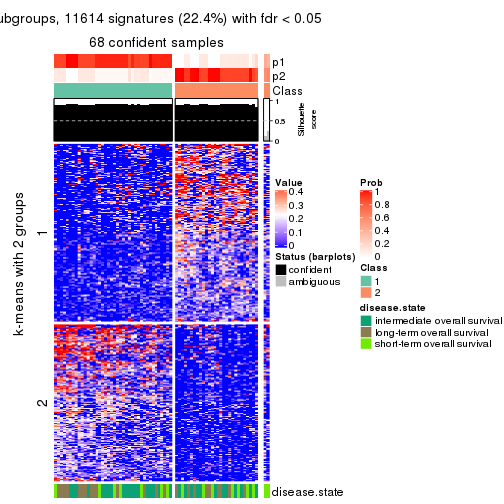</p>

</div>
<div id='tab-ATC-kmeans-get-signatures-no-scale-2'>
<pre><code class="r">get_signatures(res, k = 3, scale_rows = FALSE)
</code></pre>

<p></p>

</div>
<div id='tab-ATC-kmeans-get-signatures-no-scale-3'>
<pre><code class="r">get_signatures(res, k = 4, scale_rows = FALSE)
</code></pre>

<p></p>

</div>
<div id='tab-ATC-kmeans-get-signatures-no-scale-4'>
<pre><code class="r">get_signatures(res, k = 5, scale_rows = FALSE)
</code></pre>

<p></p>

</div>
<div id='tab-ATC-kmeans-get-signatures-no-scale-5'>
<pre><code class="r">get_signatures(res, k = 6, scale_rows = FALSE)
</code></pre>

<p></p>

</div>
</div>


Compare the overlap of signatures from different k:

```r
compare_signatures(res)
```


`get_signature()` returns a data frame invisibly. TO get the list of signatures, the function
call should be assigned to a variable explicitly. In following code, if `plot` argument is set
to `FALSE`, no heatmap is plotted while only the differential analysis is performed.

```r
# code only for demonstration
tb = get_signature(res, k = ..., plot = FALSE)
```

An example of the output of `tb` is:

```
#>   which_row         fdr    mean_1    mean_2 scaled_mean_1 scaled_mean_2 km
#> 1        38 0.042760348  8.373488  9.131774    -0.5533452     0.5164555  1
#> 2        40 0.018707592  7.106213  8.469186    -0.6173731     0.5762149  1
#> 3        55 0.019134737 10.221463 11.207825    -0.6159697     0.5749050  1
#> 4        59 0.006059896  5.921854  7.869574    -0.6899429     0.6439467  1
#> 5        60 0.018055526  8.928898 10.211722    -0.6204761     0.5791110  1
#> 6        98 0.009384629 15.714769 14.887706     0.6635654    -0.6193277  2
...
```

The columns in `tb` are:

1. `which_row`: row indices corresponding to the input matrix.
2. `fdr`: FDR for the differential test. 
3. `mean_x`: The mean value in group x.
4. `scaled_mean_x`: The mean value in group x after rows are scaled.
5. `km`: Row groups if k-means clustering is applied to rows.


UMAP plot which shows how samples are separated.


<script>
$( function() {
	$( '#tabs-ATC-kmeans-dimension-reduction' ).tabs();
} );
</script>
<div id='tabs-ATC-kmeans-dimension-reduction'>
<ul>
<li><a href='#tab-ATC-kmeans-dimension-reduction-1'>k = 2</a></li>
<li><a href='#tab-ATC-kmeans-dimension-reduction-2'>k = 3</a></li>
<li><a href='#tab-ATC-kmeans-dimension-reduction-3'>k = 4</a></li>
<li><a href='#tab-ATC-kmeans-dimension-reduction-4'>k = 5</a></li>
<li><a href='#tab-ATC-kmeans-dimension-reduction-5'>k = 6</a></li>
</ul>
<div id='tab-ATC-kmeans-dimension-reduction-1'>
<pre><code class="r">dimension_reduction(res, k = 2, method = &quot;UMAP&quot;)
</code></pre>

<p></p>

</div>
<div id='tab-ATC-kmeans-dimension-reduction-2'>
<pre><code class="r">dimension_reduction(res, k = 3, method = &quot;UMAP&quot;)
</code></pre>

<p></p>

</div>
<div id='tab-ATC-kmeans-dimension-reduction-3'>
<pre><code class="r">dimension_reduction(res, k = 4, method = &quot;UMAP&quot;)
</code></pre>

<p></p>

</div>
<div id='tab-ATC-kmeans-dimension-reduction-4'>
<pre><code class="r">dimension_reduction(res, k = 5, method = &quot;UMAP&quot;)
</code></pre>

<p></p>

</div>
<div id='tab-ATC-kmeans-dimension-reduction-5'>
<pre><code class="r">dimension_reduction(res, k = 6, method = &quot;UMAP&quot;)
</code></pre>

<p></p>

</div>
</div>


Following heatmap shows how subgroups are split when increasing `k`:

```r
collect_classes(res)
```


Test correlation between subgroups and known annotations. If the known
annotation is numeric, one-way ANOVA test is applied, and if the known
annotation is discrete, chi-squared contingency table test is applied.

```r
test_to_known_factors(res)
```

```
#>             n disease.state(p) k
#> ATC:kmeans 68           0.7529 2
#> ATC:kmeans 66           0.0803 3
#> ATC:kmeans 58           0.0634 4
#> ATC:kmeans 61           0.0141 5
#> ATC:kmeans 61           0.0580 6
```


If matrix rows can be associated to genes, consider to use `GO_Enrichment(res,
...)` to perform function enrichment for the signature genes.


 

---------------------------------------------------


### ATC:skmeans**


The object with results only for a single top-value method and a single partition method 
can be extracted as:

```r
res = res_list["ATC", "skmeans"]
# you can also extract it by
# res = res_list["ATC:skmeans"]
```

A summary of `res` and all the functions that can be applied to it:

```r
res
```

```
#> A 'ConsensusPartition' object with k = 2, 3, 4, 5, 6.
#>   On a matrix with 51941 rows and 70 columns.
#>   Top rows (1000, 2000, 3000, 4000, 5000) are extracted by 'ATC' method.
#>   Subgroups are detected by 'skmeans' method.
#>   Performed in total 1250 partitions by row resampling.
#>   Best k for subgroups seems to be 4.
#> 
#> Following methods can be applied to this 'ConsensusPartition' object:
#>  [1] "cola_report"             "collect_classes"         "collect_plots"          
#>  [4] "collect_stats"           "colnames"                "compare_signatures"     
#>  [7] "consensus_heatmap"       "dimension_reduction"     "functional_enrichment"  
#> [10] "get_anno_col"            "get_anno"                "get_classes"            
#> [13] "get_consensus"           "get_matrix"              "get_membership"         
#> [16] "get_param"               "get_signatures"          "get_stats"              
#> [19] "is_best_k"               "is_stable_k"             "membership_heatmap"     
#> [22] "ncol"                    "nrow"                    "plot_ecdf"              
#> [25] "rownames"                "select_partition_number" "show"                   
#> [28] "suggest_best_k"          "test_to_known_factors"
```

`collect_plots()` function collects all the plots made from `res` for all `k` (number of partitions)
into one single page to provide an easy and fast comparison between different `k`.

```r
collect_plots(res)
```


The plots are:

- The first row: a plot of the ECDF (Empirical cumulative distribution
  function) curves of the consensus matrix for each `k` and the heatmap of
  predicted classes for each `k`.
- The second row: heatmaps of the consensus matrix for each `k`.
- The third row: heatmaps of the membership matrix for each `k`.
- The fouth row: heatmaps of the signatures for each `k`.

All the plots in panels can be made by individual functions and they are
plotted later in this section.

`select_partition_number()` produces several plots showing different
statistics for choosing "optimized" `k`. There are following statistics:

- ECDF curves of the consensus matrix for each `k`;
- 1-PAC. [The PAC
  score](https://en.wikipedia.org/wiki/Consensus_clustering#Over-interpretation_potential_of_consensus_clustering)
  measures the proportion of the ambiguous subgrouping.
- Mean silhouette score.
- Concordance. The mean probability of fiting the consensus class ids in all
  partitions.
- Area increased. Denote $A_k$ as the area under the ECDF curve for current
  `k`, the area increased is defined as $A_k - A_{k-1}$.
- Rand index. The percent of pairs of samples that are both in a same cluster
  or both are not in a same cluster in the partition of k and k-1.
- Jaccard index. The ratio of pairs of samples are both in a same cluster in
  the partition of k and k-1 and the pairs of samples are both in a same
  cluster in the partition k or k-1.

The detailed explanations of these statistics can be found in [the cola
vignette](http://bioconductor.org/packages/devel/bioc/vignettes/cola/inst/doc/cola.html#toc_13).

Generally speaking, lower PAC score, higher mean silhouette score or higher
concordance corresponds to better partition. Rand index and Jaccard index
measure how similar the current partition is compared to partition with `k-1`.
If they are too similar, we won't accept `k` is better than `k-1`.

```r
select_partition_number(res)
```


The numeric values for all these statistics can be obtained by `get_stats()`.

```r
get_stats(res)
```

```
#>   k 1-PAC mean_silhouette concordance area_increased  Rand Jaccard
#> 2 2 1.000           0.984       0.992         0.5040 0.496   0.496
#> 3 3 1.000           0.994       0.997         0.3253 0.786   0.589
#> 4 4 1.000           0.988       0.994         0.1240 0.906   0.721
#> 5 5 0.889           0.869       0.917         0.0621 0.945   0.783
#> 6 6 0.874           0.762       0.885         0.0387 0.949   0.753
```

`suggest_best_k()` suggests the best $k$ based on these statistics. The rules are as follows:

- All $k$ with Jaccard index larger than 0.95 are removed because the increase of
  the partition number does not provides enough extra information. If all $k$ are removed,
  the best $k$ is assigned by `NA`.
- For $k$ with 1-PAC larger than 0.9, the maximal $k$ is taken as the "best k". Other $k$ is called "optional k".
- If it does not fit the second rule. The $k$ with the highest vote of highest
  1-PAC, mean silhouette and concordance is taken as the "best k".

```r
suggest_best_k(res)
```

```
#> [1] 4
#> attr(,"optional")
#> [1] 2 3
```

There is also optional best $k$ = 2 3 that is worth to check.

Following shows the table of the partitions (You need to click the **show/hide
code output** link to see it). The membership matrix (columns with name `p*`)
is inferred by
[`clue::cl_consensus()`](https://www.rdocumentation.org/link/cl_consensus?package=clue)
function with the `SE` method. Basically the value in the membership matrix
represents the probability to belong to a certain group. The finall class
label for an item is determined with the group with highest probability it
belongs to.

In `get_classes()` function, the entropy is calculated from the membership
matrix and the silhouette score is calculated from the consensus matrix.


<script>
$( function() {
	$( '#tabs-ATC-skmeans-get-classes' ).tabs();
} );
</script>
<div id='tabs-ATC-skmeans-get-classes'>
<ul>
<li><a href='#tab-ATC-skmeans-get-classes-1'>k = 2</a></li>
<li><a href='#tab-ATC-skmeans-get-classes-2'>k = 3</a></li>
<li><a href='#tab-ATC-skmeans-get-classes-3'>k = 4</a></li>
<li><a href='#tab-ATC-skmeans-get-classes-4'>k = 5</a></li>
<li><a href='#tab-ATC-skmeans-get-classes-5'>k = 6</a></li>
</ul>

<div id='tab-ATC-skmeans-get-classes-1'>
<p><a id='tab-ATC-skmeans-get-classes-1-a' style='color:#0366d6' href='#'>show/hide code output</a></p>
<pre><code class="r">cbind(get_classes(res, k = 2), get_membership(res, k = 2))
</code></pre>

<pre><code>#&gt;            class entropy silhouette    p1    p2
#&gt; GSM1299517     1  0.0000      0.992 1.000 0.000
#&gt; GSM1299518     1  0.0000      0.992 1.000 0.000
#&gt; GSM1299519     2  0.0376      0.992 0.004 0.996
#&gt; GSM1299520     2  0.0000      0.992 0.000 1.000
#&gt; GSM1299521     2  0.0000      0.992 0.000 1.000
#&gt; GSM1299522     2  0.0376      0.992 0.004 0.996
#&gt; GSM1299523     2  0.0000      0.992 0.000 1.000
#&gt; GSM1299524     1  0.0000      0.992 1.000 0.000
#&gt; GSM1299525     2  0.0000      0.992 0.000 1.000
#&gt; GSM1299526     1  0.0000      0.992 1.000 0.000
#&gt; GSM1299527     1  0.0000      0.992 1.000 0.000
#&gt; GSM1299528     2  0.0000      0.992 0.000 1.000
#&gt; GSM1299529     2  0.0376      0.992 0.004 0.996
#&gt; GSM1299530     2  0.6247      0.814 0.156 0.844
#&gt; GSM1299531     2  0.0376      0.992 0.004 0.996
#&gt; GSM1299575     1  0.0376      0.991 0.996 0.004
#&gt; GSM1299532     1  0.0000      0.992 1.000 0.000
#&gt; GSM1299533     1  0.0000      0.992 1.000 0.000
#&gt; GSM1299534     2  0.0376      0.992 0.004 0.996
#&gt; GSM1299535     1  0.0000      0.992 1.000 0.000
#&gt; GSM1299536     2  0.0000      0.992 0.000 1.000
#&gt; GSM1299537     1  0.0000      0.992 1.000 0.000
#&gt; GSM1299538     2  0.0000      0.992 0.000 1.000
#&gt; GSM1299539     2  0.0000      0.992 0.000 1.000
#&gt; GSM1299540     1  0.0000      0.992 1.000 0.000
#&gt; GSM1299541     1  0.0000      0.992 1.000 0.000
#&gt; GSM1299542     1  0.0000      0.992 1.000 0.000
#&gt; GSM1299543     2  0.0376      0.992 0.004 0.996
#&gt; GSM1299544     2  0.0000      0.992 0.000 1.000
#&gt; GSM1299545     1  0.0000      0.992 1.000 0.000
#&gt; GSM1299546     2  0.0376      0.992 0.004 0.996
#&gt; GSM1299547     2  0.0000      0.992 0.000 1.000
#&gt; GSM1299548     1  0.0000      0.992 1.000 0.000
#&gt; GSM1299549     1  0.0376      0.991 0.996 0.004
#&gt; GSM1299550     2  0.0000      0.992 0.000 1.000
#&gt; GSM1299551     2  0.0376      0.992 0.004 0.996
#&gt; GSM1299552     1  0.0376      0.991 0.996 0.004
#&gt; GSM1299553     2  0.2236      0.959 0.036 0.964
#&gt; GSM1299554     2  0.0376      0.992 0.004 0.996
#&gt; GSM1299555     1  0.0000      0.992 1.000 0.000
#&gt; GSM1299556     1  0.0000      0.992 1.000 0.000
#&gt; GSM1299557     1  0.0000      0.992 1.000 0.000
#&gt; GSM1299558     2  0.0376      0.992 0.004 0.996
#&gt; GSM1299559     1  0.0000      0.992 1.000 0.000
#&gt; GSM1299560     1  0.0000      0.992 1.000 0.000
#&gt; GSM1299576     1  0.0376      0.991 0.996 0.004
#&gt; GSM1299577     1  0.0376      0.991 0.996 0.004
#&gt; GSM1299561     1  0.0000      0.992 1.000 0.000
#&gt; GSM1299562     2  0.0376      0.992 0.004 0.996
#&gt; GSM1299563     2  0.0000      0.992 0.000 1.000
#&gt; GSM1299564     2  0.0000      0.992 0.000 1.000
#&gt; GSM1299565     2  0.0376      0.992 0.004 0.996
#&gt; GSM1299566     2  0.0000      0.992 0.000 1.000
#&gt; GSM1299567     1  0.0000      0.992 1.000 0.000
#&gt; GSM1299568     2  0.0376      0.992 0.004 0.996
#&gt; GSM1299569     2  0.0000      0.992 0.000 1.000
#&gt; GSM1299570     1  0.0376      0.991 0.996 0.004
#&gt; GSM1299571     1  0.0000      0.992 1.000 0.000
#&gt; GSM1299572     1  0.0000      0.992 1.000 0.000
#&gt; GSM1299573     1  0.0000      0.992 1.000 0.000
#&gt; GSM1299574     2  0.0376      0.992 0.004 0.996
#&gt; GSM1299578     1  0.8144      0.663 0.748 0.252
#&gt; GSM1299579     2  0.0000      0.992 0.000 1.000
#&gt; GSM1299580     1  0.0376      0.991 0.996 0.004
#&gt; GSM1299581     1  0.0376      0.991 0.996 0.004
#&gt; GSM1299582     1  0.0376      0.991 0.996 0.004
#&gt; GSM1299583     1  0.0376      0.991 0.996 0.004
#&gt; GSM1299584     1  0.0376      0.991 0.996 0.004
#&gt; GSM1299585     1  0.0376      0.991 0.996 0.004
#&gt; GSM1299586     1  0.0376      0.991 0.996 0.004
</code></pre>

<script>
$('#tab-ATC-skmeans-get-classes-1-a').parent().next().next().hide();
$('#tab-ATC-skmeans-get-classes-1-a').click(function(){
  $('#tab-ATC-skmeans-get-classes-1-a').parent().next().next().toggle();
  return(false);
});
</script>
</div>

<div id='tab-ATC-skmeans-get-classes-2'>
<p><a id='tab-ATC-skmeans-get-classes-2-a' style='color:#0366d6' href='#'>show/hide code output</a></p>
<pre><code class="r">cbind(get_classes(res, k = 3), get_membership(res, k = 3))
</code></pre>

<pre><code>#&gt;            class entropy silhouette   p1 p2   p3
#&gt; GSM1299517     3   0.000       1.00 0.00  0 1.00
#&gt; GSM1299518     3   0.000       1.00 0.00  0 1.00
#&gt; GSM1299519     2   0.000       1.00 0.00  1 0.00
#&gt; GSM1299520     2   0.000       1.00 0.00  1 0.00
#&gt; GSM1299521     1   0.000       0.99 1.00  0 0.00
#&gt; GSM1299522     2   0.000       1.00 0.00  1 0.00
#&gt; GSM1299523     1   0.000       0.99 1.00  0 0.00
#&gt; GSM1299524     3   0.000       1.00 0.00  0 1.00
#&gt; GSM1299525     2   0.000       1.00 0.00  1 0.00
#&gt; GSM1299526     3   0.000       1.00 0.00  0 1.00
#&gt; GSM1299527     3   0.000       1.00 0.00  0 1.00
#&gt; GSM1299528     2   0.000       1.00 0.00  1 0.00
#&gt; GSM1299529     2   0.000       1.00 0.00  1 0.00
#&gt; GSM1299530     1   0.000       0.99 1.00  0 0.00
#&gt; GSM1299531     2   0.000       1.00 0.00  1 0.00
#&gt; GSM1299575     1   0.000       0.99 1.00  0 0.00
#&gt; GSM1299532     3   0.000       1.00 0.00  0 1.00
#&gt; GSM1299533     3   0.000       1.00 0.00  0 1.00
#&gt; GSM1299534     2   0.000       1.00 0.00  1 0.00
#&gt; GSM1299535     3   0.000       1.00 0.00  0 1.00
#&gt; GSM1299536     2   0.000       1.00 0.00  1 0.00
#&gt; GSM1299537     3   0.000       1.00 0.00  0 1.00
#&gt; GSM1299538     2   0.000       1.00 0.00  1 0.00
#&gt; GSM1299539     2   0.000       1.00 0.00  1 0.00
#&gt; GSM1299540     3   0.000       1.00 0.00  0 1.00
#&gt; GSM1299541     3   0.000       1.00 0.00  0 1.00
#&gt; GSM1299542     3   0.000       1.00 0.00  0 1.00
#&gt; GSM1299543     2   0.000       1.00 0.00  1 0.00
#&gt; GSM1299544     2   0.000       1.00 0.00  1 0.00
#&gt; GSM1299545     1   0.429       0.78 0.82  0 0.18
#&gt; GSM1299546     2   0.000       1.00 0.00  1 0.00
#&gt; GSM1299547     2   0.000       1.00 0.00  1 0.00
#&gt; GSM1299548     3   0.000       1.00 0.00  0 1.00
#&gt; GSM1299549     1   0.000       0.99 1.00  0 0.00
#&gt; GSM1299550     2   0.000       1.00 0.00  1 0.00
#&gt; GSM1299551     2   0.000       1.00 0.00  1 0.00
#&gt; GSM1299552     1   0.000       0.99 1.00  0 0.00
#&gt; GSM1299553     1   0.000       0.99 1.00  0 0.00
#&gt; GSM1299554     2   0.000       1.00 0.00  1 0.00
#&gt; GSM1299555     3   0.000       1.00 0.00  0 1.00
#&gt; GSM1299556     3   0.000       1.00 0.00  0 1.00
#&gt; GSM1299557     3   0.000       1.00 0.00  0 1.00
#&gt; GSM1299558     2   0.000       1.00 0.00  1 0.00
#&gt; GSM1299559     3   0.000       1.00 0.00  0 1.00
#&gt; GSM1299560     3   0.000       1.00 0.00  0 1.00
#&gt; GSM1299576     1   0.000       0.99 1.00  0 0.00
#&gt; GSM1299577     1   0.000       0.99 1.00  0 0.00
#&gt; GSM1299561     3   0.000       1.00 0.00  0 1.00
#&gt; GSM1299562     2   0.000       1.00 0.00  1 0.00
#&gt; GSM1299563     2   0.000       1.00 0.00  1 0.00
#&gt; GSM1299564     2   0.000       1.00 0.00  1 0.00
#&gt; GSM1299565     2   0.000       1.00 0.00  1 0.00
#&gt; GSM1299566     2   0.000       1.00 0.00  1 0.00
#&gt; GSM1299567     3   0.000       1.00 0.00  0 1.00
#&gt; GSM1299568     2   0.000       1.00 0.00  1 0.00
#&gt; GSM1299569     2   0.000       1.00 0.00  1 0.00
#&gt; GSM1299570     1   0.000       0.99 1.00  0 0.00
#&gt; GSM1299571     3   0.000       1.00 0.00  0 1.00
#&gt; GSM1299572     3   0.000       1.00 0.00  0 1.00
#&gt; GSM1299573     3   0.000       1.00 0.00  0 1.00
#&gt; GSM1299574     2   0.000       1.00 0.00  1 0.00
#&gt; GSM1299578     1   0.000       0.99 1.00  0 0.00
#&gt; GSM1299579     2   0.000       1.00 0.00  1 0.00
#&gt; GSM1299580     1   0.000       0.99 1.00  0 0.00
#&gt; GSM1299581     1   0.000       0.99 1.00  0 0.00
#&gt; GSM1299582     1   0.000       0.99 1.00  0 0.00
#&gt; GSM1299583     1   0.000       0.99 1.00  0 0.00
#&gt; GSM1299584     1   0.000       0.99 1.00  0 0.00
#&gt; GSM1299585     1   0.000       0.99 1.00  0 0.00
#&gt; GSM1299586     1   0.000       0.99 1.00  0 0.00
</code></pre>

<script>
$('#tab-ATC-skmeans-get-classes-2-a').parent().next().next().hide();
$('#tab-ATC-skmeans-get-classes-2-a').click(function(){
  $('#tab-ATC-skmeans-get-classes-2-a').parent().next().next().toggle();
  return(false);
});
</script>
</div>

<div id='tab-ATC-skmeans-get-classes-3'>
<p><a id='tab-ATC-skmeans-get-classes-3-a' style='color:#0366d6' href='#'>show/hide code output</a></p>
<pre><code class="r">cbind(get_classes(res, k = 4), get_membership(res, k = 4))
</code></pre>

<pre><code>#&gt;            class entropy silhouette    p1    p2    p3    p4
#&gt; GSM1299517     3  0.0000      0.998 0.000 0.000 1.000 0.000
#&gt; GSM1299518     3  0.0188      0.997 0.000 0.004 0.996 0.000
#&gt; GSM1299519     2  0.0000      0.997 0.000 1.000 0.000 0.000
#&gt; GSM1299520     4  0.0000      0.997 0.000 0.000 0.000 1.000
#&gt; GSM1299521     1  0.0188      0.978 0.996 0.000 0.000 0.004
#&gt; GSM1299522     2  0.0188      0.999 0.000 0.996 0.000 0.004
#&gt; GSM1299523     4  0.0592      0.983 0.016 0.000 0.000 0.984
#&gt; GSM1299524     3  0.0188      0.997 0.000 0.004 0.996 0.000
#&gt; GSM1299525     2  0.0188      0.999 0.000 0.996 0.000 0.004
#&gt; GSM1299526     3  0.0000      0.998 0.000 0.000 1.000 0.000
#&gt; GSM1299527     3  0.0000      0.998 0.000 0.000 1.000 0.000
#&gt; GSM1299528     4  0.0000      0.997 0.000 0.000 0.000 1.000
#&gt; GSM1299529     2  0.0188      0.999 0.000 0.996 0.000 0.004
#&gt; GSM1299530     1  0.0188      0.978 0.996 0.000 0.000 0.004
#&gt; GSM1299531     2  0.0188      0.999 0.000 0.996 0.000 0.004
#&gt; GSM1299575     1  0.0000      0.980 1.000 0.000 0.000 0.000
#&gt; GSM1299532     3  0.0188      0.997 0.000 0.004 0.996 0.000
#&gt; GSM1299533     3  0.0000      0.998 0.000 0.000 1.000 0.000
#&gt; GSM1299534     4  0.0469      0.988 0.000 0.012 0.000 0.988
#&gt; GSM1299535     3  0.0188      0.997 0.000 0.004 0.996 0.000
#&gt; GSM1299536     4  0.0000      0.997 0.000 0.000 0.000 1.000
#&gt; GSM1299537     3  0.0000      0.998 0.000 0.000 1.000 0.000
#&gt; GSM1299538     4  0.0000      0.997 0.000 0.000 0.000 1.000
#&gt; GSM1299539     4  0.0000      0.997 0.000 0.000 0.000 1.000
#&gt; GSM1299540     3  0.0000      0.998 0.000 0.000 1.000 0.000
#&gt; GSM1299541     3  0.0000      0.998 0.000 0.000 1.000 0.000
#&gt; GSM1299542     3  0.0000      0.998 0.000 0.000 1.000 0.000
#&gt; GSM1299543     2  0.0188      0.999 0.000 0.996 0.000 0.004
#&gt; GSM1299544     4  0.0188      0.995 0.000 0.004 0.000 0.996
#&gt; GSM1299545     1  0.3311      0.793 0.828 0.000 0.172 0.000
#&gt; GSM1299546     2  0.0188      0.999 0.000 0.996 0.000 0.004
#&gt; GSM1299547     4  0.0000      0.997 0.000 0.000 0.000 1.000
#&gt; GSM1299548     3  0.0000      0.998 0.000 0.000 1.000 0.000
#&gt; GSM1299549     1  0.0188      0.977 0.996 0.004 0.000 0.000
#&gt; GSM1299550     4  0.0000      0.997 0.000 0.000 0.000 1.000
#&gt; GSM1299551     2  0.0188      0.999 0.000 0.996 0.000 0.004
#&gt; GSM1299552     1  0.0000      0.980 1.000 0.000 0.000 0.000
#&gt; GSM1299553     1  0.2868      0.842 0.864 0.000 0.000 0.136
#&gt; GSM1299554     2  0.0000      0.997 0.000 1.000 0.000 0.000
#&gt; GSM1299555     3  0.0188      0.997 0.000 0.004 0.996 0.000
#&gt; GSM1299556     3  0.0000      0.998 0.000 0.000 1.000 0.000
#&gt; GSM1299557     3  0.0000      0.998 0.000 0.000 1.000 0.000
#&gt; GSM1299558     2  0.0188      0.999 0.000 0.996 0.000 0.004
#&gt; GSM1299559     3  0.0000      0.998 0.000 0.000 1.000 0.000
#&gt; GSM1299560     3  0.0000      0.998 0.000 0.000 1.000 0.000
#&gt; GSM1299576     1  0.0000      0.980 1.000 0.000 0.000 0.000
#&gt; GSM1299577     1  0.0000      0.980 1.000 0.000 0.000 0.000
#&gt; GSM1299561     3  0.0000      0.998 0.000 0.000 1.000 0.000
#&gt; GSM1299562     2  0.0000      0.997 0.000 1.000 0.000 0.000
#&gt; GSM1299563     4  0.0000      0.997 0.000 0.000 0.000 1.000
#&gt; GSM1299564     4  0.0000      0.997 0.000 0.000 0.000 1.000
#&gt; GSM1299565     2  0.0188      0.999 0.000 0.996 0.000 0.004
#&gt; GSM1299566     4  0.0000      0.997 0.000 0.000 0.000 1.000
#&gt; GSM1299567     3  0.0000      0.998 0.000 0.000 1.000 0.000
#&gt; GSM1299568     2  0.0188      0.999 0.000 0.996 0.000 0.004
#&gt; GSM1299569     4  0.0188      0.995 0.000 0.004 0.000 0.996
#&gt; GSM1299570     1  0.0000      0.980 1.000 0.000 0.000 0.000
#&gt; GSM1299571     3  0.0817      0.978 0.000 0.024 0.976 0.000
#&gt; GSM1299572     3  0.0188      0.997 0.000 0.004 0.996 0.000
#&gt; GSM1299573     3  0.0000      0.998 0.000 0.000 1.000 0.000
#&gt; GSM1299574     2  0.0000      0.997 0.000 1.000 0.000 0.000
#&gt; GSM1299578     1  0.0000      0.980 1.000 0.000 0.000 0.000
#&gt; GSM1299579     4  0.0000      0.997 0.000 0.000 0.000 1.000
#&gt; GSM1299580     1  0.0000      0.980 1.000 0.000 0.000 0.000
#&gt; GSM1299581     1  0.0000      0.980 1.000 0.000 0.000 0.000
#&gt; GSM1299582     1  0.0000      0.980 1.000 0.000 0.000 0.000
#&gt; GSM1299583     1  0.0000      0.980 1.000 0.000 0.000 0.000
#&gt; GSM1299584     1  0.0000      0.980 1.000 0.000 0.000 0.000
#&gt; GSM1299585     1  0.0000      0.980 1.000 0.000 0.000 0.000
#&gt; GSM1299586     1  0.0000      0.980 1.000 0.000 0.000 0.000
</code></pre>

<script>
$('#tab-ATC-skmeans-get-classes-3-a').parent().next().next().hide();
$('#tab-ATC-skmeans-get-classes-3-a').click(function(){
  $('#tab-ATC-skmeans-get-classes-3-a').parent().next().next().toggle();
  return(false);
});
</script>
</div>

<div id='tab-ATC-skmeans-get-classes-4'>
<p><a id='tab-ATC-skmeans-get-classes-4-a' style='color:#0366d6' href='#'>show/hide code output</a></p>
<pre><code class="r">cbind(get_classes(res, k = 5), get_membership(res, k = 5))
</code></pre>

<pre><code>#&gt;            class entropy silhouette    p1    p2    p3    p4    p5
#&gt; GSM1299517     3  0.0000      0.907 0.000 0.000 1.000 0.000 0.000
#&gt; GSM1299518     4  0.3983      0.785 0.000 0.000 0.340 0.660 0.000
#&gt; GSM1299519     2  0.0000      0.990 0.000 1.000 0.000 0.000 0.000
#&gt; GSM1299520     5  0.1732      0.931 0.000 0.000 0.000 0.080 0.920
#&gt; GSM1299521     1  0.2674      0.852 0.856 0.000 0.000 0.140 0.004
#&gt; GSM1299522     2  0.0000      0.990 0.000 1.000 0.000 0.000 0.000
#&gt; GSM1299523     5  0.3409      0.863 0.032 0.000 0.000 0.144 0.824
#&gt; GSM1299524     4  0.3534      0.869 0.000 0.000 0.256 0.744 0.000
#&gt; GSM1299525     2  0.0609      0.976 0.000 0.980 0.000 0.000 0.020
#&gt; GSM1299526     3  0.0963      0.890 0.000 0.000 0.964 0.036 0.000
#&gt; GSM1299527     3  0.2230      0.813 0.000 0.000 0.884 0.116 0.000
#&gt; GSM1299528     5  0.0000      0.951 0.000 0.000 0.000 0.000 1.000
#&gt; GSM1299529     2  0.0000      0.990 0.000 1.000 0.000 0.000 0.000
#&gt; GSM1299530     1  0.2674      0.853 0.856 0.000 0.000 0.140 0.004
#&gt; GSM1299531     2  0.0000      0.990 0.000 1.000 0.000 0.000 0.000
#&gt; GSM1299575     1  0.0000      0.911 1.000 0.000 0.000 0.000 0.000
#&gt; GSM1299532     4  0.3561      0.868 0.000 0.000 0.260 0.740 0.000
#&gt; GSM1299533     3  0.4305     -0.415 0.000 0.000 0.512 0.488 0.000
#&gt; GSM1299534     5  0.1792      0.901 0.000 0.084 0.000 0.000 0.916
#&gt; GSM1299535     4  0.3662      0.869 0.000 0.004 0.252 0.744 0.000
#&gt; GSM1299536     5  0.0000      0.951 0.000 0.000 0.000 0.000 1.000
#&gt; GSM1299537     3  0.0000      0.907 0.000 0.000 1.000 0.000 0.000
#&gt; GSM1299538     5  0.0000      0.951 0.000 0.000 0.000 0.000 1.000
#&gt; GSM1299539     5  0.0000      0.951 0.000 0.000 0.000 0.000 1.000
#&gt; GSM1299540     3  0.0000      0.907 0.000 0.000 1.000 0.000 0.000
#&gt; GSM1299541     3  0.0000      0.907 0.000 0.000 1.000 0.000 0.000
#&gt; GSM1299542     3  0.0510      0.902 0.000 0.000 0.984 0.016 0.000
#&gt; GSM1299543     2  0.0404      0.983 0.000 0.988 0.000 0.000 0.012
#&gt; GSM1299544     5  0.1544      0.915 0.000 0.068 0.000 0.000 0.932
#&gt; GSM1299545     1  0.5019      0.343 0.568 0.000 0.396 0.036 0.000
#&gt; GSM1299546     2  0.0000      0.990 0.000 1.000 0.000 0.000 0.000
#&gt; GSM1299547     5  0.2280      0.909 0.000 0.000 0.000 0.120 0.880
#&gt; GSM1299548     3  0.0000      0.907 0.000 0.000 1.000 0.000 0.000
#&gt; GSM1299549     1  0.3816      0.711 0.696 0.000 0.000 0.304 0.000
#&gt; GSM1299550     5  0.0000      0.951 0.000 0.000 0.000 0.000 1.000
#&gt; GSM1299551     2  0.0000      0.990 0.000 1.000 0.000 0.000 0.000
#&gt; GSM1299552     1  0.2852      0.837 0.828 0.000 0.000 0.172 0.000
#&gt; GSM1299553     1  0.6063      0.577 0.568 0.000 0.000 0.256 0.176
#&gt; GSM1299554     4  0.3561      0.423 0.000 0.260 0.000 0.740 0.000
#&gt; GSM1299555     4  0.4088      0.733 0.000 0.000 0.368 0.632 0.000
#&gt; GSM1299556     3  0.0000      0.907 0.000 0.000 1.000 0.000 0.000
#&gt; GSM1299557     3  0.1270      0.868 0.000 0.000 0.948 0.052 0.000
#&gt; GSM1299558     2  0.0404      0.983 0.000 0.988 0.000 0.000 0.012
#&gt; GSM1299559     3  0.0000      0.907 0.000 0.000 1.000 0.000 0.000
#&gt; GSM1299560     3  0.2329      0.802 0.000 0.000 0.876 0.124 0.000
#&gt; GSM1299576     1  0.0000      0.911 1.000 0.000 0.000 0.000 0.000
#&gt; GSM1299577     1  0.0162      0.910 0.996 0.000 0.000 0.004 0.000
#&gt; GSM1299561     3  0.0510      0.902 0.000 0.000 0.984 0.016 0.000
#&gt; GSM1299562     2  0.1410      0.933 0.000 0.940 0.000 0.060 0.000
#&gt; GSM1299563     5  0.1732      0.931 0.000 0.000 0.000 0.080 0.920
#&gt; GSM1299564     5  0.1732      0.931 0.000 0.000 0.000 0.080 0.920
#&gt; GSM1299565     2  0.0000      0.990 0.000 1.000 0.000 0.000 0.000
#&gt; GSM1299566     5  0.0000      0.951 0.000 0.000 0.000 0.000 1.000
#&gt; GSM1299567     3  0.0404      0.896 0.012 0.000 0.988 0.000 0.000
#&gt; GSM1299568     2  0.0000      0.990 0.000 1.000 0.000 0.000 0.000
#&gt; GSM1299569     5  0.1270      0.926 0.000 0.052 0.000 0.000 0.948
#&gt; GSM1299570     1  0.1478      0.892 0.936 0.000 0.000 0.064 0.000
#&gt; GSM1299571     4  0.3756      0.867 0.000 0.008 0.248 0.744 0.000
#&gt; GSM1299572     4  0.3508      0.867 0.000 0.000 0.252 0.748 0.000
#&gt; GSM1299573     3  0.2813      0.736 0.000 0.000 0.832 0.168 0.000
#&gt; GSM1299574     2  0.0404      0.982 0.000 0.988 0.000 0.012 0.000
#&gt; GSM1299578     1  0.0162      0.911 0.996 0.000 0.000 0.004 0.000
#&gt; GSM1299579     5  0.0000      0.951 0.000 0.000 0.000 0.000 1.000
#&gt; GSM1299580     1  0.0000      0.911 1.000 0.000 0.000 0.000 0.000
#&gt; GSM1299581     1  0.0000      0.911 1.000 0.000 0.000 0.000 0.000
#&gt; GSM1299582     1  0.0000      0.911 1.000 0.000 0.000 0.000 0.000
#&gt; GSM1299583     1  0.0162      0.911 0.996 0.000 0.000 0.004 0.000
#&gt; GSM1299584     1  0.0000      0.911 1.000 0.000 0.000 0.000 0.000
#&gt; GSM1299585     1  0.0162      0.911 0.996 0.000 0.000 0.004 0.000
#&gt; GSM1299586     1  0.0000      0.911 1.000 0.000 0.000 0.000 0.000
</code></pre>

<script>
$('#tab-ATC-skmeans-get-classes-4-a').parent().next().next().hide();
$('#tab-ATC-skmeans-get-classes-4-a').click(function(){
  $('#tab-ATC-skmeans-get-classes-4-a').parent().next().next().toggle();
  return(false);
});
</script>
</div>

<div id='tab-ATC-skmeans-get-classes-5'>
<p><a id='tab-ATC-skmeans-get-classes-5-a' style='color:#0366d6' href='#'>show/hide code output</a></p>
<pre><code class="r">cbind(get_classes(res, k = 6), get_membership(res, k = 6))
</code></pre>

<pre><code>#&gt;            class entropy silhouette    p1    p2    p3    p4    p5    p6
#&gt; GSM1299517     3  0.0000     0.9008 0.000 0.000 1.000 0.000 0.000 0.000
#&gt; GSM1299518     6  0.3489     0.6586 0.000 0.000 0.288 0.004 0.000 0.708
#&gt; GSM1299519     2  0.0146     0.9751 0.000 0.996 0.000 0.004 0.000 0.000
#&gt; GSM1299520     5  0.3706     0.4697 0.000 0.000 0.000 0.380 0.620 0.000
#&gt; GSM1299521     4  0.4284     0.2776 0.440 0.000 0.000 0.544 0.004 0.012
#&gt; GSM1299522     2  0.0000     0.9759 0.000 1.000 0.000 0.000 0.000 0.000
#&gt; GSM1299523     4  0.3819     0.1794 0.012 0.000 0.000 0.672 0.316 0.000
#&gt; GSM1299524     6  0.1765     0.8202 0.000 0.000 0.096 0.000 0.000 0.904
#&gt; GSM1299525     2  0.1327     0.9352 0.000 0.936 0.000 0.000 0.064 0.000
#&gt; GSM1299526     3  0.1714     0.8590 0.000 0.000 0.908 0.000 0.000 0.092
#&gt; GSM1299527     3  0.3109     0.7063 0.000 0.000 0.772 0.004 0.000 0.224
#&gt; GSM1299528     5  0.0000     0.8708 0.000 0.000 0.000 0.000 1.000 0.000
#&gt; GSM1299529     2  0.0146     0.9752 0.000 0.996 0.000 0.000 0.004 0.000
#&gt; GSM1299530     4  0.4187     0.3762 0.356 0.000 0.000 0.624 0.004 0.016
#&gt; GSM1299531     2  0.0000     0.9759 0.000 1.000 0.000 0.000 0.000 0.000
#&gt; GSM1299575     1  0.0000     0.8992 1.000 0.000 0.000 0.000 0.000 0.000
#&gt; GSM1299532     6  0.2006     0.8199 0.000 0.000 0.104 0.004 0.000 0.892
#&gt; GSM1299533     6  0.3838     0.3045 0.000 0.000 0.448 0.000 0.000 0.552
#&gt; GSM1299534     5  0.1267     0.8188 0.000 0.060 0.000 0.000 0.940 0.000
#&gt; GSM1299535     6  0.1866     0.8161 0.000 0.008 0.084 0.000 0.000 0.908
#&gt; GSM1299536     5  0.0000     0.8708 0.000 0.000 0.000 0.000 1.000 0.000
#&gt; GSM1299537     3  0.0000     0.9008 0.000 0.000 1.000 0.000 0.000 0.000
#&gt; GSM1299538     5  0.0000     0.8708 0.000 0.000 0.000 0.000 1.000 0.000
#&gt; GSM1299539     5  0.0000     0.8708 0.000 0.000 0.000 0.000 1.000 0.000
#&gt; GSM1299540     3  0.0146     0.9003 0.000 0.000 0.996 0.004 0.000 0.000
#&gt; GSM1299541     3  0.0000     0.9008 0.000 0.000 1.000 0.000 0.000 0.000
#&gt; GSM1299542     3  0.1349     0.8813 0.000 0.000 0.940 0.004 0.000 0.056
#&gt; GSM1299543     2  0.1007     0.9546 0.000 0.956 0.000 0.000 0.044 0.000
#&gt; GSM1299544     5  0.0713     0.8514 0.000 0.028 0.000 0.000 0.972 0.000
#&gt; GSM1299545     1  0.5976     0.0877 0.476 0.000 0.368 0.136 0.000 0.020
#&gt; GSM1299546     2  0.0146     0.9751 0.000 0.996 0.000 0.004 0.000 0.000
#&gt; GSM1299547     4  0.3817    -0.1458 0.000 0.000 0.000 0.568 0.432 0.000
#&gt; GSM1299548     3  0.0000     0.9008 0.000 0.000 1.000 0.000 0.000 0.000
#&gt; GSM1299549     4  0.5675     0.2569 0.344 0.000 0.000 0.488 0.000 0.168
#&gt; GSM1299550     5  0.0000     0.8708 0.000 0.000 0.000 0.000 1.000 0.000
#&gt; GSM1299551     2  0.0000     0.9759 0.000 1.000 0.000 0.000 0.000 0.000
#&gt; GSM1299552     4  0.5091     0.1702 0.416 0.000 0.000 0.504 0.000 0.080
#&gt; GSM1299553     4  0.1483     0.4835 0.008 0.000 0.000 0.944 0.012 0.036
#&gt; GSM1299554     6  0.5527     0.3331 0.000 0.136 0.000 0.220 0.024 0.620
#&gt; GSM1299555     6  0.3215     0.7236 0.000 0.000 0.240 0.004 0.000 0.756
#&gt; GSM1299556     3  0.0146     0.9003 0.000 0.000 0.996 0.004 0.000 0.000
#&gt; GSM1299557     3  0.2129     0.8400 0.000 0.000 0.904 0.040 0.000 0.056
#&gt; GSM1299558     2  0.0865     0.9603 0.000 0.964 0.000 0.000 0.036 0.000
#&gt; GSM1299559     3  0.0146     0.9003 0.000 0.000 0.996 0.004 0.000 0.000
#&gt; GSM1299560     3  0.3240     0.6721 0.000 0.000 0.752 0.004 0.000 0.244
#&gt; GSM1299576     1  0.0000     0.8992 1.000 0.000 0.000 0.000 0.000 0.000
#&gt; GSM1299577     1  0.0858     0.8742 0.968 0.000 0.000 0.028 0.000 0.004
#&gt; GSM1299561     3  0.1531     0.8746 0.000 0.000 0.928 0.004 0.000 0.068
#&gt; GSM1299562     2  0.1644     0.9108 0.000 0.920 0.000 0.004 0.000 0.076
#&gt; GSM1299563     5  0.3659     0.4935 0.000 0.000 0.000 0.364 0.636 0.000
#&gt; GSM1299564     5  0.3717     0.4631 0.000 0.000 0.000 0.384 0.616 0.000
#&gt; GSM1299565     2  0.0000     0.9759 0.000 1.000 0.000 0.000 0.000 0.000
#&gt; GSM1299566     5  0.0000     0.8708 0.000 0.000 0.000 0.000 1.000 0.000
#&gt; GSM1299567     3  0.0777     0.8795 0.024 0.000 0.972 0.004 0.000 0.000
#&gt; GSM1299568     2  0.0951     0.9657 0.000 0.968 0.000 0.004 0.020 0.008
#&gt; GSM1299569     5  0.0363     0.8642 0.000 0.012 0.000 0.000 0.988 0.000
#&gt; GSM1299570     1  0.3791     0.5436 0.732 0.000 0.000 0.236 0.000 0.032
#&gt; GSM1299571     6  0.2039     0.8087 0.000 0.020 0.076 0.000 0.000 0.904
#&gt; GSM1299572     6  0.1663     0.8178 0.000 0.000 0.088 0.000 0.000 0.912
#&gt; GSM1299573     3  0.3489     0.5887 0.000 0.000 0.708 0.004 0.000 0.288
#&gt; GSM1299574     2  0.0291     0.9739 0.000 0.992 0.000 0.004 0.000 0.004
#&gt; GSM1299578     1  0.0820     0.8834 0.972 0.000 0.000 0.016 0.000 0.012
#&gt; GSM1299579     5  0.0632     0.8576 0.000 0.000 0.000 0.024 0.976 0.000
#&gt; GSM1299580     1  0.0000     0.8992 1.000 0.000 0.000 0.000 0.000 0.000
#&gt; GSM1299581     1  0.0000     0.8992 1.000 0.000 0.000 0.000 0.000 0.000
#&gt; GSM1299582     1  0.0000     0.8992 1.000 0.000 0.000 0.000 0.000 0.000
#&gt; GSM1299583     1  0.0508     0.8912 0.984 0.000 0.000 0.004 0.000 0.012
#&gt; GSM1299584     1  0.0000     0.8992 1.000 0.000 0.000 0.000 0.000 0.000
#&gt; GSM1299585     1  0.0622     0.8888 0.980 0.000 0.000 0.008 0.000 0.012
#&gt; GSM1299586     1  0.0000     0.8992 1.000 0.000 0.000 0.000 0.000 0.000
</code></pre>

<script>
$('#tab-ATC-skmeans-get-classes-5-a').parent().next().next().hide();
$('#tab-ATC-skmeans-get-classes-5-a').click(function(){
  $('#tab-ATC-skmeans-get-classes-5-a').parent().next().next().toggle();
  return(false);
});
</script>
</div>
</div>

Heatmaps for the consensus matrix. It visualizes the probability of two
samples to be in a same group.


<script>
$( function() {
	$( '#tabs-ATC-skmeans-consensus-heatmap' ).tabs();
} );
</script>
<div id='tabs-ATC-skmeans-consensus-heatmap'>
<ul>
<li><a href='#tab-ATC-skmeans-consensus-heatmap-1'>k = 2</a></li>
<li><a href='#tab-ATC-skmeans-consensus-heatmap-2'>k = 3</a></li>
<li><a href='#tab-ATC-skmeans-consensus-heatmap-3'>k = 4</a></li>
<li><a href='#tab-ATC-skmeans-consensus-heatmap-4'>k = 5</a></li>
<li><a href='#tab-ATC-skmeans-consensus-heatmap-5'>k = 6</a></li>
</ul>
<div id='tab-ATC-skmeans-consensus-heatmap-1'>
<pre><code class="r">consensus_heatmap(res, k = 2)
</code></pre>

<p></p>

</div>
<div id='tab-ATC-skmeans-consensus-heatmap-2'>
<pre><code class="r">consensus_heatmap(res, k = 3)
</code></pre>

<p></p>

</div>
<div id='tab-ATC-skmeans-consensus-heatmap-3'>
<pre><code class="r">consensus_heatmap(res, k = 4)
</code></pre>

<p></p>

</div>
<div id='tab-ATC-skmeans-consensus-heatmap-4'>
<pre><code class="r">consensus_heatmap(res, k = 5)
</code></pre>

<p></p>

</div>
<div id='tab-ATC-skmeans-consensus-heatmap-5'>
<pre><code class="r">consensus_heatmap(res, k = 6)
</code></pre>

<p></p>

</div>
</div>

Heatmaps for the membership of samples in all partitions to see how consistent they are:


<script>
$( function() {
	$( '#tabs-ATC-skmeans-membership-heatmap' ).tabs();
} );
</script>
<div id='tabs-ATC-skmeans-membership-heatmap'>
<ul>
<li><a href='#tab-ATC-skmeans-membership-heatmap-1'>k = 2</a></li>
<li><a href='#tab-ATC-skmeans-membership-heatmap-2'>k = 3</a></li>
<li><a href='#tab-ATC-skmeans-membership-heatmap-3'>k = 4</a></li>
<li><a href='#tab-ATC-skmeans-membership-heatmap-4'>k = 5</a></li>
<li><a href='#tab-ATC-skmeans-membership-heatmap-5'>k = 6</a></li>
</ul>
<div id='tab-ATC-skmeans-membership-heatmap-1'>
<pre><code class="r">membership_heatmap(res, k = 2)
</code></pre>

<p></p>

</div>
<div id='tab-ATC-skmeans-membership-heatmap-2'>
<pre><code class="r">membership_heatmap(res, k = 3)
</code></pre>

<p></p>

</div>
<div id='tab-ATC-skmeans-membership-heatmap-3'>
<pre><code class="r">membership_heatmap(res, k = 4)
</code></pre>

<p></p>

</div>
<div id='tab-ATC-skmeans-membership-heatmap-4'>
<pre><code class="r">membership_heatmap(res, k = 5)
</code></pre>

<p></p>

</div>
<div id='tab-ATC-skmeans-membership-heatmap-5'>
<pre><code class="r">membership_heatmap(res, k = 6)
</code></pre>

<p>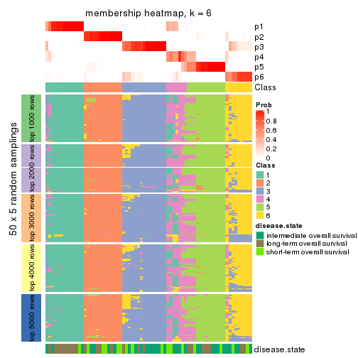</p>

</div>
</div>

As soon as we have had the classes for columns, we can look for signatures
which are significantly different between classes which can be candidate marks
for certain classes. Following are the heatmaps for signatures.


Signature heatmaps where rows are scaled:


<script>
$( function() {
	$( '#tabs-ATC-skmeans-get-signatures' ).tabs();
} );
</script>
<div id='tabs-ATC-skmeans-get-signatures'>
<ul>
<li><a href='#tab-ATC-skmeans-get-signatures-1'>k = 2</a></li>
<li><a href='#tab-ATC-skmeans-get-signatures-2'>k = 3</a></li>
<li><a href='#tab-ATC-skmeans-get-signatures-3'>k = 4</a></li>
<li><a href='#tab-ATC-skmeans-get-signatures-4'>k = 5</a></li>
<li><a href='#tab-ATC-skmeans-get-signatures-5'>k = 6</a></li>
</ul>
<div id='tab-ATC-skmeans-get-signatures-1'>
<pre><code class="r">get_signatures(res, k = 2)
</code></pre>

<p></p>

</div>
<div id='tab-ATC-skmeans-get-signatures-2'>
<pre><code class="r">get_signatures(res, k = 3)
</code></pre>

<p></p>

</div>
<div id='tab-ATC-skmeans-get-signatures-3'>
<pre><code class="r">get_signatures(res, k = 4)
</code></pre>

<p></p>

</div>
<div id='tab-ATC-skmeans-get-signatures-4'>
<pre><code class="r">get_signatures(res, k = 5)
</code></pre>

<p></p>

</div>
<div id='tab-ATC-skmeans-get-signatures-5'>
<pre><code class="r">get_signatures(res, k = 6)
</code></pre>

<p></p>

</div>
</div>


Signature heatmaps where rows are not scaled:


<script>
$( function() {
	$( '#tabs-ATC-skmeans-get-signatures-no-scale' ).tabs();
} );
</script>
<div id='tabs-ATC-skmeans-get-signatures-no-scale'>
<ul>
<li><a href='#tab-ATC-skmeans-get-signatures-no-scale-1'>k = 2</a></li>
<li><a href='#tab-ATC-skmeans-get-signatures-no-scale-2'>k = 3</a></li>
<li><a href='#tab-ATC-skmeans-get-signatures-no-scale-3'>k = 4</a></li>
<li><a href='#tab-ATC-skmeans-get-signatures-no-scale-4'>k = 5</a></li>
<li><a href='#tab-ATC-skmeans-get-signatures-no-scale-5'>k = 6</a></li>
</ul>
<div id='tab-ATC-skmeans-get-signatures-no-scale-1'>
<pre><code class="r">get_signatures(res, k = 2, scale_rows = FALSE)
</code></pre>

<p></p>

</div>
<div id='tab-ATC-skmeans-get-signatures-no-scale-2'>
<pre><code class="r">get_signatures(res, k = 3, scale_rows = FALSE)
</code></pre>

<p></p>

</div>
<div id='tab-ATC-skmeans-get-signatures-no-scale-3'>
<pre><code class="r">get_signatures(res, k = 4, scale_rows = FALSE)
</code></pre>

<p></p>

</div>
<div id='tab-ATC-skmeans-get-signatures-no-scale-4'>
<pre><code class="r">get_signatures(res, k = 5, scale_rows = FALSE)
</code></pre>

<p></p>

</div>
<div id='tab-ATC-skmeans-get-signatures-no-scale-5'>
<pre><code class="r">get_signatures(res, k = 6, scale_rows = FALSE)
</code></pre>

<p></p>

</div>
</div>


Compare the overlap of signatures from different k:

```r
compare_signatures(res)
```


`get_signature()` returns a data frame invisibly. TO get the list of signatures, the function
call should be assigned to a variable explicitly. In following code, if `plot` argument is set
to `FALSE`, no heatmap is plotted while only the differential analysis is performed.

```r
# code only for demonstration
tb = get_signature(res, k = ..., plot = FALSE)
```

An example of the output of `tb` is:

```
#>   which_row         fdr    mean_1    mean_2 scaled_mean_1 scaled_mean_2 km
#> 1        38 0.042760348  8.373488  9.131774    -0.5533452     0.5164555  1
#> 2        40 0.018707592  7.106213  8.469186    -0.6173731     0.5762149  1
#> 3        55 0.019134737 10.221463 11.207825    -0.6159697     0.5749050  1
#> 4        59 0.006059896  5.921854  7.869574    -0.6899429     0.6439467  1
#> 5        60 0.018055526  8.928898 10.211722    -0.6204761     0.5791110  1
#> 6        98 0.009384629 15.714769 14.887706     0.6635654    -0.6193277  2
...
```

The columns in `tb` are:

1. `which_row`: row indices corresponding to the input matrix.
2. `fdr`: FDR for the differential test. 
3. `mean_x`: The mean value in group x.
4. `scaled_mean_x`: The mean value in group x after rows are scaled.
5. `km`: Row groups if k-means clustering is applied to rows.


UMAP plot which shows how samples are separated.


<script>
$( function() {
	$( '#tabs-ATC-skmeans-dimension-reduction' ).tabs();
} );
</script>
<div id='tabs-ATC-skmeans-dimension-reduction'>
<ul>
<li><a href='#tab-ATC-skmeans-dimension-reduction-1'>k = 2</a></li>
<li><a href='#tab-ATC-skmeans-dimension-reduction-2'>k = 3</a></li>
<li><a href='#tab-ATC-skmeans-dimension-reduction-3'>k = 4</a></li>
<li><a href='#tab-ATC-skmeans-dimension-reduction-4'>k = 5</a></li>
<li><a href='#tab-ATC-skmeans-dimension-reduction-5'>k = 6</a></li>
</ul>
<div id='tab-ATC-skmeans-dimension-reduction-1'>
<pre><code class="r">dimension_reduction(res, k = 2, method = &quot;UMAP&quot;)
</code></pre>

<p>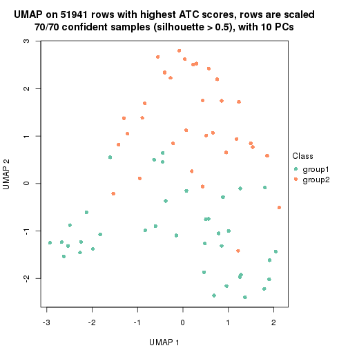</p>

</div>
<div id='tab-ATC-skmeans-dimension-reduction-2'>
<pre><code class="r">dimension_reduction(res, k = 3, method = &quot;UMAP&quot;)
</code></pre>

<p></p>

</div>
<div id='tab-ATC-skmeans-dimension-reduction-3'>
<pre><code class="r">dimension_reduction(res, k = 4, method = &quot;UMAP&quot;)
</code></pre>

<p></p>

</div>
<div id='tab-ATC-skmeans-dimension-reduction-4'>
<pre><code class="r">dimension_reduction(res, k = 5, method = &quot;UMAP&quot;)
</code></pre>

<p></p>

</div>
<div id='tab-ATC-skmeans-dimension-reduction-5'>
<pre><code class="r">dimension_reduction(res, k = 6, method = &quot;UMAP&quot;)
</code></pre>

<p></p>

</div>
</div>


Following heatmap shows how subgroups are split when increasing `k`:

```r
collect_classes(res)
```


Test correlation between subgroups and known annotations. If the known
annotation is numeric, one-way ANOVA test is applied, and if the known
annotation is discrete, chi-squared contingency table test is applied.

```r
test_to_known_factors(res)
```

```
#>              n disease.state(p) k
#> ATC:skmeans 70           0.3017 2
#> ATC:skmeans 70           0.4530 3
#> ATC:skmeans 70           0.4873 4
#> ATC:skmeans 67           0.5694 5
#> ATC:skmeans 57           0.0818 6
```


If matrix rows can be associated to genes, consider to use `GO_Enrichment(res,
...)` to perform function enrichment for the signature genes.


 

---------------------------------------------------


### ATC:pam*


The object with results only for a single top-value method and a single partition method 
can be extracted as:

```r
res = res_list["ATC", "pam"]
# you can also extract it by
# res = res_list["ATC:pam"]
```

A summary of `res` and all the functions that can be applied to it:

```r
res
```

```
#> A 'ConsensusPartition' object with k = 2, 3, 4, 5, 6.
#>   On a matrix with 51941 rows and 70 columns.
#>   Top rows (1000, 2000, 3000, 4000, 5000) are extracted by 'ATC' method.
#>   Subgroups are detected by 'pam' method.
#>   Performed in total 1250 partitions by row resampling.
#>   Best k for subgroups seems to be 6.
#> 
#> Following methods can be applied to this 'ConsensusPartition' object:
#>  [1] "cola_report"             "collect_classes"         "collect_plots"          
#>  [4] "collect_stats"           "colnames"                "compare_signatures"     
#>  [7] "consensus_heatmap"       "dimension_reduction"     "functional_enrichment"  
#> [10] "get_anno_col"            "get_anno"                "get_classes"            
#> [13] "get_consensus"           "get_matrix"              "get_membership"         
#> [16] "get_param"               "get_signatures"          "get_stats"              
#> [19] "is_best_k"               "is_stable_k"             "membership_heatmap"     
#> [22] "ncol"                    "nrow"                    "plot_ecdf"              
#> [25] "rownames"                "select_partition_number" "show"                   
#> [28] "suggest_best_k"          "test_to_known_factors"
```

`collect_plots()` function collects all the plots made from `res` for all `k` (number of partitions)
into one single page to provide an easy and fast comparison between different `k`.

```r
collect_plots(res)
```


The plots are:

- The first row: a plot of the ECDF (Empirical cumulative distribution
  function) curves of the consensus matrix for each `k` and the heatmap of
  predicted classes for each `k`.
- The second row: heatmaps of the consensus matrix for each `k`.
- The third row: heatmaps of the membership matrix for each `k`.
- The fouth row: heatmaps of the signatures for each `k`.

All the plots in panels can be made by individual functions and they are
plotted later in this section.

`select_partition_number()` produces several plots showing different
statistics for choosing "optimized" `k`. There are following statistics:

- ECDF curves of the consensus matrix for each `k`;
- 1-PAC. [The PAC
  score](https://en.wikipedia.org/wiki/Consensus_clustering#Over-interpretation_potential_of_consensus_clustering)
  measures the proportion of the ambiguous subgrouping.
- Mean silhouette score.
- Concordance. The mean probability of fiting the consensus class ids in all
  partitions.
- Area increased. Denote $A_k$ as the area under the ECDF curve for current
  `k`, the area increased is defined as $A_k - A_{k-1}$.
- Rand index. The percent of pairs of samples that are both in a same cluster
  or both are not in a same cluster in the partition of k and k-1.
- Jaccard index. The ratio of pairs of samples are both in a same cluster in
  the partition of k and k-1 and the pairs of samples are both in a same
  cluster in the partition k or k-1.

The detailed explanations of these statistics can be found in [the cola
vignette](http://bioconductor.org/packages/devel/bioc/vignettes/cola/inst/doc/cola.html#toc_13).

Generally speaking, lower PAC score, higher mean silhouette score or higher
concordance corresponds to better partition. Rand index and Jaccard index
measure how similar the current partition is compared to partition with `k-1`.
If they are too similar, we won't accept `k` is better than `k-1`.

```r
select_partition_number(res)
```


The numeric values for all these statistics can be obtained by `get_stats()`.

```r
get_stats(res)
```

```
#>   k 1-PAC mean_silhouette concordance area_increased  Rand Jaccard
#> 2 2 0.462           0.854       0.862         0.4568 0.503   0.503
#> 3 3 0.855           0.825       0.932         0.4292 0.728   0.510
#> 4 4 0.726           0.773       0.880         0.1436 0.828   0.542
#> 5 5 0.905           0.851       0.936         0.0809 0.886   0.582
#> 6 6 0.900           0.791       0.920         0.0420 0.937   0.695
```

`suggest_best_k()` suggests the best $k$ based on these statistics. The rules are as follows:

- All $k$ with Jaccard index larger than 0.95 are removed because the increase of
  the partition number does not provides enough extra information. If all $k$ are removed,
  the best $k$ is assigned by `NA`.
- For $k$ with 1-PAC larger than 0.9, the maximal $k$ is taken as the "best k". Other $k$ is called "optional k".
- If it does not fit the second rule. The $k$ with the highest vote of highest
  1-PAC, mean silhouette and concordance is taken as the "best k".

```r
suggest_best_k(res)
```

```
#> [1] 6
#> attr(,"optional")
#> [1] 5
```

There is also optional best $k$ = 5 that is worth to check.

Following shows the table of the partitions (You need to click the **show/hide
code output** link to see it). The membership matrix (columns with name `p*`)
is inferred by
[`clue::cl_consensus()`](https://www.rdocumentation.org/link/cl_consensus?package=clue)
function with the `SE` method. Basically the value in the membership matrix
represents the probability to belong to a certain group. The finall class
label for an item is determined with the group with highest probability it
belongs to.

In `get_classes()` function, the entropy is calculated from the membership
matrix and the silhouette score is calculated from the consensus matrix.


<script>
$( function() {
	$( '#tabs-ATC-pam-get-classes' ).tabs();
} );
</script>
<div id='tabs-ATC-pam-get-classes'>
<ul>
<li><a href='#tab-ATC-pam-get-classes-1'>k = 2</a></li>
<li><a href='#tab-ATC-pam-get-classes-2'>k = 3</a></li>
<li><a href='#tab-ATC-pam-get-classes-3'>k = 4</a></li>
<li><a href='#tab-ATC-pam-get-classes-4'>k = 5</a></li>
<li><a href='#tab-ATC-pam-get-classes-5'>k = 6</a></li>
</ul>

<div id='tab-ATC-pam-get-classes-1'>
<p><a id='tab-ATC-pam-get-classes-1-a' style='color:#0366d6' href='#'>show/hide code output</a></p>
<pre><code class="r">cbind(get_classes(res, k = 2), get_membership(res, k = 2))
</code></pre>

<pre><code>#&gt;            class entropy silhouette    p1    p2
#&gt; GSM1299517     1  0.8555      0.864 0.720 0.280
#&gt; GSM1299518     1  0.8555      0.864 0.720 0.280
#&gt; GSM1299519     2  0.0672      0.949 0.008 0.992
#&gt; GSM1299520     2  0.0000      0.957 0.000 1.000
#&gt; GSM1299521     2  0.8016      0.685 0.244 0.756
#&gt; GSM1299522     2  0.0000      0.957 0.000 1.000
#&gt; GSM1299523     2  0.4690      0.853 0.100 0.900
#&gt; GSM1299524     1  0.8555      0.864 0.720 0.280
#&gt; GSM1299525     2  0.0000      0.957 0.000 1.000
#&gt; GSM1299526     1  0.8555      0.864 0.720 0.280
#&gt; GSM1299527     1  0.8555      0.864 0.720 0.280
#&gt; GSM1299528     2  0.0000      0.957 0.000 1.000
#&gt; GSM1299529     2  0.0000      0.957 0.000 1.000
#&gt; GSM1299530     2  0.8955      0.625 0.312 0.688
#&gt; GSM1299531     2  0.0000      0.957 0.000 1.000
#&gt; GSM1299575     1  0.0000      0.745 1.000 0.000
#&gt; GSM1299532     1  0.8555      0.864 0.720 0.280
#&gt; GSM1299533     1  0.8555      0.864 0.720 0.280
#&gt; GSM1299534     2  0.0000      0.957 0.000 1.000
#&gt; GSM1299535     1  0.8555      0.864 0.720 0.280
#&gt; GSM1299536     2  0.0000      0.957 0.000 1.000
#&gt; GSM1299537     1  0.8555      0.864 0.720 0.280
#&gt; GSM1299538     2  0.0000      0.957 0.000 1.000
#&gt; GSM1299539     2  0.0000      0.957 0.000 1.000
#&gt; GSM1299540     1  0.8555      0.864 0.720 0.280
#&gt; GSM1299541     1  0.8555      0.864 0.720 0.280
#&gt; GSM1299542     1  0.8555      0.864 0.720 0.280
#&gt; GSM1299543     2  0.0000      0.957 0.000 1.000
#&gt; GSM1299544     2  0.0000      0.957 0.000 1.000
#&gt; GSM1299545     1  0.8555      0.864 0.720 0.280
#&gt; GSM1299546     2  0.0000      0.957 0.000 1.000
#&gt; GSM1299547     2  0.0000      0.957 0.000 1.000
#&gt; GSM1299548     1  0.8555      0.864 0.720 0.280
#&gt; GSM1299549     1  0.8555      0.864 0.720 0.280
#&gt; GSM1299550     2  0.0000      0.957 0.000 1.000
#&gt; GSM1299551     2  0.0000      0.957 0.000 1.000
#&gt; GSM1299552     1  0.4562      0.790 0.904 0.096
#&gt; GSM1299553     1  0.9954      0.565 0.540 0.460
#&gt; GSM1299554     1  0.8555      0.864 0.720 0.280
#&gt; GSM1299555     1  0.8555      0.864 0.720 0.280
#&gt; GSM1299556     1  0.8081      0.853 0.752 0.248
#&gt; GSM1299557     1  0.8555      0.864 0.720 0.280
#&gt; GSM1299558     2  0.0000      0.957 0.000 1.000
#&gt; GSM1299559     1  0.8016      0.851 0.756 0.244
#&gt; GSM1299560     1  0.8555      0.864 0.720 0.280
#&gt; GSM1299576     1  0.0000      0.745 1.000 0.000
#&gt; GSM1299577     1  0.3114      0.772 0.944 0.056
#&gt; GSM1299561     1  0.8555      0.864 0.720 0.280
#&gt; GSM1299562     2  0.3274      0.885 0.060 0.940
#&gt; GSM1299563     2  0.0000      0.957 0.000 1.000
#&gt; GSM1299564     2  0.0000      0.957 0.000 1.000
#&gt; GSM1299565     2  0.0000      0.957 0.000 1.000
#&gt; GSM1299566     2  0.0000      0.957 0.000 1.000
#&gt; GSM1299567     1  0.6623      0.827 0.828 0.172
#&gt; GSM1299568     2  0.0000      0.957 0.000 1.000
#&gt; GSM1299569     2  0.0000      0.957 0.000 1.000
#&gt; GSM1299570     1  0.5059      0.798 0.888 0.112
#&gt; GSM1299571     1  0.8555      0.864 0.720 0.280
#&gt; GSM1299572     1  0.8555      0.864 0.720 0.280
#&gt; GSM1299573     1  0.8555      0.864 0.720 0.280
#&gt; GSM1299574     2  0.2948      0.896 0.052 0.948
#&gt; GSM1299578     1  0.9491      0.119 0.632 0.368
#&gt; GSM1299579     2  0.6973      0.753 0.188 0.812
#&gt; GSM1299580     1  0.0000      0.745 1.000 0.000
#&gt; GSM1299581     1  0.0000      0.745 1.000 0.000
#&gt; GSM1299582     1  0.0000      0.745 1.000 0.000
#&gt; GSM1299583     1  0.0000      0.745 1.000 0.000
#&gt; GSM1299584     1  0.0000      0.745 1.000 0.000
#&gt; GSM1299585     1  0.0000      0.745 1.000 0.000
#&gt; GSM1299586     1  0.0000      0.745 1.000 0.000
</code></pre>

<script>
$('#tab-ATC-pam-get-classes-1-a').parent().next().next().hide();
$('#tab-ATC-pam-get-classes-1-a').click(function(){
  $('#tab-ATC-pam-get-classes-1-a').parent().next().next().toggle();
  return(false);
});
</script>
</div>

<div id='tab-ATC-pam-get-classes-2'>
<p><a id='tab-ATC-pam-get-classes-2-a' style='color:#0366d6' href='#'>show/hide code output</a></p>
<pre><code class="r">cbind(get_classes(res, k = 3), get_membership(res, k = 3))
</code></pre>

<pre><code>#&gt;            class entropy silhouette    p1    p2    p3
#&gt; GSM1299517     3  0.0000      0.930 0.000 0.000 1.000
#&gt; GSM1299518     3  0.0000      0.930 0.000 0.000 1.000
#&gt; GSM1299519     3  0.6274      0.118 0.000 0.456 0.544
#&gt; GSM1299520     2  0.0000      0.926 0.000 1.000 0.000
#&gt; GSM1299521     1  0.1753      0.862 0.952 0.048 0.000
#&gt; GSM1299522     2  0.2625      0.863 0.000 0.916 0.084
#&gt; GSM1299523     2  0.1289      0.901 0.032 0.968 0.000
#&gt; GSM1299524     3  0.0000      0.930 0.000 0.000 1.000
#&gt; GSM1299525     2  0.0000      0.926 0.000 1.000 0.000
#&gt; GSM1299526     3  0.0000      0.930 0.000 0.000 1.000
#&gt; GSM1299527     3  0.0000      0.930 0.000 0.000 1.000
#&gt; GSM1299528     2  0.0000      0.926 0.000 1.000 0.000
#&gt; GSM1299529     2  0.0237      0.925 0.000 0.996 0.004
#&gt; GSM1299530     1  0.4605      0.705 0.796 0.204 0.000
#&gt; GSM1299531     2  0.0747      0.917 0.000 0.984 0.016
#&gt; GSM1299575     1  0.0000      0.888 1.000 0.000 0.000
#&gt; GSM1299532     3  0.0000      0.930 0.000 0.000 1.000
#&gt; GSM1299533     3  0.0000      0.930 0.000 0.000 1.000
#&gt; GSM1299534     2  0.0237      0.925 0.000 0.996 0.004
#&gt; GSM1299535     3  0.0000      0.930 0.000 0.000 1.000
#&gt; GSM1299536     2  0.0000      0.926 0.000 1.000 0.000
#&gt; GSM1299537     3  0.0000      0.930 0.000 0.000 1.000
#&gt; GSM1299538     2  0.0000      0.926 0.000 1.000 0.000
#&gt; GSM1299539     2  0.0000      0.926 0.000 1.000 0.000
#&gt; GSM1299540     3  0.0000      0.930 0.000 0.000 1.000
#&gt; GSM1299541     3  0.0000      0.930 0.000 0.000 1.000
#&gt; GSM1299542     3  0.0000      0.930 0.000 0.000 1.000
#&gt; GSM1299543     2  0.0000      0.926 0.000 1.000 0.000
#&gt; GSM1299544     2  0.0000      0.926 0.000 1.000 0.000
#&gt; GSM1299545     3  0.0892      0.910 0.020 0.000 0.980
#&gt; GSM1299546     2  0.6295      0.090 0.000 0.528 0.472
#&gt; GSM1299547     2  0.0000      0.926 0.000 1.000 0.000
#&gt; GSM1299548     3  0.0000      0.930 0.000 0.000 1.000
#&gt; GSM1299549     1  0.6260      0.326 0.552 0.000 0.448
#&gt; GSM1299550     2  0.0000      0.926 0.000 1.000 0.000
#&gt; GSM1299551     2  0.2165      0.879 0.000 0.936 0.064
#&gt; GSM1299552     1  0.3752      0.795 0.856 0.000 0.144
#&gt; GSM1299553     1  0.9431      0.406 0.496 0.212 0.292
#&gt; GSM1299554     2  0.5835      0.465 0.000 0.660 0.340
#&gt; GSM1299555     3  0.0000      0.930 0.000 0.000 1.000
#&gt; GSM1299556     3  0.0000      0.930 0.000 0.000 1.000
#&gt; GSM1299557     3  0.0000      0.930 0.000 0.000 1.000
#&gt; GSM1299558     2  0.0000      0.926 0.000 1.000 0.000
#&gt; GSM1299559     3  0.0000      0.930 0.000 0.000 1.000
#&gt; GSM1299560     3  0.0000      0.930 0.000 0.000 1.000
#&gt; GSM1299576     1  0.0000      0.888 1.000 0.000 0.000
#&gt; GSM1299577     1  0.1860      0.863 0.948 0.000 0.052
#&gt; GSM1299561     3  0.0000      0.930 0.000 0.000 1.000
#&gt; GSM1299562     3  0.6260      0.145 0.000 0.448 0.552
#&gt; GSM1299563     2  0.0000      0.926 0.000 1.000 0.000
#&gt; GSM1299564     2  0.0000      0.926 0.000 1.000 0.000
#&gt; GSM1299565     2  0.6260      0.165 0.000 0.552 0.448
#&gt; GSM1299566     2  0.0000      0.926 0.000 1.000 0.000
#&gt; GSM1299567     3  0.1753      0.880 0.048 0.000 0.952
#&gt; GSM1299568     2  0.2165      0.879 0.000 0.936 0.064
#&gt; GSM1299569     2  0.0000      0.926 0.000 1.000 0.000
#&gt; GSM1299570     1  0.6140      0.427 0.596 0.000 0.404
#&gt; GSM1299571     3  0.0000      0.930 0.000 0.000 1.000
#&gt; GSM1299572     3  0.0000      0.930 0.000 0.000 1.000
#&gt; GSM1299573     3  0.0000      0.930 0.000 0.000 1.000
#&gt; GSM1299574     3  0.6260      0.145 0.000 0.448 0.552
#&gt; GSM1299578     1  0.0000      0.888 1.000 0.000 0.000
#&gt; GSM1299579     2  0.0000      0.926 0.000 1.000 0.000
#&gt; GSM1299580     1  0.0000      0.888 1.000 0.000 0.000
#&gt; GSM1299581     1  0.0000      0.888 1.000 0.000 0.000
#&gt; GSM1299582     1  0.0000      0.888 1.000 0.000 0.000
#&gt; GSM1299583     1  0.0000      0.888 1.000 0.000 0.000
#&gt; GSM1299584     1  0.0000      0.888 1.000 0.000 0.000
#&gt; GSM1299585     1  0.0000      0.888 1.000 0.000 0.000
#&gt; GSM1299586     1  0.0000      0.888 1.000 0.000 0.000
</code></pre>

<script>
$('#tab-ATC-pam-get-classes-2-a').parent().next().next().hide();
$('#tab-ATC-pam-get-classes-2-a').click(function(){
  $('#tab-ATC-pam-get-classes-2-a').parent().next().next().toggle();
  return(false);
});
</script>
</div>

<div id='tab-ATC-pam-get-classes-3'>
<p><a id='tab-ATC-pam-get-classes-3-a' style='color:#0366d6' href='#'>show/hide code output</a></p>
<pre><code class="r">cbind(get_classes(res, k = 4), get_membership(res, k = 4))
</code></pre>

<pre><code>#&gt;            class entropy silhouette    p1    p2    p3    p4
#&gt; GSM1299517     3  0.0000      0.880 0.000 0.000 1.000 0.000
#&gt; GSM1299518     3  0.4907      0.422 0.000 0.420 0.580 0.000
#&gt; GSM1299519     2  0.3074      0.741 0.000 0.848 0.000 0.152
#&gt; GSM1299520     4  0.0000      0.996 0.000 0.000 0.000 1.000
#&gt; GSM1299521     1  0.2773      0.831 0.900 0.028 0.000 0.072
#&gt; GSM1299522     2  0.3486      0.733 0.000 0.812 0.000 0.188
#&gt; GSM1299523     4  0.1022      0.953 0.000 0.032 0.000 0.968
#&gt; GSM1299524     3  0.3801      0.757 0.000 0.220 0.780 0.000
#&gt; GSM1299525     2  0.4431      0.628 0.000 0.696 0.000 0.304
#&gt; GSM1299526     3  0.0000      0.880 0.000 0.000 1.000 0.000
#&gt; GSM1299527     3  0.0000      0.880 0.000 0.000 1.000 0.000
#&gt; GSM1299528     4  0.0000      0.996 0.000 0.000 0.000 1.000
#&gt; GSM1299529     2  0.3764      0.717 0.000 0.784 0.000 0.216
#&gt; GSM1299530     1  0.2845      0.829 0.896 0.028 0.000 0.076
#&gt; GSM1299531     2  0.3764      0.717 0.000 0.784 0.000 0.216
#&gt; GSM1299575     1  0.0000      0.872 1.000 0.000 0.000 0.000
#&gt; GSM1299532     2  0.4624      0.277 0.000 0.660 0.340 0.000
#&gt; GSM1299533     2  0.4661      0.256 0.000 0.652 0.348 0.000
#&gt; GSM1299534     2  0.4967      0.388 0.000 0.548 0.000 0.452
#&gt; GSM1299535     2  0.4134      0.439 0.000 0.740 0.260 0.000
#&gt; GSM1299536     4  0.0000      0.996 0.000 0.000 0.000 1.000
#&gt; GSM1299537     3  0.0000      0.880 0.000 0.000 1.000 0.000
#&gt; GSM1299538     4  0.0000      0.996 0.000 0.000 0.000 1.000
#&gt; GSM1299539     4  0.0000      0.996 0.000 0.000 0.000 1.000
#&gt; GSM1299540     3  0.0000      0.880 0.000 0.000 1.000 0.000
#&gt; GSM1299541     3  0.0000      0.880 0.000 0.000 1.000 0.000
#&gt; GSM1299542     3  0.0000      0.880 0.000 0.000 1.000 0.000
#&gt; GSM1299543     2  0.4406      0.633 0.000 0.700 0.000 0.300
#&gt; GSM1299544     4  0.0000      0.996 0.000 0.000 0.000 1.000
#&gt; GSM1299545     3  0.7433      0.352 0.276 0.216 0.508 0.000
#&gt; GSM1299546     2  0.3356      0.738 0.000 0.824 0.000 0.176
#&gt; GSM1299547     4  0.0188      0.991 0.000 0.004 0.000 0.996
#&gt; GSM1299548     3  0.0000      0.880 0.000 0.000 1.000 0.000
#&gt; GSM1299549     1  0.7536      0.339 0.484 0.296 0.220 0.000
#&gt; GSM1299550     4  0.0000      0.996 0.000 0.000 0.000 1.000
#&gt; GSM1299551     2  0.3356      0.738 0.000 0.824 0.000 0.176
#&gt; GSM1299552     1  0.5200      0.704 0.744 0.184 0.072 0.000
#&gt; GSM1299553     1  0.7934      0.362 0.496 0.268 0.220 0.016
#&gt; GSM1299554     2  0.5327      0.469 0.000 0.720 0.220 0.060
#&gt; GSM1299555     3  0.4564      0.616 0.000 0.328 0.672 0.000
#&gt; GSM1299556     3  0.0000      0.880 0.000 0.000 1.000 0.000
#&gt; GSM1299557     3  0.3610      0.773 0.000 0.200 0.800 0.000
#&gt; GSM1299558     2  0.4040      0.690 0.000 0.752 0.000 0.248
#&gt; GSM1299559     3  0.0000      0.880 0.000 0.000 1.000 0.000
#&gt; GSM1299560     3  0.2589      0.826 0.000 0.116 0.884 0.000
#&gt; GSM1299576     1  0.0000      0.872 1.000 0.000 0.000 0.000
#&gt; GSM1299577     1  0.2892      0.821 0.896 0.036 0.068 0.000
#&gt; GSM1299561     3  0.0000      0.880 0.000 0.000 1.000 0.000
#&gt; GSM1299562     2  0.0188      0.715 0.000 0.996 0.000 0.004
#&gt; GSM1299563     4  0.0000      0.996 0.000 0.000 0.000 1.000
#&gt; GSM1299564     4  0.0000      0.996 0.000 0.000 0.000 1.000
#&gt; GSM1299565     2  0.3764      0.717 0.000 0.784 0.000 0.216
#&gt; GSM1299566     4  0.0000      0.996 0.000 0.000 0.000 1.000
#&gt; GSM1299567     3  0.0000      0.880 0.000 0.000 1.000 0.000
#&gt; GSM1299568     2  0.1022      0.731 0.000 0.968 0.000 0.032
#&gt; GSM1299569     4  0.0000      0.996 0.000 0.000 0.000 1.000
#&gt; GSM1299570     1  0.7065      0.452 0.572 0.212 0.216 0.000
#&gt; GSM1299571     2  0.1118      0.697 0.000 0.964 0.036 0.000
#&gt; GSM1299572     2  0.4543      0.311 0.000 0.676 0.324 0.000
#&gt; GSM1299573     3  0.3726      0.763 0.000 0.212 0.788 0.000
#&gt; GSM1299574     2  0.0469      0.721 0.000 0.988 0.000 0.012
#&gt; GSM1299578     1  0.0000      0.872 1.000 0.000 0.000 0.000
#&gt; GSM1299579     4  0.0000      0.996 0.000 0.000 0.000 1.000
#&gt; GSM1299580     1  0.0000      0.872 1.000 0.000 0.000 0.000
#&gt; GSM1299581     1  0.0000      0.872 1.000 0.000 0.000 0.000
#&gt; GSM1299582     1  0.0000      0.872 1.000 0.000 0.000 0.000
#&gt; GSM1299583     1  0.0000      0.872 1.000 0.000 0.000 0.000
#&gt; GSM1299584     1  0.0000      0.872 1.000 0.000 0.000 0.000
#&gt; GSM1299585     1  0.0188      0.871 0.996 0.004 0.000 0.000
#&gt; GSM1299586     1  0.0000      0.872 1.000 0.000 0.000 0.000
</code></pre>

<script>
$('#tab-ATC-pam-get-classes-3-a').parent().next().next().hide();
$('#tab-ATC-pam-get-classes-3-a').click(function(){
  $('#tab-ATC-pam-get-classes-3-a').parent().next().next().toggle();
  return(false);
});
</script>
</div>

<div id='tab-ATC-pam-get-classes-4'>
<p><a id='tab-ATC-pam-get-classes-4-a' style='color:#0366d6' href='#'>show/hide code output</a></p>
<pre><code class="r">cbind(get_classes(res, k = 5), get_membership(res, k = 5))
</code></pre>

<pre><code>#&gt;            class entropy silhouette    p1    p2    p3    p4    p5
#&gt; GSM1299517     3  0.0000     0.9706 0.000 0.000 1.000 0.000 0.000
#&gt; GSM1299518     4  0.0880     0.9170 0.000 0.000 0.032 0.968 0.000
#&gt; GSM1299519     2  0.0000     0.8903 0.000 1.000 0.000 0.000 0.000
#&gt; GSM1299520     5  0.0000     0.9614 0.000 0.000 0.000 0.000 1.000
#&gt; GSM1299521     1  0.3409     0.7901 0.816 0.000 0.000 0.160 0.024
#&gt; GSM1299522     2  0.0000     0.8903 0.000 1.000 0.000 0.000 0.000
#&gt; GSM1299523     5  0.1341     0.9207 0.000 0.000 0.000 0.056 0.944
#&gt; GSM1299524     4  0.0880     0.9170 0.000 0.000 0.032 0.968 0.000
#&gt; GSM1299525     2  0.0000     0.8903 0.000 1.000 0.000 0.000 0.000
#&gt; GSM1299526     3  0.0000     0.9706 0.000 0.000 1.000 0.000 0.000
#&gt; GSM1299527     3  0.0000     0.9706 0.000 0.000 1.000 0.000 0.000
#&gt; GSM1299528     5  0.0000     0.9614 0.000 0.000 0.000 0.000 1.000
#&gt; GSM1299529     2  0.0000     0.8903 0.000 1.000 0.000 0.000 0.000
#&gt; GSM1299530     1  0.4473     0.5994 0.656 0.000 0.000 0.324 0.020
#&gt; GSM1299531     2  0.0000     0.8903 0.000 1.000 0.000 0.000 0.000
#&gt; GSM1299575     1  0.0000     0.9003 1.000 0.000 0.000 0.000 0.000
#&gt; GSM1299532     4  0.0880     0.9170 0.000 0.000 0.032 0.968 0.000
#&gt; GSM1299533     4  0.0880     0.9170 0.000 0.000 0.032 0.968 0.000
#&gt; GSM1299534     2  0.6361     0.2739 0.000 0.484 0.000 0.176 0.340
#&gt; GSM1299535     4  0.0992     0.9071 0.000 0.024 0.008 0.968 0.000
#&gt; GSM1299536     5  0.0000     0.9614 0.000 0.000 0.000 0.000 1.000
#&gt; GSM1299537     3  0.0000     0.9706 0.000 0.000 1.000 0.000 0.000
#&gt; GSM1299538     5  0.0000     0.9614 0.000 0.000 0.000 0.000 1.000
#&gt; GSM1299539     5  0.0000     0.9614 0.000 0.000 0.000 0.000 1.000
#&gt; GSM1299540     3  0.0000     0.9706 0.000 0.000 1.000 0.000 0.000
#&gt; GSM1299541     3  0.0000     0.9706 0.000 0.000 1.000 0.000 0.000
#&gt; GSM1299542     3  0.0000     0.9706 0.000 0.000 1.000 0.000 0.000
#&gt; GSM1299543     2  0.0000     0.8903 0.000 1.000 0.000 0.000 0.000
#&gt; GSM1299544     5  0.0000     0.9614 0.000 0.000 0.000 0.000 1.000
#&gt; GSM1299545     4  0.0000     0.9106 0.000 0.000 0.000 1.000 0.000
#&gt; GSM1299546     2  0.0000     0.8903 0.000 1.000 0.000 0.000 0.000
#&gt; GSM1299547     5  0.4392     0.4055 0.000 0.008 0.000 0.380 0.612
#&gt; GSM1299548     3  0.0000     0.9706 0.000 0.000 1.000 0.000 0.000
#&gt; GSM1299549     4  0.0963     0.8847 0.036 0.000 0.000 0.964 0.000
#&gt; GSM1299550     5  0.0000     0.9614 0.000 0.000 0.000 0.000 1.000
#&gt; GSM1299551     2  0.0000     0.8903 0.000 1.000 0.000 0.000 0.000
#&gt; GSM1299552     1  0.4030     0.5463 0.648 0.000 0.000 0.352 0.000
#&gt; GSM1299553     4  0.0000     0.9106 0.000 0.000 0.000 1.000 0.000
#&gt; GSM1299554     4  0.0000     0.9106 0.000 0.000 0.000 1.000 0.000
#&gt; GSM1299555     4  0.0880     0.9170 0.000 0.000 0.032 0.968 0.000
#&gt; GSM1299556     3  0.0000     0.9706 0.000 0.000 1.000 0.000 0.000
#&gt; GSM1299557     4  0.3305     0.6970 0.000 0.000 0.224 0.776 0.000
#&gt; GSM1299558     2  0.0000     0.8903 0.000 1.000 0.000 0.000 0.000
#&gt; GSM1299559     3  0.0000     0.9706 0.000 0.000 1.000 0.000 0.000
#&gt; GSM1299560     3  0.3796     0.5361 0.000 0.000 0.700 0.300 0.000
#&gt; GSM1299576     1  0.0000     0.9003 1.000 0.000 0.000 0.000 0.000
#&gt; GSM1299577     1  0.4088     0.5389 0.632 0.000 0.000 0.368 0.000
#&gt; GSM1299561     3  0.0510     0.9572 0.000 0.000 0.984 0.016 0.000
#&gt; GSM1299562     2  0.4101     0.3987 0.000 0.628 0.000 0.372 0.000
#&gt; GSM1299563     5  0.0000     0.9614 0.000 0.000 0.000 0.000 1.000
#&gt; GSM1299564     5  0.0992     0.9413 0.000 0.008 0.000 0.024 0.968
#&gt; GSM1299565     2  0.0000     0.8903 0.000 1.000 0.000 0.000 0.000
#&gt; GSM1299566     5  0.0000     0.9614 0.000 0.000 0.000 0.000 1.000
#&gt; GSM1299567     3  0.0162     0.9669 0.004 0.000 0.996 0.000 0.000
#&gt; GSM1299568     4  0.4060     0.3285 0.000 0.360 0.000 0.640 0.000
#&gt; GSM1299569     5  0.0000     0.9614 0.000 0.000 0.000 0.000 1.000
#&gt; GSM1299570     4  0.3039     0.6699 0.192 0.000 0.000 0.808 0.000
#&gt; GSM1299571     2  0.4562    -0.0172 0.000 0.496 0.008 0.496 0.000
#&gt; GSM1299572     4  0.0162     0.9121 0.000 0.000 0.004 0.996 0.000
#&gt; GSM1299573     4  0.0880     0.9170 0.000 0.000 0.032 0.968 0.000
#&gt; GSM1299574     2  0.0000     0.8903 0.000 1.000 0.000 0.000 0.000
#&gt; GSM1299578     1  0.0404     0.8972 0.988 0.000 0.000 0.012 0.000
#&gt; GSM1299579     5  0.0000     0.9614 0.000 0.000 0.000 0.000 1.000
#&gt; GSM1299580     1  0.0000     0.9003 1.000 0.000 0.000 0.000 0.000
#&gt; GSM1299581     1  0.0000     0.9003 1.000 0.000 0.000 0.000 0.000
#&gt; GSM1299582     1  0.0000     0.9003 1.000 0.000 0.000 0.000 0.000
#&gt; GSM1299583     1  0.0000     0.9003 1.000 0.000 0.000 0.000 0.000
#&gt; GSM1299584     1  0.0000     0.9003 1.000 0.000 0.000 0.000 0.000
#&gt; GSM1299585     1  0.0703     0.8922 0.976 0.000 0.000 0.024 0.000
#&gt; GSM1299586     1  0.0000     0.9003 1.000 0.000 0.000 0.000 0.000
</code></pre>

<script>
$('#tab-ATC-pam-get-classes-4-a').parent().next().next().hide();
$('#tab-ATC-pam-get-classes-4-a').click(function(){
  $('#tab-ATC-pam-get-classes-4-a').parent().next().next().toggle();
  return(false);
});
</script>
</div>

<div id='tab-ATC-pam-get-classes-5'>
<p><a id='tab-ATC-pam-get-classes-5-a' style='color:#0366d6' href='#'>show/hide code output</a></p>
<pre><code class="r">cbind(get_classes(res, k = 6), get_membership(res, k = 6))
</code></pre>

<pre><code>#&gt;            class entropy silhouette    p1    p2    p3    p4    p5    p6
#&gt; GSM1299517     3  0.0000     0.9637 0.000 0.000 1.000 0.000 0.000 0.000
#&gt; GSM1299518     6  0.0000     0.8686 0.000 0.000 0.000 0.000 0.000 1.000
#&gt; GSM1299519     2  0.0000     0.9001 0.000 1.000 0.000 0.000 0.000 0.000
#&gt; GSM1299520     5  0.2219     0.8367 0.000 0.000 0.000 0.136 0.864 0.000
#&gt; GSM1299521     4  0.0937     0.7851 0.040 0.000 0.000 0.960 0.000 0.000
#&gt; GSM1299522     2  0.0000     0.9001 0.000 1.000 0.000 0.000 0.000 0.000
#&gt; GSM1299523     4  0.0000     0.8006 0.000 0.000 0.000 1.000 0.000 0.000
#&gt; GSM1299524     6  0.0000     0.8686 0.000 0.000 0.000 0.000 0.000 1.000
#&gt; GSM1299525     2  0.0000     0.9001 0.000 1.000 0.000 0.000 0.000 0.000
#&gt; GSM1299526     3  0.0000     0.9637 0.000 0.000 1.000 0.000 0.000 0.000
#&gt; GSM1299527     3  0.0000     0.9637 0.000 0.000 1.000 0.000 0.000 0.000
#&gt; GSM1299528     5  0.0000     0.9296 0.000 0.000 0.000 0.000 1.000 0.000
#&gt; GSM1299529     2  0.0000     0.9001 0.000 1.000 0.000 0.000 0.000 0.000
#&gt; GSM1299530     4  0.0000     0.8006 0.000 0.000 0.000 1.000 0.000 0.000
#&gt; GSM1299531     2  0.0000     0.9001 0.000 1.000 0.000 0.000 0.000 0.000
#&gt; GSM1299575     1  0.0000     0.9181 1.000 0.000 0.000 0.000 0.000 0.000
#&gt; GSM1299532     6  0.0000     0.8686 0.000 0.000 0.000 0.000 0.000 1.000
#&gt; GSM1299533     6  0.0000     0.8686 0.000 0.000 0.000 0.000 0.000 1.000
#&gt; GSM1299534     2  0.6350     0.0733 0.000 0.392 0.000 0.332 0.012 0.264
#&gt; GSM1299535     6  0.0000     0.8686 0.000 0.000 0.000 0.000 0.000 1.000
#&gt; GSM1299536     5  0.1387     0.8942 0.000 0.000 0.000 0.068 0.932 0.000
#&gt; GSM1299537     3  0.0000     0.9637 0.000 0.000 1.000 0.000 0.000 0.000
#&gt; GSM1299538     5  0.0790     0.9190 0.000 0.000 0.000 0.032 0.968 0.000
#&gt; GSM1299539     5  0.0000     0.9296 0.000 0.000 0.000 0.000 1.000 0.000
#&gt; GSM1299540     3  0.0000     0.9637 0.000 0.000 1.000 0.000 0.000 0.000
#&gt; GSM1299541     3  0.0000     0.9637 0.000 0.000 1.000 0.000 0.000 0.000
#&gt; GSM1299542     3  0.0000     0.9637 0.000 0.000 1.000 0.000 0.000 0.000
#&gt; GSM1299543     2  0.1814     0.8195 0.000 0.900 0.000 0.000 0.100 0.000
#&gt; GSM1299544     5  0.0000     0.9296 0.000 0.000 0.000 0.000 1.000 0.000
#&gt; GSM1299545     6  0.3872     0.2549 0.000 0.000 0.004 0.392 0.000 0.604
#&gt; GSM1299546     2  0.0000     0.9001 0.000 1.000 0.000 0.000 0.000 0.000
#&gt; GSM1299547     4  0.0363     0.7963 0.000 0.000 0.000 0.988 0.012 0.000
#&gt; GSM1299548     3  0.0000     0.9637 0.000 0.000 1.000 0.000 0.000 0.000
#&gt; GSM1299549     6  0.3869    -0.0964 0.000 0.000 0.000 0.500 0.000 0.500
#&gt; GSM1299550     5  0.0000     0.9296 0.000 0.000 0.000 0.000 1.000 0.000
#&gt; GSM1299551     2  0.0000     0.9001 0.000 1.000 0.000 0.000 0.000 0.000
#&gt; GSM1299552     4  0.1049     0.7898 0.032 0.000 0.000 0.960 0.000 0.008
#&gt; GSM1299553     4  0.0260     0.8005 0.000 0.000 0.000 0.992 0.000 0.008
#&gt; GSM1299554     6  0.0000     0.8686 0.000 0.000 0.000 0.000 0.000 1.000
#&gt; GSM1299555     6  0.0000     0.8686 0.000 0.000 0.000 0.000 0.000 1.000
#&gt; GSM1299556     3  0.0000     0.9637 0.000 0.000 1.000 0.000 0.000 0.000
#&gt; GSM1299557     6  0.0713     0.8469 0.000 0.000 0.028 0.000 0.000 0.972
#&gt; GSM1299558     2  0.0000     0.9001 0.000 1.000 0.000 0.000 0.000 0.000
#&gt; GSM1299559     3  0.0000     0.9637 0.000 0.000 1.000 0.000 0.000 0.000
#&gt; GSM1299560     3  0.3659     0.4186 0.000 0.000 0.636 0.000 0.000 0.364
#&gt; GSM1299576     1  0.0000     0.9181 1.000 0.000 0.000 0.000 0.000 0.000
#&gt; GSM1299577     4  0.5486     0.4315 0.188 0.000 0.000 0.564 0.000 0.248
#&gt; GSM1299561     3  0.0458     0.9492 0.000 0.000 0.984 0.000 0.000 0.016
#&gt; GSM1299562     2  0.3843     0.1711 0.000 0.548 0.000 0.000 0.000 0.452
#&gt; GSM1299563     5  0.3810     0.3472 0.000 0.000 0.000 0.428 0.572 0.000
#&gt; GSM1299564     4  0.3706     0.1221 0.000 0.000 0.000 0.620 0.380 0.000
#&gt; GSM1299565     2  0.0000     0.9001 0.000 1.000 0.000 0.000 0.000 0.000
#&gt; GSM1299566     5  0.0000     0.9296 0.000 0.000 0.000 0.000 1.000 0.000
#&gt; GSM1299567     3  0.0000     0.9637 0.000 0.000 1.000 0.000 0.000 0.000
#&gt; GSM1299568     6  0.2092     0.7638 0.000 0.124 0.000 0.000 0.000 0.876
#&gt; GSM1299569     5  0.0000     0.9296 0.000 0.000 0.000 0.000 1.000 0.000
#&gt; GSM1299570     4  0.4109     0.2100 0.012 0.000 0.000 0.576 0.000 0.412
#&gt; GSM1299571     6  0.3659     0.3794 0.000 0.364 0.000 0.000 0.000 0.636
#&gt; GSM1299572     6  0.0000     0.8686 0.000 0.000 0.000 0.000 0.000 1.000
#&gt; GSM1299573     6  0.0000     0.8686 0.000 0.000 0.000 0.000 0.000 1.000
#&gt; GSM1299574     2  0.0000     0.9001 0.000 1.000 0.000 0.000 0.000 0.000
#&gt; GSM1299578     1  0.3288     0.6107 0.724 0.000 0.000 0.276 0.000 0.000
#&gt; GSM1299579     5  0.0363     0.9266 0.000 0.000 0.000 0.012 0.988 0.000
#&gt; GSM1299580     1  0.0000     0.9181 1.000 0.000 0.000 0.000 0.000 0.000
#&gt; GSM1299581     1  0.0000     0.9181 1.000 0.000 0.000 0.000 0.000 0.000
#&gt; GSM1299582     1  0.0000     0.9181 1.000 0.000 0.000 0.000 0.000 0.000
#&gt; GSM1299583     1  0.0000     0.9181 1.000 0.000 0.000 0.000 0.000 0.000
#&gt; GSM1299584     1  0.0000     0.9181 1.000 0.000 0.000 0.000 0.000 0.000
#&gt; GSM1299585     1  0.3695     0.4051 0.624 0.000 0.000 0.376 0.000 0.000
#&gt; GSM1299586     1  0.0000     0.9181 1.000 0.000 0.000 0.000 0.000 0.000
</code></pre>

<script>
$('#tab-ATC-pam-get-classes-5-a').parent().next().next().hide();
$('#tab-ATC-pam-get-classes-5-a').click(function(){
  $('#tab-ATC-pam-get-classes-5-a').parent().next().next().toggle();
  return(false);
});
</script>
</div>
</div>

Heatmaps for the consensus matrix. It visualizes the probability of two
samples to be in a same group.


<script>
$( function() {
	$( '#tabs-ATC-pam-consensus-heatmap' ).tabs();
} );
</script>
<div id='tabs-ATC-pam-consensus-heatmap'>
<ul>
<li><a href='#tab-ATC-pam-consensus-heatmap-1'>k = 2</a></li>
<li><a href='#tab-ATC-pam-consensus-heatmap-2'>k = 3</a></li>
<li><a href='#tab-ATC-pam-consensus-heatmap-3'>k = 4</a></li>
<li><a href='#tab-ATC-pam-consensus-heatmap-4'>k = 5</a></li>
<li><a href='#tab-ATC-pam-consensus-heatmap-5'>k = 6</a></li>
</ul>
<div id='tab-ATC-pam-consensus-heatmap-1'>
<pre><code class="r">consensus_heatmap(res, k = 2)
</code></pre>

<p></p>

</div>
<div id='tab-ATC-pam-consensus-heatmap-2'>
<pre><code class="r">consensus_heatmap(res, k = 3)
</code></pre>

<p></p>

</div>
<div id='tab-ATC-pam-consensus-heatmap-3'>
<pre><code class="r">consensus_heatmap(res, k = 4)
</code></pre>

<p></p>

</div>
<div id='tab-ATC-pam-consensus-heatmap-4'>
<pre><code class="r">consensus_heatmap(res, k = 5)
</code></pre>

<p>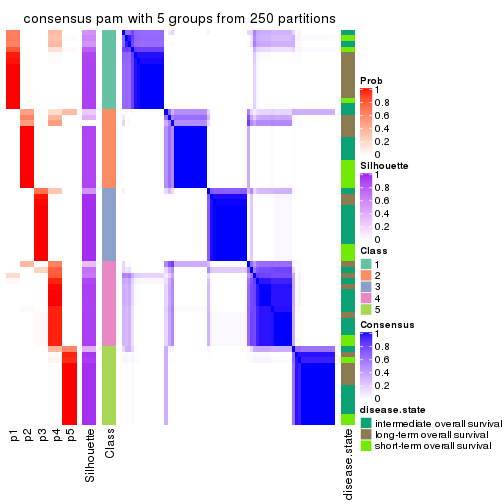</p>

</div>
<div id='tab-ATC-pam-consensus-heatmap-5'>
<pre><code class="r">consensus_heatmap(res, k = 6)
</code></pre>

<p></p>

</div>
</div>

Heatmaps for the membership of samples in all partitions to see how consistent they are:


<script>
$( function() {
	$( '#tabs-ATC-pam-membership-heatmap' ).tabs();
} );
</script>
<div id='tabs-ATC-pam-membership-heatmap'>
<ul>
<li><a href='#tab-ATC-pam-membership-heatmap-1'>k = 2</a></li>
<li><a href='#tab-ATC-pam-membership-heatmap-2'>k = 3</a></li>
<li><a href='#tab-ATC-pam-membership-heatmap-3'>k = 4</a></li>
<li><a href='#tab-ATC-pam-membership-heatmap-4'>k = 5</a></li>
<li><a href='#tab-ATC-pam-membership-heatmap-5'>k = 6</a></li>
</ul>
<div id='tab-ATC-pam-membership-heatmap-1'>
<pre><code class="r">membership_heatmap(res, k = 2)
</code></pre>

<p></p>

</div>
<div id='tab-ATC-pam-membership-heatmap-2'>
<pre><code class="r">membership_heatmap(res, k = 3)
</code></pre>

<p></p>

</div>
<div id='tab-ATC-pam-membership-heatmap-3'>
<pre><code class="r">membership_heatmap(res, k = 4)
</code></pre>

<p></p>

</div>
<div id='tab-ATC-pam-membership-heatmap-4'>
<pre><code class="r">membership_heatmap(res, k = 5)
</code></pre>

<p></p>

</div>
<div id='tab-ATC-pam-membership-heatmap-5'>
<pre><code class="r">membership_heatmap(res, k = 6)
</code></pre>

<p></p>

</div>
</div>

As soon as we have had the classes for columns, we can look for signatures
which are significantly different between classes which can be candidate marks
for certain classes. Following are the heatmaps for signatures.


Signature heatmaps where rows are scaled:


<script>
$( function() {
	$( '#tabs-ATC-pam-get-signatures' ).tabs();
} );
</script>
<div id='tabs-ATC-pam-get-signatures'>
<ul>
<li><a href='#tab-ATC-pam-get-signatures-1'>k = 2</a></li>
<li><a href='#tab-ATC-pam-get-signatures-2'>k = 3</a></li>
<li><a href='#tab-ATC-pam-get-signatures-3'>k = 4</a></li>
<li><a href='#tab-ATC-pam-get-signatures-4'>k = 5</a></li>
<li><a href='#tab-ATC-pam-get-signatures-5'>k = 6</a></li>
</ul>
<div id='tab-ATC-pam-get-signatures-1'>
<pre><code class="r">get_signatures(res, k = 2)
</code></pre>

<p></p>

</div>
<div id='tab-ATC-pam-get-signatures-2'>
<pre><code class="r">get_signatures(res, k = 3)
</code></pre>

<p></p>

</div>
<div id='tab-ATC-pam-get-signatures-3'>
<pre><code class="r">get_signatures(res, k = 4)
</code></pre>

<p></p>

</div>
<div id='tab-ATC-pam-get-signatures-4'>
<pre><code class="r">get_signatures(res, k = 5)
</code></pre>

<p></p>

</div>
<div id='tab-ATC-pam-get-signatures-5'>
<pre><code class="r">get_signatures(res, k = 6)
</code></pre>

<p></p>

</div>
</div>


Signature heatmaps where rows are not scaled:


<script>
$( function() {
	$( '#tabs-ATC-pam-get-signatures-no-scale' ).tabs();
} );
</script>
<div id='tabs-ATC-pam-get-signatures-no-scale'>
<ul>
<li><a href='#tab-ATC-pam-get-signatures-no-scale-1'>k = 2</a></li>
<li><a href='#tab-ATC-pam-get-signatures-no-scale-2'>k = 3</a></li>
<li><a href='#tab-ATC-pam-get-signatures-no-scale-3'>k = 4</a></li>
<li><a href='#tab-ATC-pam-get-signatures-no-scale-4'>k = 5</a></li>
<li><a href='#tab-ATC-pam-get-signatures-no-scale-5'>k = 6</a></li>
</ul>
<div id='tab-ATC-pam-get-signatures-no-scale-1'>
<pre><code class="r">get_signatures(res, k = 2, scale_rows = FALSE)
</code></pre>

<p></p>

</div>
<div id='tab-ATC-pam-get-signatures-no-scale-2'>
<pre><code class="r">get_signatures(res, k = 3, scale_rows = FALSE)
</code></pre>

<p></p>

</div>
<div id='tab-ATC-pam-get-signatures-no-scale-3'>
<pre><code class="r">get_signatures(res, k = 4, scale_rows = FALSE)
</code></pre>

<p></p>

</div>
<div id='tab-ATC-pam-get-signatures-no-scale-4'>
<pre><code class="r">get_signatures(res, k = 5, scale_rows = FALSE)
</code></pre>

<p></p>

</div>
<div id='tab-ATC-pam-get-signatures-no-scale-5'>
<pre><code class="r">get_signatures(res, k = 6, scale_rows = FALSE)
</code></pre>

<p></p>

</div>
</div>


Compare the overlap of signatures from different k:

```r
compare_signatures(res)
```


`get_signature()` returns a data frame invisibly. TO get the list of signatures, the function
call should be assigned to a variable explicitly. In following code, if `plot` argument is set
to `FALSE`, no heatmap is plotted while only the differential analysis is performed.

```r
# code only for demonstration
tb = get_signature(res, k = ..., plot = FALSE)
```

An example of the output of `tb` is:

```
#>   which_row         fdr    mean_1    mean_2 scaled_mean_1 scaled_mean_2 km
#> 1        38 0.042760348  8.373488  9.131774    -0.5533452     0.5164555  1
#> 2        40 0.018707592  7.106213  8.469186    -0.6173731     0.5762149  1
#> 3        55 0.019134737 10.221463 11.207825    -0.6159697     0.5749050  1
#> 4        59 0.006059896  5.921854  7.869574    -0.6899429     0.6439467  1
#> 5        60 0.018055526  8.928898 10.211722    -0.6204761     0.5791110  1
#> 6        98 0.009384629 15.714769 14.887706     0.6635654    -0.6193277  2
...
```

The columns in `tb` are:

1. `which_row`: row indices corresponding to the input matrix.
2. `fdr`: FDR for the differential test. 
3. `mean_x`: The mean value in group x.
4. `scaled_mean_x`: The mean value in group x after rows are scaled.
5. `km`: Row groups if k-means clustering is applied to rows.


UMAP plot which shows how samples are separated.


<script>
$( function() {
	$( '#tabs-ATC-pam-dimension-reduction' ).tabs();
} );
</script>
<div id='tabs-ATC-pam-dimension-reduction'>
<ul>
<li><a href='#tab-ATC-pam-dimension-reduction-1'>k = 2</a></li>
<li><a href='#tab-ATC-pam-dimension-reduction-2'>k = 3</a></li>
<li><a href='#tab-ATC-pam-dimension-reduction-3'>k = 4</a></li>
<li><a href='#tab-ATC-pam-dimension-reduction-4'>k = 5</a></li>
<li><a href='#tab-ATC-pam-dimension-reduction-5'>k = 6</a></li>
</ul>
<div id='tab-ATC-pam-dimension-reduction-1'>
<pre><code class="r">dimension_reduction(res, k = 2, method = &quot;UMAP&quot;)
</code></pre>

<p></p>

</div>
<div id='tab-ATC-pam-dimension-reduction-2'>
<pre><code class="r">dimension_reduction(res, k = 3, method = &quot;UMAP&quot;)
</code></pre>

<p></p>

</div>
<div id='tab-ATC-pam-dimension-reduction-3'>
<pre><code class="r">dimension_reduction(res, k = 4, method = &quot;UMAP&quot;)
</code></pre>

<p></p>

</div>
<div id='tab-ATC-pam-dimension-reduction-4'>
<pre><code class="r">dimension_reduction(res, k = 5, method = &quot;UMAP&quot;)
</code></pre>

<p></p>

</div>
<div id='tab-ATC-pam-dimension-reduction-5'>
<pre><code class="r">dimension_reduction(res, k = 6, method = &quot;UMAP&quot;)
</code></pre>

<p></p>

</div>
</div>


Following heatmap shows how subgroups are split when increasing `k`:

```r
collect_classes(res)
```


Test correlation between subgroups and known annotations. If the known
annotation is numeric, one-way ANOVA test is applied, and if the known
annotation is discrete, chi-squared contingency table test is applied.

```r
test_to_known_factors(res)
```

```
#>          n disease.state(p) k
#> ATC:pam 69           0.1998 2
#> ATC:pam 61           0.1215 3
#> ATC:pam 59           0.2842 4
#> ATC:pam 65           0.1502 5
#> ATC:pam 59           0.0639 6
```


If matrix rows can be associated to genes, consider to use `GO_Enrichment(res,
...)` to perform function enrichment for the signature genes.


 

---------------------------------------------------


### ATC:mclust


The object with results only for a single top-value method and a single partition method 
can be extracted as:

```r
res = res_list["ATC", "mclust"]
# you can also extract it by
# res = res_list["ATC:mclust"]
```

A summary of `res` and all the functions that can be applied to it:

```r
res
```

```
#> A 'ConsensusPartition' object with k = 2, 3, 4, 5, 6.
#>   On a matrix with 51941 rows and 70 columns.
#>   Top rows (1000, 2000, 3000, 4000, 5000) are extracted by 'ATC' method.
#>   Subgroups are detected by 'mclust' method.
#>   Performed in total 1250 partitions by row resampling.
#>   Best k for subgroups seems to be 4.
#> 
#> Following methods can be applied to this 'ConsensusPartition' object:
#>  [1] "cola_report"             "collect_classes"         "collect_plots"          
#>  [4] "collect_stats"           "colnames"                "compare_signatures"     
#>  [7] "consensus_heatmap"       "dimension_reduction"     "functional_enrichment"  
#> [10] "get_anno_col"            "get_anno"                "get_classes"            
#> [13] "get_consensus"           "get_matrix"              "get_membership"         
#> [16] "get_param"               "get_signatures"          "get_stats"              
#> [19] "is_best_k"               "is_stable_k"             "membership_heatmap"     
#> [22] "ncol"                    "nrow"                    "plot_ecdf"              
#> [25] "rownames"                "select_partition_number" "show"                   
#> [28] "suggest_best_k"          "test_to_known_factors"
```

`collect_plots()` function collects all the plots made from `res` for all `k` (number of partitions)
into one single page to provide an easy and fast comparison between different `k`.

```r
collect_plots(res)
```


The plots are:

- The first row: a plot of the ECDF (Empirical cumulative distribution
  function) curves of the consensus matrix for each `k` and the heatmap of
  predicted classes for each `k`.
- The second row: heatmaps of the consensus matrix for each `k`.
- The third row: heatmaps of the membership matrix for each `k`.
- The fouth row: heatmaps of the signatures for each `k`.

All the plots in panels can be made by individual functions and they are
plotted later in this section.

`select_partition_number()` produces several plots showing different
statistics for choosing "optimized" `k`. There are following statistics:

- ECDF curves of the consensus matrix for each `k`;
- 1-PAC. [The PAC
  score](https://en.wikipedia.org/wiki/Consensus_clustering#Over-interpretation_potential_of_consensus_clustering)
  measures the proportion of the ambiguous subgrouping.
- Mean silhouette score.
- Concordance. The mean probability of fiting the consensus class ids in all
  partitions.
- Area increased. Denote $A_k$ as the area under the ECDF curve for current
  `k`, the area increased is defined as $A_k - A_{k-1}$.
- Rand index. The percent of pairs of samples that are both in a same cluster
  or both are not in a same cluster in the partition of k and k-1.
- Jaccard index. The ratio of pairs of samples are both in a same cluster in
  the partition of k and k-1 and the pairs of samples are both in a same
  cluster in the partition k or k-1.

The detailed explanations of these statistics can be found in [the cola
vignette](http://bioconductor.org/packages/devel/bioc/vignettes/cola/inst/doc/cola.html#toc_13).

Generally speaking, lower PAC score, higher mean silhouette score or higher
concordance corresponds to better partition. Rand index and Jaccard index
measure how similar the current partition is compared to partition with `k-1`.
If they are too similar, we won't accept `k` is better than `k-1`.

```r
select_partition_number(res)
```


The numeric values for all these statistics can be obtained by `get_stats()`.

```r
get_stats(res)
```

```
#>   k 1-PAC mean_silhouette concordance area_increased  Rand Jaccard
#> 2 2 0.681           0.871       0.913         0.4980 0.494   0.494
#> 3 3 0.661           0.778       0.884         0.3030 0.678   0.441
#> 4 4 0.886           0.930       0.951         0.1538 0.784   0.457
#> 5 5 0.819           0.875       0.904         0.0551 0.944   0.778
#> 6 6 0.864           0.890       0.918         0.0531 0.900   0.574
```

`suggest_best_k()` suggests the best $k$ based on these statistics. The rules are as follows:

- All $k$ with Jaccard index larger than 0.95 are removed because the increase of
  the partition number does not provides enough extra information. If all $k$ are removed,
  the best $k$ is assigned by `NA`.
- For $k$ with 1-PAC larger than 0.9, the maximal $k$ is taken as the "best k". Other $k$ is called "optional k".
- If it does not fit the second rule. The $k$ with the highest vote of highest
  1-PAC, mean silhouette and concordance is taken as the "best k".

```r
suggest_best_k(res)
```

```
#> [1] 4
```


Following shows the table of the partitions (You need to click the **show/hide
code output** link to see it). The membership matrix (columns with name `p*`)
is inferred by
[`clue::cl_consensus()`](https://www.rdocumentation.org/link/cl_consensus?package=clue)
function with the `SE` method. Basically the value in the membership matrix
represents the probability to belong to a certain group. The finall class
label for an item is determined with the group with highest probability it
belongs to.

In `get_classes()` function, the entropy is calculated from the membership
matrix and the silhouette score is calculated from the consensus matrix.


<script>
$( function() {
	$( '#tabs-ATC-mclust-get-classes' ).tabs();
} );
</script>
<div id='tabs-ATC-mclust-get-classes'>
<ul>
<li><a href='#tab-ATC-mclust-get-classes-1'>k = 2</a></li>
<li><a href='#tab-ATC-mclust-get-classes-2'>k = 3</a></li>
<li><a href='#tab-ATC-mclust-get-classes-3'>k = 4</a></li>
<li><a href='#tab-ATC-mclust-get-classes-4'>k = 5</a></li>
<li><a href='#tab-ATC-mclust-get-classes-5'>k = 6</a></li>
</ul>

<div id='tab-ATC-mclust-get-classes-1'>
<p><a id='tab-ATC-mclust-get-classes-1-a' style='color:#0366d6' href='#'>show/hide code output</a></p>
<pre><code class="r">cbind(get_classes(res, k = 2), get_membership(res, k = 2))
</code></pre>

<pre><code>#&gt;            class entropy silhouette    p1    p2
#&gt; GSM1299517     2  0.0000      0.882 0.000 1.000
#&gt; GSM1299518     2  0.0000      0.882 0.000 1.000
#&gt; GSM1299519     2  0.8499      0.782 0.276 0.724
#&gt; GSM1299520     1  0.0000      0.926 1.000 0.000
#&gt; GSM1299521     1  0.4562      0.922 0.904 0.096
#&gt; GSM1299522     2  0.8499      0.782 0.276 0.724
#&gt; GSM1299523     1  0.0000      0.926 1.000 0.000
#&gt; GSM1299524     2  0.0000      0.882 0.000 1.000
#&gt; GSM1299525     2  0.8763      0.760 0.296 0.704
#&gt; GSM1299526     2  0.0000      0.882 0.000 1.000
#&gt; GSM1299527     2  0.0000      0.882 0.000 1.000
#&gt; GSM1299528     1  0.0000      0.926 1.000 0.000
#&gt; GSM1299529     2  0.8555      0.778 0.280 0.720
#&gt; GSM1299530     1  0.0938      0.927 0.988 0.012
#&gt; GSM1299531     2  0.8499      0.782 0.276 0.724
#&gt; GSM1299575     1  0.4562      0.922 0.904 0.096
#&gt; GSM1299532     2  0.0000      0.882 0.000 1.000
#&gt; GSM1299533     2  0.4562      0.854 0.096 0.904
#&gt; GSM1299534     1  0.0000      0.926 1.000 0.000
#&gt; GSM1299535     2  0.4562      0.854 0.096 0.904
#&gt; GSM1299536     1  0.0000      0.926 1.000 0.000
#&gt; GSM1299537     2  0.0000      0.882 0.000 1.000
#&gt; GSM1299538     1  0.0000      0.926 1.000 0.000
#&gt; GSM1299539     1  0.0000      0.926 1.000 0.000
#&gt; GSM1299540     2  0.0000      0.882 0.000 1.000
#&gt; GSM1299541     2  0.0000      0.882 0.000 1.000
#&gt; GSM1299542     2  0.0000      0.882 0.000 1.000
#&gt; GSM1299543     2  0.8763      0.760 0.296 0.704
#&gt; GSM1299544     1  0.4161      0.850 0.916 0.084
#&gt; GSM1299545     1  0.9922      0.361 0.552 0.448
#&gt; GSM1299546     2  0.8499      0.782 0.276 0.724
#&gt; GSM1299547     1  0.0000      0.926 1.000 0.000
#&gt; GSM1299548     2  0.0000      0.882 0.000 1.000
#&gt; GSM1299549     1  0.5059      0.911 0.888 0.112
#&gt; GSM1299550     1  0.0000      0.926 1.000 0.000
#&gt; GSM1299551     2  0.8499      0.782 0.276 0.724
#&gt; GSM1299552     1  0.4562      0.922 0.904 0.096
#&gt; GSM1299553     1  0.0000      0.926 1.000 0.000
#&gt; GSM1299554     2  0.8499      0.782 0.276 0.724
#&gt; GSM1299555     2  0.0000      0.882 0.000 1.000
#&gt; GSM1299556     2  0.0000      0.882 0.000 1.000
#&gt; GSM1299557     2  0.0000      0.882 0.000 1.000
#&gt; GSM1299558     2  0.8763      0.760 0.296 0.704
#&gt; GSM1299559     2  0.0000      0.882 0.000 1.000
#&gt; GSM1299560     2  0.0000      0.882 0.000 1.000
#&gt; GSM1299576     1  0.4562      0.922 0.904 0.096
#&gt; GSM1299577     1  0.4562      0.922 0.904 0.096
#&gt; GSM1299561     2  0.0000      0.882 0.000 1.000
#&gt; GSM1299562     2  0.8499      0.782 0.276 0.724
#&gt; GSM1299563     1  0.0000      0.926 1.000 0.000
#&gt; GSM1299564     1  0.0000      0.926 1.000 0.000
#&gt; GSM1299565     2  0.8713      0.765 0.292 0.708
#&gt; GSM1299566     1  0.0000      0.926 1.000 0.000
#&gt; GSM1299567     2  0.0000      0.882 0.000 1.000
#&gt; GSM1299568     2  0.8499      0.782 0.276 0.724
#&gt; GSM1299569     1  0.0376      0.924 0.996 0.004
#&gt; GSM1299570     1  0.4562      0.922 0.904 0.096
#&gt; GSM1299571     2  0.4562      0.854 0.096 0.904
#&gt; GSM1299572     2  0.0672      0.879 0.008 0.992
#&gt; GSM1299573     2  0.0000      0.882 0.000 1.000
#&gt; GSM1299574     2  0.5408      0.850 0.124 0.876
#&gt; GSM1299578     1  0.4562      0.922 0.904 0.096
#&gt; GSM1299579     1  0.0000      0.926 1.000 0.000
#&gt; GSM1299580     1  0.4562      0.922 0.904 0.096
#&gt; GSM1299581     1  0.4562      0.922 0.904 0.096
#&gt; GSM1299582     1  0.4562      0.922 0.904 0.096
#&gt; GSM1299583     1  0.4562      0.922 0.904 0.096
#&gt; GSM1299584     1  0.4562      0.922 0.904 0.096
#&gt; GSM1299585     1  0.4562      0.922 0.904 0.096
#&gt; GSM1299586     1  0.4562      0.922 0.904 0.096
</code></pre>

<script>
$('#tab-ATC-mclust-get-classes-1-a').parent().next().next().hide();
$('#tab-ATC-mclust-get-classes-1-a').click(function(){
  $('#tab-ATC-mclust-get-classes-1-a').parent().next().next().toggle();
  return(false);
});
</script>
</div>

<div id='tab-ATC-mclust-get-classes-2'>
<p><a id='tab-ATC-mclust-get-classes-2-a' style='color:#0366d6' href='#'>show/hide code output</a></p>
<pre><code class="r">cbind(get_classes(res, k = 3), get_membership(res, k = 3))
</code></pre>

<pre><code>#&gt;            class entropy silhouette    p1    p2    p3
#&gt; GSM1299517     3  0.0000      0.931 0.000 0.000 1.000
#&gt; GSM1299518     3  0.0237      0.929 0.000 0.004 0.996
#&gt; GSM1299519     2  0.4931      0.731 0.000 0.768 0.232
#&gt; GSM1299520     2  0.5397      0.499 0.280 0.720 0.000
#&gt; GSM1299521     1  0.0000      0.893 1.000 0.000 0.000
#&gt; GSM1299522     2  0.4931      0.731 0.000 0.768 0.232
#&gt; GSM1299523     2  0.5591      0.458 0.304 0.696 0.000
#&gt; GSM1299524     3  0.0237      0.929 0.000 0.004 0.996
#&gt; GSM1299525     2  0.5493      0.737 0.012 0.756 0.232
#&gt; GSM1299526     3  0.0237      0.929 0.000 0.004 0.996
#&gt; GSM1299527     3  0.0000      0.931 0.000 0.000 1.000
#&gt; GSM1299528     2  0.1643      0.728 0.044 0.956 0.000
#&gt; GSM1299529     2  0.4931      0.731 0.000 0.768 0.232
#&gt; GSM1299530     1  0.4504      0.809 0.804 0.196 0.000
#&gt; GSM1299531     2  0.4931      0.731 0.000 0.768 0.232
#&gt; GSM1299575     1  0.0000      0.893 1.000 0.000 0.000
#&gt; GSM1299532     3  0.0237      0.929 0.000 0.004 0.996
#&gt; GSM1299533     3  0.0000      0.931 0.000 0.000 1.000
#&gt; GSM1299534     2  0.2383      0.737 0.044 0.940 0.016
#&gt; GSM1299535     3  0.0000      0.931 0.000 0.000 1.000
#&gt; GSM1299536     2  0.5431      0.493 0.284 0.716 0.000
#&gt; GSM1299537     3  0.0237      0.929 0.000 0.004 0.996
#&gt; GSM1299538     2  0.4291      0.630 0.180 0.820 0.000
#&gt; GSM1299539     2  0.2711      0.708 0.088 0.912 0.000
#&gt; GSM1299540     3  0.0000      0.931 0.000 0.000 1.000
#&gt; GSM1299541     3  0.0237      0.929 0.000 0.004 0.996
#&gt; GSM1299542     3  0.0237      0.929 0.000 0.004 0.996
#&gt; GSM1299543     2  0.5493      0.737 0.012 0.756 0.232
#&gt; GSM1299544     2  0.2152      0.738 0.036 0.948 0.016
#&gt; GSM1299545     3  0.5147      0.691 0.020 0.180 0.800
#&gt; GSM1299546     2  0.4974      0.729 0.000 0.764 0.236
#&gt; GSM1299547     1  0.5905      0.604 0.648 0.352 0.000
#&gt; GSM1299548     3  0.0000      0.931 0.000 0.000 1.000
#&gt; GSM1299549     3  0.5559      0.676 0.028 0.192 0.780
#&gt; GSM1299550     2  0.2625      0.710 0.084 0.916 0.000
#&gt; GSM1299551     2  0.4931      0.731 0.000 0.768 0.232
#&gt; GSM1299552     1  0.4861      0.814 0.808 0.180 0.012
#&gt; GSM1299553     1  0.6183      0.759 0.732 0.236 0.032
#&gt; GSM1299554     3  0.6683     -0.239 0.008 0.492 0.500
#&gt; GSM1299555     3  0.0000      0.931 0.000 0.000 1.000
#&gt; GSM1299556     3  0.0237      0.929 0.000 0.004 0.996
#&gt; GSM1299557     3  0.0000      0.931 0.000 0.000 1.000
#&gt; GSM1299558     2  0.5493      0.737 0.012 0.756 0.232
#&gt; GSM1299559     3  0.0237      0.929 0.000 0.004 0.996
#&gt; GSM1299560     3  0.0000      0.931 0.000 0.000 1.000
#&gt; GSM1299576     1  0.0000      0.893 1.000 0.000 0.000
#&gt; GSM1299577     1  0.5852      0.795 0.776 0.180 0.044
#&gt; GSM1299561     3  0.0000      0.931 0.000 0.000 1.000
#&gt; GSM1299562     3  0.6683     -0.237 0.008 0.492 0.500
#&gt; GSM1299563     2  0.5397      0.499 0.280 0.720 0.000
#&gt; GSM1299564     2  0.5497      0.480 0.292 0.708 0.000
#&gt; GSM1299565     2  0.6361      0.739 0.040 0.728 0.232
#&gt; GSM1299566     2  0.1643      0.728 0.044 0.956 0.000
#&gt; GSM1299567     3  0.0892      0.915 0.000 0.020 0.980
#&gt; GSM1299568     2  0.6361      0.739 0.040 0.728 0.232
#&gt; GSM1299569     2  0.1999      0.737 0.036 0.952 0.012
#&gt; GSM1299570     1  0.6109      0.784 0.760 0.192 0.048
#&gt; GSM1299571     3  0.0237      0.929 0.000 0.004 0.996
#&gt; GSM1299572     3  0.0592      0.924 0.000 0.012 0.988
#&gt; GSM1299573     3  0.0000      0.931 0.000 0.000 1.000
#&gt; GSM1299574     3  0.1289      0.908 0.000 0.032 0.968
#&gt; GSM1299578     1  0.0000      0.893 1.000 0.000 0.000
#&gt; GSM1299579     1  0.5363      0.697 0.724 0.276 0.000
#&gt; GSM1299580     1  0.0000      0.893 1.000 0.000 0.000
#&gt; GSM1299581     1  0.0000      0.893 1.000 0.000 0.000
#&gt; GSM1299582     1  0.0000      0.893 1.000 0.000 0.000
#&gt; GSM1299583     1  0.0000      0.893 1.000 0.000 0.000
#&gt; GSM1299584     1  0.0000      0.893 1.000 0.000 0.000
#&gt; GSM1299585     1  0.0000      0.893 1.000 0.000 0.000
#&gt; GSM1299586     1  0.0000      0.893 1.000 0.000 0.000
</code></pre>

<script>
$('#tab-ATC-mclust-get-classes-2-a').parent().next().next().hide();
$('#tab-ATC-mclust-get-classes-2-a').click(function(){
  $('#tab-ATC-mclust-get-classes-2-a').parent().next().next().toggle();
  return(false);
});
</script>
</div>

<div id='tab-ATC-mclust-get-classes-3'>
<p><a id='tab-ATC-mclust-get-classes-3-a' style='color:#0366d6' href='#'>show/hide code output</a></p>
<pre><code class="r">cbind(get_classes(res, k = 4), get_membership(res, k = 4))
</code></pre>

<pre><code>#&gt;            class entropy silhouette    p1    p2    p3    p4
#&gt; GSM1299517     3  0.0000      0.994 0.000 0.000 1.000 0.000
#&gt; GSM1299518     3  0.0469      0.989 0.000 0.012 0.988 0.000
#&gt; GSM1299519     2  0.1474      0.910 0.000 0.948 0.000 0.052
#&gt; GSM1299520     4  0.0000      0.959 0.000 0.000 0.000 1.000
#&gt; GSM1299521     1  0.0524      0.946 0.988 0.004 0.000 0.008
#&gt; GSM1299522     2  0.1474      0.910 0.000 0.948 0.000 0.052
#&gt; GSM1299523     4  0.1545      0.936 0.008 0.040 0.000 0.952
#&gt; GSM1299524     3  0.0469      0.989 0.000 0.012 0.988 0.000
#&gt; GSM1299525     2  0.1557      0.910 0.000 0.944 0.000 0.056
#&gt; GSM1299526     3  0.0000      0.994 0.000 0.000 1.000 0.000
#&gt; GSM1299527     3  0.0000      0.994 0.000 0.000 1.000 0.000
#&gt; GSM1299528     4  0.1637      0.936 0.000 0.060 0.000 0.940
#&gt; GSM1299529     2  0.1557      0.910 0.000 0.944 0.000 0.056
#&gt; GSM1299530     4  0.3372      0.872 0.096 0.036 0.000 0.868
#&gt; GSM1299531     2  0.1474      0.910 0.000 0.948 0.000 0.052
#&gt; GSM1299575     1  0.0000      0.947 1.000 0.000 0.000 0.000
#&gt; GSM1299532     3  0.0469      0.989 0.000 0.012 0.988 0.000
#&gt; GSM1299533     2  0.3486      0.834 0.000 0.812 0.188 0.000
#&gt; GSM1299534     4  0.2469      0.925 0.000 0.108 0.000 0.892
#&gt; GSM1299535     2  0.3528      0.832 0.000 0.808 0.192 0.000
#&gt; GSM1299536     4  0.0000      0.959 0.000 0.000 0.000 1.000
#&gt; GSM1299537     3  0.0188      0.994 0.000 0.004 0.996 0.000
#&gt; GSM1299538     4  0.0000      0.959 0.000 0.000 0.000 1.000
#&gt; GSM1299539     4  0.0000      0.959 0.000 0.000 0.000 1.000
#&gt; GSM1299540     3  0.0188      0.994 0.000 0.004 0.996 0.000
#&gt; GSM1299541     3  0.0188      0.994 0.000 0.004 0.996 0.000
#&gt; GSM1299542     3  0.0000      0.994 0.000 0.000 1.000 0.000
#&gt; GSM1299543     2  0.1867      0.902 0.000 0.928 0.000 0.072
#&gt; GSM1299544     4  0.1792      0.931 0.000 0.068 0.000 0.932
#&gt; GSM1299545     3  0.1114      0.978 0.004 0.016 0.972 0.008
#&gt; GSM1299546     2  0.1474      0.910 0.000 0.948 0.000 0.052
#&gt; GSM1299547     4  0.0592      0.955 0.000 0.016 0.000 0.984
#&gt; GSM1299548     3  0.0000      0.994 0.000 0.000 1.000 0.000
#&gt; GSM1299549     2  0.3508      0.879 0.004 0.872 0.064 0.060
#&gt; GSM1299550     4  0.0000      0.959 0.000 0.000 0.000 1.000
#&gt; GSM1299551     2  0.1474      0.910 0.000 0.948 0.000 0.052
#&gt; GSM1299552     1  0.3948      0.834 0.840 0.064 0.000 0.096
#&gt; GSM1299553     4  0.2125      0.926 0.004 0.076 0.000 0.920
#&gt; GSM1299554     2  0.3245      0.890 0.000 0.880 0.064 0.056
#&gt; GSM1299555     3  0.0469      0.989 0.000 0.012 0.988 0.000
#&gt; GSM1299556     3  0.0188      0.994 0.000 0.004 0.996 0.000
#&gt; GSM1299557     3  0.0188      0.993 0.000 0.004 0.996 0.000
#&gt; GSM1299558     2  0.1557      0.910 0.000 0.944 0.000 0.056
#&gt; GSM1299559     3  0.0188      0.994 0.000 0.004 0.996 0.000
#&gt; GSM1299560     3  0.0000      0.994 0.000 0.000 1.000 0.000
#&gt; GSM1299576     1  0.0188      0.947 0.996 0.000 0.000 0.004
#&gt; GSM1299577     1  0.6306      0.282 0.544 0.064 0.000 0.392
#&gt; GSM1299561     3  0.0000      0.994 0.000 0.000 1.000 0.000
#&gt; GSM1299562     2  0.3090      0.893 0.000 0.888 0.056 0.056
#&gt; GSM1299563     4  0.0000      0.959 0.000 0.000 0.000 1.000
#&gt; GSM1299564     4  0.0592      0.955 0.000 0.016 0.000 0.984
#&gt; GSM1299565     2  0.1940      0.888 0.000 0.924 0.000 0.076
#&gt; GSM1299566     4  0.1716      0.934 0.000 0.064 0.000 0.936
#&gt; GSM1299567     3  0.0188      0.994 0.000 0.004 0.996 0.000
#&gt; GSM1299568     2  0.1940      0.888 0.000 0.924 0.000 0.076
#&gt; GSM1299569     4  0.1792      0.931 0.000 0.068 0.000 0.932
#&gt; GSM1299570     4  0.2060      0.927 0.016 0.052 0.000 0.932
#&gt; GSM1299571     2  0.3528      0.832 0.000 0.808 0.192 0.000
#&gt; GSM1299572     2  0.3725      0.839 0.000 0.812 0.180 0.008
#&gt; GSM1299573     3  0.0188      0.993 0.000 0.004 0.996 0.000
#&gt; GSM1299574     2  0.3695      0.859 0.000 0.828 0.156 0.016
#&gt; GSM1299578     1  0.0937      0.940 0.976 0.012 0.000 0.012
#&gt; GSM1299579     4  0.0188      0.958 0.004 0.000 0.000 0.996
#&gt; GSM1299580     1  0.0000      0.947 1.000 0.000 0.000 0.000
#&gt; GSM1299581     1  0.0000      0.947 1.000 0.000 0.000 0.000
#&gt; GSM1299582     1  0.0000      0.947 1.000 0.000 0.000 0.000
#&gt; GSM1299583     1  0.0469      0.945 0.988 0.000 0.000 0.012
#&gt; GSM1299584     1  0.0000      0.947 1.000 0.000 0.000 0.000
#&gt; GSM1299585     1  0.0524      0.946 0.988 0.004 0.000 0.008
#&gt; GSM1299586     1  0.0000      0.947 1.000 0.000 0.000 0.000
</code></pre>

<script>
$('#tab-ATC-mclust-get-classes-3-a').parent().next().next().hide();
$('#tab-ATC-mclust-get-classes-3-a').click(function(){
  $('#tab-ATC-mclust-get-classes-3-a').parent().next().next().toggle();
  return(false);
});
</script>
</div>

<div id='tab-ATC-mclust-get-classes-4'>
<p><a id='tab-ATC-mclust-get-classes-4-a' style='color:#0366d6' href='#'>show/hide code output</a></p>
<pre><code class="r">cbind(get_classes(res, k = 5), get_membership(res, k = 5))
</code></pre>

<pre><code>#&gt;            class entropy silhouette    p1    p2    p3    p4    p5
#&gt; GSM1299517     3  0.2127      0.886 0.000 0.000 0.892 0.108 0.000
#&gt; GSM1299518     3  0.3437      0.865 0.000 0.048 0.832 0.120 0.000
#&gt; GSM1299519     2  0.0290      0.888 0.000 0.992 0.000 0.008 0.000
#&gt; GSM1299520     5  0.0771      0.923 0.000 0.004 0.000 0.020 0.976
#&gt; GSM1299521     1  0.1331      0.958 0.952 0.000 0.000 0.040 0.008
#&gt; GSM1299522     2  0.0162      0.889 0.000 0.996 0.000 0.004 0.000
#&gt; GSM1299523     5  0.0865      0.922 0.000 0.004 0.000 0.024 0.972
#&gt; GSM1299524     3  0.3507      0.862 0.000 0.052 0.828 0.120 0.000
#&gt; GSM1299525     2  0.1106      0.873 0.000 0.964 0.000 0.024 0.012
#&gt; GSM1299526     3  0.2230      0.884 0.000 0.000 0.884 0.116 0.000
#&gt; GSM1299527     3  0.0000      0.904 0.000 0.000 1.000 0.000 0.000
#&gt; GSM1299528     5  0.1697      0.927 0.000 0.060 0.000 0.008 0.932
#&gt; GSM1299529     2  0.0290      0.888 0.000 0.992 0.000 0.008 0.000
#&gt; GSM1299530     4  0.4609      0.779 0.104 0.000 0.000 0.744 0.152
#&gt; GSM1299531     2  0.0162      0.889 0.000 0.996 0.000 0.004 0.000
#&gt; GSM1299575     1  0.0000      0.981 1.000 0.000 0.000 0.000 0.000
#&gt; GSM1299532     3  0.3575      0.861 0.000 0.056 0.824 0.120 0.000
#&gt; GSM1299533     2  0.4457      0.781 0.000 0.760 0.124 0.116 0.000
#&gt; GSM1299534     5  0.2595      0.904 0.000 0.080 0.000 0.032 0.888
#&gt; GSM1299535     2  0.4406      0.781 0.000 0.764 0.128 0.108 0.000
#&gt; GSM1299536     5  0.0579      0.930 0.000 0.008 0.000 0.008 0.984
#&gt; GSM1299537     3  0.1831      0.891 0.000 0.000 0.920 0.076 0.004
#&gt; GSM1299538     5  0.1493      0.931 0.000 0.024 0.000 0.028 0.948
#&gt; GSM1299539     5  0.0898      0.933 0.000 0.020 0.000 0.008 0.972
#&gt; GSM1299540     3  0.1831      0.891 0.000 0.000 0.920 0.076 0.004
#&gt; GSM1299541     3  0.1831      0.891 0.000 0.000 0.920 0.076 0.004
#&gt; GSM1299542     3  0.0162      0.904 0.000 0.000 0.996 0.004 0.000
#&gt; GSM1299543     2  0.1741      0.849 0.000 0.936 0.000 0.024 0.040
#&gt; GSM1299544     5  0.2482      0.908 0.000 0.084 0.000 0.024 0.892
#&gt; GSM1299545     4  0.4238      0.686 0.000 0.056 0.112 0.804 0.028
#&gt; GSM1299546     2  0.0162      0.889 0.000 0.996 0.000 0.004 0.000
#&gt; GSM1299547     4  0.5118      0.387 0.000 0.040 0.000 0.548 0.412
#&gt; GSM1299548     3  0.0000      0.904 0.000 0.000 1.000 0.000 0.000
#&gt; GSM1299549     4  0.3522      0.728 0.000 0.104 0.032 0.844 0.020
#&gt; GSM1299550     5  0.1493      0.931 0.000 0.024 0.000 0.028 0.948
#&gt; GSM1299551     2  0.0162      0.889 0.000 0.996 0.000 0.004 0.000
#&gt; GSM1299552     4  0.4642      0.734 0.168 0.032 0.000 0.760 0.040
#&gt; GSM1299553     4  0.4313      0.778 0.000 0.068 0.000 0.760 0.172
#&gt; GSM1299554     2  0.3759      0.828 0.000 0.812 0.028 0.148 0.012
#&gt; GSM1299555     3  0.3641      0.856 0.000 0.060 0.820 0.120 0.000
#&gt; GSM1299556     3  0.1892      0.889 0.000 0.000 0.916 0.080 0.004
#&gt; GSM1299557     3  0.3214      0.873 0.000 0.036 0.844 0.120 0.000
#&gt; GSM1299558     2  0.1117      0.870 0.000 0.964 0.000 0.020 0.016
#&gt; GSM1299559     3  0.1892      0.889 0.000 0.000 0.916 0.080 0.004
#&gt; GSM1299560     3  0.0290      0.904 0.000 0.000 0.992 0.008 0.000
#&gt; GSM1299576     1  0.0566      0.977 0.984 0.000 0.000 0.012 0.004
#&gt; GSM1299577     4  0.4671      0.785 0.120 0.024 0.000 0.772 0.084
#&gt; GSM1299561     3  0.0162      0.904 0.000 0.000 0.996 0.004 0.000
#&gt; GSM1299562     2  0.3841      0.826 0.000 0.808 0.032 0.148 0.012
#&gt; GSM1299563     5  0.0451      0.931 0.000 0.008 0.000 0.004 0.988
#&gt; GSM1299564     5  0.2378      0.899 0.000 0.048 0.000 0.048 0.904
#&gt; GSM1299565     2  0.1331      0.878 0.000 0.952 0.000 0.008 0.040
#&gt; GSM1299566     5  0.1697      0.927 0.000 0.060 0.000 0.008 0.932
#&gt; GSM1299567     3  0.1892      0.889 0.000 0.000 0.916 0.080 0.004
#&gt; GSM1299568     2  0.3339      0.840 0.000 0.836 0.000 0.124 0.040
#&gt; GSM1299569     5  0.2482      0.908 0.000 0.084 0.000 0.024 0.892
#&gt; GSM1299570     4  0.4672      0.785 0.028 0.040 0.000 0.752 0.180
#&gt; GSM1299571     2  0.2536      0.840 0.000 0.868 0.128 0.004 0.000
#&gt; GSM1299572     2  0.4557      0.788 0.000 0.760 0.104 0.132 0.004
#&gt; GSM1299573     3  0.3051      0.875 0.000 0.028 0.852 0.120 0.000
#&gt; GSM1299574     2  0.1965      0.859 0.000 0.904 0.096 0.000 0.000
#&gt; GSM1299578     1  0.2171      0.926 0.912 0.000 0.000 0.064 0.024
#&gt; GSM1299579     5  0.2970      0.758 0.000 0.004 0.000 0.168 0.828
#&gt; GSM1299580     1  0.0000      0.981 1.000 0.000 0.000 0.000 0.000
#&gt; GSM1299581     1  0.0162      0.980 0.996 0.000 0.000 0.000 0.004
#&gt; GSM1299582     1  0.0000      0.981 1.000 0.000 0.000 0.000 0.000
#&gt; GSM1299583     1  0.0451      0.978 0.988 0.000 0.000 0.004 0.008
#&gt; GSM1299584     1  0.0000      0.981 1.000 0.000 0.000 0.000 0.000
#&gt; GSM1299585     1  0.0992      0.969 0.968 0.000 0.000 0.024 0.008
#&gt; GSM1299586     1  0.0000      0.981 1.000 0.000 0.000 0.000 0.000
</code></pre>

<script>
$('#tab-ATC-mclust-get-classes-4-a').parent().next().next().hide();
$('#tab-ATC-mclust-get-classes-4-a').click(function(){
  $('#tab-ATC-mclust-get-classes-4-a').parent().next().next().toggle();
  return(false);
});
</script>
</div>

<div id='tab-ATC-mclust-get-classes-5'>
<p><a id='tab-ATC-mclust-get-classes-5-a' style='color:#0366d6' href='#'>show/hide code output</a></p>
<pre><code class="r">cbind(get_classes(res, k = 6), get_membership(res, k = 6))
</code></pre>

<pre><code>#&gt;            class entropy silhouette    p1    p2    p3    p4    p5    p6
#&gt; GSM1299517     6  0.3240     0.7153 0.000 0.000 0.244 0.004 0.000 0.752
#&gt; GSM1299518     6  0.1663     0.8889 0.000 0.000 0.088 0.000 0.000 0.912
#&gt; GSM1299519     2  0.0260     0.9643 0.000 0.992 0.000 0.000 0.000 0.008
#&gt; GSM1299520     5  0.0713     0.9334 0.000 0.000 0.000 0.000 0.972 0.028
#&gt; GSM1299521     1  0.4097     0.0792 0.500 0.000 0.000 0.492 0.000 0.008
#&gt; GSM1299522     2  0.0000     0.9651 0.000 1.000 0.000 0.000 0.000 0.000
#&gt; GSM1299523     5  0.2340     0.9030 0.000 0.000 0.004 0.056 0.896 0.044
#&gt; GSM1299524     6  0.1610     0.8897 0.000 0.000 0.084 0.000 0.000 0.916
#&gt; GSM1299525     2  0.1003     0.9525 0.000 0.964 0.000 0.016 0.020 0.000
#&gt; GSM1299526     6  0.2006     0.8799 0.000 0.000 0.104 0.004 0.000 0.892
#&gt; GSM1299527     3  0.2053     0.9321 0.000 0.000 0.888 0.004 0.000 0.108
#&gt; GSM1299528     5  0.1801     0.9287 0.000 0.056 0.000 0.004 0.924 0.016
#&gt; GSM1299529     2  0.0291     0.9649 0.000 0.992 0.000 0.000 0.004 0.004
#&gt; GSM1299530     4  0.1049     0.8923 0.032 0.000 0.000 0.960 0.000 0.008
#&gt; GSM1299531     2  0.0000     0.9651 0.000 1.000 0.000 0.000 0.000 0.000
#&gt; GSM1299575     1  0.0000     0.9282 1.000 0.000 0.000 0.000 0.000 0.000
#&gt; GSM1299532     6  0.1866     0.8900 0.000 0.008 0.084 0.000 0.000 0.908
#&gt; GSM1299533     6  0.3366     0.8591 0.000 0.044 0.052 0.060 0.000 0.844
#&gt; GSM1299534     5  0.2933     0.8763 0.000 0.128 0.000 0.016 0.844 0.012
#&gt; GSM1299535     6  0.2687     0.8812 0.000 0.044 0.072 0.008 0.000 0.876
#&gt; GSM1299536     5  0.0363     0.9352 0.000 0.000 0.000 0.000 0.988 0.012
#&gt; GSM1299537     3  0.0632     0.9477 0.000 0.000 0.976 0.000 0.000 0.024
#&gt; GSM1299538     5  0.1167     0.9366 0.000 0.008 0.000 0.020 0.960 0.012
#&gt; GSM1299539     5  0.0964     0.9362 0.000 0.012 0.000 0.004 0.968 0.016
#&gt; GSM1299540     3  0.0632     0.9474 0.000 0.000 0.976 0.000 0.000 0.024
#&gt; GSM1299541     3  0.0547     0.9468 0.000 0.000 0.980 0.000 0.000 0.020
#&gt; GSM1299542     3  0.1501     0.9437 0.000 0.000 0.924 0.000 0.000 0.076
#&gt; GSM1299543     2  0.1594     0.9215 0.000 0.932 0.000 0.016 0.052 0.000
#&gt; GSM1299544     5  0.2405     0.9053 0.000 0.100 0.000 0.016 0.880 0.004
#&gt; GSM1299545     4  0.4383     0.6975 0.000 0.004 0.040 0.736 0.024 0.196
#&gt; GSM1299546     2  0.0363     0.9638 0.000 0.988 0.000 0.000 0.000 0.012
#&gt; GSM1299547     5  0.2631     0.8644 0.000 0.004 0.000 0.128 0.856 0.012
#&gt; GSM1299548     3  0.2006     0.9361 0.000 0.000 0.892 0.004 0.000 0.104
#&gt; GSM1299549     4  0.2907     0.8357 0.000 0.028 0.008 0.860 0.004 0.100
#&gt; GSM1299550     5  0.1065     0.9368 0.000 0.008 0.000 0.020 0.964 0.008
#&gt; GSM1299551     2  0.0146     0.9648 0.000 0.996 0.000 0.000 0.000 0.004
#&gt; GSM1299552     4  0.0632     0.8961 0.024 0.000 0.000 0.976 0.000 0.000
#&gt; GSM1299553     4  0.1672     0.8859 0.000 0.004 0.000 0.932 0.048 0.016
#&gt; GSM1299554     6  0.3479     0.8200 0.000 0.104 0.012 0.040 0.012 0.832
#&gt; GSM1299555     6  0.1610     0.8897 0.000 0.000 0.084 0.000 0.000 0.916
#&gt; GSM1299556     3  0.0632     0.9474 0.000 0.000 0.976 0.000 0.000 0.024
#&gt; GSM1299557     6  0.1610     0.8897 0.000 0.000 0.084 0.000 0.000 0.916
#&gt; GSM1299558     2  0.0820     0.9553 0.000 0.972 0.000 0.016 0.012 0.000
#&gt; GSM1299559     3  0.0547     0.9465 0.000 0.000 0.980 0.000 0.000 0.020
#&gt; GSM1299560     3  0.2278     0.9156 0.000 0.000 0.868 0.004 0.000 0.128
#&gt; GSM1299576     1  0.0458     0.9241 0.984 0.000 0.000 0.016 0.000 0.000
#&gt; GSM1299577     4  0.0777     0.8970 0.024 0.000 0.000 0.972 0.004 0.000
#&gt; GSM1299561     3  0.1958     0.9367 0.000 0.000 0.896 0.004 0.000 0.100
#&gt; GSM1299562     6  0.3410     0.8221 0.000 0.104 0.012 0.036 0.012 0.836
#&gt; GSM1299563     5  0.0363     0.9352 0.000 0.000 0.000 0.000 0.988 0.012
#&gt; GSM1299564     5  0.1225     0.9323 0.000 0.000 0.000 0.036 0.952 0.012
#&gt; GSM1299565     2  0.1138     0.9497 0.000 0.960 0.000 0.004 0.024 0.012
#&gt; GSM1299566     5  0.1829     0.9259 0.000 0.064 0.000 0.004 0.920 0.012
#&gt; GSM1299567     3  0.0508     0.9408 0.004 0.000 0.984 0.000 0.000 0.012
#&gt; GSM1299568     6  0.3650     0.7217 0.000 0.216 0.000 0.004 0.024 0.756
#&gt; GSM1299569     5  0.2306     0.9082 0.000 0.092 0.000 0.016 0.888 0.004
#&gt; GSM1299570     4  0.1578     0.8861 0.000 0.004 0.000 0.936 0.048 0.012
#&gt; GSM1299571     6  0.4737     0.6768 0.000 0.256 0.072 0.008 0.000 0.664
#&gt; GSM1299572     6  0.3397     0.8449 0.000 0.044 0.032 0.076 0.004 0.844
#&gt; GSM1299573     6  0.1863     0.8817 0.000 0.000 0.104 0.000 0.000 0.896
#&gt; GSM1299574     2  0.2263     0.8522 0.000 0.896 0.056 0.000 0.000 0.048
#&gt; GSM1299578     1  0.2697     0.8467 0.872 0.000 0.004 0.092 0.004 0.028
#&gt; GSM1299579     5  0.1867     0.9239 0.000 0.000 0.000 0.020 0.916 0.064
#&gt; GSM1299580     1  0.0000     0.9282 1.000 0.000 0.000 0.000 0.000 0.000
#&gt; GSM1299581     1  0.0260     0.9274 0.992 0.000 0.000 0.008 0.000 0.000
#&gt; GSM1299582     1  0.0000     0.9282 1.000 0.000 0.000 0.000 0.000 0.000
#&gt; GSM1299583     1  0.0260     0.9274 0.992 0.000 0.000 0.008 0.000 0.000
#&gt; GSM1299584     1  0.0000     0.9282 1.000 0.000 0.000 0.000 0.000 0.000
#&gt; GSM1299585     1  0.1327     0.8969 0.936 0.000 0.000 0.064 0.000 0.000
#&gt; GSM1299586     1  0.0000     0.9282 1.000 0.000 0.000 0.000 0.000 0.000
</code></pre>

<script>
$('#tab-ATC-mclust-get-classes-5-a').parent().next().next().hide();
$('#tab-ATC-mclust-get-classes-5-a').click(function(){
  $('#tab-ATC-mclust-get-classes-5-a').parent().next().next().toggle();
  return(false);
});
</script>
</div>
</div>

Heatmaps for the consensus matrix. It visualizes the probability of two
samples to be in a same group.


<script>
$( function() {
	$( '#tabs-ATC-mclust-consensus-heatmap' ).tabs();
} );
</script>
<div id='tabs-ATC-mclust-consensus-heatmap'>
<ul>
<li><a href='#tab-ATC-mclust-consensus-heatmap-1'>k = 2</a></li>
<li><a href='#tab-ATC-mclust-consensus-heatmap-2'>k = 3</a></li>
<li><a href='#tab-ATC-mclust-consensus-heatmap-3'>k = 4</a></li>
<li><a href='#tab-ATC-mclust-consensus-heatmap-4'>k = 5</a></li>
<li><a href='#tab-ATC-mclust-consensus-heatmap-5'>k = 6</a></li>
</ul>
<div id='tab-ATC-mclust-consensus-heatmap-1'>
<pre><code class="r">consensus_heatmap(res, k = 2)
</code></pre>

<p></p>

</div>
<div id='tab-ATC-mclust-consensus-heatmap-2'>
<pre><code class="r">consensus_heatmap(res, k = 3)
</code></pre>

<p></p>

</div>
<div id='tab-ATC-mclust-consensus-heatmap-3'>
<pre><code class="r">consensus_heatmap(res, k = 4)
</code></pre>

<p></p>

</div>
<div id='tab-ATC-mclust-consensus-heatmap-4'>
<pre><code class="r">consensus_heatmap(res, k = 5)
</code></pre>

<p></p>

</div>
<div id='tab-ATC-mclust-consensus-heatmap-5'>
<pre><code class="r">consensus_heatmap(res, k = 6)
</code></pre>

<p>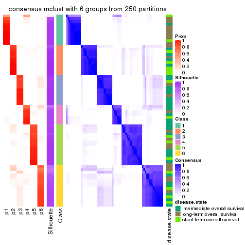</p>

</div>
</div>

Heatmaps for the membership of samples in all partitions to see how consistent they are:


<script>
$( function() {
	$( '#tabs-ATC-mclust-membership-heatmap' ).tabs();
} );
</script>
<div id='tabs-ATC-mclust-membership-heatmap'>
<ul>
<li><a href='#tab-ATC-mclust-membership-heatmap-1'>k = 2</a></li>
<li><a href='#tab-ATC-mclust-membership-heatmap-2'>k = 3</a></li>
<li><a href='#tab-ATC-mclust-membership-heatmap-3'>k = 4</a></li>
<li><a href='#tab-ATC-mclust-membership-heatmap-4'>k = 5</a></li>
<li><a href='#tab-ATC-mclust-membership-heatmap-5'>k = 6</a></li>
</ul>
<div id='tab-ATC-mclust-membership-heatmap-1'>
<pre><code class="r">membership_heatmap(res, k = 2)
</code></pre>

<p></p>

</div>
<div id='tab-ATC-mclust-membership-heatmap-2'>
<pre><code class="r">membership_heatmap(res, k = 3)
</code></pre>

<p></p>

</div>
<div id='tab-ATC-mclust-membership-heatmap-3'>
<pre><code class="r">membership_heatmap(res, k = 4)
</code></pre>

<p></p>

</div>
<div id='tab-ATC-mclust-membership-heatmap-4'>
<pre><code class="r">membership_heatmap(res, k = 5)
</code></pre>

<p></p>

</div>
<div id='tab-ATC-mclust-membership-heatmap-5'>
<pre><code class="r">membership_heatmap(res, k = 6)
</code></pre>

<p></p>

</div>
</div>

As soon as we have had the classes for columns, we can look for signatures
which are significantly different between classes which can be candidate marks
for certain classes. Following are the heatmaps for signatures.


Signature heatmaps where rows are scaled:


<script>
$( function() {
	$( '#tabs-ATC-mclust-get-signatures' ).tabs();
} );
</script>
<div id='tabs-ATC-mclust-get-signatures'>
<ul>
<li><a href='#tab-ATC-mclust-get-signatures-1'>k = 2</a></li>
<li><a href='#tab-ATC-mclust-get-signatures-2'>k = 3</a></li>
<li><a href='#tab-ATC-mclust-get-signatures-3'>k = 4</a></li>
<li><a href='#tab-ATC-mclust-get-signatures-4'>k = 5</a></li>
<li><a href='#tab-ATC-mclust-get-signatures-5'>k = 6</a></li>
</ul>
<div id='tab-ATC-mclust-get-signatures-1'>
<pre><code class="r">get_signatures(res, k = 2)
</code></pre>

<p></p>

</div>
<div id='tab-ATC-mclust-get-signatures-2'>
<pre><code class="r">get_signatures(res, k = 3)
</code></pre>

<p></p>

</div>
<div id='tab-ATC-mclust-get-signatures-3'>
<pre><code class="r">get_signatures(res, k = 4)
</code></pre>

<p></p>

</div>
<div id='tab-ATC-mclust-get-signatures-4'>
<pre><code class="r">get_signatures(res, k = 5)
</code></pre>

<p></p>

</div>
<div id='tab-ATC-mclust-get-signatures-5'>
<pre><code class="r">get_signatures(res, k = 6)
</code></pre>

<p></p>

</div>
</div>


Signature heatmaps where rows are not scaled:


<script>
$( function() {
	$( '#tabs-ATC-mclust-get-signatures-no-scale' ).tabs();
} );
</script>
<div id='tabs-ATC-mclust-get-signatures-no-scale'>
<ul>
<li><a href='#tab-ATC-mclust-get-signatures-no-scale-1'>k = 2</a></li>
<li><a href='#tab-ATC-mclust-get-signatures-no-scale-2'>k = 3</a></li>
<li><a href='#tab-ATC-mclust-get-signatures-no-scale-3'>k = 4</a></li>
<li><a href='#tab-ATC-mclust-get-signatures-no-scale-4'>k = 5</a></li>
<li><a href='#tab-ATC-mclust-get-signatures-no-scale-5'>k = 6</a></li>
</ul>
<div id='tab-ATC-mclust-get-signatures-no-scale-1'>
<pre><code class="r">get_signatures(res, k = 2, scale_rows = FALSE)
</code></pre>

<p></p>

</div>
<div id='tab-ATC-mclust-get-signatures-no-scale-2'>
<pre><code class="r">get_signatures(res, k = 3, scale_rows = FALSE)
</code></pre>

<p></p>

</div>
<div id='tab-ATC-mclust-get-signatures-no-scale-3'>
<pre><code class="r">get_signatures(res, k = 4, scale_rows = FALSE)
</code></pre>

<p></p>

</div>
<div id='tab-ATC-mclust-get-signatures-no-scale-4'>
<pre><code class="r">get_signatures(res, k = 5, scale_rows = FALSE)
</code></pre>

<p>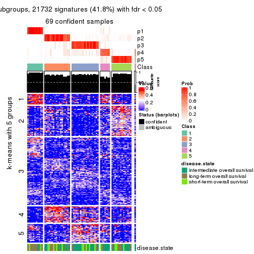</p>

</div>
<div id='tab-ATC-mclust-get-signatures-no-scale-5'>
<pre><code class="r">get_signatures(res, k = 6, scale_rows = FALSE)
</code></pre>

<p></p>

</div>
</div>


Compare the overlap of signatures from different k:

```r
compare_signatures(res)
```


`get_signature()` returns a data frame invisibly. TO get the list of signatures, the function
call should be assigned to a variable explicitly. In following code, if `plot` argument is set
to `FALSE`, no heatmap is plotted while only the differential analysis is performed.

```r
# code only for demonstration
tb = get_signature(res, k = ..., plot = FALSE)
```

An example of the output of `tb` is:

```
#>   which_row         fdr    mean_1    mean_2 scaled_mean_1 scaled_mean_2 km
#> 1        38 0.042760348  8.373488  9.131774    -0.5533452     0.5164555  1
#> 2        40 0.018707592  7.106213  8.469186    -0.6173731     0.5762149  1
#> 3        55 0.019134737 10.221463 11.207825    -0.6159697     0.5749050  1
#> 4        59 0.006059896  5.921854  7.869574    -0.6899429     0.6439467  1
#> 5        60 0.018055526  8.928898 10.211722    -0.6204761     0.5791110  1
#> 6        98 0.009384629 15.714769 14.887706     0.6635654    -0.6193277  2
...
```

The columns in `tb` are:

1. `which_row`: row indices corresponding to the input matrix.
2. `fdr`: FDR for the differential test. 
3. `mean_x`: The mean value in group x.
4. `scaled_mean_x`: The mean value in group x after rows are scaled.
5. `km`: Row groups if k-means clustering is applied to rows.


UMAP plot which shows how samples are separated.


<script>
$( function() {
	$( '#tabs-ATC-mclust-dimension-reduction' ).tabs();
} );
</script>
<div id='tabs-ATC-mclust-dimension-reduction'>
<ul>
<li><a href='#tab-ATC-mclust-dimension-reduction-1'>k = 2</a></li>
<li><a href='#tab-ATC-mclust-dimension-reduction-2'>k = 3</a></li>
<li><a href='#tab-ATC-mclust-dimension-reduction-3'>k = 4</a></li>
<li><a href='#tab-ATC-mclust-dimension-reduction-4'>k = 5</a></li>
<li><a href='#tab-ATC-mclust-dimension-reduction-5'>k = 6</a></li>
</ul>
<div id='tab-ATC-mclust-dimension-reduction-1'>
<pre><code class="r">dimension_reduction(res, k = 2, method = &quot;UMAP&quot;)
</code></pre>

<p></p>

</div>
<div id='tab-ATC-mclust-dimension-reduction-2'>
<pre><code class="r">dimension_reduction(res, k = 3, method = &quot;UMAP&quot;)
</code></pre>

<p></p>

</div>
<div id='tab-ATC-mclust-dimension-reduction-3'>
<pre><code class="r">dimension_reduction(res, k = 4, method = &quot;UMAP&quot;)
</code></pre>

<p></p>

</div>
<div id='tab-ATC-mclust-dimension-reduction-4'>
<pre><code class="r">dimension_reduction(res, k = 5, method = &quot;UMAP&quot;)
</code></pre>

<p></p>

</div>
<div id='tab-ATC-mclust-dimension-reduction-5'>
<pre><code class="r">dimension_reduction(res, k = 6, method = &quot;UMAP&quot;)
</code></pre>

<p></p>

</div>
</div>


Following heatmap shows how subgroups are split when increasing `k`:

```r
collect_classes(res)
```


Test correlation between subgroups and known annotations. If the known
annotation is numeric, one-way ANOVA test is applied, and if the known
annotation is discrete, chi-squared contingency table test is applied.

```r
test_to_known_factors(res)
```

```
#>             n disease.state(p) k
#> ATC:mclust 69           0.2299 2
#> ATC:mclust 63           0.1034 3
#> ATC:mclust 69           0.1415 4
#> ATC:mclust 69           0.0949 5
#> ATC:mclust 69           0.0350 6
```


If matrix rows can be associated to genes, consider to use `GO_Enrichment(res,
...)` to perform function enrichment for the signature genes.


 

---------------------------------------------------


### ATC:NMF**


The object with results only for a single top-value method and a single partition method 
can be extracted as:

```r
res = res_list["ATC", "NMF"]
# you can also extract it by
# res = res_list["ATC:NMF"]
```

A summary of `res` and all the functions that can be applied to it:

```r
res
```

```
#> A 'ConsensusPartition' object with k = 2, 3, 4, 5, 6.
#>   On a matrix with 51941 rows and 70 columns.
#>   Top rows (1000, 2000, 3000, 4000, 5000) are extracted by 'ATC' method.
#>   Subgroups are detected by 'NMF' method.
#>   Performed in total 1250 partitions by row resampling.
#>   Best k for subgroups seems to be 4.
#> 
#> Following methods can be applied to this 'ConsensusPartition' object:
#>  [1] "cola_report"             "collect_classes"         "collect_plots"          
#>  [4] "collect_stats"           "colnames"                "compare_signatures"     
#>  [7] "consensus_heatmap"       "dimension_reduction"     "functional_enrichment"  
#> [10] "get_anno_col"            "get_anno"                "get_classes"            
#> [13] "get_consensus"           "get_matrix"              "get_membership"         
#> [16] "get_param"               "get_signatures"          "get_stats"              
#> [19] "is_best_k"               "is_stable_k"             "membership_heatmap"     
#> [22] "ncol"                    "nrow"                    "plot_ecdf"              
#> [25] "rownames"                "select_partition_number" "show"                   
#> [28] "suggest_best_k"          "test_to_known_factors"
```

`collect_plots()` function collects all the plots made from `res` for all `k` (number of partitions)
into one single page to provide an easy and fast comparison between different `k`.

```r
collect_plots(res)
```


The plots are:

- The first row: a plot of the ECDF (Empirical cumulative distribution
  function) curves of the consensus matrix for each `k` and the heatmap of
  predicted classes for each `k`.
- The second row: heatmaps of the consensus matrix for each `k`.
- The third row: heatmaps of the membership matrix for each `k`.
- The fouth row: heatmaps of the signatures for each `k`.

All the plots in panels can be made by individual functions and they are
plotted later in this section.

`select_partition_number()` produces several plots showing different
statistics for choosing "optimized" `k`. There are following statistics:

- ECDF curves of the consensus matrix for each `k`;
- 1-PAC. [The PAC
  score](https://en.wikipedia.org/wiki/Consensus_clustering#Over-interpretation_potential_of_consensus_clustering)
  measures the proportion of the ambiguous subgrouping.
- Mean silhouette score.
- Concordance. The mean probability of fiting the consensus class ids in all
  partitions.
- Area increased. Denote $A_k$ as the area under the ECDF curve for current
  `k`, the area increased is defined as $A_k - A_{k-1}$.
- Rand index. The percent of pairs of samples that are both in a same cluster
  or both are not in a same cluster in the partition of k and k-1.
- Jaccard index. The ratio of pairs of samples are both in a same cluster in
  the partition of k and k-1 and the pairs of samples are both in a same
  cluster in the partition k or k-1.

The detailed explanations of these statistics can be found in [the cola
vignette](http://bioconductor.org/packages/devel/bioc/vignettes/cola/inst/doc/cola.html#toc_13).

Generally speaking, lower PAC score, higher mean silhouette score or higher
concordance corresponds to better partition. Rand index and Jaccard index
measure how similar the current partition is compared to partition with `k-1`.
If they are too similar, we won't accept `k` is better than `k-1`.

```r
select_partition_number(res)
```


The numeric values for all these statistics can be obtained by `get_stats()`.

```r
get_stats(res)
```

```
#>   k 1-PAC mean_silhouette concordance area_increased  Rand Jaccard
#> 2 2 1.000           0.972       0.989         0.4937 0.503   0.503
#> 3 3 1.000           0.943       0.978         0.3598 0.740   0.522
#> 4 4 0.961           0.939       0.972         0.1282 0.833   0.545
#> 5 5 0.793           0.797       0.876         0.0521 0.913   0.673
#> 6 6 0.762           0.569       0.786         0.0421 0.947   0.765
```

`suggest_best_k()` suggests the best $k$ based on these statistics. The rules are as follows:

- All $k$ with Jaccard index larger than 0.95 are removed because the increase of
  the partition number does not provides enough extra information. If all $k$ are removed,
  the best $k$ is assigned by `NA`.
- For $k$ with 1-PAC larger than 0.9, the maximal $k$ is taken as the "best k". Other $k$ is called "optional k".
- If it does not fit the second rule. The $k$ with the highest vote of highest
  1-PAC, mean silhouette and concordance is taken as the "best k".

```r
suggest_best_k(res)
```

```
#> [1] 4
#> attr(,"optional")
#> [1] 2 3
```

There is also optional best $k$ = 2 3 that is worth to check.

Following shows the table of the partitions (You need to click the **show/hide
code output** link to see it). The membership matrix (columns with name `p*`)
is inferred by
[`clue::cl_consensus()`](https://www.rdocumentation.org/link/cl_consensus?package=clue)
function with the `SE` method. Basically the value in the membership matrix
represents the probability to belong to a certain group. The finall class
label for an item is determined with the group with highest probability it
belongs to.

In `get_classes()` function, the entropy is calculated from the membership
matrix and the silhouette score is calculated from the consensus matrix.


<script>
$( function() {
	$( '#tabs-ATC-NMF-get-classes' ).tabs();
} );
</script>
<div id='tabs-ATC-NMF-get-classes'>
<ul>
<li><a href='#tab-ATC-NMF-get-classes-1'>k = 2</a></li>
<li><a href='#tab-ATC-NMF-get-classes-2'>k = 3</a></li>
<li><a href='#tab-ATC-NMF-get-classes-3'>k = 4</a></li>
<li><a href='#tab-ATC-NMF-get-classes-4'>k = 5</a></li>
<li><a href='#tab-ATC-NMF-get-classes-5'>k = 6</a></li>
</ul>

<div id='tab-ATC-NMF-get-classes-1'>
<p><a id='tab-ATC-NMF-get-classes-1-a' style='color:#0366d6' href='#'>show/hide code output</a></p>
<pre><code class="r">cbind(get_classes(res, k = 2), get_membership(res, k = 2))
</code></pre>

<pre><code>#&gt;            class entropy silhouette    p1    p2
#&gt; GSM1299517     1  0.0000      1.000 1.000 0.000
#&gt; GSM1299518     1  0.0000      1.000 1.000 0.000
#&gt; GSM1299519     2  0.0000      0.973 0.000 1.000
#&gt; GSM1299520     2  0.0000      0.973 0.000 1.000
#&gt; GSM1299521     2  0.9491      0.435 0.368 0.632
#&gt; GSM1299522     2  0.0000      0.973 0.000 1.000
#&gt; GSM1299523     2  0.9686      0.366 0.396 0.604
#&gt; GSM1299524     1  0.0000      1.000 1.000 0.000
#&gt; GSM1299525     2  0.0000      0.973 0.000 1.000
#&gt; GSM1299526     1  0.0000      1.000 1.000 0.000
#&gt; GSM1299527     1  0.0000      1.000 1.000 0.000
#&gt; GSM1299528     2  0.0000      0.973 0.000 1.000
#&gt; GSM1299529     2  0.0000      0.973 0.000 1.000
#&gt; GSM1299530     1  0.0000      1.000 1.000 0.000
#&gt; GSM1299531     2  0.0000      0.973 0.000 1.000
#&gt; GSM1299575     1  0.0000      1.000 1.000 0.000
#&gt; GSM1299532     1  0.0000      1.000 1.000 0.000
#&gt; GSM1299533     1  0.0000      1.000 1.000 0.000
#&gt; GSM1299534     2  0.0000      0.973 0.000 1.000
#&gt; GSM1299535     1  0.0000      1.000 1.000 0.000
#&gt; GSM1299536     2  0.0000      0.973 0.000 1.000
#&gt; GSM1299537     1  0.0000      1.000 1.000 0.000
#&gt; GSM1299538     2  0.0000      0.973 0.000 1.000
#&gt; GSM1299539     2  0.0000      0.973 0.000 1.000
#&gt; GSM1299540     1  0.0000      1.000 1.000 0.000
#&gt; GSM1299541     1  0.0000      1.000 1.000 0.000
#&gt; GSM1299542     1  0.0000      1.000 1.000 0.000
#&gt; GSM1299543     2  0.0000      0.973 0.000 1.000
#&gt; GSM1299544     2  0.0000      0.973 0.000 1.000
#&gt; GSM1299545     1  0.0000      1.000 1.000 0.000
#&gt; GSM1299546     2  0.0000      0.973 0.000 1.000
#&gt; GSM1299547     2  0.0000      0.973 0.000 1.000
#&gt; GSM1299548     1  0.0000      1.000 1.000 0.000
#&gt; GSM1299549     1  0.0000      1.000 1.000 0.000
#&gt; GSM1299550     2  0.0000      0.973 0.000 1.000
#&gt; GSM1299551     2  0.0000      0.973 0.000 1.000
#&gt; GSM1299552     1  0.0000      1.000 1.000 0.000
#&gt; GSM1299553     1  0.0938      0.987 0.988 0.012
#&gt; GSM1299554     2  0.0000      0.973 0.000 1.000
#&gt; GSM1299555     1  0.0000      1.000 1.000 0.000
#&gt; GSM1299556     1  0.0000      1.000 1.000 0.000
#&gt; GSM1299557     1  0.0000      1.000 1.000 0.000
#&gt; GSM1299558     2  0.0000      0.973 0.000 1.000
#&gt; GSM1299559     1  0.0000      1.000 1.000 0.000
#&gt; GSM1299560     1  0.0000      1.000 1.000 0.000
#&gt; GSM1299576     1  0.0000      1.000 1.000 0.000
#&gt; GSM1299577     1  0.0000      1.000 1.000 0.000
#&gt; GSM1299561     1  0.0000      1.000 1.000 0.000
#&gt; GSM1299562     2  0.0000      0.973 0.000 1.000
#&gt; GSM1299563     2  0.0000      0.973 0.000 1.000
#&gt; GSM1299564     2  0.0000      0.973 0.000 1.000
#&gt; GSM1299565     2  0.0000      0.973 0.000 1.000
#&gt; GSM1299566     2  0.0000      0.973 0.000 1.000
#&gt; GSM1299567     1  0.0000      1.000 1.000 0.000
#&gt; GSM1299568     2  0.0000      0.973 0.000 1.000
#&gt; GSM1299569     2  0.0000      0.973 0.000 1.000
#&gt; GSM1299570     1  0.0000      1.000 1.000 0.000
#&gt; GSM1299571     1  0.0000      1.000 1.000 0.000
#&gt; GSM1299572     1  0.0000      1.000 1.000 0.000
#&gt; GSM1299573     1  0.0000      1.000 1.000 0.000
#&gt; GSM1299574     2  0.0000      0.973 0.000 1.000
#&gt; GSM1299578     1  0.0000      1.000 1.000 0.000
#&gt; GSM1299579     2  0.0000      0.973 0.000 1.000
#&gt; GSM1299580     1  0.0000      1.000 1.000 0.000
#&gt; GSM1299581     1  0.0000      1.000 1.000 0.000
#&gt; GSM1299582     1  0.0000      1.000 1.000 0.000
#&gt; GSM1299583     1  0.0000      1.000 1.000 0.000
#&gt; GSM1299584     1  0.0000      1.000 1.000 0.000
#&gt; GSM1299585     1  0.0000      1.000 1.000 0.000
#&gt; GSM1299586     1  0.0000      1.000 1.000 0.000
</code></pre>

<script>
$('#tab-ATC-NMF-get-classes-1-a').parent().next().next().hide();
$('#tab-ATC-NMF-get-classes-1-a').click(function(){
  $('#tab-ATC-NMF-get-classes-1-a').parent().next().next().toggle();
  return(false);
});
</script>
</div>

<div id='tab-ATC-NMF-get-classes-2'>
<p><a id='tab-ATC-NMF-get-classes-2-a' style='color:#0366d6' href='#'>show/hide code output</a></p>
<pre><code class="r">cbind(get_classes(res, k = 3), get_membership(res, k = 3))
</code></pre>

<pre><code>#&gt;            class entropy silhouette    p1    p2    p3
#&gt; GSM1299517     3  0.0000      0.952 0.000 0.000 1.000
#&gt; GSM1299518     3  0.0000      0.952 0.000 0.000 1.000
#&gt; GSM1299519     3  0.6168      0.347 0.000 0.412 0.588
#&gt; GSM1299520     2  0.0000      0.999 0.000 1.000 0.000
#&gt; GSM1299521     1  0.0000      0.975 1.000 0.000 0.000
#&gt; GSM1299522     2  0.0000      0.999 0.000 1.000 0.000
#&gt; GSM1299523     1  0.0000      0.975 1.000 0.000 0.000
#&gt; GSM1299524     3  0.0000      0.952 0.000 0.000 1.000
#&gt; GSM1299525     2  0.0000      0.999 0.000 1.000 0.000
#&gt; GSM1299526     3  0.0000      0.952 0.000 0.000 1.000
#&gt; GSM1299527     3  0.0000      0.952 0.000 0.000 1.000
#&gt; GSM1299528     2  0.0000      0.999 0.000 1.000 0.000
#&gt; GSM1299529     2  0.0000      0.999 0.000 1.000 0.000
#&gt; GSM1299530     1  0.0000      0.975 1.000 0.000 0.000
#&gt; GSM1299531     2  0.0000      0.999 0.000 1.000 0.000
#&gt; GSM1299575     1  0.0000      0.975 1.000 0.000 0.000
#&gt; GSM1299532     3  0.0000      0.952 0.000 0.000 1.000
#&gt; GSM1299533     3  0.0000      0.952 0.000 0.000 1.000
#&gt; GSM1299534     2  0.0000      0.999 0.000 1.000 0.000
#&gt; GSM1299535     3  0.0000      0.952 0.000 0.000 1.000
#&gt; GSM1299536     2  0.0000      0.999 0.000 1.000 0.000
#&gt; GSM1299537     3  0.0000      0.952 0.000 0.000 1.000
#&gt; GSM1299538     2  0.0000      0.999 0.000 1.000 0.000
#&gt; GSM1299539     2  0.0000      0.999 0.000 1.000 0.000
#&gt; GSM1299540     3  0.0000      0.952 0.000 0.000 1.000
#&gt; GSM1299541     3  0.0000      0.952 0.000 0.000 1.000
#&gt; GSM1299542     3  0.0000      0.952 0.000 0.000 1.000
#&gt; GSM1299543     2  0.0000      0.999 0.000 1.000 0.000
#&gt; GSM1299544     2  0.0000      0.999 0.000 1.000 0.000
#&gt; GSM1299545     1  0.0000      0.975 1.000 0.000 0.000
#&gt; GSM1299546     2  0.0000      0.999 0.000 1.000 0.000
#&gt; GSM1299547     2  0.0000      0.999 0.000 1.000 0.000
#&gt; GSM1299548     3  0.0000      0.952 0.000 0.000 1.000
#&gt; GSM1299549     1  0.0000      0.975 1.000 0.000 0.000
#&gt; GSM1299550     2  0.0000      0.999 0.000 1.000 0.000
#&gt; GSM1299551     2  0.0000      0.999 0.000 1.000 0.000
#&gt; GSM1299552     1  0.0000      0.975 1.000 0.000 0.000
#&gt; GSM1299553     1  0.0000      0.975 1.000 0.000 0.000
#&gt; GSM1299554     2  0.0000      0.999 0.000 1.000 0.000
#&gt; GSM1299555     3  0.0000      0.952 0.000 0.000 1.000
#&gt; GSM1299556     3  0.0000      0.952 0.000 0.000 1.000
#&gt; GSM1299557     3  0.0000      0.952 0.000 0.000 1.000
#&gt; GSM1299558     2  0.0000      0.999 0.000 1.000 0.000
#&gt; GSM1299559     3  0.0000      0.952 0.000 0.000 1.000
#&gt; GSM1299560     3  0.0000      0.952 0.000 0.000 1.000
#&gt; GSM1299576     1  0.0000      0.975 1.000 0.000 0.000
#&gt; GSM1299577     1  0.0000      0.975 1.000 0.000 0.000
#&gt; GSM1299561     3  0.0000      0.952 0.000 0.000 1.000
#&gt; GSM1299562     3  0.5254      0.654 0.000 0.264 0.736
#&gt; GSM1299563     2  0.0000      0.999 0.000 1.000 0.000
#&gt; GSM1299564     2  0.0000      0.999 0.000 1.000 0.000
#&gt; GSM1299565     2  0.0592      0.987 0.000 0.988 0.012
#&gt; GSM1299566     2  0.0000      0.999 0.000 1.000 0.000
#&gt; GSM1299567     1  0.6286      0.147 0.536 0.000 0.464
#&gt; GSM1299568     2  0.0000      0.999 0.000 1.000 0.000
#&gt; GSM1299569     2  0.0000      0.999 0.000 1.000 0.000
#&gt; GSM1299570     1  0.0000      0.975 1.000 0.000 0.000
#&gt; GSM1299571     3  0.0000      0.952 0.000 0.000 1.000
#&gt; GSM1299572     3  0.0424      0.945 0.008 0.000 0.992
#&gt; GSM1299573     3  0.0000      0.952 0.000 0.000 1.000
#&gt; GSM1299574     3  0.5988      0.454 0.000 0.368 0.632
#&gt; GSM1299578     1  0.0000      0.975 1.000 0.000 0.000
#&gt; GSM1299579     2  0.0000      0.999 0.000 1.000 0.000
#&gt; GSM1299580     1  0.0000      0.975 1.000 0.000 0.000
#&gt; GSM1299581     1  0.0000      0.975 1.000 0.000 0.000
#&gt; GSM1299582     1  0.0000      0.975 1.000 0.000 0.000
#&gt; GSM1299583     1  0.0000      0.975 1.000 0.000 0.000
#&gt; GSM1299584     1  0.0000      0.975 1.000 0.000 0.000
#&gt; GSM1299585     1  0.0000      0.975 1.000 0.000 0.000
#&gt; GSM1299586     1  0.0000      0.975 1.000 0.000 0.000
</code></pre>

<script>
$('#tab-ATC-NMF-get-classes-2-a').parent().next().next().hide();
$('#tab-ATC-NMF-get-classes-2-a').click(function(){
  $('#tab-ATC-NMF-get-classes-2-a').parent().next().next().toggle();
  return(false);
});
</script>
</div>

<div id='tab-ATC-NMF-get-classes-3'>
<p><a id='tab-ATC-NMF-get-classes-3-a' style='color:#0366d6' href='#'>show/hide code output</a></p>
<pre><code class="r">cbind(get_classes(res, k = 4), get_membership(res, k = 4))
</code></pre>

<pre><code>#&gt;            class entropy silhouette    p1    p2    p3    p4
#&gt; GSM1299517     3  0.0000      1.000 0.000 0.000 1.000 0.000
#&gt; GSM1299518     3  0.0000      1.000 0.000 0.000 1.000 0.000
#&gt; GSM1299519     2  0.0000      0.902 0.000 1.000 0.000 0.000
#&gt; GSM1299520     4  0.0000      0.968 0.000 0.000 0.000 1.000
#&gt; GSM1299521     1  0.0000      0.997 1.000 0.000 0.000 0.000
#&gt; GSM1299522     2  0.0000      0.902 0.000 1.000 0.000 0.000
#&gt; GSM1299523     4  0.1557      0.917 0.056 0.000 0.000 0.944
#&gt; GSM1299524     3  0.0000      1.000 0.000 0.000 1.000 0.000
#&gt; GSM1299525     4  0.4304      0.610 0.000 0.284 0.000 0.716
#&gt; GSM1299526     3  0.0000      1.000 0.000 0.000 1.000 0.000
#&gt; GSM1299527     3  0.0000      1.000 0.000 0.000 1.000 0.000
#&gt; GSM1299528     4  0.0000      0.968 0.000 0.000 0.000 1.000
#&gt; GSM1299529     2  0.0921      0.889 0.000 0.972 0.000 0.028
#&gt; GSM1299530     1  0.0000      0.997 1.000 0.000 0.000 0.000
#&gt; GSM1299531     2  0.0000      0.902 0.000 1.000 0.000 0.000
#&gt; GSM1299575     1  0.0000      0.997 1.000 0.000 0.000 0.000
#&gt; GSM1299532     3  0.0188      0.996 0.000 0.004 0.996 0.000
#&gt; GSM1299533     2  0.4961      0.260 0.000 0.552 0.448 0.000
#&gt; GSM1299534     4  0.0000      0.968 0.000 0.000 0.000 1.000
#&gt; GSM1299535     2  0.3024      0.804 0.000 0.852 0.148 0.000
#&gt; GSM1299536     4  0.0000      0.968 0.000 0.000 0.000 1.000
#&gt; GSM1299537     3  0.0000      1.000 0.000 0.000 1.000 0.000
#&gt; GSM1299538     4  0.0000      0.968 0.000 0.000 0.000 1.000
#&gt; GSM1299539     4  0.0000      0.968 0.000 0.000 0.000 1.000
#&gt; GSM1299540     3  0.0000      1.000 0.000 0.000 1.000 0.000
#&gt; GSM1299541     3  0.0000      1.000 0.000 0.000 1.000 0.000
#&gt; GSM1299542     3  0.0000      1.000 0.000 0.000 1.000 0.000
#&gt; GSM1299543     2  0.3123      0.764 0.000 0.844 0.000 0.156
#&gt; GSM1299544     4  0.0000      0.968 0.000 0.000 0.000 1.000
#&gt; GSM1299545     1  0.1302      0.948 0.956 0.000 0.044 0.000
#&gt; GSM1299546     2  0.0000      0.902 0.000 1.000 0.000 0.000
#&gt; GSM1299547     4  0.0000      0.968 0.000 0.000 0.000 1.000
#&gt; GSM1299548     3  0.0000      1.000 0.000 0.000 1.000 0.000
#&gt; GSM1299549     1  0.0000      0.997 1.000 0.000 0.000 0.000
#&gt; GSM1299550     4  0.0000      0.968 0.000 0.000 0.000 1.000
#&gt; GSM1299551     2  0.0000      0.902 0.000 1.000 0.000 0.000
#&gt; GSM1299552     1  0.0000      0.997 1.000 0.000 0.000 0.000
#&gt; GSM1299553     1  0.0000      0.997 1.000 0.000 0.000 0.000
#&gt; GSM1299554     4  0.3024      0.826 0.000 0.148 0.000 0.852
#&gt; GSM1299555     3  0.0188      0.996 0.000 0.004 0.996 0.000
#&gt; GSM1299556     3  0.0000      1.000 0.000 0.000 1.000 0.000
#&gt; GSM1299557     3  0.0000      1.000 0.000 0.000 1.000 0.000
#&gt; GSM1299558     2  0.1022      0.886 0.000 0.968 0.000 0.032
#&gt; GSM1299559     3  0.0000      1.000 0.000 0.000 1.000 0.000
#&gt; GSM1299560     3  0.0000      1.000 0.000 0.000 1.000 0.000
#&gt; GSM1299576     1  0.0000      0.997 1.000 0.000 0.000 0.000
#&gt; GSM1299577     1  0.0000      0.997 1.000 0.000 0.000 0.000
#&gt; GSM1299561     3  0.0000      1.000 0.000 0.000 1.000 0.000
#&gt; GSM1299562     2  0.0000      0.902 0.000 1.000 0.000 0.000
#&gt; GSM1299563     4  0.0000      0.968 0.000 0.000 0.000 1.000
#&gt; GSM1299564     4  0.0000      0.968 0.000 0.000 0.000 1.000
#&gt; GSM1299565     2  0.0000      0.902 0.000 1.000 0.000 0.000
#&gt; GSM1299566     4  0.0000      0.968 0.000 0.000 0.000 1.000
#&gt; GSM1299567     3  0.0000      1.000 0.000 0.000 1.000 0.000
#&gt; GSM1299568     2  0.0336      0.899 0.000 0.992 0.000 0.008
#&gt; GSM1299569     4  0.0000      0.968 0.000 0.000 0.000 1.000
#&gt; GSM1299570     1  0.0000      0.997 1.000 0.000 0.000 0.000
#&gt; GSM1299571     2  0.3486      0.761 0.000 0.812 0.188 0.000
#&gt; GSM1299572     2  0.6052      0.485 0.320 0.616 0.064 0.000
#&gt; GSM1299573     3  0.0000      1.000 0.000 0.000 1.000 0.000
#&gt; GSM1299574     2  0.0000      0.902 0.000 1.000 0.000 0.000
#&gt; GSM1299578     1  0.0000      0.997 1.000 0.000 0.000 0.000
#&gt; GSM1299579     4  0.0000      0.968 0.000 0.000 0.000 1.000
#&gt; GSM1299580     1  0.0000      0.997 1.000 0.000 0.000 0.000
#&gt; GSM1299581     1  0.0000      0.997 1.000 0.000 0.000 0.000
#&gt; GSM1299582     1  0.0000      0.997 1.000 0.000 0.000 0.000
#&gt; GSM1299583     1  0.0000      0.997 1.000 0.000 0.000 0.000
#&gt; GSM1299584     1  0.0000      0.997 1.000 0.000 0.000 0.000
#&gt; GSM1299585     1  0.0000      0.997 1.000 0.000 0.000 0.000
#&gt; GSM1299586     1  0.0000      0.997 1.000 0.000 0.000 0.000
</code></pre>

<script>
$('#tab-ATC-NMF-get-classes-3-a').parent().next().next().hide();
$('#tab-ATC-NMF-get-classes-3-a').click(function(){
  $('#tab-ATC-NMF-get-classes-3-a').parent().next().next().toggle();
  return(false);
});
</script>
</div>

<div id='tab-ATC-NMF-get-classes-4'>
<p><a id='tab-ATC-NMF-get-classes-4-a' style='color:#0366d6' href='#'>show/hide code output</a></p>
<pre><code class="r">cbind(get_classes(res, k = 5), get_membership(res, k = 5))
</code></pre>

<pre><code>#&gt;            class entropy silhouette    p1    p2    p3    p4    p5
#&gt; GSM1299517     3  0.1121     0.8858 0.000 0.000 0.956 0.044 0.000
#&gt; GSM1299518     3  0.2871     0.8612 0.000 0.040 0.872 0.088 0.000
#&gt; GSM1299519     2  0.0162     0.7923 0.000 0.996 0.000 0.000 0.004
#&gt; GSM1299520     4  0.3452     0.8610 0.000 0.000 0.000 0.756 0.244
#&gt; GSM1299521     1  0.2605     0.8405 0.852 0.000 0.000 0.148 0.000
#&gt; GSM1299522     2  0.1851     0.7806 0.000 0.912 0.000 0.000 0.088
#&gt; GSM1299523     4  0.3300     0.8581 0.004 0.000 0.000 0.792 0.204
#&gt; GSM1299524     3  0.2535     0.8697 0.000 0.032 0.892 0.076 0.000
#&gt; GSM1299525     5  0.3242     0.6949 0.000 0.216 0.000 0.000 0.784
#&gt; GSM1299526     3  0.1579     0.8814 0.000 0.032 0.944 0.024 0.000
#&gt; GSM1299527     3  0.1892     0.8791 0.000 0.004 0.916 0.080 0.000
#&gt; GSM1299528     5  0.0290     0.8140 0.000 0.000 0.000 0.008 0.992
#&gt; GSM1299529     2  0.4278    -0.0045 0.000 0.548 0.000 0.000 0.452
#&gt; GSM1299530     4  0.3366     0.6395 0.232 0.000 0.000 0.768 0.000
#&gt; GSM1299531     2  0.2011     0.7801 0.000 0.908 0.000 0.004 0.088
#&gt; GSM1299575     1  0.1341     0.9407 0.944 0.000 0.000 0.056 0.000
#&gt; GSM1299532     3  0.4953     0.6547 0.000 0.216 0.696 0.088 0.000
#&gt; GSM1299533     2  0.4503     0.5139 0.000 0.664 0.312 0.024 0.000
#&gt; GSM1299534     5  0.1357     0.8064 0.000 0.004 0.000 0.048 0.948
#&gt; GSM1299535     2  0.3012     0.7384 0.000 0.852 0.124 0.024 0.000
#&gt; GSM1299536     5  0.1478     0.7838 0.000 0.000 0.000 0.064 0.936
#&gt; GSM1299537     3  0.0963     0.8864 0.000 0.000 0.964 0.036 0.000
#&gt; GSM1299538     5  0.2074     0.7448 0.000 0.000 0.000 0.104 0.896
#&gt; GSM1299539     5  0.1341     0.7905 0.000 0.000 0.000 0.056 0.944
#&gt; GSM1299540     3  0.1197     0.8851 0.000 0.000 0.952 0.048 0.000
#&gt; GSM1299541     3  0.1270     0.8853 0.000 0.000 0.948 0.052 0.000
#&gt; GSM1299542     3  0.1197     0.8859 0.000 0.000 0.952 0.048 0.000
#&gt; GSM1299543     5  0.3707     0.6071 0.000 0.284 0.000 0.000 0.716
#&gt; GSM1299544     5  0.0794     0.8144 0.000 0.028 0.000 0.000 0.972
#&gt; GSM1299545     3  0.6362     0.2265 0.368 0.000 0.464 0.168 0.000
#&gt; GSM1299546     2  0.1121     0.7932 0.000 0.956 0.000 0.000 0.044
#&gt; GSM1299547     4  0.3519     0.8639 0.008 0.000 0.000 0.776 0.216
#&gt; GSM1299548     3  0.1544     0.8790 0.000 0.000 0.932 0.068 0.000
#&gt; GSM1299549     1  0.0609     0.9511 0.980 0.000 0.000 0.020 0.000
#&gt; GSM1299550     5  0.1121     0.7984 0.000 0.000 0.000 0.044 0.956
#&gt; GSM1299551     2  0.1608     0.7875 0.000 0.928 0.000 0.000 0.072
#&gt; GSM1299552     1  0.1043     0.9432 0.960 0.000 0.000 0.040 0.000
#&gt; GSM1299553     4  0.3622     0.7713 0.136 0.000 0.000 0.816 0.048
#&gt; GSM1299554     5  0.3248     0.7723 0.000 0.048 0.040 0.040 0.872
#&gt; GSM1299555     3  0.3631     0.8324 0.000 0.072 0.824 0.104 0.000
#&gt; GSM1299556     3  0.1792     0.8724 0.000 0.000 0.916 0.084 0.000
#&gt; GSM1299557     3  0.1608     0.8790 0.000 0.000 0.928 0.072 0.000
#&gt; GSM1299558     5  0.4150     0.4185 0.000 0.388 0.000 0.000 0.612
#&gt; GSM1299559     3  0.1851     0.8704 0.000 0.000 0.912 0.088 0.000
#&gt; GSM1299560     3  0.2331     0.8732 0.000 0.020 0.900 0.080 0.000
#&gt; GSM1299576     1  0.0162     0.9540 0.996 0.000 0.000 0.004 0.000
#&gt; GSM1299577     1  0.2074     0.9031 0.896 0.000 0.000 0.104 0.000
#&gt; GSM1299561     3  0.1410     0.8852 0.000 0.000 0.940 0.060 0.000
#&gt; GSM1299562     2  0.4713     0.5694 0.000 0.676 0.044 0.280 0.000
#&gt; GSM1299563     4  0.3586     0.8405 0.000 0.000 0.000 0.736 0.264
#&gt; GSM1299564     4  0.3452     0.8610 0.000 0.000 0.000 0.756 0.244
#&gt; GSM1299565     2  0.1908     0.7779 0.000 0.908 0.000 0.000 0.092
#&gt; GSM1299566     5  0.0000     0.8158 0.000 0.000 0.000 0.000 1.000
#&gt; GSM1299567     3  0.3055     0.8334 0.016 0.000 0.840 0.144 0.000
#&gt; GSM1299568     5  0.4313     0.4784 0.000 0.356 0.008 0.000 0.636
#&gt; GSM1299569     5  0.0290     0.8165 0.000 0.008 0.000 0.000 0.992
#&gt; GSM1299570     1  0.2424     0.8926 0.868 0.000 0.000 0.132 0.000
#&gt; GSM1299571     2  0.3012     0.7397 0.000 0.852 0.124 0.024 0.000
#&gt; GSM1299572     2  0.6010     0.5504 0.012 0.624 0.176 0.188 0.000
#&gt; GSM1299573     3  0.1792     0.8804 0.000 0.000 0.916 0.084 0.000
#&gt; GSM1299574     2  0.0290     0.7931 0.000 0.992 0.000 0.000 0.008
#&gt; GSM1299578     1  0.0000     0.9540 1.000 0.000 0.000 0.000 0.000
#&gt; GSM1299579     5  0.2471     0.7056 0.000 0.000 0.000 0.136 0.864
#&gt; GSM1299580     1  0.1851     0.9188 0.912 0.000 0.000 0.088 0.000
#&gt; GSM1299581     1  0.0290     0.9536 0.992 0.000 0.000 0.008 0.000
#&gt; GSM1299582     1  0.0404     0.9533 0.988 0.000 0.000 0.012 0.000
#&gt; GSM1299583     1  0.0162     0.9538 0.996 0.000 0.000 0.004 0.000
#&gt; GSM1299584     1  0.1270     0.9418 0.948 0.000 0.000 0.052 0.000
#&gt; GSM1299585     1  0.0290     0.9537 0.992 0.000 0.000 0.008 0.000
#&gt; GSM1299586     1  0.0794     0.9494 0.972 0.000 0.000 0.028 0.000
</code></pre>

<script>
$('#tab-ATC-NMF-get-classes-4-a').parent().next().next().hide();
$('#tab-ATC-NMF-get-classes-4-a').click(function(){
  $('#tab-ATC-NMF-get-classes-4-a').parent().next().next().toggle();
  return(false);
});
</script>
</div>

<div id='tab-ATC-NMF-get-classes-5'>
<p><a id='tab-ATC-NMF-get-classes-5-a' style='color:#0366d6' href='#'>show/hide code output</a></p>
<pre><code class="r">cbind(get_classes(res, k = 6), get_membership(res, k = 6))
</code></pre>

<pre><code>#&gt;            class entropy silhouette    p1    p2    p3    p4    p5    p6
#&gt; GSM1299517     3  0.2165     0.5343 0.000 0.000 0.884 0.008 0.000 0.108
#&gt; GSM1299518     3  0.4076     0.2236 0.000 0.008 0.540 0.000 0.000 0.452
#&gt; GSM1299519     2  0.0790     0.7145 0.000 0.968 0.000 0.000 0.000 0.032
#&gt; GSM1299520     4  0.1196     0.9644 0.000 0.000 0.000 0.952 0.040 0.008
#&gt; GSM1299521     1  0.3110     0.7488 0.848 0.000 0.000 0.072 0.008 0.072
#&gt; GSM1299522     2  0.0692     0.7257 0.000 0.976 0.000 0.000 0.020 0.004
#&gt; GSM1299523     4  0.1036     0.9639 0.004 0.000 0.000 0.964 0.024 0.008
#&gt; GSM1299524     3  0.3923     0.2829 0.000 0.000 0.580 0.004 0.000 0.416
#&gt; GSM1299525     2  0.3975     0.0649 0.000 0.544 0.000 0.000 0.452 0.004
#&gt; GSM1299526     3  0.3710     0.3989 0.000 0.000 0.696 0.012 0.000 0.292
#&gt; GSM1299527     3  0.3659     0.3760 0.000 0.000 0.636 0.000 0.000 0.364
#&gt; GSM1299528     5  0.0260     0.8082 0.000 0.008 0.000 0.000 0.992 0.000
#&gt; GSM1299529     2  0.3076     0.5441 0.000 0.760 0.000 0.000 0.240 0.000
#&gt; GSM1299530     4  0.1176     0.9453 0.024 0.000 0.000 0.956 0.000 0.020
#&gt; GSM1299531     2  0.1578     0.7131 0.000 0.936 0.000 0.012 0.048 0.004
#&gt; GSM1299575     1  0.3819     0.7440 0.652 0.000 0.000 0.008 0.000 0.340
#&gt; GSM1299532     3  0.5033     0.0522 0.000 0.072 0.476 0.000 0.000 0.452
#&gt; GSM1299533     3  0.6555    -0.0865 0.016 0.208 0.432 0.012 0.000 0.332
#&gt; GSM1299534     5  0.5360     0.6362 0.000 0.144 0.000 0.080 0.684 0.092
#&gt; GSM1299535     2  0.5973    -0.0547 0.000 0.476 0.164 0.012 0.000 0.348
#&gt; GSM1299536     5  0.1498     0.7940 0.000 0.000 0.000 0.028 0.940 0.032
#&gt; GSM1299537     3  0.0547     0.5462 0.000 0.000 0.980 0.000 0.000 0.020
#&gt; GSM1299538     5  0.2527     0.7542 0.000 0.000 0.000 0.108 0.868 0.024
#&gt; GSM1299539     5  0.0820     0.8042 0.000 0.000 0.000 0.016 0.972 0.012
#&gt; GSM1299540     3  0.1663     0.5091 0.000 0.000 0.912 0.000 0.000 0.088
#&gt; GSM1299541     3  0.0632     0.5407 0.000 0.000 0.976 0.000 0.000 0.024
#&gt; GSM1299542     3  0.3151     0.4720 0.000 0.000 0.748 0.000 0.000 0.252
#&gt; GSM1299543     5  0.3868    -0.0423 0.000 0.496 0.000 0.000 0.504 0.000
#&gt; GSM1299544     5  0.1007     0.7965 0.000 0.044 0.000 0.000 0.956 0.000
#&gt; GSM1299545     6  0.6805    -0.0372 0.116 0.000 0.376 0.104 0.000 0.404
#&gt; GSM1299546     2  0.0146     0.7265 0.000 0.996 0.000 0.000 0.004 0.000
#&gt; GSM1299547     4  0.0632     0.9653 0.000 0.000 0.000 0.976 0.024 0.000
#&gt; GSM1299548     3  0.0937     0.5306 0.000 0.000 0.960 0.000 0.000 0.040
#&gt; GSM1299549     1  0.2526     0.7660 0.876 0.000 0.004 0.024 0.000 0.096
#&gt; GSM1299550     5  0.0146     0.8081 0.000 0.000 0.000 0.004 0.996 0.000
#&gt; GSM1299551     2  0.0777     0.7260 0.000 0.972 0.000 0.000 0.024 0.004
#&gt; GSM1299552     1  0.2436     0.7724 0.880 0.000 0.000 0.032 0.000 0.088
#&gt; GSM1299553     4  0.1563     0.9208 0.012 0.000 0.000 0.932 0.000 0.056
#&gt; GSM1299554     5  0.6584     0.4712 0.020 0.048 0.092 0.016 0.568 0.256
#&gt; GSM1299555     6  0.5017    -0.3375 0.000 0.044 0.460 0.012 0.000 0.484
#&gt; GSM1299556     3  0.1714     0.4950 0.000 0.000 0.908 0.000 0.000 0.092
#&gt; GSM1299557     3  0.2513     0.4593 0.000 0.000 0.852 0.008 0.000 0.140
#&gt; GSM1299558     2  0.3789     0.1869 0.000 0.584 0.000 0.000 0.416 0.000
#&gt; GSM1299559     3  0.1863     0.4825 0.000 0.000 0.896 0.000 0.000 0.104
#&gt; GSM1299560     3  0.3765     0.3130 0.000 0.000 0.596 0.000 0.000 0.404
#&gt; GSM1299576     1  0.2178     0.8237 0.868 0.000 0.000 0.000 0.000 0.132
#&gt; GSM1299577     1  0.4234     0.7735 0.676 0.000 0.000 0.044 0.000 0.280
#&gt; GSM1299561     3  0.2996     0.4791 0.000 0.000 0.772 0.000 0.000 0.228
#&gt; GSM1299562     2  0.5530     0.1882 0.000 0.496 0.000 0.364 0.000 0.140
#&gt; GSM1299563     4  0.1075     0.9617 0.000 0.000 0.000 0.952 0.048 0.000
#&gt; GSM1299564     4  0.1007     0.9642 0.000 0.000 0.000 0.956 0.044 0.000
#&gt; GSM1299565     2  0.1794     0.7239 0.000 0.924 0.000 0.000 0.040 0.036
#&gt; GSM1299566     5  0.0260     0.8082 0.000 0.008 0.000 0.000 0.992 0.000
#&gt; GSM1299567     3  0.4179     0.0945 0.016 0.000 0.652 0.008 0.000 0.324
#&gt; GSM1299568     5  0.5537     0.4990 0.000 0.192 0.016 0.000 0.612 0.180
#&gt; GSM1299569     5  0.0858     0.8034 0.000 0.028 0.000 0.000 0.968 0.004
#&gt; GSM1299570     1  0.6095     0.5922 0.476 0.000 0.016 0.148 0.004 0.356
#&gt; GSM1299571     2  0.5789     0.0783 0.000 0.520 0.144 0.012 0.000 0.324
#&gt; GSM1299572     6  0.7479     0.0755 0.124 0.112 0.232 0.048 0.000 0.484
#&gt; GSM1299573     3  0.3390     0.4341 0.000 0.000 0.704 0.000 0.000 0.296
#&gt; GSM1299574     2  0.0790     0.7158 0.000 0.968 0.000 0.000 0.000 0.032
#&gt; GSM1299578     1  0.1007     0.8120 0.956 0.000 0.000 0.000 0.000 0.044
#&gt; GSM1299579     5  0.4218     0.6881 0.064 0.000 0.000 0.108 0.780 0.048
#&gt; GSM1299580     1  0.4101     0.7274 0.632 0.000 0.008 0.008 0.000 0.352
#&gt; GSM1299581     1  0.1908     0.8245 0.900 0.000 0.000 0.004 0.000 0.096
#&gt; GSM1299582     1  0.2706     0.8210 0.832 0.000 0.000 0.008 0.000 0.160
#&gt; GSM1299583     1  0.0547     0.8054 0.980 0.000 0.000 0.000 0.000 0.020
#&gt; GSM1299584     1  0.3690     0.7645 0.684 0.000 0.000 0.008 0.000 0.308
#&gt; GSM1299585     1  0.0972     0.8004 0.964 0.000 0.000 0.008 0.000 0.028
#&gt; GSM1299586     1  0.2703     0.8195 0.824 0.000 0.000 0.004 0.000 0.172
</code></pre>

<script>
$('#tab-ATC-NMF-get-classes-5-a').parent().next().next().hide();
$('#tab-ATC-NMF-get-classes-5-a').click(function(){
  $('#tab-ATC-NMF-get-classes-5-a').parent().next().next().toggle();
  return(false);
});
</script>
</div>
</div>

Heatmaps for the consensus matrix. It visualizes the probability of two
samples to be in a same group.


<script>
$( function() {
	$( '#tabs-ATC-NMF-consensus-heatmap' ).tabs();
} );
</script>
<div id='tabs-ATC-NMF-consensus-heatmap'>
<ul>
<li><a href='#tab-ATC-NMF-consensus-heatmap-1'>k = 2</a></li>
<li><a href='#tab-ATC-NMF-consensus-heatmap-2'>k = 3</a></li>
<li><a href='#tab-ATC-NMF-consensus-heatmap-3'>k = 4</a></li>
<li><a href='#tab-ATC-NMF-consensus-heatmap-4'>k = 5</a></li>
<li><a href='#tab-ATC-NMF-consensus-heatmap-5'>k = 6</a></li>
</ul>
<div id='tab-ATC-NMF-consensus-heatmap-1'>
<pre><code class="r">consensus_heatmap(res, k = 2)
</code></pre>

<p></p>

</div>
<div id='tab-ATC-NMF-consensus-heatmap-2'>
<pre><code class="r">consensus_heatmap(res, k = 3)
</code></pre>

<p></p>

</div>
<div id='tab-ATC-NMF-consensus-heatmap-3'>
<pre><code class="r">consensus_heatmap(res, k = 4)
</code></pre>

<p></p>

</div>
<div id='tab-ATC-NMF-consensus-heatmap-4'>
<pre><code class="r">consensus_heatmap(res, k = 5)
</code></pre>

<p></p>

</div>
<div id='tab-ATC-NMF-consensus-heatmap-5'>
<pre><code class="r">consensus_heatmap(res, k = 6)
</code></pre>

<p></p>

</div>
</div>

Heatmaps for the membership of samples in all partitions to see how consistent they are:


<script>
$( function() {
	$( '#tabs-ATC-NMF-membership-heatmap' ).tabs();
} );
</script>
<div id='tabs-ATC-NMF-membership-heatmap'>
<ul>
<li><a href='#tab-ATC-NMF-membership-heatmap-1'>k = 2</a></li>
<li><a href='#tab-ATC-NMF-membership-heatmap-2'>k = 3</a></li>
<li><a href='#tab-ATC-NMF-membership-heatmap-3'>k = 4</a></li>
<li><a href='#tab-ATC-NMF-membership-heatmap-4'>k = 5</a></li>
<li><a href='#tab-ATC-NMF-membership-heatmap-5'>k = 6</a></li>
</ul>
<div id='tab-ATC-NMF-membership-heatmap-1'>
<pre><code class="r">membership_heatmap(res, k = 2)
</code></pre>

<p></p>

</div>
<div id='tab-ATC-NMF-membership-heatmap-2'>
<pre><code class="r">membership_heatmap(res, k = 3)
</code></pre>

<p></p>

</div>
<div id='tab-ATC-NMF-membership-heatmap-3'>
<pre><code class="r">membership_heatmap(res, k = 4)
</code></pre>

<p></p>

</div>
<div id='tab-ATC-NMF-membership-heatmap-4'>
<pre><code class="r">membership_heatmap(res, k = 5)
</code></pre>

<p></p>

</div>
<div id='tab-ATC-NMF-membership-heatmap-5'>
<pre><code class="r">membership_heatmap(res, k = 6)
</code></pre>

<p></p>

</div>
</div>

As soon as we have had the classes for columns, we can look for signatures
which are significantly different between classes which can be candidate marks
for certain classes. Following are the heatmaps for signatures.


Signature heatmaps where rows are scaled:


<script>
$( function() {
	$( '#tabs-ATC-NMF-get-signatures' ).tabs();
} );
</script>
<div id='tabs-ATC-NMF-get-signatures'>
<ul>
<li><a href='#tab-ATC-NMF-get-signatures-1'>k = 2</a></li>
<li><a href='#tab-ATC-NMF-get-signatures-2'>k = 3</a></li>
<li><a href='#tab-ATC-NMF-get-signatures-3'>k = 4</a></li>
<li><a href='#tab-ATC-NMF-get-signatures-4'>k = 5</a></li>
<li><a href='#tab-ATC-NMF-get-signatures-5'>k = 6</a></li>
</ul>
<div id='tab-ATC-NMF-get-signatures-1'>
<pre><code class="r">get_signatures(res, k = 2)
</code></pre>

<p></p>

</div>
<div id='tab-ATC-NMF-get-signatures-2'>
<pre><code class="r">get_signatures(res, k = 3)
</code></pre>

<p></p>

</div>
<div id='tab-ATC-NMF-get-signatures-3'>
<pre><code class="r">get_signatures(res, k = 4)
</code></pre>

<p></p>

</div>
<div id='tab-ATC-NMF-get-signatures-4'>
<pre><code class="r">get_signatures(res, k = 5)
</code></pre>

<p></p>

</div>
<div id='tab-ATC-NMF-get-signatures-5'>
<pre><code class="r">get_signatures(res, k = 6)
</code></pre>

<p></p>

</div>
</div>


Signature heatmaps where rows are not scaled:


<script>
$( function() {
	$( '#tabs-ATC-NMF-get-signatures-no-scale' ).tabs();
} );
</script>
<div id='tabs-ATC-NMF-get-signatures-no-scale'>
<ul>
<li><a href='#tab-ATC-NMF-get-signatures-no-scale-1'>k = 2</a></li>
<li><a href='#tab-ATC-NMF-get-signatures-no-scale-2'>k = 3</a></li>
<li><a href='#tab-ATC-NMF-get-signatures-no-scale-3'>k = 4</a></li>
<li><a href='#tab-ATC-NMF-get-signatures-no-scale-4'>k = 5</a></li>
<li><a href='#tab-ATC-NMF-get-signatures-no-scale-5'>k = 6</a></li>
</ul>
<div id='tab-ATC-NMF-get-signatures-no-scale-1'>
<pre><code class="r">get_signatures(res, k = 2, scale_rows = FALSE)
</code></pre>

<p></p>

</div>
<div id='tab-ATC-NMF-get-signatures-no-scale-2'>
<pre><code class="r">get_signatures(res, k = 3, scale_rows = FALSE)
</code></pre>

<p></p>

</div>
<div id='tab-ATC-NMF-get-signatures-no-scale-3'>
<pre><code class="r">get_signatures(res, k = 4, scale_rows = FALSE)
</code></pre>

<p></p>

</div>
<div id='tab-ATC-NMF-get-signatures-no-scale-4'>
<pre><code class="r">get_signatures(res, k = 5, scale_rows = FALSE)
</code></pre>

<p></p>

</div>
<div id='tab-ATC-NMF-get-signatures-no-scale-5'>
<pre><code class="r">get_signatures(res, k = 6, scale_rows = FALSE)
</code></pre>

<p></p>

</div>
</div>


Compare the overlap of signatures from different k:

```r
compare_signatures(res)
```


`get_signature()` returns a data frame invisibly. TO get the list of signatures, the function
call should be assigned to a variable explicitly. In following code, if `plot` argument is set
to `FALSE`, no heatmap is plotted while only the differential analysis is performed.

```r
# code only for demonstration
tb = get_signature(res, k = ..., plot = FALSE)
```

An example of the output of `tb` is:

```
#>   which_row         fdr    mean_1    mean_2 scaled_mean_1 scaled_mean_2 km
#> 1        38 0.042760348  8.373488  9.131774    -0.5533452     0.5164555  1
#> 2        40 0.018707592  7.106213  8.469186    -0.6173731     0.5762149  1
#> 3        55 0.019134737 10.221463 11.207825    -0.6159697     0.5749050  1
#> 4        59 0.006059896  5.921854  7.869574    -0.6899429     0.6439467  1
#> 5        60 0.018055526  8.928898 10.211722    -0.6204761     0.5791110  1
#> 6        98 0.009384629 15.714769 14.887706     0.6635654    -0.6193277  2
...
```

The columns in `tb` are:

1. `which_row`: row indices corresponding to the input matrix.
2. `fdr`: FDR for the differential test. 
3. `mean_x`: The mean value in group x.
4. `scaled_mean_x`: The mean value in group x after rows are scaled.
5. `km`: Row groups if k-means clustering is applied to rows.


UMAP plot which shows how samples are separated.


<script>
$( function() {
	$( '#tabs-ATC-NMF-dimension-reduction' ).tabs();
} );
</script>
<div id='tabs-ATC-NMF-dimension-reduction'>
<ul>
<li><a href='#tab-ATC-NMF-dimension-reduction-1'>k = 2</a></li>
<li><a href='#tab-ATC-NMF-dimension-reduction-2'>k = 3</a></li>
<li><a href='#tab-ATC-NMF-dimension-reduction-3'>k = 4</a></li>
<li><a href='#tab-ATC-NMF-dimension-reduction-4'>k = 5</a></li>
<li><a href='#tab-ATC-NMF-dimension-reduction-5'>k = 6</a></li>
</ul>
<div id='tab-ATC-NMF-dimension-reduction-1'>
<pre><code class="r">dimension_reduction(res, k = 2, method = &quot;UMAP&quot;)
</code></pre>

<p></p>

</div>
<div id='tab-ATC-NMF-dimension-reduction-2'>
<pre><code class="r">dimension_reduction(res, k = 3, method = &quot;UMAP&quot;)
</code></pre>

<p></p>

</div>
<div id='tab-ATC-NMF-dimension-reduction-3'>
<pre><code class="r">dimension_reduction(res, k = 4, method = &quot;UMAP&quot;)
</code></pre>

<p></p>

</div>
<div id='tab-ATC-NMF-dimension-reduction-4'>
<pre><code class="r">dimension_reduction(res, k = 5, method = &quot;UMAP&quot;)
</code></pre>

<p></p>

</div>
<div id='tab-ATC-NMF-dimension-reduction-5'>
<pre><code class="r">dimension_reduction(res, k = 6, method = &quot;UMAP&quot;)
</code></pre>

<p>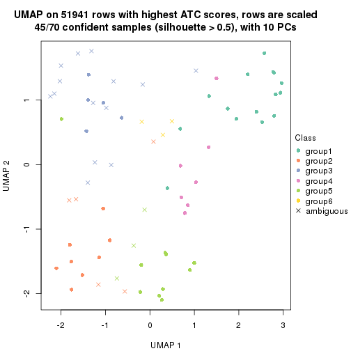</p>

</div>
</div>


Following heatmap shows how subgroups are split when increasing `k`:

```r
collect_classes(res)
```

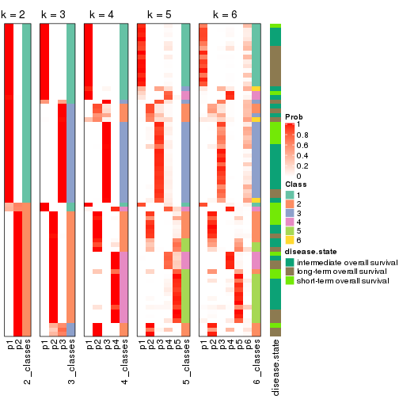


Test correlation between subgroups and known annotations. If the known
annotation is numeric, one-way ANOVA test is applied, and if the known
annotation is discrete, chi-squared contingency table test is applied.

```r
test_to_known_factors(res)
```

```
#>          n disease.state(p) k
#> ATC:NMF 68           0.7529 2
#> ATC:NMF 67           0.4343 3
#> ATC:NMF 68           0.4740 4
#> ATC:NMF 66           0.1802 5
#> ATC:NMF 45           0.0861 6
```


If matrix rows can be associated to genes, consider to use `GO_Enrichment(res,
...)` to perform function enrichment for the signature genes.


 

## Session info


```r
sessionInfo()
```

```
#> R version 3.6.0 (2019-04-26)
#> Platform: x86_64-pc-linux-gnu (64-bit)
#> Running under: CentOS Linux 7 (Core)
#> 
#> Matrix products: default
#> BLAS:   /usr/lib64/libblas.so.3.4.2
#> LAPACK: /usr/lib64/liblapack.so.3.4.2
#> 
#> locale:
#>  [1] LC_CTYPE=en_GB.UTF-8       LC_NUMERIC=C               LC_TIME=en_GB.UTF-8       
#>  [4] LC_COLLATE=en_GB.UTF-8     LC_MONETARY=en_GB.UTF-8    LC_MESSAGES=en_GB.UTF-8   
#>  [7] LC_PAPER=en_GB.UTF-8       LC_NAME=C                  LC_ADDRESS=C              
#> [10] LC_TELEPHONE=C             LC_MEASUREMENT=en_GB.UTF-8 LC_IDENTIFICATION=C       
#> 
#> attached base packages:
#> [1] grid      parallel  stats     graphics  grDevices utils     datasets  methods   base     
#> 
#> other attached packages:
#>  [1] genefilter_1.66.0     ComplexHeatmap_2.1.1  markdown_1.1          knitr_1.26           
#>  [5] preprocessCore_1.46.0 cola_1.3.2            GEOquery_2.52.0       Biobase_2.44.0       
#>  [9] BiocGenerics_0.30.0   GetoptLong_0.1.7     
#> 
#> loaded via a namespace (and not attached):
#>  [1] bitops_1.0-6         matrixStats_0.55.0   bit64_0.9-7          doParallel_1.0.15   
#>  [5] RColorBrewer_1.1-2   httr_1.4.1           tools_3.6.0          backports_1.1.5     
#>  [9] R6_2.4.1             DBI_1.0.0            lazyeval_0.2.2       colorspace_1.4-1    
#> [13] withr_2.1.2          tidyselect_0.2.5     gridExtra_2.3        bit_1.1-14          
#> [17] compiler_3.6.0       xml2_1.2.2           microbenchmark_1.4-7 pkgmaker_0.28       
#> [21] slam_0.1-46          scales_1.1.0         readr_1.3.1          NMF_0.23.6          
#> [25] stringr_1.4.0        digest_0.6.23        pkgconfig_2.0.3      bibtex_0.4.2        
#> [29] highr_0.8            limma_3.40.6         rlang_0.4.2          GlobalOptions_0.1.1 
#> [33] RSQLite_2.1.2        impute_1.58.0        shape_1.4.4          mclust_5.4.5        
#> [37] dendextend_1.12.0    dplyr_0.8.3          RCurl_1.95-4.12      magrittr_1.5        
#> [41] Matrix_1.2-17        Rcpp_1.0.3           munsell_0.5.0        S4Vectors_0.22.1    
#> [45] viridis_0.5.1        lifecycle_0.1.0      stringi_1.4.3        plyr_1.8.4          
#> [49] blob_1.2.0           crayon_1.3.4         lattice_0.20-38      splines_3.6.0       
#> [53] annotate_1.62.0      circlize_0.4.9       hms_0.5.2            zeallot_0.1.0       
#> [57] pillar_1.4.2         rjson_0.2.20         rngtools_1.4         reshape2_1.4.3      
#> [61] codetools_0.2-16     stats4_3.6.0         XML_3.98-1.20        glue_1.3.1          
#> [65] evaluate_0.14        png_0.1-7            vctrs_0.2.0          foreach_1.4.7       
#> [69] polyclip_1.10-0      gtable_0.3.0         purrr_0.3.3          tidyr_1.0.0         
#> [73] clue_0.3-57          assertthat_0.2.1     ggplot2_3.2.1        xfun_0.11           
#> [77] gridBase_0.4-7       eulerr_6.0.0         xtable_1.8-4         skmeans_0.2-11      
#> [81] survival_2.44-1.1    viridisLite_0.3.0    tibble_2.1.3         iterators_1.0.12    
#> [85] AnnotationDbi_1.46.1 registry_0.5-1       memoise_1.1.0        IRanges_2.18.3      
#> [89] cluster_2.1.0        brew_1.0-6
```


